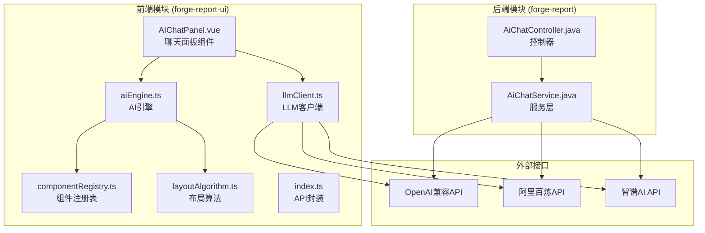
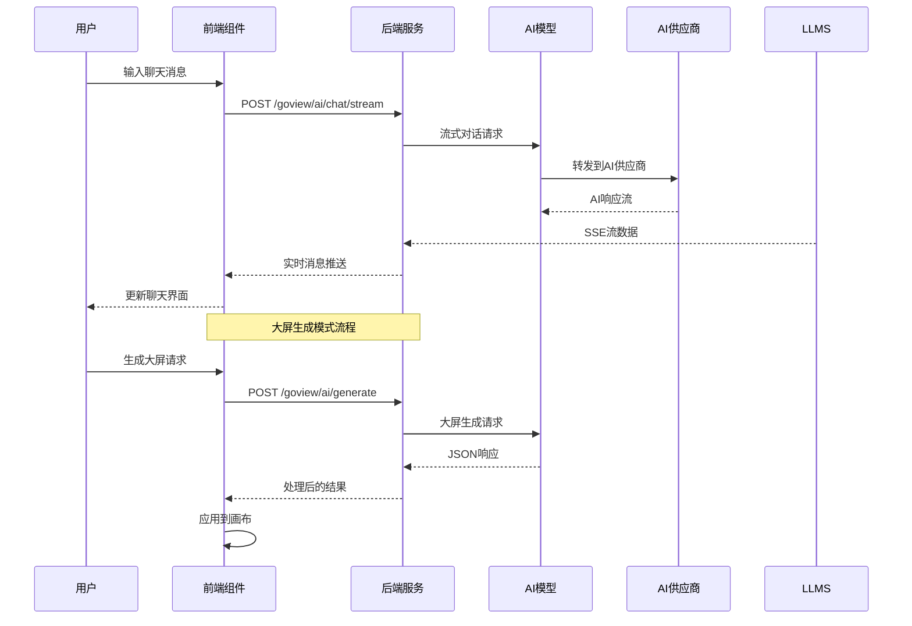
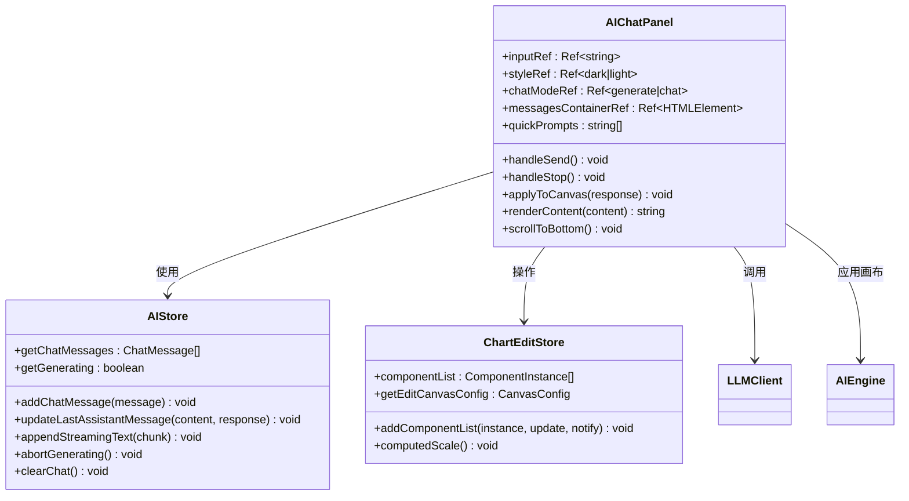
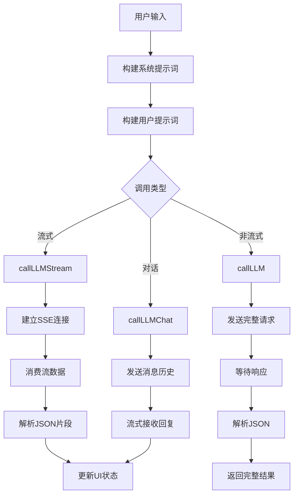
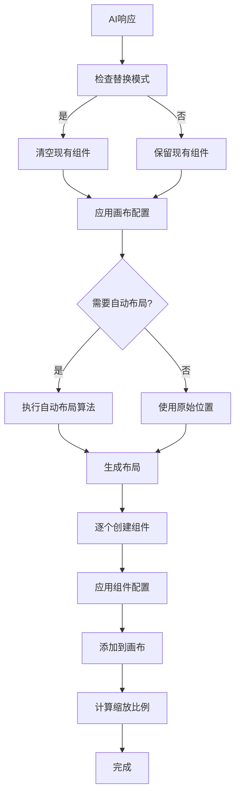
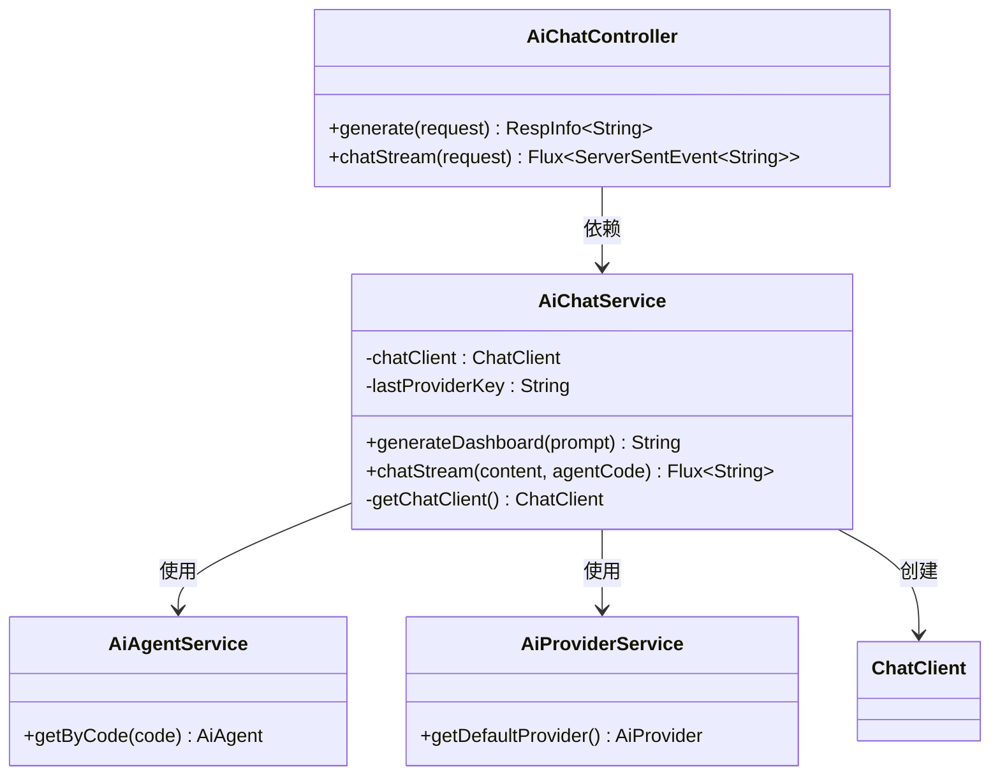
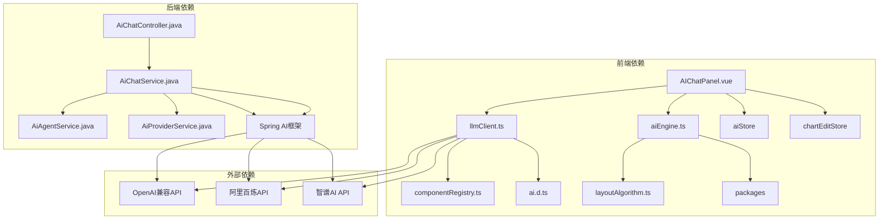

# AI聊天对话功能

<cite>
**本文档引用的文件**
- [AiChatController.java](file://forge/forge-report/src/main/java/com/mdframe/forge/report/ai/chat/controller/AiChatController.java)
- [AiChatService.java](file://forge/forge-report/src/main/java/com/mdframe/forge/report/ai/chat/service/AiChatService.java)
- [AIChatPanel.vue](file://forge-report-ui/src/components/GoAI/AIChatPanel.vue)
- [llmClient.ts](file://forge-report-ui/src/components/GoAI/llmClient.ts)
- [aiEngine.ts](file://forge-report-ui/src/components/GoAI/aiEngine.ts)
- [index.ts](file://forge-report-ui/src/api/ai/index.ts)
- [ai.d.ts](file://forge-report-ui/src/api/ai/ai.d.ts)
- [componentRegistry.ts](file://forge-report-ui/src/components/GoAI/componentRegistry.ts)
- [layoutAlgorithm.ts](file://forge-report-ui/src/components/GoAI/layoutAlgorithm.ts)
</cite>

## 目录
1. [简介](#简介)
2. [项目结构](#项目结构)
3. [核心组件](#核心组件)
4. [架构概览](#架构概览)
5. [详细组件分析](#详细组件分析)
6. [依赖关系分析](#依赖关系分析)
7. [性能考虑](#性能考虑)
8. [故障排除指南](#故障排除指南)
9. [结论](#结论)

## 简介

AI聊天对话功能是GoView数据大屏平台的核心智能助手功能，提供了两种主要模式：AI大屏生成和智能对话聊天。该功能通过集成Spring AI框架和前端Vue组件，实现了从自然语言描述到可视化大屏的智能转换，以及流畅的实时对话体验。

系统支持多种AI供应商（阿里百炼、OpenAI、智谱AI等），采用OpenAI兼容接口设计，确保了良好的扩展性和兼容性。前端采用现代化的Vue 3 + TypeScript技术栈，后端基于Spring Boot构建，实现了完整的全栈AI对话解决方案。

## 项目结构

AI聊天功能分布在前后端两个主要模块中，形成了清晰的分层架构：

**图表来源**
- [AIChatPanel.vue:1-540](file://forge-report-ui/src/components/GoAI/AIChatPanel.vue#L1-540)
- [AiChatController.java:1-59](file://forge/forge-report/src/main/java/com/mdframe/forge/report/ai/chat/controller/AiChatController.java#L1-59)
- [AiChatService.java:1-110](file://forge/forge-report/src/main/java/com/mdframe/forge/report/ai/chat/service/AiChatService.java#L1-110)

**章节来源**
- [AIChatPanel.vue:1-540](file://forge-report-ui/src/components/GoAI/AIChatPanel.vue#L1-540)
- [AiChatController.java:1-59](file://forge/forge-report/src/main/java/com/mdframe/forge/report/ai/chat/controller/AiChatController.java#L1-59)

## 核心组件

### 前端核心组件

前端AI聊天功能由多个精心设计的组件构成，每个组件都有明确的职责分工：

**AIChatPanel.vue** - 主聊天面板组件，负责用户界面渲染和交互逻辑
- 支持两种工作模式：生成大屏和自由对话
- 实现了流式消息显示和实时更新
- 提供快捷提示词和样式切换功能

**llmClient.ts** - LLM客户端，封装了与AI模型的通信逻辑
- 支持多种AI供应商的统一接口
- 实现了系统提示词构建和用户提示词处理
- 提供流式和非流式两种调用方式

**aiEngine.ts** - AI引擎，负责将AI生成的大屏方案应用到画布
- 实现了组件创建和配置应用
- 提供自动布局和样式适配功能
- 支持ECharts和VChart等多种图表框架

### 后端核心组件

**AiChatController.java** - 控制器层，处理HTTP请求和响应
- 提供AI生成大屏和流式对话两个主要接口
- 实现了SSE服务器发送事件流
- 处理异常情况和错误响应

**AiChatService.java** - 服务层，封装AI业务逻辑
- 支持多AI供应商的动态切换
- 实现了Agent模式的系统提示词管理
- 提供真正的SSE流式输出能力

**章节来源**
- [AIChatPanel.vue:130-350](file://forge-report-ui/src/components/GoAI/AIChatPanel.vue#L130-350)
- [llmClient.ts:1-341](file://forge-report-ui/src/components/GoAI/llmClient.ts#L1-341)
- [aiEngine.ts:1-202](file://forge-report-ui/src/components/GoAI/aiEngine.ts#L1-202)
- [AiChatController.java:21-58](file://forge/forge-report/src/main/java/com/mdframe/forge/report/ai/chat/controller/AiChatController.java#L21-58)
- [AiChatService.java:30-110](file://forge/forge-report/src/main/java/com/mdframe/forge/report/ai/chat/service/AiChatService.java#L30-110)

## 架构概览

AI聊天功能采用了典型的前后端分离架构，结合了微服务设计理念：

**图表来源**
- [AiChatController.java:42-57](file://forge/forge-report/src/main/java/com/mdframe/forge/report/ai/chat/controller/AiChatController.java#L42-57)
- [index.ts:20-87](file://forge-report-ui/src/api/ai/index.ts#L20-87)
- [llmClient.ts:178-226](file://forge-report-ui/src/components/GoAI/llmClient.ts#L178-226)

系统架构特点：
- **多供应商支持**：通过统一的OpenAI兼容接口支持多家AI供应商
- **流式处理**：采用SSE技术实现实时消息传输
- **组件化设计**：前后端都采用了高度模块化的组件架构
- **配置驱动**：通过环境变量和配置文件实现灵活部署

## 详细组件分析

### AI聊天面板组件分析

AIChatPanel.vue是整个AI聊天功能的核心界面组件，实现了丰富的用户交互功能：

**图表来源**
- [AIChatPanel.vue:130-350](file://forge-report-ui/src/components/GoAI/AIChatPanel.vue#L130-350)

组件特性：
- **双模式支持**：智能对话模式和大屏生成模式
- **实时流式显示**：支持SSE流式消息的实时渲染
- **智能布局**：自动计算消息容器滚动位置
- **快捷操作**：提供预设提示词和一键应用功能

**章节来源**
- [AIChatPanel.vue:130-350](file://forge-report-ui/src/components/GoAI/AIChatPanel.vue#L130-350)

### LLM客户端组件分析

llmClient.ts实现了与各种AI模型的统一接口：

**图表来源**
- [llmClient.ts:178-270](file://forge-report-ui/src/components/GoAI/llmClient.ts#L178-270)

关键功能：
- **提示词构建**：根据画布尺寸和组件目录生成详细的系统提示
- **流式处理**：实现SSE流的完整处理和错误恢复
- **JSON解析**：从流式响应中提取和解析JSON数据
- **供应商适配**：支持多种AI供应商的统一接口

**章节来源**
- [llmClient.ts:12-341](file://forge-report-ui/src/components/GoAI/llmClient.ts#L12-341)

### AI引擎组件分析

aiEngine.ts负责将AI生成的大屏方案应用到实际画布中：

**图表来源**
- [aiEngine.ts:129-202](file://forge-report-ui/src/components/GoAI/aiEngine.ts#L129-202)

核心功能：
- **组件创建**：根据AI响应创建对应的画布组件实例
- **配置应用**：智能合并和应用组件配置选项
- **布局优化**：自动计算和优化组件布局位置
- **画布集成**：无缝集成到现有的画布编辑器中

**章节来源**
- [aiEngine.ts:129-202](file://forge-report-ui/src/components/GoAI/aiEngine.ts#L129-202)

### 后端服务组件分析

后端服务层提供了完整的AI对话处理能力：

**图表来源**
- [AiChatController.java:21-58](file://forge/forge-report/src/main/java/com/mdframe/forge/report/ai/chat/controller/AiChatController.java#L21-58)
- [AiChatService.java:30-110](file://forge/forge-report/src/main/java/com/mdframe/forge/report/ai/chat/service/AiChatService.java#L30-110)

服务特性：
- **动态客户端**：根据默认供应商动态创建ChatClient实例
- **Agent模式**：支持不同Agent的系统提示词管理
- **流式响应**：提供真正的SSE流式输出支持
- **异常处理**：完善的错误捕获和异常处理机制

**章节来源**
- [AiChatController.java:21-58](file://forge/forge-report/src/main/java/com/mdframe/forge/report/ai/chat/controller/AiChatController.java#L21-58)
- [AiChatService.java:30-110](file://forge/forge-report/src/main/java/com/mdframe/forge/report/ai/chat/service/AiChatService.java#L30-110)

## 依赖关系分析

AI聊天功能的依赖关系体现了清晰的分层架构设计：

**图表来源**
- [AIChatPanel.vue:130-140](file://forge-report-ui/src/components/GoAI/AIChatPanel.vue#L130-140)
- [llmClient.ts:1-8](file://forge-report-ui/src/components/GoAI/llmClient.ts#L1-8)
- [AiChatController.java:1-12](file://forge/forge-report/src/main/java/com/mdframe/forge/report/ai/chat/controller/AiChatController.java#L1-12)

依赖特点：
- **松耦合设计**：各组件间依赖关系清晰，便于维护和扩展
- **接口抽象**：通过统一接口抽象底层实现细节
- **配置驱动**：通过环境变量和配置文件管理外部依赖
- **版本兼容**：采用OpenAI兼容接口确保向前兼容性

**章节来源**
- [componentRegistry.ts:1-99](file://forge-report-ui/src/components/GoAI/componentRegistry.ts#L1-99)
- [AiChatService.java:17-26](file://forge/forge-report/src/main/java/com/mdframe/forge/report/ai/chat/service/AiChatService.java#L17-26)

## 性能考虑

AI聊天功能在设计时充分考虑了性能优化：

### 前端性能优化
- **虚拟滚动**：大量消息时采用虚拟滚动减少DOM节点数量
- **懒加载组件**：按需加载AI组件和图表库
- **内存管理**：及时清理流式处理中的临时数据
- **缓存策略**：缓存组件注册表和常用配置

### 后端性能优化
- **连接池管理**：复用ChatClient实例避免频繁创建销毁
- **异步处理**：使用Reactor框架实现非阻塞的流式处理
- **资源限制**：设置合理的超时和重试机制
- **错误隔离**：防止单个请求影响整个系统的稳定性

### 网络性能优化
- **SSE连接复用**：单个连接支持多条消息的流式传输
- **压缩传输**：启用Gzip压缩减少网络传输量
- **断线重连**：实现智能的断线检测和自动重连机制

## 故障排除指南

### 常见问题及解决方案

**AI响应格式错误**
- 症状：前端显示"AI返回的JSON格式无效"
- 原因：AI模型返回的不是标准JSON格式
- 解决：检查AI供应商的API配置和提示词构建

**流式连接中断**
- 症状：聊天界面显示连接断开或消息不完整
- 原因：网络不稳定或AI供应商限流
- 解决：实现自动重连机制和错误提示

**组件应用失败**
- 症状：点击"应用到画布"无响应或报错
- 原因：组件key不存在或配置不兼容
- 解决：检查组件注册表和配置类型映射

**章节来源**
- [llmClient.ts:154-167](file://forge-report-ui/src/components/GoAI/llmClient.ts#L154-167)
- [aiEngine.ts:83-124](file://forge-report-ui/src/components/GoAI/aiEngine.ts#L83-124)

### 调试技巧
- **日志追踪**：启用详细的日志记录便于问题定位
- **网络监控**：监控AI供应商API的响应时间和错误率
- **性能分析**：使用浏览器开发者工具分析前端性能瓶颈
- **后端监控**：监控Spring AI框架的连接状态和处理时间

## 结论

AI聊天对话功能通过精心设计的前后端架构，成功实现了从自然语言到可视化大屏的智能转换。系统具有以下优势：

**技术优势**
- 采用OpenAI兼容接口设计，具备良好的扩展性
- 实现了真正的SSE流式处理，提供流畅的用户体验
- 通过组件化设计实现了高度的模块化和可维护性

**功能优势**
- 支持双模式操作：智能对话和大屏生成
- 提供丰富的快捷操作和个性化配置
- 实现了智能布局和自动适配功能

**架构优势**
- 清晰的分层设计便于维护和扩展
- 松耦合的组件关系提高了系统的灵活性
- 配置驱动的设计降低了部署复杂度

未来可以进一步优化的方向包括：增强AI模型的定制化能力、优化大屏生成的算法效率、增加更多的交互式功能等。整体而言，这是一个设计精良、实现优秀的AI聊天对话系统。