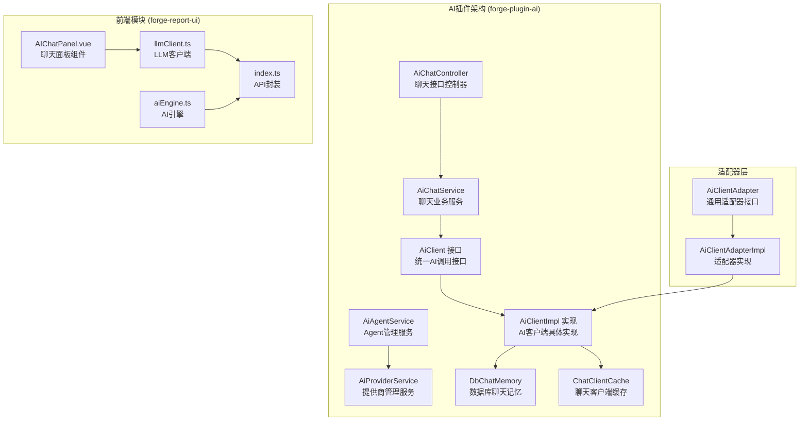
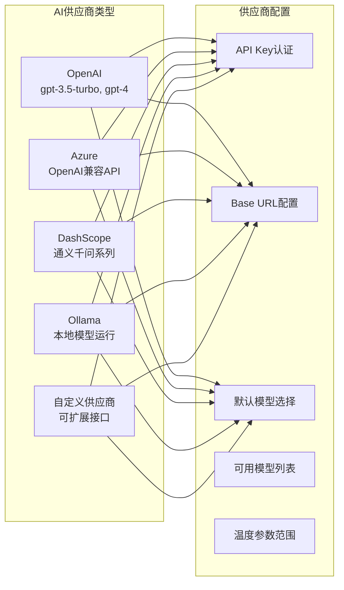
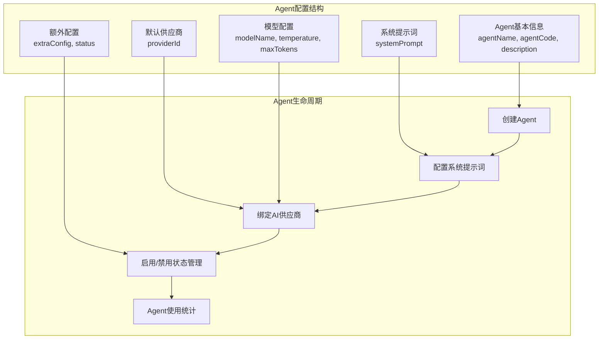
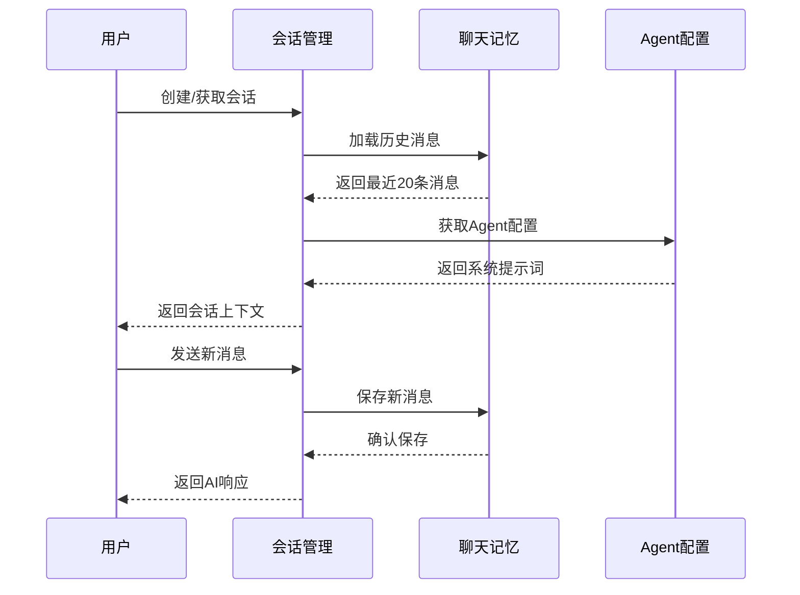
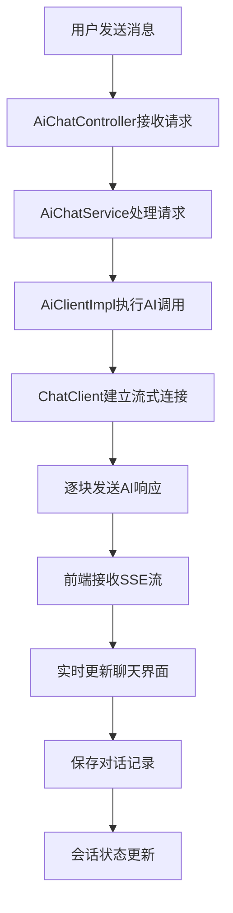
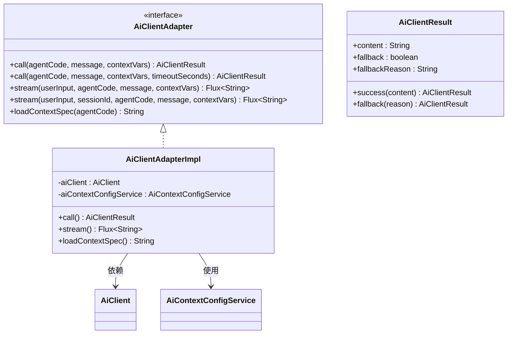
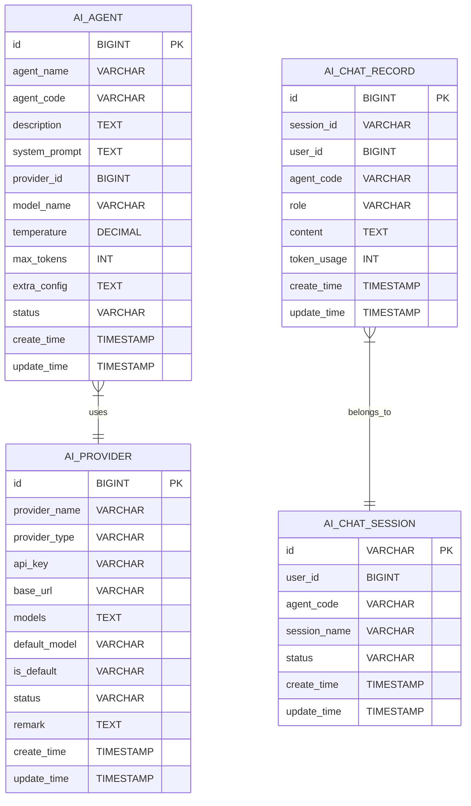
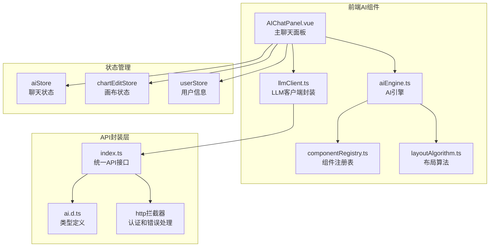

# AI聊天对话功能

<cite>
**本文档引用的文件**
- [AiChatController.java](file://forge/forge-framework/forge-plugin-parent/forge-plugin-ai/src/main/java/com/mdframe/forge/plugin/ai/chat/controller/AiChatController.java)
- [AiChatService.java](file://forge/forge-framework/forge-plugin-parent/forge-plugin-ai/src/main/java/com/mdframe/forge/plugin/ai/chat/service/AiChatService.java)
- [AiClient.java](file://forge/forge-framework/forge-plugin-parent/forge-plugin-ai/src/main/java/com/mdframe/forge/plugin/ai/client/AiClient.java)
- [AiClientImpl.java](file://forge/forge-framework/forge-plugin-parent/forge-plugin-ai/src/main/java/com/mdframe/forge/plugin/ai/client/AiClientImpl.java)
- [AiClientRequest.java](file://forge/forge-framework/forge-plugin-parent/forge-plugin-ai/src/main/java/com/mdframe/forge/plugin/ai/client/dto/AiClientRequest.java)
- [AiClientResponse.java](file://forge/forge-framework/forge-plugin-parent/forge-plugin-ai/src/main/java/com/mdframe/forge/plugin/ai/client/dto/AiClientResponse.java)
- [AiAgent.java](file://forge/forge-framework/forge-plugin-parent/forge-plugin-ai/src/main/java/com/mdframe/forge/plugin/ai/agent/domain/AiAgent.java)
- [AiProvider.java](file://forge/forge-framework/forge-plugin-parent/forge-plugin-ai/src/main/java/com/mdframe/forge/plugin/ai/provider/domain/AiProvider.java)
- [AiAgentService.java](file://forge/forge-framework/forge-plugin-parent/forge-plugin-ai/src/main/java/com/mdframe/forge/plugin/ai/agent/service/AiAgentService.java)
- [AiProviderService.java](file://forge/forge-framework/forge-plugin-parent/forge-plugin-ai/src/main/java/com/mdframe/forge/plugin/ai/provider/service/AiProviderService.java)
- [AIChatPanel.vue](file://forge-report-ui/src/components/GoAI/AIChatPanel.vue)
- [llmClient.ts](file://forge-report-ui/src/components/GoAI/llmClient.ts)
- [aiEngine.ts](file://forge-report-ui/src/components/GoAI/aiEngine.ts)
- [index.ts](file://forge-report-ui/src/api/ai/index.ts)
- [ai.d.ts](file://forge-report-ui/src/api/ai/ai.d.ts)
- [componentRegistry.ts](file://forge-report-ui/src/components/GoAI/componentRegistry.ts)
- [layoutAlgorithm.ts](file://forge-report-ui/src/components/GoAI/layoutAlgorithm.ts)
- [AiClientAdapter.java](file://forge/forge-framework/forge-plugin-parent/forge-plugin-generator/src/main/java/com/mdframe/forge/plugin/generator/service/AiClientAdapter.java)
- [AiClientAdapterImpl.java](file://forge/forge-admin-server/src/main/java/com/mdframe/forge/admin/bridge/AiClientAdapterImpl.java)
- [ai.md](file://forge-docs/backend/modules/ai.md)
</cite>

## 更新摘要
**所做更改**
- 新增AI插件架构（forge-plugin-ai）的完整文档
- 更新多提供商支持和Agent管理功能
- 增强流式对话和会话管理特性
- 添加AI客户端适配器和通用接口定义
- 更新数据库表结构和REST API规范

## 目录
1. [简介](#简介)
2. [AI插件架构概览](#ai插件架构概览)
3. [核心组件](#核心组件)
4. [多提供商支持](#多提供商支持)
5. [Agent管理系统](#agent管理系统)
6. [会话管理](#会话管理)
7. [流式对话实现](#流式对话实现)
8. [AI客户端适配器](#ai客户端适配器)
9. [数据库设计](#数据库设计)
10. [REST API规范](#rest-api规范)
11. [前端集成](#前端集成)
12. [性能优化](#性能优化)
13. [故障排除](#故障排除)
14. [总结](#总结)

## 简介

AI聊天对话功能是GoView数据大屏平台的核心智能助手功能，现已升级为基于全新AI插件架构（forge-plugin-ai）的增强版本。该功能提供了两种主要模式：AI大屏生成和智能对话聊天，并通过集成Spring AI框架和前端Vue组件，实现了从自然语言描述到可视化大屏的智能转换，以及流畅的实时对话体验。

新架构支持多种AI供应商（OpenAI、Azure、DashScope、Ollama等），采用统一的AI客户端接口设计，确保了良好的扩展性和兼容性。系统还引入了Agent管理模式、会话管理和流式对话处理等高级特性，为用户提供更加智能化和个性化的AI服务体验。

## AI插件架构概览

全新的AI插件架构采用了模块化设计，将AI功能拆分为独立的插件模块，提供了更好的可维护性和扩展性：

**图表来源**
- [AiClient.java:7-12](file://forge/forge-framework/forge-plugin-parent/forge-plugin-ai/src/main/java/com/mdframe/forge/plugin/ai/client/AiClient.java#L7-L12)
- [AiClientImpl.java:35-44](file://forge/forge-framework/forge-plugin-parent/forge-plugin-ai/src/main/java/com/mdframe/forge/plugin/ai/client/AiClientImpl.java#L35-L44)
- [AiChatController.java:34-91](file://forge/forge-framework/forge-plugin-parent/forge-plugin-ai/src/main/java/com/mdframe/forge/plugin/ai/chat/controller/AiChatController.java#L34-L91)

**章节来源**
- [AiClient.java:1-13](file://forge/forge-framework/forge-plugin-parent/forge-plugin-ai/src/main/java/com/mdframe/forge/plugin/ai/client/AiClient.java#L1-L13)
- [AiClientImpl.java:1-200](file://forge/forge-framework/forge-plugin-parent/forge-plugin-ai/src/main/java/com/mdframe/forge/plugin/ai/client/AiClientImpl.java#L1-L200)

## 核心组件

### AI客户端接口层

**AiClient接口** - 定义了统一的AI调用接口，支持同步和流式两种调用方式
- 提供`call`方法用于同步AI调用
- 提供`stream`方法用于流式AI调用
- 支持响应式编程模型

**AiClientImpl实现** - 具体的AI客户端实现，集成了完整的AI调用逻辑
- 实现了AI供应商解析和选择
- 提供了熔断器和降级机制
- 支持会话管理和聊天记忆

### 聊天服务层

**AiChatController** - 聊天功能的HTTP接口控制器
- 提供AI生成大屏的REST接口
- 实现流式对话的SSE接口
- 支持会话管理和消息记录

**AiChatService** - 聊天业务逻辑的核心服务
- 处理大屏生成请求
- 实现流式对话处理
- 管理上下文和参数解析

### 管理服务层

**AiAgentService** - Agent管理服务
- 提供Agent的CRUD操作
- 支持Agent状态管理和配置
- 实现Agent编码唯一性校验

**AiProviderService** - AI提供商管理服务
- 管理多种AI供应商配置
- 提供连接测试功能
- 支持默认供应商设置

**章节来源**
- [AiClient.java:7-12](file://forge/forge-framework/forge-plugin-parent/forge-plugin-ai/src/main/java/com/mdframe/forge/plugin/ai/client/AiClient.java#L7-L12)
- [AiClientImpl.java:46-177](file://forge/forge-framework/forge-plugin-parent/forge-plugin-ai/src/main/java/com/mdframe/forge/plugin/ai/client/AiClientImpl.java#L46-L177)
- [AiChatController.java:34-91](file://forge/forge-framework/forge-plugin-parent/forge-plugin-ai/src/main/java/com/mdframe/forge/plugin/ai/chat/controller/AiChatController.java#L34-L91)
- [AiChatService.java:25-74](file://forge/forge-framework/forge-plugin-parent/forge-plugin-ai/src/main/java/com/mdframe/forge/plugin/ai/chat/service/AiChatService.java#L25-L74)
- [AiAgentService.java:15-19](file://forge/forge-framework/forge-plugin-parent/forge-plugin-ai/src/main/java/com/mdframe/forge/plugin/ai/agent/service/AiAgentService.java#L15-L19)
- [AiProviderService.java:31-101](file://forge/forge-framework/forge-plugin-parent/forge-plugin-ai/src/main/java/com/mdframe/forge/plugin/ai/provider/service/AiProviderService.java#L31-L101)

## 多提供商支持

新架构支持多种AI供应商，通过统一的接口抽象实现了跨供应商的兼容性：

**图表来源**
- [AiProvider.java:32-58](file://forge/forge-framework/forge-plugin-parent/forge-plugin-ai/src/main/java/com/mdframe/forge/plugin/ai/provider/domain/AiProvider.java#L32-L58)

### 供应商配置管理

**AiProvider实体** - 定义了AI供应商的基础配置信息
- 支持多种供应商类型标识
- 提供API密钥和基础URL配置
- 管理默认模型和可用模型列表

**连接测试功能** - 提供供应商连接验证机制
- 自动发送测试消息验证可用性
- 支持错误信息反馈和诊断
- 实现供应商健康状态监控

**默认供应商机制** - 实现供应商优先级和回退策略
- 支持设置默认供应商
- 实现供应商不可用时的自动切换
- 提供供应商负载均衡能力

**章节来源**
- [AiProvider.java:1-75](file://forge/forge-framework/forge-plugin-parent/forge-plugin-ai/src/main/java/com/mdframe/forge/plugin/ai/provider/domain/AiProvider.java#L1-L75)
- [AiProviderService.java:44-73](file://forge/forge-framework/forge-plugin-parent/forge-plugin-ai/src/main/java/com/mdframe/forge/plugin/ai/provider/service/AiProviderService.java#L44-L73)

## Agent管理系统

Agent管理系统是新架构的核心特性之一，提供了智能化的AI角色管理和配置能力：

**图表来源**
- [AiAgent.java:23-32](file://forge/forge-framework/forge-plugin-parent/forge-plugin-ai/src/main/java/com/mdframe/forge/plugin/ai/agent/domain/AiAgent.java#L23-L32)

### Agent配置详解

**系统提示词管理** - Agent的核心行为定义
- 提供详细的系统提示词模板
- 支持动态参数注入和上下文适配
- 实现Agent角色的专业化和个性化

**参数继承机制** - 实现灵活的参数解析和回退
- 支持显式参数覆盖Agent配置
- 实现供应商配置的自动继承
- 提供默认值和回退链机制

**状态管理** - Agent的启用和禁用控制
- 实现Agent状态的实时监控
- 支持批量状态管理和批量操作
- 提供Agent使用情况的统计分析

**章节来源**
- [AiAgent.java:1-34](file://forge/forge-framework/forge-plugin-parent/forge-plugin-ai/src/main/java/com/mdframe/forge/plugin/ai/agent/domain/AiAgent.java#L1-L34)
- [AiAgentService.java:15-19](file://forge/forge-framework/forge-plugin-parent/forge-plugin-ai/src/main/java/com/mdframe/forge/plugin/ai/agent/service/AiAgentService.java#L15-L19)

## 会话管理

新架构引入了完整的会话管理系统，支持多轮对话的记忆和上下文管理：

**图表来源**
- [AiChatController.java:72-91](file://forge/forge-framework/forge-plugin-parent/forge-plugin-ai/src/main/java/com/mdframe/forge/plugin/ai/chat/controller/AiChatController.java#L72-L91)

### 会话存储机制

**DbChatMemory实现** - 基于数据库的聊天记忆存储
- 实现Spring AI的ChatMemory接口
- 存储对话历史到ai_chat_record表
- 默认保留最近20条消息作为上下文

**会话生命周期管理** - 完整的会话状态跟踪
- 自动生成会话ID和会话名称
- 支持会话状态的实时更新
- 提供会话统计和趋势分析

**上下文参数解析** - 智能的参数继承和解析
- 实现参数优先级解析链
- 支持Agent配置、供应商配置和默认值的层级继承
- 提供参数验证和错误处理机制

**章节来源**
- [AiChatController.java:72-91](file://forge/forge-framework/forge-plugin-parent/forge-plugin-ai/src/main/java/com/mdframe/forge/plugin/ai/chat/controller/AiChatController.java#L72-L91)
- [AiChatService.java:57-74](file://forge/forge-framework/forge-plugin-parent/forge-plugin-ai/src/main/java/com/mdframe/forge/plugin/ai/chat/service/AiChatService.java#L57-L74)

## 流式对话实现

新架构实现了真正的流式对话处理，通过SSE（Server-Sent Events）技术提供实时的消息传输：

**图表来源**
- [AiChatController.java:72-91](file://forge/forge-framework/forge-plugin-parent/forge-plugin-ai/src/main/java/com/mdframe/forge/plugin/ai/chat/controller/AiChatController.java#L72-L91)
- [AiClientImpl.java:106-177](file://forge/forge-framework/forge-plugin-parent/forge-plugin-ai/src/main/java/com/mdframe/forge/plugin/ai/client/AiClientImpl.java#L106-L177)

### 流式处理特性

**SSE流式传输** - 实现高效的实时消息传输
- 支持TEXT_EVENT_STREAM媒体类型
- 实现事件类型区分（message、done、error）
- 提供流式数据的可靠传输机制

**响应式编程模型** - 基于Reactor的异步处理
- 使用Flux响应式类型处理流式数据
- 实现背压处理和内存优化
- 支持流式数据的错误处理和恢复

**会话持久化** - 实现对话记录的异步保存
- 在流式处理完成后异步保存对话
- 实现原子性的保存操作防止重复
- 支持会话状态的最终一致性

**章节来源**
- [AiChatController.java:51-66](file://forge/forge-framework/forge-plugin-parent/forge-plugin-ai/src/main/java/com/mdframe/forge/plugin/ai/chat/controller/AiChatController.java#L51-L66)
- [AiClientImpl.java:146-177](file://forge/forge-framework/forge-plugin-parent/forge-plugin-ai/src/main/java/com/mdframe/forge/plugin/ai/client/AiClientImpl.java#L146-L177)

## AI客户端适配器

为了支持更广泛的AI调用场景，新架构引入了AI客户端适配器模式：

**图表来源**
- [AiClientAdapter.java:6-23](file://forge/forge-framework/forge-plugin-parent/forge-plugin-generator/src/main/java/com/mdframe/forge/plugin/generator/service/AiClientAdapter.java#L6-L23)
- [AiClientAdapterImpl.java:18-70](file://forge/forge-admin-server/src/main/java/com/mdframe/forge/admin/bridge/AiClientAdapterImpl.java#L18-L70)

### 适配器设计模式

**统一接口抽象** - 提供标准化的AI调用接口
- 支持同步和流式两种调用方式
- 实现超时控制和降级处理
- 提供上下文变量的统一管理

**智能降级机制** - 实现AI调用的故障转移
- 检测AI调用失败并执行降级
- 提供降级原因的详细信息
- 支持降级策略的配置和管理

**上下文配置管理** - 实现动态上下文注入
- 支持Agent级别的上下文配置
- 实现上下文配置的排序和拼接
- 提供上下文变量的动态注入

**章节来源**
- [AiClientAdapter.java:1-42](file://forge/forge-framework/forge-plugin-parent/forge-plugin-generator/src/main/java/com/mdframe/forge/plugin/generator/service/AiClientAdapter.java#L1-L42)
- [AiClientAdapterImpl.java:23-70](file://forge/forge-admin-server/src/main/java/com/mdframe/forge/admin/bridge/AiClientAdapterImpl.java#L23-L70)

## 数据库设计

新架构引入了完整的数据库表结构，支持AI功能的持久化存储：

**图表来源**
- [ai.md:139-144](file://forge-docs/backend/modules/ai.md#L139-L144)

### 表结构详解

**AI_PROVIDER表** - AI供应商配置表
- 存储各种AI供应商的基本信息
- 支持多种供应商类型的配置
- 提供供应商状态和默认设置

**AI_AGENT表** - AI Agent配置表
- 存储Agent的系统提示词和配置
- 支持Agent的状态管理和分类
- 提供Agent与供应商的关联关系

**AI_CHAT_SESSION表** - 聊天会话表
- 记录用户的AI对话会话
- 支持会话状态和统计信息
- 提供会话的生命周期管理

**AI_CHAT_RECORD表** - 聊天记录表
- 存储详细的对话历史
- 支持用户、AI和系统消息的分类
- 提供Token使用量的统计

**章节来源**
- [ai.md:139-144](file://forge-docs/backend/modules/ai.md#L139-L144)

## REST API规范

新架构提供了完整的REST API接口，支持AI功能的各种操作：

### 聊天接口

| 方法 | 路径 | 说明 |
|------|------|------|
| POST | `/api/ai/chat/stream` | 流式对话（SSE） |
| POST | `/api/ai/dashboard` | 生成 Dashboard |
| POST | `/api/ai/dashboard/stream` | 流式生成 Dashboard |

### Agent管理接口

| 方法 | 路径 | 说明 |
|------|------|------|
| GET | `/api/ai/agent/page` | 分页查询 Agent |
| GET | `/api/ai/agent/{id}` | 获取 Agent 详情 |
| POST | `/api/ai/agent` | 创建 Agent |
| PUT | `/api/ai/agent` | 更新 Agent |
| DELETE | `/api/ai/agent/{id}` | 删除 Agent |

### Provider管理接口

| 方法 | 路径 | 说明 |
|------|------|------|
| GET | `/api/ai/provider/page` | 分页查询 Provider |
| GET | `/api/ai/provider/{id}` | 获取 Provider 详情 |
| POST | `/api/ai/provider` | 创建 Provider |
| PUT | `/api/ai/provider` | 更新 Provider |
| DELETE | `/api/ai/provider/{id}` | 删除 Provider |

### 会话管理接口

| 方法 | 路径 | 说明 |
|------|------|------|
| GET | `/api/ai/session/list` | 获取会话列表 |
| GET | `/api/ai/session/{sessionId}/messages` | 获取会话消息 |
| DELETE | `/api/ai/session/{sessionId}` | 删除会话 |

**章节来源**
- [ai.md:107-136](file://forge-docs/backend/modules/ai.md#L107-L136)

## 前端集成

前端模块通过统一的API封装和组件设计，实现了与后端AI插件的无缝集成：

**图表来源**
- [AIChatPanel.vue:130-350](file://forge-report-ui/src/components/GoAI/AIChatPanel.vue#L130-L350)
- [index.ts:159-276](file://forge-report-ui/src/api/ai/index.ts#L159-L276)

### 前端组件架构

**AIChatPanel组件** - 主要的聊天界面组件
- 支持双模式操作：智能对话和大屏生成
- 实现流式消息的实时渲染和处理
- 提供快捷提示词和样式切换功能

**llmClient封装** - LLM客户端的统一接口封装
- 支持多种AI供应商的统一调用
- 实现SSE流式数据的完整处理
- 提供错误恢复和重试机制

**aiEngine引擎** - AI生成结果的应用引擎
- 实现组件创建和配置应用
- 提供自动布局和样式适配
- 支持多种图表框架的集成

**章节来源**
- [AIChatPanel.vue:130-350](file://forge-report-ui/src/components/GoAI/AIChatPanel.vue#L130-L350)
- [llmClient.ts:178-270](file://forge-report-ui/src/components/GoAI/llmClient.ts#L178-L270)
- [aiEngine.ts:129-202](file://forge-report-ui/src/components/GoAI/aiEngine.ts#L129-L202)

## 性能优化

新架构在设计时充分考虑了性能优化和可扩展性：

### 后端性能优化

**连接池管理** - ChatClient实例的高效复用
- 实现ChatClient的缓存和复用机制
- 支持多供应商和多模型的连接池管理
- 提供连接池的监控和健康检查

**异步处理优化** - Reactor框架的响应式编程
- 使用Flux和Mono实现非阻塞处理
- 支持背压处理和内存优化
- 实现流式数据的高效传输

**熔断器模式** - AI调用的故障保护机制
- 实现智能的熔断和恢复策略
- 支持降级处理和错误传播
- 提供熔断状态的实时监控

### 前端性能优化

**虚拟滚动** - 大量消息的高效渲染
- 实现聊天消息的虚拟化渲染
- 动态计算可见区域和渲染范围
- 提供平滑的滚动体验和内存优化

**组件懒加载** - AI组件的按需加载
- 实现图表组件的动态注册
- 支持组件的延迟加载和缓存
- 提供组件加载状态的反馈

**流式处理优化** - SSE流的高效处理
- 实现流式数据的缓冲和批处理
- 支持流式数据的错误恢复和重连
- 提供流式处理的进度反馈

## 故障排除

### 常见问题及解决方案

**AI供应商连接失败**
- 症状：供应商连接测试失败或AI调用异常
- 原因：API Key配置错误、网络连接问题、Base URL配置不当
- 解决：检查供应商配置、验证网络连通性、确认API Key权限

**Agent配置错误**
- 症状：Agent无法使用或返回固定响应
- 原因：Agent编码不存在、系统提示词格式错误、供应商配置缺失
- 解决：验证Agent编码唯一性、检查系统提示词语法、确认供应商配置

**流式连接中断**
- 症状：聊天界面显示连接断开或消息不完整
- 原因：网络不稳定、AI供应商限流、前端SSE处理异常
- 解决：实现自动重连机制、检查网络状况、优化前端流式处理

**会话数据丢失**
- 症状：重新进入页面后会话历史消失
- 原因：会话ID生成冲突、数据库连接异常、事务处理失败
- 解决：检查会话ID生成算法、验证数据库连接、优化事务处理

**章节来源**
- [AiProviderService.java:44-73](file://forge/forge-framework/forge-plugin-parent/forge-plugin-ai/src/main/java/com/mdframe/forge/plugin/ai/provider/service/AiProviderService.java#L44-L73)
- [AiClientImpl.java:164-177](file://forge/forge-framework/forge-plugin-parent/forge-plugin-ai/src/main/java/com/mdframe/forge/plugin/ai/client/AiClientImpl.java#L164-L177)

### 调试技巧

**日志监控** - 详细的日志记录和分析
- 启用AI客户端的详细日志记录
- 监控供应商API的响应时间和错误率
- 分析Agent配置和参数解析过程

**性能分析** - 系统性能的实时监控
- 监控ChatClient连接池的使用情况
- 分析流式处理的性能瓶颈
- 优化数据库查询和缓存策略

**网络调试** - 网络连接的诊断和优化
- 监控SSE连接的稳定性和延迟
- 分析AI供应商API的响应特征
- 优化前端和后端的网络配置

## 总结

AI聊天对话功能通过全新的AI插件架构，实现了从单一功能到智能化平台的跨越。新架构具有以下显著优势：

**架构优势**
- 采用模块化设计，提供了更好的可维护性和扩展性
- 引入Agent管理模式，实现了AI角色的智能化和个性化
- 实现了完整的会话管理，支持多轮对话的记忆和上下文理解

**技术优势**
- 支持多种AI供应商，通过统一接口实现跨供应商兼容
- 实现了真正的流式对话处理，提供流畅的用户体验
- 引入熔断器和降级机制，提高了系统的稳定性和可靠性

**功能优势**
- 提供双模式操作：智能对话和大屏生成
- 支持丰富的快捷操作和个性化配置
- 实现了智能布局和自动适配功能

**集成优势**
- 前后端采用统一的API规范，便于集成和扩展
- 提供完整的数据库设计，支持数据持久化和分析
- 实现了组件化的前端架构，便于维护和升级

未来可以进一步优化的方向包括：增强AI模型的定制化能力、优化大屏生成的算法效率、增加更多的交互式功能、实现AI功能的可视化配置管理等。整体而言，这是一个设计精良、实现优秀且具有良好扩展性的AI聊天对话系统。