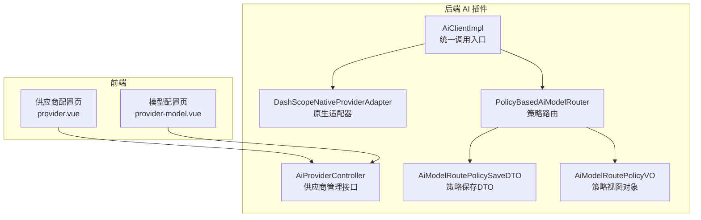
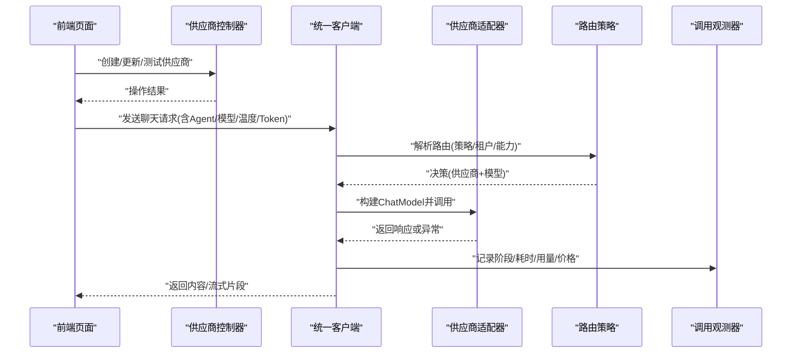
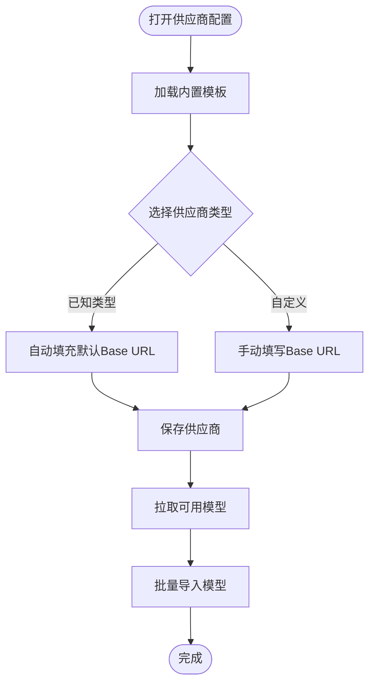
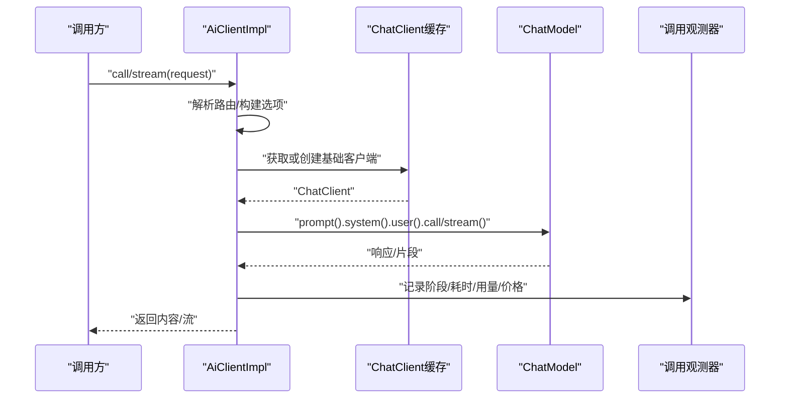
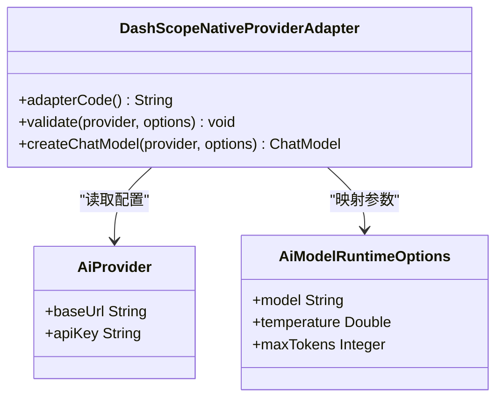
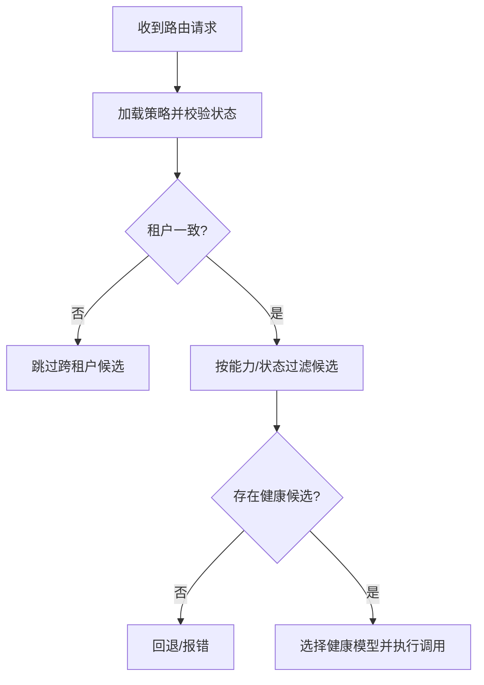
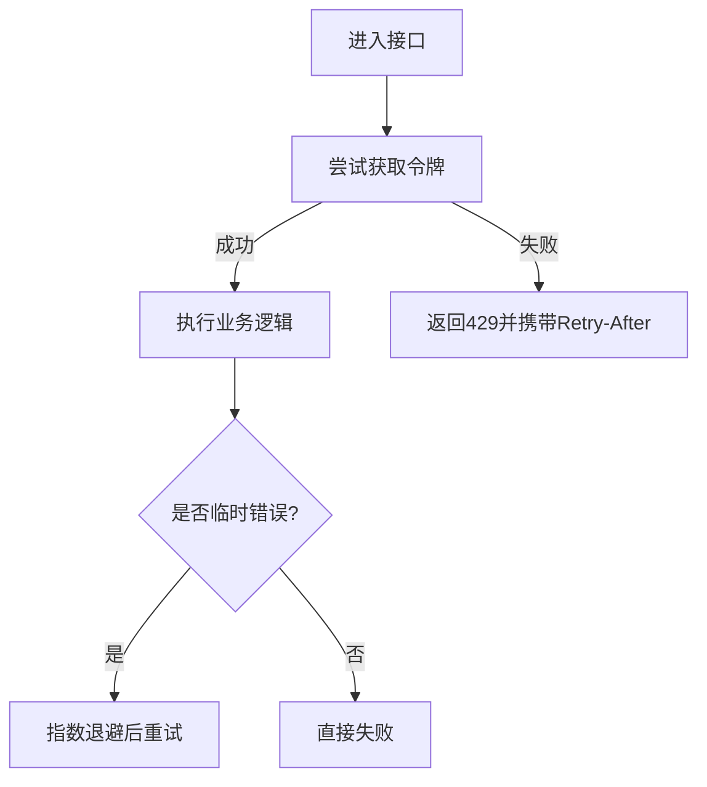
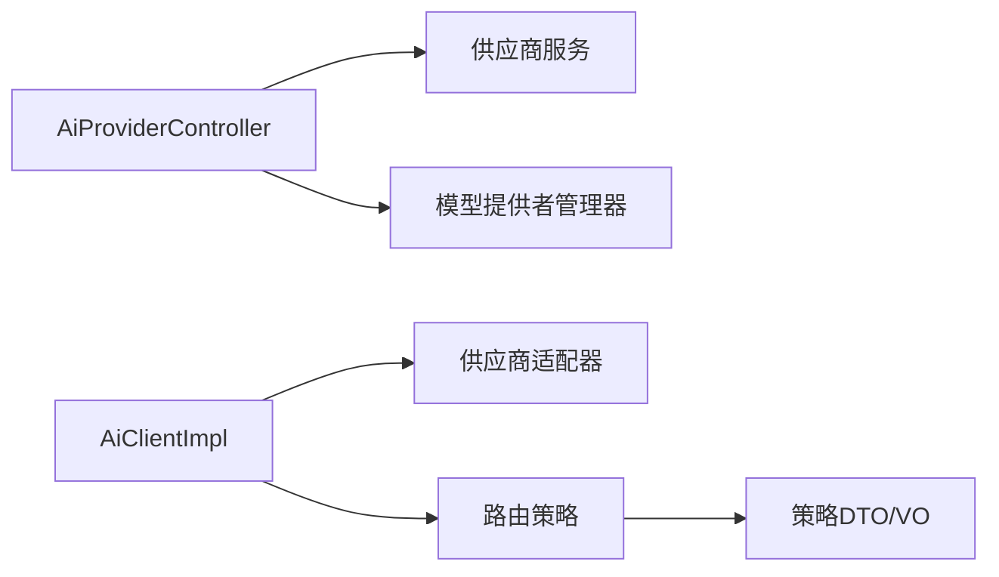

# AI供应商集成

<cite>
**本文引用的文件**
- [AiProviderController.java](file://forge-server/forge-framework/forge-plugin-parent/forge-plugin-ai/src/main/java/com/mdframe/forge/plugin/ai/provider/controller/AiProviderController.java)
- [AiClientImpl.java](file://forge-server/forge-framework/forge-plugin-parent/forge-plugin-ai/src/main/java/com/mdframe/forge/plugin/ai/client/AiClientImpl.java)
- [DashScopeNativeProviderAdapter.java](file://forge-server/forge-framework/forge-plugin-parent/forge-plugin-ai/src/main/java/com/mdframe/forge/plugin/ai/provider/adapter/DashScopeNativeProviderAdapter.java)
- [PolicyBasedAiModelRouter.java](file://forge-server/forge-framework/forge-plugin-parent/forge-plugin-ai/src/main/java/com/mdframe/forge/plugin/ai/routing/PolicyBasedAiModelRouter.java)
- [AiModelRoutePolicySaveDTO.java](file://forge-server/forge-framework/forge-plugin-parent/forge-plugin-ai/src/main/java/com/mdframe/forge/plugin/ai/routing/dto/AiModelRoutePolicySaveDTO.java)
- [AiModelRoutePolicyVO.java](file://forge-server/forge-framework/forge-plugin-parent/forge-plugin-ai/src/main/java/com/mdframe/forge/plugin/ai/routing/vo/AiModelRoutePolicyVO.java)
- [provider.vue](file://forge-admin-ui/src/views/ai/provider.vue)
- [provider-model.vue](file://forge-admin-ui/src/views/ai/provider-model.vue)
- [JobApiRateLimitManagerTest.java](file://forge-server/forge-framework/forge-plugin-parent/forge-plugin-job/src/test/java/com/mdframe/forge/plugin/job/manager/JobApiRateLimitManagerTest.java)
- [JobOpenApiExceptionHandlerTest.java](file://forge-server/forge-framework/forge-plugin-parent/forge-plugin-job/src/test/java/com/mdframe/forge/plugin/job/controller/JobOpenApiExceptionHandlerTest.java)
- [CollaborationRetryPolicy.java](file://forge-server/forge-framework/forge-plugin-parent/forge-plugin-collaboration/src/main/java/com/mdframe/forge/plugin/collaboration/service/CollaborationRetryPolicy.java)
</cite>

## 目录
1. [简介](#简介)
2. [项目结构](#项目结构)
3. [核心组件](#核心组件)
4. [架构总览](#架构总览)
5. [详细组件分析](#详细组件分析)
6. [依赖关系分析](#依赖关系分析)
7. [性能与限流](#性能与限流)
8. [故障排查指南](#故障排查指南)
9. [结论](#结论)
10. [附录](#附录)

## 简介
本技术文档围绕 Forge Admin 的 AI 供应商集成能力，系统说明如何接入 OpenAI、阿里百炼（DashScope）、智谱等主流供应商，并给出自定义供应商扩展方法。文档覆盖以下主题：
- 供应商与模型配置、默认端点策略、API 密钥管理
- 请求路由策略、负载均衡与健康探测
- 错误分类、重试与限流机制
- 调用观测、日志与审计
- 前端配置界面与后端接口联动
- 高可用部署建议与性能基准思路

## 项目结构
AI 相关能力集中在后端插件 forge-plugin-ai，提供供应商管理、模型管理、客户端封装、路由与健康治理；前端在 forge-admin-ui 中提供供应商与模型的可视化配置。

图表来源
- [AiProviderController.java:36-58](file://forge-server/forge-framework/forge-plugin-parent/forge-plugin-ai/src/main/java/com/mdframe/forge/plugin/ai/provider/controller/AiProviderController.java#L36-L58)
- [AiClientImpl.java:57-117](file://forge-server/forge-framework/forge-plugin-parent/forge-plugin-ai/src/main/java/com/mdframe/forge/plugin/ai/client/AiClientImpl.java#L57-L117)
- [DashScopeNativeProviderAdapter.java:22-52](file://forge-server/forge-framework/forge-plugin-parent/forge-plugin-ai/src/main/java/com/mdframe/forge/plugin/ai/provider/adapter/DashScopeNativeProviderAdapter.java#L22-L52)
- [PolicyBasedAiModelRouter.java:79-94](file://forge-server/forge-framework/forge-plugin-parent/forge-plugin-ai/src/main/java/com/mdframe/forge/plugin/ai/routing/PolicyBasedAiModelRouter.java#L79-L94)
- [AiModelRoutePolicySaveDTO.java:1-16](file://forge-server/forge-framework/forge-plugin-parent/forge-plugin-ai/src/main/java/com/mdframe/forge/plugin/ai/routing/dto/AiModelRoutePolicySaveDTO.java#L1-L16)
- [AiModelRoutePolicyVO.java:1-28](file://forge-server/forge-framework/forge-plugin-parent/forge-plugin-ai/src/main/java/com/mdframe/forge/plugin/ai/routing/vo/AiModelRoutePolicyVO.java#L1-L28)

章节来源
- [AiProviderController.java:36-58](file://forge-server/forge-framework/forge-plugin-parent/forge-plugin-ai/src/main/java/com/mdframe/forge/plugin/ai/provider/controller/AiProviderController.java#L36-L58)
- [provider.vue:157-197](file://forge-admin-ui/src/views/ai/provider.vue#L157-L197)
- [provider-model.vue:713-746](file://forge-admin-ui/src/views/ai/provider-model.vue#L713-L746)

## 核心组件
- 供应商管理控制器：提供内置模板、分页查询、创建/更新/删除、连接测试、默认设置、拉取模型与批量导入等能力。
- 统一客户端：封装非流式与流式调用，负责会话上下文注入、提示词渲染、健康租约管理、调用观测记录与异常处理。
- 供应商适配器：以适配者模式对接不同供应商 SDK（如 DashScope 原生），完成参数映射与模型构建。
- 路由策略：基于 Agent 配置的规则进行候选模型筛选、租户隔离、健康检查与选择决策。
- 前端配置：提供供应商类型与默认 Base URL 的智能回填、模型新增与导入流程。

章节来源
- [AiProviderController.java:71-183](file://forge-server/forge-framework/forge-plugin-parent/forge-plugin-ai/src/main/java/com/mdframe/forge/plugin/ai/provider/controller/AiProviderController.java#L71-L183)
- [AiClientImpl.java:57-247](file://forge-server/forge-framework/forge-plugin-parent/forge-plugin-ai/src/main/java/com/mdframe/forge/plugin/ai/client/AiClientImpl.java#L57-L247)
- [DashScopeNativeProviderAdapter.java:22-52](file://forge-server/forge-framework/forge-plugin-parent/forge-plugin-ai/src/main/java/com/mdframe/forge/plugin/ai/provider/adapter/DashScopeNativeProviderAdapter.java#L22-L52)
- [PolicyBasedAiModelRouter.java:79-94](file://forge-server/forge-framework/forge-plugin-parent/forge-plugin-ai/src/main/java/com/mdframe/forge/plugin/ai/routing/PolicyBasedAiModelRouter.java#L79-L94)
- [provider.vue:157-197](file://forge-admin-ui/src/views/ai/provider.vue#L157-L197)
- [provider-model.vue:713-746](file://forge-admin-ui/src/views/ai/provider-model.vue#L713-L746)

## 架构总览
下图展示一次典型聊天调用的端到端流程：前端发起请求，后端通过统一客户端解析路由、选择供应商与模型、执行调用、记录观测数据，并在失败时进行分类与降级。

图表来源
- [AiProviderController.java:113-183](file://forge-server/forge-framework/forge-plugin-parent/forge-plugin-ai/src/main/java/com/mdframe/forge/plugin/ai/provider/controller/AiProviderController.java#L113-L183)
- [AiClientImpl.java:57-117](file://forge-server/forge-framework/forge-plugin-parent/forge-plugin-ai/src/main/java/com/mdframe/forge/plugin/ai/client/AiClientImpl.java#L57-L117)
- [DashScopeNativeProviderAdapter.java:34-52](file://forge-server/forge-framework/forge-plugin-parent/forge-plugin-ai/src/main/java/com/mdframe/forge/plugin/ai/provider/adapter/DashScopeNativeProviderAdapter.java#L34-L52)
- [PolicyBasedAiModelRouter.java:79-94](file://forge-server/forge-framework/forge-plugin-parent/forge-plugin-ai/src/main/java/com/mdframe/forge/plugin/ai/routing/PolicyBasedAiModelRouter.java#L79-L94)

## 详细组件分析

### 供应商管理与模板
- 内置模板：提供阿里百炼（原生/兼容）、OpenAI、智谱、Moonshot、DeepSeek、Ollama、自定义等预设，便于快速初始化。
- 默认端点策略：前端根据供应商类型自动填充官方默认 Base URL；后端控制器暴露模板接口供前端使用。
- 模型拉取与导入：支持从供应商 /v1/models 拉取可用模型并批量导入到系统。

图表来源
- [AiProviderController.java:36-58](file://forge-server/forge-framework/forge-plugin-parent/forge-plugin-ai/src/main/java/com/mdframe/forge/plugin/ai/provider/controller/AiProviderController.java#L36-L58)
- [provider.vue:157-197](file://forge-admin-ui/src/views/ai/provider.vue#L157-L197)
- [provider-model.vue:713-746](file://forge-admin-ui/src/views/ai/provider-model.vue#L713-L746)

章节来源
- [AiProviderController.java:36-58](file://forge-server/forge-framework/forge-plugin-parent/forge-plugin-ai/src/main/java/com/mdframe/forge/plugin/ai/provider/controller/AiProviderController.java#L36-L58)
- [AiProviderController.java:165-183](file://forge-server/forge-framework/forge-plugin-parent/forge-plugin-ai/src/main/java/com/mdframe/forge/plugin/ai/provider/controller/AiProviderController.java#L165-L183)
- [provider.vue:157-197](file://forge-admin-ui/src/views/ai/provider.vue#L157-L197)
- [provider-model.vue:713-746](file://forge-admin-ui/src/views/ai/provider-model.vue#L713-L746)

### 统一客户端与调用链路
- 非流式调用：解析路由、构建 ChatClient、注入系统提示词与会话、执行调用、记录观测、持久化对话。
- 流式调用：按片段输出，合并“思考过程”与“回复内容”，最终落库并记录用量与耗时。
- 异常处理：区分业务异常与通用异常，记录失败原因与降级信息。

图表来源
- [AiClientImpl.java:57-117](file://forge-server/forge-framework/forge-plugin-parent/forge-plugin-ai/src/main/java/com/mdframe/forge/plugin/ai/client/AiClientImpl.java#L57-L117)
- [AiClientImpl.java:119-247](file://forge-server/forge-framework/forge-plugin-parent/forge-plugin-ai/src/main/java/com/mdframe/forge/plugin/ai/client/AiClientImpl.java#L119-L247)

章节来源
- [AiClientImpl.java:57-117](file://forge-server/forge-framework/forge-plugin-parent/forge-plugin-ai/src/main/java/com/mdframe/forge/plugin/ai/client/AiClientImpl.java#L57-L117)
- [AiClientImpl.java:119-247](file://forge-server/forge-framework/forge-plugin-parent/forge-plugin-ai/src/main/java/com/mdframe/forge/plugin/ai/client/AiClientImpl.java#L119-L247)
- [AiClientImpl.java:317-348](file://forge-server/forge-framework/forge-plugin-parent/forge-plugin-ai/src/main/java/com/mdframe/forge/plugin/ai/client/AiClientImpl.java#L317-L348)

### 供应商适配器（以阿里百炼为例）
- 适配器职责：校验 Base URL、构造原生 SDK 客户端、映射运行时参数（模型、温度、最大 Token）。
- 兼容性：对 DashScope 原生地址与兼容模式分别处理，确保端点正确拼接与兜底。

图表来源
- [DashScopeNativeProviderAdapter.java:22-52](file://forge-server/forge-framework/forge-plugin-parent/forge-plugin-ai/src/main/java/com/mdframe/forge/plugin/ai/provider/adapter/DashScopeNativeProviderAdapter.java#L22-L52)

章节来源
- [DashScopeNativeProviderAdapter.java:22-52](file://forge-server/forge-framework/forge-plugin-parent/forge-plugin-ai/src/main/java/com/mdframe/forge/plugin/ai/provider/adapter/DashScopeNativeProviderAdapter.java#L22-L52)

### 模型路由策略与负载均衡
- 策略选择：基于 Agent 的路由策略 ID，加载策略并校验状态与租户一致性。
- 候选过滤：按租户、启用状态、所需能力过滤候选模型，跳过不满足条件的项。
- 健康探测：结合健康注册表，优先选择健康可用的模型实例，实现简单负载均衡。

图表来源
- [PolicyBasedAiModelRouter.java:79-94](file://forge-server/forge-framework/forge-plugin-parent/forge-plugin-ai/src/main/java/com/mdframe/forge/plugin/ai/routing/PolicyBasedAiModelRouter.java#L79-L94)

章节来源
- [PolicyBasedAiModelRouter.java:79-94](file://forge-server/forge-framework/forge-plugin-parent/forge-plugin-ai/src/main/java/com/mdframe/forge/plugin/ai/routing/PolicyBasedAiModelRouter.java#L79-L94)
- [AiModelRoutePolicySaveDTO.java:1-16](file://forge-server/forge-framework/forge-plugin-parent/forge-plugin-ai/src/main/java/com/mdframe/forge/plugin/ai/routing/dto/AiModelRoutePolicySaveDTO.java#L1-L16)
- [AiModelRoutePolicyVO.java:1-28](file://forge-server/forge-framework/forge-plugin-parent/forge-plugin-ai/src/main/java/com/mdframe/forge/plugin/ai/routing/vo/AiModelRoutePolicyVO.java#L1-L28)

### API 密钥管理与安全
- 密钥存储：供应商配置中包含 API Key，控制器对外提供加密注解保护接口。
- 最小权限：仅将必要字段传递给底层 SDK，避免泄露敏感信息。
- 建议：在生产环境使用密钥管理服务（如 Vault/KMS）与动态刷新机制。

章节来源
- [AiProviderController.java:113-183](file://forge-server/forge-framework/forge-plugin-parent/forge-plugin-ai/src/main/java/com/mdframe/forge/plugin/ai/provider/controller/AiProviderController.java#L113-L183)
- [DashScopeNativeProviderAdapter.java:34-52](file://forge-server/forge-framework/forge-plugin-parent/forge-plugin-ai/src/main/java/com/mdframe/forge/plugin/ai/provider/adapter/DashScopeNativeProviderAdapter.java#L34-L52)

### 请求限流与重试
- 限流：通过分布式限流器实现按 Key 的速率限制，超出时返回标准限流状态码与重试头。
- 重试：对临时错误与限流采用指数退避策略，对永久错误或未授权直接拒绝重试。
- 建议：为 AI 调用增加独立限流维度（如租户/模型/供应商），并结合网关层做全局保护。

图表来源
- [JobApiRateLimitManagerTest.java:22-47](file://forge-server/forge-framework/forge-plugin-parent/forge-plugin-job/src/test/java/com/mdframe/forge/plugin/job/manager/JobApiRateLimitManagerTest.java#L22-L47)
- [JobOpenApiExceptionHandlerTest.java:37-60](file://forge-server/forge-framework/forge-plugin-parent/forge-plugin-job/src/test/java/com/mdframe/forge/plugin/job/controller/JobOpenApiExceptionHandlerTest.java#L37-L60)
- [CollaborationRetryPolicy.java:56-82](file://forge-server/forge-framework/forge-plugin-parent/forge-plugin-collaboration/src/main/java/com/mdframe/forge/plugin/collaboration/service/CollaborationRetryPolicy.java#L56-L82)

章节来源
- [JobApiRateLimitManagerTest.java:22-47](file://forge-server/forge-framework/forge-plugin-parent/forge-plugin-job/src/test/java/com/mdframe/forge/plugin/job/manager/JobApiRateLimitManagerTest.java#L22-L47)
- [JobOpenApiExceptionHandlerTest.java:37-60](file://forge-server/forge-framework/forge-plugin-parent/forge-plugin-job/src/test/java/com/mdframe/forge/plugin/job/controller/JobOpenApiExceptionHandlerTest.java#L37-L60)
- [CollaborationRetryPolicy.java:56-82](file://forge-server/forge-framework/forge-plugin-parent/forge-plugin-collaboration/src/main/java/com/mdframe/forge/plugin/collaboration/service/CollaborationRetryPolicy.java#L56-L82)

### 错误处理与诊断
- 分类：将异常分为验证类、内容策略类、取消类等，用于健康租约的取消或失败标记。
- 诊断：从异常中提取 HTTP 状态码与错误码，辅助定位问题。
- 降级：当配置缺失或供应商停用，返回明确的降级原因以便上层处理。

章节来源
- [AiClientImpl.java:288-315](file://forge-server/forge-framework/forge-plugin-parent/forge-plugin-ai/src/main/java/com/mdframe/forge/plugin/ai/client/AiClientImpl.java#L288-L315)

### 自定义供应商扩展指南
- 步骤概览：
  - 定义新的适配器实现，实现校验、参数映射与 ChatModel 构建。
  - 在控制器模板中增加新供应商预设，便于前端快速配置。
  - 若需兼容特定端点，完善 Base URL 策略与候选端点生成逻辑。
  - 编写单元测试覆盖校验失败、参数映射与异常路径。
- 参考实现：可参照 DashScope 原生适配器的实现方式，确保与统一客户端和路由策略无缝集成。

章节来源
- [DashScopeNativeProviderAdapter.java:22-52](file://forge-server/forge-framework/forge-plugin-parent/forge-plugin-ai/src/main/java/com/mdframe/forge/plugin/ai/provider/adapter/DashScopeNativeProviderAdapter.java#L22-L52)
- [AiProviderController.java:36-58](file://forge-server/forge-framework/forge-plugin-parent/forge-plugin-ai/src/main/java/com/mdframe/forge/plugin/ai/provider/controller/AiProviderController.java#L36-L58)

### 模型路由策略配置
- 策略对象：包含策略编码、名称、所需能力、状态、备注以及目标模型列表（优先级与状态）。
- 视图对象：用于前端展示策略详情与目标模型信息。
- 建议：在多租户场景下严格校验租户一致性，避免跨租户误用。

章节来源
- [AiModelRoutePolicySaveDTO.java:1-16](file://forge-server/forge-framework/forge-plugin-parent/forge-plugin-ai/src/main/java/com/mdframe/forge/plugin/ai/routing/dto/AiModelRoutePolicySaveDTO.java#L1-L16)
- [AiModelRoutePolicyVO.java:1-28](file://forge-server/forge-framework/forge-plugin-parent/forge-plugin-ai/src/main/java/com/mdframe/forge/plugin/ai/routing/vo/AiModelRoutePolicyVO.java#L1-L28)

## 依赖关系分析
- 控制器依赖服务与管理器，提供 REST 接口。
- 客户端依赖适配器与路由，屏蔽供应商差异。
- 路由依赖策略与查询，保证多租户与能力匹配。
- 前端依赖后端模板与默认端点策略，提升配置效率。

图表来源
- [AiProviderController.java:32-35](file://forge-server/forge-framework/forge-plugin-parent/forge-plugin-ai/src/main/java/com/mdframe/forge/plugin/ai/provider/controller/AiProviderController.java#L32-L35)
- [AiClientImpl.java:48-55](file://forge-server/forge-framework/forge-plugin-parent/forge-plugin-ai/src/main/java/com/mdframe/forge/plugin/ai/client/AiClientImpl.java#L48-L55)
- [PolicyBasedAiModelRouter.java:79-94](file://forge-server/forge-framework/forge-plugin-parent/forge-plugin-ai/src/main/java/com/mdframe/forge/plugin/ai/routing/PolicyBasedAiModelRouter.java#L79-L94)

## 性能与限流
- 观测指标：记录阶段、耗时、用量与价格，便于评估各供应商性能与成本。
- 限流策略：按租户/模型/供应商维度配置限流，结合网关与本地限流器形成多层防护。
- 重试策略：对临时错误与限流采用指数退避，避免雪崩；对永久错误立即失败。
- 建议：
  - 为高频模型设置更严格的限流阈值。
  - 结合健康探测与路由策略，自动切换到健康节点。
  - 定期分析观测数据，优化模型选择与参数配置。

[本节为通用指导，无需具体文件引用]

## 故障排查指南
- 连接测试：使用供应商测试接口验证 Base URL 与 API Key 是否正确。
- 路由失败：检查 Agent 的路由策略是否启用、租户是否一致、所需能力是否满足。
- 限流告警：关注 429 响应与 Retry-After 头，调整限流阈值或扩容。
- 重试行为：确认错误分类是否为临时错误，必要时调整重试策略。
- 日志与观测：查看调用观测记录，定位失败阶段与原因。

章节来源
- [AiProviderController.java:143-151](file://forge-server/forge-framework/forge-plugin-parent/forge-plugin-ai/src/main/java/com/mdframe/forge/plugin/ai/provider/controller/AiProviderController.java#L143-L151)
- [PolicyBasedAiModelRouter.java:79-94](file://forge-server/forge-framework/forge-plugin-parent/forge-plugin-ai/src/main/java/com/mdframe/forge/plugin/ai/routing/PolicyBasedAiModelRouter.java#L79-L94)
- [JobOpenApiExceptionHandlerTest.java:37-60](file://forge-server/forge-framework/forge-plugin-parent/forge-plugin-job/src/test/java/com/mdframe/forge/plugin/job/controller/JobOpenApiExceptionHandlerTest.java#L37-L60)
- [AiClientImpl.java:317-348](file://forge-server/forge-framework/forge-plugin-parent/forge-plugin-ai/src/main/java/com/mdframe/forge/plugin/ai/client/AiClientImpl.java#L317-L348)

## 结论
本项目通过统一的客户端、适配器与路由策略，实现了多 AI 供应商的灵活接入与治理。借助前端模板与默认端点策略，降低了配置复杂度；通过观测、限流与重试机制，提升了稳定性与可运维性。建议在多租户与高并发场景下，结合健康探测与策略路由，持续优化模型选择与资源分配。

[本节为总结，无需具体文件引用]

## 附录
- 常见供应商默认端点（前端对齐）：
  - 阿里百炼（兼容模式）：https://dashscope.aliyuncs.com/compatible-mode
  - OpenAI：https://api.openai.com/v1
  - 智谱：https://open.bigmodel.cn/api/paas/v4
  - Moonshot：https://api.moonshot.cn/v1
  - DeepSeek：https://api.deepseek.com/v1
  - Ollama（本地）：http://localhost:11434/v1
- 建议的性能基准测试维度：
  - 首字延迟、平均延迟、吞吐、错误率、成本（用量×单价）
  - 不同模型与参数的对比
  - 多租户与限流下的稳定性

[本节为补充信息，无需具体文件引用]