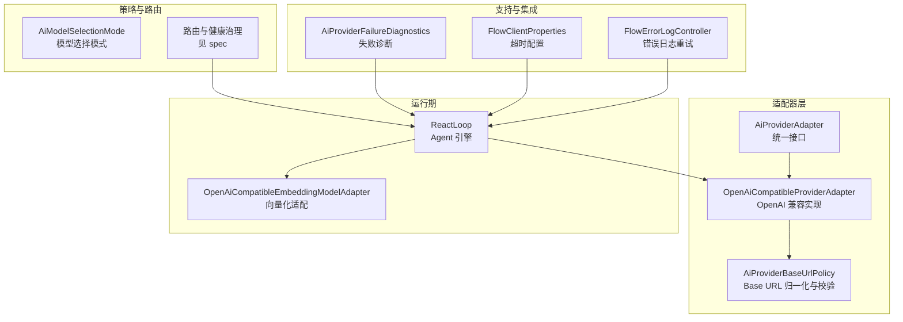
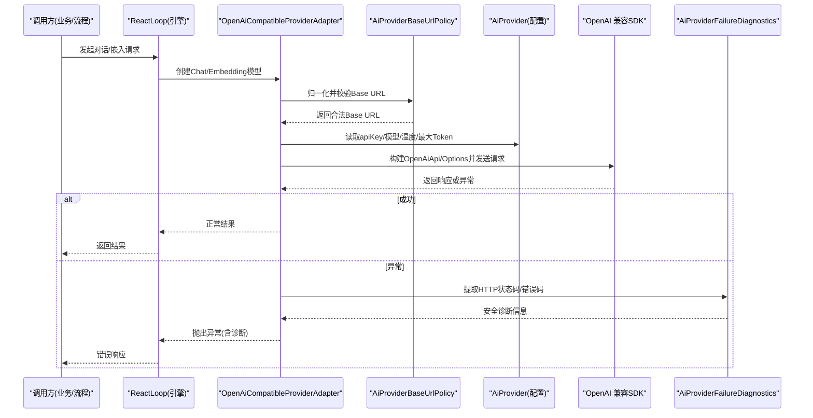
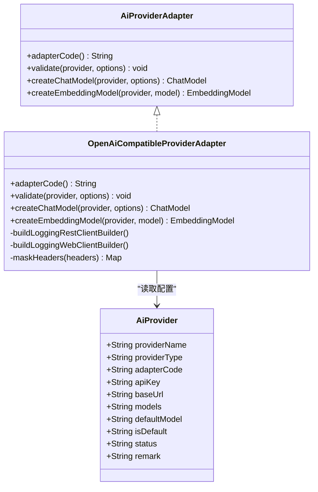
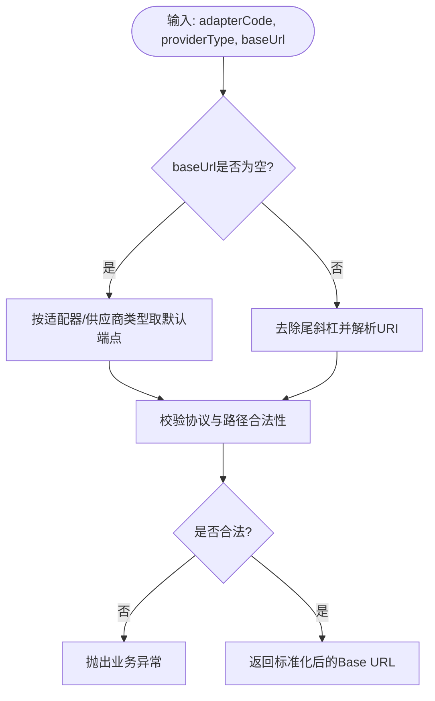
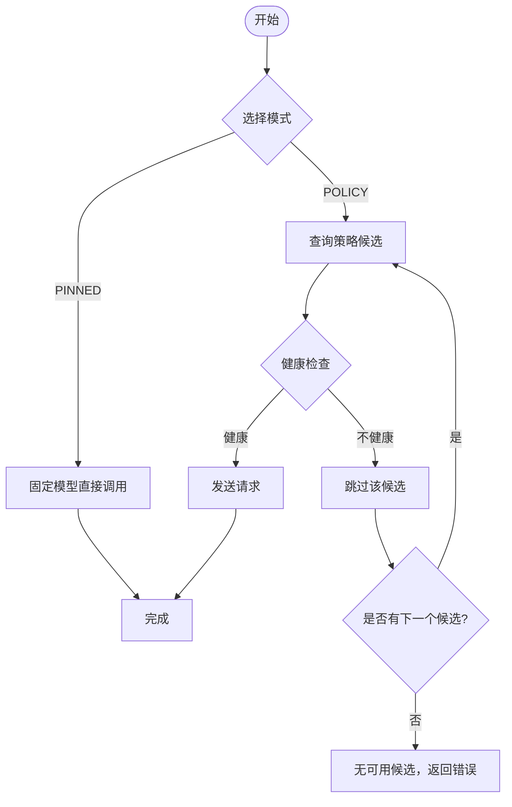
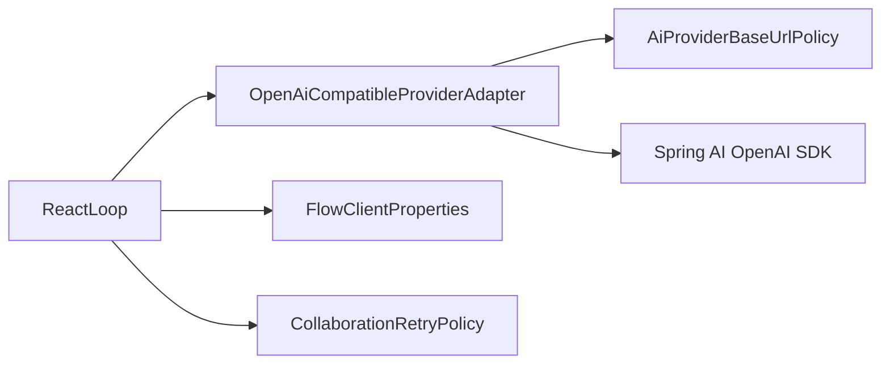

# OpenAI供应商集成

<cite>
**本文引用的文件**
- [OpenAiCompatibleProviderAdapter.java](file://forge-server/forge-framework/forge-plugin-parent/forge-plugin-ai/src/main/java/com/mdframe/forge/plugin/ai/provider/adapter/OpenAiCompatibleProviderAdapter.java)
- [AiProviderBaseUrlPolicy.java](file://forge-server/forge-framework/forge-plugin-parent/forge-plugin-ai/src/main/java/com/mdframe/forge/plugin/ai/provider/adapter/AiProviderBaseUrlPolicy.java)
- [AiProvider.java](file://forge-server/forge-framework/forge-plugin-parent/forge-plugin-ai/src/main/java/com/mdframe/forge/plugin/ai/provider/domain/AiProvider.java)
- [AiProviderAdapter.java](file://forge-server/forge-framework/forge-plugin-parent/forge-plugin-ai/src/main/java/com/mdframe/forge/plugin/ai/provider/adapter/AiProviderAdapter.java)
- [AiModelSelectionMode.java](file://forge-server/forge-framework/forge-plugin-parent/forge-plugin-ai/src/main/java/com/mdframe/forge/plugin/ai/routing/constant/AiModelSelectionMode.java)
- [ReactLoop.java](file://forge-server/forge-framework/forge-plugin-parent/forge-plugin-ai/src/main/java/com/mdframe/forge/plugin/ai/agent/engine/ReactLoop.java)
- [OpenAiCompatibleEmbeddingModelAdapter.java](file://forge-server/forge-framework/forge-plugin-parent/forge-plugin-ai/src/main/java/com/mdframe/forge/plugin/ai/model/adapter/OpenAiCompatibleEmbeddingModelAdapter.java)
- [CollaborationRetryPolicy.java](file://forge-server/forge-framework/forge-plugin-parent/forge-plugin-collaboration/src/main/java/com/mdframe/forge/plugin/collaboration/service/CollaborationRetryPolicy.java)
- [BusinessProcessSchemaValidator.java](file://forge-server/forge-framework/forge-plugin-parent/forge-plugin-generator/src/main/java/com/mdframe/forge/plugin/generator/businessprocess/validation/BusinessProcessSchemaValidator.java)
- [AiProviderFailureDiagnostics.java](file://forge-server/forge-framework/forge-plugin-parent/forge-plugin-ai/src/main/java/com/mdframe/forge/plugin/ai/provider/support/AiProviderFailureDiagnostics.java)
- [FlowClientProperties.java](file://forge-server/forge-flow/forge-flow-client/src/main/java/com/mdframe/forge/flow/client/FlowClientProperties.java)
- [FlowErrorLogController.java](file://forge-server/forge-flow/forge-flow-server/src/main/java/com/mdframe/forge/flow/controller/FlowErrorLogController.java)
- [spec.md](file://code-copilot/changes/archive/2026-07-11-ai-model-routing-governance/spec.md)
</cite>

## 目录
1. [简介](#简介)
2. [项目结构](#项目结构)
3. [核心组件](#核心组件)
4. [架构总览](#架构总览)
5. [详细组件分析](#详细组件分析)
6. [依赖关系分析](#依赖关系分析)
7. [性能与成本优化](#性能与成本优化)
8. [故障排查指南](#故障排查指南)
9. [结论](#结论)
10. [附录](#附录)

## 简介
本技术文档聚焦于平台中“OpenAI 供应商集成”的实现与使用，覆盖认证配置、模型选择策略、请求参数设置、API 密钥管理、速率限制与重试机制、错误诊断、以及与平台其他组件的集成和数据流转。文档基于代码仓库中的适配器、策略、路由与健康治理等实现进行说明，并提供可操作的配置建议与排障指引。

## 项目结构
围绕 OpenAI 兼容协议，平台通过统一的适配器抽象对接不同供应商（包括 OpenAI 官方及兼容端点），并通过策略与路由对模型选择、健康状态和调用审计进行治理。关键目录与职责如下：
- 适配器层：定义并实现供应商适配接口，封装连接、鉴权与参数映射。
- 策略与路由：提供模型选择模式、候选排序、健康快照与租约控制。
- 运行期引擎：在 Agent/流程编排中构造 Chat/Embedding 模型并执行调用。
- 支持组件：失败诊断、密钥脱敏、Base URL 校验与默认端点补齐。
- 外部集成：与 Flow 客户端超时、错误日志重试等能力协同。

图表来源
- [OpenAiCompatibleProviderAdapter.java:34-84](file://forge-server/forge-framework/forge-plugin-parent/forge-plugin-ai/src/main/java/com/mdframe/forge/plugin/ai/provider/adapter/OpenAiCompatibleProviderAdapter.java#L34-L84)
- [AiProviderBaseUrlPolicy.java:10-73](file://forge-server/forge-framework/forge-plugin-parent/forge-plugin-ai/src/main/java/com/mdframe/forge/plugin/ai/provider/adapter/AiProviderBaseUrlPolicy.java#L10-L73)
- [AiModelSelectionMode.java:1-14](file://forge-server/forge-framework/forge-plugin-parent/forge-plugin-ai/src/main/java/com/mdframe/forge/plugin/ai/routing/constant/AiModelSelectionMode.java#L1-L14)
- [ReactLoop.java:522-534](file://forge-server/forge-framework/forge-plugin-parent/forge-plugin-ai/src/main/java/com/mdframe/forge/plugin/ai/agent/engine/ReactLoop.java#L522-L534)
- [OpenAiCompatibleEmbeddingModelAdapter.java:15-30](file://forge-server/forge-framework/forge-plugin-parent/forge-plugin-ai/src/main/java/com/mdframe/forge/plugin/ai/model/adapter/OpenAiCompatibleEmbeddingModelAdapter.java#L15-L30)
- [AiProviderFailureDiagnostics.java:1-90](file://forge-server/forge-framework/forge-plugin-parent/forge-plugin-ai/src/main/java/com/mdframe/forge/plugin/ai/provider/support/AiProviderFailureDiagnostics.java#L1-L90)
- [FlowClientProperties.java:16-44](file://forge-server/forge-flow/forge-flow-client/src/main/java/com/mdframe/forge/flow/client/FlowClientProperties.java#L16-L44)
- [FlowErrorLogController.java:101-122](file://forge-server/forge-flow/forge-flow-server/src/main/java/com/mdframe/forge/flow/controller/FlowErrorLogController.java#L101-L122)

章节来源
- [OpenAiCompatibleProviderAdapter.java:34-84](file://forge-server/forge-framework/forge-plugin-parent/forge-plugin-ai/src/main/java/com/mdframe/forge/plugin/ai/provider/adapter/OpenAiCompatibleProviderAdapter.java#L34-L84)
- [AiProviderBaseUrlPolicy.java:10-73](file://forge-server/forge-framework/forge-plugin-parent/forge-plugin-ai/src/main/java/com/mdframe/forge/plugin/ai/provider/adapter/AiProviderBaseUrlPolicy.java#L10-L73)
- [AiModelSelectionMode.java:1-14](file://forge-server/forge-framework/forge-plugin-parent/forge-plugin-ai/src/main/java/com/mdframe/forge/plugin/ai/routing/constant/AiModelSelectionMode.java#L1-L14)
- [ReactLoop.java:522-534](file://forge-server/forge-framework/forge-plugin-parent/forge-plugin-ai/src/main/java/com/mdframe/forge/plugin/ai/agent/engine/ReactLoop.java#L522-L534)
- [OpenAiCompatibleEmbeddingModelAdapter.java:15-30](file://forge-server/forge-framework/forge-plugin-parent/forge-plugin-ai/src/main/java/com/mdframe/forge/plugin/ai/model/adapter/OpenAiCompatibleEmbeddingModelAdapter.java#L15-L30)
- [AiProviderFailureDiagnostics.java:1-90](file://forge-server/forge-framework/forge-plugin-parent/forge-plugin-ai/src/main/java/com/mdframe/forge/plugin/ai/provider/support/AiProviderFailureDiagnostics.java#L1-L90)
- [FlowClientProperties.java:16-44](file://forge-server/forge-flow/forge-flow-client/src/main/java/com/mdframe/forge/flow/client/FlowClientProperties.java#L16-L44)
- [FlowErrorLogController.java:101-122](file://forge-server/forge-flow/forge-flow-server/src/main/java/com/mdframe/forge/flow/controller/FlowErrorLogController.java#L101-L122)

## 核心组件
- 供应商适配器接口与实现
  - AiProviderAdapter：定义适配器契约，包含验证、创建 Chat/Embedding 模型的能力。
  - OpenAiCompatibleProviderAdapter：实现 OpenAI 兼容协议的 Chat/Embedding 模型创建，注入 Base URL、API Key、可选温度与最大 Token 等参数，并构建带日志记录的 REST/WebClient。
- 供应商配置实体
  - AiProvider：存储供应商名称、类型、适配器代码、Logo、API Key、Base URL、可用模型、默认模型、是否默认、状态与备注等。
- Base URL 策略
  - AiProviderBaseUrlPolicy：负责 Base URL 归一化、安全校验与默认端点补齐；对 DashScope 原生与兼容路径做严格匹配。
- 模型选择模式
  - AiModelSelectionMode：PINNED（固定模型）与 POLICY（策略路由）两种模式，未知值拒绝。
- 运行期引擎
  - ReactLoop：在 Agent 执行时仅针对 OpenAI 兼容模型构造工具声明等选项，确保多模态/函数调用场景正确传递。
- 向量化适配
  - OpenAiCompatibleEmbeddingModelAdapter：为 OpenAI 兼容 Embedding 接口提供批处理优化，减少逐条 HTTP 调用开销。
- 失败诊断
  - AiProviderFailureDiagnostics：从 SDK 异常中提取最小安全的诊断信息（HTTP 状态码、错误码），避免泄露敏感内容。

章节来源
- [AiProviderAdapter.java:1-45](file://forge-server/forge-framework/forge-plugin-parent/forge-plugin-ai/src/main/java/com/mdframe/forge/plugin/ai/provider/adapter/AiProviderAdapter.java#L1-L45)
- [OpenAiCompatibleProviderAdapter.java:34-84](file://forge-server/forge-framework/forge-plugin-parent/forge-plugin-ai/src/main/java/com/mdframe/forge/plugin/ai/provider/adapter/OpenAiCompatibleProviderAdapter.java#L34-L84)
- [AiProvider.java:1-87](file://forge-server/forge-framework/forge-plugin-parent/forge-plugin-ai/src/main/java/com/mdframe/forge/plugin/ai/provider/domain/AiProvider.java#L1-L87)
- [AiProviderBaseUrlPolicy.java:10-73](file://forge-server/forge-framework/forge-plugin-parent/forge-plugin-ai/src/main/java/com/mdframe/forge/plugin/ai/provider/adapter/AiProviderBaseUrlPolicy.java#L10-L73)
- [AiModelSelectionMode.java:1-14](file://forge-server/forge-framework/forge-plugin-parent/forge-plugin-ai/src/main/java/com/mdframe/forge/plugin/ai/routing/constant/AiModelSelectionMode.java#L1-L14)
- [ReactLoop.java:522-534](file://forge-server/forge-framework/forge-plugin-parent/forge-plugin-ai/src/main/java/com/mdframe/forge/plugin/ai/agent/engine/ReactLoop.java#L522-L534)
- [OpenAiCompatibleEmbeddingModelAdapter.java:15-30](file://forge-server/forge-framework/forge-plugin-parent/forge-plugin-ai/src/main/java/com/mdframe/forge/plugin/ai/model/adapter/OpenAiCompatibleEmbeddingModelAdapter.java#L15-L30)
- [AiProviderFailureDiagnostics.java:1-90](file://forge-server/forge-framework/forge-plugin-parent/forge-plugin-ai/src/main/java/com/mdframe/forge/plugin/ai/provider/support/AiProviderFailureDiagnostics.java#L1-L90)

## 架构总览
下图展示了从上层调用到 OpenAI 兼容供应商的完整链路，包括配置校验、模型创建、参数映射、流式调用与失败诊断。

图表来源
- [OpenAiCompatibleProviderAdapter.java:52-84](file://forge-server/forge-framework/forge-plugin-parent/forge-plugin-ai/src/main/java/com/mdframe/forge/plugin/ai/provider/adapter/OpenAiCompatibleProviderAdapter.java#L52-L84)
- [AiProviderBaseUrlPolicy.java:45-73](file://forge-server/forge-framework/forge-plugin-parent/forge-plugin-ai/src/main/java/com/mdframe/forge/plugin/ai/provider/adapter/AiProviderBaseUrlPolicy.java#L45-L73)
- [AiProvider.java:46-64](file://forge-server/forge-framework/forge-plugin-parent/forge-plugin-ai/src/main/java/com/mdframe/forge/plugin/ai/provider/domain/AiProvider.java#L46-L64)
- [AiProviderFailureDiagnostics.java:33-49](file://forge-server/forge-framework/forge-plugin-parent/forge-plugin-ai/src/main/java/com/mdframe/forge/plugin/ai/provider/support/AiProviderFailureDiagnostics.java#L33-L49)

## 详细组件分析

### OpenAI 兼容适配器（聊天与嵌入）
- 职责
  - 校验供应商配置与运行时参数。
  - 创建 ChatModel/EmbeddingModel，注入 baseUrl、apiKey、temperature、maxTokens 等。
  - 为日志记录构建 RestClient/WebClient，并对敏感头进行脱敏。
- 关键点
  - Base URL 必须经策略归一化与校验，防止非法 URI。
  - 运行时参数仅在非空时写入 Options，保持最小化请求体。
  - 嵌入模型采用批处理优化，降低高并发 chunk 下的网络开销。

图表来源
- [AiProviderAdapter.java:1-45](file://forge-server/forge-framework/forge-plugin-parent/forge-plugin-ai/src/main/java/com/mdframe/forge/plugin/ai/provider/adapter/AiProviderAdapter.java#L1-L45)
- [OpenAiCompatibleProviderAdapter.java:34-84](file://forge-server/forge-framework/forge-plugin-parent/forge-plugin-ai/src/main/java/com/mdframe/forge/plugin/ai/provider/adapter/OpenAiCompatibleProviderAdapter.java#L34-L84)
- [AiProvider.java:1-87](file://forge-server/forge-framework/forge-plugin-parent/forge-plugin-ai/src/main/java/com/mdframe/forge/plugin/ai/provider/domain/AiProvider.java#L1-L87)

章节来源
- [OpenAiCompatibleProviderAdapter.java:34-84](file://forge-server/forge-framework/forge-plugin-parent/forge-plugin-ai/src/main/java/com/mdframe/forge/plugin/ai/provider/adapter/OpenAiCompatibleProviderAdapter.java#L34-L84)
- [OpenAiCompatibleEmbeddingModelAdapter.java:15-30](file://forge-server/forge-framework/forge-plugin-parent/forge-plugin-ai/src/main/java/com/mdframe/forge/plugin/ai/model/adapter/OpenAiCompatibleEmbeddingModelAdapter.java#L15-L30)

### Base URL 策略与默认端点
- 功能
  - 将 Base URL 去除尾斜杠并解析为 URI，拒绝不安全或非法形式。
  - 当 Base URL 为空时，按适配器类型与供应商类型补全默认端点（如 OpenAI 官方、阿里兼容、智谱、月之暗面、DeepSeek、Ollama）。
  - 对 DashScope 原生与兼容路径做严格区分，禁止混用。
- 影响
  - 保证所有请求均指向受控且合法的端点，避免误配导致鉴权失败或计费异常。

图表来源
- [AiProviderBaseUrlPolicy.java:45-73](file://forge-server/forge-framework/forge-plugin-parent/forge-plugin-ai/src/main/java/com/mdframe/forge/plugin/ai/provider/adapter/AiProviderBaseUrlPolicy.java#L45-L73)

章节来源
- [AiProviderBaseUrlPolicy.java:10-73](file://forge-server/forge-framework/forge-plugin-parent/forge-plugin-ai/src/main/java/com/mdframe/forge/plugin/ai/provider/adapter/AiProviderBaseUrlPolicy.java#L10-L73)

### 模型选择策略与路由治理
- 选择模式
  - PINNED：固定模型，不动态切换。
  - POLICY：依据策略选择候选模型，结合能力匹配、优先级与租户隔离。
- 路由规则要点
  - 调用前可跳过 OPEN 候选，但调用后发生错误不自动切换模型，避免重复计费与副作用。
  - 健康状态由真实调用与手动测试驱动，默认内存快照，后续可扩展为分布式。
  - 价格与用量以供应商 Usage 为准，缺失时记录 NULL 并标记不可用。

图表来源
- [AiModelSelectionMode.java:1-14](file://forge-server/forge-framework/forge-plugin-parent/forge-plugin-ai/src/main/java/com/mdframe/forge/plugin/ai/routing/constant/AiModelSelectionMode.java#L1-L14)
- [spec.md:122-131](file://code-copilot/changes/archive/2026-07-11-ai-model-routing-governance/spec.md#L122-L131)
- [spec.md:221-234](file://code-copilot/changes/archive/2026-07-11-ai-model-routing-governance/spec.md#L221-L234)

章节来源
- [AiModelSelectionMode.java:1-14](file://forge-server/forge-framework/forge-plugin-parent/forge-plugin-ai/src/main/java/com/mdframe/forge/plugin/ai/routing/constant/AiModelSelectionMode.java#L1-L14)
- [spec.md:122-131](file://code-copilot/changes/archive/2026-07-11-ai-model-routing-governance/spec.md#L122-L131)
- [spec.md:221-234](file://code-copilot/changes/archive/2026-07-11-ai-model-routing-governance/spec.md#L221-L234)

### 运行期引擎与参数映射
- ReactLoop 在构造工具声明等选项时，仅对 OpenAI 兼容模型生效，确保函数调用/多模态能力正确传递。
- 运行时参数（temperature、maxTokens）仅在非空时写入，避免多余字段。

章节来源
- [ReactLoop.java:522-534](file://forge-server/forge-framework/forge-plugin-parent/forge-plugin-ai/src/main/java/com/mdframe/forge/plugin/ai/agent/engine/ReactLoop.java#L522-L534)
- [OpenAiCompatibleProviderAdapter.java:61-71](file://forge-server/forge-framework/forge-plugin-parent/forge-plugin-ai/src/main/java/com/mdframe/forge/plugin/ai/provider/adapter/OpenAiCompatibleProviderAdapter.java#L61-L71)

### 与平台其他组件的集成
- Flow 客户端超时：通过 FlowClientProperties 配置连接与读取超时，保障长耗时 AI 调用的稳定性。
- 错误日志重试：FlowErrorLogController 暴露重试接口，便于人工干预失败节点。
- 协作重试策略：CollaborationRetryPolicy 提供分类重试决策（临时错误、限流、凭据错误等），可作为通用重试参考。

章节来源
- [FlowClientProperties.java:16-44](file://forge-server/forge-flow/forge-flow-client/src/main/java/com/mdframe/forge/flow/client/FlowClientProperties.java#L16-L44)
- [FlowErrorLogController.java:101-122](file://forge-server/forge-flow/forge-flow-server/src/main/java/com/mdframe/forge/flow/controller/FlowErrorLogController.java#L101-L122)
- [CollaborationRetryPolicy.java:56-82](file://forge-server/forge-framework/forge-plugin-parent/forge-plugin-collaboration/src/main/java/com/mdframe/forge/plugin/collaboration/service/CollaborationRetryPolicy.java#L56-L82)

## 依赖关系分析
- 耦合与内聚
  - 适配器层与策略层解耦：适配器只关注具体供应商实现，Base URL 校验交由策略类。
  - 引擎与适配器松耦合：通过统一接口创建模型，便于扩展新供应商。
- 外部依赖
  - Spring AI OpenAI SDK：用于构建 API 客户端与选项。
  - Flow 客户端：超时与重试能力增强整体稳定性。
- 潜在风险
  - 若 Base URL 配置错误，将导致鉴权失败或路由到非预期端点。
  - 未启用健康治理时，可能持续尝试不健康模型。

图表来源
- [ReactLoop.java:522-534](file://forge-server/forge-framework/forge-plugin-parent/forge-plugin-ai/src/main/java/com/mdframe/forge/plugin/ai/agent/engine/ReactLoop.java#L522-L534)
- [OpenAiCompatibleProviderAdapter.java:52-84](file://forge-server/forge-framework/forge-plugin-parent/forge-plugin-ai/src/main/java/com/mdframe/forge/plugin/ai/provider/adapter/OpenAiCompatibleProviderAdapter.java#L52-L84)
- [AiProviderBaseUrlPolicy.java:45-73](file://forge-server/forge-framework/forge-plugin-parent/forge-plugin-ai/src/main/java/com/mdframe/forge/plugin/ai/provider/adapter/AiProviderBaseUrlPolicy.java#L45-L73)
- [FlowClientProperties.java:16-44](file://forge-server/forge-flow/forge-flow-client/src/main/java/com/mdframe/forge/flow/client/FlowClientProperties.java#L16-L44)
- [CollaborationRetryPolicy.java:56-82](file://forge-server/forge-framework/forge-plugin-parent/forge-plugin-collaboration/src/main/java/com/mdframe/forge/plugin/collaboration/service/CollaborationRetryPolicy.java#L56-L82)

章节来源
- [OpenAiCompatibleProviderAdapter.java:52-84](file://forge-server/forge-framework/forge-plugin-parent/forge-plugin-ai/src/main/java/com/mdframe/forge/plugin/ai/provider/adapter/OpenAiCompatibleProviderAdapter.java#L52-L84)
- [AiProviderBaseUrlPolicy.java:45-73](file://forge-server/forge-framework/forge-plugin-parent/forge-plugin-ai/src/main/java/com/mdframe/forge/plugin/ai/provider/adapter/AiProviderBaseUrlPolicy.java#L45-L73)
- [FlowClientProperties.java:16-44](file://forge-server/forge-flow/forge-flow-client/src/main/java/com/mdframe/forge/flow/client/FlowClientProperties.java#L16-L44)
- [CollaborationRetryPolicy.java:56-82](file://forge-server/forge-framework/forge-plugin-parent/forge-plugin-collaboration/src/main/java/com/mdframe/forge/plugin/collaboration/service/CollaborationRetryPolicy.java#L56-L82)

## 性能与成本优化
- 性能调优
  - 使用 OpenAI 兼容 Embedding 批处理，减少大量 chunk 的网络往返。
  - 合理设置 Flow 客户端连接/读取超时，避免阻塞线程池。
  - 启用模型健康治理，快速跳过不健康候选，降低失败重试带来的延迟。
- 成本优化
  - 优先选择性价比更高的模型（如 GPT-3.5 系列用于简单任务，GPT-4 系列用于复杂推理）。
  - 控制 temperature 与 maxTokens，避免过度生成。
  - 利用策略路由将简单任务路由至低成本模型，复杂任务走高质量模型。
  - 用量与价格以供应商 Usage 为准，缺失时不估算，避免误导成本统计。

[本节为通用指导，无需特定文件引用]

## 故障排查指南
- 认证与配置
  - 确认 AiProvider 的 adapterCode、providerType、apiKey、baseUrl 已正确填写。
  - Base URL 需经策略校验，非法或不匹配的端点会抛错。
- 速率限制与重试
  - 遇到 429 限流时，系统按分类进行指数退避重试；超过最大次数则停止。
  - 凭据错误或 Token 失效属于永久错误，不应自动重试，需人工处理。
- 错误诊断
  - 使用失败诊断组件提取 HTTP 状态码与错误码，避免日志泄露敏感信息。
  - 结合 Flow 错误日志重试接口，定位并恢复失败节点。
- 常见问题
  - Base URL 为空且无默认端点：需手动填写。
  - 未知模型选择模式：拒绝并报错，需修正为 PINNED 或 POLICY。
  - 流式调用取消：仅记录取消，不计入失败计数。

章节来源
- [AiProvider.java:46-64](file://forge-server/forge-framework/forge-plugin-parent/forge-plugin-ai/src/main/java/com/mdframe/forge/plugin/ai/provider/domain/AiProvider.java#L46-L64)
- [AiProviderBaseUrlPolicy.java:58-69](file://forge-server/forge-framework/forge-plugin-parent/forge-plugin-ai/src/main/java/com/mdframe/forge/plugin/ai/provider/adapter/AiProviderBaseUrlPolicy.java#L58-L69)
- [CollaborationRetryPolicy.java:63-82](file://forge-server/forge-framework/forge-plugin-parent/forge-plugin-collaboration/src/main/java/com/mdframe/forge/plugin/collaboration/service/CollaborationRetryPolicy.java#L63-L82)
- [AiProviderFailureDiagnostics.java:33-49](file://forge-server/forge-framework/forge-plugin-parent/forge-plugin-ai/src/main/java/com/mdframe/forge/plugin/ai/provider/support/AiProviderFailureDiagnostics.java#L33-L49)
- [FlowErrorLogController.java:101-122](file://forge-server/forge-flow/forge-flow-server/src/main/java/com/mdframe/forge/flow/controller/FlowErrorLogController.java#L101-L122)
- [AiModelSelectionMode.java:9-13](file://forge-server/forge-framework/forge-plugin-parent/forge-plugin-ai/src/main/java/com/mdframe/forge/plugin/ai/routing/constant/AiModelSelectionMode.java#L9-L13)
- [BusinessProcessSchemaValidator.java:289-306](file://forge-server/forge-framework/forge-plugin-parent/forge-plugin-generator/src/main/java/com/mdframe/forge/plugin/generator/businessprocess/validation/BusinessProcessSchemaValidator.java#L289-L306)

## 结论
本集成通过统一的适配器抽象与严格的 Base URL 策略，实现了 OpenAI 兼容供应商的安全接入与灵活配置；借助模型选择策略与健康治理，提升了调用的可解释性与稳定性；配合失败诊断、重试策略与 Flow 集成，形成了完整的端到端解决方案。建议在生产环境启用策略路由与健康监控，并结合成本优化实践，平衡性能与费用。

[本节为总结性内容，无需特定文件引用]

## 附录
- 配置示例与使用场景
  - GPT-3.5：适合轻量问答、摘要、格式化输出；建议较低 temperature、较小 maxTokens。
  - GPT-4：适合复杂推理、代码生成、多步规划；可适当提高 temperature，控制 maxTokens 以避免过长输出。
  - 嵌入模型：用于检索增强（RAG），建议使用批处理以提升吞吐。
- 最佳实践
  - 始终通过策略校验 Base URL，避免误配。
  - 使用 PINNED 模式进行灰度发布，再逐步切换到 POLICY 模式。
  - 定期审查调用日志与成本统计，调整模型与参数。

[本节为补充说明，无需特定文件引用]