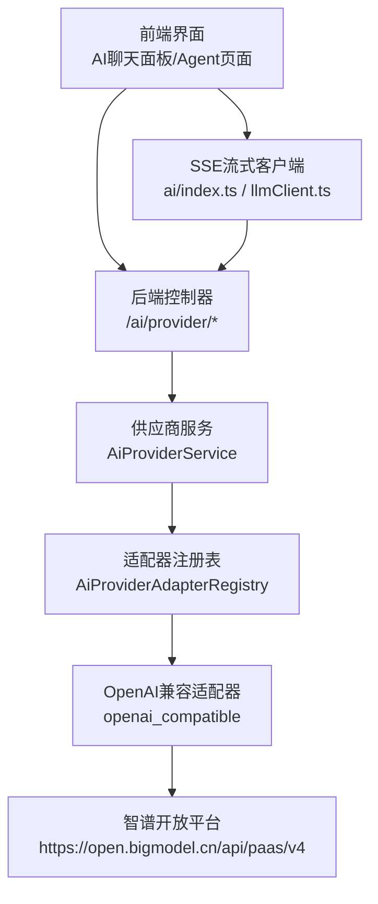
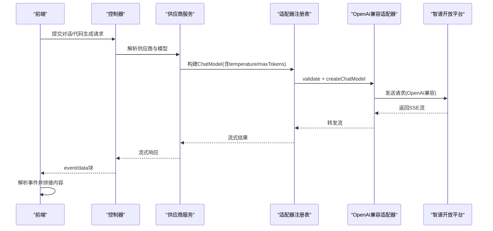
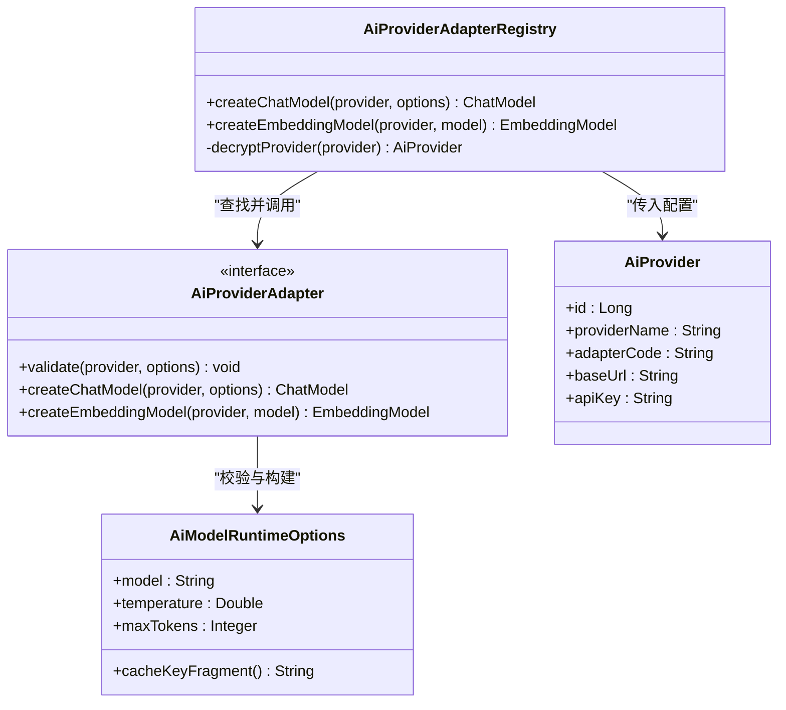
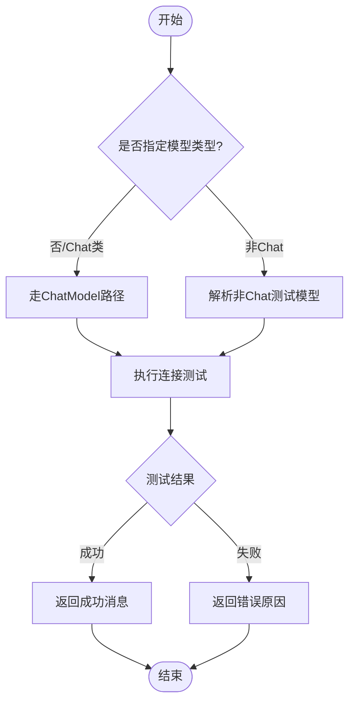
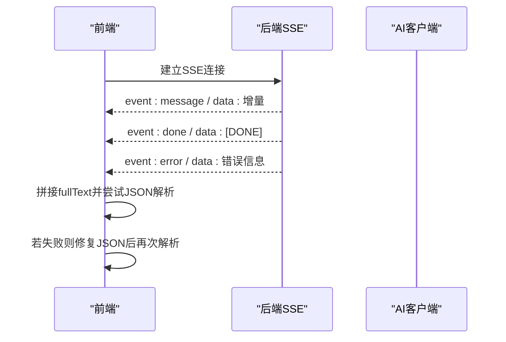
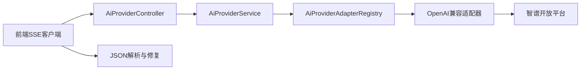

# 智谱AI供应商集成

<cite>
**本文引用的文件**
- [AiProviderController.java](file://forge-server/forge-framework/forge-plugin-parent/forge-plugin-ai/src/main/java/com/mdframe/forge/plugin/ai/provider/controller/AiProviderController.java)
- [AiProviderService.java](file://forge-server/forge-framework/forge-plugin-parent/forge-plugin-ai/src/main/java/com/mdframe/forge/plugin/ai/provider/service/AiProviderService.java)
- [AiProviderAdapterRegistry.java](file://forge-server/forge-framework/forge-plugin-parent/forge-plugin-ai/src/main/java/com/mdframe/forge/plugin/ai/provider/adapter/AiProviderAdapterRegistry.java)
- [AiModelRuntimeOptions.java](file://forge-server/forge-framework/forge-plugin-parent/forge-plugin-ai/src/main/java/com/mdframe/forge/plugin/ai/provider/adapter/AiModelRuntimeOptions.java)
- [AiProviderBaseUrlPolicy.java](file://forge-server/forge-framework/forge-plugin-parent/forge-plugin-ai/src/main/java/com/mdframe/forge/plugin/ai/provider/adapter/AiProviderBaseUrlPolicy.java)
- [AiProviderFailureDiagnostics.java](file://forge-server/forge-framework/forge-plugin-parent/forge-plugin-ai/src/main/java/com/mdframe/forge/plugin/ai/provider/support/AiProviderFailureDiagnostics.java)
- [AiClientImpl.java](file://forge-server/forge-framework/forge-plugin-parent/forge-plugin-ai/src/main/java/com/mdframe/forge/plugin/ai/client/AiClientImpl.java)
- [ForgeManagedCacheManager.java](file://forge-server/forge-framework/forge-starter-parent/forge-starter-cache/src/main/java/com/mdframe/forge/starter/cache/managed/ForgeManagedCacheManager.java)
- [EffectiveCachePolicy.java](file://forge-server/forge-framework/forge-starter-parent/forge-starter-cache/src/main/java/com/mdframe/forge/starter/cache/managed/model/EffectiveCachePolicy.java)
- [SysManagedCachePolicyServiceImpl.java](file://forge-server/forge-framework/forge-plugin-parent/forge-plugin-system/src/main/java/com/mdframe/forge/plugin/system/service/impl/SysManagedCachePolicyServiceImpl.java)
- [CollaborationRetryPolicy.java](file://forge-server/forge-framework/forge-plugin-parent/forge-plugin-collaboration/src/main/java/com/mdframe/forge/plugin/collaboration/service/CollaborationRetryPolicy.java)
- [JobRetryExecutor.java](file://forge-server/forge-framework/forge-plugin-parent/forge-plugin-job/src/main/java/com/mdframe/forge/plugin/job/service/JobRetryExecutor.java)
- [AIChatPanel.vue](file://forge-report-ui/src/components/FgAI/AIChatPanel.vue)
- [ai/index.ts](file://forge-report-ui/src/api/ai/index.ts)
- [llmClient.ts](file://forge-report-ui/src/components/FgAI/llmClient.ts)
- [agent.vue](file://forge-admin-ui/src/views/ai/agent.vue)
</cite>

## 目录
1. [简介](#简介)
2. [项目结构](#项目结构)
3. [核心组件](#核心组件)
4. [架构总览](#架构总览)
5. [详细组件分析](#详细组件分析)
6. [依赖关系分析](#依赖关系分析)
7. [性能与并发优化](#性能与并发优化)
8. [故障排查指南](#故障排查指南)
9. [结论](#结论)
10. [附录：接入步骤与示例](#附录：接入步骤与示例)

## 简介
本技术文档面向在企业内部系统中集成“智谱AI”的场景，基于仓库内已实现的AI供应商抽象层与OpenAI兼容适配器，说明如何完成智谱开放平台注册、API密钥获取与服务接入；并给出GLM系列模型的调用方式、参数配置与结果解析。同时提供代码生成、文本理解等典型场景的实现思路，以及并发控制、缓存策略、性能优化与企业系统集成模式、数据安全保护措施。

## 项目结构
本项目采用插件化架构，AI能力集中在AI插件模块中，通过统一的供应商适配器抽象对接不同大模型服务。智谱AI以“OpenAI兼容模式”接入，使用统一接口进行连接测试、模型拉取、流式对话与结构化输出处理。前端在管理端与报告端分别提供SSE流式消费与JSON修复能力，保障端到端的可用性。

图表来源
- [AiProviderController.java:36-58](file://forge-server/forge-framework/forge-plugin-parent/forge-plugin-ai/src/main/java/com/mdframe/forge/plugin/ai/provider/controller/AiProviderController.java#L36-L58)
- [AiProviderService.java:125-139](file://forge-server/forge-framework/forge-plugin-parent/forge-plugin-ai/src/main/java/com/mdframe/forge/plugin/ai/provider/service/AiProviderService.java#L125-L139)
- [AiProviderAdapterRegistry.java:54-78](file://forge-server/forge-framework/forge-plugin-parent/forge-plugin-ai/src/main/java/com/mdframe/forge/plugin/ai/provider/adapter/AiProviderAdapterRegistry.java#L54-L78)
- [AiProviderBaseUrlPolicy.java:29-29](file://forge-server/forge-framework/forge-plugin-parent/forge-plugin-ai/src/main/java/com/mdframe/forge/plugin/ai/provider/adapter/AiProviderBaseUrlPolicy.java#L29-L29)
- [ai/index.ts:355-408](file://forge-report-ui/src/api/ai/index.ts#L355-L408)
- [llmClient.ts:56-95](file://forge-report-ui/src/components/FgAI/llmClient.ts#L56-L95)

章节来源
- [AiProviderController.java:36-58](file://forge-server/forge-framework/forge-plugin-parent/forge-plugin-ai/src/main/java/com/mdframe/forge/plugin/ai/provider/controller/AiProviderController.java#L36-L58)
- [AiProviderService.java:125-139](file://forge-server/forge-framework/forge-plugin-parent/forge-plugin-ai/src/main/java/com/mdframe/forge/plugin/ai/provider/service/AiProviderService.java#L125-L139)
- [AiProviderAdapterRegistry.java:54-78](file://forge-server/forge-framework/forge-plugin-parent/forge-plugin-ai/src/main/java/com/mdframe/forge/plugin/ai/provider/adapter/AiProviderAdapterRegistry.java#L54-L78)
- [AiProviderBaseUrlPolicy.java:29-29](file://forge-server/forge-framework/forge-plugin-parent/forge-plugin-ai/src/main/java/com/mdframe/forge/plugin/ai/provider/adapter/AiProviderBaseUrlPolicy.java#L29-L29)
- [ai/index.ts:355-408](file://forge-report-ui/src/api/ai/index.ts#L355-L408)
- [llmClient.ts:56-95](file://forge-report-ui/src/components/FgAI/llmClient.ts#L56-L95)

## 核心组件
- 供应商模板与基础URL：内置模板包含“智谱 AI”，默认Base URL为 https://open.bigmodel.cn/api/paas/v4，适配代码为 openai_compatible，默认模型标识为 glm-4。
- 供应商CRUD与测试：提供分页查询、详情、创建、更新、删除、设为默认、连接测试、拉取模型列表与批量导入模型等能力。
- 适配器注册与模型构建：按固定顺序选择、校验、创建ChatModel，并在构造前解密API Key。
- 运行参数：温度temperature、最大输出maxTokens、模型标识model，支持生成稳定缓存片段。
- 失败诊断：从异常中提取HTTP状态码与错误码，避免日志泄露敏感信息。
- 客户端与流式处理：后端返回SSE事件流，前端解析event/data块，支持done/error事件与增量拼接。
- 缓存与重试：受管缓存管理器提供多级缓存策略与指标；协作与任务重试策略提供指数退避与限流处理。

章节来源
- [AiProviderController.java:36-58](file://forge-server/forge-framework/forge-plugin-parent/forge-plugin-ai/src/main/java/com/mdframe/forge/plugin/ai/provider/controller/AiProviderController.java#L36-L58)
- [AiProviderController.java:71-183](file://forge-server/forge-framework/forge-plugin-parent/forge-plugin-ai/src/main/java/com/mdframe/forge/plugin/ai/provider/controller/AiProviderController.java#L71-L183)
- [AiProviderService.java:125-139](file://forge-server/forge-framework/forge-plugin-parent/forge-plugin-ai/src/main/java/com/mdframe/forge/plugin/ai/provider/service/AiProviderService.java#L125-L139)
- [AiProviderAdapterRegistry.java:54-78](file://forge-server/forge-framework/forge-plugin-parent/forge-plugin-ai/src/main/java/com/mdframe/forge/plugin/ai/provider/adapter/AiProviderAdapterRegistry.java#L54-L78)
- [AiModelRuntimeOptions.java:1-22](file://forge-server/forge-framework/forge-plugin-parent/forge-plugin-ai/src/main/java/com/mdframe/forge/plugin/ai/provider/adapter/AiModelRuntimeOptions.java#L1-L22)
- [AiProviderFailureDiagnostics.java:1-90](file://forge-server/forge-framework/forge-plugin-parent/forge-plugin-ai/src/main/java/com/mdframe/forge/plugin/ai/provider/support/AiProviderFailureDiagnostics.java#L1-L90)
- [ai/index.ts:355-408](file://forge-report-ui/src/api/ai/index.ts#L355-L408)
- [llmClient.ts:56-95](file://forge-report-ui/src/components/FgAI/llmClient.ts#L56-L95)

## 架构总览
系统通过统一的AI供应商抽象层屏蔽底层差异，智谱AI以OpenAI兼容协议接入。请求路径包括：前端发起对话或代码生成任务 → 后端控制器接收 → 服务层解析供应商与模型 → 适配器注册表构建ChatModel → 调用智谱开放平台 → 返回SSE流式响应 → 前端解析事件并渲染。

图表来源
- [AiProviderController.java:143-172](file://forge-server/forge-framework/forge-plugin-parent/forge-plugin-ai/src/main/java/com/mdframe/forge/plugin/ai/provider/controller/AiProviderController.java#L143-L172)
- [AiProviderService.java:125-139](file://forge-server/forge-framework/forge-plugin-parent/forge-plugin-ai/src/main/java/com/mdframe/forge/plugin/ai/provider/service/AiProviderService.java#L125-L139)
- [AiProviderAdapterRegistry.java:54-78](file://forge-server/forge-framework/forge-plugin-parent/forge-plugin-ai/src/main/java/com/mdframe/forge/plugin/ai/provider/adapter/AiProviderAdapterRegistry.java#L54-L78)
- [ai/index.ts:355-408](file://forge-report-ui/src/api/ai/index.ts#L355-L408)

## 详细组件分析

### 供应商管理与模板
- 内置模板：提供“智谱 AI”模板，Base URL为 https://open.bigmodel.cn/api/paas/v4，默认模型glm-4，适配器代码为 openai_compatible。
- 管理接口：分页查询、详情、创建、更新、删除、设为默认、连接测试、拉取模型列表、批量导入模型。
- 安全：所有写操作与读取均启用加解密注解，确保API Key传输与存储安全。

章节来源
- [AiProviderController.java:36-58](file://forge-server/forge-framework/forge-plugin-parent/forge-plugin-ai/src/main/java/com/mdframe/forge/plugin/ai/provider/controller/AiProviderController.java#L36-L58)
- [AiProviderController.java:71-183](file://forge-server/forge-framework/forge-plugin-parent/forge-plugin-ai/src/main/java/com/mdframe/forge/plugin/ai/provider/controller/AiProviderController.java#L71-L183)

### 适配器注册与模型构建
- 注册表职责：按固定顺序选择、校验、创建ChatModel；在构造前解密API Key。
- 校验与创建：先调用适配器的validate方法，再createChatModel；若校验失败直接抛出业务异常，不产生网络请求。
- 多模态与Embedding：除Chat外，还提供Embedding模型构建入口，同样遵循解密与校验流程。

图表来源
- [AiProviderAdapterRegistry.java:54-78](file://forge-server/forge-framework/forge-plugin-parent/forge-plugin-ai/src/main/java/com/mdframe/forge/plugin/ai/provider/adapter/AiProviderAdapterRegistry.java#L54-L78)
- [AiProviderAdapterRegistry.java:80-98](file://forge-server/forge-framework/forge-plugin-parent/forge-plugin-ai/src/main/java/com/mdframe/forge/plugin/ai/provider/adapter/AiProviderAdapterRegistry.java#L80-L98)
- [AiModelRuntimeOptions.java:1-22](file://forge-server/forge-framework/forge-plugin-parent/forge-plugin-ai/src/main/java/com/mdframe/forge/plugin/ai/provider/adapter/AiModelRuntimeOptions.java#L1-L22)

章节来源
- [AiProviderAdapterRegistry.java:54-78](file://forge-server/forge-framework/forge-plugin-parent/forge-plugin-ai/src/main/java/com/mdframe/forge/plugin/ai/provider/adapter/AiProviderAdapterRegistry.java#L54-L78)
- [AiProviderAdapterRegistry.java:80-98](file://forge-server/forge-framework/forge-plugin-parent/forge-plugin-ai/src/main/java/com/mdframe/forge/plugin/ai/provider/adapter/AiProviderAdapterRegistry.java#L80-L98)
- [AiModelRuntimeOptions.java:1-22](file://forge-server/forge-framework/forge-plugin-parent/forge-plugin-ai/src/main/java/com/mdframe/forge/plugin/ai/provider/adapter/AiModelRuntimeOptions.java#L1-L22)

### 连接测试与模型拉取
- 连接测试：根据模型类型选择Chat或非Chat路径；未保存供应商测试必须指定默认模型。
- 模型拉取：调用OpenAI兼容的/v1/models端点，返回可用模型列表用于导入与管理。

图表来源
- [AiProviderService.java:125-139](file://forge-server/forge-framework/forge-plugin-parent/forge-plugin-ai/src/main/java/com/mdframe/forge/plugin/ai/provider/service/AiProviderService.java#L125-L139)
- [AiProviderService.java:264-276](file://forge-server/forge-framework/forge-plugin-parent/forge-plugin-ai/src/main/java/com/mdframe/forge/plugin/ai/provider/service/AiProviderService.java#L264-L276)
- [AiProviderService.java:278-289](file://forge-server/forge-framework/forge-plugin-parent/forge-plugin-ai/src/main/java/com/mdframe/forge/plugin/ai/provider/service/AiProviderService.java#L278-L289)

章节来源
- [AiProviderService.java:125-139](file://forge-server/forge-framework/forge-plugin-parent/forge-plugin-ai/src/main/java/com/mdframe/forge/plugin/ai/provider/service/AiProviderService.java#L125-L139)
- [AiProviderService.java:264-276](file://forge-server/forge-framework/forge-plugin-parent/forge-plugin-ai/src/main/java/com/mdframe/forge/plugin/ai/provider/service/AiProviderService.java#L264-L276)
- [AiProviderService.java:278-289](file://forge-server/forge-framework/forge-plugin-parent/forge-plugin-ai/src/main/java/com/mdframe/forge/plugin/ai/provider/service/AiProviderService.java#L278-L289)

### 流式响应与前端解析
- 后端流式：AI客户端在初始化失败或业务异常时返回降级JSON，正常路径下以SSE事件流返回。
- 前端解析：按event/data块解析，支持message/done/error事件；对JSON进行规范化与修复，保证结构化数据完整性。

图表来源
- [AiClientImpl.java:236-247](file://forge-server/forge-framework/forge-plugin-parent/forge-plugin-ai/src/main/java/com/mdframe/forge/plugin/ai/client/AiClientImpl.java#L236-L247)
- [ai/index.ts:355-408](file://forge-report-ui/src/api/ai/index.ts#L355-L408)
- [llmClient.ts:56-95](file://forge-report-ui/src/components/FgAI/llmClient.ts#L56-L95)

章节来源
- [AiClientImpl.java:236-247](file://forge-server/forge-framework/forge-plugin-parent/forge-plugin-ai/src/main/java/com/mdframe/forge/plugin/ai/client/AiClientImpl.java#L236-L247)
- [ai/index.ts:355-408](file://forge-report-ui/src/api/ai/index.ts#L355-L408)
- [llmClient.ts:56-95](file://forge-report-ui/src/components/FgAI/llmClient.ts#L56-L95)

### Agent结构化事件消费
- Agent页面消费新引擎的结构化事件，协议与主对话页一致：思考块（reasoning）、正文块（content）等事件类型，payload由发送处封装为{event, data}对象。

章节来源
- [agent.vue:1979-1984](file://forge-admin-ui/src/views/ai/agent.vue#L1979-L1984)

## 依赖关系分析
- 控制器依赖服务层，服务层依赖适配器注册表；注册表依赖具体适配器实现；适配器将请求转发至智谱开放平台。
- 前端依赖SSE客户端与JSON解析工具，保障流式数据的正确拼接与结构化输出。
- 缓存与重试策略作为横切能力，被上层服务复用以提升稳定性与性能。

图表来源
- [AiProviderController.java:36-58](file://forge-server/forge-framework/forge-plugin-parent/forge-plugin-ai/src/main/java/com/mdframe/forge/plugin/ai/provider/controller/AiProviderController.java#L36-L58)
- [AiProviderService.java:125-139](file://forge-server/forge-framework/forge-plugin-parent/forge-plugin-ai/src/main/java/com/mdframe/forge/plugin/ai/provider/service/AiProviderService.java#L125-L139)
- [AiProviderAdapterRegistry.java:54-78](file://forge-server/forge-framework/forge-plugin-parent/forge-plugin-ai/src/main/java/com/mdframe/forge/plugin/ai/provider/adapter/AiProviderAdapterRegistry.java#L54-L78)
- [ai/index.ts:355-408](file://forge-report-ui/src/api/ai/index.ts#L355-L408)
- [llmClient.ts:56-95](file://forge-report-ui/src/components/FgAI/llmClient.ts#L56-L95)

章节来源
- [AiProviderController.java:36-58](file://forge-server/forge-framework/forge-plugin-parent/forge-plugin-ai/src/main/java/com/mdframe/forge/plugin/ai/provider/controller/AiProviderController.java#L36-L58)
- [AiProviderService.java:125-139](file://forge-server/forge-framework/forge-plugin-parent/forge-plugin-ai/src/main/java/com/mdframe/forge/plugin/ai/provider/service/AiProviderService.java#L125-L139)
- [AiProviderAdapterRegistry.java:54-78](file://forge-server/forge-framework/forge-plugin-parent/forge-plugin-ai/src/main/java/com/mdframe/forge/plugin/ai/provider/adapter/AiProviderAdapterRegistry.java#L54-L78)
- [ai/index.ts:355-408](file://forge-report-ui/src/api/ai/index.ts#L355-L408)
- [llmClient.ts:56-95](file://forge-report-ui/src/components/FgAI/llmClient.ts#L56-L95)

## 性能与并发优化
- 缓存策略
  - 受管缓存管理器提供本地与Redis多级缓存，支持TTL、空值缓存、容量限制与命中率统计。
  - 有效策略可动态覆盖，便于运行时调整缓存行为。
  - 建议将高频模型元数据、供应商配置与常用提示词模板纳入缓存，减少重复网络与数据库访问。
- 并发控制
  - 结合任务重试执行器与协作重试策略，对临时错误与限流进行指数退避重试，避免雪崩。
  - 对非幂等操作谨慎重试，必要时引入分布式锁或唯一键约束。
- 流式处理
  - 前端按事件块增量渲染，降低首屏延迟；对JSON进行规范化与修复，提升鲁棒性。
- 监控与指标
  - 缓存命中/缺失/写入/淘汰/失败计数可用于定位瓶颈。
  - 失败诊断提取HTTP状态码与错误码，便于快速定位上游问题。

章节来源
- [ForgeManagedCacheManager.java:94-136](file://forge-server/forge-framework/forge-starter-parent/forge-starter-cache/src/main/java/com/mdframe/forge/starter/cache/managed/ForgeManagedCacheManager.java#L94-L136)
- [EffectiveCachePolicy.java:1-40](file://forge-server/forge-framework/forge-starter-parent/forge-starter-cache/src/main/java/com/mdframe/forge/starter/cache/managed/model/EffectiveCachePolicy.java#L1-L40)
- [SysManagedCachePolicyServiceImpl.java:153-180](file://forge-server/forge-framework/forge-plugin-parent/forge-plugin-system/src/main/java/com/mdframe/forge/plugin/system/service/impl/SysManagedCachePolicyServiceImpl.java#L153-L180)
- [CollaborationRetryPolicy.java:56-82](file://forge-server/forge-framework/forge-plugin-parent/forge-plugin-collaboration/src/main/java/com/mdframe/forge/plugin/collaboration/service/CollaborationRetryPolicy.java#L56-L82)
- [JobRetryExecutor.java:46-66](file://forge-server/forge-framework/forge-plugin-parent/forge-plugin-job/src/main/java/com/mdframe/forge/plugin/job/service/JobRetryExecutor.java#L46-L66)
- [AiProviderFailureDiagnostics.java:1-90](file://forge-server/forge-framework/forge-plugin-parent/forge-plugin-ai/src/main/java/com/mdframe/forge/plugin/ai/provider/support/AiProviderFailureDiagnostics.java#L1-L90)

## 故障排查指南
- 连接测试失败
  - 检查Base URL是否为智谱官方地址；确认适配器代码为 openai_compatible。
  - 查看连接测试返回的错误原因，必要时调整默认模型或网络策略。
- 流式响应异常
  - 前端解析error事件时记录原始payload；若JSON格式无效，使用修复逻辑重试解析。
  - 后端在初始化失败时返回降级JSON，便于前端展示友好提示。
- 凭据与权限问题
  - 失败诊断仅记录HTTP状态码与白名单化的错误码，不包含敏感信息；请核对API Key与租户权限。
- 缓存与重试
  - 观察缓存命中率与失败计数，必要时调整TTL或关闭缓存验证问题。
  - 对限流与临时错误启用指数退避重试，避免瞬时抖动导致失败。

章节来源
- [AiProviderController.java:143-172](file://forge-server/forge-framework/forge-plugin-parent/forge-plugin-ai/src/main/java/com/mdframe/forge/plugin/ai/provider/controller/AiProviderController.java#L143-L172)
- [AiClientImpl.java:236-247](file://forge-server/forge-framework/forge-plugin-parent/forge-plugin-ai/src/main/java/com/mdframe/forge/plugin/ai/client/AiClientImpl.java#L236-L247)
- [AiProviderFailureDiagnostics.java:1-90](file://forge-server/forge-framework/forge-plugin-parent/forge-plugin-ai/src/main/java/com/mdframe/forge/plugin/ai/provider/support/AiProviderFailureDiagnostics.java#L1-L90)
- [ai/index.ts:355-408](file://forge-report-ui/src/api/ai/index.ts#L355-L408)
- [llmClient.ts:56-95](file://forge-report-ui/src/components/FgAI/llmClient.ts#L56-L95)

## 结论
本项目通过统一的AI供应商抽象层与OpenAI兼容适配器，实现了智谱AI的安全、稳定与可扩展集成。借助流式响应、结构化事件、缓存与重试机制，系统在性能与可靠性方面具备良好表现。企业可在现有基础上快速扩展更多供应商与能力，并通过受管缓存与重试策略优化整体吞吐与容错能力。

## 附录：接入步骤与示例

### 智谱开放平台注册与API密钥获取
- 在智谱开放平台完成账号注册与组织/应用创建。
- 生成API Key并妥善保管，后续通过加密通道传输与存储。
- 使用内置模板“智谱 AI”快速配置Base URL与默认模型。

章节来源
- [AiProviderController.java:36-58](file://forge-server/forge-framework/forge-plugin-parent/forge-plugin-ai/src/main/java/com/mdframe/forge/plugin/ai/provider/controller/AiProviderController.java#L36-L58)

### 服务接入与连接测试
- 在管理端新增供应商，选择“智谱 AI”模板，填写API Key与可选Base URL。
- 调用连接测试接口验证连通性与鉴权；如失败，根据错误原因调整配置。
- 拉取可用模型列表并批量导入，设置默认模型以便后续调用。

章节来源
- [AiProviderController.java:71-183](file://forge-server/forge-framework/forge-plugin-parent/forge-plugin-ai/src/main/java/com/mdframe/forge/plugin/ai/provider/controller/AiProviderController.java#L71-L183)
- [AiProviderService.java:125-139](file://forge-server/forge-framework/forge-plugin-parent/forge-plugin-ai/src/main/java/com/mdframe/forge/plugin/ai/provider/service/AiProviderService.java#L125-L139)
- [AiProviderService.java:278-289](file://forge-server/forge-framework/forge-plugin-parent/forge-plugin-ai/src/main/java/com/mdframe/forge/plugin/ai/provider/service/AiProviderService.java#L278-L289)

### GLM系列模型调用与参数配置
- 通过适配器注册表构建ChatModel，传入模型标识（如glm-4）、温度temperature与最大输出maxTokens。
- 使用OpenAI兼容协议发送请求，获得SSE流式响应。
- 前端按event/data块解析，支持message/done/error事件，并对JSON进行规范化与修复。

章节来源
- [AiProviderAdapterRegistry.java:54-78](file://forge-server/forge-framework/forge-plugin-parent/forge-plugin-ai/src/main/java/com/mdframe/forge/plugin/ai/provider/adapter/AiProviderAdapterRegistry.java#L54-L78)
- [AiModelRuntimeOptions.java:1-22](file://forge-server/forge-framework/forge-plugin-parent/forge-plugin-ai/src/main/java/com/mdframe/forge/plugin/ai/provider/adapter/AiModelRuntimeOptions.java#L1-L22)
- [ai/index.ts:355-408](file://forge-report-ui/src/api/ai/index.ts#L355-L408)
- [llmClient.ts:56-95](file://forge-report-ui/src/components/FgAI/llmClient.ts#L56-L95)

### 场景示例：代码生成与文本理解
- 代码生成
  - 前端选择温度与Max Tokens，提交Prompt与上下文。
  - 后端构建ChatModel并调用智谱模型，返回SSE流。
  - 前端增量渲染代码片段，完成后触发保存或预览。
- 文本理解
  - 输入长文本或文档摘要需求，设置较低温度以获得更稳定输出。
  - 解析结构化JSON（如标题与组件列表），用于后续展示或编辑。

章节来源
- [AIChatPanel.vue:442-473](file://forge-report-ui/src/components/FgAI/AIChatPanel.vue#L442-L473)
- [ai/index.ts:355-408](file://forge-report-ui/src/api/ai/index.ts#L355-L408)
- [llmClient.ts:56-95](file://forge-report-ui/src/components/FgAI/llmClient.ts#L56-L95)

### 并发控制、缓存策略与性能优化
- 并发控制
  - 对高并发请求采用队列或令牌桶限流，避免上游限流触发。
  - 结合重试策略对临时错误进行指数退避，减少失败率。
- 缓存策略
  - 将模型元数据、供应商配置与常用提示词模板缓存至本地与Redis。
  - 使用受管缓存管理器统一管理TTL、容量与命中率统计。
- 性能优化
  - 流式响应降低首字节延迟；前端增量渲染提升用户体验。
  - 失败诊断仅记录必要字段，避免日志膨胀与敏感泄露。

章节来源
- [CollaborationRetryPolicy.java:56-82](file://forge-server/forge-framework/forge-plugin-parent/forge-plugin-collaboration/src/main/java/com/mdframe/forge/plugin/collaboration/service/CollaborationRetryPolicy.java#L56-L82)
- [ForgeManagedCacheManager.java:94-136](file://forge-server/forge-framework/forge-starter-parent/forge-starter-cache/src/main/java/com/mdframe/forge/starter/cache/managed/ForgeManagedCacheManager.java#L94-L136)
- [EffectiveCachePolicy.java:1-40](file://forge-server/forge-framework/forge-starter-parent/forge-starter-cache/src/main/java/com/mdframe/forge/starter/cache/managed/model/EffectiveCachePolicy.java#L1-L40)
- [AiProviderFailureDiagnostics.java:1-90](file://forge-server/forge-framework/forge-plugin-parent/forge-plugin-ai/src/main/java/com/mdframe/forge/plugin/ai/provider/support/AiProviderFailureDiagnostics.java#L1-L90)

### 与企业内部系统集成与数据安全
- 集成模式
  - 通过统一AI客户端暴露标准化接口，供业务系统调用。
  - 使用受管缓存与重试策略提升稳定性与吞吐。
- 数据安全
  - API Key在传输与存储层均进行加密；日志与诊断不包含敏感信息。
  - 前端对敏感字段脱敏显示，避免误泄露。

章节来源
- [AiProviderController.java:71-183](file://forge-server/forge-framework/forge-plugin-parent/forge-plugin-ai/src/main/java/com/mdframe/forge/plugin/ai/provider/controller/AiProviderController.java#L71-L183)
- [AiProviderFailureDiagnostics.java:1-90](file://forge-server/forge-framework/forge-plugin-parent/forge-plugin-ai/src/main/java/com/mdframe/forge/plugin/ai/provider/support/AiProviderFailureDiagnostics.java#L1-L90)