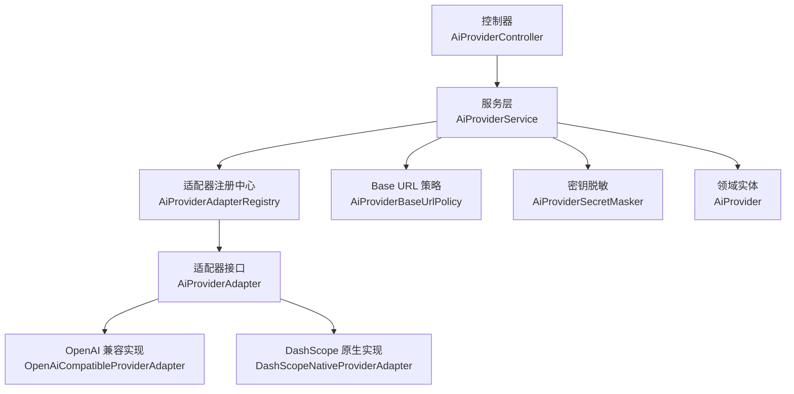
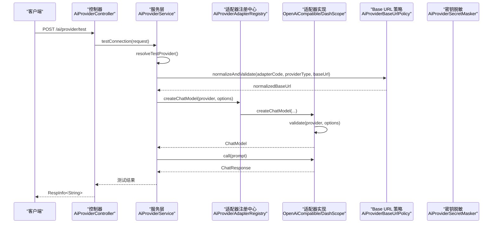
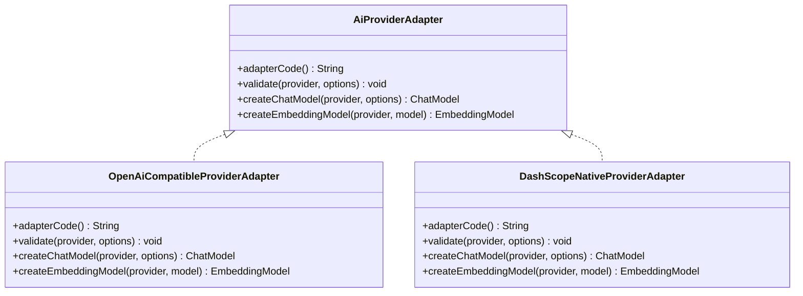
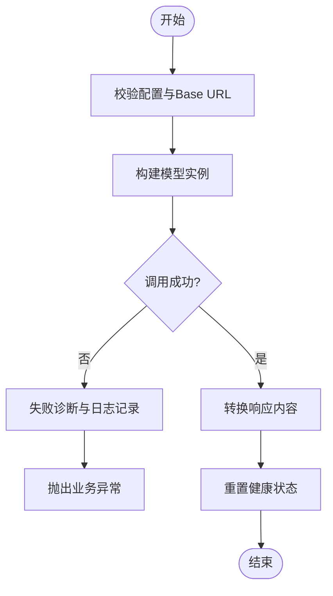
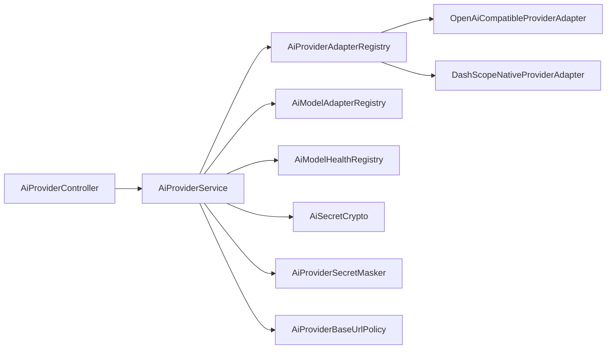

# 自定义供应商开发

<cite>
**本文引用的文件**
- [AiProviderAdapter.java](file://forge-server/forge-framework/forge-plugin-parent/forge-plugin-ai/src/main/java/com/mdframe/forge/plugin/ai/provider/adapter/AiProviderAdapter.java)
- [OpenAiCompatibleProviderAdapter.java](file://forge-server/forge-framework/forge-plugin-parent/forge-plugin-ai/src/main/java/com/mdframe/forge/plugin/ai/provider/adapter/OpenAiCompatibleProviderAdapter.java)
- [DashScopeNativeProviderAdapter.java](file://forge-server/forge-framework/forge-plugin-parent/forge-plugin-ai/src/main/java/com/mdframe/forge/plugin/ai/provider/adapter/DashScopeNativeProviderAdapter.java)
- [AiProviderAdapterCode.java](file://forge-server/forge-framework/forge-plugin-parent/forge-plugin-ai/src/main/java/com/mdframe/forge/plugin/ai/provider/adapter/AiProviderAdapterCode.java)
- [AiModelRuntimeOptions.java](file://forge-server/forge-framework/forge-plugin-parent/forge-plugin-ai/src/main/java/com/mdframe/forge/plugin/ai/provider/adapter/AiModelRuntimeOptions.java)
- [AiProviderBaseUrlPolicy.java](file://forge-server/forge-framework/forge-plugin-parent/forge-plugin-ai/src/main/java/com/mdframe/forge/plugin/ai/provider/adapter/AiProviderBaseUrlPolicy.java)
- [AiProvider.java](file://forge-server/forge-framework/forge-plugin-parent/forge-plugin-ai/src/main/java/com/mdframe/forge/plugin/ai/provider/domain/AiProvider.java)
- [AiProviderService.java](file://forge-server/forge-framework/forge-plugin-parent/forge-plugin-ai/src/main/java/com/mdframe/forge/plugin/ai/provider/service/AiProviderService.java)
- [AiProviderController.java](file://forge-server/forge-framework/forge-plugin-parent/forge-plugin-ai/src/main/java/com/mdframe/forge/plugin/ai/provider/controller/AiProviderController.java)
- [AiProviderSecretMasker.java](file://forge-server/forge-framework/forge-plugin-parent/forge-plugin-ai/src/main/java/com/mdframe/forge/plugin/ai/provider/support/AiProviderSecretMasker.java)
</cite>

## 目录
1. [简介](#简介)
2. [项目结构](#项目结构)
3. [核心组件](#核心组件)
4. [架构总览](#架构总览)
5. [详细组件分析](#详细组件分析)
6. [依赖关系分析](#依赖关系分析)
7. [性能考虑](#性能考虑)
8. [故障排查指南](#故障排查指南)
9. [结论](#结论)
10. [附录](#附录)

## 简介
本文件面向希望为平台扩展新的 AI 供应商（如第三方大模型或私有化部署）的开发者，系统阐述供应商适配器的接口规范、抽象约定与实现要求；统一说明认证机制、请求封装、响应转换与错误处理标准；并提供从配置管理、能力声明到测试用例、插件打包发布与版本管理的完整实践路径。文档同时解释与平台核心功能的集成点与扩展机制，帮助快速落地并稳定运行。

## 项目结构
围绕“AI 供应商”的核心代码位于 AI 插件模块中，关键目录与职责如下：
- 适配器层：定义统一的供应商接入接口与通用策略，提供 OpenAI 兼容与 DashScope 原生两种参考实现
- 领域与服务层：负责供应商配置持久化、连接测试、模型拉取与导入、健康状态管理等业务编排
- 控制器层：对外暴露供应商管理、模板、连接测试、模型同步等 REST API
- 支持工具：密钥脱敏、Base URL 归一化与校验、失败诊断等横切能力

图表来源
- [AiProviderController.java:27-215](file://forge-server/forge-framework/forge-plugin-parent/forge-plugin-ai/src/main/java/com/mdframe/forge/plugin/ai/provider/controller/AiProviderController.java#L27-L215)
- [AiProviderService.java:47-597](file://forge-server/forge-framework/forge-plugin-parent/forge-plugin-ai/src/main/java/com/mdframe/forge/plugin/ai/provider/service/AiProviderService.java#L47-L597)
- [AiProviderAdapter.java:10-44](file://forge-server/forge-framework/forge-plugin-parent/forge-plugin-ai/src/main/java/com/mdframe/forge/plugin/ai/provider/adapter/AiProviderAdapter.java#L10-L44)
- [OpenAiCompatibleProviderAdapter.java:37-210](file://forge-server/forge-framework/forge-plugin-parent/forge-plugin-ai/src/main/java/com/mdframe/forge/plugin/ai/provider/adapter/OpenAiCompatibleProviderAdapter.java#L37-L210)
- [DashScopeNativeProviderAdapter.java:19-81](file://forge-server/forge-framework/forge-plugin-parent/forge-plugin-ai/src/main/java/com/mdframe/forge/plugin/ai/provider/adapter/DashScopeNativeProviderAdapter.java#L19-L81)
- [AiProviderBaseUrlPolicy.java:13-128](file://forge-server/forge-framework/forge-plugin-parent/forge-plugin-ai/src/main/java/com/mdframe/forge/plugin/ai/provider/adapter/AiProviderBaseUrlPolicy.java#L13-L128)
- [AiProviderSecretMasker.java:8-32](file://forge-server/forge-framework/forge-plugin-parent/forge-plugin-ai/src/main/java/com/mdframe/forge/plugin/ai/provider/support/AiProviderSecretMasker.java#L8-L32)
- [AiProvider.java:15-87](file://forge-server/forge-framework/forge-plugin-parent/forge-plugin-ai/src/main/java/com/mdframe/forge/plugin/ai/provider/domain/AiProvider.java#L15-L87)

章节来源
- [AiProviderController.java:27-215](file://forge-server/forge-framework/forge-plugin-parent/forge-plugin-ai/src/main/java/com/mdframe/forge/plugin/ai/provider/controller/AiProviderController.java#L27-L215)
- [AiProviderService.java:47-597](file://forge-server/forge-framework/forge-plugin-parent/forge-plugin-ai/src/main/java/com/mdframe/forge/plugin/ai/provider/service/AiProviderService.java#L47-L597)

## 核心组件
- 适配器接口 AiProviderAdapter：定义适配器代码、参数校验、Chat 模型创建、Embedding 模型创建三个核心方法，作为所有供应商实现的契约
- 运行时选项 AiModelRuntimeOptions：与协议无关的统一 Chat 运行参数（模型标识、温度、最大 Token），并提供缓存键片段生成
- Base URL 策略 AiProviderBaseUrlPolicy：对 Base URL 进行归一化、协议与路径校验，内置多种供应商默认端点映射，并对 DashScope 官方地址做强约束
- 适配器代码枚举 AiProviderAdapterCode：集中管理已知适配器代码，提供严格解析与未知值拒绝策略
- 领域实体 AiProvider：描述供应商名称、类型、适配器代码、Logo、API Key、Base URL、可用模型、默认模型、是否默认、状态、备注等
- 服务层 AiProviderService：聚合适配器、模型、健康、加密、拉取器等能力，提供创建/更新/删除、连接测试、模型拉取与批量导入、默认切换等
- 控制器 AiProviderController：暴露模板、分页查询、详情、增删改、连接测试、设为默认、拉取模型、批量导入等 REST API
- 密钥脱敏 AiProviderSecretMasker：对敏感字段进行安全展示与“未修改”判断

章节来源
- [AiProviderAdapter.java:10-44](file://forge-server/forge-framework/forge-plugin-parent/forge-plugin-ai/src/main/java/com/mdframe/forge/plugin/ai/provider/adapter/AiProviderAdapter.java#L10-L44)
- [AiModelRuntimeOptions.java:1-23](file://forge-server/forge-framework/forge-plugin-parent/forge-plugin-ai/src/main/java/com/mdframe/forge/plugin/ai/provider/adapter/AiModelRuntimeOptions.java#L1-L23)
- [AiProviderBaseUrlPolicy.java:13-128](file://forge-server/forge-framework/forge-plugin-parent/forge-plugin-ai/src/main/java/com/mdframe/forge/plugin/ai/provider/adapter/AiProviderBaseUrlPolicy.java#L13-L128)
- [AiProviderAdapterCode.java:11-39](file://forge-server/forge-framework/forge-plugin-parent/forge-plugin-ai/src/main/java/com/mdframe/forge/plugin/ai/provider/adapter/AiProviderAdapterCode.java#L11-L39)
- [AiProvider.java:15-87](file://forge-server/forge-framework/forge-plugin-parent/forge-plugin-ai/src/main/java/com/mdframe/forge/plugin/ai/provider/domain/AiProvider.java#L15-L87)
- [AiProviderService.java:47-597](file://forge-server/forge-framework/forge-plugin-parent/forge-plugin-ai/src/main/java/com/mdframe/forge/plugin/ai/provider/service/AiProviderService.java#L47-L597)
- [AiProviderController.java:27-215](file://forge-server/forge-framework/forge-plugin-parent/forge-plugin-ai/src/main/java/com/mdframe/forge/plugin/ai/provider/controller/AiProviderController.java#L27-L215)
- [AiProviderSecretMasker.java:8-32](file://forge-server/forge-framework/forge-plugin-parent/forge-plugin-ai/src/main/java/com/mdframe/forge/plugin/ai/provider/support/AiProviderSecretMasker.java#L8-L32)

## 架构总览
下图展示了从控制器到服务、再到适配器与外部模型的调用链，以及跨切面能力（Base URL 策略、密钥脱敏、健康与失败诊断）的参与方式。

图表来源
- [AiProviderController.java:146-151](file://forge-server/forge-framework/forge-plugin-parent/forge-plugin-ai/src/main/java/com/mdframe/forge/plugin/ai/provider/controller/AiProviderController.java#L146-L151)
- [AiProviderService.java:131-173](file://forge-server/forge-framework/forge-plugin-parent/forge-plugin-ai/src/main/java/com/mdframe/forge/plugin/ai/provider/service/AiProviderService.java#L131-L173)
- [AiProviderBaseUrlPolicy.java:45-81](file://forge-server/forge-framework/forge-plugin-parent/forge-plugin-ai/src/main/java/com/mdframe/forge/plugin/ai/provider/adapter/AiProviderBaseUrlPolicy.java#L45-L81)
- [OpenAiCompatibleProviderAdapter.java:46-72](file://forge-server/forge-framework/forge-plugin-parent/forge-plugin-ai/src/main/java/com/mdframe/forge/plugin/ai/provider/adapter/OpenAiCompatibleProviderAdapter.java#L46-L72)
- [DashScopeNativeProviderAdapter.java:27-52](file://forge-server/forge-framework/forge-plugin-parent/forge-plugin-ai/src/main/java/com/mdframe/forge/plugin/ai/provider/adapter/DashScopeNativeProviderAdapter.java#L27-L52)

## 详细组件分析

### 适配器接口与实现要求
- 接口契约
  - adapterCode：返回稳定的适配器代码，用于路由到具体实现
  - validate：校验供应商配置与运行参数，确保后续流程可执行
  - createChatModel：基于提供者配置与运行时参数构建 Chat 模型
  - createEmbeddingModel：构建 Embedding 模型，用于连接测试与向量化
- 实现要点
  - 必须通过 AiProviderAdapterCode 注册的代码进行识别
  - 必须调用 AiProviderBaseUrlPolicy 对 Base URL 进行归一化与校验
  - 必须对必填项（apiKey、model）进行非空校验
  - 建议对上游 HTTP 请求/响应进行日志记录与敏感头脱敏
  - 异常应转换为平台统一的业务异常，便于上层诊断与降级

图表来源
- [AiProviderAdapter.java:10-44](file://forge-server/forge-framework/forge-plugin-parent/forge-plugin-ai/src/main/java/com/mdframe/forge/plugin/ai/provider/adapter/AiProviderAdapter.java#L10-L44)
- [OpenAiCompatibleProviderAdapter.java:37-210](file://forge-server/forge-framework/forge-plugin-parent/forge-plugin-ai/src/main/java/com/mdframe/forge/plugin/ai/provider/adapter/OpenAiCompatibleProviderAdapter.java#L37-L210)
- [DashScopeNativeProviderAdapter.java:19-81](file://forge-server/forge-framework/forge-plugin-parent/forge-plugin-ai/src/main/java/com/mdframe/forge/plugin/ai/provider/adapter/DashScopeNativeProviderAdapter.java#L19-L81)

章节来源
- [AiProviderAdapter.java:10-44](file://forge-server/forge-framework/forge-plugin-parent/forge-plugin-ai/src/main/java/com/mdframe/forge/plugin/ai/provider/adapter/AiProviderAdapter.java#L10-L44)
- [OpenAiCompatibleProviderAdapter.java:46-84](file://forge-server/forge-framework/forge-plugin-parent/forge-plugin-ai/src/main/java/com/mdframe/forge/plugin/ai/provider/adapter/OpenAiCompatibleProviderAdapter.java#L46-L84)
- [DashScopeNativeProviderAdapter.java:27-67](file://forge-server/forge-framework/forge-plugin-parent/forge-plugin-ai/src/main/java/com/mdframe/forge/plugin/ai/provider/adapter/DashScopeNativeProviderAdapter.java#L27-L67)

### 认证机制与请求封装
- 认证凭据
  - API Key：由服务层在保存时加密落库，读取时按需解密；对外展示使用脱敏工具
  - Base URL：通过策略类统一归一化与校验，禁止携带用户信息、查询参数与片段
- 请求封装
  - Chat：通过适配器将 apiKey、baseUrl 与运行时参数注入底层 SDK（如 OpenAI 兼容或 DashScope 原生）
  - Embedding：同理构造 Embedding 模型，用于向量维度验证等连接测试
- 日志与安全
  - 对上游 HTTP 请求/响应进行日志记录，自动屏蔽敏感头（Authorization、Api-Key、Token、Secret、Cookie 等）
  - 对超长响应体进行截断，避免日志膨胀

章节来源
- [AiProviderService.java:89-123](file://forge-server/forge-framework/forge-plugin-parent/forge-plugin-ai/src/main/java/com/mdframe/forge/plugin/ai/provider/service/AiProviderService.java#L89-L123)
- [AiProviderSecretMasker.java:16-30](file://forge-server/forge-framework/forge-plugin-parent/forge-plugin-ai/src/main/java/com/mdframe/forge/plugin/ai/provider/support/AiProviderSecretMasker.java#L16-L30)
- [OpenAiCompatibleProviderAdapter.java:86-161](file://forge-server/forge-framework/forge-plugin-parent/forge-plugin-ai/src/main/java/com/mdframe/forge/plugin/ai/provider/adapter/OpenAiCompatibleProviderAdapter.java#L86-L161)
- [AiProviderBaseUrlPolicy.java:58-118](file://forge-server/forge-framework/forge-plugin-parent/forge-plugin-ai/src/main/java/com/mdframe/forge/plugin/ai/provider/adapter/AiProviderBaseUrlPolicy.java#L58-L118)

### 响应转换与错误处理
- 响应转换
  - 连接测试：根据模型类型返回标准化结果（包含模型标识、向量维度、重排分数、音频大小等）
  - 推理模型：提取思考过程与最终答案，形成可读性更强的测试报告
- 错误处理
  - 配置校验失败：抛出业务异常，附带明确提示
  - 网络/协议错误：捕获并转换为统一业务异常，记录 HTTP 状态码与错误码，便于诊断
  - 健康状态：连接成功后重置供应商健康状态，失败则记录诊断信息

图表来源
- [AiProviderService.java:144-173](file://forge-server/forge-framework/forge-plugin-parent/forge-plugin-ai/src/main/java/com/mdframe/forge/plugin/ai/provider/service/AiProviderService.java#L144-L173)
- [AiProviderService.java:191-234](file://forge-server/forge-framework/forge-plugin-parent/forge-plugin-ai/src/main/java/com/mdframe/forge/plugin/ai/provider/service/AiProviderService.java#L191-L234)
- [AiProviderService.java:551-595](file://forge-server/forge-framework/forge-plugin-parent/forge-plugin-ai/src/main/java/com/mdframe/forge/plugin/ai/provider/service/AiProviderService.java#L551-L595)

章节来源
- [AiProviderService.java:144-173](file://forge-server/forge-framework/forge-plugin-parent/forge-plugin-ai/src/main/java/com/mdframe/forge/plugin/ai/provider/service/AiProviderService.java#L144-L173)
- [AiProviderService.java:191-234](file://forge-server/forge-framework/forge-plugin-parent/forge-plugin-ai/src/main/java/com/mdframe/forge/plugin/ai/provider/service/AiProviderService.java#L191-L234)
- [AiProviderService.java:551-595](file://forge-server/forge-framework/forge-plugin-parent/forge-plugin-ai/src/main/java/com/mdframe/forge/plugin/ai/provider/service/AiProviderService.java#L551-L595)

### 配置管理与能力声明
- 配置项
  - 供应商名称、类型、适配器代码、Logo、API Key、Base URL、可用模型 JSON、默认模型、是否默认、状态、备注
- 能力声明
  - 通过模型类型（聊天、视觉、视频理解、音频理解、嵌入、重排、图像生成、TTS、ASR、视频生成）声明能力
  - 连接测试按类型分发到对应适配器，完成最小连通性验证
- 默认与模板
  - 提供内置模板（阿里百炼原生/兼容、OpenAI、智谱、Moonshot、DeepSeek、Ollama、自定义）
  - 支持设置默认供应商，并在多默认情况下报错

章节来源
- [AiProvider.java:23-87](file://forge-server/forge-framework/forge-plugin-parent/forge-plugin-ai/src/main/java/com/mdframe/forge/plugin/ai/provider/domain/AiProvider.java#L23-L87)
- [AiProviderController.java:36-69](file://forge-server/forge-framework/forge-plugin-parent/forge-plugin-ai/src/main/java/com/mdframe/forge/plugin/ai/provider/controller/AiProviderController.java#L36-L69)
- [AiProviderService.java:72-81](file://forge-server/forge-framework/forge-plugin-parent/forge-plugin-ai/src/main/java/com/mdframe/forge/plugin/ai/provider/service/AiProviderService.java#L72-L81)

### 测试用例与连接测试
- 连接测试入口
  - 已保存供应商：仅传 ID，服务层加载配置后测试
  - 未保存供应商：提交完整配置（名称、类型、适配器代码、API Key、Base URL、默认模型）
- 测试流程
  - Chat 类：构造 Prompt 调用模型，提取回复与思考过程
  - 非 Chat 类：按类型分发到嵌入、重排、图像、TTS 等适配器进行最小调用
- 结果输出
  - 标准化文本结果，包含模型标识、向量维度、重排分数、音频大小等

章节来源
- [AiProviderController.java:146-151](file://forge-server/forge-framework/forge-plugin-parent/forge-plugin-ai/src/main/java/com/mdframe/forge/plugin/ai/provider/controller/AiProviderController.java#L146-L151)
- [AiProviderService.java:131-234](file://forge-server/forge-framework/forge-plugin-parent/forge-plugin-ai/src/main/java/com/mdframe/forge/plugin/ai/provider/service/AiProviderService.java#L131-L234)

### 插件打包、发布与版本管理最佳实践
- 插件边界
  - 新增适配器实现需遵循 AiProviderAdapter 接口，并通过注册中心暴露
  - 新增适配器代码需在 AiProviderAdapterCode 中登记，保证严格匹配
- 版本管理
  - 适配器代码保持稳定，变更需评估兼容性
  - Base URL 策略与默认端点映射集中维护，避免分散配置导致不一致
- 发布流程
  - 单元测试覆盖：适配器校验、Base URL 校验、连接测试分支
  - 集成测试：端到端测试 Chat/Embedding 等能力
  - 灰度发布：先小范围启用新适配器，观察健康指标与错误率
  - 回滚预案：保留旧版本适配器与配置迁移脚本

[本节为通用实践指导，不直接分析具体文件]

### 与平台核心功能的集成点与扩展机制
- 集成点
  - 模型适配器注册中心：按模型标识分发嵌入、重排、图像、语音等能力
  - 健康注册中心：连接成功后重置健康状态，失败记录诊断信息
  - 加密与脱敏：API Key 加密存储与展示脱敏
  - 模型拉取器：通过 OpenAI 兼容 /v1/models 拉取可用模型列表
- 扩展机制
  - 新增模型类型：在服务层增加分发逻辑与测试用例
  - 新增供应商：实现适配器并登记代码，必要时调整 Base URL 策略
  - 新增能力：在模型适配器注册中心注册新能力，完善连接测试

章节来源
- [AiProviderService.java:224-262](file://forge-server/forge-framework/forge-plugin-parent/forge-plugin-ai/src/main/java/com/mdframe/forge/plugin/ai/provider/service/AiProviderService.java#L224-L262)
- [AiProviderService.java:284-289](file://forge-server/forge-framework/forge-plugin-parent/forge-plugin-ai/src/main/java/com/mdframe/forge/plugin/ai/provider/service/AiProviderService.java#L284-L289)
- [AiProviderService.java:591-595](file://forge-server/forge-framework/forge-plugin-parent/forge-plugin-ai/src/main/java/com/mdframe/forge/plugin/ai/provider/service/AiProviderService.java#L591-L595)

## 依赖关系分析
- 组件耦合
  - 控制器依赖服务层，服务层依赖适配器注册中心、模型适配器注册中心、健康注册中心、加密与脱敏工具、Base URL 策略
  - 适配器实现依赖各自 SDK（OpenAI 兼容、DashScope 原生）
- 外部依赖
  - Spring AI 的 ChatModel/EmbeddingModel
  - 各供应商 SDK（OpenAI、DashScope）
- 潜在风险
  - 适配器代码未登记导致路由失败
  - Base URL 非法导致连接失败
  - 密钥未正确加密/脱敏导致安全风险

图表来源
- [AiProviderController.java:27-215](file://forge-server/forge-framework/forge-plugin-parent/forge-plugin-ai/src/main/java/com/mdframe/forge/plugin/ai/provider/controller/AiProviderController.java#L27-L215)
- [AiProviderService.java:47-597](file://forge-server/forge-framework/forge-plugin-parent/forge-plugin-ai/src/main/java/com/mdframe/forge/plugin/ai/provider/service/AiProviderService.java#L47-L597)
- [OpenAiCompatibleProviderAdapter.java:37-210](file://forge-server/forge-framework/forge-plugin-parent/forge-plugin-ai/src/main/java/com/mdframe/forge/plugin/ai/provider/adapter/OpenAiCompatibleProviderAdapter.java#L37-L210)
- [DashScopeNativeProviderAdapter.java:19-81](file://forge-server/forge-framework/forge-plugin-parent/forge-plugin-ai/src/main/java/com/mdframe/forge/plugin/ai/provider/adapter/DashScopeNativeProviderAdapter.java#L19-L81)

章节来源
- [AiProviderService.java:47-597](file://forge-server/forge-framework/forge-plugin-parent/forge-plugin-ai/src/main/java/com/mdframe/forge/plugin/ai/provider/service/AiProviderService.java#L47-L597)

## 性能考虑
- 连接测试最小化：使用较小 Token 限制与简单 Prompt，降低延迟与成本
- 日志裁剪：对请求/响应体进行截断，避免 I/O 与存储压力
- 健康状态：连接成功后重置健康状态，减少重复探测
- 模型拉取：仅在需要时调用 /v1/models，避免频繁请求

[本节为通用性能指导，不直接分析具体文件]

## 故障排查指南
- 常见错误
  - Base URL 格式不正确或缺少域名：检查策略类抛出的业务异常
  - 不支持的适配器代码：确认已在枚举中登记且注册中心存在实现
  - API Key 为空或未加密：检查保存流程中的加密逻辑
  - 连接失败：查看失败诊断中的 HTTP 状态码与错误码
- 定位步骤
  - 控制器层：确认请求参数与权限注解生效
  - 服务层：核对 Provider 配置与模型选择
  - 适配器层：检查 Base URL 与运行时参数
  - 日志：关注上游 HTTP 请求/响应与敏感头脱敏后的内容

章节来源
- [AiProviderService.java:144-173](file://forge-server/forge-framework/forge-plugin-parent/forge-plugin-ai/src/main/java/com/mdframe/forge/plugin/ai/provider/service/AiProviderService.java#L144-L173)
- [AiProviderService.java:191-234](file://forge-server/forge-framework/forge-plugin-parent/forge-plugin-ai/src/main/java/com/mdframe/forge/plugin/ai/provider/service/AiProviderService.java#L191-L234)
- [AiProviderBaseUrlPolicy.java:83-118](file://forge-server/forge-framework/forge-plugin-parent/forge-plugin-ai/src/main/java/com/mdframe/forge/plugin/ai/provider/adapter/AiProviderBaseUrlPolicy.java#L83-L118)
- [AiProviderAdapterCode.java:26-37](file://forge-server/forge-framework/forge-plugin-parent/forge-plugin-ai/src/main/java/com/mdframe/forge/plugin/ai/provider/adapter/AiProviderAdapterCode.java#L26-L37)

## 结论
通过统一的适配器接口、严格的 Base URL 策略、集中的适配器代码管理、完善的连接测试与健康机制，平台为自定义 AI 供应商提供了清晰、可扩展且安全的接入范式。开发者只需实现适配器接口、登记适配器代码、补充测试用例，即可快速集成新的供应商，并与平台核心功能无缝协作。

## 附录
- 快速上手清单
  - 新增适配器实现并实现四个核心方法
  - 在适配器代码枚举中登记新代码
  - 编写单元测试：校验、Base URL、连接测试
  - 编写集成测试：端到端调用 Chat/Embedding
  - 灰度发布与监控：观察健康状态与错误率
  - 文档与培训：更新适配器使用指南与最佳实践

[本节为通用实践指导，不直接分析具体文件]