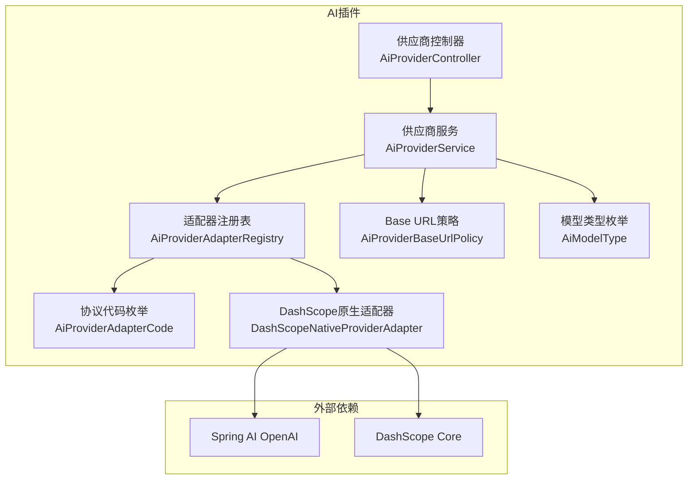
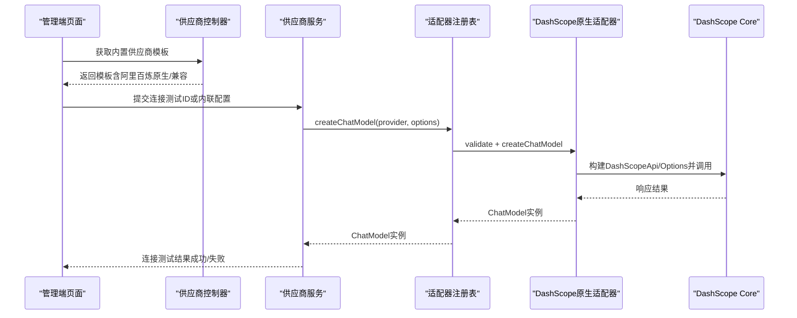
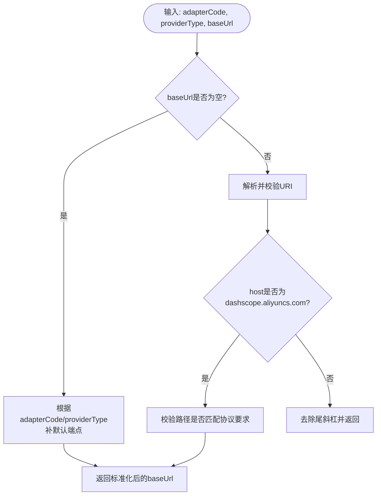
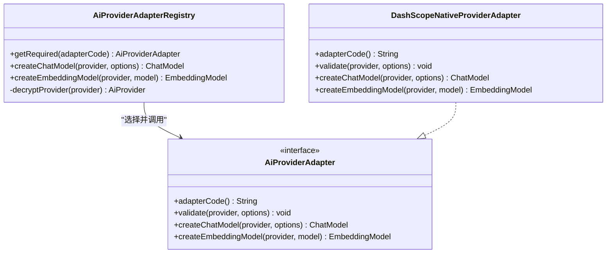
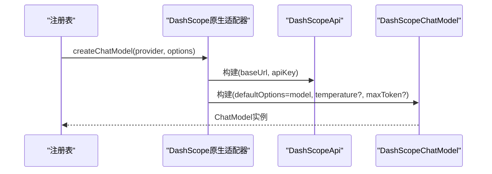
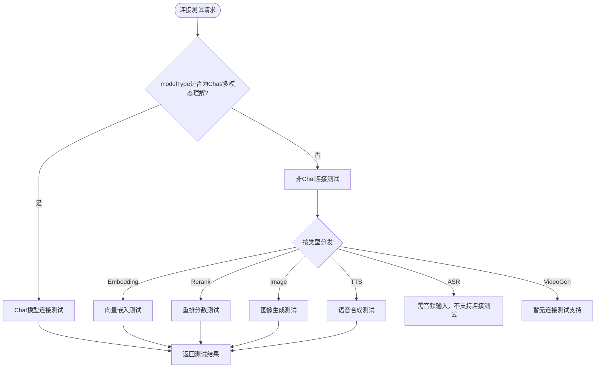
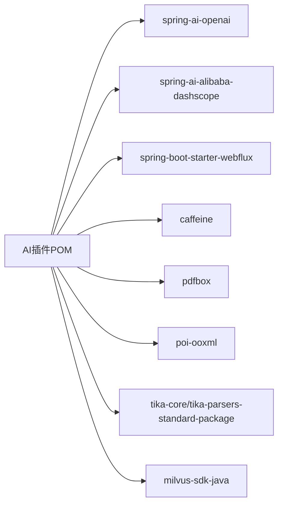

# 阿里百炼供应商集成

<cite>
**本文引用的文件**
- [DashScopeNativeProviderAdapter.java](file://forge-server/forge-framework/forge-plugin-parent/forge-plugin-ai/src/main/java/com/mdframe/forge/plugin/ai/provider/adapter/DashScopeNativeProviderAdapter.java)
- [AiProviderAdapterRegistry.java](file://forge-server/forge-framework/forge-plugin-parent/forge-plugin-ai/src/main/java/com/mdframe/forge/plugin/ai/provider/adapter/AiProviderAdapterRegistry.java)
- [AiProviderAdapterCode.java](file://forge-server/forge-framework/forge-plugin-parent/forge-plugin-ai/src/main/java/com/mdframe/forge/plugin/ai/provider/adapter/AiProviderAdapterCode.java)
- [AiProviderBaseUrlPolicy.java](file://forge-server/forge-framework/forge-plugin-parent/forge-plugin-ai/src/main/java/com/mdframe/forge/plugin/ai/provider/adapter/AiProviderBaseUrlPolicy.java)
- [AiProviderService.java](file://forge-server/forge-framework/forge-plugin-parent/forge-plugin-ai/src/main/java/com/mdframe/forge/plugin/ai/provider/service/AiProviderService.java)
- [AiModelType.java](file://forge-server/forge-framework/forge-plugin-parent/forge-plugin-ai/src/main/java/com/mdframe/forge/plugin/ai/model/constant/AiModelType.java)
- [AiProviderController.java](file://forge-server/forge-framework/forge-plugin-parent/forge-plugin-ai/src/main/java/com/mdframe/forge/plugin/ai/provider/controller/AiProviderController.java)
- [provider-model.vue](file://forge-admin-ui/src/views/ai/provider-model.vue)
- [pom.xml（AI插件）](file://forge-server/forge-framework/forge-plugin-parent/forge-plugin-ai/pom.xml)
- [execution-log.md](file://code-copilot/changes/archive/2026-07-11-spring-ai-alibaba-provider-adapter/execution-log.md)
</cite>

## 目录
1. [简介](#简介)
2. [项目结构](#项目结构)
3. [核心组件](#核心组件)
4. [架构总览](#架构总览)
5. [详细组件分析](#详细组件分析)
6. [依赖关系分析](#依赖关系分析)
7. [性能与可靠性](#性能与可靠性)
8. [故障排查指南](#故障排查指南)
9. [结论](#结论)
10. [附录：配置与最佳实践](#附录配置与最佳实践)

## 简介
本技术文档面向企业级集成阿里云百炼（DashScope）的供应商接入方案，覆盖认证方式、服务开通流程、SDK集成方法、DashScope API调用、通义千问系列模型配置与最佳实践，以及企业部署、安全配置、监控告警和与阿里云其他服务的集成思路。文档基于仓库中已实现的“阿里百炼（原生）”适配器与“阿里百炼（兼容模式）”模板，结合统一的供应商注册表、URL策略校验、连接测试与模型管理能力进行说明。

## 项目结构
本项目在 AI 插件模块内实现了多供应商抽象与 DashScope 原生适配：
- 供应商适配器层：定义统一接口、注册表、协议代码与 Base URL 策略。
- 服务层：提供供应商增删改查、连接测试、模型拉取与导入、健康状态重置等能力。
- 控制层：暴露内置供应商模板（含阿里百炼原生与兼容模式）。
- 前端管理页：展示供应商详情、密钥脱敏显示、连接验证入口。
- 依赖与版本：通过 Maven POM 引入 Spring AI OpenAI 与 DashScope Core，避免 Starter 自动配置干扰租户动态配置。

**图表来源**
- [AiProviderAdapterRegistry.java:1-128](file://forge-server/forge-framework/forge-plugin-parent/forge-plugin-ai/src/main/java/com/mdframe/forge/plugin/ai/provider/adapter/AiProviderAdapterRegistry.java#L1-L128)
- [DashScopeNativeProviderAdapter.java:1-81](file://forge-server/forge-framework/forge-plugin-parent/forge-plugin-ai/src/main/java/com/mdframe/forge/plugin/ai/provider/adapter/DashScopeNativeProviderAdapter.java#L1-L81)
- [AiProviderBaseUrlPolicy.java:1-128](file://forge-server/forge-framework/forge-plugin-parent/forge-plugin-ai/src/main/java/com/mdframe/forge/plugin/ai/provider/adapter/AiProviderBaseUrlPolicy.java#L1-L128)
- [AiProviderService.java:1-597](file://forge-server/forge-framework/forge-plugin-parent/forge-plugin-ai/src/main/java/com/mdframe/forge/plugin/ai/provider/service/AiProviderService.java#L1-L597)
- [AiProviderController.java:36-58](file://forge-server/forge-framework/forge-plugin-parent/forge-plugin-ai/src/main/java/com/mdframe/forge/plugin/ai/provider/controller/AiProviderController.java#L36-L58)
- [AiModelType.java:1-145](file://forge-server/forge-framework/forge-plugin-parent/forge-plugin-ai/src/main/java/com/mdframe/forge/plugin/ai/model/constant/AiModelType.java#L1-L145)

**章节来源**
- [AiProviderAdapterRegistry.java:1-128](file://forge-server/forge-framework/forge-plugin-parent/forge-plugin-ai/src/main/java/com/mdframe/forge/plugin/ai/provider/adapter/AiProviderAdapterRegistry.java#L1-L128)
- [DashScopeNativeProviderAdapter.java:1-81](file://forge-server/forge-framework/forge-plugin-parent/forge-plugin-ai/src/main/java/com/mdframe/forge/plugin/ai/provider/adapter/DashScopeNativeProviderAdapter.java#L1-L81)
- [AiProviderBaseUrlPolicy.java:1-128](file://forge-server/forge-framework/forge-plugin-parent/forge-plugin-ai/src/main/java/com/mdframe/forge/plugin/ai/provider/adapter/AiProviderBaseUrlPolicy.java#L1-L128)
- [AiProviderService.java:1-597](file://forge-server/forge-framework/forge-plugin-parent/forge-plugin-ai/src/main/java/com/mdframe/forge/plugin/ai/provider/service/AiProviderService.java#L1-L597)
- [AiProviderController.java:36-58](file://forge-server/forge-framework/forge-plugin-parent/forge-plugin-ai/src/main/java/com/mdframe/forge/plugin/ai/provider/controller/AiProviderController.java#L36-L58)
- [AiModelType.java:1-145](file://forge-server/forge-framework/forge-plugin-parent/forge-plugin-ai/src/main/java/com/mdframe/forge/plugin/ai/model/constant/AiModelType.java#L1-L145)

## 核心组件
- 适配器协议代码：集中管理支持的连接协议，拒绝未知或空值，确保路由安全。
- Base URL 策略：对官方 DashScope 地址进行强制路径校验，防止误配；支持按供应商类型补默认端点。
- 适配器注册表：唯一入口，负责选择适配器、校验参数、创建 ChatModel/EmbeddingModel，并在构造前解密密钥。
- DashScope 原生适配器：基于 DashScope Core 构建 Chat/Embedding 模型，映射通用运行参数到原生 Options。
- 供应商服务：封装连接测试、模型拉取、批量导入、健康状态重置、视图脱敏等。
- 控制器：提供内置供应商模板（包含阿里百炼原生与兼容模式），便于快速初始化。
- 模型类型：细粒度区分对话、视觉理解、视频理解、音频理解、向量化、重排、图像生成、视频生成、ASR、TTS，并支持从 modelId 启发式推断。

**章节来源**
- [AiProviderAdapterCode.java:1-38](file://forge-server/forge-framework/forge-plugin-parent/forge-plugin-ai/src/main/java/com/mdframe/forge/plugin/ai/provider/adapter/AiProviderAdapterCode.java#L1-L38)
- [AiProviderBaseUrlPolicy.java:1-128](file://forge-server/forge-framework/forge-plugin-parent/forge-plugin-ai/src/main/java/com/mdframe/forge/plugin/ai/provider/adapter/AiProviderBaseUrlPolicy.java#L1-L128)
- [AiProviderAdapterRegistry.java:1-128](file://forge-server/forge-framework/forge-plugin-parent/forge-plugin-ai/src/main/java/com/mdframe/forge/plugin/ai/provider/adapter/AiProviderAdapterRegistry.java#L1-L128)
- [DashScopeNativeProviderAdapter.java:1-81](file://forge-server/forge-framework/forge-plugin-parent/forge-plugin-ai/src/main/java/com/mdframe/forge/plugin/ai/provider/adapter/DashScopeNativeProviderAdapter.java#L1-L81)
- [AiProviderService.java:1-597](file://forge-server/forge-framework/forge-plugin-parent/forge-plugin-ai/src/main/java/com/mdframe/forge/plugin/ai/provider/service/AiProviderService.java#L1-L597)
- [AiProviderController.java:36-58](file://forge-server/forge-framework/forge-plugin-parent/forge-plugin-ai/src/main/java/com/mdframe/forge/plugin/ai/provider/controller/AiProviderController.java#L36-L58)
- [AiModelType.java:1-145](file://forge-server/forge-framework/forge-plugin-parent/forge-plugin-ai/src/main/java/com/mdframe/forge/plugin/ai/model/constant/AiModelType.java#L1-L145)

## 架构总览
系统采用“适配器 + 注册表 + 策略”的分层设计：
- 控制器暴露模板与基础能力。
- 服务层编排连接测试、模型拉取与导入、健康状态管理。
- 注册表作为唯一入口，完成协议选择、参数校验、模型创建。
- 具体适配器对接第三方 SDK（如 DashScope Core）。
- Base URL 策略保障官方地址与协议匹配，避免错误路由。

**图表来源**
- [AiProviderController.java:36-58](file://forge-server/forge-framework/forge-plugin-parent/forge-plugin-ai/src/main/java/com/mdframe/forge/plugin/ai/provider/controller/AiProviderController.java#L36-L58)
- [AiProviderService.java:125-173](file://forge-server/forge-framework/forge-plugin-parent/forge-plugin-ai/src/main/java/com/mdframe/forge/plugin/ai/provider/service/AiProviderService.java#L125-L173)
- [AiProviderAdapterRegistry.java:54-78](file://forge-server/forge-framework/forge-plugin-parent/forge-plugin-ai/src/main/java/com/mdframe/forge/plugin/ai/provider/adapter/AiProviderAdapterRegistry.java#L54-L78)
- [DashScopeNativeProviderAdapter.java:33-52](file://forge-server/forge-framework/forge-plugin-parent/forge-plugin-ai/src/main/java/com/mdframe/forge/plugin/ai/provider/adapter/DashScopeNativeProviderAdapter.java#L33-L52)

## 详细组件分析

### 适配器协议与 Base URL 策略
- 协议代码枚举仅允许已知值，空值或未知值直接失败关闭，避免回退到默认实现。
- Base URL 策略：
  - 当 adapterCode 为 DashScope 原生时，若未提供 baseUrl，则使用官方根地址。
  - 当 adapterCode 为 OpenAI Compatible 且 host 为 dashscope.aliyuncs.com 时，必须使用 /compatible-mode 路径。
  - 对非官方地址进行通用 URI 校验（协议、域名、禁止用户信息/查询/片段）。

**图表来源**
- [AiProviderBaseUrlPolicy.java:45-81](file://forge-server/forge-framework/forge-plugin-parent/forge-plugin-ai/src/main/java/com/mdframe/forge/plugin/ai/provider/adapter/AiProviderBaseUrlPolicy.java#L45-L81)
- [AiProviderBaseUrlPolicy.java:110-118](file://forge-server/forge-framework/forge-plugin-parent/forge-plugin-ai/src/main/java/com/mdframe/forge/plugin/ai/provider/adapter/AiProviderBaseUrlPolicy.java#L110-L118)

**章节来源**
- [AiProviderAdapterCode.java:20-38](file://forge-server/forge-framework/forge-plugin-parent/forge-plugin-ai/src/main/java/com/mdframe/forge/plugin/ai/provider/adapter/AiProviderAdapterCode.java#L20-L38)
- [AiProviderBaseUrlPolicy.java:1-128](file://forge-server/forge-framework/forge-plugin-parent/forge-plugin-ai/src/main/java/com/mdframe/forge/plugin/ai/provider/adapter/AiProviderBaseUrlPolicy.java#L1-L128)

### 适配器注册表与模型创建
- 注册表维护适配器映射，启动期检测重复注册。
- 创建 ChatModel/EmbeddingModel 前解密 apiKey，再选择适配器执行 validate 与 create。
- 日志记录关键上下文（providerId、adapterCode、model、temperature、maxTokens、是否加密），便于审计与诊断。

**图表来源**
- [AiProviderAdapterRegistry.java:1-128](file://forge-server/forge-framework/forge-plugin-parent/forge-plugin-ai/src/main/java/com/mdframe/forge/plugin/ai/provider/adapter/AiProviderAdapterRegistry.java#L1-L128)
- [DashScopeNativeProviderAdapter.java:1-81](file://forge-server/forge-framework/forge-plugin-parent/forge-plugin-ai/src/main/java/com/mdframe/forge/plugin/ai/provider/adapter/DashScopeNativeProviderAdapter.java#L1-L81)

**章节来源**
- [AiProviderAdapterRegistry.java:26-78](file://forge-server/forge-framework/forge-plugin-parent/forge-plugin-ai/src/main/java/com/mdframe/forge/plugin/ai/provider/adapter/AiProviderAdapterRegistry.java#L26-L78)
- [DashScopeNativeProviderAdapter.java:27-67](file://forge-server/forge-framework/forge-plugin-parent/forge-plugin-ai/src/main/java/com/mdframe/forge/plugin/ai/provider/adapter/DashScopeNativeProviderAdapter.java#L27-L67)

### DashScope 原生适配器与参数映射
- 使用 DashScope Core 构建 DashScopeApi，传入 baseUrl 与 apiKey。
- 将通用运行参数 temperature、maxTokens 映射到 DashScopeChatOptions。
- Embedding 模型设置 MetadataMode.NONE，并使用 DashScopeEmbeddingOptions 指定模型。

**图表来源**
- [DashScopeNativeProviderAdapter.java:33-52](file://forge-server/forge-framework/forge-plugin-parent/forge-plugin-ai/src/main/java/com/mdframe/forge/plugin/ai/provider/adapter/DashScopeNativeProviderAdapter.java#L33-L52)

**章节来源**
- [DashScopeNativeProviderAdapter.java:33-67](file://forge-server/forge-framework/forge-plugin-parent/forge-plugin-ai/src/main/java/com/mdframe/forge/plugin/ai/provider/adapter/DashScopeNativeProviderAdapter.java#L33-L67)

### 连接测试与模型类型分发
- 连接测试入口根据 modelType 判断走 Chat 或非 Chat 路径。
- 非 Chat 类型（Embedding/Rerank/Image/TTS）通过模型层适配器分发执行，返回维度/分数/大小等指标。
- 对 ASR 与视频生成给出明确限制提示。

**图表来源**
- [AiProviderService.java:125-234](file://forge-server/forge-framework/forge-plugin-parent/forge-plugin-ai/src/main/java/com/mdframe/forge/plugin/ai/provider/service/AiProviderService.java#L125-L234)

**章节来源**
- [AiProviderService.java:125-234](file://forge-server/forge-framework/forge-plugin-parent/forge-plugin-ai/src/main/java/com/mdframe/forge/plugin/ai/provider/service/AiProviderService.java#L125-L234)
- [AiModelType.java:15-34](file://forge-server/forge-framework/forge-plugin-parent/forge-plugin-ai/src/main/java/com/mdframe/forge/plugin/ai/model/constant/AiModelType.java#L15-L34)

### 内置模板与管理端交互
- 控制器提供内置模板，包括阿里百炼（原生）与阿里百炼（兼容模式），分别对应不同 adapterCode 与 baseUrl。
- 管理端页面展示供应商详情、Base URL、备注、API Key 脱敏显示与“验证连接”按钮。

**章节来源**
- [AiProviderController.java:36-58](file://forge-server/forge-framework/forge-plugin-parent/forge-plugin-ai/src/main/java/com/mdframe/forge/plugin/ai/provider/controller/AiProviderController.java#L36-L58)
- [provider-model.vue:182-219](file://forge-admin-ui/src/views/ai/provider-model.vue#L182-L219)

## 依赖关系分析
- 依赖基线：
  - Spring AI OpenAI：用于 ChatClient、MessageChatMemoryAdvisor 等对话客户端能力。
  - DashScope Core：用于构建 DashScopeApi/ChatModel/EmbeddingModel，避免 Starter 自动配置与全局 API Key 冲突。
  - WebFlux：支持流式 SSE 响应。
  - Caffeine：本地缓存。
  - 文件与文档解析：PDF、Word、Tika。
  - Milvus SDK：直连向量数据库。
- 仓库源：Maven Central、阿里云镜像、华为云镜像、Spring里程碑/快照仓库。

**图表来源**
- [pom.xml（AI插件）:14-137](file://forge-server/forge-framework/forge-plugin-parent/forge-plugin-ai/pom.xml#L14-L137)

**章节来源**
- [pom.xml（AI插件）:14-137](file://forge-server/forge-framework/forge-plugin-parent/forge-plugin-ai/pom.xml#L14-L137)
- [execution-log.md:9-14](file://code-copilot/changes/archive/2026-07-11-spring-ai-alibaba-provider-adapter/execution-log.md#L9-L14)

## 性能与可靠性
- 连接测试限流：使用较小的 maxTokens（常量定义）降低测试成本与延迟。
- 健康状态重置：连接成功后重置供应商健康状态，便于后续监控与重试策略。
- 日志与诊断：记录 HTTP 状态码与错误码，不输出敏感信息（API Key、响应正文），便于生产可观测性。
- 模型类型推断：通过 modelId 启发式分类，减少人工配置错误导致的链路异常。

[本节为通用指导，不直接分析具体文件]

## 故障排查指南
- 常见错误与处理：
  - Base URL 格式不正确或缺少域名：检查协议与域名合法性。
  - DashScope 原生协议使用了带路径的地址：必须使用官方根地址。
  - DashScope OpenAI Compatible 协议未使用 /compatible-mode：修正路径。
  - 未保存供应商测试缺少默认模型：补充 defaultModel。
  - 已保存供应商测试提交了内联配置：仅允许提交 ID。
  - 连接失败：查看日志中的 httpStatus 与 errorCode，确认网络与密钥。
- 建议步骤：
  - 先使用内置模板快速验证连通性。
  - 逐步替换 baseUrl 与 model，定位问题范围。
  - 关注健康状态与重试策略，避免雪崩。

**章节来源**
- [AiProviderService.java:141-218](file://forge-server/forge-framework/forge-plugin-parent/forge-plugin-ai/src/main/java/com/mdframe/forge/plugin/ai/provider/service/AiProviderService.java#L141-L218)
- [AiProviderBaseUrlPolicy.java:83-118](file://forge-server/forge-framework/forge-plugin-parent/forge-plugin-ai/src/main/java/com/mdframe/forge/plugin/ai/provider/adapter/AiProviderBaseUrlPolicy.java#L83-L118)

## 结论
本集成通过适配器与注册表解耦第三方 SDK，结合严格的 Base URL 策略与连接测试机制，提供了稳定、可观测、易扩展的阿里百炼接入方案。企业可在统一管理界面快速启用阿里百炼（原生/兼容）模板，并通过模型类型推断与批量导入提升运维效率。配合健康状态与日志诊断，可满足生产环境的可靠性与可维护性要求。

[本节为总结性内容，不直接分析具体文件]

## 附录：配置与最佳实践

### 认证与服务开通
- 认证方式：使用 DashScope API Key，由系统在存储层加密、运行时解密后注入到 DashScopeApi。
- 服务开通：在管理端选择“阿里百炼（原生）”或“阿里百炼（兼容模式）”模板，填写 Base URL 与 API Key，保存后即可进行连接测试。

**章节来源**
- [AiProviderController.java:36-58](file://forge-server/forge-framework/forge-plugin-parent/forge-plugin-ai/src/main/java/com/mdframe/forge/plugin/ai/provider/controller/AiProviderController.java#L36-L58)
- [AiProviderService.java:89-123](file://forge-server/forge-framework/forge-plugin-parent/forge-plugin-ai/src/main/java/com/mdframe/forge/plugin/ai/provider/service/AiProviderService.java#L89-L123)

### SDK集成与方法
- 集成方式：通过 DashScope Native 适配器使用 DashScope Core 构建 Chat/Embedding 模型。
- 方法调用：
  - Chat：传入 model、temperature、maxTokens，调用 DashScopeChatModel。
  - Embedding：设置 MetadataMode.NONE，调用 DashScopeEmbeddingModel。

**章节来源**
- [DashScopeNativeProviderAdapter.java:33-67](file://forge-server/forge-framework/forge-plugin-parent/forge-plugin-ai/src/main/java/com/mdframe/forge/plugin/ai/provider/adapter/DashScopeNativeProviderAdapter.java#L33-L67)

### 模型调用参数与响应处理
- 参数映射：temperature、maxTokens 映射到 DashScopeChatOptions；model 作为默认选项。
- 响应处理：连接测试提取可见文本与推理内容（reasoningContent/reasoning_content/reasoning），并格式化输出。

**章节来源**
- [DashScopeNativeProviderAdapter.java:40-51](file://forge-server/forge-framework/forge-plugin-parent/forge-plugin-ai/src/main/java/com/mdframe/forge/plugin/ai/provider/adapter/DashScopeNativeProviderAdapter.java#L40-L51)
- [AiProviderService.java:551-589](file://forge-server/forge-framework/forge-plugin-parent/forge-plugin-ai/src/main/java/com/mdframe/forge/plugin/ai/provider/service/AiProviderService.java#L551-L589)

### 通义千问系列模型配置与最佳实践
- 模型选择：优先使用 qwen-plus 等对话模型进行连通性验证；视觉/视频/音频理解模型走 Chat 协议。
- 参数调优：合理设置 temperature 与 maxTokens，避免过长响应导致超时或成本上升。
- 类型推断：利用 AiModelType.inferFromModelId 自动识别模型类型，减少配置错误。

**章节来源**
- [AiModelType.java:69-143](file://forge-server/forge-framework/forge-plugin-parent/forge-plugin-ai/src/main/java/com/mdframe/forge/plugin/ai/model/constant/AiModelType.java#L69-L143)

### 企业级部署与安全配置
- 密钥管理：API Key 存储加密，运行时解密；视图层脱敏显示。
- 网络策略：Base URL 仅允许 http/https，禁止用户信息、查询参数与片段。
- 访问控制：管理端新增/更新/测试请求启用加密传输，避免明文泄露。

**章节来源**
- [AiProviderService.java:356-380](file://forge-server/forge-framework/forge-plugin-parent/forge-plugin-ai/src/main/java/com/mdframe/forge/plugin/ai/provider/service/AiProviderService.java#L356-L380)
- [AiProviderBaseUrlPolicy.java:91-108](file://forge-server/forge-framework/forge-plugin-parent/forge-plugin-ai/src/main/java/com/mdframe/forge/plugin/ai/provider/adapter/AiProviderBaseUrlPolicy.java#L91-L108)

### 监控告警与可观测性
- 日志字段：记录 providerId、adapterCode、model、temperature、maxTokens、httpStatus、errorCode。
- 健康状态：连接成功后重置供应商健康状态，便于监控与告警。
- 错误分类：对业务异常与网络异常分别处理，避免掩盖真实错误。

**章节来源**
- [AiProviderService.java:157-171](file://forge-server/forge-framework/forge-plugin-parent/forge-plugin-ai/src/main/java/com/mdframe/forge/plugin/ai/provider/service/AiProviderService.java#L157-L171)
- [AiProviderService.java:591-595](file://forge-server/forge-framework/forge-plugin-parent/forge-plugin-ai/src/main/java/com/mdframe/forge/plugin/ai/provider/service/AiProviderService.java#L591-L595)

### 与阿里云其他服务的集成与数据同步
- 向量数据库：通过 Milvus SDK 直连，结合 Embedding 模型完成向量化与检索。
- 文件与文档解析：PDF、Word、Tika 支持长文档解析，便于知识库构建。
- 数据同步：批量导入模型后，同步供应商 models 与 defaultModel 摘要，保持权威一致。

**章节来源**
- [AiProviderService.java:300-353](file://forge-server/forge-framework/forge-plugin-parent/forge-plugin-ai/src/main/java/com/mdframe/forge/plugin/ai/provider/service/AiProviderService.java#L300-L353)
- [pom.xml（AI插件）:75-112](file://forge-server/forge-framework/forge-plugin-parent/forge-plugin-ai/pom.xml#L75-L112)