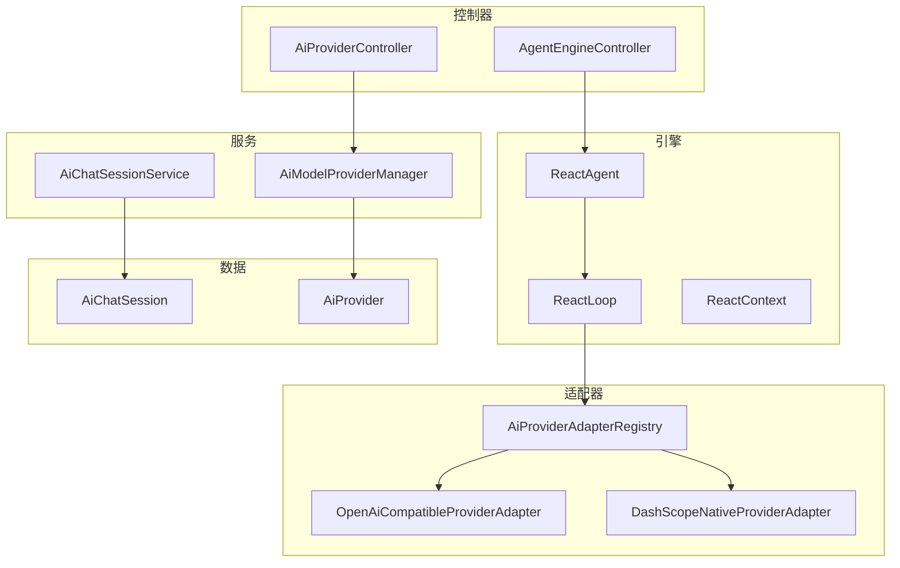
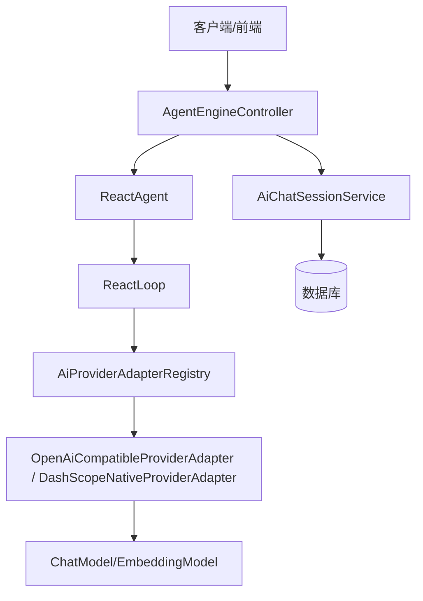
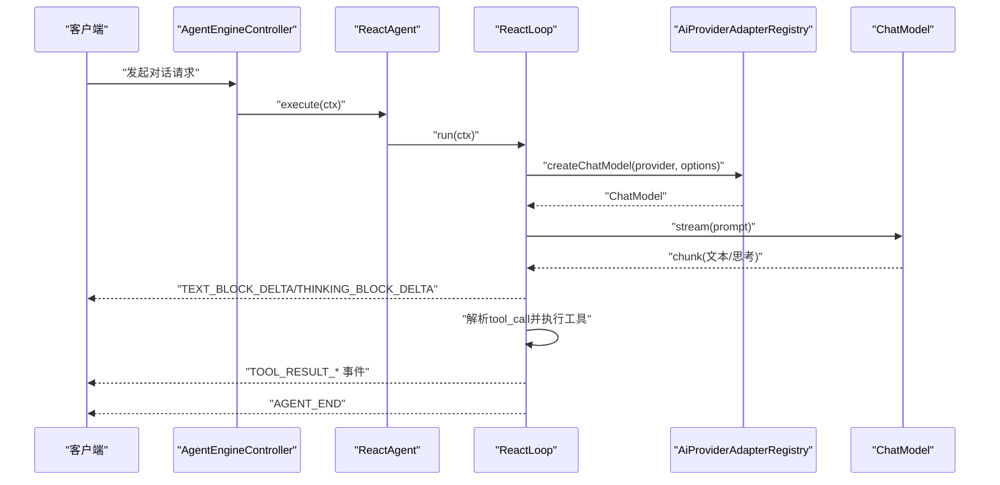
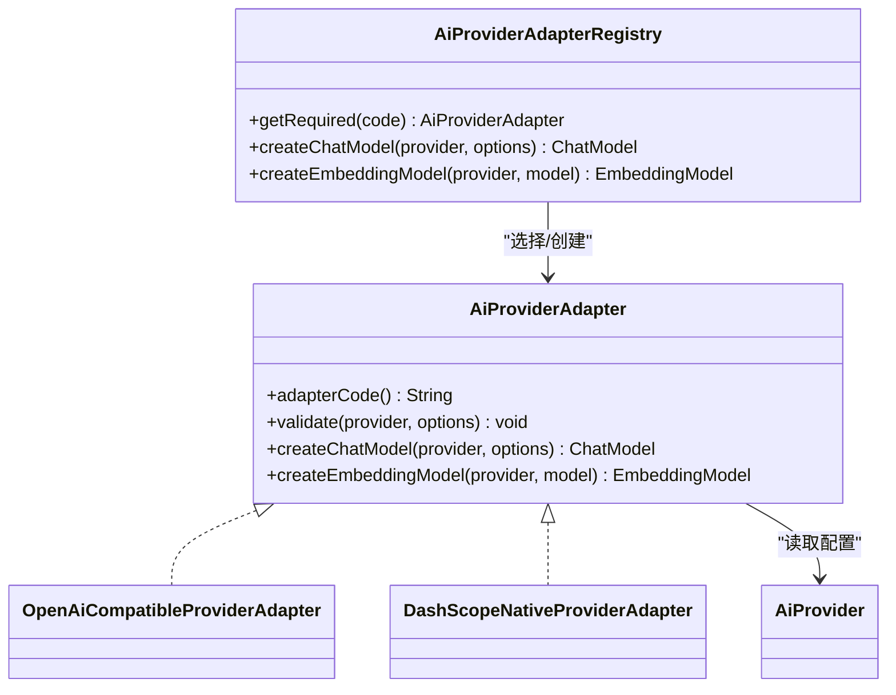
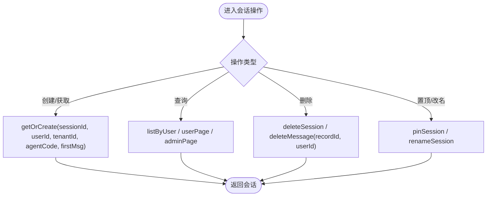
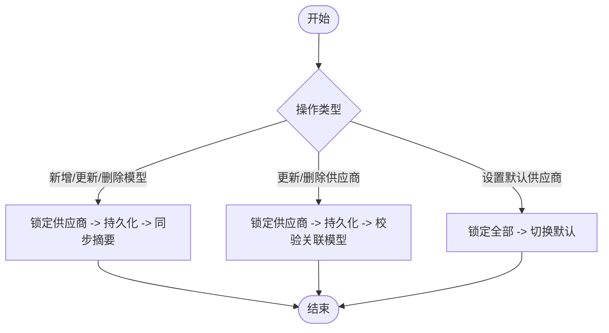
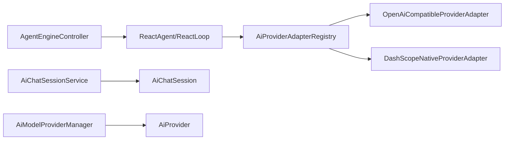

# AI架构设计

<cite>
**本文引用的文件**
- [AiModelProviderManager.java](file://forge-server/forge-framework/forge-plugin-parent/forge-plugin-ai/src/main/java/com/mdframe/forge/plugin/ai/coordination/AiModelProviderManager.java)
- [AiProviderAdapter.java](file://forge-server/forge-framework/forge-plugin-parent/forge-plugin-ai/src/main/java/com/mdframe/forge/plugin/ai/provider/adapter/AiProviderAdapter.java)
- [AiProviderAdapterRegistry.java](file://forge-server/forge-framework/forge-plugin-parent/forge-plugin-ai/src/main/java/com/mdframe/forge/plugin/ai/provider/adapter/AiProviderAdapterRegistry.java)
- [OpenAiCompatibleProviderAdapter.java](file://forge-server/forge-framework/forge-plugin-parent/forge-plugin-ai/src/main/java/com/mdframe/forge/plugin/ai/provider/adapter/OpenAiCompatibleProviderAdapter.java)
- [DashScopeNativeProviderAdapter.java](file://forge-server/forge-framework/forge-plugin-parent/forge-plugin-ai/src/main/java/com/mdframe/forge/plugin/ai/provider/adapter/DashScopeNativeProviderAdapter.java)
- [AiProvider.java](file://forge-server/forge-framework/forge-plugin-parent/forge-plugin-ai/src/main/java/com/mdframe/forge/plugin/ai/provider/domain/AiProvider.java)
- [ReactAgent.java](file://forge-server/forge-framework/forge-plugin-parent/forge-plugin-ai/src/main/java/com/mdframe/forge/plugin/ai/agent/engine/ReactAgent.java)
- [ReactLoop.java](file://forge-server/forge-framework/forge-plugin-parent/forge-plugin-ai/src/main/java/com/mdframe/forge/plugin/ai/agent/engine/ReactLoop.java)
- [ReactContext.java](file://forge-server/forge-framework/forge-plugin-parent/forge-plugin-ai/src/main/java/com/mdframe/forge/plugin/ai/agent/engine/ReactContext.java)
- [ReactRequest.java](file://forge-server/forge-framework/forge-plugin-parent/forge-plugin-ai/src/main/java/com/mdframe/forge/plugin/ai/agent/engine/ReactRequest.java)
- [AgentEngineController.java](file://forge-server/forge-framework/forge-plugin-parent/forge-plugin-ai/src/main/java/com/mdframe/forge/plugin/ai/agent/engine/controller/AgentEngineController.java)
- [AiChatSessionService.java](file://forge-server/forge-framework/forge-plugin-parent/forge-plugin-ai/src/main/java/com/mdframe/forge/plugin/ai/session/service/AiChatSessionService.java)
- [AiChatSession.java](file://forge-server/forge-framework/forge-plugin-parent/forge-plugin-ai/src/main/java/com/mdframe/forge/plugin/ai/session/domain/AiChatSession.java)
</cite>

## 目录
1. [简介](#简介)
2. [项目结构](#项目结构)
3. [核心组件](#核心组件)
4. [架构总览](#架构总览)
5. [详细组件分析](#详细组件分析)
6. [依赖关系分析](#依赖关系分析)
7. [性能考量](#性能考量)
8. [故障排查指南](#故障排查指南)
9. [结论](#结论)
10. [附录](#附录)

## 简介
本技术文档面向 Forge Admin 的 AI 能力中心，系统性阐述 AI 代理模式、模型路由机制、供应商抽象层与会话管理系统的核心设计与实现。重点覆盖：
- AI 代理（ReAct）的执行循环、工具调用与 HITL 中断恢复
- 模型路由与供应商适配器的注册、校验与实例化流程
- 会话生命周期管理与统计指标
- 启动流程、配置加载与扩展点设计
- 架构图与组件交互图，帮助开发者快速理解整体思路

## 项目结构
AI 能力中心位于插件模块 forge-plugin-ai，围绕“控制器—服务—引擎—适配器—持久化”的分层组织：
- 控制器层：对外暴露 Agent 引擎、会话、供应商等 API
- 服务层：会话管理、供应商管理、模型协调
- 引擎层：ReAct 循环、上下文、事件发布、权限决策、工具执行
- 适配器层：统一抽象不同供应商（OpenAI 兼容、DashScope 原生等）
- 持久化层：会话、消息、事件、供应商与模型的存储

图表来源
- [AgentEngineController.java](file://forge-server/forge-framework/forge-plugin-parent/forge-plugin-ai/src/main/java/com/mdframe/forge/plugin/ai/agent/engine/controller/AgentEngineController.java)
- [AiProviderController.java](file://forge-server/forge-framework/forge-plugin-parent/forge-plugin-ai/src/main/java/com/mdframe/forge/plugin/ai/provider/controller/AiProviderController.java)
- [AiChatSessionService.java:1-260](file://forge-server/forge-framework/forge-plugin-parent/forge-plugin-ai/src/main/java/com/mdframe/forge/plugin/ai/session/service/AiChatSessionService.java#L1-L260)
- [AiModelProviderManager.java:1-142](file://forge-server/forge-framework/forge-plugin-parent/forge-plugin-ai/src/main/java/com/mdframe/forge/plugin/ai/coordination/AiModelProviderManager.java#L1-L142)
- [ReactAgent.java:1-74](file://forge-server/forge-framework/forge-plugin-parent/forge-plugin-ai/src/main/java/com/mdframe/forge/plugin/ai/agent/engine/ReactAgent.java#L1-L74)
- [ReactLoop.java:1-572](file://forge-server/forge-framework/forge-plugin-parent/forge-plugin-ai/src/main/java/com/mdframe/forge/plugin/ai/agent/engine/ReactLoop.java#L1-L572)
- [AiProviderAdapterRegistry.java:1-128](file://forge-server/forge-framework/forge-plugin-parent/forge-plugin-ai/src/main/java/com/mdframe/forge/plugin/ai/provider/adapter/AiProviderAdapterRegistry.java#L1-L128)
- [OpenAiCompatibleProviderAdapter.java](file://forge-server/forge-framework/forge-plugin-parent/forge-plugin-ai/src/main/java/com/mdframe/forge/plugin/ai/provider/adapter/OpenAiCompatibleProviderAdapter.java)
- [DashScopeNativeProviderAdapter.java](file://forge-server/forge-framework/forge-plugin-parent/forge-plugin-ai/src/main/java/com/mdframe/forge/plugin/ai/provider/adapter/DashScopeNativeProviderAdapter.java)
- [AiChatSession.java:1-69](file://forge-server/forge-framework/forge-plugin-parent/forge-plugin-ai/src/main/java/com/mdframe/forge/plugin/ai/session/domain/AiChatSession.java#L1-L69)
- [AiProvider.java:1-87](file://forge-server/forge-framework/forge-plugin-parent/forge-plugin-ai/src/main/java/com/mdframe/forge/plugin/ai/provider/domain/AiProvider.java#L1-L87)

章节来源
- [AiChatSessionService.java:1-260](file://forge-server/forge-framework/forge-plugin-parent/forge-plugin-ai/src/main/java/com/mdframe/forge/plugin/ai/session/service/AiChatSessionService.java#L1-L260)
- [AiModelProviderManager.java:1-142](file://forge-server/forge-framework/forge-plugin-parent/forge-plugin-ai/src/main/java/com/mdframe/forge/plugin/ai/coordination/AiModelProviderManager.java#L1-L142)
- [ReactAgent.java:1-74](file://forge-server/forge-framework/forge-plugin-parent/forge-plugin-ai/src/main/java/com/mdframe/forge/plugin/ai/agent/engine/ReactAgent.java#L1-L74)
- [ReactLoop.java:1-572](file://forge-server/forge-framework/forge-plugin-parent/forge-plugin-ai/src/main/java/com/mdframe/forge/plugin/ai/agent/engine/ReactLoop.java#L1-L572)
- [AiProviderAdapterRegistry.java:1-128](file://forge-server/forge-framework/forge-plugin-parent/forge-plugin-ai/src/main/java/com/mdframe/forge/plugin/ai/provider/adapter/AiProviderAdapterRegistry.java#L1-L128)

## 核心组件
- ReAct 代理入口 ReactAgent：负责新对话执行、取消与 HITL 恢复，维护活跃上下文映射
- ReAct 循环 ReactLoop：推理→行动迭代，流式输出文本/思考，解析 tool_call，执行工具，处理权限与中断
- 供应商适配器 AiProviderAdapter：统一抽象 ChatModel/EmbeddingModel 创建与参数校验
- 适配器注册表 AiProviderAdapterRegistry：按代码选择、解密密钥、校验并创建模型
- 会话服务 AiChatSessionService：会话创建/查询/删除/置顶、用户与管理端分页、统计与体验指标
- 模型协调 AiModelProviderManager：模型与供应商的增删改、默认切换、摘要同步与并发安全

章节来源
- [ReactAgent.java:1-74](file://forge-server/forge-framework/forge-plugin-parent/forge-plugin-ai/src/main/java/com/mdframe/forge/plugin/ai/agent/engine/ReactAgent.java#L1-L74)
- [ReactLoop.java:1-572](file://forge-server/forge-framework/forge-plugin-parent/forge-plugin-ai/src/main/java/com/mdframe/forge/plugin/ai/agent/engine/ReactLoop.java#L1-L572)
- [AiProviderAdapter.java:1-45](file://forge-server/forge-framework/forge-plugin-parent/forge-plugin-ai/src/main/java/com/mdframe/forge/plugin/ai/provider/adapter/AiProviderAdapter.java#L1-L45)
- [AiProviderAdapterRegistry.java:1-128](file://forge-server/forge-framework/forge-plugin-parent/forge-plugin-ai/src/main/java/com/mdframe/forge/plugin/ai/provider/adapter/AiProviderAdapterRegistry.java#L1-L128)
- [AiChatSessionService.java:1-260](file://forge-server/forge-framework/forge-plugin-parent/forge-plugin-ai/src/main/java/com/mdframe/forge/plugin/ai/session/service/AiChatSessionService.java#L1-L260)
- [AiModelProviderManager.java:1-142](file://forge-server/forge-framework/forge-plugin-parent/forge-plugin-ai/src/main/java/com/mdframe/forge/plugin/ai/coordination/AiModelProviderManager.java#L1-L142)

## 架构总览
AI 能力中心采用“控制器—服务—引擎—适配器—数据”的分层架构，通过事件驱动与流式响应提升可观测性与用户体验；通过适配器抽象屏蔽多供应商差异；通过会话服务提供统一的会话生命周期管理。

图表来源
- [AgentEngineController.java](file://forge-server/forge-framework/forge-plugin-parent/forge-plugin-ai/src/main/java/com/mdframe/forge/plugin/ai/agent/engine/controller/AgentEngineController.java)
- [ReactAgent.java:1-74](file://forge-server/forge-framework/forge-plugin-parent/forge-plugin-ai/src/main/java/com/mdframe/forge/plugin/ai/agent/engine/ReactAgent.java#L1-L74)
- [ReactLoop.java:1-572](file://forge-server/forge-framework/forge-plugin-parent/forge-plugin-ai/src/main/java/com/mdframe/forge/plugin/ai/agent/engine/ReactLoop.java#L1-L572)
- [AiProviderAdapterRegistry.java:1-128](file://forge-server/forge-framework/forge-plugin-parent/forge-plugin-ai/src/main/java/com/mdframe/forge/plugin/ai/provider/adapter/AiProviderAdapterRegistry.java#L1-L128)
- [OpenAiCompatibleProviderAdapter.java](file://forge-server/forge-framework/forge-plugin-parent/forge-plugin-ai/src/main/java/com/mdframe/forge/plugin/ai/provider/adapter/OpenAiCompatibleProviderAdapter.java)
- [DashScopeNativeProviderAdapter.java](file://forge-server/forge-framework/forge-plugin-parent/forge-plugin-ai/src/main/java/com/mdframe/forge/plugin/ai/provider/adapter/DashScopeNativeProviderAdapter.java)
- [AiChatSessionService.java:1-260](file://forge-server/forge-framework/forge-plugin-parent/forge-plugin-ai/src/main/java/com/mdframe/forge/plugin/ai/session/service/AiChatSessionService.java#L1-L260)

## 详细组件分析

### ReAct 代理与循环
- ReactAgent 作为入口，维护活跃会话上下文，支持 execute、cancel、resume（HITL）
- ReactLoop 实现 ReAct 主循环：
  - 流式调用模型，逐块发出 TEXT_BLOCK_START/DELTA/END 与 THINKING_BLOCK_DELTA
  - 解析 tool_call，执行工具，注入权限决策与 HITL 中断
  - 记录用量与埋点，发送 AGENT_END
- ReactContext/ReactRequest 承载会话上下文与请求参数

图表来源
- [AgentEngineController.java](file://forge-server/forge-framework/forge-plugin-parent/forge-plugin-ai/src/main/java/com/mdframe/forge/plugin/ai/agent/engine/controller/AgentEngineController.java)
- [ReactAgent.java:1-74](file://forge-server/forge-framework/forge-plugin-parent/forge-plugin-ai/src/main/java/com/mdframe/forge/plugin/ai/agent/engine/ReactAgent.java#L1-L74)
- [ReactLoop.java:1-572](file://forge-server/forge-framework/forge-plugin-parent/forge-plugin-ai/src/main/java/com/mdframe/forge/plugin/ai/agent/engine/ReactLoop.java#L1-L572)
- [AiProviderAdapterRegistry.java:1-128](file://forge-server/forge-framework/forge-plugin-parent/forge-plugin-ai/src/main/java/com/mdframe/forge/plugin/ai/provider/adapter/AiProviderAdapterRegistry.java#L1-L128)

章节来源
- [ReactAgent.java:1-74](file://forge-server/forge-framework/forge-plugin-parent/forge-plugin-ai/src/main/java/com/mdframe/forge/plugin/ai/agent/engine/ReactAgent.java#L1-L74)
- [ReactLoop.java:1-572](file://forge-server/forge-framework/forge-plugin-parent/forge-plugin-ai/src/main/java/com/mdframe/forge/plugin/ai/agent/engine/ReactLoop.java#L1-L572)
- [ReactContext.java](file://forge-server/forge-framework/forge-plugin-parent/forge-plugin-ai/src/main/java/com/mdframe/forge/plugin/ai/agent/engine/ReactContext.java)
- [ReactRequest.java](file://forge-server/forge-framework/forge-plugin-parent/forge-plugin-ai/src/main/java/com/mdframe/forge/plugin/ai/agent/engine/ReactRequest.java)

### 模型路由与供应商抽象层
- 适配器接口 AiProviderAdapter 定义 validate、createChatModel、createEmbeddingModel
- 注册表 AiProviderAdapterRegistry 负责：
  - 按 adapterCode 选择具体适配器
  - 解密 apiKey（存储密文，运行时明文）
  - 校验运行参数并创建模型
- 具体实现：
  - OpenAiCompatibleProviderAdapter：OpenAI 兼容供应商
  - DashScopeNativeProviderAdapter：DashScope 原生供应商

图表来源
- [AiProviderAdapter.java:1-45](file://forge-server/forge-framework/forge-plugin-parent/forge-plugin-ai/src/main/java/com/mdframe/forge/plugin/ai/provider/adapter/AiProviderAdapter.java#L1-L45)
- [AiProviderAdapterRegistry.java:1-128](file://forge-server/forge-framework/forge-plugin-parent/forge-plugin-ai/src/main/java/com/mdframe/forge/plugin/ai/provider/adapter/AiProviderAdapterRegistry.java#L1-L128)
- [OpenAiCompatibleProviderAdapter.java](file://forge-server/forge-framework/forge-plugin-parent/forge-plugin-ai/src/main/java/com/mdframe/forge/plugin/ai/provider/adapter/OpenAiCompatibleProviderAdapter.java)
- [DashScopeNativeProviderAdapter.java](file://forge-server/forge-framework/forge-plugin-parent/forge-plugin-ai/src/main/java/com/mdframe/forge/plugin/ai/provider/adapter/DashScopeNativeProviderAdapter.java)
- [AiProvider.java:1-87](file://forge-server/forge-framework/forge-plugin-parent/forge-plugin-ai/src/main/java/com/mdframe/forge/plugin/ai/provider/domain/AiProvider.java#L1-L87)

章节来源
- [AiProviderAdapter.java:1-45](file://forge-server/forge-framework/forge-plugin-parent/forge-plugin-ai/src/main/java/com/mdframe/forge/plugin/ai/provider/adapter/AiProviderAdapter.java#L1-L45)
- [AiProviderAdapterRegistry.java:1-128](file://forge-server/forge-framework/forge-plugin-parent/forge-plugin-ai/src/main/java/com/mdframe/forge/plugin/ai/provider/adapter/AiProviderAdapterRegistry.java#L1-L128)
- [OpenAiCompatibleProviderAdapter.java](file://forge-server/forge-framework/forge-plugin-parent/forge-plugin-ai/src/main/java/com/mdframe/forge/plugin/ai/provider/adapter/OpenAiCompatibleProviderAdapter.java)
- [DashScopeNativeProviderAdapter.java](file://forge-server/forge-framework/forge-plugin-parent/forge-plugin-ai/src/main/java/com/mdframe/forge/plugin/ai/provider/adapter/DashScopeNativeProviderAdapter.java)
- [AiProvider.java:1-87](file://forge-server/forge-framework/forge-plugin-parent/forge-plugin-ai/src/main/java/com/mdframe/forge/plugin/ai/provider/domain/AiProvider.java#L1-L87)

### 会话管理系统
- 会话实体 AiChatSession：包含租户、用户、Agent 编码、标题、状态、置顶、元数据与时间戳
- 会话服务 AiChatSessionService：
  - getOrCreate：幂等创建或更新会话
  - listByUser/adminPage：分页查询
  - deleteSession/deleteMessage：软删除与会话/消息权限校验
  - pinSession/renameSession：置顶与重命名
  - getStatistics/getExperienceMetrics：统计与体验指标（完成率、错误率、中断率、日趋势）

图表来源
- [AiChatSessionService.java:1-260](file://forge-server/forge-framework/forge-plugin-parent/forge-plugin-ai/src/main/java/com/mdframe/forge/plugin/ai/session/service/AiChatSessionService.java#L1-L260)
- [AiChatSession.java:1-69](file://forge-server/forge-framework/forge-plugin-parent/forge-plugin-ai/src/main/java/com/mdframe/forge/plugin/ai/session/domain/AiChatSession.java#L1-L69)

章节来源
- [AiChatSessionService.java:1-260](file://forge-server/forge-framework/forge-plugin-parent/forge-plugin-ai/src/main/java/com/mdframe/forge/plugin/ai/session/service/AiChatSessionService.java#L1-L260)
- [AiChatSession.java:1-69](file://forge-server/forge-framework/forge-plugin-parent/forge-plugin-ai/src/main/java/com/mdframe/forge/plugin/ai/session/domain/AiChatSession.java#L1-L69)

### 模型与供应商协调
- AiModelProviderManager 提供：
  - createModel/updateModel/deleteModel：带锁保护与快照校验，避免并发冲突
  - updateProvider/deleteProvider：供应商变更与级联检查
  - setDefaultProvider：默认供应商切换
  - syncProvider：同步模型列表与默认模型到供应商摘要

图表来源
- [AiModelProviderManager.java:1-142](file://forge-server/forge-framework/forge-plugin-parent/forge-plugin-ai/src/main/java/com/mdframe/forge/plugin/ai/coordination/AiModelProviderManager.java#L1-L142)

章节来源
- [AiModelProviderManager.java:1-142](file://forge-server/forge-framework/forge-plugin-parent/forge-plugin-ai/src/main/java/com/mdframe/forge/plugin/ai/coordination/AiModelProviderManager.java#L1-L142)

## 依赖关系分析
- 控制器依赖服务与引擎：AgentEngineController 调用 ReactAgent/ReactLoop；AiProviderController 调用供应商相关服务
- 引擎依赖适配器注册表：ReactLoop 通过注册表创建 ChatModel/EmbeddingModel
- 服务依赖领域对象：AiChatSessionService 操作 AiChatSession；AiModelProviderManager 操作 AiProvider 与模型服务
- 适配器依赖供应商配置：OpenAiCompatibleProviderAdapter 与 DashScopeNativeProviderAdapter 读取 AiProvider 配置

图表来源
- [AgentEngineController.java](file://forge-server/forge-framework/forge-plugin-parent/forge-plugin-ai/src/main/java/com/mdframe/forge/plugin/ai/agent/engine/controller/AgentEngineController.java)
- [ReactAgent.java:1-74](file://forge-server/forge-framework/forge-plugin-parent/forge-plugin-ai/src/main/java/com/mdframe/forge/plugin/ai/agent/engine/ReactAgent.java#L1-L74)
- [ReactLoop.java:1-572](file://forge-server/forge-framework/forge-plugin-parent/forge-plugin-ai/src/main/java/com/mdframe/forge/plugin/ai/agent/engine/ReactLoop.java#L1-L572)
- [AiProviderAdapterRegistry.java:1-128](file://forge-server/forge-framework/forge-plugin-parent/forge-plugin-ai/src/main/java/com/mdframe/forge/plugin/ai/provider/adapter/AiProviderAdapterRegistry.java#L1-L128)
- [AiChatSessionService.java:1-260](file://forge-server/forge-framework/forge-plugin-parent/forge-plugin-ai/src/main/java/com/mdframe/forge/plugin/ai/session/service/AiChatSessionService.java#L1-L260)
- [AiModelProviderManager.java:1-142](file://forge-server/forge-framework/forge-plugin-parent/forge-plugin-ai/src/main/java/com/mdframe/forge/plugin/ai/coordination/AiModelProviderManager.java#L1-L142)

章节来源
- [AiProviderAdapterRegistry.java:1-128](file://forge-server/forge-framework/forge-plugin-parent/forge-plugin-ai/src/main/java/com/mdframe/forge/plugin/ai/provider/adapter/AiProviderAdapterRegistry.java#L1-L128)
- [AiModelProviderManager.java:1-142](file://forge-server/forge-framework/forge-plugin-parent/forge-plugin-ai/src/main/java/com/mdframe/forge/plugin/ai/coordination/AiModelProviderManager.java#L1-L142)

## 性能考量
- 流式处理：ReactLoop 使用 MessageAggregator 聚合流式响应，边拉取边发射事件，降低首字延迟
- 线程隔离：循环在独立线程执行，避免阻塞 HTTP 线程；事件通过 Sinks.Many 广播
- 用量埋点：每轮调用记录 prompt/completion/total tokens 与耗时，便于容量规划与成本分析
- 缓存与解密：适配器注册表仅在必要时解密 apiKey，减少对象重建开销
- 并发安全：模型与供应商变更加锁，防止竞态条件导致的状态不一致

[本节为通用性能建议，不直接分析具体文件]

## 故障排查指南
- 模型调用失败：检查 ReactLoop 中的 MODEL_CALL_END 事件是否携带 error；确认适配器 validate 与 createChatModel 是否正确
- 工具执行被拒绝：查看 TOOL_RESULT_* 事件与 ALL_TOOLS_DENIED；检查权限决策逻辑与工具绑定配置
- HITL 中断未恢复：确认 InterruptStore 中是否存在对应 interruptId；调用 resume 时传入正确参数
- 会话异常：通过 AiChatSessionService 的统计与体验指标定位问题（完成率、错误率、中断率）
- 供应商配置错误：核对 AiProvider 的 adapterCode、baseUrl、apiKey 与 models；使用测试接口验证连接

章节来源
- [ReactLoop.java:1-572](file://forge-server/forge-framework/forge-plugin-parent/forge-plugin-ai/src/main/java/com/mdframe/forge/plugin/ai/agent/engine/ReactLoop.java#L1-L572)
- [AiChatSessionService.java:1-260](file://forge-server/forge-framework/forge-plugin-parent/forge-plugin-ai/src/main/java/com/mdframe/forge/plugin/ai/session/service/AiChatSessionService.java#L1-L260)

## 结论
Forge Admin 的 AI 能力中心以 ReAct 代理为核心，结合供应商抽象与注册表机制，实现了多模型路由与可扩展的工具生态；会话系统提供完整的生命周期管理与可观测性指标；通过流式事件与埋点，提升了调试效率与用户体验。该架构具备良好的扩展性与可维护性，适合企业级低代码平台集成多种 AI 能力。

[本节为总结性内容，不直接分析具体文件]

## 附录
- 启动流程要点：
  - 控制器接收请求，构建 ReactContext/ReactRequest
  - 引擎通过适配器注册表创建 ChatModel/EmbeddingModel
  - 流式事件持续推送至客户端，最终发送 AGENT_END
- 配置加载机制：
  - 供应商配置存储在 AiProvider，运行时按需解密 apiKey
  - 模型与供应商变更通过 AiModelProviderManager 加锁同步
- 扩展点设计：
  - 新增供应商：实现 AiProviderAdapter 并注册
  - 新增工具：实现 AgentTool 并在工具注册表中登记
  - 自定义权限策略：扩展 PermissionEngine 决策逻辑

[本节为概念性说明，不直接分析具体文件]