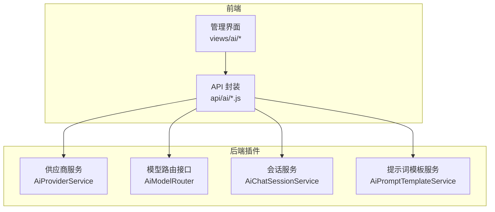
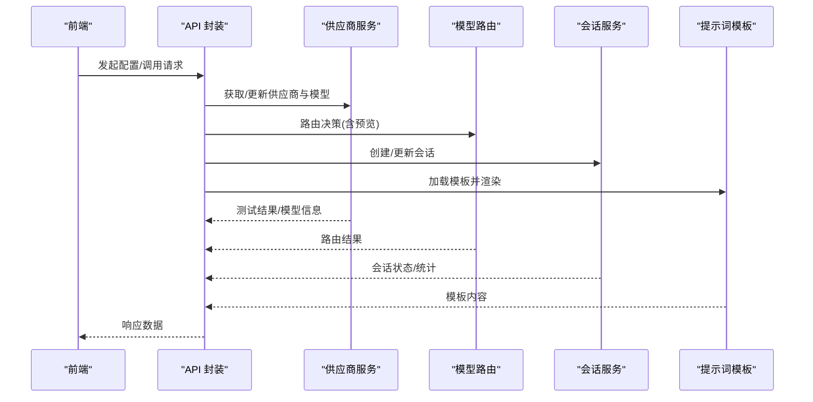
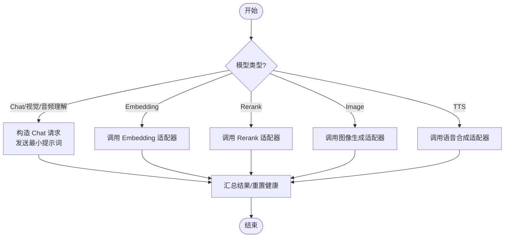
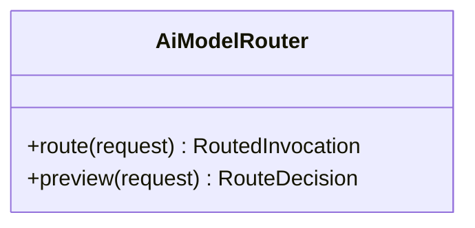
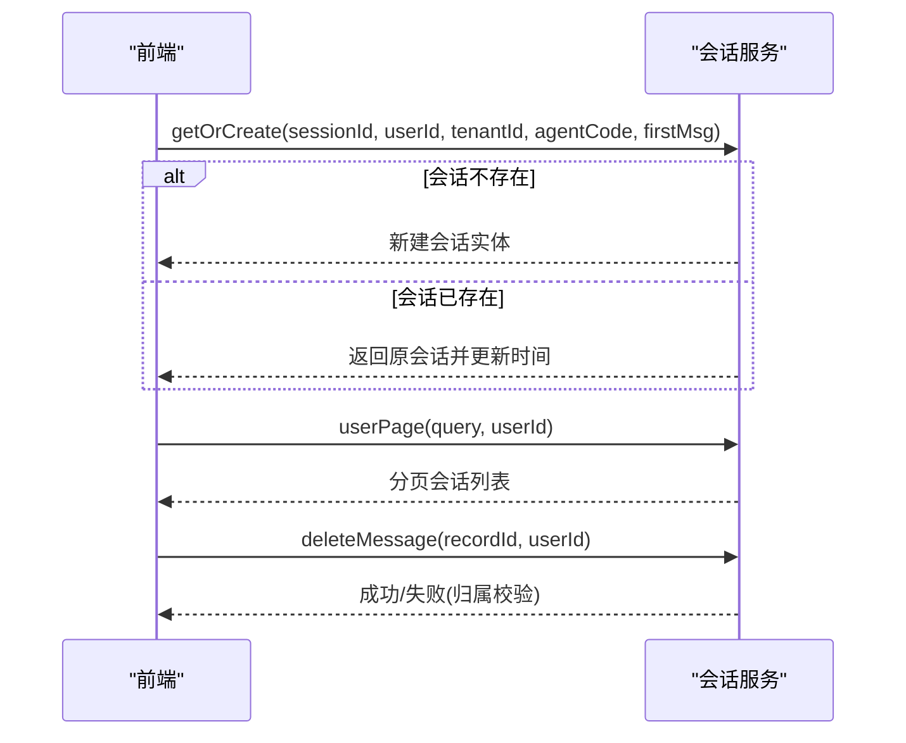
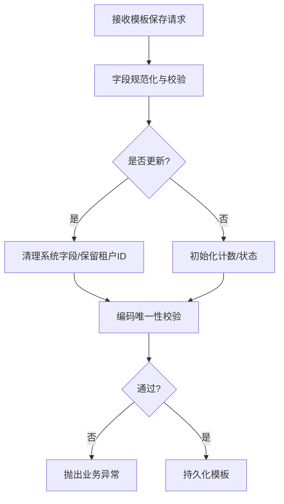
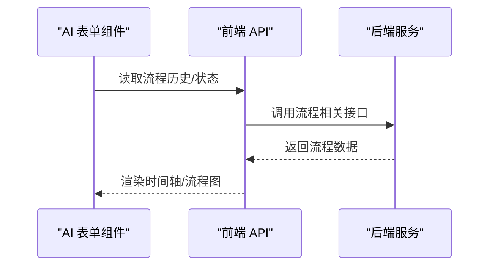
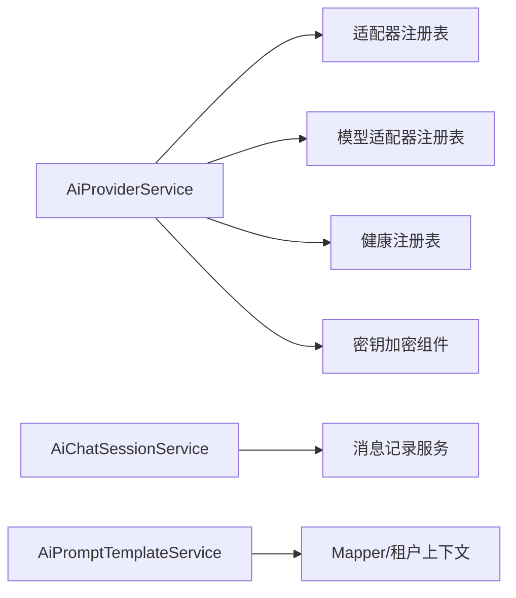

# AI能力集成

<cite>
**本文引用的文件**
- [AiProviderService.java](file://forge-server/forge-framework/forge-plugin-parent/forge-plugin-ai/src/main/java/com/mdframe/forge/plugin/ai/provider/service/AiProviderService.java)
- [AiModelRouter.java](file://forge-server/forge-framework/forge-plugin-parent/forge-plugin-ai/src/main/java/com/mdframe/forge/plugin/ai/routing/AiModelRouter.java)
- [AiChatSessionService.java](file://forge-server/forge-framework/forge-plugin-parent/forge-plugin-ai/src/main/java/com/mdframe/forge/plugin/ai/session/service/AiChatSessionService.java)
- [AiPromptTemplateService.java](file://forge-server/forge-framework/forge-plugin-parent/forge-plugin-ai/src/main/java/com/mdframe/forge/plugin/ai/prompt/service/AiPromptTemplateService.java)
- [model-routing.js](file://forge-admin-ui/src/api/ai/model-routing.js)
- [provider.js](file://forge-admin-ui/src/api/ai/provider.js)
- [AiCrudFlowDetail.vue](file://forge-admin-ui/src/components/ai-form/AiCrudFlowDetail.vue)
</cite>

## 目录
1. [简介](#简介)
2. [项目结构](#项目结构)
3. [核心组件](#核心组件)
4. [架构总览](#架构总览)
5. [详细组件分析](#详细组件分析)
6. [依赖关系分析](#依赖关系分析)
7. [性能考虑](#性能考虑)
8. [故障排查指南](#故障排查指南)
9. [结论](#结论)
10. [附录](#附录)

## 简介
本技术文档面向 Forge Admin 的 AI 能力集成，系统性阐述以下主题：AI 代理模式设计、模型路由机制、供应商抽象层与会话管理系统；智能体生命周期管理、提示词模板库、MCP 工具扩展与性能优化策略；以及多种 AI 供应商（OpenAI、阿里百炼、智谱等）的配置方法与调用示例。同时提供 AI 表单组件使用指南、代码生成流程与最佳实践建议，帮助开发者快速落地并稳定运维。

## 项目结构
后端以插件化方式组织在 forge-plugin-ai 中，涵盖供应商管理、模型路由、会话、提示词模板、知识检索、多模态、健康检查与可观测性等模块；前端在 forge-admin-ui 中提供对应的配置与管理页面及 API 封装。

**图表来源**
- [AiProviderService.java:1-597](file://forge-server/forge-framework/forge-plugin-parent/forge-plugin-ai/src/main/java/com/mdframe/forge/plugin/ai/provider/service/AiProviderService.java#L1-L597)
- [AiModelRouter.java:1-6](file://forge-server/forge-framework/forge-plugin-parent/forge-plugin-ai/src/main/java/com/mdframe/forge/plugin/ai/routing/AiModelRouter.java#L1-L6)
- [AiChatSessionService.java:1-260](file://forge-server/forge-framework/forge-plugin-parent/forge-plugin-ai/src/main/java/com/mdframe/forge/plugin/ai/session/service/AiChatSessionService.java#L1-L260)
- [AiPromptTemplateService.java:1-219](file://forge-server/forge-framework/forge-plugin-parent/forge-plugin-ai/src/main/java/com/mdframe/forge/plugin/ai/prompt/service/AiPromptTemplateService.java#L1-L219)
- [model-routing.js:1-62](file://forge-admin-ui/src/api/ai/model-routing.js#L1-L62)
- [provider.js:1-42](file://forge-admin-ui/src/api/ai/provider.js#L1-L42)

**章节来源**
- [AiProviderService.java:1-597](file://forge-server/forge-framework/forge-plugin-parent/forge-plugin-ai/src/main/java/com/mdframe/forge/plugin/ai/provider/service/AiProviderService.java#L1-L597)
- [AiModelRouter.java:1-6](file://forge-server/forge-framework/forge-plugin-parent/forge-plugin-ai/src/main/java/com/mdframe/forge/plugin/ai/routing/AiModelRouter.java#L1-L6)
- [AiChatSessionService.java:1-260](file://forge-server/forge-framework/forge-plugin-parent/forge-plugin-ai/src/main/java/com/mdframe/forge/plugin/ai/session/service/AiChatSessionService.java#L1-L260)
- [AiPromptTemplateService.java:1-219](file://forge-server/forge-framework/forge-plugin-parent/forge-plugin-ai/src/main/java/com/mdframe/forge/plugin/ai/prompt/service/AiPromptTemplateService.java#L1-L219)
- [model-routing.js:1-62](file://forge-admin-ui/src/api/ai/model-routing.js#L1-L62)
- [provider.js:1-42](file://forge-admin-ui/src/api/ai/provider.js#L1-L42)

## 核心组件
- 供应商抽象层：统一封装 OpenAI 兼容协议与多厂商适配，支持连接测试、模型拉取与批量导入、默认模型切换与健康状态重置。
- 模型路由机制：通过策略路由将请求分发到具体模型实例，支持预览决策与执行结果记录。
- 会话管理系统：会话创建/查询/置顶/重命名/删除，消息级软删与归属校验，统计与体验指标聚合。
- 提示词模板库：模板增删改查、启用列表、计数统计与租户隔离，规范化字段与长度限制。
- 前端 API 封装：对模型、路由策略、供应商管理等后端端点的统一调用与加密传输。

**章节来源**
- [AiProviderService.java:63-139](file://forge-server/forge-framework/forge-plugin-parent/forge-plugin-ai/src/main/java/com/mdframe/forge/plugin/ai/provider/service/AiProviderService.java#L63-L139)
- [AiModelRouter.java:1-6](file://forge-server/forge-framework/forge-plugin-parent/forge-plugin-ai/src/main/java/com/mdframe/forge/plugin/ai/routing/AiModelRouter.java#L1-L6)
- [AiChatSessionService.java:34-209](file://forge-server/forge-framework/forge-plugin-parent/forge-plugin-ai/src/main/java/com/mdframe/forge/plugin/ai/session/service/AiChatSessionService.java#L34-L209)
- [AiPromptTemplateService.java:31-97](file://forge-server/forge-framework/forge-plugin-parent/forge-plugin-ai/src/main/java/com/mdframe/forge/plugin/ai/prompt/service/AiPromptTemplateService.java#L31-L97)
- [model-routing.js:1-62](file://forge-admin-ui/src/api/ai/model-routing.js#L1-L62)
- [provider.js:1-42](file://forge-admin-ui/src/api/ai/provider.js#L1-L42)

## 架构总览
下图展示了从前端到后端的整体交互路径：前端通过 API 封装访问供应商管理与模型路由能力；后端由供应商服务完成鉴权、连接测试与模型选择；路由层根据策略决定目标模型；会话服务负责上下文持久化与统计；提示词模板为对话内容注入提供支撑。

**图表来源**
- [provider.js:1-42](file://forge-admin-ui/src/api/ai/provider.js#L1-L42)
- [model-routing.js:1-62](file://forge-admin-ui/src/api/ai/model-routing.js#L1-L62)
- [AiProviderService.java:131-219](file://forge-server/forge-framework/forge-plugin-parent/forge-plugin-ai/src/main/java/com/mdframe/forge/plugin/ai/provider/service/AiProviderService.java#L131-L219)
- [AiModelRouter.java:1-6](file://forge-server/forge-framework/forge-plugin-parent/forge-plugin-ai/src/main/java/com/mdframe/forge/plugin/ai/routing/AiModelRouter.java#L1-L6)
- [AiChatSessionService.java:45-72](file://forge-server/forge-framework/forge-plugin-parent/forge-plugin-ai/src/main/java/com/mdframe/forge/plugin/ai/session/service/AiChatSessionService.java#L45-L72)
- [AiPromptTemplateService.java:31-40](file://forge-server/forge-framework/forge-plugin-parent/forge-plugin-ai/src/main/java/com/mdframe/forge/plugin/ai/prompt/service/AiPromptTemplateService.java#L31-L40)

## 详细组件分析

### 供应商抽象层（AiProviderService）
- 职责：供应商 CRUD、默认供应商管理、连接测试（Chat/Embedding/Rerank/Image/TTS）、模型拉取与批量导入、健康状态重置、摘要同步。
- 关键行为：
  - 连接测试：按模型类型分流至 Chat 或非 Chat 适配器，捕获异常并输出诊断信息。
  - 模型导入：去重、启发式推断类型、设置首个导入为默认、双写摘要。
  - 安全：密钥加密存储、视图脱敏、BaseURL 规范化校验。
- 复杂度：批量导入为 O(n)，连接测试为单次网络调用；健康状态重置为常量时间操作。

**图表来源**
- [AiProviderService.java:131-262](file://forge-server/forge-framework/forge-plugin-parent/forge-plugin-ai/src/main/java/com/mdframe/forge/plugin/ai/provider/service/AiProviderService.java#L131-L262)
- [AiProviderService.java:284-354](file://forge-server/forge-framework/forge-plugin-parent/forge-plugin-ai/src/main/java/com/mdframe/forge/plugin/ai/provider/service/AiProviderService.java#L284-L354)
- [AiProviderService.java:591-595](file://forge-server/forge-framework/forge-plugin-parent/forge-plugin-ai/src/main/java/com/mdframe/forge/plugin/ai/provider/service/AiProviderService.java#L591-L595)

**章节来源**
- [AiProviderService.java:63-139](file://forge-server/forge-framework/forge-plugin-parent/forge-plugin-ai/src/main/java/com/mdframe/forge/plugin/ai/provider/service/AiProviderService.java#L63-L139)
- [AiProviderService.java:131-262](file://forge-server/forge-framework/forge-plugin-parent/forge-plugin-ai/src/main/java/com/mdframe/forge/plugin/ai/provider/service/AiProviderService.java#L131-L262)
- [AiProviderService.java:284-354](file://forge-server/forge-framework/forge-plugin-parent/forge-plugin-ai/src/main/java/com/mdframe/forge/plugin/ai/provider/service/AiProviderService.java#L284-L354)
- [AiProviderService.java:424-491](file://forge-server/forge-framework/forge-plugin-parent/forge-plugin-ai/src/main/java/com/mdframe/forge/plugin/ai/provider/service/AiProviderService.java#L424-L491)
- [AiProviderService.java:591-595](file://forge-server/forge-framework/forge-plugin-parent/forge-plugin-ai/src/main/java/com/mdframe/forge/plugin/ai/provider/service/AiProviderService.java#L591-L595)

### 模型路由机制（AiModelRouter）
- 职责：定义路由接口，包含实际路由与预览决策两个方法，便于在调用前评估策略命中情况。
- 典型实现：基于策略（如成本、延迟、可用性、租户配额）选择候选模型，返回路由决策与后续执行包装。

**图表来源**
- [AiModelRouter.java:1-6](file://forge-server/forge-framework/forge-plugin-parent/forge-plugin-ai/src/main/java/com/mdframe/forge/plugin/ai/routing/AiModelRouter.java#L1-L6)

**章节来源**
- [AiModelRouter.java:1-6](file://forge-server/forge-framework/forge-plugin-parent/forge-plugin-ai/src/main/java/com/mdframe/forge/plugin/ai/routing/AiModelRouter.java#L1-L6)

### 会话管理系统（AiChatSessionService）
- 职责：会话幂等创建/查询/置顶/重命名/删除；消息软删与归属校验；用户侧分页与管理员分页；统计与体验指标计算。
- 关键点：
  - 幂等创建：传入 sessionId 不存在则自动创建，存在则刷新更新时间。
  - 权限控制：仅本人可删除消息或修改会话标题。
  - 指标：完成率、错误率、中断率基于回复统计派生。

**图表来源**
- [AiChatSessionService.java:45-72](file://forge-server/forge-framework/forge-plugin-parent/forge-plugin-ai/src/main/java/com/mdframe/forge/plugin/ai/session/service/AiChatSessionService.java#L45-L72)
- [AiChatSessionService.java:106-118](file://forge-server/forge-framework/forge-plugin-parent/forge-plugin-ai/src/main/java/com/mdframe/forge/plugin/ai/session/service/AiChatSessionService.java#L106-L118)
- [AiChatSessionService.java:202-209](file://forge-server/forge-framework/forge-plugin-parent/forge-plugin-ai/src/main/java/com/mdframe/forge/plugin/ai/session/service/AiChatSessionService.java#L202-L209)

**章节来源**
- [AiChatSessionService.java:34-209](file://forge-server/forge-framework/forge-plugin-parent/forge-plugin-ai/src/main/java/com/mdframe/forge/plugin/ai/session/service/AiChatSessionService.java#L34-L209)
- [AiChatSessionService.java:211-250](file://forge-server/forge-framework/forge-plugin-parent/forge-plugin-ai/src/main/java/com/mdframe/forge/plugin/ai/session/service/AiChatSessionService.java#L211-L250)

### 提示词模板库（AiPromptTemplateService）
- 职责：模板分页、启用列表、详情、增删改、计数统计（使用/测试/下载），字段规范化与长度限制，租户隔离。
- 关键点：
  - 规范化：名称、编码、场景、分类、标签、描述、示例输入、内容等字段清洗与截断。
  - 唯一性：模板编码在租户内唯一。
  - 统计：每次使用/测试/下载均原子递增计数。

**图表来源**
- [AiPromptTemplateService.java:50-97](file://forge-server/forge-framework/forge-plugin-parent/forge-plugin-ai/src/main/java/com/mdframe/forge/plugin/ai/prompt/service/AiPromptTemplateService.java#L50-L97)
- [AiPromptTemplateService.java:117-167](file://forge-server/forge-framework/forge-plugin-parent/forge-plugin-ai/src/main/java/com/mdframe/forge/plugin/ai/prompt/service/AiPromptTemplateService.java#L117-L167)

**章节来源**
- [AiPromptTemplateService.java:31-97](file://forge-server/forge-framework/forge-plugin-parent/forge-plugin-ai/src/main/java/com/mdframe/forge/plugin/ai/prompt/service/AiPromptTemplateService.java#L31-L97)
- [AiPromptTemplateService.java:117-201](file://forge-server/forge-framework/forge-plugin-parent/forge-plugin-ai/src/main/java/com/mdframe/forge/plugin/ai/prompt/service/AiPromptTemplateService.java#L117-L201)

### 前端 API 封装与表单组件
- 模型与路由：提供模型分页、按供应商列出模型、策略分页/预览、调用记录分页与汇总等接口。
- 供应商管理：供应商分页、详情、新增/更新/删除、连接测试、设为默认、模板枚举、拉取模型、批量导入模型。
- AI 表单组件：AiCrudFlowDetail 用于展示关联流程的状态、时间轴与流程图，支持懒加载与空状态处理。

**图表来源**
- [AiCrudFlowDetail.vue:1-172](file://forge-admin-ui/src/components/ai-form/AiCrudFlowDetail.vue#L1-L172)

**章节来源**
- [model-routing.js:1-62](file://forge-admin-ui/src/api/ai/model-routing.js#L1-L62)
- [provider.js:1-42](file://forge-admin-ui/src/api/ai/provider.js#L1-L42)
- [AiCrudFlowDetail.vue:1-172](file://forge-admin-ui/src/components/ai-form/AiCrudFlowDetail.vue#L1-L172)

## 依赖关系分析
- 耦合度：供应商服务依赖适配器注册表、模型适配器注册表、健康注册表与加密组件；会话服务依赖消息记录服务；提示词模板服务依赖 Mapper 与租户上下文。
- 外部依赖：Spring AI（ChatModel/Prompt）、数据库持久化、可选向量/重排/图像/语音适配器。
- 潜在循环：当前分层清晰，未见直接循环依赖；通过接口与注册表解耦。

**图表来源**
- [AiProviderService.java:55-61](file://forge-server/forge-framework/forge-plugin-parent/forge-plugin-ai/src/main/java/com/mdframe/forge/plugin/ai/provider/service/AiProviderService.java#L55-L61)
- [AiChatSessionService.java:32-33](file://forge-server/forge-framework/forge-plugin-parent/forge-plugin-ai/src/main/java/com/mdframe/forge/plugin/ai/session/service/AiChatSessionService.java#L32-L33)
- [AiPromptTemplateService.java:29-30](file://forge-server/forge-framework/forge-plugin-parent/forge-plugin-ai/src/main/java/com/mdframe/forge/plugin/ai/prompt/service/AiPromptTemplateService.java#L29-L30)

**章节来源**
- [AiProviderService.java:55-61](file://forge-server/forge-framework/forge-plugin-parent/forge-plugin-ai/src/main/java/com/mdframe/forge/plugin/ai/provider/service/AiProviderService.java#L55-L61)
- [AiChatSessionService.java:32-33](file://forge-server/forge-framework/forge-plugin-parent/forge-plugin-ai/src/main/java/com/mdframe/forge/plugin/ai/session/service/AiChatSessionService.java#L32-L33)
- [AiPromptTemplateService.java:29-30](file://forge-server/forge-framework/forge-plugin-parent/forge-plugin-ai/src/main/java/com/mdframe/forge/plugin/ai/prompt/service/AiPromptTemplateService.java#L29-L30)

## 性能考虑
- 连接测试最小化负载：使用极小 token 数进行连通性验证，降低首测开销。
- 批量导入去重：先收集已有模型集合，避免重复写入与冗余网络请求。
- 健康状态重置：成功连接后重置健康状态，减少重试风暴。
- 分页与限制：提示词模板列表与分页参数有上限保护，防止过大查询。
- 缓存与淘汰：供应商变更触发缓存淘汰调度，保证配置一致性。

[本节为通用指导，不直接分析具体文件]

## 故障排查指南
- 连接测试失败：
  - 检查供应商 BaseURL 与 API Key 是否正确；查看日志中的 HTTP 状态码与错误码。
  - 非 Chat 类型需确保对应模型已启用且可被适配器识别。
- 会话权限问题：
  - 删除消息或重命名会话时，若返回失败，请确认当前用户是否为消息/会话归属者。
- 模板唯一性冲突：
  - 模板编码在租户内必须唯一，更新时需排除自身 ID。
- 默认供应商异常：
  - 未配置可用默认供应商或多租户默认冲突会抛错，需检查默认设置。

**章节来源**
- [AiProviderService.java:144-173](file://forge-server/forge-framework/forge-plugin-parent/forge-plugin-ai/src/main/java/com/mdframe/forge/plugin/ai/provider/service/AiProviderService.java#L144-L173)
- [AiProviderService.java:191-219](file://forge-server/forge-framework/forge-plugin-parent/forge-plugin-ai/src/main/java/com/mdframe/forge/plugin/ai/provider/service/AiProviderService.java#L191-L219)
- [AiChatSessionService.java:106-118](file://forge-server/forge-framework/forge-plugin-parent/forge-plugin-ai/src/main/java/com/mdframe/forge/plugin/ai/session/service/AiChatSessionService.java#L106-L118)
- [AiPromptTemplateService.java:159-167](file://forge-server/forge-framework/forge-plugin-parent/forge-plugin-ai/src/main/java/com/mdframe/forge/plugin/ai/prompt/service/AiPromptTemplateService.java#L159-L167)
- [AiProviderService.java:72-81](file://forge-server/forge-framework/forge-plugin-parent/forge-plugin-ai/src/main/java/com/mdframe/forge/plugin/ai/provider/service/AiProviderService.java#L72-L81)

## 结论
Forge Admin 的 AI 能力集成通过供应商抽象层、模型路由与会话管理形成完整闭环，配合提示词模板库与前端 API 封装，实现了多供应商接入、策略路由、会话上下文与可观测性的统一。建议在接入新供应商时优先完成连接测试与模型拉取，结合路由策略与性能优化手段，保障高可用与低成本运行。

[本节为总结性内容，不直接分析具体文件]

## 附录

### 多供应商配置与调用示例（概念性步骤）
- 配置供应商：
  - 在前端“供应商管理”页面新增供应商，填写名称、类型、BaseURL、API Key，并选择适配器（如 OpenAI 兼容）。
  - 使用“连接测试”验证连通性；成功后可拉取模型列表并批量导入。
- 设置默认模型：
  - 在供应商下启用至少一个模型，并将其设为默认；或通过“设为默认”切换默认供应商。
- 调用示例（概念）：
  - 构建请求：指定会话 ID、Agent 编码、用户与租户信息。
  - 路由决策：调用路由预览接口评估策略命中，再执行实际路由。
  - 会话上下文：首次创建会话并绑定 Agent，后续复用同一会话 ID 维持上下文。
  - 模板注入：按需加载提示词模板并渲染变量，提升生成质量。

[本节为概念性说明，不直接分析具体文件]