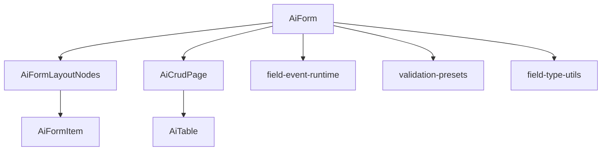
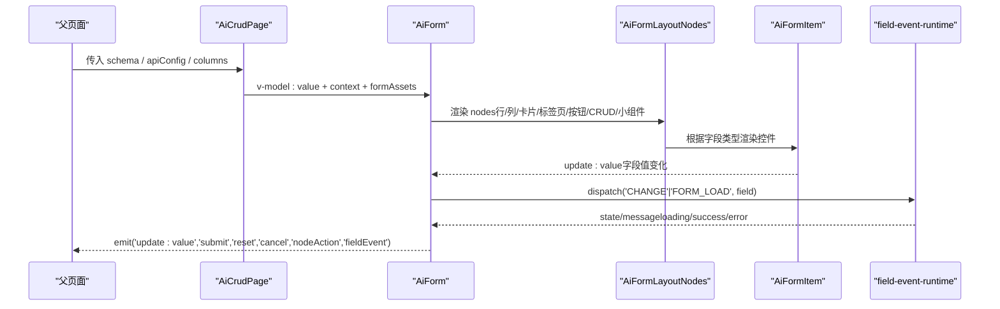
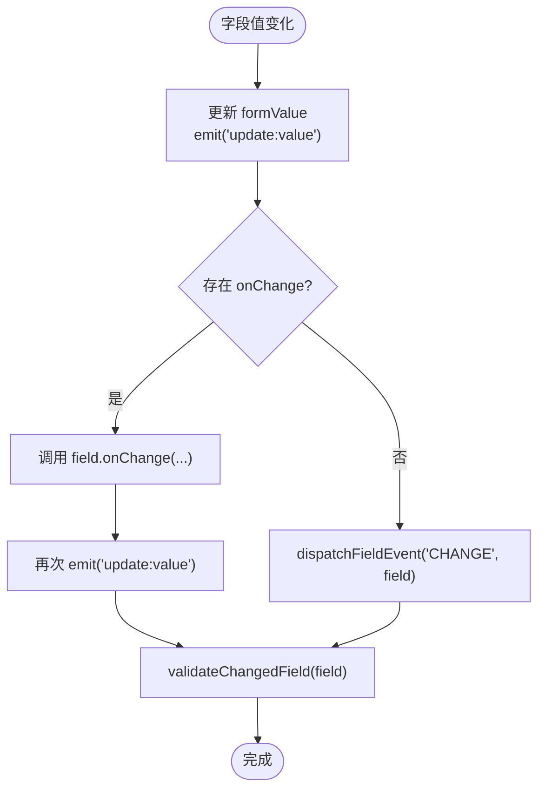
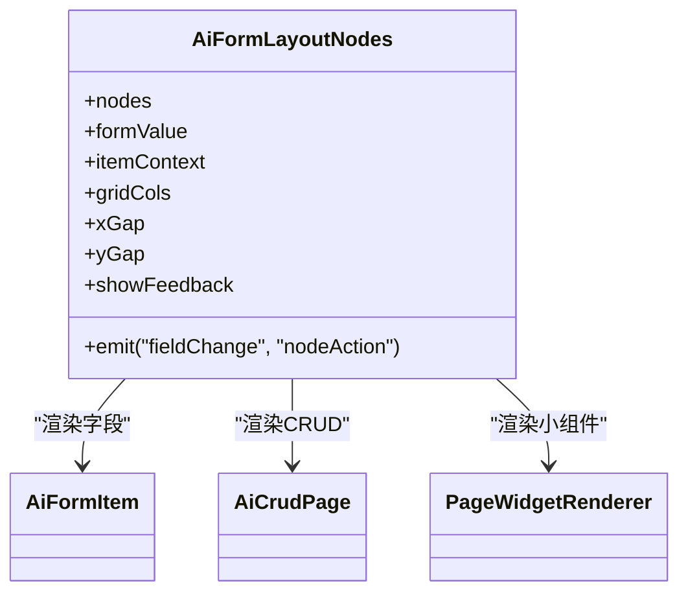
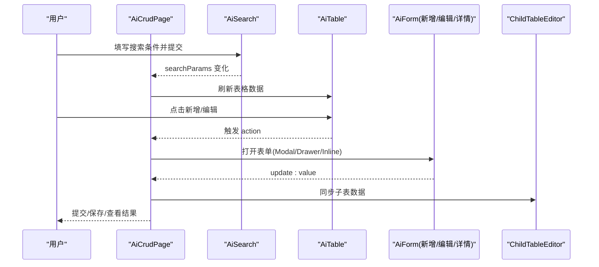
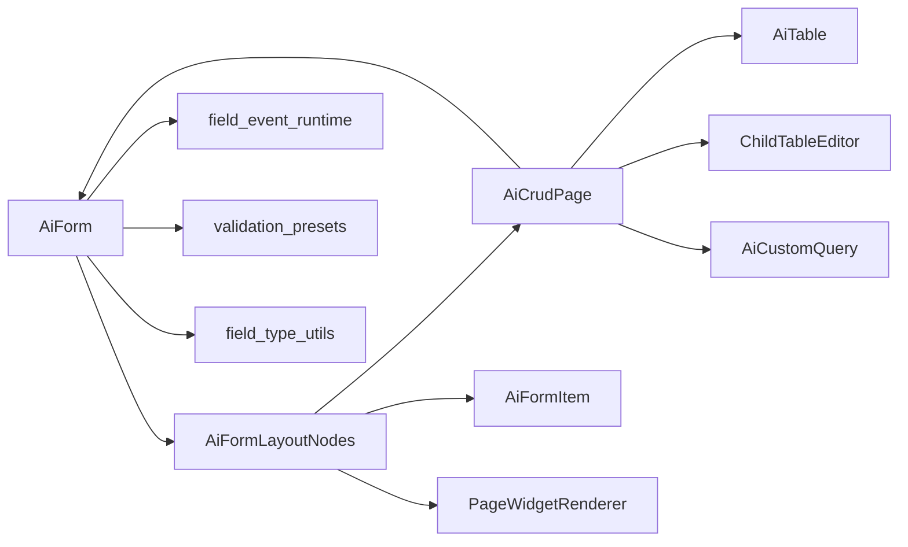

# AI表单组件

<cite>
**本文引用的文件**
- [AiForm.vue](file://forge-admin-ui/src/components/ai-form/AiForm.vue)
- [AiCrudPage.vue](file://forge-admin-ui/src/components/ai-form/AiCrudPage.vue)
- [AiTable.vue](file://forge-admin-ui/src/components/ai-form/AiTable.vue)
- [AiFormLayoutNodes.vue](file://forge-admin-ui/src/components/ai-form/AiFormLayoutNodes.vue)
- [AiFormItem.vue](file://forge-admin-ui/src/components/ai-form/AiFormItem.vue)
- [field-event-runtime.js](file://forge-admin-ui/src/components/ai-form/field-event-runtime.js)
- [validation-presets.js](file://forge-admin-ui/src/utils/validation-presets.js)
- [field-type-utils.js](file://forge-admin-ui/src/components/ai-form/field-type-utils.js)
</cite>

## 目录
1. [简介](#简介)
2. [项目结构](#项目结构)
3. [核心组件](#核心组件)
4. [架构总览](#架构总览)
5. [详细组件分析](#详细组件分析)
6. [依赖关系分析](#依赖关系分析)
7. [性能与体验优化](#性能与体验优化)
8. [故障排查指南](#故障排查指南)
9. [结论](#结论)
10. [附录：常用配置速查](#附录：常用配置速查)

## 简介
本文件面向使用 AI 表单体系（AiForm、AiCrudPage、AiTable）的开发者，系统性说明属性配置、事件处理、插槽用法、表单验证规则、数据绑定机制、异步操作处理、复杂布局与动态字段、条件渲染、移动端适配、后端 API 集成与错误处理策略。文档以源码为依据，提供可追溯的“章节来源”和“图表来源”，帮助快速定位实现位置。

## 项目结构
AI 表单体系由一组高内聚、低耦合的 Vue 组件构成：
- AiForm：JSON Schema 驱动的表单容器，负责校验、事件、折叠、弹窗表单等。
- AiFormLayoutNodes：递归渲染节点树（行/列/卡片/标签页/折叠/按钮/表格/CRUD/小组件）。
- AiFormItem：按字段类型动态渲染具体控件（输入、选择、日期、上传、树选择、用户选择等）。
- AiCrudPage：完整 CRUD 页面容器，组合搜索、表格、新增/编辑/详情、导入导出、子表编辑器等。
- AiTable：列表展示与交互（工具栏、筛选、排序、分页、卡片模式、拖拽滚动等）。
- field-event-runtime：字段事件运行时，支持 FORM_LOAD/CHANGE/BLUR/MANUAL/SCAN_COMPLETE 触发、防抖、结果映射、状态通知。
- validation-presets：通用校验预设与规则归一化。
- field-type-utils：字段类型判定工具。

**图表来源**
- [AiForm.vue:147-275](file://forge-admin-ui/src/components/ai-form/AiForm.vue#L147-L275)
- [AiFormLayoutNodes.vue:266-319](file://forge-admin-ui/src/components/ai-form/AiFormLayoutNodes.vue#L266-L319)
- [AiFormItem.vue:1-120](file://forge-admin-ui/src/components/ai-form/AiFormItem.vue#L1-L120)
- [AiCrudPage.vue:11-141](file://forge-admin-ui/src/components/ai-form/AiCrudPage.vue#L11-L141)
- [AiTable.vue:176-407](file://forge-admin-ui/src/components/ai-form/AiTable.vue#L176-L407)
- [field-event-runtime.js:99-294](file://forge-admin-ui/src/components/ai-form/field-event-runtime.js#L99-L294)
- [validation-presets.js:75-107](file://forge-admin-ui/src/utils/validation-presets.js#L75-L107)
- [field-type-utils.js:1-33](file://forge-admin-ui/src/components/ai-form/field-type-utils.js#L1-L33)

**章节来源**
- [AiForm.vue:147-275](file://forge-admin-ui/src/components/ai-form/AiForm.vue#L147-L275)
- [AiFormLayoutNodes.vue:266-319](file://forge-admin-ui/src/components/ai-form/AiFormLayoutNodes.vue#L266-L319)
- [AiFormItem.vue:1-120](file://forge-admin-ui/src/components/ai-form/AiFormItem.vue#L1-L120)
- [AiCrudPage.vue:11-141](file://forge-admin-ui/src/components/ai-form/AiCrudPage.vue#L11-L141)
- [AiTable.vue:176-407](file://forge-admin-ui/src/components/ai-form/AiTable.vue#L176-L407)
- [field-event-runtime.js:99-294](file://forge-admin-ui/src/components/ai-form/field-event-runtime.js#L99-L294)
- [validation-presets.js:75-107](file://forge-admin-ui/src/utils/validation-presets.js#L75-L107)
- [field-type-utils.js:1-33](file://forge-admin-ui/src/components/ai-form/field-type-utils.js#L1-L33)

## 核心组件
- AiForm
  - 职责：接收 JSON Schema，生成表单值与校验规则；管理折叠、分组导航、弹窗表单、字段事件、上下文注入。
  - 关键能力：v-model:value 双向绑定；formRules 动态生成；visibleSchema 可见性控制；handleFieldChange 更新并触发事件；内置 modal/drawer 形式的业务弹窗表单。
- AiCrudPage
  - 职责：聚合搜索、表格、新增/编辑/详情、导入导出、子表编辑器、流程进度等，提供 formOnly 模式与多种打开模式（modal/drawer/inline）。
  - 关键能力：searchSchema + normalizedSearchSchema；tableColumns 透传；formContext 注入；childFormRef 子表联动；多态表单区域（抽屉/弹窗/工作区）。
- AiTable
  - 职责：基于 n-data-table 封装，支持工具栏、列设置、密度切换、全屏、搜索切换、渲染模式切换、排序/筛选/分页、卡片模式。
  - 关键能力：tableColumns 计算列；displayedDataSource 本地过滤/排序；cardProps 卡片视图；dragScroll 横向拖拽滚动。

**章节来源**
- [AiForm.vue:147-275](file://forge-admin-ui/src/components/ai-form/AiForm.vue#L147-L275)
- [AiCrudPage.vue:11-141](file://forge-admin-ui/src/components/ai-form/AiCrudPage.vue#L11-L141)
- [AiTable.vue:176-407](file://forge-admin-ui/src/components/ai-form/AiTable.vue#L176-L407)

## 架构总览
下图展示了从页面到表单、再到字段与事件运行的调用链，以及数据流向。

**图表来源**
- [AiCrudPage.vue:63-141](file://forge-admin-ui/src/components/ai-form/AiCrudPage.vue#L63-L141)
- [AiForm.vue:41-144](file://forge-admin-ui/src/components/ai-form/AiForm.vue#L41-L144)
- [AiFormLayoutNodes.vue:1-263](file://forge-admin-ui/src/components/ai-form/AiFormLayoutNodes.vue#L1-L263)
- [AiFormItem.vue:27-120](file://forge-admin-ui/src/components/ai-form/AiFormItem.vue#L27-L120)
- [field-event-runtime.js:123-227](file://forge-admin-ui/src/components/ai-form/field-event-runtime.js#L123-L227)

## 详细组件分析

### AiForm 组件
- 属性要点
  - schema：表单节点数组，支持字段、布局节点、按钮、CRUD、小组件等。
  - value：表单数据对象，v-model:value 双向绑定。
  - context：上下文，包含 route、record、row、formData、fieldEvents、formAssets 等。
  - 布局：labelPlacement、labelWidth、labelAlign、size、gridCols、xGap、yGap。
  - 行为：showActions、showSubmit/showReset/showCancel、submitLoading、enableCollapse、maxVisibleFields、showFeedback、fieldPermissions、fieldEvents、fieldEventLoadToken。
- 数据绑定与校验
  - formValue 通过 watch(value) 同步初始化。
  - formRules 由 visibleFieldSchema 收集 rules 与 required 信息，结合 normalizeValidationRules 与 isNumberFieldType/isDateLikeType/isSelectionLikeType 生成精确校验。
  - handleFieldChange 更新 formValue，触发 onChange 回调与字段事件，再对变更字段进行增量校验。
- 可见性与权限
  - permissionAppliedSchema -> conditionVisibleSchema -> visibleSchema，应用权限与运行时控制（vIf/visible），支持折叠与分组导航。
- 字段事件
  - createFieldEventRuntime 统一管理规则，支持 FORM_LOAD/CHANGE/BLUR/MANUAL/SCAN_COMPLETE，具备防抖、跳过空值、清空目标、AbortController 取消、结果映射、状态与消息通知。
- 弹窗表单
  - 支持通过 nodeAction 的 openModal/setValue 动作打开内置弹窗表单，复用 AiForm 渲染。

**图表来源**
- [AiForm.vue:582-605](file://forge-admin-ui/src/components/ai-form/AiForm.vue#L582-L605)
- [AiForm.vue:665-675](file://forge-admin-ui/src/components/ai-form/AiForm.vue#L665-L675)

**章节来源**
- [AiForm.vue:147-275](file://forge-admin-ui/src/components/ai-form/AiForm.vue#L147-L275)
- [AiForm.vue:291-355](file://forge-admin-ui/src/components/ai-form/AiForm.vue#L291-L355)
- [AiForm.vue:357-470](file://forge-admin-ui/src/components/ai-form/AiForm.vue#L357-L470)
- [AiForm.vue:472-557](file://forge-admin-ui/src/components/ai-form/AiForm.vue#L472-L557)
- [AiForm.vue:582-706](file://forge-admin-ui/src/components/ai-form/AiForm.vue#L582-L706)
- [field-event-runtime.js:99-294](file://forge-admin-ui/src/components/ai-form/field-event-runtime.js#L99-L294)
- [validation-presets.js:75-107](file://forge-admin-ui/src/utils/validation-presets.js#L75-L107)
- [field-type-utils.js:1-33](file://forge-admin-ui/src/components/ai-form/field-type-utils.js#L1-L33)

### AiFormLayoutNodes 组件
- 职责：递归渲染节点树，识别字段、行、列、卡片、标签页、折叠、按钮、表格、CRUD、小组件等，并透传事件与插槽。
- 关键点
  - visibleNodes：应用运行时控制（visibility/disabled/readonly）后过滤。
  - span/gap：根据 gridCols 与节点 layout.span 计算栅格跨度与间距。
  - 按钮点击：将 click 事件转换为 nodeAction，供上层处理（如 setValue/openModal）。
  - CRUD 节点：buildCrudProps 将节点配置转为 AiCrudPage 所需 props。

**图表来源**
- [AiFormLayoutNodes.vue:1-263](file://forge-admin-ui/src/components/ai-form/AiFormLayoutNodes.vue#L1-L263)
- [AiFormLayoutNodes.vue:317-337](file://forge-admin-ui/src/components/ai-form/AiFormLayoutNodes.vue#L317-L337)
- [AiFormLayoutNodes.vue:475-528](file://forge-admin-ui/src/components/ai-form/AiFormLayoutNodes.vue#L475-L528)

**章节来源**
- [AiFormLayoutNodes.vue:1-263](file://forge-admin-ui/src/components/ai-form/AiFormLayoutNodes.vue#L1-L263)
- [AiFormLayoutNodes.vue:317-337](file://forge-admin-ui/src/components/ai-form/AiFormLayoutNodes.vue#L317-L337)
- [AiFormLayoutNodes.vue:475-528](file://forge-admin-ui/src/components/ai-form/AiFormLayoutNodes.vue#L475-L528)

### AiFormItem 组件
- 职责：根据字段 type 渲染对应控件（input/textarea/number/select/radio/checkbox/switch/date/time/upload/treeSelect/userSelect/regionTreeSelect/cascader/transfer/customSelect/objectReference/recordSelector/text/slot 等）。
- 关键点
  - 统一 handleUpdate 与 getComponentEvents 转发事件。
  - 支持只读文本展示、扫码扫描、字段事件反馈（查询中/成功/失败）。
  - 支持字典选择器、远程搜索、对象引用选择器等高级场景。

**章节来源**
- [AiFormItem.vue:1-120](file://forge-admin-ui/src/components/ai-form/AiFormItem.vue#L1-L120)
- [AiFormItem.vue:120-784](file://forge-admin-ui/src/components/ai-form/AiFormItem.vue#L120-L784)

### AiCrudPage 组件
- 职责：提供完整的 CRUD 页面能力，包括搜索、表格、新增/编辑/详情、导入导出、子表编辑器、流程进度、formOnly 模式等。
- 关键点
  - 搜索：AiSearch 组件，支持 schema、折叠、重置前钩子。
  - 表格：AiTable 组件，支持工具栏、列设置、密度、全屏、渲染模式切换、搜索面板切换。
  - 表单：在 Modal/Drawer/Inline Workspace 三种模式下复用 AiForm，支持父子表联动与详情面板。
  - 子表：ChildTableEditor 支持行级操作与工具栏动作。

**图表来源**
- [AiCrudPage.vue:11-141](file://forge-admin-ui/src/components/ai-form/AiCrudPage.vue#L11-L141)
- [AiCrudPage.vue:194-313](file://forge-admin-ui/src/components/ai-form/AiCrudPage.vue#L194-L313)
- [AiCrudPage.vue:316-491](file://forge-admin-ui/src/components/ai-form/AiCrudPage.vue#L316-L491)
- [AiCrudPage.vue:494-768](file://forge-admin-ui/src/components/ai-form/AiCrudPage.vue#L494-L768)

**章节来源**
- [AiCrudPage.vue:11-141](file://forge-admin-ui/src/components/ai-form/AiCrudPage.vue#L11-L141)
- [AiCrudPage.vue:194-313](file://forge-admin-ui/src/components/ai-form/AiCrudPage.vue#L194-L313)
- [AiCrudPage.vue:316-491](file://forge-admin-ui/src/components/ai-form/AiCrudPage.vue#L316-L491)
- [AiCrudPage.vue:494-768](file://forge-admin-ui/src/components/ai-form/AiCrudPage.vue#L494-L768)

### AiTable 组件
- 职责：列表展示与交互，支持工具栏、列设置、密度、全屏、搜索切换、渲染模式切换、排序/筛选/分页、卡片模式、拖拽滚动。
- 关键点
  - tableColumns：自动处理选择列、固定列、对齐、省略、排序、筛选、自定义渲染/格式化/插槽。
  - displayedDataSource：本地过滤与排序，支持 and/or 模式。
  - cardProps：卡片模式网格布局与分页。
  - 事件：page-change、page-size-change、refresh、density-change、filter-change、search-toggle、fullscreen-change、render-mode-change、update:sorter、update:filters。

**章节来源**
- [AiTable.vue:176-407](file://forge-admin-ui/src/components/ai-form/AiTable.vue#L176-L407)
- [AiTable.vue:488-800](file://forge-admin-ui/src/components/ai-form/AiTable.vue#L488-L800)

## 依赖关系分析
- AiForm 依赖
  - AiFormLayoutNodes：渲染节点树。
  - field-event-runtime：字段事件调度与状态管理。
  - validation-presets：校验规则归一化。
  - field-type-utils：数字/输入类字段判断。
- AiCrudPage 依赖
  - AiForm：表单渲染。
  - AiTable：列表展示。
  - ChildTableEditor：子表编辑。
  - AiCrudImportModal：导入弹窗。
  - AiCustomQuery：自定义查询。
- AiFormLayoutNodes 依赖
  - AiFormItem：字段渲染。
  - AiCrudPage：CRUD 节点。
  - PageWidgetRenderer：小组件渲染。

**图表来源**
- [AiForm.vue:147-275](file://forge-admin-ui/src/components/ai-form/AiForm.vue#L147-L275)
- [AiFormLayoutNodes.vue:266-319](file://forge-admin-ui/src/components/ai-form/AiFormLayoutNodes.vue#L266-L319)
- [AiCrudPage.vue:11-141](file://forge-admin-ui/src/components/ai-form/AiCrudPage.vue#L11-L141)

**章节来源**
- [AiForm.vue:147-275](file://forge-admin-ui/src/components/ai-form/AiForm.vue#L147-L275)
- [AiFormLayoutNodes.vue:266-319](file://forge-admin-ui/src/components/ai-form/AiFormLayoutNodes.vue#L266-L319)
- [AiCrudPage.vue:11-141](file://forge-admin-ui/src/components/ai-form/AiCrudPage.vue#L11-L141)

## 性能与体验优化
- 表单性能
  - 使用 enableCollapse 与 maxVisibleFields 控制初始渲染数量，减少首屏压力。
  - 合理设置 gridCols/xGap/yGap，避免过多嵌套导致重排。
  - 使用 showFeedback 控制提示显示，减少不必要的 DOM 更新。
  - 利用 fieldEventRuntime 的 debounceMs 降低高频 CHANGE 触发的请求频率。
- 列表性能
  - 使用 renderMode='card' 在小屏幕或特定场景下提升可读性。
  - 合理使用 filterOptions 与 sorter，避免全量本地排序/筛选大数据集。
  - 开启 dragScroll 改善宽表格体验。
- 用户体验
  - 使用 sectionNavItems 为长表单提供分组导航，提升可发现性。
  - 使用 formOnly 模式聚焦单一录入任务，减少干扰。
  - 使用 AiCrudPage 的 inline workspace 与 tab 模式，提升多任务效率。
- 移动端适配
  - 调整 gridCols 与 labelPlacement，确保小屏可读性。
  - 使用 card 模式与紧凑尺寸 size='small' 提升空间利用率。
  - 借助 AiTable 的搜索切换与工具栏精简，优化触控操作。

[本节为通用指导，不直接分析具体文件]

## 故障排查指南
- 表单校验异常
  - 检查字段是否被正确纳入 visibleFieldSchema，确认 vIf/visible 逻辑。
  - 核对 rules 与 requiredMessage，必要时使用 normalizeRulePattern 转换正则。
  - 对于 number/date/treeSelect 等类型，注意 hasFormValue 的空值判断逻辑。
- 字段事件未触发
  - 确认 fieldEvents 已正确传入 context 或通过 fieldEventLoadToken 刷新。
  - 检查 trigger、sourceField、paramMappings/resultMappings 是否合法。
  - 观察 fieldEventRuntime 的状态与 message，定位 skipped/loading/not_found/error。
- 弹窗表单未渲染
  - 检查 nodeAction 的 event.action 是否为 openModal，且 modalFormKey/formKey 匹配。
  - 确认 formAssets 已正确传入，schema 已被 buildActionModalSchema 规范化。
- 列表无数据或筛选无效
  - 检查 tableColumns 的 key/prop/dataIndex 与数据字段一致。
  - 确认 activeFilters 与 column.filter 函数逻辑。
  - 若使用自动筛选，确认数据量与选项数量阈值。

**章节来源**
- [AiForm.vue:341-470](file://forge-admin-ui/src/components/ai-form/AiForm.vue#L341-L470)
- [field-event-runtime.js:123-227](file://forge-admin-ui/src/components/ai-form/field-event-runtime.js#L123-L227)
- [AiForm.vue:691-725](file://forge-admin-ui/src/components/ai-form/AiForm.vue#L691-L725)
- [AiTable.vue:660-800](file://forge-admin-ui/src/components/ai-form/AiTable.vue#L660-L800)

## 结论
AI 表单体系以 JSON Schema 为核心，通过 AiForm 驱动表单渲染与校验，AiFormLayoutNodes 组织复杂布局，AiFormItem 覆盖丰富字段类型；AiCrudPage 提供开箱即用的 CRUD 页面能力；AiTable 提供高性能列表展示与交互。配合 field-event-runtime 与 validation-presets，可实现强大的动态字段、条件渲染、异步联动与校验。遵循本文的配置与最佳实践，可在复杂业务场景中快速构建高质量表单与数据界面。

[本节为总结性内容，不直接分析具体文件]

## 附录：常用配置速查
- AiForm 常用属性
  - schema、value、context、labelPlacement、labelWidth、labelAlign、size、gridCols、xGap、yGap、showActions、showSubmit/showReset/showCancel、submitLoading、enableCollapse、maxVisibleFields、showFeedback、fieldPermissions、fieldEvents、fieldEventLoadToken。
- AiForm 事件
  - update:value、submit、reset、cancel、nodeAction、fieldEvent。
- AiForm 插槽
  - formAction、gridAppend、任意自定义插槽名（透传）。
- AiCrudPage 常用能力
  - 搜索表单 schema、表格 columns、formOnly 模式、表单打开模式（modal/drawer/inline）、子表编辑器、导入导出、自定义查询。
- AiTable 常用属性
  - columns、dataSource、pagination、rowKey、striped、bordered、singleLine、size、tableRowGap、renderMode、cardProps、maxHeight、scrollX、dragScroll、hideSelection、checkedRowKeys、expandedRowKeys、resizable、context、showToolbar、showRefresh、showDensity、showColumnFilter、showSearchToggle、showFullscreen、showRenderModeSwitch、filterMaxHeight、defaultCheckedColumns、searchVisible、emptyTitle、emptyDescription。
- 字段事件
  - 触发器：FORM_LOAD、CHANGE、BLUR、MANUAL、SCAN_COMPLETE。
  - 参数映射：FROM_FORM_FIELD、CONTEXT_PATH、ROUTE_QUERY。
  - 结果映射：ROOT、FIRST_ROW；缺失处理：CLEAR、KEEP。
  - 错误处理：MESSAGE、SILENT。

[本节为参考清单，不直接分析具体文件]