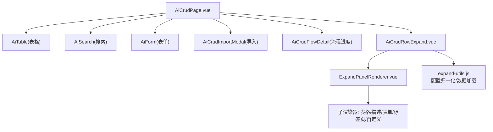
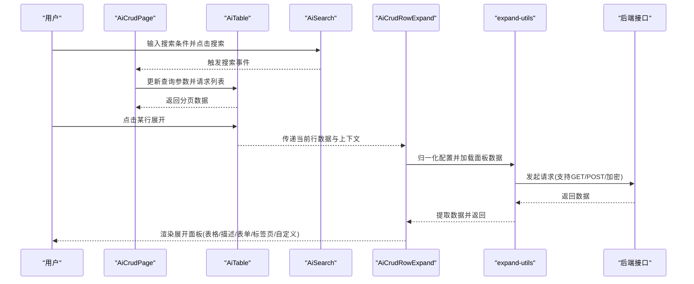
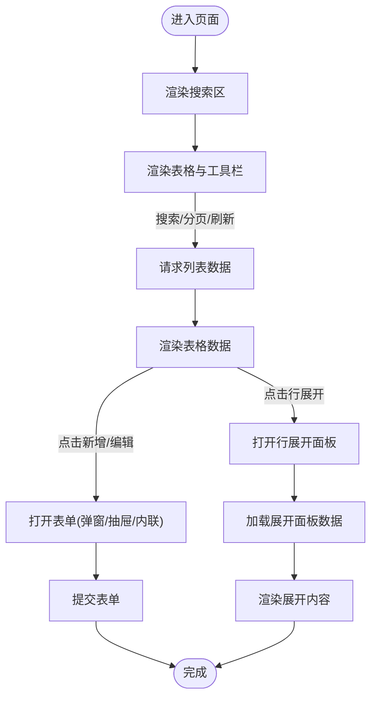
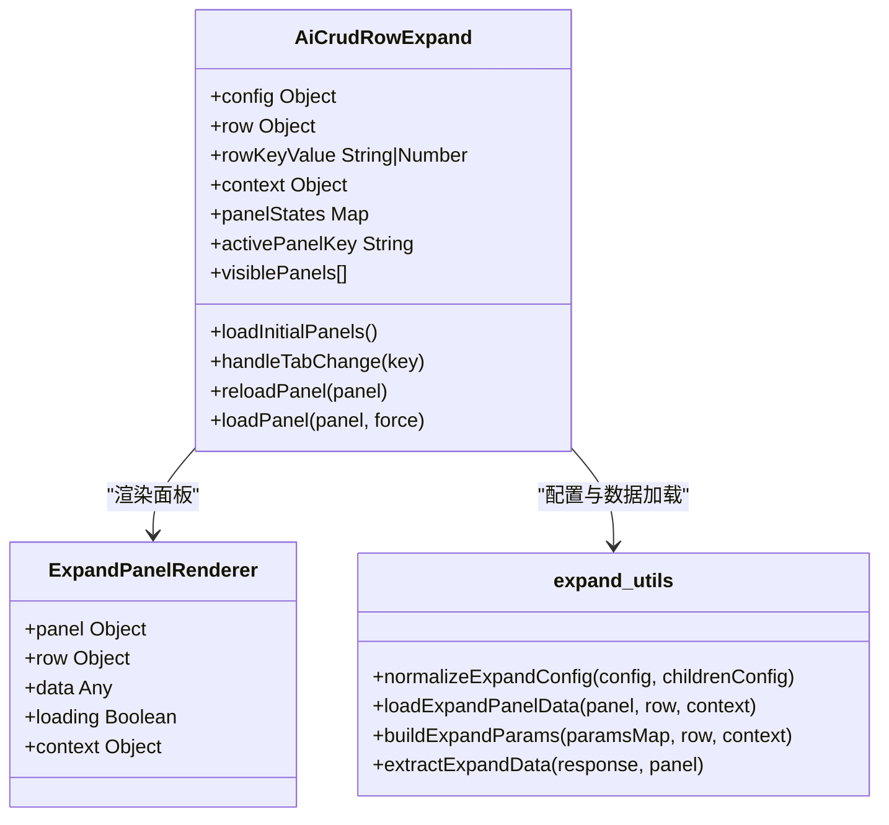
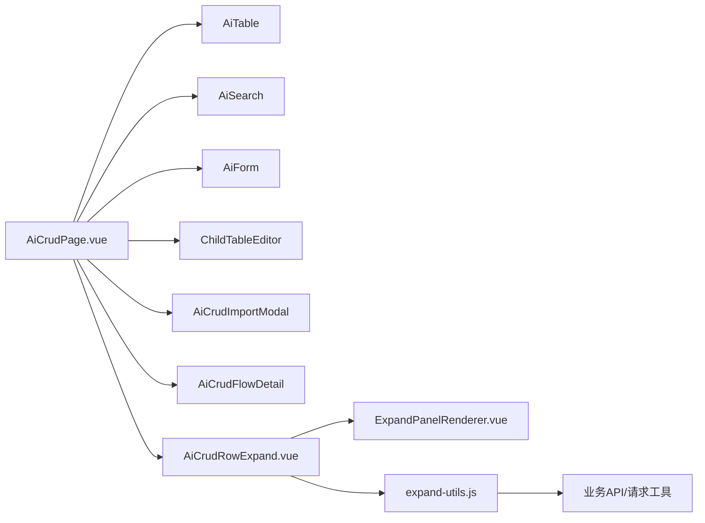

# CRUD页面组件

<cite>
**本文引用的文件**
- [AiCrudPage.vue](file://forge-admin-ui/src/components/ai-form/AiCrudPage.vue)
- [AiCrudRowExpand.vue](file://forge-admin-ui/src/components/ai-form/AiCrudRowExpand.vue)
- [expand-utils.js](file://forge-admin-ui/src/components/ai-form/expand-utils.js)
- [ExpandPanelRenderer.vue](file://forge-admin-ui/src/components/ai-form/ExpandPanelRenderer.vue)
</cite>

## 目录
1. [简介](#简介)
2. [项目结构](#项目结构)
3. [核心组件](#核心组件)
4. [架构总览](#架构总览)
5. [详细组件分析](#详细组件分析)
6. [依赖关系分析](#依赖关系分析)
7. [性能考虑](#性能考虑)
8. [故障排查指南](#故障排查指南)
9. [结论](#结论)
10. [附录：CRUD页面开发示例与最佳实践](#附录crud页面开发示例与最佳实践)

## 简介
本文件面向使用 AiCrudPage 的开发者，提供完整的 CRUD 页面组件文档。内容覆盖列表展示、搜索过滤、分页处理、批量操作、行展开（AiCrudRowExpand）配置与使用、自定义列渲染、操作按钮配置、数据导出、与业务逻辑集成方式以及性能优化策略。目标是帮助你在不深入源码的情况下，快速搭建高质量、可维护、高性能的 CRUD 页面。

## 项目结构
本项目前端位于 forge-admin-ui，CRUD 相关能力集中在 ai-form 组件目录下：
- AiCrudPage.vue：CRUD 页面容器，整合搜索、表格、表单、工具栏、导入导出、流程详情等。
- AiCrudRowExpand.vue：行展开面板容器，支持单面板、标签页、堆叠布局，内置加载与错误重试。
- expand-utils.js：展开面板配置归一化、数据源解析、API 调用封装、数量面板专用逻辑等。
- ExpandPanelRenderer.vue：根据面板类型分发到具体渲染器（表格、描述、表单、标签页、自定义）。

图表来源
- [AiCrudPage.vue:116-313](file://forge-admin-ui/src/components/ai-form/AiCrudPage.vue#L116-L313)
- [AiCrudRowExpand.vue:1-127](file://forge-admin-ui/src/components/ai-form/AiCrudRowExpand.vue#L1-L127)
- [ExpandPanelRenderer.vue:1-78](file://forge-admin-ui/src/components/ai-form/ExpandPanelRenderer.vue#L1-L78)
- [expand-utils.js:13-40](file://forge-admin-ui/src/components/ai-form/expand-utils.js#L13-L40)

章节来源
- [AiCrudPage.vue:116-313](file://forge-admin-ui/src/components/ai-form/AiCrudPage.vue#L116-L313)
- [AiCrudRowExpand.vue:1-127](file://forge-admin-ui/src/components/ai-form/AiCrudRowExpand.vue#L1-L127)
- [ExpandPanelRenderer.vue:1-78](file://forge-admin-ui/src/components/ai-form/ExpandPanelRenderer.vue#L1-L78)
- [expand-utils.js:13-40](file://forge-admin-ui/src/components/ai-form/expand-utils.js#L13-L40)

## 核心组件
- AiCrudPage
  - 功能：搜索区、表格区、工具栏、新增/编辑/详情（弹窗/抽屉/内联）、导入导出、批量操作、自定义查询、流程进度、离线草稿提示、仅表单模式等。
  - 关键交互：搜索触发列表刷新、分页切换、选择行进行批量操作、打开新增/编辑/详情、导入模板下载与导入结果回调。
- AiCrudRowExpand
  - 功能：行展开区域，支持单面板、标签页、堆叠三种布局；每个面板可独立加载、缓存、重试；支持 API、静态、行字段、数量面板等数据源。
- expand-utils
  - 功能：展开面板配置归一化、数据源解析、表达式求值、API 参数构建、响应数据提取、数量面板专用查询封装。
- ExpandPanelRenderer
  - 功能：按面板类型路由到对应渲染器（表格、描述、表单、标签页、自定义），统一传入 row、data、loading、context。

章节来源
- [AiCrudPage.vue:116-313](file://forge-admin-ui/src/components/ai-form/AiCrudPage.vue#L116-L313)
- [AiCrudRowExpand.vue:134-219](file://forge-admin-ui/src/components/ai-form/AiCrudRowExpand.vue#L134-L219)
- [expand-utils.js:13-40](file://forge-admin-ui/src/components/ai-form/expand-utils.js#L13-L40)
- [ExpandPanelRenderer.vue:1-78](file://forge-admin-ui/src/components/ai-form/ExpandPanelRenderer.vue#L1-L78)

## 架构总览
AiCrudPage 作为页面级容器，组合多个子组件完成 CRUD 全流程；AiCrudRowExpand 负责在行级别扩展展示更多维度信息，并通过 expand-utils 统一数据获取与渲染。

图表来源
- [AiCrudPage.vue:116-313](file://forge-admin-ui/src/components/ai-form/AiCrudPage.vue#L116-L313)
- [AiCrudRowExpand.vue:161-219](file://forge-admin-ui/src/components/ai-form/AiCrudRowExpand.vue#L161-L219)
- [expand-utils.js:241-319](file://forge-admin-ui/src/components/ai-form/expand-utils.js#L241-L319)

## 详细组件分析

### AiCrudPage 组件
- 列表展示
  - 通过 AiTable 绑定 columns、dataSource、pagination、row-key、选中行 keys 等属性，支持分页、排序、筛选、卡片视图、滚动高度自适应。
  - 工具栏左侧支持新增、批量操作、自定义查询、更多下拉；右侧支持插槽扩展。
- 搜索过滤
  - 通过 AiSearch 渲染搜索表单，支持折叠、最大可见字段数、Y轴间距、重置前钩子、额外操作按钮插槽。
  - 搜索事件触发后更新查询参数并刷新列表。
- 分页处理
  - 监听 page-change 与 page-size-change，将页码与每页条数回写至查询参数并重新拉取数据。
- 批量操作
  - 通过 selectedKeys 管理选中行，结合工具栏动作或自定义插槽实现批量删除、批量导出等。
- 新增/编辑/详情
  - 支持弹窗、抽屉、内联工作区三种打开模式；详情默认弹窗以避免占用右侧抽屉空间。
  - 表单由 AiForm 渲染，支持栅格列数、标签宽度/对齐/放置、尺寸、间距、反馈开关、上下文注入、资源注入。
  - 子表编辑器 ChildTableEditor 用于主从关系数据的编辑与行/工具栏动作。
- 导入导出
  - 导入通过 AiCrudImportModal 完成，支持模板下载与导入成功回调。
  - 导出可通过工具栏动作或自定义插槽实现（例如调用导出接口或本地生成）。
- 流程进度
  - 详情中可嵌入 AiCrudFlowDetail，支持时间线与流程图展示。
- 仅表单模式
  - formOnly 模式下隐藏列表，直接渲染表单与提交结果页，支持重置继续填报。

图表来源
- [AiCrudPage.vue:116-313](file://forge-admin-ui/src/components/ai-form/AiCrudPage.vue#L116-L313)
- [AiCrudPage.vue:494-732](file://forge-admin-ui/src/components/ai-form/AiCrudPage.vue#L494-L732)
- [AiCrudPage.vue:734-768](file://forge-admin-ui/src/components/ai-form/AiCrudPage.vue#L734-L768)

章节来源
- [AiCrudPage.vue:116-313](file://forge-admin-ui/src/components/ai-form/AiCrudPage.vue#L116-L313)
- [AiCrudPage.vue:494-732](file://forge-admin-ui/src/components/ai-form/AiCrudPage.vue#L494-L732)
- [AiCrudPage.vue:734-768](file://forge-admin-ui/src/components/ai-form/AiCrudPage.vue#L734-L768)

### AiCrudRowExpand 行展开组件
- 布局模式
  - 单面板：无标题或带标题的单块展示。
  - 标签页：多面板以标签页切换，懒加载显示。
  - 堆叠：所有面板垂直堆叠展示。
- 数据加载与缓存
  - 首次挂载时加载初始面板；切换标签时按需加载；支持关闭缓存强制刷新。
  - 每个面板独立状态（loading、loaded、data、error），支持错误重试。
- 配置项
  - panels：面板数组，支持 type、key、title、dataSource、table、descriptions、form、panels 等。
  - layout：mode、density、padding。
  - trigger、lazy、cache、defaultExpanded 控制行为。
- 数据源
  - row：直接使用行字段或整行对象。
  - static：静态数据。
  - api：支持 GET/POST/加密 POST，URL 支持路径参数与表达式占位符，paramsMap 支持表达式求值。
  - quantity：数量余额/流水/锁定三类专用面板，自动映射列与查询参数。

图表来源
- [AiCrudRowExpand.vue:134-219](file://forge-admin-ui/src/components/ai-form/AiCrudRowExpand.vue#L134-L219)
- [ExpandPanelRenderer.vue:1-78](file://forge-admin-ui/src/components/ai-form/ExpandPanelRenderer.vue#L1-L78)
- [expand-utils.js:13-40](file://forge-admin-ui/src/components/ai-form/expand-utils.js#L13-L40)
- [expand-utils.js:241-319](file://forge-admin-ui/src/components/ai-form/expand-utils.js#L241-L319)

章节来源
- [AiCrudRowExpand.vue:1-127](file://forge-admin-ui/src/components/ai-form/AiCrudRowExpand.vue#L1-L127)
- [AiCrudRowExpand.vue:134-219](file://forge-admin-ui/src/components/ai-form/AiCrudRowExpand.vue#L134-L219)
- [expand-utils.js:13-40](file://forge-admin-ui/src/components/ai-form/expand-utils.js#L13-L40)
- [expand-utils.js:241-319](file://forge-admin-ui/src/components/ai-form/expand-utils.js#L241-L319)

### 展开面板渲染器与类型
- 表格类面板：table、quantity-balance、quantity-ledger、quantity-lock，统一走表格渲染器。
- 描述面板：descriptions，支持列数、标签位置、字段列表。
- 表单面板：form，支持 schema、栅格列数、标签宽度/对齐/放置、尺寸。
- 标签页面板：tabs，支持嵌套子面板。
- 自定义面板：custom，透传插槽供业务自由扩展。

章节来源
- [ExpandPanelRenderer.vue:1-78](file://forge-admin-ui/src/components/ai-form/ExpandPanelRenderer.vue#L1-L78)
- [expand-utils.js:159-189](file://forge-admin-ui/src/components/ai-form/expand-utils.js#L159-L189)

## 依赖关系分析
- AiCrudPage 依赖
  - AiTable：列表渲染、分页、选择、工具栏插槽。
  - AiSearch：搜索表单与事件。
  - AiForm：新增/编辑/详情表单。
  - ChildTableEditor：主从子表编辑与动作。
  - AiCrudImportModal：导入与模板下载。
  - AiCrudFlowDetail：流程进度展示。
  - AiCrudRowExpand：行展开面板。
- AiCrudRowExpand 依赖
  - ExpandPanelRenderer：按类型渲染。
  - expand-utils：配置归一化、数据加载、表达式求值、数量面板查询。
- expand-utils 依赖
  - 业务 API：数量余额/流水/锁定查询。
  - request/postEncrypt：通用请求与加密请求。

图表来源
- [AiCrudPage.vue:116-313](file://forge-admin-ui/src/components/ai-form/AiCrudPage.vue#L116-L313)
- [AiCrudRowExpand.vue:130-132](file://forge-admin-ui/src/components/ai-form/AiCrudRowExpand.vue#L130-L132)
- [expand-utils.js:1-8](file://forge-admin-ui/src/components/ai-form/expand-utils.js#L1-L8)

章节来源
- [AiCrudPage.vue:116-313](file://forge-admin-ui/src/components/ai-form/AiCrudPage.vue#L116-L313)
- [AiCrudRowExpand.vue:130-132](file://forge-admin-ui/src/components/ai-form/AiCrudRowExpand.vue#L130-L132)
- [expand-utils.js:1-8](file://forge-admin-ui/src/components/ai-form/expand-utils.js#L1-L8)

## 性能考虑
- 列表与分页
  - 合理设置 pageSize，避免单次加载过多数据。
  - 使用服务端分页与搜索，减少前端计算压力。
  - 表格禁用不必要的选择、边框、条纹以提升渲染性能。
- 搜索与过滤
  - 防抖搜索输入，减少频繁请求。
  - 将复杂过滤条件推送到后端，前端只做轻量校验与展示。
- 行展开
  - 使用 lazy 与 cache 控制面板懒加载与缓存，避免重复请求。
  - 对大表格面板设置 maxHeight 与 scrollX，限制渲染范围。
  - 数量面板已内置分页与默认列，可直接复用。
- 表单与详情
  - 详情默认弹窗，避免右侧抽屉常驻带来的布局重排。
  - 表单字段按需渲染，减少无用 DOM。
- 导入导出
  - 大数据导出建议走服务端任务与下载链接，避免阻塞 UI。
  - 导入模板下载与导入结果异步处理，提升用户体验。

[本节为通用性能指导，无需特定文件引用]

## 故障排查指南
- 行展开面板加载失败
  - 现象：面板显示错误提示且无法加载数据。
  - 排查：检查 dataSource 配置是否正确（type、api/url、paramsMap），确认后端接口可达与返回结构符合 extractExpandData 预期。
  - 处理：点击“重试”按钮重新加载；必要时关闭缓存强制刷新。
- 展开面板未显示
  - 现象：点击行展开无内容。
  - 排查：确认 config.enabled 与 panels 是否有效；visible 是否为 false；layout.mode 是否符合预期。
- 数量面板数据为空
  - 现象：数量余额/流水/锁定面板无数据。
  - 排查：确认 queryType 与 paramsMap 正确；pageNum/pageSize 合理；后端返回字段匹配 dataField/totalField。
- 导入失败
  - 现象：导入报错或无提示。
  - 排查：检查模板格式与必填字段；确认导入接口返回结构与 success 回调处理逻辑。

章节来源
- [AiCrudRowExpand.vue:165-219](file://forge-admin-ui/src/components/ai-form/AiCrudRowExpand.vue#L165-L219)
- [expand-utils.js:241-319](file://forge-admin-ui/src/components/ai-form/expand-utils.js#L241-L319)

## 结论
AiCrudPage 提供了开箱即用的一体化 CRUD 解决方案，覆盖搜索、列表、分页、批量、表单、导入导出、流程进度与行展开等常见场景。AiCrudRowExpand 通过灵活的配置与数据源机制，满足多样化行级扩展需求。配合 expand-utils 的统一抽象，开发者可以以声明式方式快速构建高质量页面，并通过合理的性能策略保障体验。

[本节为总结性内容，无需特定文件引用]

## 附录：CRUD页面开发示例与最佳实践

- 基本 CRUD 页面
  - 配置搜索 schema 与 table columns，绑定分页与数据源。
  - 在工具栏添加新增、批量删除、导出等动作。
  - 表单使用 AiForm 渲染，支持校验与上下文注入。
  - 参考路径：[AiCrudPage.vue:116-313](file://forge-admin-ui/src/components/ai-form/AiCrudPage.vue#L116-L313)、[AiCrudPage.vue:494-732](file://forge-admin-ui/src/components/ai-form/AiCrudPage.vue#L494-L732)

- 自定义列渲染
  - 在 columns 中使用 render 函数或插槽，结合上下文数据动态渲染。
  - 注意性能：避免在 render 中进行昂贵计算，必要时使用缓存或后端预处理。
  - 参考路径：[AiCrudPage.vue:194-226](file://forge-admin-ui/src/components/ai-form/AiCrudPage.vue#L194-L226)

- 操作按钮配置
  - 工具栏动作：在 toolbar 插槽中添加按钮，绑定 handleActionClick。
  - 行内操作：在 columns 的操作列中定义按钮，支持权限控制与禁用逻辑。
  - 参考路径：[AiCrudPage.vue:227-305](file://forge-admin-ui/src/components/ai-form/AiCrudPage.vue#L227-L305)

- 数据导出
  - 小数据量：前端生成 CSV/Excel 并下载。
  - 大数据量：调用后端导出接口，返回下载链接或任务状态。
  - 参考路径：[AiCrudPage.vue:227-305](file://forge-admin-ui/src/components/ai-form/AiCrudPage.vue#L227-L305)

- 行展开配置与使用
  - 基础配置：启用 enabled，定义 panels 与 layout。
  - 数据源：使用 row/static/api/quantity，paramsMap 支持表达式。
  - 缓存与懒加载：默认开启，可按需关闭。
  - 参考路径：[expand-utils.js:13-40](file://forge-admin-ui/src/components/ai-form/expand-utils.js#L13-L40)、[expand-utils.js:241-319](file://forge-admin-ui/src/components/ai-form/expand-utils.js#L241-L319)、[AiCrudRowExpand.vue:134-219](file://forge-admin-ui/src/components/ai-form/AiCrudRowExpand.vue#L134-L219)

- 与业务逻辑集成
  - 通过 context 注入业务上下文（如租户、用户、权限）。
  - 表单与面板的 dataSource.paramsMap 使用表达式绑定行字段与上下文。
  - 数量面板直接复用业务 API，无需额外适配。
  - 参考路径：[expand-utils.js:207-239](file://forge-admin-ui/src/components/ai-form/expand-utils.js#L207-L239)、[expand-utils.js:335-349](file://forge-admin-ui/src/components/ai-form/expand-utils.js#L335-L349)

- 性能优化策略
  - 列表：分页、虚拟滚动（如需）、禁用不必要样式。
  - 搜索：防抖、后端过滤。
  - 展开：懒加载、缓存、限制表格高度。
  - 表单：按需渲染、延迟初始化。
  - 导入导出：服务端任务、断点续传（可选）。
  - 参考路径：[AiCrudPage.vue:194-226](file://forge-admin-ui/src/components/ai-form/AiCrudPage.vue#L194-L226)、[AiCrudRowExpand.vue:161-219](file://forge-admin-ui/src/components/ai-form/AiCrudRowExpand.vue#L161-L219)