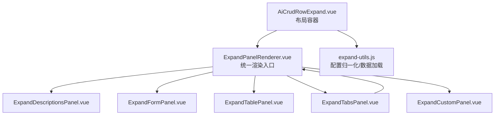
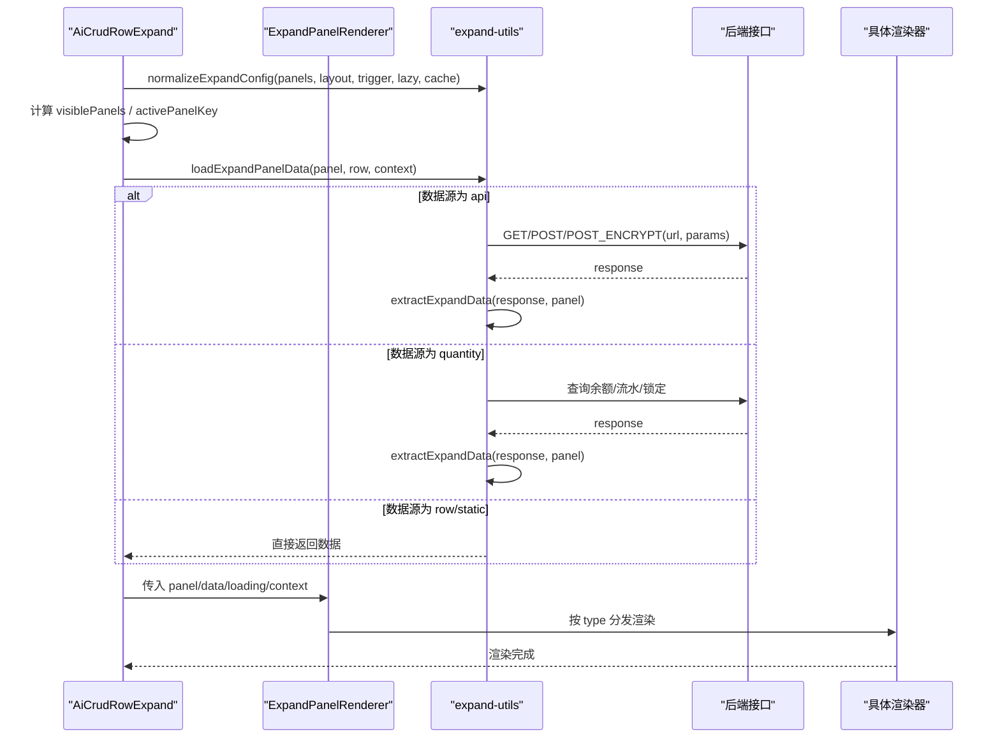
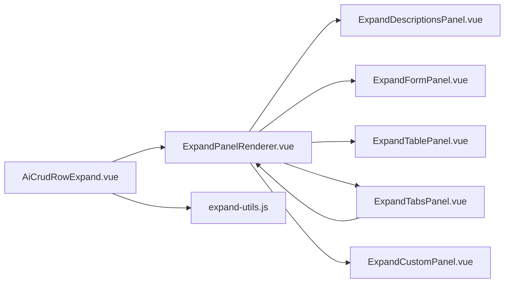

# 扩展面板组件

<cite>
**本文引用的文件**
- [ExpandPanelRenderer.vue](file://forge-admin-ui/src/components/ai-form/ExpandPanelRenderer.vue)
- [AiCrudRowExpand.vue](file://forge-admin-ui/src/components/ai-form/AiCrudRowExpand.vue)
- [expand-utils.js](file://forge-admin-ui/src/components/ai-form/expand-utils.js)
- [ExpandDescriptionsPanel.vue](file://forge-admin-ui/src/components/ai-form/expand-renderers/ExpandDescriptionsPanel.vue)
- [ExpandFormPanel.vue](file://forge-admin-ui/src/components/ai-form/expand-renderers/ExpandFormPanel.vue)
- [ExpandTablePanel.vue](file://forge-admin-ui/src/components/ai-form/expand-renderers/ExpandTablePanel.vue)
- [ExpandTabsPanel.vue](file://forge-admin-ui/src/components/ai-form/expand-renderers/ExpandTabsPanel.vue)
- [ExpandCustomPanel.vue](file://forge-admin-ui/src/components/ai-form/expand-renderers/ExpandCustomPanel.vue)
</cite>

## 目录
1. [简介](#简介)
2. [项目结构](#项目结构)
3. [核心组件](#核心组件)
4. [架构总览](#架构总览)
5. [详细组件分析](#详细组件分析)
6. [依赖关系分析](#依赖关系分析)
7. [性能与交互优化](#性能与交互优化)
8. [故障排查指南](#故障排查指南)
9. [结论](#结论)
10. [附录：配置参考与示例场景](#附录：配置参考与示例场景)

## 简介
本组件体系提供“行内展开面板”的统一能力，支持描述、表单、表格、标签页、自定义等多种渲染器。通过统一的渲染入口 ExpandPanelRenderer 与数据加载工具 expand-utils，配合布局容器 AiCrudRowExpand，实现多面板的懒加载、缓存、错误重试与多种布局模式（单面板、标签页、堆叠）。同时内置数量余额/流水/锁定等专用面板类型，便于快速构建业务场景。

## 项目结构
扩展面板相关代码集中在 ai-form 目录下，采用“统一渲染器 + 具体渲染器 + 数据工具 + 布局容器”的分层组织方式：
- 统一渲染器：ExpandPanelRenderer.vue
- 具体渲染器：ExpandDescriptionsPanel / ExpandFormPanel / ExpandTablePanel / ExpandTabsPanel / ExpandCustomPanel
- 数据与配置工具：expand-utils.js
- 布局容器：AiCrudRowExpand.vue

图表来源
- [AiCrudRowExpand.vue:1-126](file://forge-admin-ui/src/components/ai-form/AiCrudRowExpand.vue#L1-L126)
- [ExpandPanelRenderer.vue:1-78](file://forge-admin-ui/src/components/ai-form/ExpandPanelRenderer.vue#L1-L78)
- [expand-utils.js:13-84](file://forge-admin-ui/src/components/ai-form/expand-utils.js#L13-L84)

章节来源
- [AiCrudRowExpand.vue:1-126](file://forge-admin-ui/src/components/ai-form/AiCrudRowExpand.vue#L1-L126)
- [ExpandPanelRenderer.vue:1-78](file://forge-admin-ui/src/components/ai-form/ExpandPanelRenderer.vue#L1-L78)
- [expand-utils.js:13-84](file://forge-admin-ui/src/components/ai-form/expand-utils.js#L13-L84)

## 核心组件
- 统一渲染器 ExpandPanelRenderer：根据 panel.type 分发到对应渲染器；对 table/quantity-* 类表型面板做统一处理；为未知类型提供 descriptions 降级。
- 布局容器 AiCrudRowExpand：负责面板可见性过滤、布局模式（single/tabs/stack）、懒加载、缓存、错误提示与重试。
- 数据工具 expand-utils：配置归一化（normalizeExpandConfig/normalizeExpandPanel）、数据源解析（row/static/api/quantity）、表达式求值、分页总量提取等。
- 具体渲染器：
  - 描述面板：基于 n-descriptions，支持字典标签、图片列表等渲染。
  - 表单面板：只读展示，复用 AiForm schema。
  - 表格面板：复用 AiTable，支持列配置、分页、选择、工具栏开关等。
  - 标签页面板：嵌套子面板，独立状态管理、懒加载与错误重试。
  - 自定义面板：通过 slot 注入任意内容，slotName 由 panel.slot/slotName/key 推导。

章节来源
- [ExpandPanelRenderer.vue:1-78](file://forge-admin-ui/src/components/ai-form/ExpandPanelRenderer.vue#L1-L78)
- [AiCrudRowExpand.vue:134-219](file://forge-admin-ui/src/components/ai-form/AiCrudRowExpand.vue#L134-L219)
- [expand-utils.js:13-84](file://forge-admin-ui/src/components/ai-form/expand-utils.js#L13-L84)
- [ExpandDescriptionsPanel.vue:1-75](file://forge-admin-ui/src/components/ai-form/expand-renderers/ExpandDescriptionsPanel.vue#L1-L75)
- [ExpandFormPanel.vue:1-45](file://forge-admin-ui/src/components/ai-form/expand-renderers/ExpandFormPanel.vue#L1-L45)
- [ExpandTablePanel.vue:1-51](file://forge-admin-ui/src/components/ai-form/expand-renderers/ExpandTablePanel.vue#L1-L51)
- [ExpandTabsPanel.vue:1-123](file://forge-admin-ui/src/components/ai-form/expand-renderers/ExpandTabsPanel.vue#L1-L123)
- [ExpandCustomPanel.vue:1-33](file://forge-admin-ui/src/components/ai-form/expand-renderers/ExpandCustomPanel.vue#L1-L33)

## 架构总览
扩展面板的数据流与渲染流程如下：

图表来源
- [AiCrudRowExpand.vue:179-219](file://forge-admin-ui/src/components/ai-form/AiCrudRowExpand.vue#L179-L219)
- [expand-utils.js:241-319](file://forge-admin-ui/src/components/ai-form/expand-utils.js#L241-L319)
- [ExpandPanelRenderer.vue:1-78](file://forge-admin-ui/src/components/ai-form/ExpandPanelRenderer.vue#L1-L78)

## 详细组件分析

### 统一渲染器 ExpandPanelRenderer
- 职责：根据 panel.type 选择具体渲染器；将 table/quantity-* 视为“表型面板”，统一走表格渲染；为未知类型提供 descriptions 降级。
- 关键逻辑：
  - isTableLikePanel：识别 table、quantity-balance、quantity-ledger、quantity-lock。
  - fallbackPanel：当未匹配到已知类型时，使用 descriptions 作为兜底。
- 插槽透传：tabs/custom 支持插槽透传，便于外部注入内容。

章节来源
- [ExpandPanelRenderer.vue:1-78](file://forge-admin-ui/src/components/ai-form/ExpandPanelRenderer.vue#L1-L78)

### 布局容器 AiCrudRowExpand
- 职责：管理面板可见性、布局模式（single/tabs/stack）、懒加载、缓存、错误提示与重试。
- 关键点：
  - visiblePanels：过滤 visible !== false 的面板。
  - layout.mode：single/tabs/stack，影响首屏加载策略与样式。
  - 缓存：config.cache !== false 时，已加载面板不重复请求。
  - 错误处理：每个面板独立 error 状态，并提供“重试”按钮。
  - 初始加载：onMounted 或 rowKeyValue 变化时触发加载；tabs 模式下仅加载当前激活面板。

章节来源
- [AiCrudRowExpand.vue:1-126](file://forge-admin-ui/src/components/ai-form/AiCrudRowExpand.vue#L1-L126)
- [AiCrudRowExpand.vue:134-219](file://forge-admin-ui/src/components/ai-form/AiCrudRowExpand.vue#L134-L219)

### 数据工具 expand-utils
- 配置归一化：
  - normalizeExpandConfig：启用判断、默认布局、默认密度/内边距、默认标题映射。
  - normalizeExpandPanel：补齐 key/title/datasource/table/form/descriptions/panels。
  - normalizeDataSource：自动推断 row/static/api/quantity，并合并 childrenConfig。
  - normalizeTableConfig：默认列、分页、滚动、选择、工具栏等。
  - normalizeQuantityConfig：默认分页参数。
  - normalizeDescriptionsConfig/formConfig：默认列数、标签位置、schema 等。
- 数据加载：
  - loadExpandPanelData：根据 dataSource.type 路由到 row/static/api/quantity。
  - loadApiExpandData：解析 method/url，支持 postEncrypt，构造 paramsMap。
  - parseExpandApiConfig：支持 :param 与 {expr} 占位符替换。
  - extractExpandData/extractExpandTotal：从响应中抽取 records/list/rows/total。
  - buildExpandParams/resolveExpressionValue：表达式求值与参数构建。
- 数量面板：
  - 内置 quantity-balance/quantity-ledger/quantity-lock 三种类型及默认列定义。

章节来源
- [expand-utils.js:13-189](file://forge-admin-ui/src/components/ai-form/expand-utils.js#L13-L189)
- [expand-utils.js:191-349](file://forge-admin-ui/src/components/ai-form/expand-utils.js#L191-L349)

### 描述面板 ExpandDescriptionsPanel
- 基于 n-descriptions，支持 columns、labelPlacement。
- 字段渲染：
  - 字典标签：render.type === 'dictTag'。
  - 标签：render.type === 'tag'。
  - 图片上传：render.type === 'imageUpload'，以缩略图形式展示。
- 空值处理：显示 emptyText 或默认占位符。

章节来源
- [ExpandDescriptionsPanel.vue:1-75](file://forge-admin-ui/src/components/ai-form/expand-renderers/ExpandDescriptionsPanel.vue#L1-L75)

### 表单面板 ExpandFormPanel
- 基于 AiForm 只读展示，继承 form.schema，强制 readonly/disabled。
- 可配置 gridCols、labelWidth、labelPlacement、size。

章节来源
- [ExpandFormPanel.vue:1-45](file://forge-admin-ui/src/components/ai-form/expand-renderers/ExpandFormPanel.vue#L1-L45)

### 表格面板 ExpandTablePanel
- 基于 AiTable，支持 columns、rowKey、pagination、hideSelection、bordered、striped、size、maxHeight、scrollX、showToolbar。
- 数据兼容：支持 data.records/rows/list/array 多种形态。

章节来源
- [ExpandTablePanel.vue:1-51](file://forge-admin-ui/src/components/ai-form/expand-renderers/ExpandTablePanel.vue#L1-L51)

### 标签页面板 ExpandTabsPanel
- 嵌套子面板，独立状态管理（loading/loaded/data/error）。
- 懒加载：display-directive="show:lazy"，切换时按需加载。
- 错误重试：n-alert 展示错误信息并提供重试按钮。
- 插槽透传：透传给内部 ExpandPanelRenderer。

章节来源
- [ExpandTabsPanel.vue:1-123](file://forge-admin-ui/src/components/ai-form/expand-renderers/ExpandTabsPanel.vue#L1-L123)

### 自定义面板 ExpandCustomPanel
- 通过 slot 注入任意内容，slotName 由 panel.slot/slotName/key 推导。
- 未配置时显示空状态提示。

章节来源
- [ExpandCustomPanel.vue:1-33](file://forge-admin-ui/src/components/ai-form/expand-renderers/ExpandCustomPanel.vue#L1-L33)

## 依赖关系分析
- AiCrudRowExpand 依赖 expand-utils 进行配置归一化与数据加载，依赖 ExpandPanelRenderer 进行渲染分发。
- ExpandPanelRenderer 依赖各具体渲染器，并根据 panel.type 动态选择。
- 标签页面板 ExpandTabsPanel 内部再次调用 ExpandPanelRenderer，形成递归渲染能力。
- 数据加载路径：loadExpandPanelData -> loadApiExpandData/loadQuantityExpandData -> extractExpandData。

图表来源
- [AiCrudRowExpand.vue:1-126](file://forge-admin-ui/src/components/ai-form/AiCrudRowExpand.vue#L1-L126)
- [ExpandPanelRenderer.vue:1-78](file://forge-admin-ui/src/components/ai-form/ExpandPanelRenderer.vue#L1-L78)
- [expand-utils.js:241-319](file://forge-admin-ui/src/components/ai-form/expand-utils.js#L241-L319)

章节来源
- [AiCrudRowExpand.vue:1-126](file://forge-admin-ui/src/components/ai-form/AiCrudRowExpand.vue#L1-L126)
- [ExpandPanelRenderer.vue:1-78](file://forge-admin-ui/src/components/ai-form/ExpandPanelRenderer.vue#L1-L78)
- [expand-utils.js:241-319](file://forge-admin-ui/src/components/ai-form/expand-utils.js#L241-L319)

## 性能与交互优化
- 懒加载：tabs/stack 模式下仅加载当前激活面板；标签页使用 display-directive="show:lazy" 避免预渲染开销。
- 缓存控制：config.cache !== false 时，已加载面板不重复请求；切换行时可按需清空缓存。
- 数据抽取优化：extractExpandData 兼容多种响应结构，减少上层适配成本。
- 表格性能：合理设置 maxHeight/scrollX/pagination；隐藏不必要的 selection 与 toolbar。
- 错误体验：每个面板独立错误状态与重试按钮，提升容错性与可恢复性。
- 表达式求值：buildExpandParams/resolveExpressionValue 支持模板字符串与点路径访问，简化参数拼装。

[本节为通用指导，无需特定文件引用]

## 故障排查指南
- 面板未显示：检查 config.enabled、panel.visible、visiblePanels 过滤逻辑。
- 数据为空：确认 dataSource.type 与 dataField/totalField 配置；核对 extractExpandData 抽取路径。
- 接口报错：查看 panelState.error 与重试按钮；检查 parseExpandApiConfig 生成的 url/method/params。
- 数量面板无数据：确认 queryType 与 pageNum/pageSize；核对后端返回结构。
- 标签页不刷新：确认 activeKey 与 childPanels 同步；必要时 force=true 触发重载。

章节来源
- [AiCrudRowExpand.vue:165-219](file://forge-admin-ui/src/components/ai-form/AiCrudRowExpand.vue#L165-L219)
- [expand-utils.js:258-319](file://forge-admin-ui/src/components/ai-form/expand-utils.js#L258-L319)
- [ExpandTabsPanel.vue:92-115](file://forge-admin-ui/src/components/ai-form/expand-renderers/ExpandTabsPanel.vue#L92-L115)

## 结论
扩展面板组件通过统一渲染器与数据工具，实现了多类型面板的一致体验与高扩展性。借助懒加载、缓存、错误重试与丰富的渲染器，能够快速覆盖详情展示、关联数据编辑、多标签页管理等常见场景。建议优先使用内置渲染器，在复杂场景下通过 custom 面板与插槽进行定制。

[本节为总结性内容，无需特定文件引用]

## 附录：配置参考与示例场景

### 配置选项速览
- 顶层配置（config）
  - enabled：是否启用展开面板
  - panels：面板数组
  - trigger：触发方式（如 icon）
  - lazy：是否懒加载（默认 true）
  - cache：是否缓存（默认 true）
  - defaultExpanded：是否默认展开
  - layout：mode(single/tabs/stack)、density、padding
- 面板项（panel）
  - key/type/title：唯一标识、渲染类型、标题
  - dataSource：type(row/static/api/quantity)，url/method/paramsMap/dataField/totalField
  - table：columns、rowKey、pagination、maxHeight、scrollX、bordered、striped、size、hideSelection、showToolbar
  - descriptions：columns、labelPlacement、fields[]
  - form：schema、gridCols、labelWidth、labelPlacement、size
  - panels：子面板（用于 tabs 类型）
  - visible：是否可见
- 表达式与参数
  - paramsMap：键值对，值可为表达式字符串或常量
  - resolveExpressionValue：支持 ${...}、字面量、数字、对象路径访问

章节来源
- [expand-utils.js:13-189](file://forge-admin-ui/src/components/ai-form/expand-utils.js#L13-L189)
- [expand-utils.js:207-239](file://forge-admin-ui/src/components/ai-form/expand-utils.js#L207-L239)

### 典型场景示例
- 详情展示（descriptions）
  - 使用 descriptions.fields 定义字段与标签，支持字典标签与图片列表。
  - 适合只读展示主记录的关键信息。
- 关联数据编辑（table/form）
  - 使用 table 展示子表数据，支持分页与选择；form 用于只读展示复杂表单结构。
  - 结合 dataSource.api 拉取关联数据，使用 paramsMap 传递上下文。
- 多标签页管理（tabs）
  - 使用 panels 定义多个子面板，分别承载不同维度内容；支持懒加载与错误重试。
  - 适合将概览、明细、日志等分门别类呈现。
- 数量业务（quantity-*）
  - 内置余额/流水/锁定三类面板，自动配置默认列与分页。
  - 适合库存、额度等业务场景。

章节来源
- [ExpandDescriptionsPanel.vue:1-75](file://forge-admin-ui/src/components/ai-form/expand-renderers/ExpandDescriptionsPanel.vue#L1-L75)
- [ExpandTablePanel.vue:1-51](file://forge-admin-ui/src/components/ai-form/expand-renderers/ExpandTablePanel.vue#L1-L51)
- [ExpandFormPanel.vue:1-45](file://forge-admin-ui/src/components/ai-form/expand-renderers/ExpandFormPanel.vue#L1-L45)
- [ExpandTabsPanel.vue:1-123](file://forge-admin-ui/src/components/ai-form/expand-renderers/ExpandTabsPanel.vue#L1-L123)
- [expand-utils.js:111-157](file://forge-admin-ui/src/components/ai-form/expand-utils.js#L111-L157)