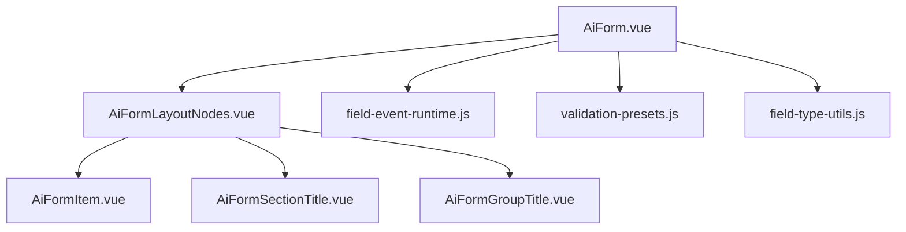
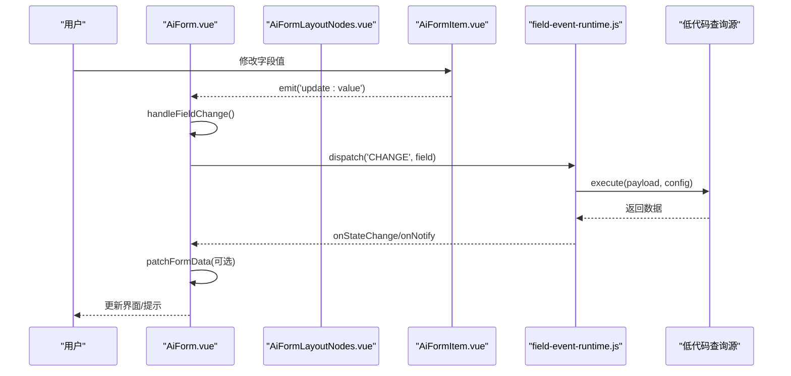
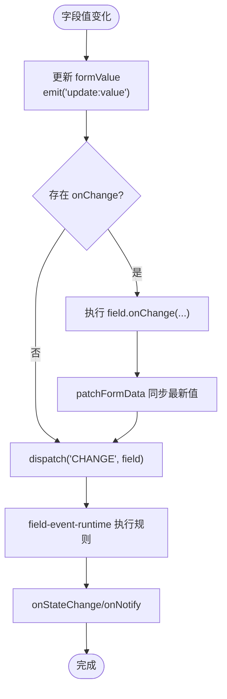
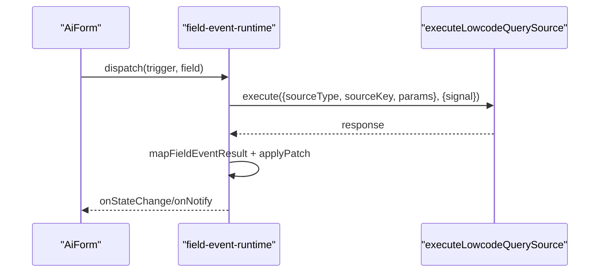
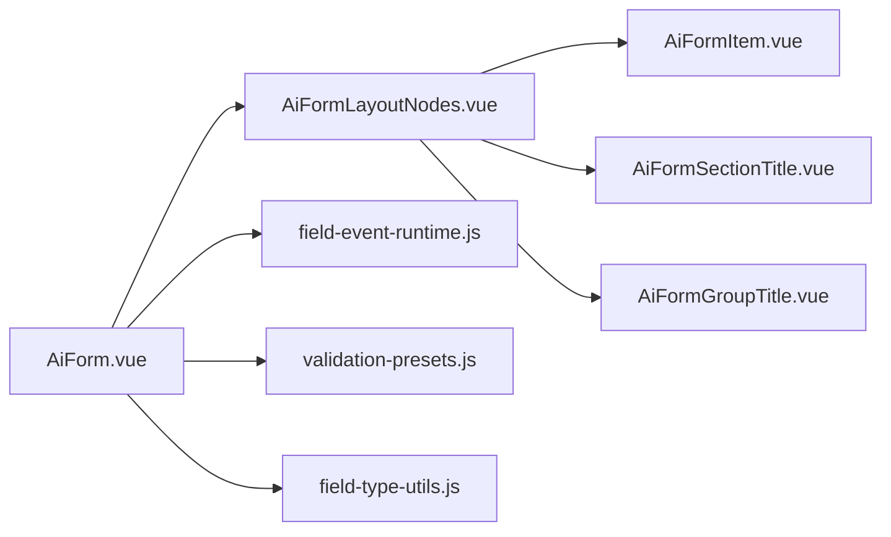

# 核心表单组件

<cite>
**本文引用的文件**
- [AiForm.vue](file://forge-admin-ui/src/components/ai-form/AiForm.vue)
- [AiFormItem.vue](file://forge-admin-ui/src/components/ai-form/AiFormItem.vue)
- [AiFormLayoutNodes.vue](file://forge-admin-ui/src/components/ai-form/AiFormLayoutNodes.vue)
- [AiFormSectionTitle.vue](file://forge-admin-ui/src/components/ai-form/AiFormSectionTitle.vue)
- [AiFormGroupTitle.vue](file://forge-admin-ui/src/components/ai-form/AiFormGroupTitle.vue)
- [field-event-runtime.js](file://forge-admin-ui/src/components/ai-form/field-event-runtime.js)
- [validation-presets.js](file://forge-admin-ui/src/utils/validation-presets.js)
- [field-type-utils.js](file://forge-admin-ui/src/components/ai-form/field-type-utils.js)
</cite>

## 目录
1. [简介](#简介)
2. [项目结构](#项目结构)
3. [核心组件](#核心组件)
4. [架构总览](#架构总览)
5. [详细组件分析](#详细组件分析)
6. [依赖关系分析](#依赖关系分析)
7. [性能与优化](#性能与优化)
8. [故障排查指南](#故障排查指南)
9. [结论](#结论)
10. [附录：常用配置速查](#附录：常用配置速查)

## 简介
本文件面向 AiForm 与 AiFormItem 两个核心表单组件，系统性说明其属性、事件、插槽、验证规则、数据绑定、异步操作处理、复杂布局、动态字段与条件渲染、移动端适配、后端 API 集成与错误处理策略。文档同时提供架构图、时序图与流程图，帮助快速掌握并高效使用。

## 项目结构
AiForm 体系由以下关键文件组成：
- AiForm.vue：表单容器，负责数据绑定、校验规则生成、折叠/导航、弹窗表单、字段事件调度等。
- AiFormLayoutNodes.vue：基于栅格的节点渲染器，支持行/列/卡片/标签页/折叠/按钮/表格/CRUD/小组件等布局节点。
- AiFormItem.vue：表单项渲染器，根据 type 动态选择具体控件（输入、选择、日期、上传、树选择、用户选择、文本展示、自定义插槽等）。
- AiFormSectionTitle.vue / AiFormGroupTitle.vue：分组标题与章节标题的展示组件。
- field-event-runtime.js：字段事件运行时，负责参数构建、结果映射、防抖、取消、状态与通知。
- validation-presets.js：内置校验预设与规则归一化。
- field-type-utils.js：字段类型判断工具（数字型、输入型等）。

图表来源
- [AiForm.vue:14-144](file://forge-admin-ui/src/components/ai-form/AiForm.vue#L14-L144)
- [AiFormLayoutNodes.vue:1-263](file://forge-admin-ui/src/components/ai-form/AiFormLayoutNodes.vue#L1-L263)
- [AiFormItem.vue:5-784](file://forge-admin-ui/src/components/ai-form/AiFormItem.vue#L5-L784)
- [AiFormSectionTitle.vue:1-129](file://forge-admin-ui/src/components/ai-form/AiFormSectionTitle.vue#L1-L129)
- [AiFormGroupTitle.vue:1-62](file://forge-admin-ui/src/components/ai-form/AiFormGroupTitle.vue#L1-L62)
- [field-event-runtime.js:99-294](file://forge-admin-ui/src/components/ai-form/field-event-runtime.js#L99-L294)
- [validation-presets.js:75-107](file://forge-admin-ui/src/utils/validation-presets.js#L75-L107)
- [field-type-utils.js:1-33](file://forge-admin-ui/src/components/ai-form/field-type-utils.js#L1-L33)

章节来源
- [AiForm.vue:14-144](file://forge-admin-ui/src/components/ai-form/AiForm.vue#L14-L144)
- [AiFormLayoutNodes.vue:1-263](file://forge-admin-ui/src/components/ai-form/AiFormLayoutNodes.vue#L1-L263)
- [AiFormItem.vue:5-784](file://forge-admin-ui/src/components/ai-form/AiFormItem.vue#L5-L784)

## 核心组件
- AiForm
  - 职责：表单容器、数据双向绑定、校验规则生成、折叠与分区导航、弹窗表单、字段事件调度、提交/重置/取消。
  - 关键能力：v-model:value 绑定；schema 驱动渲染；visibleSchema 过滤可见字段；formRules 动态生成；handleFieldChange 触发 onChange 与字段事件；handleNodeAction 处理按钮/弹窗等交互。
- AiFormLayoutNodes
  - 职责：将 schema 节点按栅格布局渲染为 n-grid/n-gi，递归处理 row/col/card/tabs/collapse/button/table/tableGrid/crud/widget 等节点。
  - 关键能力：visibleNodes 应用运行时控制；resolveNodeSpan 计算 span；事件冒泡 fieldChange/nodeAction。
- AiFormItem
  - 职责：根据 field.type 渲染具体控件，统一值更新 handleUpdate，处理上传、远程搜索、树选择、用户选择、时间范围等复杂控件。
  - 关键能力：只读/禁用处理 disabledHandler；placeholder/格式化；事件透传 getComponentEvents；字段事件反馈区。

章节来源
- [AiForm.vue:160-273](file://forge-admin-ui/src/components/ai-form/AiForm.vue#L160-L273)
- [AiForm.vue:291-355](file://forge-admin-ui/src/components/ai-form/AiForm.vue#L291-L355)
- [AiForm.vue:582-706](file://forge-admin-ui/src/components/ai-form/AiForm.vue#L582-L706)
- [AiFormLayoutNodes.vue:280-319](file://forge-admin-ui/src/components/ai-form/AiFormLayoutNodes.vue#L280-L319)
- [AiFormItem.vue:5-784](file://forge-admin-ui/src/components/ai-form/AiFormItem.vue#L5-L784)

## 架构总览
AiForm 通过 schema 驱动渲染，AiFormLayoutNodes 负责布局与节点分发，AiFormItem 负责具体控件渲染。表单数据在 AiForm 中集中管理，并通过 computed 派生 visibleSchema 与 formRules。字段变化时触发 onChange 与字段事件运行时，最终可调用后端查询源或执行业务动作。

图表来源
- [AiForm.vue:582-617](file://forge-admin-ui/src/components/ai-form/AiForm.vue#L582-L617)
- [field-event-runtime.js:123-227](file://forge-admin-ui/src/components/ai-form/field-event-runtime.js#L123-L227)

## 详细组件分析

### AiForm 组件
- 属性（部分）
  - schema: 表单节点数组，驱动渲染
  - value: v-model 绑定的表单数据对象
  - context: 上下文（含 currentRow/row/formData/route 等）
  - labelPlacement/labelWidth/labelAlign/size: 标签与尺寸
  - gridCols/xGap/yGap: 栅格布局
  - showActions/showSubmit/showReset/showCancel: 操作按钮显隐
  - submitLoading/submitText/resetText/cancelText: 按钮状态与文案
  - enableCollapse/maxVisibleFields: 折叠显示
  - showFeedback: 是否显示校验反馈
  - formAssets: 弹窗表单资源
  - fieldPermissions: 字段权限
  - fieldEvents/fieldEventLoadToken: 字段事件配置与加载令牌
- 事件
  - update:value: 数据变更
  - submit/reset/cancel: 提交/重置/取消
  - nodeAction: 节点动作（如按钮点击、打开弹窗）
  - fieldEvent: 字段事件状态变化
- 插槽
  - 透传所有具名插槽到 AiFormLayoutNodes
  - gridAppend: 用于放置“展开/收起”与自定义操作区域
- 数据绑定与可见性
  - watch(value) 初始化 formValue
  - isFieldVisible 结合运行时控制与 vIf 决定字段可见
  - visibleSchema 应用权限、可见性、折叠与反馈标记
- 校验规则
  - formRules 收集每个字段的 rules 与 validation.presets/pattern/rules
  - 对数字/日期/选择类字段补充 required 校验逻辑，避免 0/空数组误判
- 字段事件
  - createFieldEventRuntime 管理 CHANGE/BLUR/MANUAL/SCAN_COMPLETE/FORM_LOAD
  - 支持防抖、清空目标、结果映射、错误模式、AbortController 取消
- 弹窗表单
  - handleNodeAction 支持 openModal，从 formAssets 解析 schema 并渲染嵌套 AiForm

图表来源
- [AiForm.vue:582-617](file://forge-admin-ui/src/components/ai-form/AiForm.vue#L582-L617)
- [field-event-runtime.js:123-227](file://forge-admin-ui/src/components/ai-form/field-event-runtime.js#L123-L227)

章节来源
- [AiForm.vue:160-273](file://forge-admin-ui/src/components/ai-form/AiForm.vue#L160-L273)
- [AiForm.vue:291-355](file://forge-admin-ui/src/components/ai-form/AiForm.vue#L291-L355)
- [AiForm.vue:472-511](file://forge-admin-ui/src/components/ai-form/AiForm.vue#L472-L511)
- [AiForm.vue:582-706](file://forge-admin-ui/src/components/ai-form/AiForm.vue#L582-L706)

### AiFormLayoutNodes 组件
- 职责：将 schema 节点渲染为栅格布局，递归处理子节点
- 关键能力
  - visibleNodes：应用运行时控制（显示/隐藏/禁用/只读）
  - resolveNodeSpan：根据 layout.span/props.span/span 计算占列数
  - 支持 row/col/card/tabs/collapse/button/table/tableGrid/crud/widget
  - 事件转发：fieldChange/nodeAction 向上传递
- 样式与边框：支持隐藏内边框、表格单元格样式等

章节来源
- [AiFormLayoutNodes.vue:280-319](file://forge-admin-ui/src/components/ai-form/AiFormLayoutNodes.vue#L280-L319)
- [AiFormLayoutNodes.vue:339-367](file://forge-admin-ui/src/components/ai-form/AiFormLayoutNodes.vue#L339-L367)
- [AiFormLayoutNodes.vue:427-461](file://forge-admin-ui/src/components/ai-form/AiFormLayoutNodes.vue#L427-L461)
- [AiFormLayoutNodes.vue:481-505](file://forge-admin-ui/src/components/ai-form/AiFormLayoutNodes.vue#L481-L505)
- [AiFormLayoutNodes.vue:565-627](file://forge-admin-ui/src/components/ai-form/AiFormLayoutNodes.vue#L565-L627)

### AiFormItem 组件
- 职责：根据 field.type 渲染具体控件，统一值更新与事件透传
- 支持的控件类型（节选）
  - input/textarea/number/select/dictSelect/radio/radioButton/checkbox/switch
  - date/datetime/daterange/datetimerange/month/year/time/timerange
  - upload/fileUpload/imageUpload/slider/rate/color/cascader/treeSelect
  - orgTreeSelect/userSelect/regionTreeSelect/customSelect/objectReference/recordSelector/text/slot
- 关键能力
  - disabledHandler：综合 visibility.readonly/disabled 与运行时控制
  - handleUpdate：统一更新父级 formValue
  - getComponentEvents：透传底层组件事件
  - 字段事件反馈区：扫码/手动查询按钮与状态消息
  - 只读选择文本：针对某些选择控件只读时的友好展示

章节来源
- [AiFormItem.vue:5-784](file://forge-admin-ui/src/components/ai-form/AiFormItem.vue#L5-L784)

### 表单验证规则
- 规则来源
  - field.rules：直接定义
  - field.validation.presets/presetCodes/commonRule：内置预设（手机号、邮箱、身份证、银行卡、固话、统一社会信用代码、整数、非负数、网址）
  - field.validation.pattern/patternMessage：自定义正则
  - field.validation.rules：附加规则
- 规则归一化
  - normalizeValidationRules：合并预设与自定义规则
  - normalizeRulePattern：将字符串 pattern 转为 RegExp
  - withRequiredRule/buildRequiredRule：为必填字段补充 required，并对数字/日期/选择类型做特殊空值校验
- 触发时机
  - 默认 blur/change；数字/日期/选择类型优先 change 以更好体验

章节来源
- [validation-presets.js:1-115](file://forge-admin-ui/src/utils/validation-presets.js#L1-L115)
- [AiForm.vue:341-470](file://forge-admin-ui/src/components/ai-form/AiForm.vue#L341-L470)
- [field-type-utils.js:1-33](file://forge-admin-ui/src/components/ai-form/field-type-utils.js#L1-L33)

### 数据绑定机制
- v-model:value 绑定到 formValue
- 字段变化统一通过 handleFieldChange 更新 formValue 并 emit update:value
- 字段事件可能通过 applyPatch 回填字段值，再次触发 update:value
- 弹窗表单使用独立的 actionModalValue 与 schema

章节来源
- [AiForm.vue:291-294](file://forge-admin-ui/src/components/ai-form/AiForm.vue#L291-L294)
- [AiForm.vue:582-617](file://forge-admin-ui/src/components/ai-form/AiForm.vue#L582-L617)
- [AiForm.vue:677-706](file://forge-admin-ui/src/components/ai-form/AiForm.vue#L677-L706)

### 异步操作处理（字段事件）
- 运行时
  - createFieldEventRuntime：管理规则、防抖、取消、状态与通知
  - dispatch：按 trigger/sourceField 匹配规则并执行
  - run：构建参数、调用 execute（低代码查询源）、结果映射、状态更新
  - AbortController：支持取消重复请求
- 参数与结果
  - paramMappings：从表单字段/上下文/路由查询读取参数
  - resultMappings：将结果映射到表单字段，支持 whenMissing=KEEP/CLEAR
- 错误与提示
  - errorMode=MESSAGE/SILENT，notFoundMessage/errorMessage 可配置
  - onNotify 通过 window.$message 提示

图表来源
- [AiForm.vue:513-523](file://forge-admin-ui/src/components/ai-form/AiForm.vue#L513-L523)
- [field-event-runtime.js:123-227](file://forge-admin-ui/src/components/ai-form/field-event-runtime.js#L123-L227)

章节来源
- [field-event-runtime.js:99-294](file://forge-admin-ui/src/components/ai-form/field-event-runtime.js#L99-L294)
- [AiForm.vue:513-523](file://forge-admin-ui/src/components/ai-form/AiForm.vue#L513-L523)

### 复杂表单场景
- 布局示例
  - 多列栅格：gridCols 配合字段 span
  - 行/列/卡片/标签页/折叠：AiFormLayoutNodes 原生支持
  - 表格布局：table/tableGrid 组合
  - CRUD 嵌入：crudBlock 节点
- 动态字段生成
  - 通过 schema 数组动态增减节点
  - 借助运行时控制（visible/disabled/readonly）实现条件渲染
- 条件渲染
  - 运行时控制：resolveRuntimeControl 注入 record/context/route
  - 字段级 vIf：函数或布尔值

章节来源
- [AiFormLayoutNodes.vue:317-367](file://forge-admin-ui/src/components/ai-form/AiFormLayoutNodes.vue#L317-L367)
- [AiForm.vue:296-322](file://forge-admin-ui/src/components/ai-form/AiForm.vue#L296-L322)

### 移动端适配
- 栅格自适应：n-grid/n-gi 响应式
- 折叠更多：enableCollapse + maxVisibleFields 减少首屏字段
- 小屏幕优化：section title 在小屏隐藏分隔线，提升可读性

章节来源
- [AiForm.vue:242-256](file://forge-admin-ui/src/components/ai-form/AiForm.vue#L242-L256)
- [AiForm.vue:472-487](file://forge-admin-ui/src/components/ai-form/AiForm.vue#L472-L487)
- [AiFormSectionTitle.vue:118-127](file://forge-admin-ui/src/components/ai-form/AiFormSectionTitle.vue#L118-L127)

### 与后端 API 集成与错误处理
- 集成方式
  - 字段事件通过 executeLowcodeQuerySource 调用外部 API 或数据集
  - 支持分页（pageNum/pageSize/maxRows）
  - 结果映射到表单字段，支持缺失时清空或保留
- 错误处理
  - 错误模式 MESSAGE/SILENT
  - 未找到数据提示 notFoundMessage
  - 网络/取消错误统一处理，避免残留状态

章节来源
- [field-event-runtime.js:155-227](file://forge-admin-ui/src/components/ai-form/field-event-runtime.js#L155-L227)
- [field-event-runtime.js:306-362](file://forge-admin-ui/src/components/ai-form/field-event-runtime.js#L306-L362)

## 依赖关系分析
- AiForm 依赖
  - AiFormLayoutNodes：布局与节点渲染
  - field-event-runtime：字段事件调度
  - validation-presets：校验规则归一化
  - field-type-utils：字段类型判断
- AiFormLayoutNodes 依赖
  - AiFormItem：表单项渲染
  - AiFormSectionTitle/AiFormGroupTitle：标题展示
  - PageWidgetRenderer：低代码页面组件渲染
  - 动态导入 AiCrudPage：CRUD 区块

图表来源
- [AiForm.vue:147-158](file://forge-admin-ui/src/components/ai-form/AiForm.vue#L147-L158)
- [AiFormLayoutNodes.vue:266-274](file://forge-admin-ui/src/components/ai-form/AiFormLayoutNodes.vue#L266-L274)

章节来源
- [AiForm.vue:147-158](file://forge-admin-ui/src/components/ai-form/AiForm.vue#L147-L158)
- [AiFormLayoutNodes.vue:266-274](file://forge-admin-ui/src/components/ai-form/AiFormLayoutNodes.vue#L266-L274)

## 性能与优化
- 防抖与取消
  - CHANGE 事件默认防抖（可配置 debounceMs），避免频繁请求
  - 使用 AbortController 取消上一次请求，防止竞态
- 按需渲染
  - visibleSchema 仅渲染可见字段，减少 DOM 压力
  - 动态导入 AiCrudPage，降低首屏体积
- 校验优化
  - 对数字/日期/选择类型采用更合适的触发时机，减少无效校验
- 内存管理
  - 组件卸载时 dispose 字段事件运行时，清理定时器与控制器

章节来源
- [field-event-runtime.js:129-153](file://forge-admin-ui/src/components/ai-form/field-event-runtime.js#L129-L153)
- [AiForm.vue:544-552](file://forge-admin-ui/src/components/ai-form/AiForm.vue#L544-L552)
- [AiFormLayoutNodes.vue:317-319](file://forge-admin-ui/src/components/ai-form/AiFormLayoutNodes.vue#L317-L319)

## 故障排查指南
- 字段不显示
  - 检查运行时控制 visible 与字段 vIf
  - 确认 schema 节点未被折叠或权限隐藏
- 校验不生效
  - 确认 rules/validation.presets/pattern/rules 已正确配置
  - 数字/日期/选择类型需关注 required 的特殊处理
- 字段事件无响应
  - 检查 fieldEvents 配置是否启用、sourceField 是否在已知字段集合中
  - 查看 onStateChange 的状态与 message
- 请求未取消导致覆盖
  - 确认 debounceMs 与 AbortController 是否生效
  - 观察 onStateChange 的 loading/error 状态

章节来源
- [AiForm.vue:296-322](file://forge-admin-ui/src/components/ai-form/AiForm.vue#L296-L322)
- [AiForm.vue:341-470](file://forge-admin-ui/src/components/ai-form/AiForm.vue#L341-L470)
- [field-event-runtime.js:111-127](file://forge-admin-ui/src/components/ai-form/field-event-runtime.js#L111-L127)
- [field-event-runtime.js:155-227](file://forge-admin-ui/src/components/ai-form/field-event-runtime.js#L155-L227)

## 结论
AiForm 与 AiFormItem 提供了强大的 JSON Schema 驱动的表单能力，涵盖丰富的控件类型、灵活的布局、完善的校验与事件机制，以及健壮的异步处理与错误策略。通过合理配置 schema 与字段事件，可快速构建复杂业务表单，并在移动端获得良好体验。

## 附录：常用配置速查
- 表单容器（AiForm）
  - schema/value/context/gridCols/labelPlacement/size/showActions/enableCollapse/maxVisibleFields/showFeedback/formAssets/fieldPermissions/fieldEvents/fieldEventLoadToken
- 表单项（AiFormItem）
  - type/field/label/required/requiredMessage/rules/validation.props/visibility/props/events
- 布局节点（AiFormLayoutNodes）
  - row/col/card/tabs/collapse/button/table/tableGrid/crud/widget
- 校验预设（validation-presets）
  - PHONE/EMAIL/ID_CARD/BANK_CARD/TEL/USCI/INTEGER/NON_NEGATIVE_NUMBER/URL
- 字段事件（field-event-runtime）
  - trigger/sourceField/sourceType/sourceKey/paramMappings/resultMappings/debounceMs/errorMode/notFoundMessage/errorMessage

章节来源
- [AiForm.vue:160-273](file://forge-admin-ui/src/components/ai-form/AiForm.vue#L160-L273)
- [AiFormItem.vue:5-784](file://forge-admin-ui/src/components/ai-form/AiFormItem.vue#L5-L784)
- [AiFormLayoutNodes.vue:280-319](file://forge-admin-ui/src/components/ai-form/AiFormLayoutNodes.vue#L280-L319)
- [validation-presets.js:1-115](file://forge-admin-ui/src/utils/validation-presets.js#L1-L115)
- [field-event-runtime.js:306-362](file://forge-admin-ui/src/components/ai-form/field-event-runtime.js#L306-L362)