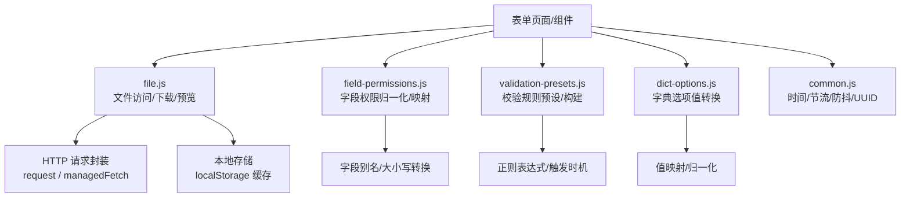
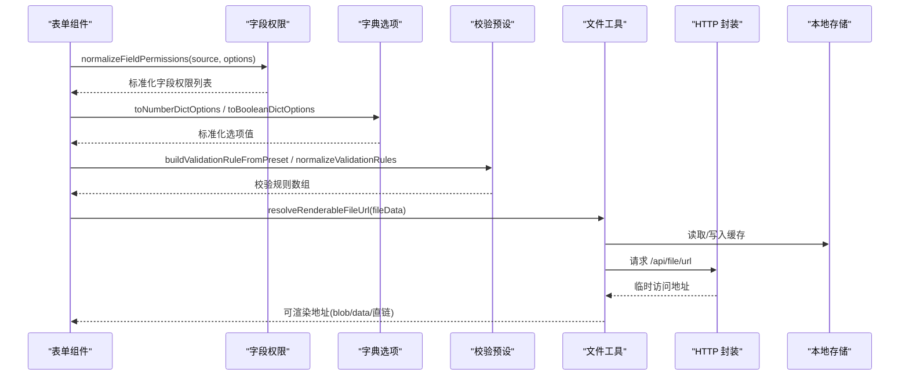
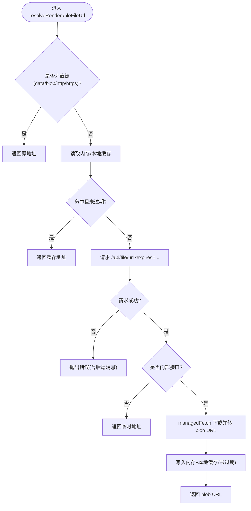
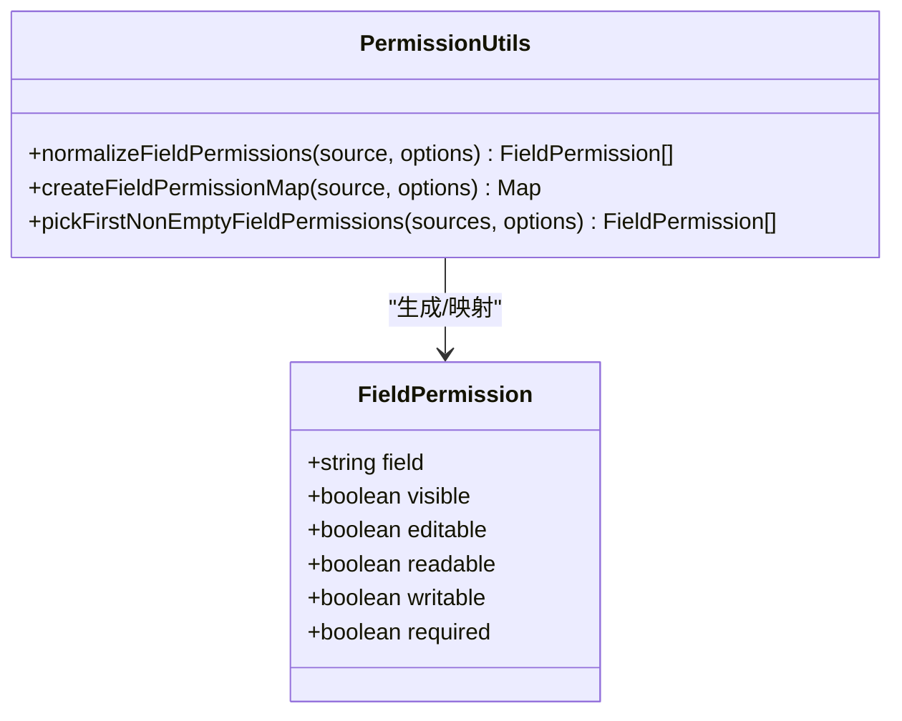
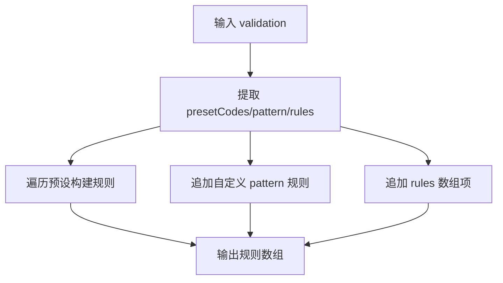
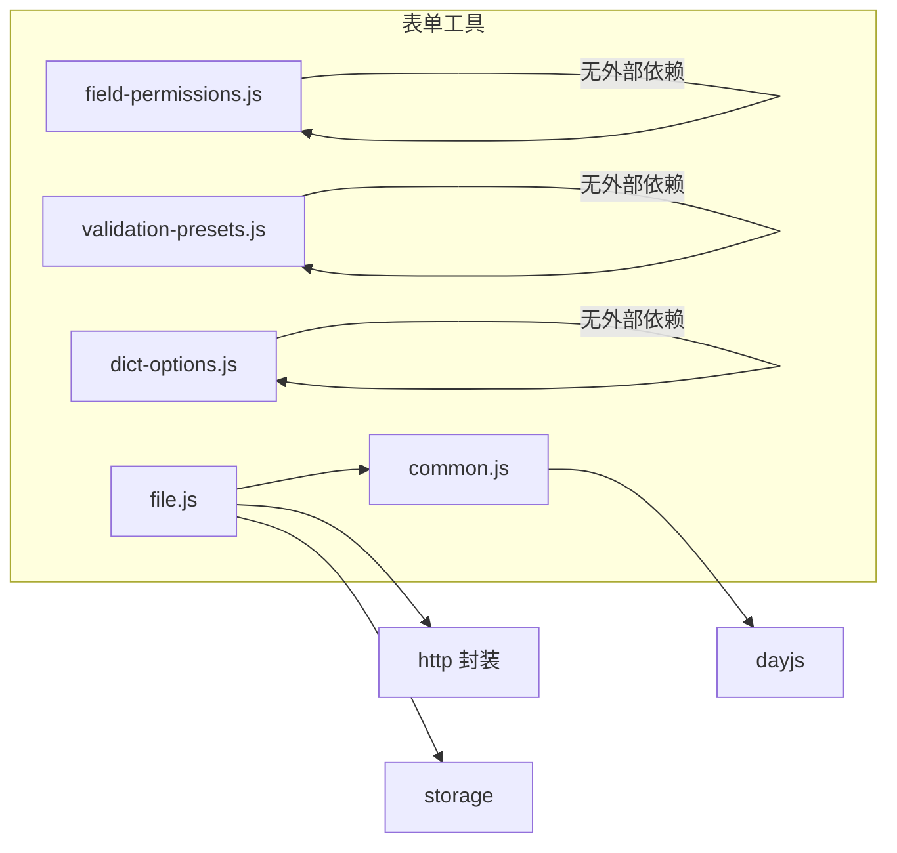

# 表单工具函数

<cite>
**本文引用的文件**
- [file.js](file://forge-admin-ui/src/utils/file.js)
- [field-permissions.js](file://forge-admin-ui/src/utils/field-permissions.js)
- [validation-presets.js](file://forge-admin-ui/src/utils/validation-presets.js)
- [dict-options.js](file://forge-admin-ui/src/utils/dict-options.js)
- [common.js](file://forge-admin-ui/src/utils/common.js)
- [index.js](file://forge-admin-ui/src/utils/index.js)
</cite>

## 目录
1. [简介](#简介)
2. [项目结构](#项目结构)
3. [核心组件](#核心组件)
4. [架构总览](#架构总览)
5. [详细组件分析](#详细组件分析)
6. [依赖关系分析](#依赖关系分析)
7. [性能考虑](#性能考虑)
8. [故障排查指南](#故障排查指南)
9. [结论](#结论)
10. [附录](#附录)

## 简介
本文件面向表单开发中的通用工具能力，聚焦以下四类能力：
- 字段类型转换与校验：字典选项值归一化、常见格式校验规则预设。
- 文件渲染与下载：统一获取可访问地址、图片预览、安全下载、缓存策略。
- 导入导出：基于文件工具链的下载与文件名解析（结合后端返回头）。
- 记录选择：通过字段权限与可见性控制，辅助筛选可编辑/可见字段集合。

文档提供参数说明、返回值约定、处理流程、常见问题与优化建议，并给出可直接定位的代码片段路径。

## 项目结构
表单工具函数主要位于前端 utils 目录，按职责拆分为多个模块：
- 文件工具：file.js
- 字段权限：field-permissions.js
- 校验预设：validation-presets.js
- 字典选项：dict-options.js
- 通用工具：common.js（时间格式化、节流防抖、UUID 等）
- 统一导出：utils/index.js（按需聚合导出）

图表来源
- [file.js:1-360](file://forge-admin-ui/src/utils/file.js#L1-L360)
- [field-permissions.js:1-146](file://forge-admin-ui/src/utils/field-permissions.js#L1-L146)
- [validation-presets.js:1-115](file://forge-admin-ui/src/utils/validation-presets.js#L1-L115)
- [dict-options.js:1-38](file://forge-admin-ui/src/utils/dict-options.js#L1-L38)
- [common.js:1-117](file://forge-admin-ui/src/utils/common.js#L1-L117)

章节来源
- [index.js:1-15](file://forge-admin-ui/src/utils/index.js#L1-L15)

## 核心组件
- 文件工具（file.js）
  - 获取文件访问 URL、下载 URL、图片预览 URL
  - 解析可渲染地址（内部接口转 blob URL）、安全下载
  - 内存+本地双级缓存，支持过期与强制刷新
- 字段权限（field-permissions.js）
  - 多源字段权限归一化，生成 visible/editable/readable/writable/required
  - 构建字段到权限的 Map，支持 snake_case/camelCase 别名
  - 多源合并取首个非空结果
- 校验预设（validation-presets.js）
  - 内置常用格式（手机号、邮箱、身份证、银行卡、固话、统一社会信用代码、整数、非负数、网址）
  - 从预设构建校验规则，规范化规则对象，字符串正则转 RegExp
- 字典选项（dict-options.js）
  - 将选项 value 转换为 number/boolean
  - 值映射与归一化，兼容多种输入形态
- 通用工具（common.js）
  - 时间格式化、节流/防抖、sleep、ResizeObserver、JSON 解析判断、UUID

章节来源
- [file.js:1-360](file://forge-admin-ui/src/utils/file.js#L1-L360)
- [field-permissions.js:1-146](file://forge-admin-ui/src/utils/field-permissions.js#L1-L146)
- [validation-presets.js:1-115](file://forge-admin-ui/src/utils/validation-presets.js#L1-L115)
- [dict-options.js:1-38](file://forge-admin-ui/src/utils/dict-options.js#L1-L38)
- [common.js:1-117](file://forge-admin-ui/src/utils/common.js#L1-L117)

## 架构总览
表单工具以“数据归一化 + 资源访问”为主线：
- 数据层：字段权限、字典选项、校验规则统一归一化，确保上层组件拿到稳定结构。
- 资源层：文件访问地址解析、缓存、下载、预览，屏蔽前后端差异与安全细节。
- 调用层：组件通过 utils/index.js 统一导入，减少耦合。

图表来源
- [field-permissions.js:1-146](file://forge-admin-ui/src/utils/field-permissions.js#L1-L146)
- [dict-options.js:1-38](file://forge-admin-ui/src/utils/dict-options.js#L1-L38)
- [validation-presets.js:1-115](file://forge-admin-ui/src/utils/validation-presets.js#L1-L115)
- [file.js:1-360](file://forge-admin-ui/src/utils/file.js#L1-L360)

## 详细组件分析

### 文件工具（file.js）
- 关键能力
  - getFileUrl：支持 fileId、filePath、accessUrl 三种输入，自动补全前缀或走下载接口。
  - getFileDownloadUrl：构造标准下载链接。
  - resolveFileAccessUrl：优先直链，否则查询临时访问地址；支持过期时间与强制刷新；内存+本地双重缓存。
  - resolveRenderableFileUrl：对内部接口进行鉴权下载并转为 blob URL，便于 img/video 直接渲染。
  - downloadFile：统一下载入口，自动解析文件名（Content-Disposition），清理临时 URL。
  - getImageUrl：为图片地址追加 width/height/mode 参数，实现服务端裁剪缩放。
- 参数与返回
  - fileData：string | object；object 支持 { fileId, filePath, accessUrl }
  - expires：临时地址有效期（秒）
  - forceRefresh：是否强制刷新缓存
  - 返回：URL 字符串或 Promise<string>
- 处理逻辑要点
  - 直链识别：http/https/data/blob 直接返回
  - 内部接口识别：/api/file/* 走鉴权下载或临时地址
  - 缓存策略：内存 Map + localStorage，带过期时间，定期清理
  - 错误处理：网络失败抛错，包含后端消息

图表来源
- [file.js:194-276](file://forge-admin-ui/src/utils/file.js#L194-L276)

章节来源
- [file.js:1-360](file://forge-admin-ui/src/utils/file.js#L1-L360)

### 字段权限（field-permissions.js）
- 关键能力
  - normalizeFieldPermissions：将多种来源（数组、对象、JSON 字符串）归一化为统一结构，计算 visible/editable/readable/writable/required。
  - createFieldPermissionMap：构建 field -> permission 的 Map，支持 snake_case/camelCase 别名。
  - pickFirstNonEmptyFieldPermissions：多源合并，返回第一个非空结果。
- 参数与返回
  - source：string | array | object
  - options：{ readOnly?: boolean }
  - 返回：标准化权限数组或 Map
- 处理逻辑要点
  - 兼容多种字段标识：field/fieldCode/code/name
  - 布尔值宽松解析：true/false/1/0/yes/no/y/n
  - 必填推导：writable && required

图表来源
- [field-permissions.js:1-146](file://forge-admin-ui/src/utils/field-permissions.js#L1-L146)

章节来源
- [field-permissions.js:1-146](file://forge-admin-ui/src/utils/field-permissions.js#L1-L146)

### 校验预设（validation-presets.js）
- 关键能力
  - COMMON_VALIDATION_PRESETS：内置常用格式的正则与提示文案
  - getValidationPreset/buildValidationRuleFromPreset：根据预设码构建校验规则
  - normalizeValidationRules：合并 presetCodes/pattern/rules 为统一规则数组
  - normalizeRulePattern：将字符串正则转为 RegExp，异常时剔除
- 参数与返回
  - value：预设码或配置对象
  - patch：覆盖 message/trigger 等
  - 返回：规则对象或规则数组
- 使用建议
  - 优先使用预设保证一致性
  - 自定义 pattern 时注意触发时机与提示信息

图表来源
- [validation-presets.js:1-115](file://forge-admin-ui/src/utils/validation-presets.js#L1-L115)

章节来源
- [validation-presets.js:1-115](file://forge-admin-ui/src/utils/validation-presets.js#L1-L115)

### 字典选项（dict-options.js）
- 关键能力
  - toNumberDictOptions：将选项 value 转为数字
  - toBooleanDictOptions：将选项 value 转为布尔（兼容 '1'/'true'）
  - mapDictOptionValues：按映射表替换 value
  - normalizeDictOptionValue：在给定选项中校验值合法性，非法时回退
- 参数与返回
  - options：数组
  - value/valueMap/fallback：值、映射表、回退值
  - 返回：标准化后的选项数组或值
- 使用建议
  - 下拉/单选等场景统一用这些方法归一化，避免类型不一致导致提交问题

章节来源
- [dict-options.js:1-38](file://forge-admin-ui/src/utils/dict-options.js#L1-L38)

### 通用工具（common.js）
- 关键能力
  - formatDateTime/formatDate：时间格式化
  - throttle/debounce：节流/防抖
  - sleep：异步等待
  - useResize：监听元素尺寸变化
  - canParseToJson/generateUUID：JSON 解析判断与 UUID 生成
- 使用建议
  - 表单搜索、输入框变更等高频事件优先使用防抖
  - 列表滚动/窗口 resize 使用节流

章节来源
- [common.js:1-117](file://forge-admin-ui/src/utils/common.js#L1-L117)

## 依赖关系分析
- file.js 依赖
  - http 请求封装：request / managedFetch
  - 本地存储：getLocalStorage/setLocalStorage
  - 通用工具：generateUUID
- field-permissions.js 无外部依赖，纯数据处理
- validation-presets.js 无外部依赖，纯数据处理
- dict-options.js 无外部依赖，纯数据处理
- common.js 依赖 dayjs（仅用于时间格式化）

图表来源
- [file.js:1-360](file://forge-admin-ui/src/utils/file.js#L1-L360)
- [field-permissions.js:1-146](file://forge-admin-ui/src/utils/field-permissions.js#L1-L146)
- [validation-presets.js:1-115](file://forge-admin-ui/src/utils/validation-presets.js#L1-L115)
- [dict-options.js:1-38](file://forge-admin-ui/src/utils/dict-options.js#L1-L38)
- [common.js:1-117](file://forge-admin-ui/src/utils/common.js#L1-L117)

章节来源
- [index.js:1-15](file://forge-admin-ui/src/utils/index.js#L1-L15)

## 性能考虑
- 文件访问缓存
  - 使用内存 Map + localStorage 两级缓存，降低重复请求
  - 设置合理过期时间，避免长期占用本地存储
  - 图片加载失败时可强制刷新，清除旧缓存后重试
- 批量操作
  - 大量图片渲染时，优先使用 resolveRenderableFileUrl 转为 blob URL，减少跨域与鉴权开销
  - 下载完成后及时 revokeObjectURL，释放内存
- 字段权限与字典
  - 权限归一化与字典转换在初始化阶段完成，避免每次渲染重复计算
  - 使用 Map 索引字段权限，O(1) 查找
- 校验规则
  - 预编译正则，避免重复创建 RegExp
  - 合理使用 trigger，减少频繁校验

[本节为通用指导，不直接分析具体文件]

## 故障排查指南
- 文件无法显示
  - 检查是否为内部接口路径，必要时使用 resolveRenderableFileUrl 获取可渲染地址
  - 确认前端代理前缀配置正确，避免相对路径被解析到站点根路径
  - 若图片加载失败，尝试 forceRefresh 重新获取临时地址
- 下载失败或文件名乱码
  - 检查后端 Content-Disposition 是否正确携带 filename*
  - 确认网络响应状态码，捕获并展示后端错误信息
- 字段不可见/不可编辑
  - 使用 normalizeFieldPermissions 查看最终 visible/editable 状态
  - 检查传入 source 的字段名是否匹配（支持 snake_case/camelCase 别名）
- 校验不生效
  - 使用 normalizeValidationRules 将预设与自定义规则合并
  - 检查 pattern 是否为合法正则，必要时使用 normalizeRulePattern 转换

章节来源
- [file.js:194-331](file://forge-admin-ui/src/utils/file.js#L194-L331)
- [field-permissions.js:1-146](file://forge-admin-ui/src/utils/field-permissions.js#L1-L146)
- [validation-presets.js:75-107](file://forge-admin-ui/src/utils/validation-presets.js#L75-L107)

## 结论
表单工具函数围绕“数据归一化”和“资源访问”两大主题，提供了稳定、可复用、易扩展的能力集。通过统一的字段权限、字典选项与校验预设，以及健壮的文件的访问/下载/预览机制，显著降低了表单开发的复杂度与出错概率。建议在项目中广泛采用这些工具，并结合业务场景进行适度封装与扩展。

[本节为总结性内容，不直接分析具体文件]

## 附录
- 快速参考
  - 文件访问：getFileUrl / getFileDownloadUrl / resolveFileAccessUrl / resolveRenderableFileUrl / downloadFile / getImageUrl
  - 字段权限：normalizeFieldPermissions / createFieldPermissionMap / pickFirstNonEmptyFieldPermissions
  - 校验预设：getValidationPreset / buildValidationRuleFromPreset / normalizeValidationRules / normalizeRulePattern
  - 字典选项：toNumberDictOptions / toBooleanDictOptions / mapDictOptionValues / normalizeDictOptionValue
  - 通用工具：formatDateTime / formatDate / throttle / debounce / sleep / generateUUID

章节来源
- [file.js:1-360](file://forge-admin-ui/src/utils/file.js#L1-L360)
- [field-permissions.js:1-146](file://forge-admin-ui/src/utils/field-permissions.js#L1-L146)
- [validation-presets.js:1-115](file://forge-admin-ui/src/utils/validation-presets.js#L1-L115)
- [dict-options.js:1-38](file://forge-admin-ui/src/utils/dict-options.js#L1-L38)
- [common.js:1-117](file://forge-admin-ui/src/utils/common.js#L1-L117)