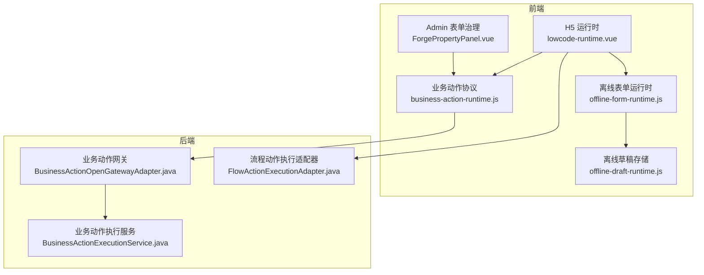
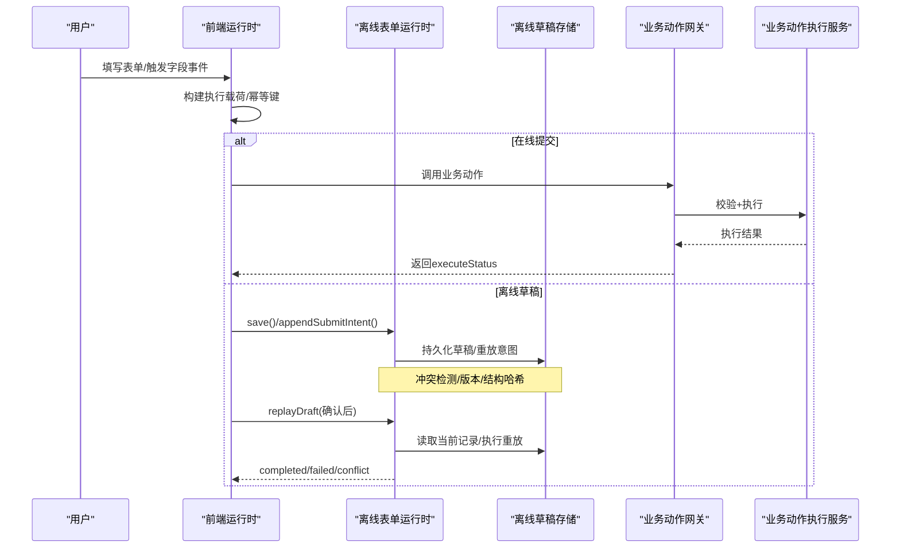
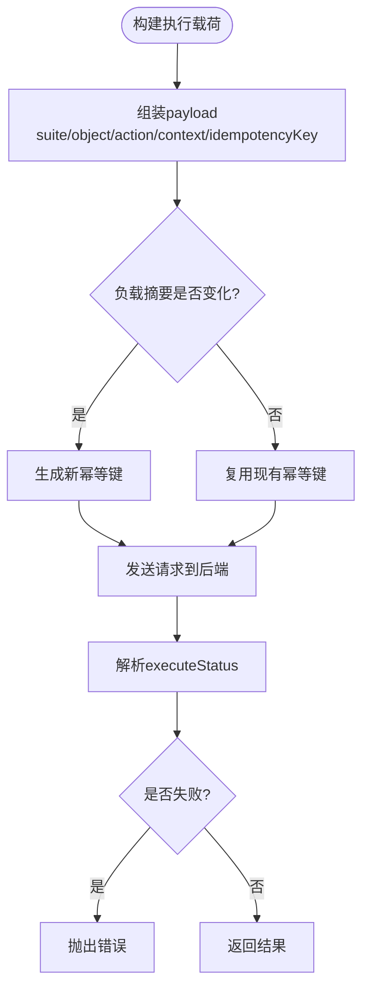
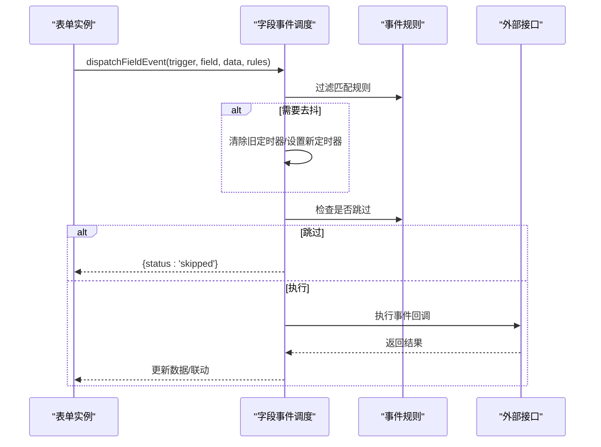
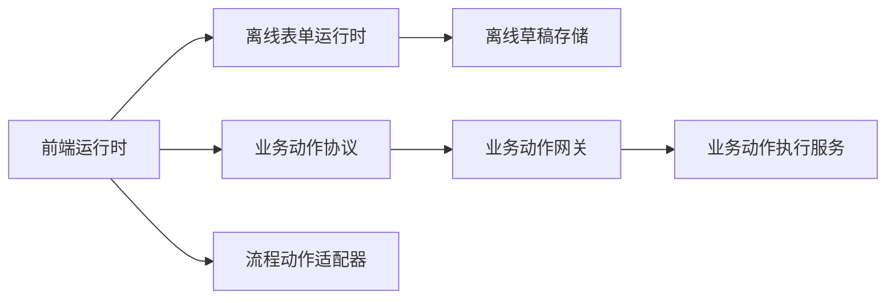

# 表单运行时

<cite>
**本文引用的文件**
- [offline-form-runtime.js](file://forge-admin-ui/src/components/ai-form/offline-form-runtime.js)
- [offline-draft-runtime.js](file://forge-admin-ui/src/utils/offline-draft-runtime.js)
- [business-action-runtime.js](file://forge-admin-ui/src/components/ai-form/business-action-runtime.js)
- [lowcode-runtime.vue](file://forge-h5-ui/src/pages/lowcode-runtime.vue)
- [crud-page.vue](file://forge-admin-ui/src/views/ai/crud-page.vue)
- [ForgePropertyPanel.vue](file://forge-admin-ui/src/views/app-center/components/designer/forge-form-designer/ForgePropertyPanel.vue)
- [field-linkage-config.js](file://forge-admin-ui/src/views/app-center/components/designer/form-first/field-linkage-config.js)
- [BusinessActionOpenGatewayAdapter.java](file://forge-server/forge-framework/forge-plugin-parent/forge-plugin-capability-parent/forge-plugin-capability-actions/src/main/java/com/mdframe/forge/plugin/capability/secureaction/gateway/BusinessActionOpenGatewayAdapter.java)
- [FlowActionExecutionAdapter.java](file://forge-server/forge-framework/forge-plugin-parent/forge-plugin-capability-parent/forge-plugin-capability-actions/src/main/java/com/mdframe/forge/plugin/capability/flowaction/service/FlowActionExecutionAdapter.java)
- [BusinessActionExecutionService.java](file://forge-server/forge-framework/forge-plugin-parent/forge-plugin-generator/src/main/java/com/mdframe/forge/plugin/generator/service/businessapp/BusinessActionExecutionService.java)
</cite>

## 目录
1. [简介](#简介)
2. [项目结构](#项目结构)
3. [核心组件](#核心组件)
4. [架构总览](#架构总览)
5. [详细组件分析](#详细组件分析)
6. [依赖关系分析](#依赖关系分析)
7. [性能考虑](#性能考虑)
8. [故障排查指南](#故障排查指南)
9. [结论](#结论)
10. [附录](#附录)

## 简介
本文件面向“表单运行时”的完整工作机制，覆盖以下主题：
- 业务动作运行时：前端如何构造执行载荷、幂等键与上下文，后端如何校验、执行并返回结果。
- 字段事件运行时：表单加载、字段变更等事件的触发、去抖、作用域隔离与执行调度。
- 离线表单运行：草稿存储、重放意图、冲突检测、版本与结构一致性校验、重试与失败处理。
- 表单生命周期管理：beforeLoad/afterLoad/beforeSubmit/afterSubmit 钩子与渲染/提交流程。
- 数据同步策略：本地草稿与远端记录的一致性保障、并发冲突与发布版本/结构变更的处理。
- 复杂场景示例：表单联动、数据校验、异步提交、子行动作、流程集成等。

## 项目结构
围绕表单运行时，代码主要分布在以下模块：
- 前端 H5 运行时：低代码页面运行时负责字段事件调度、底部动作与子行交互。
- 前端 Admin UI：表单治理配置（事件、字段联动、离线草稿）、业务动作协议工具。
- 服务端能力：业务动作网关与执行服务、流程动作执行适配器等。



图表来源
- [lowcode-runtime.vue:709-737](file://forge-h5-ui/src/pages/lowcode-runtime.vue#L709-L737)
- [business-action-runtime.js:115-145](file://forge-admin-ui/src/components/ai-form/business-action-runtime.js#L115-L145)
- [offline-form-runtime.js:33-99](file://forge-admin-ui/src/components/ai-form/offline-form-runtime.js#L33-L99)
- [offline-draft-runtime.js:44-313](file://forge-admin-ui/src/utils/offline-draft-runtime.js#L44-L313)
- [BusinessActionOpenGatewayAdapter.java:103-135](file://forge-server/forge-framework/forge-plugin-parent/forge-plugin-capability-parent/forge-plugin-capability-actions/src/main/java/com/mdframe/forge/plugin/capability/secureaction/gateway/BusinessActionOpenGatewayAdapter.java#L103-L135)
- [FlowActionExecutionAdapter.java:168-193](file://forge-server/forge-framework/forge-plugin-parent/forge-plugin-capability-parent/forge-plugin-capability-actions/src/main/java/com/mdframe/forge/plugin/capability/flowaction/service/FlowActionExecutionAdapter.java#L168-L193)
- [BusinessActionExecutionService.java:99-124](file://forge-server/forge-framework/forge-plugin-parent/forge-plugin-generator/src/main/java/com/mdframe/forge/plugin/generator/service/businessapp/BusinessActionExecutionService.java#L99-L124)

章节来源
- [lowcode-runtime.vue:709-737](file://forge-h5-ui/src/pages/lowcode-runtime.vue#L709-L737)
- [business-action-runtime.js:115-145](file://forge-admin-ui/src/components/ai-form/business-action-runtime.js#L115-L145)
- [offline-form-runtime.js:33-99](file://forge-admin-ui/src/components/ai-form/offline-form-runtime.js#L33-L99)
- [offline-draft-runtime.js:44-313](file://forge-admin-ui/src/utils/offline-draft-runtime.js#L44-L313)

## 核心组件
- 业务动作运行时：负责将表单数据转换为统一执行载荷，生成幂等键，封装上下文（路由参数、父子记录标识），并解析后端返回状态。
- 字段事件运行时：按触发类型过滤规则、计算作用域、支持去抖与跳过策略，批量调度事件执行。
- 离线表单运行时：基于配置创建命名空间与草稿存储，提供保存草稿、追加重放意图、查找活跃草稿等能力。
- 离线草稿存储：实现草稿持久化、索引维护、重放日志、冲突检测、容量限制与安全清洗。
- 表单治理配置：在表单设计器中配置事件、字段联动与离线草稿开关、重放动作码等。

章节来源
- [business-action-runtime.js:115-145](file://forge-admin-ui/src/components/ai-form/business-action-runtime.js#L115-L145)
- [lowcode-runtime.vue:709-737](file://forge-h5-ui/src/pages/lowcode-runtime.vue#L709-L737)
- [offline-form-runtime.js:14-31](file://forge-admin-ui/src/components/ai-form/offline-form-runtime.js#L14-L31)
- [offline-draft-runtime.js:29-42](file://forge-admin-ui/src/utils/offline-draft-runtime.js#L29-L42)
- [ForgePropertyPanel.vue:4527-4539](file://forge-admin-ui/src/views/app-center/components/designer/forge-form-designer/ForgePropertyPanel.vue#L4527-L4539)

## 架构总览
表单运行时由“前端事件与动作层 + 离线草稿层 + 后端动作执行层”组成。前端通过字段事件驱动联动与校验，通过业务动作协议调用后端；离线模式在本地持久化草稿并重放提交；后端对动作进行鉴权、幂等与事务控制，必要时启动流程。



图表来源
- [business-action-runtime.js:115-145](file://forge-admin-ui/src/components/ai-form/business-action-runtime.js#L115-L145)
- [BusinessActionOpenGatewayAdapter.java:103-135](file://forge-server/forge-framework/forge-plugin-parent/forge-plugin-capability-parent/forge-plugin-capability-actions/src/main/java/com/mdframe/forge/plugin/capability/secureaction/gateway/BusinessActionOpenGatewayAdapter.java#L103-L135)
- [offline-form-runtime.js:33-99](file://forge-admin-ui/src/components/ai-form/offline-form-runtime.js#L33-L99)
- [offline-draft-runtime.js:121-215](file://forge-admin-ui/src/utils/offline-draft-runtime.js#L121-L215)

## 详细组件分析

### 业务动作运行时
- 载荷构建：将 action、objectCode、recordId、formData、routeQuery、parent/child/relation 等组装为统一 payload，并携带幂等键。
- 幂等键策略：优先复用已有键，当负载摘要变化时自动轮换，避免重复提交。
- 结果解析：根据 executeStatus 判断成功或抛出错误，便于上层统一处理。
- 显示条件：支持结构化表达式与文本表达式，用于按钮显隐与流程动作隐藏逻辑。



图表来源
- [business-action-runtime.js:92-113](file://forge-admin-ui/src/components/ai-form/business-action-runtime.js#L92-L113)
- [business-action-runtime.js:115-154](file://forge-admin-ui/src/components/ai-form/business-action-runtime.js#L115-L154)

章节来源
- [business-action-runtime.js:92-154](file://forge-admin-ui/src/components/ai-form/business-action-runtime.js#L92-L154)
- [business-action-runtime.js:174-203](file://forge-admin-ui/src/components/ai-form/business-action-runtime.js#L174-L203)
- [business-action-runtime.js:205-310](file://forge-admin-ui/src/components/ai-form/business-action-runtime.js#L205-L310)

### 字段事件运行时
- 事件过滤：按 trigger（如 FORM_LOAD、CHANGE）与 sourceField 筛选规则。
- 作用域：主表与子行分别以 modelCode 与行级范围隔离，避免跨行污染。
- 去抖：CHANGE 事件支持可配置的 debounceMs，同一 key 的多次触发合并为一次执行。
- 跳过策略：满足条件的事件可直接跳过并清理目标字段值，减少无效网络请求。



图表来源
- [lowcode-runtime.vue:709-737](file://forge-h5-ui/src/pages/lowcode-runtime.vue#L709-L737)

章节来源
- [lowcode-runtime.vue:709-737](file://forge-h5-ui/src/pages/lowcode-runtime.vue#L709-L737)

### 离线表单运行
- 配置归一化：启用开关、应用/对象/表单标识、发布版本、结构哈希、重放动作码、记录版本字段、草稿数量与大小上限。
- 命名空间：基于租户、用户、应用、对象、表单构建唯一存储前缀，避免多环境串扰。
- 草稿保存：安全清洗数据、写入 index、限制最大草稿数与字节数。
- 重放意图：仅当配置了 replayActionCode 时才允许追加；支持幂等键去重。
- 冲突检测：比较发布版本、结构哈希、记录版本，阻止不一致的重放。
- 重放执行：确认后才执行；逐项标记 RUNNING/COMPLETED/FAILED，最终汇总状态。

```mermaid
classDiagram
class OfflineFormRuntime {
+config
+namespace
+store
+findDraft(recordId)
+save({draftId,data,recordId,baseRecordVersion})
+appendSubmitIntent(draftId,input)
}
class OfflineDraftStore {
+saveDraft(input)
+getDraft(draftId)
+listDrafts()
+removeDraft(draftId)
+appendReplayIntent(draftId,input)
+replayDraft(draftId,replayOptions)
}
OfflineFormRuntime --> OfflineDraftStore : "使用"
```

图表来源
- [offline-form-runtime.js:14-31](file://forge-admin-ui/src/components/ai-form/offline-form-runtime.js#L14-L31)
- [offline-form-runtime.js:33-99](file://forge-admin-ui/src/components/ai-form/offline-form-runtime.js#L33-L99)
- [offline-draft-runtime.js:44-313](file://forge-admin-ui/src/utils/offline-draft-runtime.js#L44-L313)

章节来源
- [offline-form-runtime.js:14-31](file://forge-admin-ui/src/components/ai-form/offline-form-runtime.js#L14-L31)
- [offline-form-runtime.js:33-99](file://forge-admin-ui/src/components/ai-form/offline-form-runtime.js#L33-L99)
- [offline-draft-runtime.js:44-313](file://forge-admin-ui/src/utils/offline-draft-runtime.js#L44-L313)
- [offline-draft-runtime.js:315-331](file://forge-admin-ui/src/utils/offline-draft-runtime.js#L315-L331)

### 表单生命周期管理
- 钩子映射：beforeLoad/afterLoad 映射为 beforeRenderForm；beforeSubmit/afterSubmit 直接对应提交前后。
- 处理器构建：将事件列表聚合为按钩子分组的处理器，供渲染与提交流程调用。
- 典型用法：
  - beforeRenderForm：预取字典、初始化默认值、权限相关数据。
  - beforeSubmit：数据校验、联动计算、附加上下文。
  - afterSubmit：跳转、提示、刷新列表或触发后续流程。

章节来源
- [crud-page.vue:1250-1271](file://forge-admin-ui/src/views/ai/crud-page.vue#L1250-L1271)
- [ForgePropertyPanel.vue:5997-6010](file://forge-admin-ui/src/views/app-center/components/designer/forge-form-designer/ForgePropertyPanel.vue#L5997-L6010)

### 数据同步策略
- 在线同步：前端构建统一载荷，后端校验权限与定义，执行后返回状态；流程动作在特定 actionCode 下创建记录并启动流程。
- 离线同步：本地草稿持久化，重放前进行冲突检测；成功后清理失败状态，失败则保留重试入口。
- 幂等性：前端生成幂等键，后端通过 idempotencyKey 保证重复提交不产生副作用。

章节来源
- [BusinessActionOpenGatewayAdapter.java:103-135](file://forge-server/forge-framework/forge-plugin-parent/forge-plugin-capability-parent/forge-plugin-capability-actions/src/main/java/com/mdframe/forge/plugin/capability/secureaction/gateway/BusinessActionOpenGatewayAdapter.java#L103-L135)
- [FlowActionExecutionAdapter.java:168-193](file://forge-server/forge-framework/forge-plugin-parent/forge-plugin-capability-parent/forge-plugin-capability-actions/src/main/java/com/mdframe/forge/plugin/capability/flowaction/service/FlowActionExecutionAdapter.java#L168-L193)
- [BusinessActionExecutionService.java:99-124](file://forge-server/forge-framework/forge-plugin-parent/forge-plugin-generator/src/main/java/com/mdframe/forge/plugin/generator/service/businessapp/BusinessActionExecutionService.java#L99-L124)
- [offline-draft-runtime.js:121-215](file://forge-admin-ui/src/utils/offline-draft-runtime.js#L121-L215)

### 复杂业务场景示例
- 表单联动：通过字段联动规则（如字典联动、对象引用）在运行时动态修改目标字段值。
- 数据校验：在 beforeSubmit 钩子中集中校验必填、格式、业务约束，失败则阻断提交。
- 异步提交：使用业务动作执行，结合幂等键与错误处理，支持长耗时任务与重试。
- 子行动作：为明细行绑定动作，传递 parent/child/relation 上下文，确保操作作用于正确记录。
- 流程集成：在提交或特定动作中启动业务流程，并在详情中展示流程时间线。

章节来源
- [field-linkage-config.js:1-35](file://forge-admin-ui/src/views/app-center/components/designer/form-first/field-linkage-config.js#L1-L35)
- [business-action-runtime.js:156-168](file://forge-admin-ui/src/components/ai-form/business-action-runtime.js#L156-L168)
- [crud-page.vue:1250-1271](file://forge-admin-ui/src/views/ai/crud-page.vue#L1250-L1271)

## 依赖关系分析
- 前端内部依赖：
  - lowcode-runtime.vue 依赖字段事件调度与底部动作处理。
  - business-action-runtime.js 提供统一的载荷构建与结果解析。
  - offline-form-runtime.js 依赖 offline-draft-runtime.js 完成草稿与重放。
- 前后端契约：
  - 前端通过 suiteCode/objectCode/actionCode/formData/idempotencyKey 等字段与后端交互。
  - 后端 BusinessActionOpenGatewayAdapter 负责校验与转发，BusinessActionExecutionService 负责执行与日志。
  - FlowActionExecutionAdapter 在特定动作下创建记录并启动流程。



图表来源
- [business-action-runtime.js:115-145](file://forge-admin-ui/src/components/ai-form/business-action-runtime.js#L115-L145)
- [offline-form-runtime.js:33-99](file://forge-admin-ui/src/components/ai-form/offline-form-runtime.js#L33-L99)
- [BusinessActionOpenGatewayAdapter.java:103-135](file://forge-server/forge-framework/forge-plugin-parent/forge-plugin-capability-parent/forge-plugin-capability-actions/src/main/java/com/mdframe/forge/plugin/capability/secureaction/gateway/BusinessActionOpenGatewayAdapter.java#L103-L135)
- [FlowActionExecutionAdapter.java:168-193](file://forge-server/forge-framework/forge-plugin-parent/forge-plugin-capability-parent/forge-plugin-capability-actions/src/main/java/com/mdframe/forge/plugin/capability/flowaction/service/FlowActionExecutionAdapter.java#L168-L193)

章节来源
- [business-action-runtime.js:115-145](file://forge-admin-ui/src/components/ai-form/business-action-runtime.js#L115-L145)
- [offline-form-runtime.js:33-99](file://forge-admin-ui/src/components/ai-form/offline-form-runtime.js#L33-L99)
- [BusinessActionOpenGatewayAdapter.java:103-135](file://forge-server/forge-framework/forge-plugin-parent/forge-plugin-capability-parent/forge-plugin-capability-actions/src/main/java/com/mdframe/forge/plugin/capability/secureaction/gateway/BusinessActionOpenGatewayAdapter.java#L103-L135)
- [FlowActionExecutionAdapter.java:168-193](file://forge-server/forge-framework/forge-plugin-parent/forge-plugin-capability-parent/forge-plugin-capability-actions/src/main/java/com/mdframe/forge/plugin/capability/flowaction/service/FlowActionExecutionAdapter.java#L168-L193)

## 性能考虑
- 字段事件去抖：CHANGE 事件支持 debounceMs，避免频繁网络请求。
- 草稿容量限制：maxDrafts 与 maxBytes 防止本地存储膨胀。
- 数据清洗：敏感字段过滤与深度限制，降低序列化与存储成本。
- 冲突检测前置：重放前对比发布版本、结构哈希与记录版本，减少无效执行。
- 批量调度：字段事件按规则并行调度，提升响应速度。

[本节为通用指导，无需具体文件引用]

## 故障排查指南
- 草稿不存在：检查 draftId 是否有效，或是否已被清理。
- 草稿冲突：当 publishedVersion/schemaHash/recordVersion 不一致时，需重新加载表单后再重放。
- 重放不可用：缺少 loadCurrent 或 execute 回调，或无法读取最新记录。
- 重放失败：查看 replayLog 中的 failureMessage，定位具体步骤失败原因。
- 动作执行失败：根据 executeStatus 与 message 调整输入或权限配置。

章节来源
- [offline-draft-runtime.js:121-215](file://forge-admin-ui/src/utils/offline-draft-runtime.js#L121-L215)
- [offline-draft-runtime.js:315-331](file://forge-admin-ui/src/utils/offline-draft-runtime.js#L315-L331)
- [business-action-runtime.js:147-154](file://forge-admin-ui/src/components/ai-form/business-action-runtime.js#L147-L154)

## 结论
表单运行时通过“事件驱动 + 离线草稿 + 统一动作协议”的组合，实现了高可用、可重放、强一致的表单体验。前端负责事件调度与载荷构建，后端负责权限校验、幂等执行与流程编排。离线模式通过严格的冲突检测与重放机制，保障弱网与断网场景下的数据一致性。

[本节为总结，无需具体文件引用]

## 附录
- 表单治理配置建议：
  - 启用离线草稿时，务必配置 replayActionCode 与 recordVersionField。
  - 合理设置 maxDrafts 与 maxBytes，避免存储空间耗尽。
  - 在 beforeSubmit 中集中校验，减少后端压力。
- 字段联动最佳实践：
  - 使用受控字段与最小化联动范围，避免循环联动。
  - 对大字典采用懒加载与缓存策略。
- 动作幂等性：
  - 始终传递稳定的 idempotencyKey，避免重复提交导致的数据异常。

[本节为补充说明，无需具体文件引用]