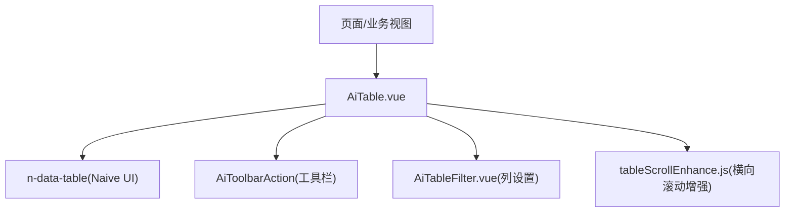
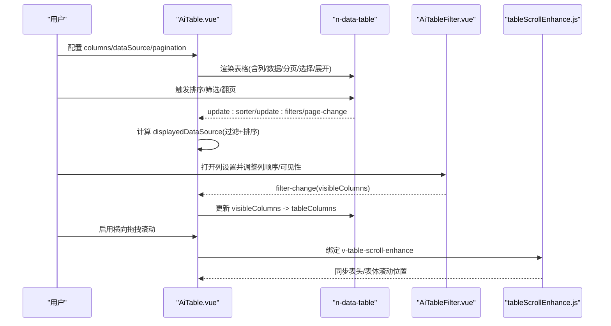
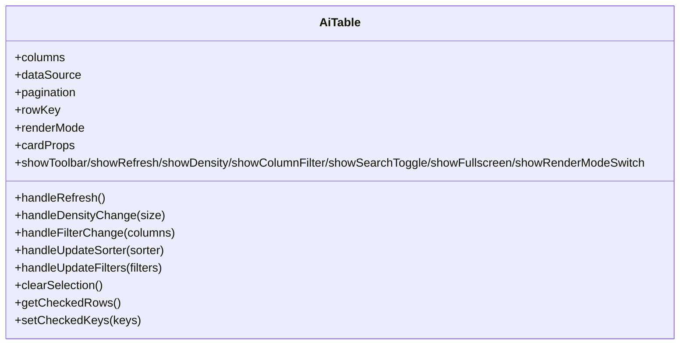
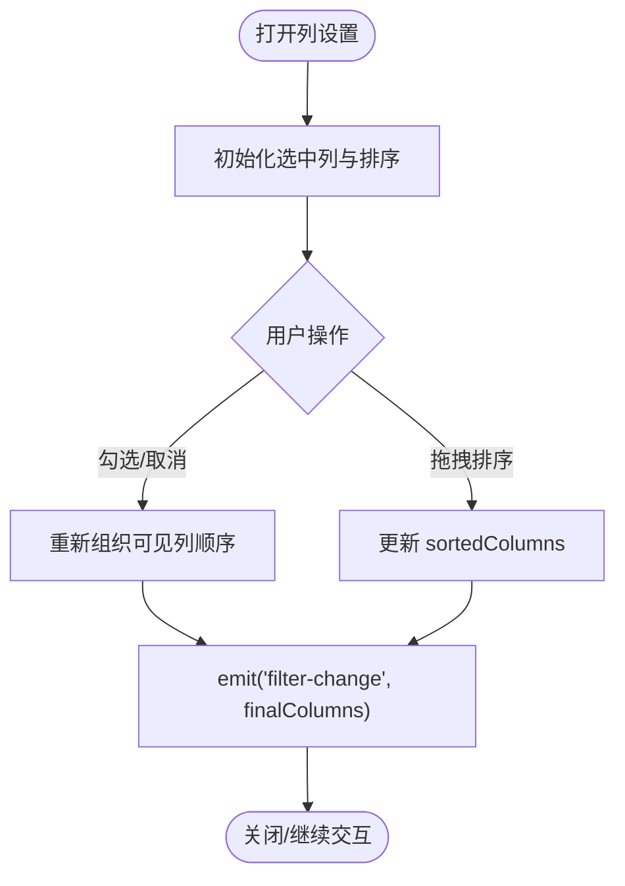
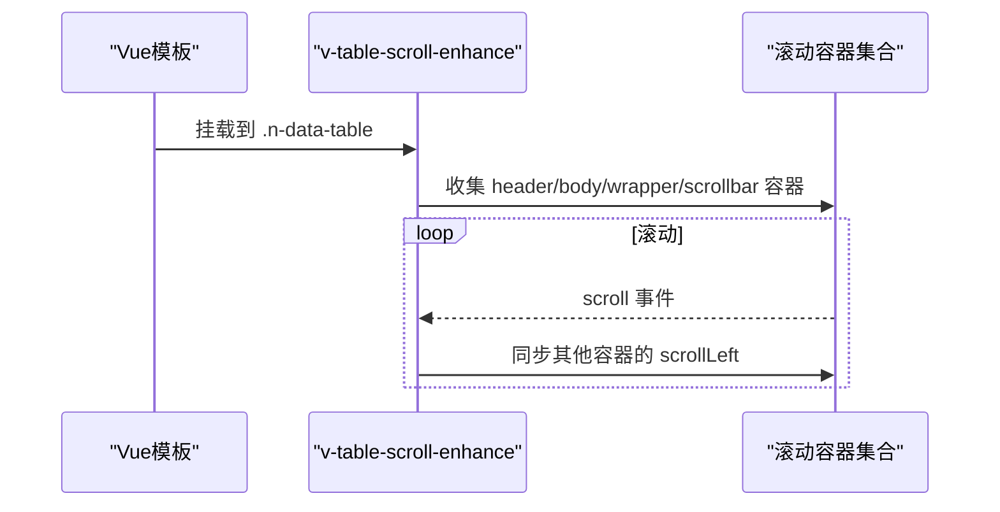
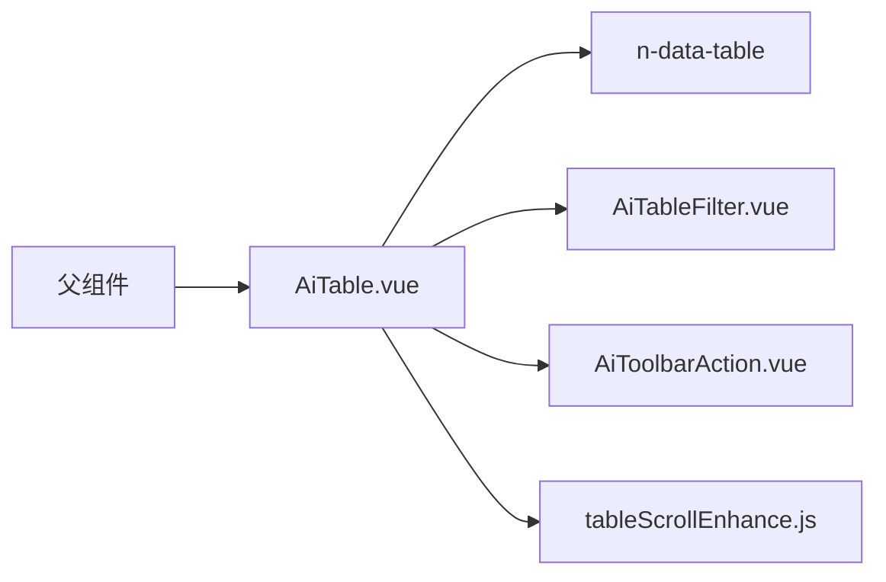

# 表格组件

<cite>
**本文引用的文件**
- [AiTable.vue](file://forge-admin-ui/src/components/ai-form/AiTable.vue)
- [AiTableFilter.vue](file://forge-admin-ui/src/components/ai-form/AiTableFilter.vue)
- [tableScrollEnhance.js](file://forge-admin-ui/src/directives/modules/tableScrollEnhance.js)
- [AiTable.spec.js](file://forge-admin-ui/src/components/ai-form/__tests__/AiTable.spec.js)
</cite>

## 目录
1. [简介](#简介)
2. [项目结构](#项目结构)
3. [核心组件与能力](#核心组件与能力)
4. [架构总览](#架构总览)
5. [详细组件分析](#详细组件分析)
6. [依赖关系分析](#依赖关系分析)
7. [性能与大数据处理](#性能与大数据处理)
8. [故障排查指南](#故障排查指南)
9. [结论](#结论)
10. [附录：常用配置与事件](#附录：常用配置与事件)

## 简介
本章节面向 AiTable 表格组件，系统性说明其高级能力：列配置、排序与筛选、行选择、渲染模式（列表/卡片）、工具栏集成、横向拖拽滚动增强等。同时给出复杂场景的实现思路（树形表格、可编辑表格、合并单元格）以及状态管理与性能优化建议。

## 项目结构
- 表格主组件：封装 Naive UI 的 n-data-table，提供统一的列解析、排序/筛选/分页/选择/渲染模式切换等能力。
- 列设置过滤器：支持列显示/隐藏与拖拽排序。
- 横向滚动增强指令：解决多容器水平滚动同步与交互冲突问题。
- 单元测试：覆盖选中行样式与居中渲染等关键行为。

图表来源
- [AiTable.vue:1-174](file://forge-admin-ui/src/components/ai-form/AiTable.vue#L1-L174)
- [tableScrollEnhance.js:1-414](file://forge-admin-ui/src/directives/modules/tableScrollEnhance.js#L1-L414)

章节来源
- [AiTable.vue:1-174](file://forge-admin-ui/src/components/ai-form/AiTable.vue#L1-L174)
- [AiTableFilter.vue:1-407](file://forge-admin-ui/src/components/ai-form/AiTableFilter.vue#L1-L407)
- [tableScrollEnhance.js:1-414](file://forge-admin-ui/src/directives/modules/tableScrollEnhance.js#L1-L414)

## 核心组件与能力
- 列配置与渲染
  - 支持 selection、expand、自定义 render/formatter/slot 等列类型。
  - 自动推断对齐方式、固定列、省略提示、排序与筛选开关。
  - 支持 action 列默认右固定与特殊样式。
- 排序与筛选
  - 内置比较器，支持数字与字符串本地化排序。
  - 列级 filter 函数或“default”自动推导；支持 and/or 多值组合。
  - 自动从数据源生成有限数量的筛选选项。
- 行选择与展开
  - 受控 checkedRowKeys 与 expandedRowKeys。
  - 卡片模式下点击行可选择（可选）。
- 渲染模式与工具栏
  - 列表/卡片两种模式，支持密度切换、刷新、全屏、列设置、搜索显隐等。
- 横向拖拽滚动增强
  - 通过指令 v-table-scroll-enhance 实现表头/表体/包装容器水平滚动同步，避免交互冲突。

章节来源
- [AiTable.vue:176-1074](file://forge-admin-ui/src/components/ai-form/AiTable.vue#L176-L1074)
- [AiTableFilter.vue:73-323](file://forge-admin-ui/src/components/ai-form/AiTableFilter.vue#L73-L323)
- [tableScrollEnhance.js:116-233](file://forge-admin-ui/src/directives/modules/tableScrollEnhance.js#L116-L233)

## 架构总览

图表来源
- [AiTable.vue:48-84](file://forge-admin-ui/src/components/ai-form/AiTable.vue#L48-L84)
- [AiTable.vue:660-693](file://forge-admin-ui/src/components/ai-form/AiTable.vue#L660-L693)
- [AiTableFilter.vue:246-288](file://forge-admin-ui/src/components/ai-form/AiTableFilter.vue#L246-L288)
- [tableScrollEnhance.js:173-187](file://forge-admin-ui/src/directives/modules/tableScrollEnhance.js#L173-L187)

## 详细组件分析

### AiTable 组件
- 列解析与渲染
  - 将原始列配置转换为 n-data-table 所需列定义，自动处理对齐、固定、省略、排序、筛选、插槽/格式化等。
  - 对 action 列进行识别与默认右固定，保证操作列始终在右侧。
- 数据展示与过滤
  - 基于 activeFilters 与 activeSorter 计算 displayedDataSource，先过滤再排序。
  - 支持 filterMode 为 'and'/'or' 的多值筛选逻辑。
- 行选择与展开
  - 维护 innerCheckedRowKeys，并与外部 checkedRowKeys 双向同步。
  - 暴露 clearSelection/getCheckedRows/setCheckedKeys 等方法。
- 渲染模式
  - 列表模式使用 n-data-table；卡片模式使用 NGrid 网格布局，支持标题字段、字段数量限制、点击选择等。
- 工具栏集成
  - 通过 AiToolbarAction 提供刷新、密度、列设置、搜索显隐、全屏、渲染模式切换等能力。
- 横向滚动增强
  - 通过 v-table-scroll-enhance 指令挂载，确保表头与表体水平滚动一致，且不影响内部交互元素。

图表来源
- [AiTable.vue:183-392](file://forge-admin-ui/src/components/ai-form/AiTable.vue#L183-L392)
- [AiTable.vue:901-1074](file://forge-admin-ui/src/components/ai-form/AiTable.vue#L901-L1074)

章节来源
- [AiTable.vue:528-638](file://forge-admin-ui/src/components/ai-form/AiTable.vue#L528-L638)
- [AiTable.vue:660-693](file://forge-admin-ui/src/components/ai-form/AiTable.vue#L660-L693)
- [AiTable.vue:802-839](file://forge-admin-ui/src/components/ai-form/AiTable.vue#L802-L839)
- [AiTable.vue:947-1074](file://forge-admin-ui/src/components/ai-form/AiTable.vue#L947-L1074)

### AiTableFilter 列设置
- 功能
  - 以 Popover 形式展示列勾选框，支持重置、拖拽排序、过滤不可见列（如 selection/action）。
  - 输出最终列顺序与可见性集合，供父组件更新 visibleColumns。
- 交互
  - 拖拽时更新 sortedColumns，并在 drop 后触发 column-order-change 与 filter-change。
- 暴露方法
  - reset/getCheckedColumns/setCheckedColumns。

图表来源
- [AiTableFilter.vue:133-166](file://forge-admin-ui/src/components/ai-form/AiTableFilter.vue#L133-L166)
- [AiTableFilter.vue:219-288](file://forge-admin-ui/src/components/ai-form/AiTableFilter.vue#L219-L288)

章节来源
- [AiTableFilter.vue:73-323](file://forge-admin-ui/src/components/ai-form/AiTableFilter.vue#L73-L323)

### 横向滚动增强指令
- 目标
  - 解决 n-data-table 表头与表体在不同容器中水平滚动不同步的问题。
  - 屏蔽表格内交互元素（按钮、输入、筛选器等）的拖拽冲突。
- 机制
  - 收集所有可能的滚动容器，监听 scroll 事件并同步 scrollLeft。
  - 动态检测垂直溢出状态，控制类名以适配样式。
  - 全局 MutationObserver 扫描新增表格并自动增强。

图表来源
- [tableScrollEnhance.js:128-187](file://forge-admin-ui/src/directives/modules/tableScrollEnhance.js#L128-L187)
- [tableScrollEnhance.js:189-233](file://forge-admin-ui/src/directives/modules/tableScrollEnhance.js#L189-L233)
- [tableScrollEnhance.js:380-414](file://forge-admin-ui/src/directives/modules/tableScrollEnhance.js#L380-L414)

章节来源
- [tableScrollEnhance.js:1-414](file://forge-admin-ui/src/directives/modules/tableScrollEnhance.js#L1-414)

## 依赖关系分析
- AiTable 依赖
  - Naive UI 的 n-data-table、NGrid/NPagination/NSpin 等基础组件。
  - AiToolbarAction（工具栏），AiTableFilter（列设置）。
  - 指令 v-table-scroll-enhance（横向滚动增强）。
- 数据流
  - 外部传入 dataSource、columns、pagination 等。
  - 内部维护 activeSorter、activeFilters、visibleColumns、currentSize、currentRenderMode 等状态。
  - 通过 computed 派生 displayedDataSource，响应式更新表格内容。

图表来源
- [AiTable.vue:176-181](file://forge-admin-ui/src/components/ai-form/AiTable.vue#L176-L181)
- [AiTable.vue:48-84](file://forge-admin-ui/src/components/ai-form/AiTable.vue#L48-L84)

章节来源
- [AiTable.vue:176-181](file://forge-admin-ui/src/components/ai-form/AiTable.vue#L176-L181)
- [AiTable.vue:48-84](file://forge-admin-ui/src/components/ai-form/AiTable.vue#L48-L84)

## 性能与大数据处理
- 前端本地过滤与排序
  - 适用于中小数据集；对于大数据量建议后端分页/过滤/排序，配合 remote 模式减少内存压力。
- 虚拟滚动
  - 当前未启用虚拟滚动；若需处理超大数据集，建议结合 Naive UI 的虚拟滚动方案或第三方虚拟列表。
- 渲染模式
  - 卡片模式适合信息密度较低的场景；列表模式更适合密集数据浏览。
- 列渲染优化
  - 合理使用 formatter/render/slot，避免在每行执行昂贵计算。
  - 开启 ellipsis 与 tooltip 提升长文本可读性与性能。
- 横向滚动增强
  - 通过指令减少重排重绘，保持表头与表体同步，提升交互流畅度。

[本节为通用指导，不直接分析具体文件]

## 故障排查指南
- 列未显示
  - 检查 visibleColumns 是否被 AiTableFilter 修改；确认列配置中 visible 或 hidden 属性。
- 排序/筛选无效
  - 确认列 sorter/filter 已正确配置；filterMode 是否符合预期（and/or）。
- 横向滚动错位
  - 确认已挂载 v-table-scroll-enhance；检查是否存在多个滚动容器导致同步失败。
- 选中态样式异常
  - 参考测试用例，确认 rowClassName 与选中类名合并逻辑正常。

章节来源
- [AiTable.spec.js:31-86](file://forge-admin-ui/src/components/ai-form/__tests__/AiTable.spec.js#L31-L86)
- [tableScrollEnhance.js:173-233](file://forge-admin-ui/src/directives/modules/tableScrollEnhance.js#L173-L233)

## 结论
AiTable 提供了开箱即用的企业级表格能力：灵活的列配置、强大的排序与筛选、完整的行选择与展开、双渲染模式、工具栏集成与横向滚动增强。通过合理的数据流设计与性能策略，可满足大多数复杂表格场景需求。对于超大体量数据，建议结合后端分页与虚拟滚动方案进一步优化。

[本节为总结，不直接分析具体文件]

## 附录：常用配置与事件
- 常用 Props
  - columns：列配置数组，支持 key/title/align/fixed/width/minWidth/maxWidth/resizable/ellipsis/sorter/filter/filterMultiple/filterMode/filterOptions/render/formatter/slot 等。
  - dataSource：数据源数组。
  - pagination：分页配置对象或 false。
  - rowKey：行键，支持字符串或函数。
  - renderMode：'table' | 'card'。
  - cardProps：卡片模式相关配置（cols/gap/titleKey/titleField/fieldLimit/selectOnClick 等）。
  - showToolbar/showRefresh/showDensity/showColumnFilter/showSearchToggle/showFullscreen/showRenderModeSwitch：工具栏功能开关。
  - maxHeight/scrollX/dragScroll：高度与滚动相关。
  - hideSelection/checkedRowKeys/expandedRowKeys：选择与展开控制。
- 常用 Emits
  - refresh/density-change/filter-change/search-toggle/fullscreen-change/render-mode-change
  - page-change/page-size-change
  - update:checked-row-keys/update:expanded-row-keys/update:sorter/update:filters
- 暴露方法
  - clearSelection/getCheckedRows/setCheckedKeys/getRenderMode/setRenderMode/handleRefresh/handleDensityChange/handleFilterChange

章节来源
- [AiTable.vue:183-392](file://forge-admin-ui/src/components/ai-form/AiTable.vue#L183-L392)
- [AiTable.vue:394-407](file://forge-admin-ui/src/components/ai-form/AiTable.vue#L394-L407)
- [AiTable.vue:901-1074](file://forge-admin-ui/src/components/ai-form/AiTable.vue#L901-L1074)