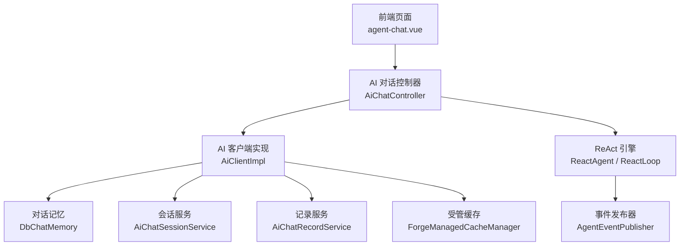
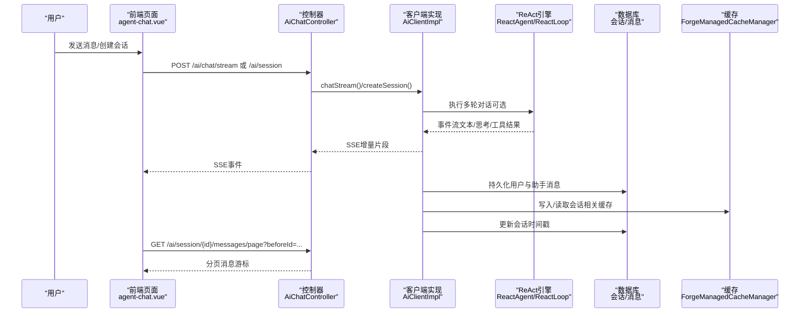
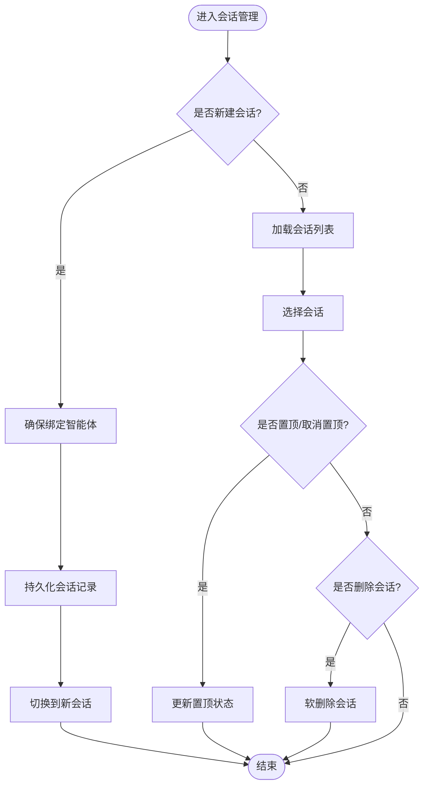
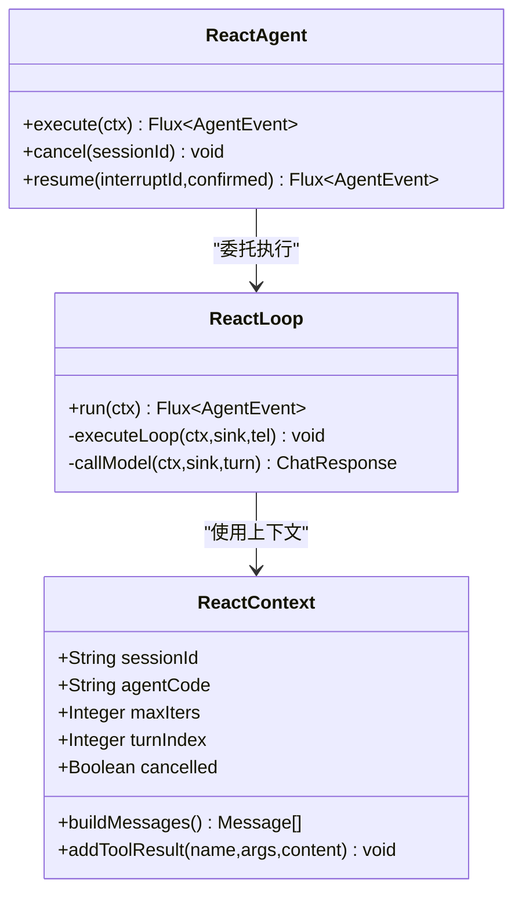
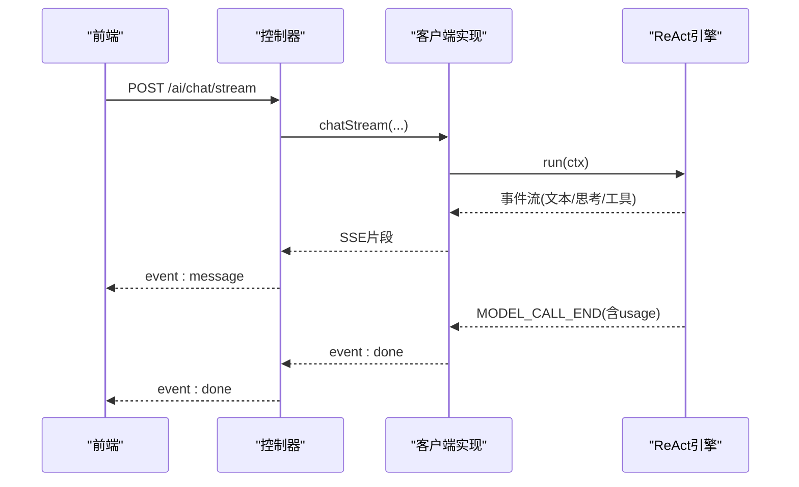
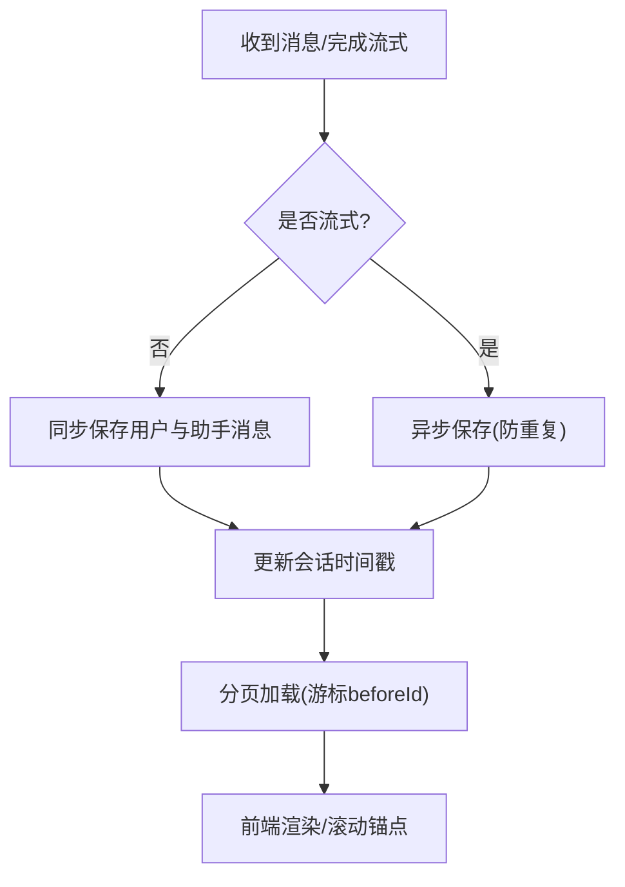
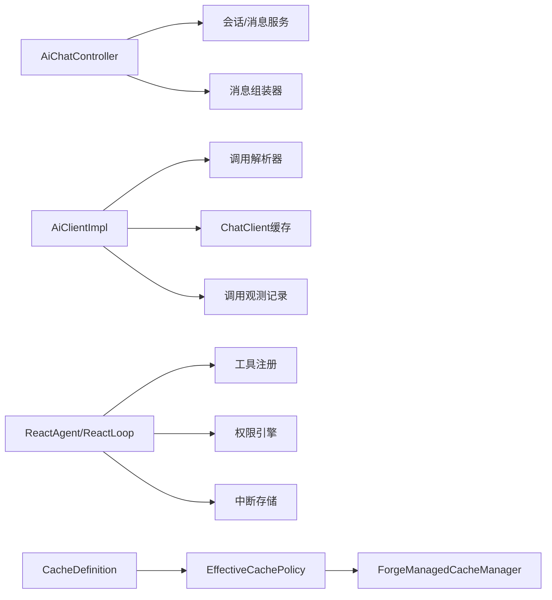

# 会话管理

<cite>
**本文引用的文件**
- [AiChatController.java](file://forge-server/forge-framework/forge-plugin-parent/forge-plugin-ai/src/main/java/com/mdframe/forge/plugin/ai/chat/controller/AiChatController.java)
- [AiClientImpl.java](file://forge-server/forge-framework/forge-plugin-parent/forge-plugin-ai/src/main/java/com/mdframe/forge/plugin/ai/client/AiClientImpl.java)
- [ReactLoop.java](file://forge-server/forge-framework/forge-plugin-parent/forge-plugin-ai/src/main/java/com/mdframe/forge/plugin/ai/agent/engine/ReactLoop.java)
- [ReactAgent.java](file://forge-server/forge-framework/forge-plugin-parent/forge-plugin-ai/src/main/java/com/mdframe/forge/plugin/ai/agent/engine/ReactAgent.java)
- [agent-chat.vue](file://forge-admin-ui/src/views/ai/agent-chat.vue)
- [2026-04-19-ai-chat-session-management-design.md](file://docs/superpowers/specs/2026-04-19-ai-chat-session-management-design.md)
- [CacheDefinition.java](file://forge-server/forge-framework/forge-starter-parent/forge-starter-cache/src/main/java/com/mdframe/forge/starter/cache/managed/model/CacheDefinition.java)
- [EffectiveCachePolicy.java](file://forge-server/forge-framework/forge-starter-parent/forge-starter-cache/src/main/java/com/mdframe/forge/starter/cache/managed/model/EffectiveCachePolicy.java)
- [ForgeManagedCacheManager.java](file://forge-server/forge-framework/forge-starter-parent/forge-starter-cache/src/main/java/com/mdframe/forge/starter/cache/managed/ForgeManagedCacheManager.java)
</cite>

## 目录
1. [简介](#简介)
2. [项目结构](#项目结构)
3. [核心组件](#核心组件)
4. [架构总览](#架构总览)
5. [详细组件分析](#详细组件分析)
6. [依赖关系分析](#依赖关系分析)
7. [性能与容量规划](#性能与容量规划)
8. [故障排查指南](#故障排查指南)
9. [结论](#结论)
10. [附录：接口与数据模型](#附录接口与数据模型)

## 简介
本技术文档围绕“会话管理系统”展开，聚焦以下目标：
- 会话生命周期管理：创建、切换、置顶、删除、软删除、历史回溯。
- 上下文保持与多轮对话：基于会话ID的上下文注入、ReAct循环中的状态维护、HITL中断恢复。
- 历史记录存储机制：消息持久化、分页加载（游标）、流式输出与落库时序。
- 并发控制策略：SSE流式、事件发布、中断恢复、缓存与锁的复用能力。
- 持久化方案与大数据量处理：数据库表复用、分页与游标、异步落库、缓存策略。
- 会话分析与用户行为追踪：统计指标、趋势图、Token用量埋点。
- 集成接口与安全：REST/SSE接口、权限校验、租户隔离、敏感信息防护。

## 项目结构
本项目采用前后端分离架构：
- 前端：Vue 页面负责会话列表、聊天窗口、消息分页加载、流式渲染。
- 后端：AI 插件模块提供会话管理、消息查询、流式对话、ReAct 引擎执行、调用观测与持久化。
- 基础设施：受管缓存框架提供本地/Redis 缓存策略；消息通道用于通知与协作扩展。

**图表来源**
- [AiChatController.java:74-164](file://forge-server/forge-framework/forge-plugin-parent/forge-plugin-ai/src/main/java/com/mdframe/forge/plugin/ai/chat/controller/AiChatController.java#L74-L164)
- [AiClientImpl.java:57-247](file://forge-server/forge-framework/forge-plugin-parent/forge-plugin-ai/src/main/java/com/mdframe/forge/plugin/ai/client/AiClientImpl.java#L57-L247)
- [ReactLoop.java:61-266](file://forge-server/forge-framework/forge-plugin-parent/forge-plugin-ai/src/main/java/com/mdframe/forge/plugin/ai/agent/engine/ReactLoop.java#L61-L266)
- [ReactAgent.java:27-72](file://forge-server/forge-framework/forge-plugin-parent/forge-plugin-ai/src/main/java/com/mdframe/forge/plugin/ai/agent/engine/ReactAgent.java#L27-L72)
- [ForgeManagedCacheManager.java:116-146](file://forge-server/forge-framework/forge-starter-parent/forge-starter-cache/src/main/java/com/mdframe/forge/starter/cache/managed/ForgeManagedCacheManager.java#L116-L146)

**章节来源**
- [AiChatController.java:74-164](file://forge-server/forge-framework/forge-plugin-parent/forge-plugin-ai/src/main/java/com/mdframe/forge/plugin/ai/chat/controller/AiChatController.java#L74-L164)
- [agent-chat.vue:404-569](file://forge-admin-ui/src/views/ai/agent-chat.vue#L404-L569)

## 核心组件
- 会话控制器（AiChatController）：暴露会话CRUD、消息分页、流式对话等REST接口，统一鉴权与租户上下文。
- AI客户端（AiClientImpl）：封装请求路由、系统提示构建、会话上下文注入、流式响应聚合、Token用量统计、消息持久化与会话触达更新。
- ReAct引擎（ReactAgent/ReactLoop）：实现多轮推理-行动循环，支持工具调用、权限决策、HITL中断恢复、事件流式输出与埋点。
- 前端会话页（agent-chat.vue）：会话创建/切换/删除、消息分页加载（游标 beforeId）、流式渲染、上滑加载更早消息。
- 受管缓存（ForgeManagedCacheManager）：提供本地/Redis 两级缓存策略、TTL、大小限制、空值缓存控制，支撑会话相关热点数据优化。

**章节来源**
- [AiChatController.java:101-194](file://forge-server/forge-framework/forge-plugin-parent/forge-plugin-ai/src/main/java/com/mdframe/forge/plugin/ai/chat/controller/AiChatController.java#L101-L194)
- [AiClientImpl.java:57-247](file://forge-server/forge-framework/forge-plugin-parent/forge-plugin-ai/src/main/java/com/mdframe/forge/plugin/ai/client/AiClientImpl.java#L57-L247)
- [ReactAgent.java:27-72](file://forge-server/forge-framework/forge-plugin-parent/forge-plugin-ai/src/main/java/com/mdframe/forge/plugin/ai/agent/engine/ReactAgent.java#L27-L72)
- [ReactLoop.java:96-266](file://forge-server/forge-framework/forge-plugin-parent/forge-plugin-ai/src/main/java/com/mdframe/forge/plugin/ai/agent/engine/ReactLoop.java#L96-L266)
- [agent-chat.vue:404-569](file://forge-admin-ui/src/views/ai/agent-chat.vue#L404-L569)
- [ForgeManagedCacheManager.java:116-146](file://forge-server/forge-framework/forge-starter-parent/forge-starter-cache/src/main/java/com/mdframe/forge/starter/cache/managed/ForgeManagedCacheManager.java#L116-L146)

## 架构总览
会话管理的整体流程如下：
- 前端发起会话创建或消息发送，携带 sessionId、agentCode、用户输入等。
- 控制器进行鉴权与参数校验，调用服务层完成会话创建/更新、消息分页。
- 流式对话通过 SSE 返回增量文本与思考过程，客户端逐步渲染。
- 服务端在流结束后异步持久化用户输入与助手回复，并更新会话更新时间。
- ReAct 引擎在多轮对话中维护上下文，必要时中断等待用户确认，支持恢复执行。
- 统计与埋点记录每次调用的阶段、结果、Token用量与耗时，便于分析与监控。

**图表来源**
- [AiChatController.java:74-164](file://forge-server/forge-framework/forge-plugin-parent/forge-plugin-ai/src/main/java/com/mdframe/forge/plugin/ai/chat/controller/AiChatController.java#L74-L164)
- [AiClientImpl.java:119-247](file://forge-server/forge-framework/forge-plugin-parent/forge-plugin-ai/src/main/java/com/mdframe/forge/plugin/ai/client/AiClientImpl.java#L119-L247)
- [ReactLoop.java:96-266](file://forge-server/forge-framework/forge-plugin-parent/forge-plugin-ai/src/main/java/com/mdframe/forge/plugin/ai/agent/engine/ReactLoop.java#L96-L266)
- [agent-chat.vue:404-447](file://forge-admin-ui/src/views/ai/agent-chat.vue#L404-L447)

## 详细组件分析

### 会话生命周期管理
- 创建会话：前端显式创建并绑定智能体，服务端幂等创建（sessionId已存在则返回原会话），标题由服务端规则生成。
- 切换会话：按会话自身绑定的 agentCode 回显，避免沿用上一个会话的智能体；同时加载该会话的消息。
- 置顶/取消置顶：仅本人可操作，失败时返回无权限提示。
- 删除会话：软删除（status=1），前端从列表移除并重置当前会话。
- 删除消息：软删除单条消息，需校验归属。

**图表来源**
- [AiChatController.java:120-194](file://forge-server/forge-framework/forge-plugin-parent/forge-plugin-ai/src/main/java/com/mdframe/forge/plugin/ai/chat/controller/AiChatController.java#L120-L194)
- [agent-chat.vue:508-569](file://forge-admin-ui/src/views/ai/agent-chat.vue#L508-L569)

**章节来源**
- [AiChatController.java:120-194](file://forge-server/forge-framework/forge-plugin-parent/forge-plugin-ai/src/main/java/com/mdframe/forge/plugin/ai/chat/controller/AiChatController.java#L120-L194)
- [agent-chat.vue:508-569](file://forge-admin-ui/src/views/ai/agent-chat.vue#L508-L569)

### 上下文保持与多轮对话
- 上下文注入：系统提示根据 Agent 配置渲染，并注入上下文变量；会话级上下文通过 ChatMemory 的 conversationId 关联。
- 多轮状态维护：ReAct 循环维护 turn 计数、工具结果、图片附件提示、最大迭代次数；超过阈值触发超限事件。
- HITL中断恢复：当工具需要用户确认时，保存上下文到中断存储，等待 resume；拒绝则构造拒绝结果继续，确认则恢复执行。

**图表来源**
- [ReactAgent.java:27-72](file://forge-server/forge-framework/forge-plugin-parent/forge-plugin-ai/src/main/java/com/mdframe/forge/plugin/ai/agent/engine/ReactAgent.java#L27-L72)
- [ReactLoop.java:61-266](file://forge-server/forge-framework/forge-plugin-parent/forge-plugin-ai/src/main/java/com/mdframe/forge/plugin/ai/agent/engine/ReactLoop.java#L61-L266)

**章节来源**
- [ReactAgent.java:27-72](file://forge-server/forge-framework/forge-plugin-parent/forge-plugin-ai/src/main/java/com/mdframe/forge/plugin/ai/agent/engine/ReactAgent.java#L27-L72)
- [ReactLoop.java:96-266](file://forge-server/forge-framework/forge-plugin-parent/forge-plugin-ai/src/main/java/com/mdframe/forge/plugin/ai/agent/engine/ReactLoop.java#L96-L266)

### 消息格式规范与流式输出
- 流式事件类型：AGENT_START、TEXT_BLOCK_START/DELTA/END、THINKING_BLOCK_DELTA、MODEL_CALL_START/END、TOOL_CALL_START/RESULT_*_END、REQUIRE_USER_CONFIRM、AGENT_END、EXCEED_MAX_ITERS。
- 流式内容组织：正文与思考过程分段输出，首块标记开始，随后逐块增量，结束时收口；工具结果以数据类型区分文本/数据增量。
- 前端渲染：SSE事件映射为消息气泡，支持Markdown与代码高亮，滚动锚点保持。

**图表来源**
- [AiChatController.java:74-97](file://forge-server/forge-framework/forge-plugin-parent/forge-plugin-ai/src/main/java/com/mdframe/forge/plugin/ai/chat/controller/AiChatController.java#L74-L97)
- [ReactLoop.java:96-266](file://forge-server/forge-framework/forge-plugin-parent/forge-plugin-ai/src/main/java/com/mdframe/forge/plugin/ai/agent/engine/ReactLoop.java#L96-L266)

**章节来源**
- [ReactLoop.java:96-266](file://forge-server/forge-framework/forge-plugin-parent/forge-plugin-ai/src/main/java/com/mdframe/forge/plugin/ai/agent/engine/ReactLoop.java#L96-L266)
- [AiChatController.java:74-97](file://forge-server/forge-framework/forge-plugin-parent/forge-plugin-ai/src/main/java/com/mdframe/forge/plugin/ai/chat/controller/AiChatController.java#L74-L97)

### 历史记录存储与分页加载
- 持久化时机：非流式调用完成后立即落库；流式调用在 doFinally 中异步落库，保证只写一次。
- 游标分页：前端以最早消息 recordId 作为 beforeId 获取更早一页，头插并保持滚动锚点，避免视口跳动。
- 会话触达更新：每次消息落库后更新会话更新时间，便于列表排序与最近访问。

**图表来源**
- [AiClientImpl.java:373-417](file://forge-server/forge-framework/forge-plugin-parent/forge-plugin-ai/src/main/java/com/mdframe/forge/plugin/ai/client/AiClientImpl.java#L373-L417)
- [agent-chat.vue:404-447](file://forge-admin-ui/src/views/ai/agent-chat.vue#L404-L447)

**章节来源**
- [AiClientImpl.java:373-417](file://forge-server/forge-framework/forge-plugin-parent/forge-plugin-ai/src/main/java/com/mdframe/forge/plugin/ai/client/AiClientImpl.java#L373-L417)
- [agent-chat.vue:404-447](file://forge-admin-ui/src/views/ai/agent-chat.vue#L404-L447)

### 并发控制策略
- SSE流式：使用 Flux 与 ServerSentEvent 推送增量，错误路径统一捕获并返回错误事件。
- 事件发布：ReAct 引擎在 loop 线程内发射事件，保证顺序一致性与一致性观察。
- 中断恢复：HITL 将上下文保存到中断存储，resume 时恢复执行，避免并发冲突。
- 缓存策略：受管缓存提供本地/Redis 两级策略，支持 TTL、大小限制、空值缓存控制，减少热点读压力。

**章节来源**
- [AiChatController.java:74-97](file://forge-server/forge-framework/forge-plugin-parent/forge-plugin-ai/src/main/java/com/mdframe/forge/plugin/ai/chat/controller/AiChatController.java#L74-L97)
- [ReactLoop.java:96-266](file://forge-server/forge-framework/forge-plugin-parent/forge-plugin-ai/src/main/java/com/mdframe/forge/plugin/ai/agent/engine/ReactLoop.java#L96-L266)
- [ReactAgent.java:46-72](file://forge-server/forge-framework/forge-plugin-parent/forge-plugin-ai/src/main/java/com/mdframe/forge/plugin/ai/agent/engine/ReactAgent.java#L46-L72)
- [ForgeManagedCacheManager.java:116-146](file://forge-server/forge-framework/forge-starter-parent/forge-starter-cache/src/main/java/com/mdframe/forge/starter/cache/managed/ForgeManagedCacheManager.java#L116-L146)

### 会话分析与用户行为追踪
- 统计指标：会话总数、消息总数、今日会话数、Token消耗总量、近30天趋势。
- 埋点记录：每次调用记录阶段、结果、Token用量、耗时、路由决策与供应商信息，便于性能与质量分析。
- 前端展示：统计卡片与趋势图，支持刷新与日期范围筛选。

**章节来源**
- [2026-04-19-ai-chat-session-management-design.md:219-252](file://docs/superpowers/specs/2026-04-19-ai-chat-session-management-design.md#L219-L252)
- [AiClientImpl.java:317-348](file://forge-server/forge-framework/forge-plugin-parent/forge-plugin-ai/src/main/java/com/mdframe/forge/plugin/ai/client/AiClientImpl.java#L317-L348)

### 与其他系统集成与安全考虑
- 鉴权与租户：控制器通过登录ID与租户ID进行权限校验与数据隔离。
- 消息渠道：可扩展统一协作渠道，适配不同渠道发送与重试策略。
- 安全加固：在线用户列表不读取敏感token字段；API加密注解与操作日志审计可用。

**章节来源**
- [AiChatController.java:101-194](file://forge-server/forge-framework/forge-plugin-parent/forge-plugin-ai/src/main/java/com/mdframe/forge/plugin/ai/chat/controller/AiChatController.java#L101-L194)
- [2026-04-19-ai-chat-session-management-design.md:219-252](file://docs/superpowers/specs/2026-04-19-ai-chat-session-management-design.md#L219-L252)

## 依赖关系分析
- 控制器依赖服务层与消息组装器，解耦会话与消息逻辑。
- 客户端实现依赖路由解析、ChatClient缓存、上下文注入、调用观测与失败分类。
- ReAct 引擎依赖工具注册、权限引擎、中断存储与事件发布器。
- 缓存框架提供策略定义与生效策略计算，支持动态覆盖。

**图表来源**
- [AiChatController.java:101-194](file://forge-server/forge-framework/forge-plugin-parent/forge-plugin-ai/src/main/java/com/mdframe/forge/plugin/ai/chat/controller/AiChatController.java#L101-L194)
- [AiClientImpl.java:57-247](file://forge-server/forge-framework/forge-plugin-parent/forge-plugin-ai/src/main/java/com/mdframe/forge/plugin/ai/client/AiClientImpl.java#L57-L247)
- [ReactLoop.java:54-94](file://forge-server/forge-framework/forge-plugin-parent/forge-plugin-ai/src/main/java/com/mdframe/forge/plugin/ai/agent/engine/ReactLoop.java#L54-L94)
- [CacheDefinition.java:9-31](file://forge-server/forge-framework/forge-starter-parent/forge-starter-cache/src/main/java/com/mdframe/forge/starter/cache/managed/model/CacheDefinition.java#L9-L31)
- [EffectiveCachePolicy.java:7-40](file://forge-server/forge-framework/forge-starter-parent/forge-starter-cache/src/main/java/com/mdframe/forge/starter/cache/managed/model/EffectiveCachePolicy.java#L7-L40)
- [ForgeManagedCacheManager.java:116-146](file://forge-server/forge-framework/forge-starter-parent/forge-starter-cache/src/main/java/com/mdframe/forge/starter/cache/managed/ForgeManagedCacheManager.java#L116-L146)

**章节来源**
- [AiChatController.java:101-194](file://forge-server/forge-framework/forge-plugin-parent/forge-plugin-ai/src/main/java/com/mdframe/forge/plugin/ai/chat/controller/AiChatController.java#L101-L194)
- [AiClientImpl.java:57-247](file://forge-server/forge-framework/forge-plugin-parent/forge-plugin-ai/src/main/java/com/mdframe/forge/plugin/ai/client/AiClientImpl.java#L57-L247)
- [ReactLoop.java:54-94](file://forge-server/forge-framework/forge-plugin-parent/forge-plugin-ai/src/main/java/com/mdframe/forge/plugin/ai/agent/engine/ReactLoop.java#L54-L94)
- [CacheDefinition.java:9-31](file://forge-server/forge-framework/forge-starter-parent/forge-starter-cache/src/main/java/com/mdframe/forge/starter/cache/managed/model/CacheDefinition.java#L9-L31)
- [EffectiveCachePolicy.java:7-40](file://forge-server/forge-framework/forge-starter-parent/forge-starter-cache/src/main/java/com/mdframe/forge/starter/cache/managed/model/EffectiveCachePolicy.java#L7-L40)
- [ForgeManagedCacheManager.java:116-146](file://forge-server/forge-framework/forge-starter-parent/forge-starter-cache/src/main/java/com/mdframe/forge/starter/cache/managed/ForgeManagedCacheManager.java#L116-L146)

## 性能与容量规划
- 流式输出：SSE增量推送降低首屏延迟，结合前端滚动锚点提升体验。
- 游标分页：以 recordId 作为游标，避免深翻页开销，适合长会话。
- 异步落库：流式完成后一次性持久化，减少重复写入。
- 缓存策略：本地+Redis 两级缓存，支持TTL与大小限制，空值缓存控制，降低热点读压力。
- 埋点观测：记录阶段、结果、Token用量与耗时，辅助容量评估与瓶颈定位。

[本节为通用指导，无需特定文件引用]

## 故障排查指南
- 流式错误：检查 onErrorResume 分支，确认错误事件是否正确返回；查看服务端日志中的异常堆栈。
- 中断恢复失败：确认中断ID有效且未过期；检查 resume 调用是否传入正确的 confirmed 标志。
- 持久化失败：关注 persistConversation 的异常捕获与日志；确认数据库连接与事务正常。
- 缓存失效：检查 CacheDefinition 与 EffectiveCachePolicy 的配置；验证本地与Redis TTL设置。

**章节来源**
- [AiChatController.java:74-97](file://forge-server/forge-framework/forge-plugin-parent/forge-plugin-ai/src/main/java/com/mdframe/forge/plugin/ai/chat/controller/AiChatController.java#L74-L97)
- [ReactAgent.java:46-72](file://forge-server/forge-framework/forge-plugin-parent/forge-plugin-ai/src/main/java/com/mdframe/forge/plugin/ai/agent/engine/ReactAgent.java#L46-L72)
- [AiClientImpl.java:373-417](file://forge-server/forge-framework/forge-plugin-parent/forge-plugin-ai/src/main/java/com/mdframe/forge/plugin/ai/client/AiClientImpl.java#L373-L417)
- [ForgeManagedCacheManager.java:116-146](file://forge-server/forge-framework/forge-starter-parent/forge-starter-cache/src/main/java/com/mdframe/forge/starter/cache/managed/ForgeManagedCacheManager.java#L116-L146)

## 结论
本会话管理系统通过清晰的职责划分与模块化设计，实现了完整的会话生命周期管理、上下文保持、多轮对话状态维护、消息持久化与分页加载、流式输出与事件驱动、以及完善的埋点与统计分析。借助受管缓存与并发控制策略，系统在性能与稳定性方面具备良好基础。后续可进一步扩展消息渠道、增强安全加固与优化大数据量场景下的存储与检索效率。

[本节为总结性内容，无需特定文件引用]

## 附录：接口与数据模型
- 会话接口
  - 会话列表：GET /ai/session/list
  - 会话分页：GET /ai/session/page
  - 创建会话：POST /ai/session
  - 重命名会话：PUT /ai/session/{sessionId}
  - 置顶/取消置顶：PUT /ai/session/{sessionId}/pin
  - 删除会话：DELETE /ai/session/{sessionId}
- 消息接口
  - 会话消息：GET /ai/session/{sessionId}/messages
  - 分页消息：GET /ai/session/{sessionId}/messages/page?beforeId=&size=
  - 删除消息：DELETE /ai/message/{recordId}
- 流式对话
  - 流式对话：POST /ai/chat/stream（SSE）
- 数据模型
  - AiSessionVO：会话列表返回对象（id、userId、nickName、avatar、sessionName、agentCode、status、messageCount、tokenUsage、createTime、updateTime）
  - AiSessionStatisticsVO：统计数据返回对象（totalSessions、totalMessages、todaySessions、totalTokenUsage、dailyTrend）
  - DailyTrendItem：近30天趋势项（date、sessionCount、messageCount）

**章节来源**
- [AiChatController.java:101-194](file://forge-server/forge-framework/forge-plugin-parent/forge-plugin-ai/src/main/java/com/mdframe/forge/plugin/ai/chat/controller/AiChatController.java#L101-L194)
- [2026-04-19-ai-chat-session-management-design.md:219-252](file://docs/superpowers/specs/2026-04-19-ai-chat-session-management-design.md#L219-L252)