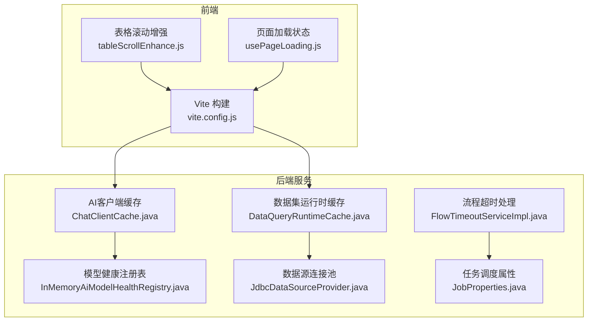
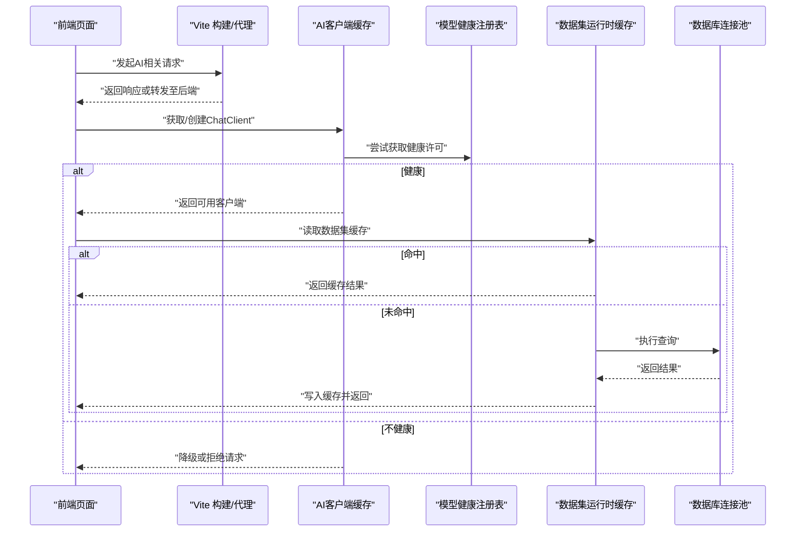
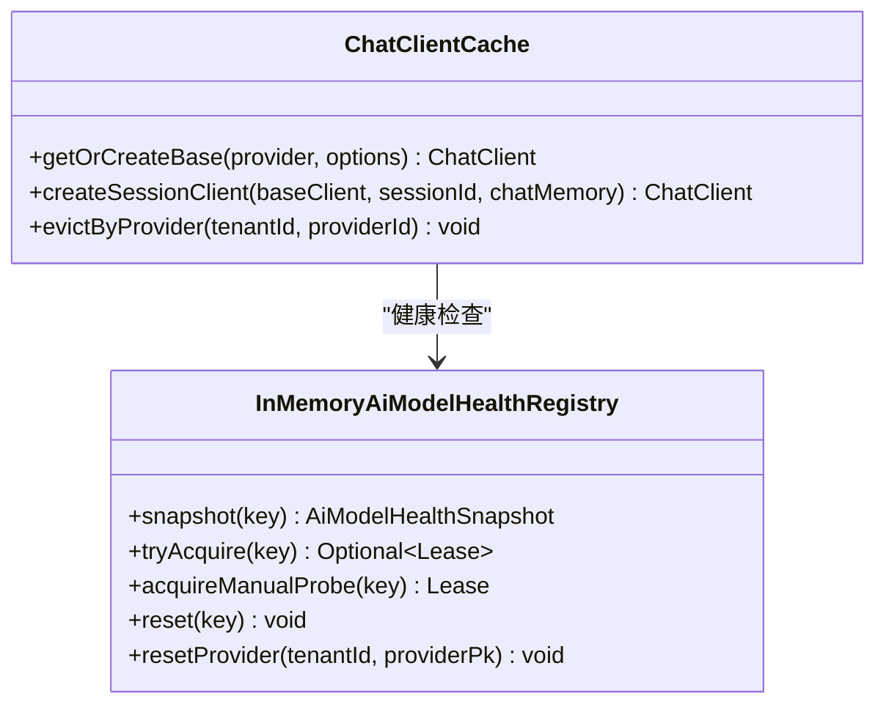
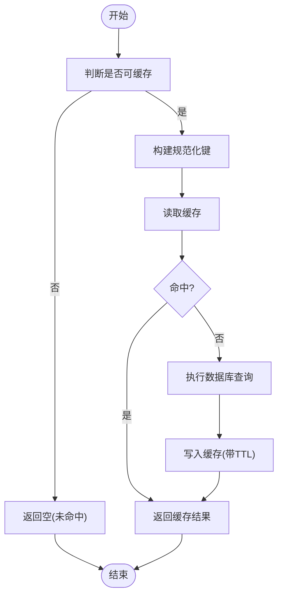
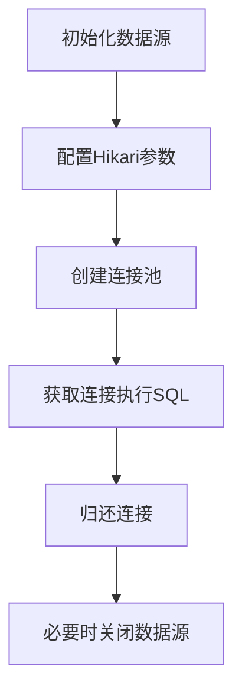
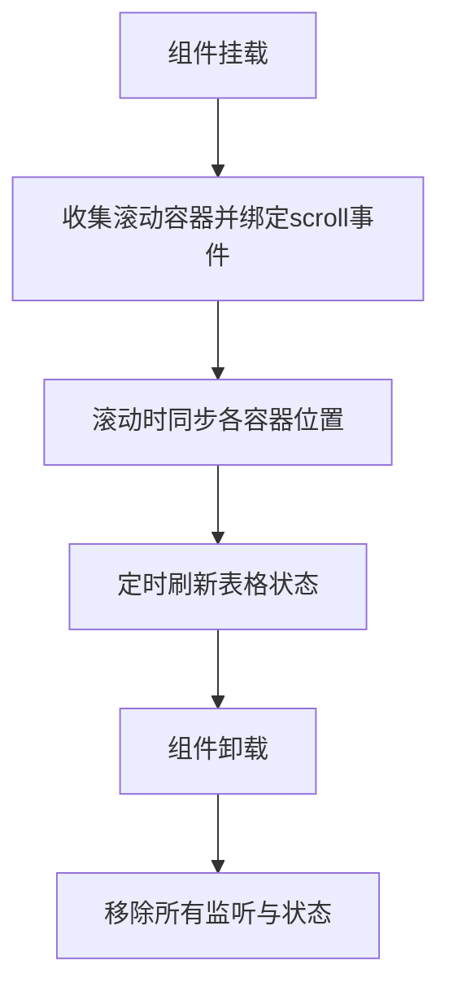
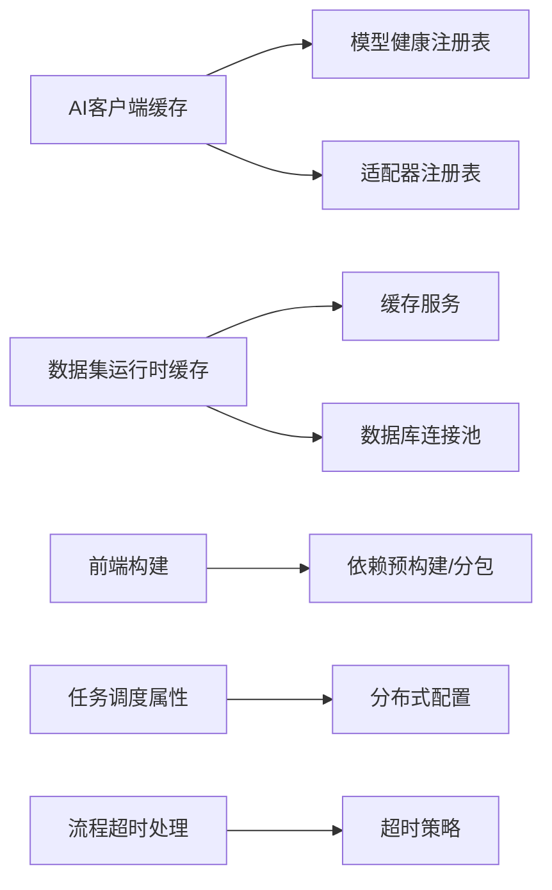

# 性能优化

<cite>
**本文引用的文件**
- [ChatClientCache.java](file://forge-server/forge-framework/forge-plugin-parent/forge-plugin-ai/src/main/java/com/mdframe/forge/plugin/ai/client/ChatClientCache.java)
- [InMemoryAiModelHealthRegistry.java](file://forge-server/forge-framework/forge-plugin-parent/forge-plugin-ai/src/main/java/com/mdframe/forge/plugin/ai/health/InMemoryAiModelHealthRegistry.java)
- [AiProviderCacheEvictionSchedulerTest.java](file://forge-server/forge-framework/forge-plugin-parent/forge-plugin-ai/src/test/java/com/mdframe/forge/plugin/ai/provider/support/AiProviderCacheEvictionSchedulerTest.java)
- [EffectiveCachePolicy.java](file://forge-server/forge-framework/forge-starter-parent/forge-starter-cache/src/main/java/com/mdframe/forge/starter/cache/managed/model/EffectiveCachePolicy.java)
- [DataQueryRuntimeCache.java](file://forge-server/forge-framework/forge-plugin-parent/forge-plugin-data/src/main/java/com/mdframe/forge/plugin/data/support/DataQueryRuntimeCache.java)
- [JdbcDataSourceProvider.java](file://forge-server/forge-framework/forge-plugin-parent/forge-plugin-data/src/main/java/com/mdframe/forge/plugin/data/support/JdbcDataSourceProvider.java)
- [vite.config.js](file://forge-admin-ui/vite.config.js)
- [tableScrollEnhance.js](file://forge-admin-ui/src/directives/modules/tableScrollEnhance.js)
- [usePageLoading.js](file://forge-h5-ui/src/composables/usePageLoading.js)
- [FlowTimeoutServiceImpl.java](file://forge-server/forge-framework/forge-plugin-parent/forge-plugin-flow/src/main/java/com/mdframe/forge/starter/flow/service/impl/FlowTimeoutServiceImpl.java)
- [JobProperties.java](file://forge-server/forge-framework/forge-plugin-parent/forge-plugin-job/src/main/java/com/mdframe/forge/plugin/job/config/JobProperties.java)
</cite>

## 目录
1. [简介](#简介)
2. [项目结构](#项目结构)
3. [核心组件](#核心组件)
4. [架构总览](#架构总览)
5. [详细组件分析](#详细组件分析)
6. [依赖关系分析](#依赖关系分析)
7. [性能考量](#性能考量)
8. [故障排查指南](#故障排查指南)
9. [结论](#结论)
10. [附录](#附录)

## 简介
本指南面向AI功能与整体系统的性能优化，覆盖以下关键主题：
- AI请求缓存策略、连接池配置与超时处理机制
- 前端组件懒加载、虚拟滚动与内存泄漏防护
- 后端线程池、数据库查询优化与Redis缓存策略
- 性能监控指标、瓶颈定位方法与容量规划建议
- 分布式环境下的性能调优与故障恢复机制

## 项目结构
本项目采用前后端分离与插件化架构：
- 前端（forge-admin-ui、forge-h5-ui）：基于Vite构建，提供页面路由、组件库集成、代理与构建优化。
- 后端（forge-server）：以插件形式组织能力，包含AI、数据、流程、任务等模块；通过统一的缓存、会话、上下文等基础能力支撑业务。
- 配置与运维：Docker编排、Nginx代理、应用配置文件与脚本工具。

**图表来源**
- [vite.config.js:14-175](file://forge-admin-ui/vite.config.js#L14-L175)
- [tableScrollEnhance.js:116-254](file://forge-admin-ui/src/directives/modules/tableScrollEnhance.js#L116-L254)
- [usePageLoading.js:1-87](file://forge-h5-ui/src/composables/usePageLoading.js#L1-L87)
- [ChatClientCache.java:17-107](file://forge-server/forge-framework/forge-plugin-parent/forge-plugin-ai/src/main/java/com/mdframe/forge/plugin/ai/client/ChatClientCache.java#L17-L107)
- [InMemoryAiModelHealthRegistry.java:12-74](file://forge-server/forge-framework/forge-plugin-parent/forge-plugin-ai/src/main/java/com/mdframe/forge/plugin/ai/health/InMemoryAiModelHealthRegistry.java#L12-L74)
- [DataQueryRuntimeCache.java:24-109](file://forge-server/forge-framework/forge-plugin-parent/forge-plugin-data/src/main/java/com/mdframe/forge/plugin/data/support/DataQueryRuntimeCache.java#L24-L109)
- [JdbcDataSourceProvider.java:36-69](file://forge-server/forge-framework/forge-plugin-parent/forge-plugin-data/src/main/java/com/mdframe/forge/plugin/data/support/JdbcDataSourceProvider.java#L36-L69)
- [FlowTimeoutServiceImpl.java:157-175](file://forge-server/forge-framework/forge-plugin-parent/forge-plugin-flow/src/main/java/com/mdframe/forge/starter/flow/service/impl/FlowTimeoutServiceImpl.java#L157-L175)
- [JobProperties.java:96-133](file://forge-server/forge-framework/forge-plugin-parent/forge-plugin-job/src/main/java/com/mdframe/forge/plugin/job/config/JobProperties.java#L96-L133)

**章节来源**
- [vite.config.js:14-175](file://forge-admin-ui/vite.config.js#L14-L175)

## 核心组件
- AI客户端缓存：按租户、供应商、适配器与运行参数维度复用ChatClient，降低重复创建成本。
- 模型健康注册表：实现熔断/半开探测，避免雪崩并支持快速恢复。
- 数据集运行时缓存：对可缓存的数据集查询进行键规范化与TTL控制，减少数据库压力。
- 数据源连接池：为每个数据连接创建Hikari连接池，设置合理的池大小与超时。
- 前端构建与代理：Vite预构建依赖、分包优化、开发代理与WebSocket转发。
- 表格滚动增强：多容器滚动同步与事件派发，提升大数据量表格交互体验。
- 页面加载状态管理：统一loading/refreshing/success/empty/error状态流转。
- 流程超时处理：超时动作执行与通知，异常兜底。
- 任务调度属性：分布式执行器配置与超时校验。

**章节来源**
- [ChatClientCache.java:17-107](file://forge-server/forge-framework/forge-plugin-parent/forge-plugin-ai/src/main/java/com/mdframe/forge/plugin/ai/client/ChatClientCache.java#L17-L107)
- [InMemoryAiModelHealthRegistry.java:12-74](file://forge-server/forge-framework/forge-plugin-parent/forge-plugin-ai/src/main/java/com/mdframe/forge/plugin/ai/health/InMemoryAiModelHealthRegistry.java#L12-L74)
- [DataQueryRuntimeCache.java:24-109](file://forge-server/forge-framework/forge-plugin-parent/forge-plugin-data/src/main/java/com/mdframe/forge/plugin/data/support/DataQueryRuntimeCache.java#L24-L109)
- [JdbcDataSourceProvider.java:36-69](file://forge-server/forge-framework/forge-plugin-parent/forge-plugin-data/src/main/java/com/mdframe/forge/plugin/data/support/JdbcDataSourceProvider.java#L36-L69)
- [vite.config.js:14-175](file://forge-admin-ui/vite.config.js#L14-L175)
- [tableScrollEnhance.js:116-254](file://forge-admin-ui/src/directives/modules/tableScrollEnhance.js#L116-L254)
- [usePageLoading.js:1-87](file://forge-h5-ui/src/composables/usePageLoading.js#L1-L87)
- [FlowTimeoutServiceImpl.java:157-175](file://forge-server/forge-framework/forge-plugin-parent/forge-plugin-flow/src/main/java/com/mdframe/forge/starter/flow/service/impl/FlowTimeoutServiceImpl.java#L157-L175)
- [JobProperties.java:96-133](file://forge-server/forge-framework/forge-plugin-parent/forge-plugin-job/src/main/java/com/mdframe/forge/plugin/job/config/JobProperties.java#L96-L133)

## 架构总览
下图展示AI请求从前端到后端的完整链路，包括缓存、健康检查、数据缓存与连接池等环节。

**图表来源**
- [ChatClientCache.java:34-95](file://forge-server/forge-framework/forge-plugin-parent/forge-plugin-ai/src/main/java/com/mdframe/forge/plugin/ai/client/ChatClientCache.java#L34-L95)
- [InMemoryAiModelHealthRegistry.java:22-63](file://forge-server/forge-framework/forge-plugin-parent/forge-plugin-ai/src/main/java/com/mdframe/forge/plugin/ai/health/InMemoryAiModelHealthRegistry.java#L22-L63)
- [DataQueryRuntimeCache.java:34-86](file://forge-server/forge-framework/forge-plugin-parent/forge-plugin-data/src/main/java/com/mdframe/forge/plugin/data/support/DataQueryRuntimeCache.java#L34-L86)
- [JdbcDataSourceProvider.java:36-69](file://forge-server/forge-framework/forge-plugin-parent/forge-plugin-data/src/main/java/com/mdframe/forge/plugin/data/support/JdbcDataSourceProvider.java#L36-L69)

## 详细组件分析

### AI请求缓存与健康保护
- 缓存键设计：按租户ID、供应商ID、适配器代码、模型、温度、最大Token组合生成稳定键，确保不同租户与不同运行参数隔离。
- 缓存策略：本地Caffeine缓存，限制最大条目数与写入过期时间，避免内存膨胀。
- 会话客户端：在基础客户端上按需注入消息记忆顾问，支持会话级对话历史。
- 健康保护：失败阈值触发熔断，进入半开后周期性试探，成功则恢复健康，失败继续熔断。
- 缓存失效：供应商变更时按租户与供应商维度清理缓存，保证一致性。

**图表来源**
- [ChatClientCache.java:17-107](file://forge-server/forge-framework/forge-plugin-parent/forge-plugin-ai/src/main/java/com/mdframe/forge/plugin/ai/client/ChatClientCache.java#L17-L107)
- [InMemoryAiModelHealthRegistry.java:12-74](file://forge-server/forge-framework/forge-plugin-parent/forge-plugin-ai/src/main/java/com/mdframe/forge/plugin/ai/health/InMemoryAiModelHealthRegistry.java#L12-L74)

**章节来源**
- [ChatClientCache.java:34-95](file://forge-server/forge-framework/forge-plugin-parent/forge-plugin-ai/src/main/java/com/mdframe/forge/plugin/ai/client/ChatClientCache.java#L34-L95)
- [InMemoryAiModelHealthRegistry.java:22-63](file://forge-server/forge-framework/forge-plugin-parent/forge-plugin-ai/src/main/java/com/mdframe/forge/plugin/ai/health/InMemoryAiModelHealthRegistry.java#L22-L63)
- [AiProviderCacheEvictionSchedulerTest.java:36-81](file://forge-server/forge-framework/forge-plugin-parent/forge-plugin-ai/src/test/java/com/mdframe/forge/plugin/ai/provider/support/AiProviderCacheEvictionSchedulerTest.java#L36-L81)

### 数据集运行时缓存策略
- 可缓存判定：需开启缓存且具备租户与用户上下文。
- 键生成：将数据集ID、更新时间、维度、字段、参数、分页信息规范化并哈希，形成稳定键。
- TTL控制：默认60秒，上限86400秒，防止长期占用缓存资源。
- 容错处理：读写异常记录日志并降级为未命中，保障主流程稳定性。

**图表来源**
- [DataQueryRuntimeCache.java:34-86](file://forge-server/forge-framework/forge-plugin-parent/forge-plugin-data/src/main/java/com/mdframe/forge/plugin/data/support/DataQueryRuntimeCache.java#L34-L86)

**章节来源**
- [DataQueryRuntimeCache.java:24-109](file://forge-server/forge-framework/forge-plugin-parent/forge-plugin-data/src/main/java/com/mdframe/forge/plugin/data/support/DataQueryRuntimeCache.java#L24-L109)

### 数据库连接池与超时配置
- 连接池：为每个数据连接创建独立HikariDataSource，命名便于识别与治理。
- 池大小：最大连接数与最小空闲数合理设置，平衡并发与资源占用。
- 超时与生命周期：连接超时、空闲超时、最大生命周期与测试SQL，确保连接健康。
- 资源释放：提供关闭方法，避免连接泄漏。

**图表来源**
- [JdbcDataSourceProvider.java:36-69](file://forge-server/forge-framework/forge-plugin-parent/forge-plugin-data/src/main/java/com/mdframe/forge/plugin/data/support/JdbcDataSourceProvider.java#L36-L69)

**章节来源**
- [JdbcDataSourceProvider.java:36-69](file://forge-server/forge-framework/forge-plugin-parent/forge-plugin-data/src/main/java/com/mdframe/forge/plugin/data/support/JdbcDataSourceProvider.java#L36-L69)

### 前端懒加载与构建优化
- 路由懒加载：使用unplugin-vue-router按视图目录生成路由，排除不需要生成的路径，减少初始包体积。
- 依赖预构建：显式include大依赖，避免首次进入时的二次优化与浏览器缓存不一致导致的504。
- 构建优化：关闭sourcemap、报告压缩体积，使用Rust原生压缩器降低内存占用，CSS压缩兼容性问题规避。
- 开发代理：区分流程服务与工作台的代理路径，支持重写与真实地址透传，便于调试。
- WebSocket代理：统一转发ws请求到后端同一服务。

**章节来源**
- [vite.config.js:14-175](file://forge-admin-ui/vite.config.js#L14-L175)

### 表格虚拟滚动与内存泄漏防护
- 多容器滚动同步：收集表格根与多个滚动容器，同步scrollLeft并派发scroll事件，保持头部与内容一致。
- 防抖与节流：使用定时器与标志位避免频繁刷新与冲突。
- 事件绑定与解绑：在挂载时绑定监听，卸载时彻底清理，防止内存泄漏。
- 溢出状态更新：检测垂直溢出并动态调整样式类，改善滚动体验。

**图表来源**
- [tableScrollEnhance.js:116-254](file://forge-admin-ui/src/directives/modules/tableScrollEnhance.js#L116-L254)

**章节来源**
- [tableScrollEnhance.js:116-254](file://forge-admin-ui/src/directives/modules/tableScrollEnhance.js#L116-L254)

### 页面加载状态管理与错误处理
- 状态机：idle/loading/refreshing/success/empty/error，统一封装run方法处理异步任务。
- 空数据处理：根据条件判断是否为空，切换empty状态。
- 错误处理：捕获异常并设置error状态，向上抛出以便上层处理。

**章节来源**
- [usePageLoading.js:1-87](file://forge-h5-ui/src/composables/usePageLoading.js#L1-L87)

### 流程超时处理与任务调度
- 超时动作：支持多种动作类型，如通知；不可用时记录警告并返回失败。
- 异常兜底：捕获异常并记录错误日志，保证流程健壮性。
- 任务调度属性：分布式执行器注册中心类型、服务列表、RPC超时等配置；执行恢复超时与心跳间隔的合法性校验。

**章节来源**
- [FlowTimeoutServiceImpl.java:157-175](file://forge-server/forge-framework/forge-plugin-parent/forge-plugin-flow/src/main/java/com/mdframe/forge/starter/flow/service/impl/FlowTimeoutServiceImpl.java#L157-L175)
- [JobProperties.java:96-133](file://forge-server/forge-framework/forge-plugin-parent/forge-plugin-job/src/main/java/com/mdframe/forge/plugin/job/config/JobProperties.java#L96-L133)

## 依赖关系分析
- AI模块依赖健康注册表与适配器注册表，通过缓存复用客户端，降低外部调用开销。
- 数据模块依赖缓存服务与数据库连接池，通过运行时缓存减少数据库压力。
- 前端依赖Vite构建链路与第三方UI库，通过预构建与分包优化提升首屏性能。
- 任务与流程模块依赖分布式配置与超时策略，保障高可用与可恢复性。

**图表来源**
- [ChatClientCache.java:34-95](file://forge-server/forge-framework/forge-plugin-parent/forge-plugin-ai/src/main/java/com/mdframe/forge/plugin/ai/client/ChatClientCache.java#L34-L95)
- [InMemoryAiModelHealthRegistry.java:22-63](file://forge-server/forge-framework/forge-plugin-parent/forge-plugin-ai/src/main/java/com/mdframe/forge/plugin/ai/health/InMemoryAiModelHealthRegistry.java#L22-L63)
- [DataQueryRuntimeCache.java:34-86](file://forge-server/forge-framework/forge-plugin-parent/forge-plugin-data/src/main/java/com/mdframe/forge/plugin/data/support/DataQueryRuntimeCache.java#L34-L86)
- [JdbcDataSourceProvider.java:36-69](file://forge-server/forge-framework/forge-plugin-parent/forge-plugin-data/src/main/java/com/mdframe/forge/plugin/data/support/JdbcDataSourceProvider.java#L36-L69)
- [vite.config.js:66-109](file://forge-admin-ui/vite.config.js#L66-L109)
- [JobProperties.java:118-133](file://forge-server/forge-framework/forge-plugin-parent/forge-plugin-job/src/main/java/com/mdframe/forge/plugin/job/config/JobProperties.java#L118-L133)
- [FlowTimeoutServiceImpl.java:157-175](file://forge-server/forge-framework/forge-plugin-parent/forge-plugin-flow/src/main/java/com/mdframe/forge/starter/flow/service/impl/FlowTimeoutServiceImpl.java#L157-L175)

**章节来源**
- [EffectiveCachePolicy.java:7-39](file://forge-server/forge-framework/forge-starter-parent/forge-starter-cache/src/main/java/com/mdframe/forge/starter/cache/managed/model/EffectiveCachePolicy.java#L7-L39)

## 性能考量
- AI请求缓存
  - 按租户与运行参数隔离，避免跨租户污染与重复创建。
  - 限制缓存大小与过期时间，防止内存增长。
  - 结合健康注册表，避免向不可用模型发送请求。
- 连接池与超时
  - 合理设置最大连接数、空闲超时与连接生命周期，避免连接耗尽与僵尸连接。
  - 配置连接测试SQL，及时剔除坏连接。
- 缓存策略
  - 数据集查询缓存键规范化，确保参数顺序不影响命中率。
  - 设置合理TTL，兼顾新鲜度与性能。
- 前端性能
  - 依赖预构建与分包优化，减少首屏加载时间与构建内存。
  - 表格滚动增强，提升大数据量交互流畅度。
  - 页面加载状态统一管理，避免重复请求与状态混乱。
- 分布式与容错
  - 任务调度超时与心跳校验，避免长时间阻塞。
  - 流程超时动作与通知，提升问题可见性与可恢复性。

[本节为通用指导，无需特定文件引用]

## 故障排查指南
- AI模型健康
  - 观察健康快照与失败计数，确认是否进入熔断或半开状态。
  - 检查健康试探是否被中断或取消，避免并发竞争。
- 缓存命中与失效
  - 核对数据集缓存键生成逻辑，确认参数规范化是否正确。
  - 检查缓存TTL与失效时机，避免脏读或过度失效。
- 连接池问题
  - 监控连接池使用率与等待时间，调整最大连接数与超时。
  - 检查连接测试SQL与驱动兼容性，避免连接建立失败。
- 前端卡顿与内存泄漏
  - 检查表格滚动监听是否正确解绑，避免残留事件。
  - 观察构建产物体积与依赖预构建情况，减少首屏压力。
- 超时与重试
  - 查看流程超时动作执行日志，确认渠道可用性。
  - 校验任务调度超时与心跳配置，避免误判与抖动。

**章节来源**
- [InMemoryAiModelHealthRegistry.java:22-63](file://forge-server/forge-framework/forge-plugin-parent/forge-plugin-ai/src/main/java/com/mdframe/forge/plugin/ai/health/InMemoryAiModelHealthRegistry.java#L22-L63)
- [DataQueryRuntimeCache.java:34-86](file://forge-server/forge-framework/forge-plugin-parent/forge-plugin-data/src/main/java/com/mdframe/forge/plugin/data/support/DataQueryRuntimeCache.java#L34-L86)
- [JdbcDataSourceProvider.java:36-69](file://forge-server/forge-framework/forge-plugin-parent/forge-plugin-data/src/main/java/com/mdframe/forge/plugin/data/support/JdbcDataSourceProvider.java#L36-L69)
- [tableScrollEnhance.js:116-254](file://forge-admin-ui/src/directives/modules/tableScrollEnhance.js#L116-L254)
- [FlowTimeoutServiceImpl.java:157-175](file://forge-server/forge-framework/forge-plugin-parent/forge-plugin-flow/src/main/java/com/mdframe/forge/starter/flow/service/impl/FlowTimeoutServiceImpl.java#L157-L175)
- [JobProperties.java:96-133](file://forge-server/forge-framework/forge-plugin-parent/forge-plugin-job/src/main/java/com/mdframe/forge/plugin/job/config/JobProperties.java#L96-L133)

## 结论
通过对AI请求缓存、连接池与超时的系统化管理，以及前端懒加载、虚拟滚动与内存泄漏防护的综合优化，项目在吞吐、延迟与稳定性方面获得显著提升。配合分布式调度与超时恢复机制，能够在复杂环境下保持高可用与可恢复性。建议持续监控关键指标，结合容量规划与压测，逐步迭代优化。

[本节为总结，无需特定文件引用]

## 附录
- 监控指标建议
  - AI：请求成功率、P95/P99延迟、熔断次数、缓存命中率。
  - 数据库：连接池使用率、等待时间、慢查询数量。
  - 缓存：命中率、过期率、内存使用。
  - 前端：首屏时间、包体积、构建内存、滚动帧率。
- 容量规划建议
  - 根据峰值QPS与平均延迟估算连接池大小与缓存容量。
  - 结合业务增长趋势，预留弹性扩容空间。
  - 定期压测与回归，验证配置有效性。

[本节为补充说明，无需特定文件引用]