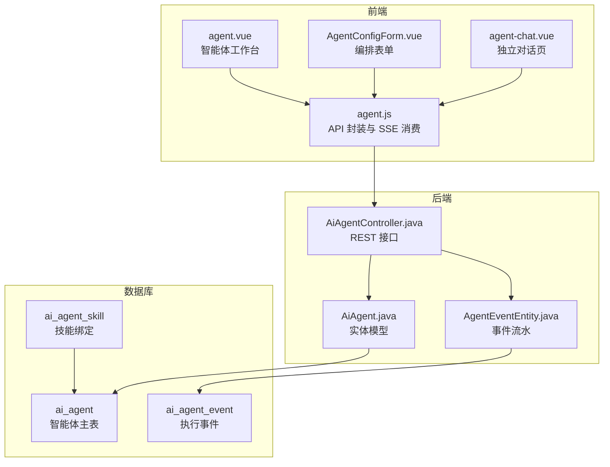
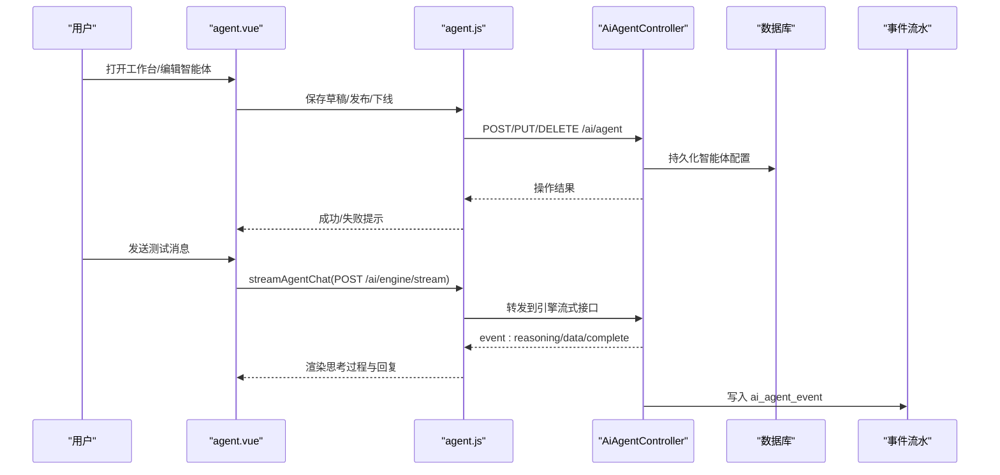
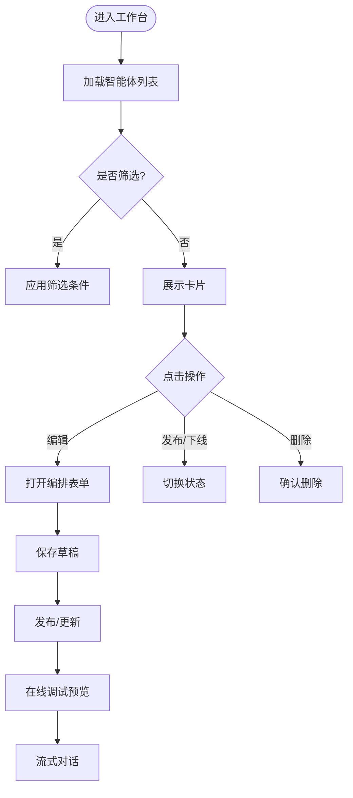
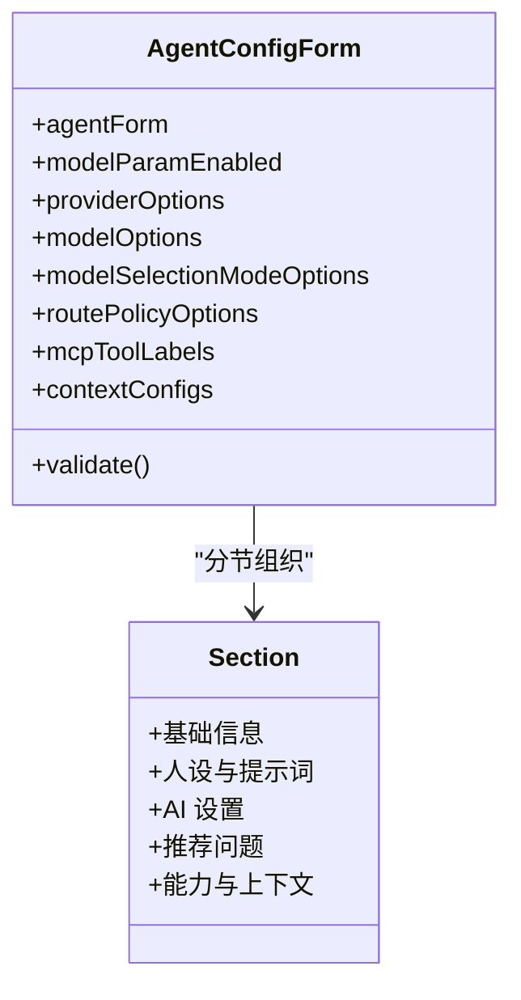
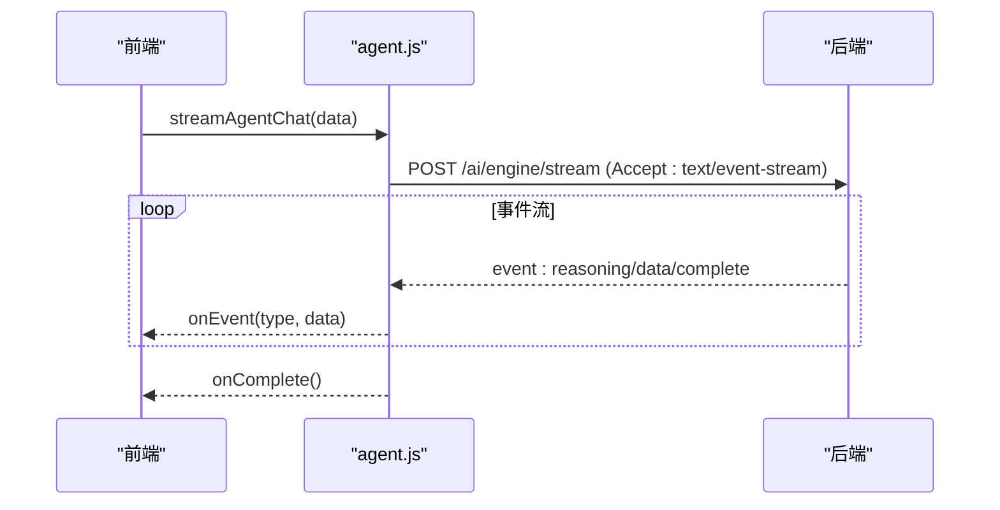
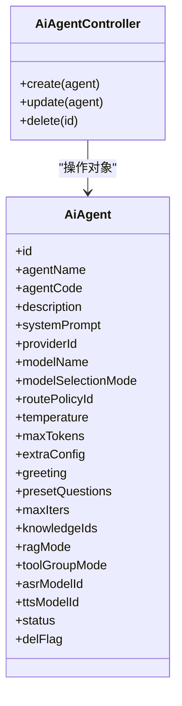
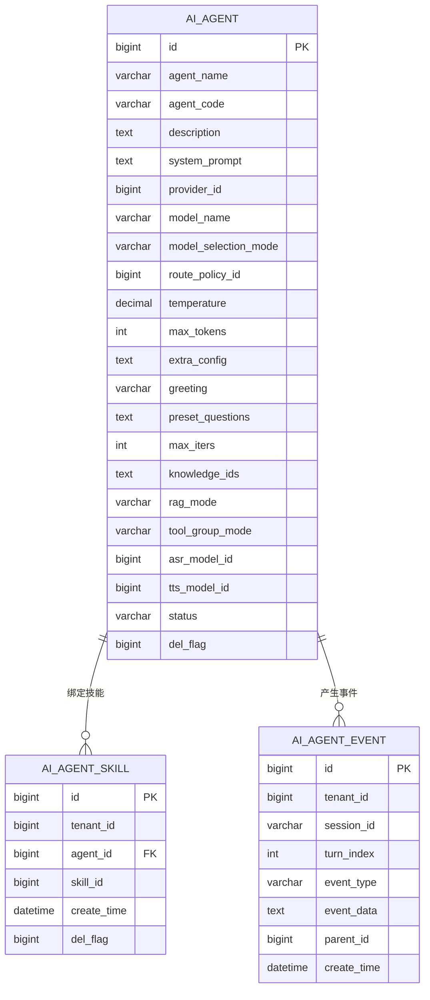
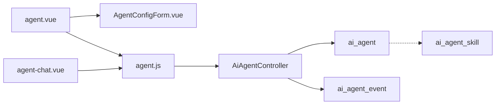

# 智能体管理

<cite>
**本文引用的文件**
- [agent.vue](file://forge-admin-ui/src/views/ai/agent.vue)
- [AgentConfigForm.vue](file://forge-admin-ui/src/views/ai/components/AgentConfigForm.vue)
- [agent.js](file://forge-admin-ui/src/api/ai/agent.js)
- [AiAgentController.java](file://forge-server/forge-framework/forge-plugin-parent/forge-plugin-ai/src/main/java/com/mdframe/forge/plugin/ai/agent/controller/AiAgentController.java)
- [AiAgent.java](file://forge-server/forge-framework/forge-plugin-parent/forge-plugin-ai/src/main/java/com/mdframe/forge/plugin/ai/agent/domain/AiAgent.java)
- [AgentEventEntity.java](file://forge-server/forge-framework/forge-plugin-parent/forge-plugin-ai/src/main/java/com/mdframe/forge/plugin/ai/agent/engine/event/persistence/AgentEventEntity.java)
- [V1.0.88__add_agent_engine_event_skill.sql](file://forge-server/db/migration/V1.0.88__add_agent_engine_event_skill.sql)
- [V1.0.2__fix_existing_logic_delete_contract.sql](file://forge-server/db/migration/V1.0.2__fix_existing_logic_delete_contract.sql)
- [report-init.sql](file://forge-server/forge-report-server/sql/report-init.sql)
- [agent-chat.vue](file://forge-admin-ui/src/views/ai/agent-chat.vue)
</cite>

## 目录
1. [简介](#简介)
2. [项目结构](#项目结构)
3. [核心组件](#核心组件)
4. [架构总览](#架构总览)
5. [详细组件分析](#详细组件分析)
6. [依赖关系分析](#依赖关系分析)
7. [性能与调优](#性能与调优)
8. [故障排查指南](#故障排查指南)
9. [结论](#结论)
10. [附录：配置示例与最佳实践](#附录配置示例与最佳实践)

## 简介
本文件面向“智能体管理”功能，覆盖智能体的创建、配置、编辑、删除、生命周期与状态控制、版本发布、提示词模板、工具集成、RAG 知识库关联、调试与预览、日志审计以及常见问题定位。内容基于前端工作区与后端插件实现进行梳理，帮助使用者快速上手并掌握高级用法。

## 项目结构
智能体管理由前后端协同完成：
- 前端页面与工作区：提供智能体列表、设计表单、模型参数调节、工具与技能绑定、上下文配置、在线调试对话等能力。
- 后端控制器与服务：提供智能体的增删改查、发布/下线、流式调用、事件持久化等能力。
- 数据库迁移：定义智能体主表、技能绑定表、事件流水表及扩展列的幂等变更。

图表来源
- [agent.vue:1-800](file://forge-admin-ui/src/views/ai/agent.vue#L1-L800)
- [AgentConfigForm.vue:1-623](file://forge-admin-ui/src/views/ai/components/AgentConfigForm.vue#L1-L623)
- [agent.js:1-121](file://forge-admin-ui/src/api/ai/agent.js#L1-L121)
- [AiAgentController.java:42-59](file://forge-server/forge-framework/forge-plugin-parent/forge-plugin-ai/src/main/java/com/mdframe/forge/plugin/ai/agent/controller/AiAgentController.java#L42-L59)
- [AiAgent.java:1-47](file://forge-server/forge-framework/forge-plugin-parent/forge-plugin-ai/src/main/java/com/mdframe/forge/plugin/ai/agent/domain/AiAgent.java#L1-L47)
- [AgentEventEntity.java:1-32](file://forge-server/forge-framework/forge-plugin-parent/forge-plugin-ai/src/main/java/com/mdframe/forge/plugin/ai/agent/engine/event/persistence/AgentEventEntity.java#L1-L32)

章节来源
- [agent.vue:1-800](file://forge-admin-ui/src/views/ai/agent.vue#L1-L800)
- [agent.js:1-121](file://forge-admin-ui/src/api/ai/agent.js#L1-L121)
- [AiAgentController.java:42-59](file://forge-server/forge-framework/forge-plugin-parent/forge-plugin-ai/src/main/java/com/mdframe/forge/plugin/ai/agent/controller/AiAgentController.java#L42-L59)

## 核心组件
- 智能体工作台（agent.vue）
  - 列表筛选、分页、卡片展示、基础信息弹窗、模型选择器、参数面板、发布菜单、在线调试对话、工具/技能/知识库/推荐问题弹窗。
- 编排表单（AgentConfigForm.vue）
  - 分节导航：基础信息、人设与提示词、AI 设置、推荐问题、能力与上下文；支持温度与最大 Token 开关与数值输入。
- API 层（agent.js）
  - 封装分页、列表、详情、新增、更新、删除、客户端调用、流式调用、SSE 事件消费、AI 生成确认等。
- 后端控制器（AiAgentController.java）
  - 暴露 /ai/agent 的 POST/PUT/DELETE 等接口，对接服务层处理。
- 数据模型（AiAgent.java）
  - 包含名称、编码、描述、系统提示词、供应商与模型、路由策略、温度、最大 Token、额外配置、问候语、预设问题、最大迭代次数、知识库 ID、RAG 模式、工具分组模式、ASR/TTS 模型、状态、逻辑删除标志等字段。
- 事件流水（AgentEventEntity.java）
  - 记录租户、会话、轮次、事件类型、事件数据、父事件、创建时间，用于调试与审计。

章节来源
- [agent.vue:1-800](file://forge-admin-ui/src/views/ai/agent.vue#L1-L800)
- [AgentConfigForm.vue:1-623](file://forge-admin-ui/src/views/ai/components/AgentConfigForm.vue#L1-L623)
- [agent.js:1-121](file://forge-admin-ui/src/api/ai/agent.js#L1-L121)
- [AiAgentController.java:42-59](file://forge-server/forge-framework/forge-plugin-parent/forge-plugin-ai/src/main/java/com/mdframe/forge/plugin/ai/agent/controller/AiAgentController.java#L42-L59)
- [AiAgent.java:1-47](file://forge-server/forge-framework/forge-plugin-parent/forge-plugin-ai/src/main/java/com/mdframe/forge/plugin/ai/agent/domain/AiAgent.java#L1-L47)
- [AgentEventEntity.java:1-32](file://forge-server/forge-framework/forge-plugin-parent/forge-plugin-ai/src/main/java/com/mdframe/forge/plugin/ai/agent/engine/event/persistence/AgentEventEntity.java#L1-L32)

## 架构总览
智能体管理的端到端流程包括：
- 配置阶段：在工作台填写基础信息、提示词、模型与参数、工具/技能/上下文/推荐问题。
- 保存与发布：草稿保存后，可发布上线或下线；发布后用户可见并可调用。
- 运行阶段：前端通过流式接口发起对话，后端执行引擎返回思考过程与最终回复，同时写入事件流水。

图表来源
- [agent.vue:481-604](file://forge-admin-ui/src/views/ai/agent.vue#L481-L604)
- [agent.js:102-116](file://forge-admin-ui/src/api/ai/agent.js#L102-L116)
- [AiAgentController.java:42-59](file://forge-server/forge-framework/forge-plugin-parent/forge-plugin-ai/src/main/java/com/mdframe/forge/plugin/ai/agent/controller/AiAgentController.java#L42-L59)
- [AgentEventEntity.java:1-32](file://forge-server/forge-framework/forge-plugin-parent/forge-plugin-ai/src/main/java/com/mdframe/forge/plugin/ai/agent/engine/event/persistence/AgentEventEntity.java#L1-L32)

## 详细组件分析

### 智能体工作台（agent.vue）
- 列表与筛选：支持关键词、状态过滤与刷新；卡片展示名称、编码、描述、模型、温度、工具标签等元信息。
- 基础信息弹窗：编辑名称、编码、描述；编码在编辑时不可更改。
- 模型选择器：支持“固定模型”和“策略路由”两种模式；当选择策略路由时，需指定路由策略。
- 参数面板：温度与最大 Token 支持开关与滑块/数字输入；未启用时不序列化该参数。
- 发布菜单：显示最新发布信息，支持恢复、更新、运行、嵌入网站、探索、访问 API 等操作入口。
- 在线调试：内置聊天面板，支持新会话、停止、思考过程与流式输出。
- 工具/技能/知识库/推荐问题弹窗：支持工具绑定与启用/禁用、技能多选绑定、知识库多选关联、推荐问题动态标签。

图表来源
- [agent.vue:1-800](file://forge-admin-ui/src/views/ai/agent.vue#L1-L800)

章节来源
- [agent.vue:1-800](file://forge-admin-ui/src/views/ai/agent.vue#L1-L800)

### 编排表单（AgentConfigForm.vue）
- 分节导航：基础信息、人设与提示词、AI 设置、推荐问题、能力与上下文。
- 人设与提示词：系统提示词与开场白，用于定义角色、目标、行为边界与首条消息。
- AI 设置：模型选择方式（固定/策略）、供应商与模型、路由策略；温度与最大 Token 可开关与调整。
- 能力与上下文：快捷入口打开工具/技能弹窗与上下文配置弹窗，展示已选工具数量、推荐问题数、上下文数量与预览。

图表来源
- [AgentConfigForm.vue:1-623](file://forge-admin-ui/src/views/ai/components/AgentConfigForm.vue#L1-L623)

章节来源
- [AgentConfigForm.vue:1-623](file://forge-admin-ui/src/views/ai/components/AgentConfigForm.vue#L1-L623)

### API 与流式调用（agent.js）
- 常规 CRUD：分页、列表、详情、新增、更新、删除。
- 客户端调用：普通调用与流式调用。
- SSE 事件消费：统一解析 event/data 行，按事件类型回调 onEvent，完成后回调 onComplete，异常回调 onError。
- AI 辅助创建：支持通过描述流式生成智能体配置，确认后提交。

图表来源
- [agent.js:6-76](file://forge-admin-ui/src/api/ai/agent.js#L6-L76)
- [agent.js:102-116](file://forge-admin-ui/src/api/ai/agent.js#L102-L116)

章节来源
- [agent.js:1-121](file://forge-admin-ui/src/api/ai/agent.js#L1-L121)

### 后端控制器与实体（AiAgentController.java / AiAgent.java）
- 控制器提供 REST 接口：创建、更新、删除智能体。
- 实体包含智能体所有配置项：名称、编码、描述、系统提示词、供应商、模型、路由策略、温度、最大 Token、额外配置、问候语、预设问题、最大迭代次数、知识库 ID、RAG 模式、工具分组模式、ASR/TTS 模型、状态、逻辑删除标志。

图表来源
- [AiAgentController.java:42-59](file://forge-server/forge-framework/forge-plugin-parent/forge-plugin-ai/src/main/java/com/mdframe/forge/plugin/ai/agent/controller/AiAgentController.java#L42-L59)
- [AiAgent.java:1-47](file://forge-server/forge-framework/forge-plugin-parent/forge-plugin-ai/src/main/java/com/mdframe/forge/plugin/ai/agent/domain/AiAgent.java#L1-L47)

章节来源
- [AiAgentController.java:42-59](file://forge-server/forge-framework/forge-plugin-parent/forge-plugin-ai/src/main/java/com/mdframe/forge/plugin/ai/agent/controller/AiAgentController.java#L42-L59)
- [AiAgent.java:1-47](file://forge-server/forge-framework/forge-plugin-parent/forge-plugin-ai/src/main/java/com/mdframe/forge/plugin/ai/agent/domain/AiAgent.java#L1-L47)

### 数据模型与迁移（数据库）
- ai_agent：智能体主表，包含名称、编码、描述、提示词、模型、参数、额外配置、问候语、预设问题、最大迭代次数、知识库 ID、RAG 模式、工具分组模式、ASR/TTS 模型、状态、逻辑删除标志等。
- ai_agent_skill：智能体与技能的绑定关系。
- ai_agent_event：执行事件流水，记录租户、会话、轮次、事件类型、事件数据、父事件、创建时间。
- 迁移脚本：
  - V1.0.88：新增技能绑定表与 ai_agent 扩展列（问候语、预设问题、最大迭代次数、知识库 ID）。
  - V1.0.2：修复 ai_agent 唯一索引与逻辑删除相关索引。

图表来源
- [report-init.sql:17-26](file://forge-server/forge-report-server/sql/report-init.sql#L17-L26)
- [V1.0.88__add_agent_engine_event_skill.sql:105-155](file://forge-server/db/migration/V1.0.88__add_agent_engine_event_skill.sql#L105-L155)
- [V1.0.2__fix_existing_logic_delete_contract.sql:21-32](file://forge-server/db/migration/V1.0.2__fix_existing_logic_delete_contract.sql#L21-L32)

章节来源
- [V1.0.88__add_agent_engine_event_skill.sql:105-155](file://forge-server/db/migration/V1.0.88__add_agent_engine_event_skill.sql#L105-L155)
- [V1.0.2__fix_existing_logic_delete_contract.sql:21-32](file://forge-server/db/migration/V1.0.2__fix_existing_logic_delete_contract.sql#L21-L32)
- [report-init.sql:17-26](file://forge-server/forge-report-server/sql/report-init.sql#L17-L26)

## 依赖关系分析
- 前端依赖
  - agent.vue 依赖 AgentConfigForm.vue 提供编排表单能力。
  - agent.vue 与 agent-chat.vue 均依赖 agent.js 提供的 API 与 SSE 消费能力。
- 前后端契约
  - 前端通过 /ai/agent/* 与 /ai/engine/stream 等接口与后端交互。
  - 后端控制器将请求落库并触发事件流水写入。
- 数据依赖
  - ai_agent 为配置中心；ai_agent_skill 与 ai_agent_event 分别支撑技能绑定与执行审计。

图表来源
- [agent.vue:1-800](file://forge-admin-ui/src/views/ai/agent.vue#L1-L800)
- [AgentConfigForm.vue:1-623](file://forge-admin-ui/src/views/ai/components/AgentConfigForm.vue#L1-L623)
- [agent.js:1-121](file://forge-admin-ui/src/api/ai/agent.js#L1-L121)
- [AiAgentController.java:42-59](file://forge-server/forge-framework/forge-plugin-parent/forge-plugin-ai/src/main/java/com/mdframe/forge/plugin/ai/agent/controller/AiAgentController.java#L42-L59)

章节来源
- [agent.vue:1-800](file://forge-admin-ui/src/views/ai/agent.vue#L1-L800)
- [agent.js:1-121](file://forge-admin-ui/src/api/ai/agent.js#L1-L121)
- [AiAgentController.java:42-59](file://forge-server/forge-framework/forge-plugin-parent/forge-plugin-ai/src/main/java/com/mdframe/forge/plugin/ai/agent/controller/AiAgentController.java#L42-L59)

## 性能与调优
- 模型参数调优
  - 温度：控制回答发散程度，适合创意类任务提高创造性，稳定类任务降低温度。
  - 最大 Token：限制单次回复长度，长文档总结可适当提高，但需考虑成本与延迟。
- RAG 知识库
  - 开启知识库关联后，RAG 模式自动切换为智能检索，有助于提升专业领域问答准确率。
- 流式对话
  - 使用 SSE 流式响应可降低首字延迟，提升用户体验；注意网络稳定性与错误重试。
- 事件流水
  - 合理的事件粒度有助于定位问题；建议对高频事件进行保留策略与归档。

[本节为通用指导，无需特定文件引用]

## 故障排查指南
- 无法连接流式接口
  - 检查浏览器是否支持流式响应与跨域配置；确认认证头携带正确。
- 流式事件未渲染
  - 检查事件解析逻辑是否正确拆分 event/data；确认 onEvent 回调是否被调用。
- 发布后仍不可用
  - 确认智能体状态是否为已发布；检查路由策略是否生效。
- 工具/技能未生效
  - 检查工具绑定是否启用；技能是否勾选并保存；知识库是否关联且 RAG 模式正确。
- 事件缺失
  - 检查 ai_agent_event 表是否存在；确认事件写入逻辑是否被触发。

章节来源
- [agent.js:6-76](file://forge-admin-ui/src/api/ai/agent.js#L6-L76)
- [AgentEventEntity.java:1-32](file://forge-server/forge-framework/forge-plugin-parent/forge-plugin-ai/src/main/java/com/mdframe/forge/plugin/ai/agent/engine/event/persistence/AgentEventEntity.java#L1-L32)

## 结论
智能体管理提供了从配置、调试到发布的全链路能力。通过清晰的编排表单、灵活的模型与参数配置、完善的工具与技能绑定、RAG 知识库支持与流式对话体验，能够满足多种业务场景需求。结合事件流水与数据库迁移，可实现稳定的版本管理与问题追溯。

[本节为总结性内容，无需特定文件引用]

## 附录：配置示例与最佳实践
- 创建智能体
  - 在工作台点击“创建智能体”，填写名称、编码、描述与系统提示词，选择模型与参数，保存草稿。
- 配置提示词模板
  - 在“人设与提示词”中编写系统提示词与开场白，明确角色、目标与输出要求。
- 工具集成设置
  - 在“工具与技能”弹窗中添加工具标识与分组，启用所需工具；在“技能绑定”中勾选技能并保存。
- 知识库与 RAG
  - 在“知识库”中勾选需要作为检索来源的知识库；RAG 模式将根据选择自动切换。
- 发布与版本管理
  - 草稿保存后可发布上线；发布后可通过“运行/嵌入网站/探索/访问 API”等入口使用。
- 调试技巧
  - 使用工作台内“调试与预览”进行在线对话；观察思考过程与回复；必要时重置会话重新测试。
- 日志查看
  - 通过事件流水表 ai_agent_event 查看会话、轮次、事件类型与数据，定位问题根因。
- 常见问题
  - 模型参数未生效：确认参数开关已启用并在序列化时包含。
  - 工具未生效：确认工具启用状态与分组配置。
  - 知识库未检索：确认知识库已关联且 RAG 模式为智能。

[本节为实践指导，无需特定文件引用]