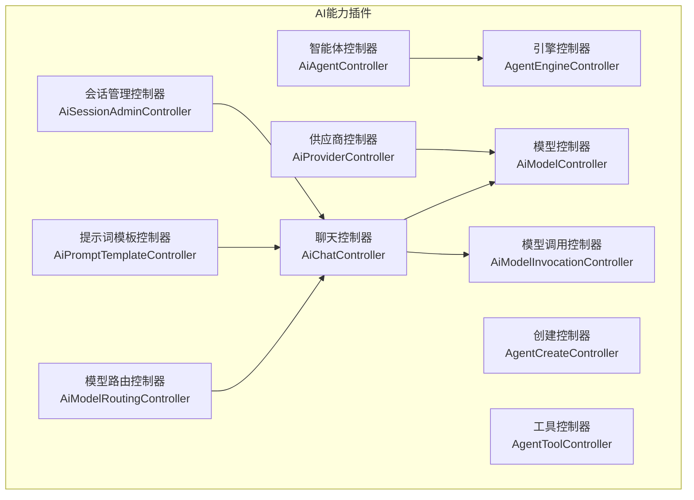
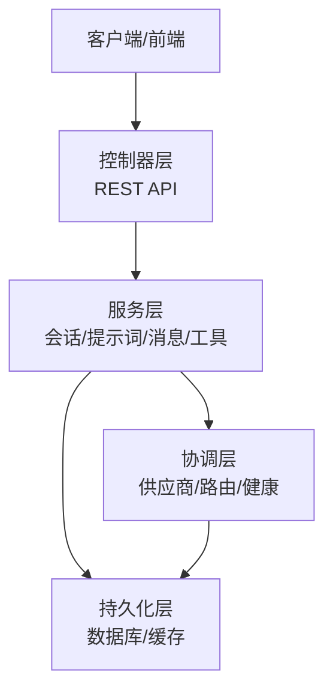
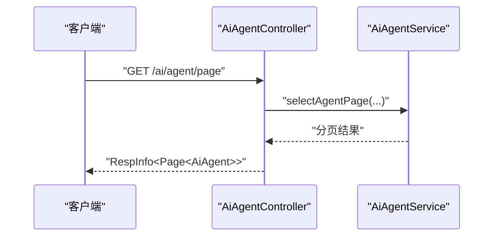
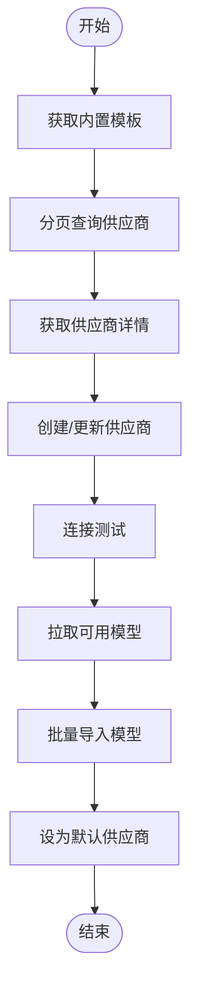
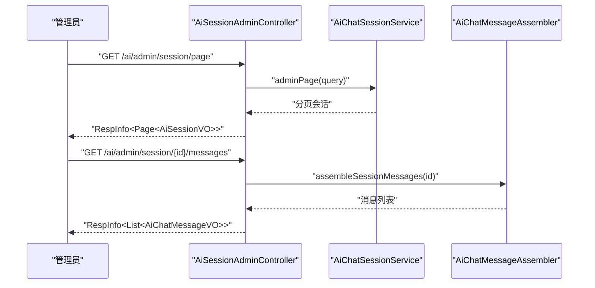
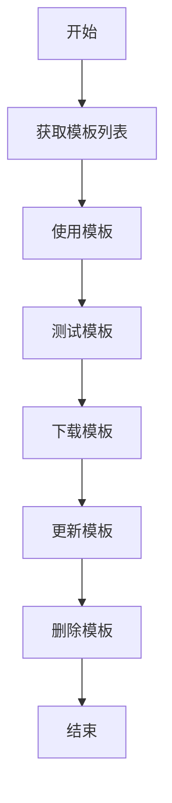
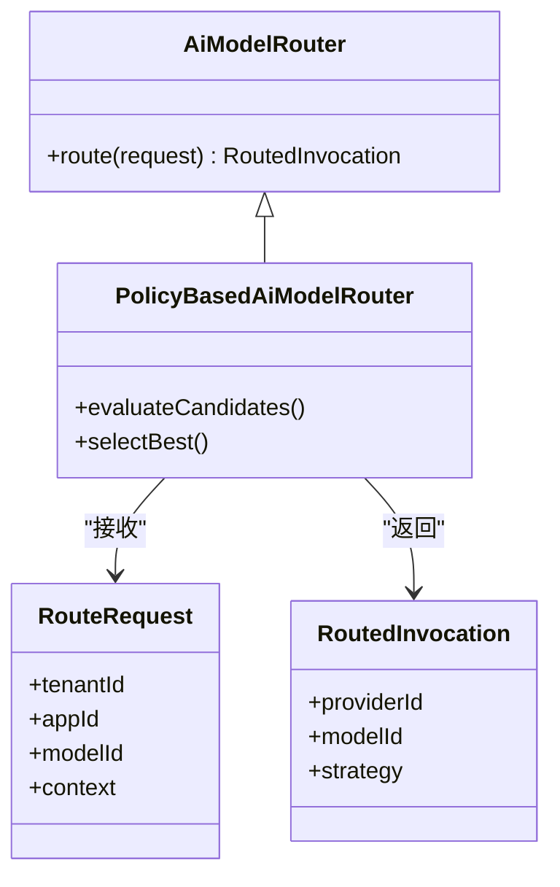
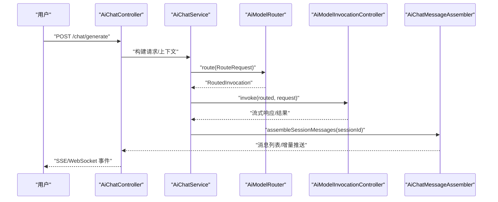
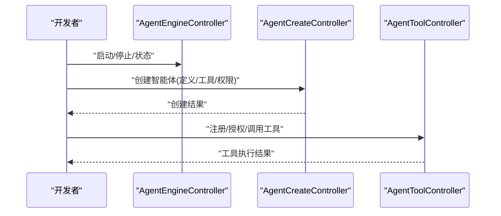
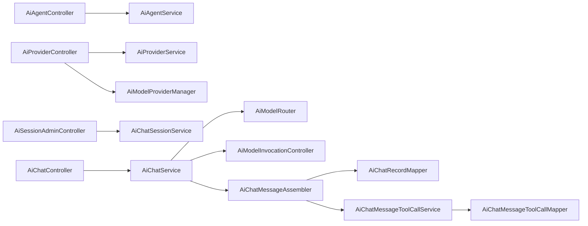

# AI能力API

<cite>
**本文引用的文件**
- [AiAgentController.java](file://forge-server/forge-framework/forge-plugin-parent/forge-plugin-ai/src/main/java/com/mdframe/forge/plugin/ai/agent/controller/AiAgentController.java)
- [AiProviderController.java](file://forge-server/forge-framework/forge-plugin-parent/forge-plugin-ai/src/main/java/com/mdframe/forge/plugin/ai/provider/controller/AiProviderController.java)
- [AiSessionAdminController.java](file://forge-server/forge-framework/forge-plugin-parent/forge-plugin-ai/src/main/java/com/mdframe/forge/plugin/ai/admin/controller/AiSessionAdminController.java)
- [AiPromptTemplateController.java](file://forge-server/forge-framework/forge-plugin-parent/forge-plugin-ai/src/main/java/com/mdframe/forge/plugin/ai/prompt/controller/AiPromptTemplateController.java)
- [AiModelRoutingController.java](file://forge-server/forge-framework/forge-plugin-parent/forge-plugin-ai/src/main/java/com/mdframe/forge/plugin/ai/routing/controller/AiModelRoutingController.java)
- [AiChatController.java](file://forge-server/forge-framework/forge-plugin-parent/forge-plugin-ai/src/main/java/com/mdframe/forge/plugin/ai/chat/controller/AiChatController.java)
- [AiModelInvocationController.java](file://forge-server/forge-framework/forge-plugin-parent/forge-plugin-ai/src/main/java/com/mdframe/forge/plugin/ai/invocation/controller/AiModelInvocationController.java)
- [AiModelController.java](file://forge-server/forge-framework/forge-plugin-parent/forge-plugin-ai/src/main/java/com/mdframe/forge/plugin/ai/model/controller/AiModelController.java)
- [AgentEngineController.java](file://forge-server/forge-framework/forge-plugin-parent/forge-plugin-ai/src/main/java/com/mdframe/forge/plugin/ai/agent/engine/controller/AgentEngineController.java)
- [AgentCreateController.java](file://forge-server/forge-framework/forge-plugin-parent/forge-plugin-ai/src/main/java/com/mdframe/forge/plugin/ai/agent/engine/create/controller/AgentCreateController.java)
- [AgentToolController.java](file://forge-server/forge-framework/forge-plugin-parent/forge-plugin-ai/src/main/java/com/mdframe/forge/plugin/ai/agenttool/controller/AgentToolController.java)
- [AiModelRouter.java](file://forge-server/forge-framework/forge-plugin-parent/forge-plugin-ai/src/main/java/com/mdframe/forge/plugin/ai/routing/AiModelRouter.java)
- [PolicyBasedAiModelRouter.java](file://forge-server/forge-framework/forge-plugin-parent/forge-plugin-ai/src/main/java/com/mdframe/forge/plugin/ai/routing/PolicyBasedAiModelRouter.java)
- [RouteRequest.java](file://forge-server/forge-framework/forge-plugin-parent/forge-plugin-ai/src/main/java/com/mdframe/forge/plugin/ai/routing/RouteRequest.java)
- [RoutedInvocation.java](file://forge-server/forge-framework/forge-plugin-parent/forge-plugin-ai/src/main/java/com/mdframe/forge/plugin/ai/routing/RoutedInvocation.java)
- [AiModelProviderManager.java](file://forge-server/forge-framework/forge-plugin-parent/forge-plugin-ai/src/main/java/com/mdframe/forge/plugin/ai/coordination/AiModelProviderManager.java)
- [AiChatService.java](file://forge-server/forge-framework/forge-plugin-parent/forge-plugin-ai/src/main/java/com/mdframe/forge/plugin/ai/chat/service/AiChatService.java)
- [AiChatMessageAssembler.java](file://forge-server/forge-framework/forge-plugin-parent/forge-plugin-ai/src/main/java/com/mdframe/forge/plugin/ai/chat/service/AiChatMessageAssembler.java)
- [AiChatRecordService.java](file://forge-server/forge-framework/forge-plugin-parent/forge-plugin-ai/src/main/java/com/mdframe/forge/plugin/ai/chat/service/AiChatRecordService.java)
- [AiChatRecordMapper.java](file://forge-server/forge-framework/forge-plugin-parent/forge-plugin-ai/src/main/java/com/mdframe/forge/plugin/ai/chat/mapper/AiChatRecordMapper.java)
- [AiChatMessageToolCallService.java](file://forge-server/forge-framework/forge-plugin-parent/forge-plugin-ai/src/main/java/com/mdframe/forge/plugin/ai/chat/service/AiChatMessageToolCallService.java)
- [AiChatMessageToolCallMapper.java](file://forge-server/forge-framework/forge-plugin-parent/forge-plugin-ai/src/main/java/com/mdframe/forge/plugin/ai/chat/mapper/AiChatMessageToolCallMapper.java)
- [AiChatMessageToolCall.java](file://forge-server/forge-framework/forge-plugin-parent/forge-plugin-ai/src/main/java/com/mdframe/forge/plugin/ai/chat/domain/AiChatMessageToolCall.java)
- [AiChatRecord.java](file://forge-server/forge-framework/forge-plugin-parent/forge-plugin-ai/src/main/java/com/mdframe/forge/plugin/ai/chat/domain/AiChatRecord.java)
</cite>

## 目录
1. [简介](#简介)
2. [项目结构](#项目结构)
3. [核心组件](#核心组件)
4. [架构总览](#架构总览)
5. [详细组件分析](#详细组件分析)
6. [依赖关系分析](#依赖关系分析)
7. [性能考量](#性能考量)
8. [故障排查指南](#故障排查指南)
9. [结论](#结论)
10. [附录：接口清单与示例](#附录接口清单与示例)

## 简介
本文件为“AI能力中心”的API接口文档，覆盖智能体管理、AI供应商配置、会话管理、提示词模板、模型路由等核心能力，并说明WebSocket实时通信的连接处理、消息格式与事件类型。同时解释AI代理模式、模型路由机制与供应商抽象的实现方式，并提供智能体创建、工具集成与性能优化的最佳实践。

## 项目结构
AI能力以插件形式提供，主要位于 forge-plugin-ai 模块中，按领域划分控制器与服务：
- 智能体：agent、agent/engine、agent/tool
- 供应商与模型：provider、model、routing
- 会话与聊天：chat、admin/session
- 提示词：prompt
- 调用观测：invocation

图表来源
- [AiAgentController.java:14-59](file://forge-server/forge-framework/forge-plugin-parent/forge-plugin-ai/src/main/java/com/mdframe/forge/plugin/ai/agent/controller/AiAgentController.java#L14-L59)
- [AiProviderController.java:27-183](file://forge-server/forge-framework/forge-plugin-parent/forge-plugin-ai/src/main/java/com/mdframe/forge/plugin/ai/provider/controller/AiProviderController.java#L27-L183)
- [AiSessionAdminController.java:22-68](file://forge-server/forge-framework/forge-plugin-parent/forge-plugin-ai/src/main/java/com/mdframe/forge/plugin/ai/admin/controller/AiSessionAdminController.java#L22-L68)
- [AiPromptTemplateController.java:16-79](file://forge-server/forge-framework/forge-plugin-parent/forge-plugin-ai/src/main/java/com/mdframe/forge/plugin/ai/prompt/controller/AiPromptTemplateController.java#L16-L79)
- [AiModelRoutingController.java](file://forge-server/forge-framework/forge-plugin-parent/forge-plugin-ai/src/main/java/com/mdframe/forge/plugin/ai/routing/controller/AiModelRoutingController.java)
- [AiChatController.java](file://forge-server/forge-framework/forge-plugin-parent/forge-plugin-ai/src/main/java/com/mdframe/forge/plugin/ai/chat/controller/AiChatController.java)
- [AiModelInvocationController.java](file://forge-server/forge-framework/forge-plugin-parent/forge-plugin-ai/src/main/java/com/mdframe/forge/plugin/ai/invocation/controller/AiModelInvocationController.java)
- [AiModelController.java](file://forge-server/forge-framework/forge-plugin-parent/forge-plugin-ai/src/main/java/com/mdframe/forge/plugin/ai/model/controller/AiModelController.java)
- [AgentEngineController.java](file://forge-server/forge-framework/forge-plugin-parent/forge-plugin-ai/src/main/java/com/mdframe/forge/plugin/ai/agent/engine/controller/AgentEngineController.java)
- [AgentCreateController.java](file://forge-server/forge-framework/forge-plugin-parent/forge-plugin-ai/src/main/java/com/mdframe/forge/plugin/ai/agent/engine/create/controller/AgentCreateController.java)
- [AgentToolController.java](file://forge-server/forge-framework/forge-plugin-parent/forge-plugin-ai/src/main/java/com/mdframe/forge/plugin/ai/agenttool/controller/AgentToolController.java)

章节来源
- [AiAgentController.java:14-59](file://forge-server/forge-framework/forge-plugin-parent/forge-plugin-ai/src/main/java/com/mdframe/forge/plugin/ai/agent/controller/AiAgentController.java#L14-L59)
- [AiProviderController.java:27-183](file://forge-server/forge-framework/forge-plugin-parent/forge-plugin-ai/src/main/java/com/mdframe/forge/plugin/ai/provider/controller/AiProviderController.java#L27-L183)
- [AiSessionAdminController.java:22-68](file://forge-server/forge-framework/forge-plugin-parent/forge-plugin-ai/src/main/java/com/mdframe/forge/plugin/ai/admin/controller/AiSessionAdminController.java#L22-L68)
- [AiPromptTemplateController.java:16-79](file://forge-server/forge-framework/forge-plugin-parent/forge-plugin-ai/src/main/java/com/mdframe/forge/plugin/ai/prompt/controller/AiPromptTemplateController.java#L16-L79)

## 核心组件
- 智能体管理：提供分页查询、列表、详情、创建、更新、删除等接口，用于维护AI智能体的元数据与状态。
- 供应商配置：提供内置模板、分页查询、详情、创建、更新、删除、默认设置、连接测试、拉取模型、批量导入模型等接口。
- 会话管理：提供会话分页、消息查看、删除、统计、体验指标、元数据更新等管理接口。
- 提示词模板：提供分页、列表、详情、预览、创建、更新、删除、使用、测试、下载等接口。
- 模型路由：提供策略化路由选择，将请求映射到合适的模型与供应商。
- 聊天与实时通信：提供聊天生成、流式响应（SSE/WebSocket）、消息与工具调用记录。
- 模型调用观测：记录调用阶段、结果与观测指标，便于监控与排障。

章节来源
- [AiAgentController.java:14-59](file://forge-server/forge-framework/forge-plugin-parent/forge-plugin-ai/src/main/java/com/mdframe/forge/plugin/ai/agent/controller/AiAgentController.java#L14-L59)
- [AiProviderController.java:27-183](file://forge-server/forge-framework/forge-plugin-parent/forge-plugin-ai/src/main/java/com/mdframe/forge/plugin/ai/provider/controller/AiProviderController.java#L27-L183)
- [AiSessionAdminController.java:22-68](file://forge-server/forge-framework/forge-plugin-parent/forge-plugin-ai/src/main/java/com/mdframe/forge/plugin/ai/admin/controller/AiSessionAdminController.java#L22-L68)
- [AiPromptTemplateController.java:16-79](file://forge-server/forge-framework/forge-plugin-parent/forge-plugin-ai/src/main/java/com/mdframe/forge/plugin/ai/prompt/controller/AiPromptTemplateController.java#L16-L79)
- [AiModelRoutingController.java](file://forge-server/forge-framework/forge-plugin-parent/forge-plugin-ai/src/main/java/com/mdframe/forge/plugin/ai/routing/controller/AiModelRoutingController.java)
- [AiChatController.java](file://forge-server/forge-framework/forge-plugin-parent/forge-plugin-ai/src/main/java/com/mdframe/forge/plugin/ai/chat/controller/AiChatController.java)
- [AiModelInvocationController.java](file://forge-server/forge-framework/forge-plugin-parent/forge-plugin-ai/src/main/java/com/mdframe/forge/plugin/ai/invocation/controller/AiModelInvocationController.java)

## 架构总览
AI能力通过分层与解耦实现：
- 控制器层：对外暴露REST API，负责参数校验与统一响应封装。
- 服务层：业务编排，包括会话、提示词渲染、消息组装、工具调用、路由决策等。
- 适配与协调层：供应商适配器、模型提供者管理器、健康检查与路由策略。
- 持久化层：会话、消息、工具调用、模板、模型、供应商等数据的CRUD。

图表来源
- [AiChatController.java](file://forge-server/forge-framework/forge-plugin-parent/forge-plugin-ai/src/main/java/com/mdframe/forge/plugin/ai/chat/controller/AiChatController.java)
- [AiChatService.java](file://forge-server/forge-framework/forge-plugin-parent/forge-plugin-ai/src/main/java/com/mdframe/forge/plugin/ai/chat/service/AiChatService.java)
- [AiModelProviderManager.java](file://forge-server/forge-framework/forge-plugin-parent/forge-plugin-ai/src/main/java/com/mdframe/forge/plugin/ai/coordination/AiModelProviderManager.java)
- [AiModelRouter.java](file://forge-server/forge-framework/forge-plugin-parent/forge-plugin-ai/src/main/java/com/mdframe/forge/plugin/ai/routing/AiModelRouter.java)

## 详细组件分析

### 智能体管理API
- 分页查询智能体：GET /ai/agent/page
- 获取启用列表：GET /ai/agent/list
- 获取详情：GET /ai/agent/{id}
- 创建智能体：POST /ai/agent
- 更新智能体：PUT /ai/agent
- 删除智能体：DELETE /ai/agent/{id}

图表来源
- [AiAgentController.java:23-30](file://forge-server/forge-framework/forge-plugin-parent/forge-plugin-ai/src/main/java/com/mdframe/forge/plugin/ai/agent/controller/AiAgentController.java#L23-L30)

章节来源
- [AiAgentController.java:14-59](file://forge-server/forge-framework/forge-plugin-parent/forge-plugin-ai/src/main/java/com/mdframe/forge/plugin/ai/agent/controller/AiAgentController.java#L14-L59)

### 供应商配置API
- 内置模板：GET /ai/provider/templates
- 分页查询：GET /ai/provider/page
- 详情：GET /ai/provider/{id}
- 创建：POST /ai/provider
- 更新：PUT /ai/provider
- 删除：DELETE /ai/provider/{id}
- 设为默认：PUT /ai/provider/{id}/default
- 连接测试：POST /ai/provider/test
- 拉取模型：POST /ai/provider/{id}/fetch-models
- 批量导入模型：POST /ai/provider/{id}/models/batch

图表来源
- [AiProviderController.java:36-183](file://forge-server/forge-framework/forge-plugin-parent/forge-plugin-ai/src/main/java/com/mdframe/forge/plugin/ai/provider/controller/AiProviderController.java#L36-L183)

章节来源
- [AiProviderController.java:27-183](file://forge-server/forge-framework/forge-plugin-parent/forge-plugin-ai/src/main/java/com/mdframe/forge/plugin/ai/provider/controller/AiProviderController.java#L27-L183)

### 会话管理API
- 会话分页：GET /ai/admin/session/page
- 会话消息：GET /ai/admin/session/{sessionId}/messages
- 删除会话：DELETE /ai/admin/session/{sessionId}
- 统计信息：GET /ai/admin/session/statistics
- 体验指标：GET /ai/admin/session/experience-metrics
- 更新元数据：PUT /ai/admin/session/{sessionId}/metadata

图表来源
- [AiSessionAdminController.java:33-41](file://forge-server/forge-framework/forge-plugin-parent/forge-plugin-ai/src/main/java/com/mdframe/forge/plugin/ai/admin/controller/AiSessionAdminController.java#L33-L41)

章节来源
- [AiSessionAdminController.java:22-68](file://forge-server/forge-framework/forge-plugin-parent/forge-plugin-ai/src/main/java/com/mdframe/forge/plugin/ai/admin/controller/AiSessionAdminController.java#L22-L68)

### 提示词模板API
- 分页：GET /ai/prompt-template/page
- 列表：GET /ai/prompt-template/list
- 详情：GET /ai/prompt-template/{id}
- 预览：GET /ai/prompt-template/{id}/preview
- 创建：POST /ai/prompt-template
- 更新：PUT /ai/prompt-template
- 删除：DELETE /ai/prompt-template/{id}
- 使用：POST /ai/prompt-template/{id}/use
- 测试：POST /ai/prompt-template/{id}/test
- 下载：POST /ai/prompt-template/{id}/download

图表来源
- [AiPromptTemplateController.java:25-79](file://forge-server/forge-framework/forge-plugin-parent/forge-plugin-ai/src/main/java/com/mdframe/forge/plugin/ai/prompt/controller/AiPromptTemplateController.java#L25-L79)

章节来源
- [AiPromptTemplateController.java:16-79](file://forge-server/forge-framework/forge-plugin-parent/forge-plugin-ai/src/main/java/com/mdframe/forge/plugin/ai/prompt/controller/AiPromptTemplateController.java#L16-L79)

### 模型路由与调用
- 路由选择：基于策略的模型路由，支持候选评估与决策。
- 调用入口：统一的模型调用控制器，负责参数组装、路由、执行与观测。

图表来源
- [AiModelRouter.java](file://forge-server/forge-framework/forge-plugin-parent/forge-plugin-ai/src/main/java/com/mdframe/forge/plugin/ai/routing/AiModelRouter.java)
- [PolicyBasedAiModelRouter.java](file://forge-server/forge-framework/forge-plugin-parent/forge-plugin-ai/src/main/java/com/mdframe/forge/plugin/ai/routing/PolicyBasedAiModelRouter.java)
- [RouteRequest.java](file://forge-server/forge-framework/forge-plugin-parent/forge-plugin-ai/src/main/java/com/mdframe/forge/plugin/ai/routing/RouteRequest.java)
- [RoutedInvocation.java](file://forge-server/forge-framework/forge-plugin-parent/forge-plugin-ai/src/main/java/com/mdframe/forge/plugin/ai/routing/RoutedInvocation.java)

章节来源
- [AiModelRoutingController.java](file://forge-server/forge-framework/forge-plugin-parent/forge-plugin-ai/src/main/java/com/mdframe/forge/plugin/ai/routing/controller/AiModelRoutingController.java)
- [AiModelInvocationController.java](file://forge-server/forge-framework/forge-plugin-parent/forge-plugin-ai/src/main/java/com/mdframe/forge/plugin/ai/invocation/controller/AiModelInvocationController.java)

### 聊天与实时通信（WebSocket/SSE）
- 聊天生成：支持文本/多模态输入，流式输出（SSE/WebSocket）。
- 消息与工具调用：记录消息、工具调用与执行结果，便于审计与调试。
- 会话上下文：维护会话历史、记忆与上下文注入。

图表来源
- [AiChatController.java](file://forge-server/forge-framework/forge-plugin-parent/forge-plugin-ai/src/main/java/com/mdframe/forge/plugin/ai/chat/controller/AiChatController.java)
- [AiChatService.java](file://forge-server/forge-framework/forge-plugin-parent/forge-plugin-ai/src/main/java/com/mdframe/forge/plugin/ai/chat/service/AiChatService.java)
- [AiModelRouter.java](file://forge-server/forge-framework/forge-plugin-parent/forge-plugin-ai/src/main/java/com/mdframe/forge/plugin/ai/routing/AiModelRouter.java)
- [AiModelInvocationController.java](file://forge-server/forge-framework/forge-plugin-parent/forge-plugin-ai/src/main/java/com/mdframe/forge/plugin/ai/invocation/controller/AiModelInvocationController.java)
- [AiChatMessageAssembler.java](file://forge-server/forge-framework/forge-plugin-parent/forge-plugin-ai/src/main/java/com/mdframe/forge/plugin/ai/chat/service/AiChatMessageAssembler.java)

章节来源
- [AiChatController.java](file://forge-server/forge-framework/forge-plugin-parent/forge-plugin-ai/src/main/java/com/mdframe/forge/plugin/ai/chat/controller/AiChatController.java)
- [AiChatService.java](file://forge-server/forge-framework/forge-plugin-parent/forge-plugin-ai/src/main/java/com/mdframe/forge/plugin/ai/chat/service/AiChatService.java)
- [AiChatMessageAssembler.java](file://forge-server/forge-framework/forge-plugin-parent/forge-plugin-ai/src/main/java/com/mdframe/forge/plugin/ai/chat/service/AiChatMessageAssembler.java)

### 智能体引擎与工具集成
- 引擎控制：启动、停止、状态查询、事件订阅。
- 创建流程：定义智能体行为、工具绑定、权限与上下文。
- 工具管理：注册、授权、调用与结果回传。

图表来源
- [AgentEngineController.java](file://forge-server/forge-framework/forge-plugin-parent/forge-plugin-ai/src/main/java/com/mdframe/forge/plugin/ai/agent/engine/controller/AgentEngineController.java)
- [AgentCreateController.java](file://forge-server/forge-framework/forge-plugin-parent/forge-plugin-ai/src/main/java/com/mdframe/forge/plugin/ai/agent/engine/create/controller/AgentCreateController.java)
- [AgentToolController.java](file://forge-server/forge-framework/forge-plugin-parent/forge-plugin-ai/src/main/java/com/mdframe/forge/plugin/ai/agenttool/controller/AgentToolController.java)

章节来源
- [AgentEngineController.java](file://forge-server/forge-framework/forge-plugin-parent/forge-plugin-ai/src/main/java/com/mdframe/forge/plugin/ai/agent/engine/controller/AgentEngineController.java)
- [AgentCreateController.java](file://forge-server/forge-framework/forge-plugin-parent/forge-plugin-ai/src/main/java/com/mdframe/forge/plugin/ai/agent/engine/create/controller/AgentCreateController.java)
- [AgentToolController.java](file://forge-server/forge-framework/forge-plugin-parent/forge-plugin-ai/src/main/java/com/mdframe/forge/plugin/ai/agenttool/controller/AgentToolController.java)

## 依赖关系分析
- 控制器依赖服务：各控制器通过构造器注入对应服务，保证职责清晰与可测试性。
- 服务依赖协调与持久化：会话、提示词、消息等服务依赖供应商管理与路由策略，并通过Mapper进行数据存取。
- 路由与调用：路由策略决定具体供应商与模型，调用控制器负责实际执行与观测。

图表来源
- [AiAgentController.java:14-59](file://forge-server/forge-framework/forge-plugin-parent/forge-plugin-ai/src/main/java/com/mdframe/forge/plugin/ai/agent/controller/AiAgentController.java#L14-L59)
- [AiProviderController.java:27-183](file://forge-server/forge-framework/forge-plugin-parent/forge-plugin-ai/src/main/java/com/mdframe/forge/plugin/ai/provider/controller/AiProviderController.java#L27-L183)
- [AiSessionAdminController.java:22-68](file://forge-server/forge-framework/forge-plugin-parent/forge-plugin-ai/src/main/java/com/mdframe/forge/plugin/ai/admin/controller/AiSessionAdminController.java#L22-L68)
- [AiChatController.java](file://forge-server/forge-framework/forge-plugin-parent/forge-plugin-ai/src/main/java/com/mdframe/forge/plugin/ai/chat/controller/AiChatController.java)
- [AiChatService.java](file://forge-server/forge-framework/forge-plugin-parent/forge-plugin-ai/src/main/java/com/mdframe/forge/plugin/ai/chat/service/AiChatService.java)
- [AiModelRouter.java](file://forge-server/forge-framework/forge-plugin-parent/forge-plugin-ai/src/main/java/com/mdframe/forge/plugin/ai/routing/AiModelRouter.java)
- [AiModelInvocationController.java](file://forge-server/forge-framework/forge-plugin-parent/forge-plugin-ai/src/main/java/com/mdframe/forge/plugin/ai/invocation/controller/AiModelInvocationController.java)
- [AiChatMessageAssembler.java](file://forge-server/forge-framework/forge-plugin-parent/forge-plugin-ai/src/main/java/com/mdframe/forge/plugin/ai/chat/service/AiChatMessageAssembler.java)
- [AiChatRecordMapper.java](file://forge-server/forge-framework/forge-plugin-parent/forge-plugin-ai/src/main/java/com/mdframe/forge/plugin/ai/chat/mapper/AiChatRecordMapper.java)
- [AiChatMessageToolCallService.java](file://forge-server/forge-framework/forge-plugin-parent/forge-plugin-ai/src/main/java/com/mdframe/forge/plugin/ai/chat/service/AiChatMessageToolCallService.java)
- [AiChatMessageToolCallMapper.java](file://forge-server/forge-framework/forge-plugin-parent/forge-plugin-ai/src/main/java/com/mdframe/forge/plugin/ai/chat/mapper/AiChatMessageToolCallMapper.java)

章节来源
- [AiChatRecord.java](file://forge-server/forge-framework/forge-plugin-parent/forge-plugin-ai/src/main/java/com/mdframe/forge/plugin/ai/chat/domain/AiChatRecord.java)
- [AiChatMessageToolCall.java](file://forge-server/forge-framework/forge-plugin-parent/forge-plugin-ai/src/main/java/com/mdframe/forge/plugin/ai/chat/domain/AiChatMessageToolCall.java)

## 性能考量
- 分页与过滤：所有列表接口均支持分页与可选过滤条件，避免全量加载。
- 流式响应：聊天生成采用流式输出，降低首字节延迟，提升交互体验。
- 路由优化：基于策略的路由可减少无效尝试，提高命中率与稳定性。
- 缓存与复用：供应商与模型信息可在内存中缓存，减少重复查询。
- 工具调用批处理：对频繁工具调用进行合并或批处理，降低外部系统压力。
- 观测与限流：通过调用观测记录关键指标，结合限流与熔断保护后端。

[本节为通用指导，不直接分析具体文件]

## 故障排查指南
- 供应商连接失败：使用连接测试接口定位网络或鉴权问题。
- 路由异常：检查路由策略与候选模型可用性，确认默认供应商设置。
- 会话消息缺失：核对会话ID与消息组装逻辑，检查持久化写入是否成功。
- 工具调用错误：查看工具调用记录与执行结果，确认权限与参数。
- 性能瓶颈：关注调用观测指标，识别慢路径与热点资源。

章节来源
- [AiProviderController.java:146-151](file://forge-server/forge-framework/forge-plugin-parent/forge-plugin-ai/src/main/java/com/mdframe/forge/plugin/ai/provider/controller/AiProviderController.java#L146-L151)
- [AiSessionAdminController.java:33-41](file://forge-server/forge-framework/forge-plugin-parent/forge-plugin-ai/src/main/java/com/mdframe/forge/plugin/ai/admin/controller/AiSessionAdminController.java#L33-L41)
- [AiChatMessageToolCallService.java](file://forge-server/forge-framework/forge-plugin-parent/forge-plugin-ai/src/main/java/com/mdframe/forge/plugin/ai/chat/service/AiChatMessageToolCallService.java)
- [AiChatMessageToolCallMapper.java](file://forge-server/forge-framework/forge-plugin-parent/forge-plugin-ai/src/main/java/com/mdframe/forge/plugin/ai/chat/mapper/AiChatMessageToolCallMapper.java)

## 结论
本API文档围绕AI能力中心的智能体、供应商、会话、提示词与模型路由等核心能力，提供了清晰的接口说明与架构图示。通过策略化路由、流式响应与完善的观测体系，平台在可扩展性与稳定性方面具备良好基础。建议在生产环境中结合限流、熔断与监控告警，确保高可用与高性能。

[本节为总结，不直接分析具体文件]

## 附录：接口清单与示例
- 智能体管理
  - GET /ai/agent/page
  - GET /ai/agent/list
  - GET /ai/agent/{id}
  - POST /ai/agent
  - PUT /ai/agent
  - DELETE /ai/agent/{id}
- 供应商配置
  - GET /ai/provider/templates
  - GET /ai/provider/page
  - GET /ai/provider/{id}
  - POST /ai/provider
  - PUT /ai/provider
  - DELETE /ai/provider/{id}
  - PUT /ai/provider/{id}/default
  - POST /ai/provider/test
  - POST /ai/provider/{id}/fetch-models
  - POST /ai/provider/{id}/models/batch
- 会话管理
  - GET /ai/admin/session/page
  - GET /ai/admin/session/{sessionId}/messages
  - DELETE /ai/admin/session/{sessionId}
  - GET /ai/admin/session/statistics
  - GET /ai/admin/session/experience-metrics
  - PUT /ai/admin/session/{sessionId}/metadata
- 提示词模板
  - GET /ai/prompt-template/page
  - GET /ai/prompt-template/list
  - GET /ai/prompt-template/{id}
  - GET /ai/prompt-template/{id}/preview
  - POST /ai/prompt-template
  - PUT /ai/prompt-template
  - DELETE /ai/prompt-template/{id}
  - POST /ai/prompt-template/{id}/use
  - POST /ai/prompt-template/{id}/test
  - POST /ai/prompt-template/{id}/download
- 模型路由与调用
  - 路由选择：基于策略的模型路由（内部服务）
  - 调用入口：统一模型调用控制器（内部服务）
- 聊天与实时通信
  - 聊天生成：流式响应（SSE/WebSocket）
  - 消息与工具调用：记录与回放

章节来源
- [AiAgentController.java:14-59](file://forge-server/forge-framework/forge-plugin-parent/forge-plugin-ai/src/main/java/com/mdframe/forge/plugin/ai/agent/controller/AiAgentController.java#L14-L59)
- [AiProviderController.java:27-183](file://forge-server/forge-framework/forge-plugin-parent/forge-plugin-ai/src/main/java/com/mdframe/forge/plugin/ai/provider/controller/AiProviderController.java#L27-L183)
- [AiSessionAdminController.java:22-68](file://forge-server/forge-framework/forge-plugin-parent/forge-plugin-ai/src/main/java/com/mdframe/forge/plugin/ai/admin/controller/AiSessionAdminController.java#L22-L68)
- [AiPromptTemplateController.java:16-79](file://forge-server/forge-framework/forge-plugin-parent/forge-plugin-ai/src/main/java/com/mdframe/forge/plugin/ai/prompt/controller/AiPromptTemplateController.java#L16-L79)
- [AiModelRoutingController.java](file://forge-server/forge-framework/forge-plugin-parent/forge-plugin-ai/src/main/java/com/mdframe/forge/plugin/ai/routing/controller/AiModelRoutingController.java)
- [AiModelInvocationController.java](file://forge-server/forge-framework/forge-plugin-parent/forge-plugin-ai/src/main/java/com/mdframe/forge/plugin/ai/invocation/controller/AiModelInvocationController.java)
- [AiChatController.java](file://forge-server/forge-framework/forge-plugin-parent/forge-plugin-ai/src/main/java/com/mdframe/forge/plugin/ai/chat/controller/AiChatController.java)