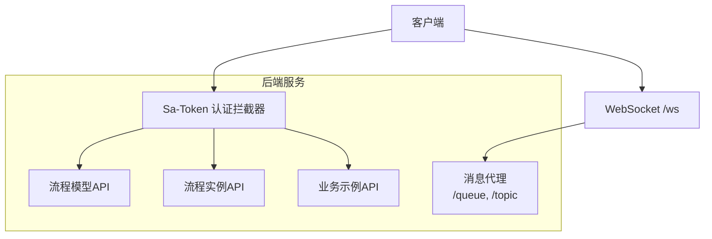
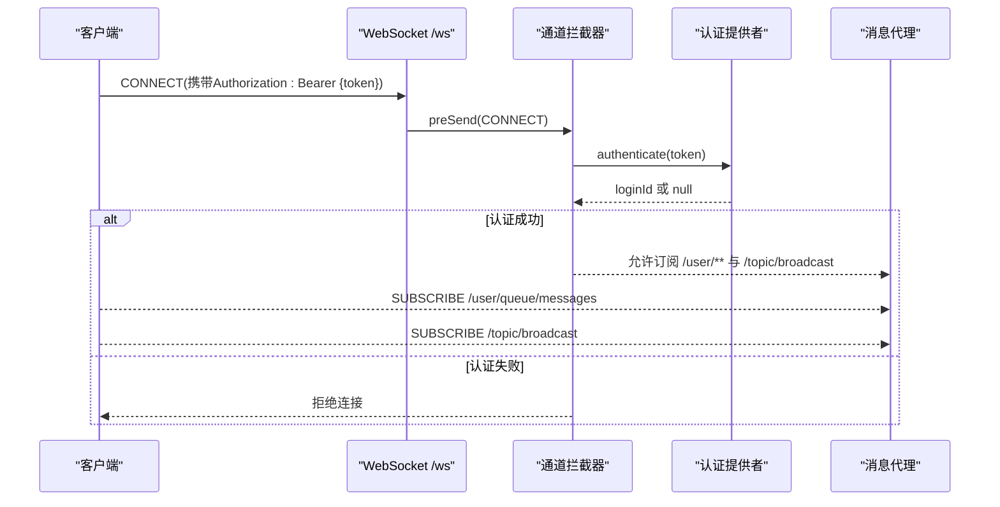
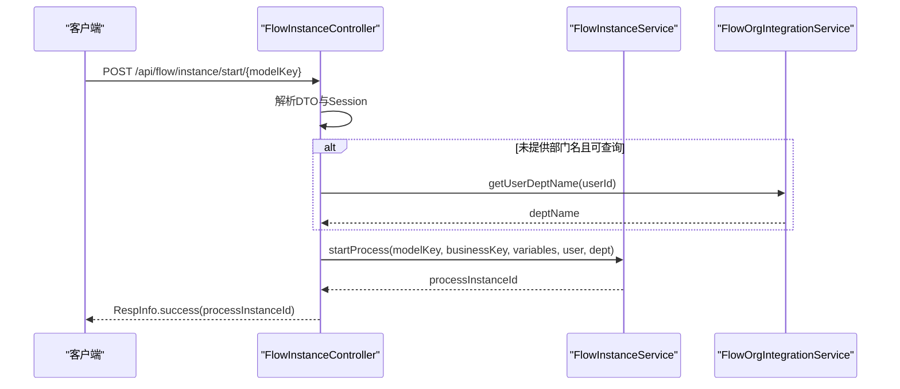
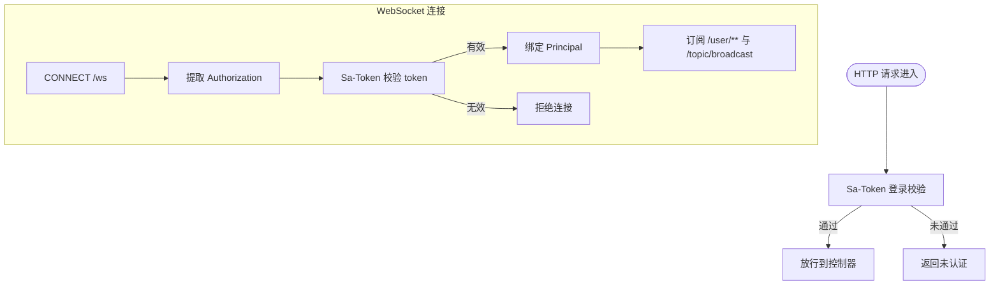
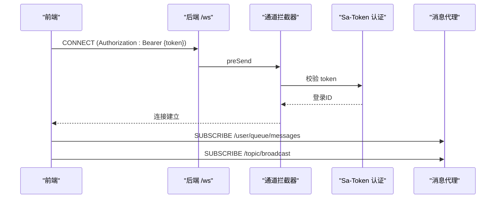
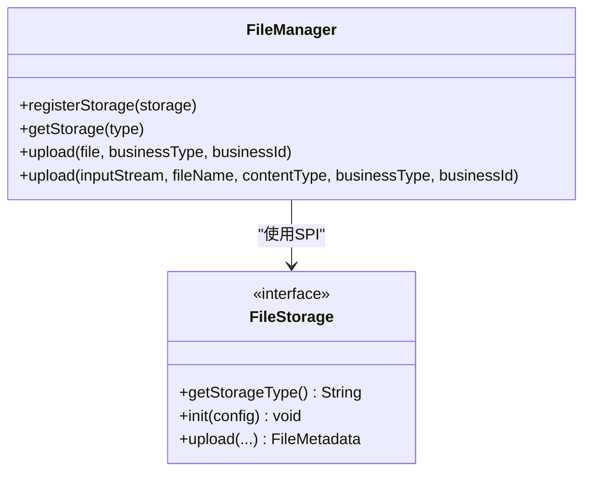
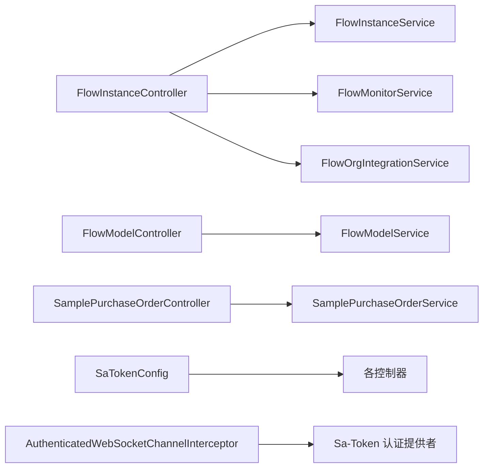

# API参考文档

<cite>
**本文引用的文件**
- [ForgeAdminApplication.java](file://forge-server/forge-admin-server/src/main/java/com/mdframe/forge/admin/ForgeAdminApplication.java)
- [FlowInstanceController.java](file://forge-server/forge-flow/forge-flow-server/src/main/java/com/mdframe/forge/flow/controller/FlowInstanceController.java)
- [FlowModelController.java](file://forge-server/forge-flow/forge-flow-server/src/main/java/com/mdframe/forge/flow/controller/FlowModelController.java)
- [SamplePurchaseOrderController.java](file://forge-server/forge-business/forge-business-core/src/main/java/com/mdframe/forge/business/core/purchase/controller/SamplePurchaseOrderController.java)
- [SaTokenConfig.java](file://forge-server/forge-framework/forge-starter-parent/forge-starter-auth/src/main/java/com/mdframe/forge/starter/auth/config/SaTokenConfig.java)
- [SaTokenWebSocketAuthenticationConfiguration.java](file://forge-server/forge-framework/forge-starter-parent/forge-starter-auth/src/main/java/com/mdframe/forge/starter/auth/config/SaTokenWebSocketAuthenticationConfiguration.java)
- [WebSocketConfig.java](file://forge-server/forge-framework/forge-starter-parent/forge-starter-websocket/src/main/java/com/mdframe/forge/starter/websocket/config/WebSocketConfig.java)
- [AuthenticatedWebSocketChannelInterceptor.java](file://forge-server/forge-framework/forge-starter-parent/forge-starter-websocket/src/main/java/com/mdframe/forge/starter/websocket/security/AuthenticatedWebSocketChannelInterceptor.java)
- [WebSocketProperties.java](file://forge-server/forge-framework/forge-starter-parent/forge-starter-websocket/src/main/java/com/mdframe/forge/starter/websocket/security/WebSocketProperties.java)
- [FileManager.java](file://forge-server/forge-framework/forge-starter-parent/forge-starter-file/src/main/java/com/mdframe/forge/starter/file/core/FileManager.java)
- [FileStorage.java](file://forge-server/forge-framework/forge-starter-parent/forge-starter-file/src/main/java/com/mdframe/forge/starter/file/storage/FileStorage.java)
- [websocket.js](file://forge-admin-ui/src/utils/websocket.js)
</cite>

## 目录
1. [简介](#简介)
2. [项目结构](#项目结构)
3. [核心组件](#核心组件)
4. [架构总览](#架构总览)
5. [详细组件分析](#详细组件分析)
6. [依赖关系分析](#依赖关系分析)
7. [性能考虑](#性能考虑)
8. [故障排查指南](#故障排查指南)
9. [结论](#结论)
10. [附录](#附录)

## 简介
本参考文档面向 Forge Admin 后端服务，系统化说明 RESTful API 接口规范、认证与鉴权方式、数据交互格式，并覆盖工作流、低代码业务示例、文件上传下载、WebSocket 实时通信等能力。文档以实际控制器与框架配置为依据，提供调用路径、请求参数、响应结构与错误处理策略，帮助开发者快速集成与排障。

## 项目结构
- 应用入口：Spring Boot 启动类扫描基础包并启用 AOP 代理与 MyBatis Mapper 扫描。
- 工作流模块：流程模型与实例管理控制器位于 flow-server。
- 业务示例：采购单审批示例控制器位于 business-core。
- 安全与认证：基于 Sa-Token 的拦截器与 WebSocket 认证配置。
- 实时通信：STOMP over SockJS，统一端点 /ws，支持用户队列与广播主题。
- 文件能力：统一的 FileManager 抽象与 FileStorage SPI，支持多存储策略。

图表来源
- [SaTokenConfig.java:29-73](file://forge-server/forge-framework/forge-starter-parent/forge-starter-auth/src/main/java/com/mdframe/forge/starter/auth/config/SaTokenConfig.java#L29-L73)
- [FlowModelController.java:23-29](file://forge-server/forge-flow/forge-flow-server/src/main/java/com/mdframe/forge/flow/controller/FlowModelController.java#L23-L29)
- [FlowInstanceController.java:31-37](file://forge-server/forge-flow/forge-flow-server/src/main/java/com/mdframe/forge/flow/controller/FlowInstanceController.java#L31-L37)
- [WebSocketConfig.java:33-62](file://forge-server/forge-framework/forge-starter-parent/forge-starter-websocket/src/main/java/com/mdframe/forge/starter/websocket/config/WebSocketConfig.java#L33-L62)

章节来源
- [ForgeAdminApplication.java:8-15](file://forge-server/forge-admin-server/src/main/java/com/mdframe/forge/admin/ForgeAdminApplication.java#L8-L15)

## 核心组件
- 工作流模型管理：提供模型的增删改查、导入导出、版本历史、启用/禁用/激活/挂起/部署等操作。
- 工作流实例管理：提供发起流程（含委托发起）、查询状态、终止、删除、变量读写、分页与详情。
- 业务示例：采购单CRUD与提交审批、待办字段保存、初始化测试流程。
- 认证与权限：全局 Sa-Token 登录校验与白名单；部分接口使用注解进行细粒度权限控制。
- 实时通信：STOMP over SockJS，用户队列与广播主题，连接时强制 Bearer Token 认证。
- 文件能力：统一上传/下载/删除，支持多种存储实现与类型白名单校验。

章节来源
- [FlowModelController.java:33-231](file://forge-server/forge-flow/forge-flow-server/src/main/java/com/mdframe/forge/flow/controller/FlowModelController.java#L33-L231)
- [FlowInstanceController.java:44-238](file://forge-server/forge-flow/forge-flow-server/src/main/java/com/mdframe/forge/flow/controller/FlowInstanceController.java#L44-L238)
- [SamplePurchaseOrderController.java:39-90](file://forge-server/forge-business/forge-business-core/src/main/java/com/mdframe/forge/business/core/purchase/controller/SamplePurchaseOrderController.java#L39-L90)
- [SaTokenConfig.java:29-73](file://forge-server/forge-framework/forge-starter-parent/forge-starter-auth/src/main/java/com/mdframe/forge/starter/auth/config/SaTokenConfig.java#L29-L73)
- [WebSocketConfig.java:33-62](file://forge-server/forge-framework/forge-starter-parent/forge-starter-websocket/src/main/java/com/mdframe/forge/starter/websocket/config/WebSocketConfig.java#L33-L62)
- [FileManager.java:31-95](file://forge-server/forge-framework/forge-starter-parent/forge-starter-file/src/main/java/com/mdframe/forge/starter/file/core/FileManager.java#L31-L95)

## 架构总览
系统采用分层与模块化设计：
- 接入层：REST 控制器暴露 API，统一返回 RespInfo；WebSocket 通过 STOMP 暴露 /ws 端点。
- 安全层：Sa-Token 全局拦截器负责登录态校验与路由白名单；WebSocket 通道拦截器强制 Bearer Token 认证。
- 领域层：工作流、业务示例等控制器调用各自 Service 完成业务逻辑。
- 基础设施：文件存储 SPI、消息代理、数据库访问等由 Starter 提供。

图表来源
- [WebSocketConfig.java:47-62](file://forge-server/forge-framework/forge-starter-parent/forge-starter-websocket/src/main/java/com/mdframe/forge/starter/websocket/config/WebSocketConfig.java#L47-L62)
- [AuthenticatedWebSocketChannelInterceptor.java:53-78](file://forge-server/forge-framework/forge-starter-parent/forge-starter-websocket/src/main/java/com/mdframe/forge/starter/websocket/security/AuthenticatedWebSocketChannelInterceptor.java#L53-L78)
- [SaTokenWebSocketAuthenticationConfiguration.java:15-22](file://forge-server/forge-framework/forge-starter-parent/forge-starter-auth/src/main/java/com/mdframe/forge/starter/auth/config/SaTokenWebSocketAuthenticationConfiguration.java#L15-L22)

## 详细组件分析

### 工作流模型管理 API
- 基础信息
  - 前缀：/api/flow/model
  - 加解密：启用 ApiDecrypt/ApiEncrypt
  - 租户隔离：IgnoreTenant
- 主要接口
  - GET /api/flow/model/page：分页查询模型（支持名称、分类、状态过滤）
  - GET /api/flow/model/enabled：获取启用的模型列表（可选分类）
  - GET /api/flow/model/statistics：模型状态统计
  - GET /api/flow/model/{id}：按ID获取模型详情
  - GET /api/flow/model/key/{modelKey}：按Key获取模型
  - GET /api/flow/model/key/{modelKey}/start-config：获取模型启动表单配置
  - POST /api/flow/model：创建模型
  - PUT /api/flow/model：更新模型
  - DELETE /api/flow/model/{id}：删除模型
  - POST /api/flow/model/{id}/deploy：部署模型
  - POST /api/flow/model/{id}/suspend：挂起模型
  - POST /api/flow/model/{id}/activate：激活模型
  - POST /api/flow/model/{id}/disable：禁用模型
  - POST /api/flow/model/{id}/enable：启用模型
  - GET /api/flow/model/{modelKey}/versions：查看版本历史
  - POST /api/flow/model/import：导入 BPMN XML（multipart file）
  - GET /api/flow/model/{id}/export：导出 BPMN XML
  - POST /api/flow/model/{id}/copy：复制模型
  - GET /api/flow/model/checkKey：检查 Key 是否存在
  - GET /api/flow/model/list：下拉选择用模型列表

- 请求与响应
  - 请求：分页参数 pageNum、pageSize；过滤参数 modelName、category、status；导入为 multipart/form-data 字段 file。
  - 响应：统一 RespInfo<T>，成功时 data 包含对应实体或集合。

- 调用示例（描述）
  - 分页查询：GET /api/flow/model/page?pageNum=1&pageSize=10&category=HR
  - 导入模型：POST /api/flow/model/import，Content-Type: multipart/form-data，字段 file 为 BPMN XML 文件。

- 错误处理
  - 导入异常会返回错误信息（例如解析失败）。
  - 其他操作失败通常返回 RespInfo.error。

章节来源
- [FlowModelController.java:33-231](file://forge-server/forge-flow/forge-flow-server/src/main/java/com/mdframe/forge/flow/controller/FlowModelController.java#L33-L231)

### 工作流实例管理 API
- 基础信息
  - 前缀：/api/flow/instance
  - 加解密：启用 ApiDecrypt/ApiEncrypt
  - 租户隔离：IgnoreTenant
- 主要接口
  - POST /api/flow/instance/start/{modelKey}：发起流程
  - POST /api/flow/instance/start-delegated/{modelKey}：委托发起（需可信会话）
  - POST /api/flow/instance/start-delegated-approval/{modelKey}：高风险审批专用委托入口（需特定权限）
  - GET /api/flow/instance/status/{businessKey}：查询流程状态
  - POST /api/flow/instance/terminate/{businessKey}：终止流程
  - DELETE /api/flow/instance/{businessKey}：删除流程实例
  - GET /api/flow/instance/variables/{businessKey}：获取流程变量
  - PUT /api/flow/instance/variables/{businessKey}：更新流程变量
  - GET /api/flow/instance/page：分页查询实例（支持 processDefKey、status、title、applyUserId）
  - GET /api/flow/instance/detail/{processInstanceId}：按实例ID获取详情

- 请求与响应
  - 发起流程：path modelKey；body 包含 businessKey、businessType、title、userId、userName、deptId、deptName、变量等。
  - 委托发起：必须通过已验证的 Session，服务端从会话解析发起人、租户与组织。
  - 终止/删除：body 或 query 可传入 userId；删除支持可选 userId。
  - 分页：pageNum、pageSize 及可选过滤条件。
  - 响应：RespInfo<String>/RespInfo<Void>/RespInfo<FlowBusiness>/RespInfo<Map> 等。

- 调用示例（描述）
  - 发起流程：POST /api/flow/instance/start/leave，body 指定业务键、标题与变量。
  - 委托发起：POST /api/flow/instance/start-delegated/leave，需具备可信会话上下文。

- 错误处理
  - 委托发起缺少可信会话将抛出非法参数异常（提示需要委托）。
  - 其他业务异常由上层统一处理。

图表来源
- [FlowInstanceController.java:44-145](file://forge-server/forge-flow/forge-flow-server/src/main/java/com/mdframe/forge/flow/controller/FlowInstanceController.java#L44-L145)

章节来源
- [FlowInstanceController.java:44-238](file://forge-server/forge-flow/forge-flow-server/src/main/java/com/mdframe/forge/flow/controller/FlowInstanceController.java#L44-L238)

### 业务示例：采购单审批
- 基础信息
  - 前缀：/business/sample-purchase-order
  - 加解密：启用 ApiDecrypt/ApiEncrypt
  - 日志：关键操作标注 OperationLog
- 主要接口
  - GET /business/sample-purchase-order/page：分页查询
  - POST /business/sample-purchase-order/getById：按ID或业务键查询详情
  - POST /business/sample-purchase-order/add：新增
  - POST /business/sample-purchase-order/edit：修改
  - POST /business/sample-purchase-order/remove/{id}：删除
  - POST /business/sample-purchase-order/submit/{id}：提交审批
  - POST /business/sample-purchase-order/task/save：保存待办节点字段
  - POST /business/sample-purchase-order/init-flow：初始化测试流程

- 请求与响应
  - 分页：PageQuery + 查询条件对象。
  - 详情：id 或 businessKey 二选一。
  - 提交：提交体包含审批相关字段。
  - 响应：RespInfo<T>。

- 调用示例（描述）
  - 提交审批：POST /business/sample-purchase-order/submit/{id}，body 为提交数据。

章节来源
- [SamplePurchaseOrderController.java:39-90](file://forge-server/forge-business/forge-business-core/src/main/java/com/mdframe/forge/business/core/purchase/controller/SamplePurchaseOrderController.java#L39-L90)

### 认证与鉴权
- HTTP 认证
  - 全局登录校验：Sa-Token 拦截器对所有 / 路由生效，排除登录、注册、重置密码、验证码、静态资源、MCP、定时任务开放API、能力开放网关等路径。
  - 细粒度权限：部分接口使用 @SaCheckPermission 注解进行权限校验（如委托发起的高风险审批入口）。
- WebSocket 认证
  - 端点：/ws（支持 SockJS），客户端需在 CONNECT 头中携带 Authorization: Bearer {token}。
  - 认证提供者：默认基于 Sa-Token 校验 token 有效性并绑定登录ID。
  - 目标限制：仅允许订阅 /user/** 与 /topic/broadcast；禁止直发 broker。

图表来源
- [SaTokenConfig.java:29-73](file://forge-server/forge-framework/forge-starter-parent/forge-starter-auth/src/main/java/com/mdframe/forge/starter/auth/config/SaTokenConfig.java#L29-L73)
- [SaTokenWebSocketAuthenticationConfiguration.java:15-22](file://forge-server/forge-framework/forge-starter-parent/forge-starter-auth/src/main/java/com/mdframe/forge/starter/auth/config/SaTokenWebSocketAuthenticationConfiguration.java#L15-L22)
- [AuthenticatedWebSocketChannelInterceptor.java:53-78](file://forge-server/forge-framework/forge-starter-parent/forge-starter-websocket/src/main/java/com/mdframe/forge/starter/websocket/security/AuthenticatedWebSocketChannelInterceptor.java#L53-L78)

章节来源
- [SaTokenConfig.java:29-73](file://forge-server/forge-framework/forge-starter-parent/forge-starter-auth/src/main/java/com/mdframe/forge/starter/auth/config/SaTokenConfig.java#L29-L73)
- [SaTokenWebSocketAuthenticationConfiguration.java:15-22](file://forge-server/forge-framework/forge-starter-parent/forge-starter-auth/src/main/java/com/mdframe/forge/starter/auth/config/SaTokenWebSocketAuthenticationConfiguration.java#L15-L22)

### 实时通信（WebSocket）
- 前端连接
  - 使用 SockJS 连接 /ws，并通过 STOMP 客户端订阅 /user/queue/messages 与 /topic/broadcast。
  - 仅在存在 accessToken 与 userId 时初始化连接，避免重复连接。
- 后端配置
  - 启用简单消息代理 /queue 与 /topic，设置用户目的地前缀 /user。
  - 客户端发送消息需以 /app 为前缀，禁止直发 broker。
  - 允许的跨域模式与订阅目标可通过配置项调整。

图表来源
- [websocket.js:13-88](file://forge-admin-ui/src/utils/websocket.js#L13-L88)
- [WebSocketConfig.java:33-62](file://forge-server/forge-framework/forge-starter-parent/forge-starter-websocket/src/main/java/com/mdframe/forge/starter/websocket/config/WebSocketConfig.java#L33-L62)
- [AuthenticatedWebSocketChannelInterceptor.java:53-78](file://forge-server/forge-framework/forge-starter-parent/forge-starter-websocket/src/main/java/com/mdframe/forge/starter/websocket/security/AuthenticatedWebSocketChannelInterceptor.java#L53-L78)

章节来源
- [websocket.js:13-88](file://forge-admin-ui/src/utils/websocket.js#L13-L88)
- [WebSocketConfig.java:33-62](file://forge-server/forge-framework/forge-starter-parent/forge-starter-websocket/src/main/java/com/mdframe/forge/starter/websocket/config/WebSocketConfig.java#L33-L62)
- [WebSocketProperties.java:12-36](file://forge-server/forge-framework/forge-starter-parent/forge-starter-websocket/src/main/java/com/mdframe/forge/starter/websocket/security/WebSocketProperties.java#L12-L36)

### 文件上传与下载
- 能力概述
  - 统一 FileManager 提供上传、下载、删除等操作，内部根据 storageType 路由到具体 FileStorage 实现。
  - 支持类型白名单校验与最大文件大小限制。
  - 元数据持久化与存储配置可通过 SPI 扩展。
- 典型用法
  - 上传：调用 upload(file, businessType, businessId) 或 upload(inputStream, fileName, contentType, businessType, businessId)。
  - 下载：通过 FileManager 提供的下载方法读取并写出响应流。
  - 删除：依据文件标识执行删除。
- 安全与校验
  - 若存储允许类型为空则拒绝上传。
  - 支持常见媒体与文档类型的 MIME 映射。

图表来源
- [FileManager.java:31-95](file://forge-server/forge-framework/forge-starter-parent/forge-starter-file/src/main/java/com/mdframe/forge/starter/file/core/FileManager.java#L31-L95)
- [FileStorage.java:9-46](file://forge-server/forge-framework/forge-starter-parent/forge-starter-file/src/main/java/com/mdframe/forge/starter/file/storage/FileStorage.java#L9-L46)

章节来源
- [FileManager.java:31-95](file://forge-server/forge-framework/forge-starter-parent/forge-starter-file/src/main/java/com/mdframe/forge/starter/file/core/FileManager.java#L31-L95)
- [FileStorage.java:9-46](file://forge-server/forge-framework/forge-starter-parent/forge-starter-file/src/main/java/com/mdframe/forge/starter/file/storage/FileStorage.java#L9-L46)

## 依赖关系分析
- 控制器依赖
  - FlowInstanceController 依赖 FlowInstanceService、FlowMonitorService、FlowOrgIntegrationService。
  - FlowModelController 依赖 FlowModelService。
  - SamplePurchaseOrderController 依赖 SamplePurchaseOrderService。
- 安全依赖
  - 所有控制器受 Sa-Token 全局拦截器保护，除白名单路径。
  - WebSocket 通道拦截器依赖认证提供者（默认基于 Sa-Token）。
- 文件能力依赖
  - FileManager 依赖 StorageConfigProvider 与 FileMetadataPersistence（可选），以及多个 FileStorage 实现。

图表来源
- [FlowInstanceController.java:39-42](file://forge-server/forge-flow/forge-flow-server/src/main/java/com/mdframe/forge/flow/controller/FlowInstanceController.java#L39-L42)
- [FlowModelController.java:31-31](file://forge-server/forge-flow/forge-flow-server/src/main/java/com/mdframe/forge/flow/controller/FlowModelController.java#L31-L31)
- [SamplePurchaseOrderController.java:37-37](file://forge-server/forge-business/forge-business-core/src/main/java/com/mdframe/forge/business/core/purchase/controller/SamplePurchaseOrderController.java#L37-L37)
- [SaTokenConfig.java:29-73](file://forge-server/forge-framework/forge-starter-parent/forge-starter-auth/src/main/java/com/mdframe/forge/starter/auth/config/SaTokenConfig.java#L29-L73)
- [AuthenticatedWebSocketChannelInterceptor.java:53-78](file://forge-server/forge-framework/forge-starter-parent/forge-starter-websocket/src/main/java/com/mdframe/forge/starter/websocket/security/AuthenticatedWebSocketChannelInterceptor.java#L53-L78)

章节来源
- [FlowInstanceController.java:39-42](file://forge-server/forge-flow/forge-flow-server/src/main/java/com/mdframe/forge/flow/controller/FlowInstanceController.java#L39-L42)
- [FlowModelController.java:31-31](file://forge-server/forge-flow/forge-flow-server/src/main/java/com/mdframe/forge/flow/controller/FlowModelController.java#L31-L31)
- [SamplePurchaseOrderController.java:37-37](file://forge-server/forge-business/forge-business-core/src/main/java/com/mdframe/forge/business/core/purchase/controller/SamplePurchaseOrderController.java#L37-L37)
- [SaTokenConfig.java:29-73](file://forge-server/forge-framework/forge-starter-parent/forge-starter-auth/src/main/java/com/mdframe/forge/starter/auth/config/SaTokenConfig.java#L29-L73)
- [AuthenticatedWebSocketChannelInterceptor.java:53-78](file://forge-server/forge-framework/forge-starter-parent/forge-starter-websocket/src/main/java/com/mdframe/forge/starter/websocket/security/AuthenticatedWebSocketChannelInterceptor.java#L53-L78)

## 性能考虑
- 分页与查询
  - 工作流实例与模型分页均使用分页参数，建议合理设置 pageSize，避免过大导致内存压力。
  - 对高频查询增加必要索引（如业务键、状态、申请人ID）。
- 流程发起
  - 委托发起需校验会话，减少不必要的参数传递，降低解析开销。
  - 自动补全 businessKey、businessType、title 可减少前端负担，但应确保唯一性与可读性。
- 文件上传
  - 使用类型白名单与大小限制，避免恶意大文件或非法类型导致资源耗尽。
  - 选择合适的存储实现（本地/对象存储）并根据网络与吞吐优化。
- WebSocket
  - 使用心跳与重连机制，避免长连接失效影响体验。
  - 限制订阅目标，防止滥用广播造成消息风暴。

[本节为通用指导，不直接分析具体文件]

## 故障排查指南
- 认证失败
  - HTTP：检查是否命中白名单路径；确认 token 有效且未被吊销。
  - WebSocket：CONNECT 头必须包含 Authorization: Bearer {token}；否则会被通道拦截器拒绝。
- 委托发起失败
  - 缺少可信会话或会话信息不完整（用户ID、租户、组织）将抛出非法参数异常。
- 文件上传被拒
  - 存储允许类型为空或文件类型不在白名单内将被拒绝。
- 消息订阅失败
  - 客户端只能订阅 /user/** 与 /topic/broadcast；尝试直发 broker 将被拒绝。

章节来源
- [SaTokenConfig.java:29-73](file://forge-server/forge-framework/forge-starter-parent/forge-starter-auth/src/main/java/com/mdframe/forge/starter/auth/config/SaTokenConfig.java#L29-L73)
- [AuthenticatedWebSocketChannelInterceptor.java:53-78](file://forge-server/forge-framework/forge-starter-parent/forge-starter-websocket/src/main/java/com/mdframe/forge/starter/websocket/security/AuthenticatedWebSocketChannelInterceptor.java#L53-L78)
- [FlowInstanceController.java:94-99](file://forge-server/forge-flow/forge-flow-server/src/main/java/com/mdframe/forge/flow/controller/FlowInstanceController.java#L94-L99)
- [FileManager.java:31-95](file://forge-server/forge-framework/forge-starter-parent/forge-starter-file/src/main/java/com/mdframe/forge/starter/file/core/FileManager.java#L31-L95)

## 结论
本参考文档基于仓库中的控制器与安全配置，梳理了 Forge Admin 的核心 API 能力与集成要点。工作流模块提供完整的模型与实例管理能力；业务示例展示了低代码场景下的 CRUD 与审批流程；认证与 WebSocket 提供了安全的接入与实时通信能力；文件能力通过 SPI 实现了可扩展的存储策略。建议在实际集成中遵循分页、限流、白名单与最小权限原则，并结合监控与日志完善可观测性。

[本节为总结，不直接分析具体文件]

## 附录
- 统一响应体
  - 所有接口返回 RespInfo<T>，成功时 data 为业务数据，错误时包含错误信息。
- 常用路径汇总
  - 工作流模型：/api/flow/model/*
  - 工作流实例：/api/flow/instance/*
  - 业务示例：/business/sample-purchase-order/*
  - WebSocket：/ws（SockJS + STOMP）
- 前端 WebSocket 使用
  - 在拥有 accessToken 与 userId 后初始化连接，订阅 /user/queue/messages 与 /topic/broadcast。

[本节为补充说明，不直接分析具体文件]