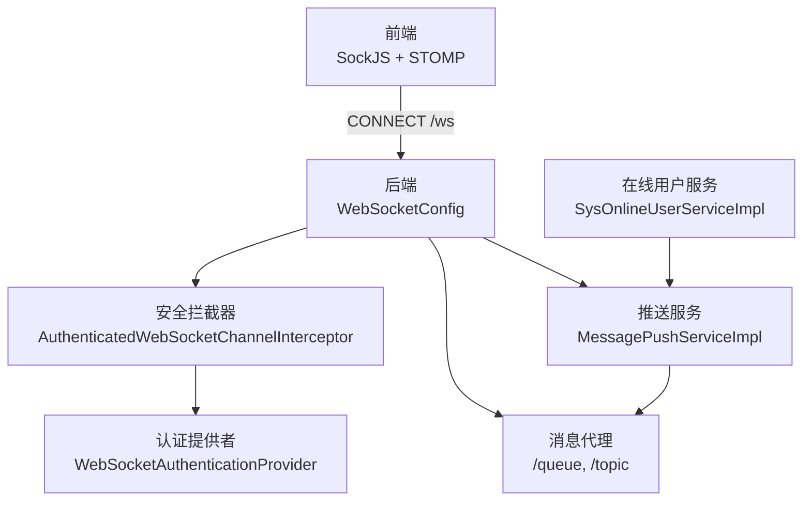
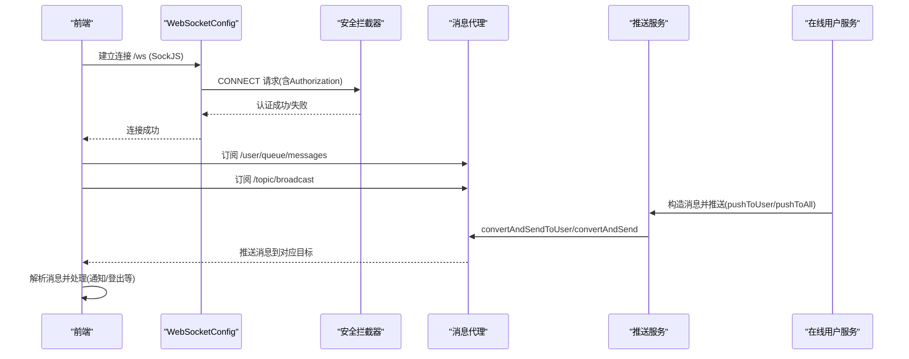
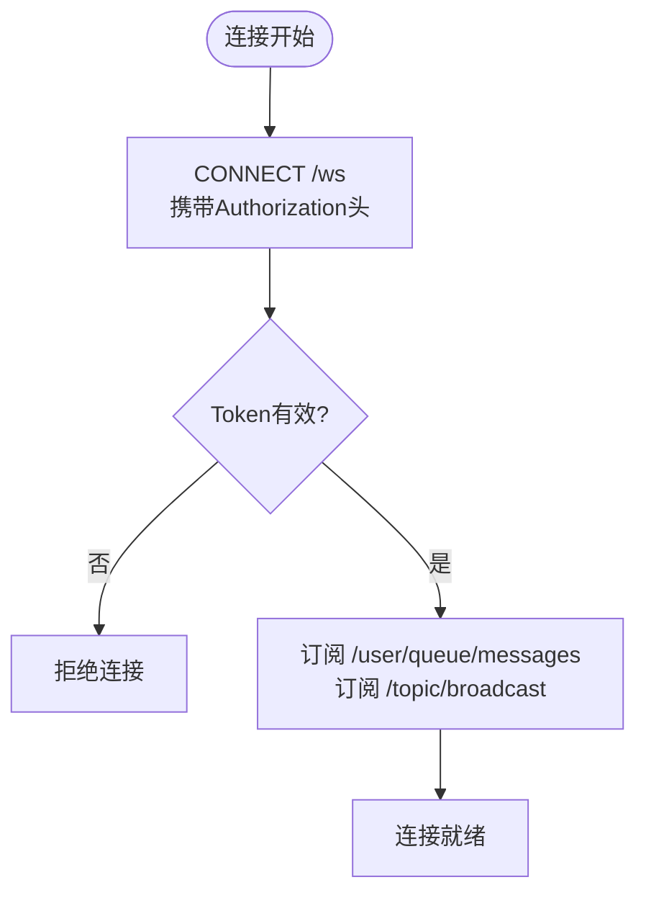
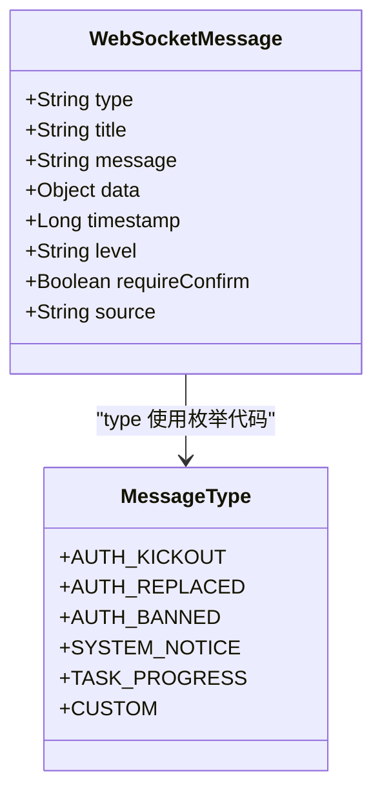
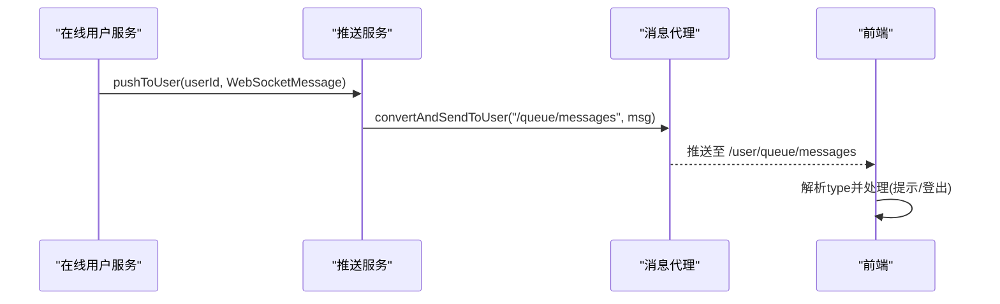
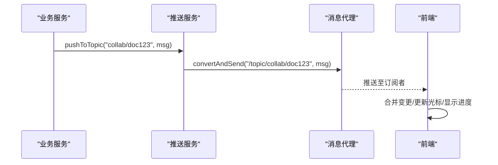
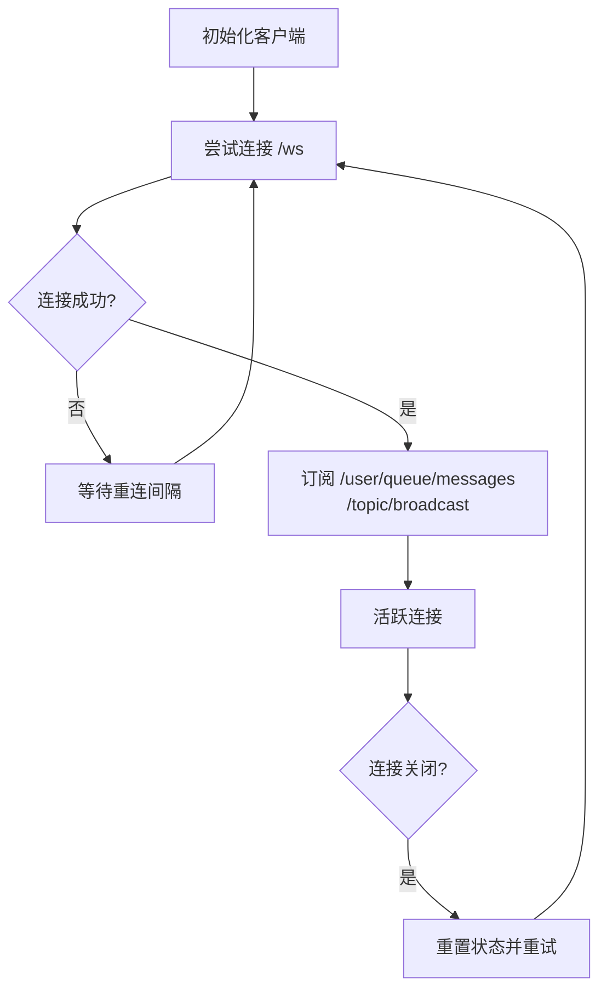
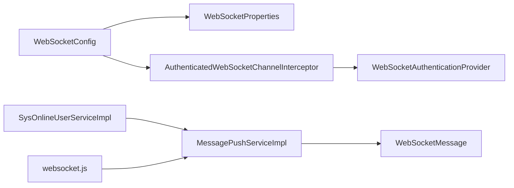

# WebSocket实时通信API

<cite>
**本文引用的文件**
- [WebSocketConfig.java](file://forge-server/forge-framework/forge-starter-parent/forge-starter-websocket/src/main/java/com/mdframe/forge/starter/websocket/config/WebSocketConfig.java)
- [WebSocketMessage.java](file://forge-server/forge-framework/forge-starter-parent/forge-starter-websocket/src/main/java/com/mdframe/forge/starter/websocket/domain/WebSocketMessage.java)
- [IMessagePushService.java](file://forge-server/forge-framework/forge-starter-parent/forge-starter-websocket/src/main/java/com/mdframe/forge/starter/websocket/service/IMessagePushService.java)
- [MessagePushServiceImpl.java](file://forge-server/forge-framework/forge-starter-parent/forge-starter-websocket/src/main/java/com/mdframe/forge/starter/websocket/service/impl/MessagePushServiceImpl.java)
- [AuthenticatedWebSocketChannelInterceptor.java](file://forge-server/forge-framework/forge-starter-parent/forge-starter-websocket/src/main/java/com/mdframe/forge/starter/websocket/security/AuthenticatedWebSocketChannelInterceptor.java)
- [WebSocketProperties.java](file://forge-server/forge-framework/forge-starter-parent/forge-starter-websocket/src/main/java/com/mdframe/forge/starter/websocket/security/WebSocketProperties.java)
- [MessageType.java](file://forge-server/forge-framework/forge-starter-parent/forge-starter-websocket/src/main/java/com/mdframe/forge/starter/websocket/enums/MessageType.java)
- [SysOnlineUserServiceImpl.java](file://forge-server/forge-framework/forge-plugin-parent/forge-plugin-system/src/main/java/com/mdframe/forge/plugin/system/service/impl/SysOnlineUserServiceImpl.java)
- [websocket.js](file://forge-admin-ui/src/utils/websocket.js)
</cite>

## 目录
1. [简介](#简介)
2. [项目结构](#项目结构)
3. [核心组件](#核心组件)
4. [架构总览](#架构总览)
5. [详细组件分析](#详细组件分析)
6. [依赖关系分析](#依赖关系分析)
7. [性能与优化](#性能与优化)
8. [故障排查指南](#故障排查指南)
9. [结论](#结论)
10. [附录：接口规范与示例](#附录接口规范与示例)

## 简介
本文件为 Forge Admin 的 WebSocket 实时通信 API 文档，覆盖连接建立、消息格式、事件类型、状态管理、在线用户通知、实时消息推送、协作编辑与进度同步等能力。同时说明连接管理、重连机制、消息队列与性能优化策略，并提供前端实现要点与调试技巧。

## 项目结构
后端基于 Spring WebSocket + STOMP 提供消息代理与安全拦截；前端使用 SockJS + STOMP 客户端进行连接与订阅。关键路径如下：
- 后端配置与端点：注册 /ws 端点、启用简单消息代理（/queue、/topic）、设置应用目的地前缀与用户目标前缀
- 安全认证：通过拦截器校验 CONNECT 请求中的 Bearer Token，限制可订阅目标与应用发送目的地
- 消息推送：统一消息体 WebSocketMessage，服务层封装 pushToUser/pushToAll/pushToTopic 等方法
- 业务集成：在线用户服务在踢下线、被顶、封禁等场景构造并推送消息
- 前端：初始化 STOMP 客户端，订阅 /user/queue/messages 与 /topic/broadcast，处理认证相关消息并提示

图表来源
- [WebSocketConfig.java:20-62](file://forge-server/forge-framework/forge-starter-parent/forge-starter-websocket/src/main/java/com/mdframe/forge/starter/websocket/config/WebSocketConfig.java#L20-L62)
- [AuthenticatedWebSocketChannelInterceptor.java:32-50](file://forge-server/forge-framework/forge-starter-parent/forge-starter-websocket/src/main/java/com/mdframe/forge/starter/websocket/security/AuthenticatedWebSocketChannelInterceptor.java#L32-L50)
- [MessagePushServiceImpl.java:21-97](file://forge-server/forge-framework/forge-starter-parent/forge-starter-websocket/src/main/java/com/mdframe/forge/starter/websocket/service/impl/MessagePushServiceImpl.java#L21-L97)
- [SysOnlineUserServiceImpl.java:300-386](file://forge-server/forge-framework/forge-plugin-parent/forge-plugin-system/src/main/java/com/mdframe/forge/plugin/system/service/impl/SysOnlineUserServiceImpl.java#L300-L386)

章节来源
- [WebSocketConfig.java:20-62](file://forge-server/forge-framework/forge-starter-parent/forge-starter-websocket/src/main/java/com/mdframe/forge/starter/websocket/config/WebSocketConfig.java#L20-L62)
- [websocket.js:13-88](file://forge-admin-ui/src/utils/websocket.js#L13-L88)

## 核心组件
- 连接与端点配置：注册 /ws 端点，启用 SockJS，配置消息代理与用户目标前缀
- 安全拦截：强制 CONNECT 携带 Bearer Token，限制订阅目标与应用发送目的地
- 消息模型：统一消息体包含类型、标题、内容、数据、时间戳、级别、确认标志、来源
- 推送服务：面向用户、多用户、广播、主题的消息推送，支持异步
- 业务集成：在线用户服务在认证相关事件中构造并推送消息
- 前端客户端：初始化连接、自动重连、心跳、订阅个人队列与广播主题、解析并处理消息

章节来源
- [WebSocketConfig.java:20-62](file://forge-server/forge-framework/forge-starter-parent/forge-starter-websocket/src/main/java/com/mdframe/forge/starter/websocket/config/WebSocketConfig.java#L20-L62)
- [WebSocketMessage.java:17-99](file://forge-server/forge-framework/forge-starter-parent/forge-starter-websocket/src/main/java/com/mdframe/forge/starter/websocket/domain/WebSocketMessage.java#L17-L99)
- [IMessagePushService.java:10-67](file://forge-server/forge-framework/forge-starter-parent/forge-starter-websocket/src/main/java/com/mdframe/forge/starter/websocket/service/IMessagePushService.java#L10-L67)
- [MessagePushServiceImpl.java:21-111](file://forge-server/forge-framework/forge-starter-parent/forge-starter-websocket/src/main/java/com/mdframe/forge/starter/websocket/service/impl/MessagePushServiceImpl.java#L21-L111)
- [AuthenticatedWebSocketChannelInterceptor.java:32-86](file://forge-server/forge-framework/forge-starter-parent/forge-starter-websocket/src/main/java/com/mdframe/forge/starter/websocket/security/AuthenticatedWebSocketChannelInterceptor.java#L32-L86)
- [websocket.js:13-163](file://forge-admin-ui/src/utils/websocket.js#L13-L163)

## 架构总览
下图展示从前端连接到消息推送的完整流程，包括认证、订阅、推送与前端处理。

图表来源
- [WebSocketConfig.java:33-62](file://forge-server/forge-framework/forge-starter-parent/forge-starter-websocket/src/main/java/com/mdframe/forge/starter/websocket/config/WebSocketConfig.java#L33-L62)
- [AuthenticatedWebSocketChannelInterceptor.java:53-64](file://forge-server/forge-framework/forge-starter-parent/forge-starter-websocket/src/main/java/com/mdframe/forge/starter/websocket/security/AuthenticatedWebSocketChannelInterceptor.java#L53-L64)
- [MessagePushServiceImpl.java:27-97](file://forge-server/forge-framework/forge-starter-parent/forge-starter-websocket/src/main/java/com/mdframe/forge/starter/websocket/service/impl/MessagePushServiceImpl.java#L27-L97)
- [SysOnlineUserServiceImpl.java:300-386](file://forge-server/forge-framework/forge-plugin-parent/forge-plugin-system/src/main/java/com/mdframe/forge/plugin/system/service/impl/SysOnlineUserServiceImpl.java#L300-L386)
- [websocket.js:60-88](file://forge-admin-ui/src/utils/websocket.js#L60-L88)

## 详细组件分析

### 连接建立与认证
- 端点：/ws，启用 SockJS，允许跨域由配置控制
- 认证：CONNECT 必须携带 Authorization: Bearer <token>，由拦截器提取并通过认证提供者校验
- 订阅限制：仅允许订阅 /user/** 与 /topic/broadcast
- 应用发送限制：客户端只能发送到以 /app 开头的目的地，禁止直发 Broker

图表来源
- [WebSocketConfig.java:56-62](file://forge-server/forge-framework/forge-starter-parent/forge-starter-websocket/src/main/java/com/mdframe/forge/starter/websocket/config/WebSocketConfig.java#L56-L62)
- [AuthenticatedWebSocketChannelInterceptor.java:53-86](file://forge-server/forge-framework/forge-starter-parent/forge-starter-websocket/src/main/java/com/mdframe/forge/starter/websocket/security/AuthenticatedWebSocketChannelInterceptor.java#L53-L86)
- [WebSocketProperties.java:19-36](file://forge-server/forge-framework/forge-starter-parent/forge-starter-websocket/src/main/java/com/mdframe/forge/starter/websocket/security/WebSocketProperties.java#L19-L36)

章节来源
- [WebSocketConfig.java:20-62](file://forge-server/forge-framework/forge-starter-parent/forge-starter-websocket/src/main/java/com/mdframe/forge/starter/websocket/config/WebSocketConfig.java#L20-L62)
- [AuthenticatedWebSocketChannelInterceptor.java:32-86](file://forge-server/forge-framework/forge-starter-parent/forge-starter-websocket/src/main/java/com/mdframe/forge/starter/websocket/security/AuthenticatedWebSocketChannelInterceptor.java#L32-L86)
- [WebSocketProperties.java:19-36](file://forge-server/forge-framework/forge-starter-parent/forge-starter-websocket/src/main/java/com/mdframe/forge/starter/websocket/security/WebSocketProperties.java#L19-L36)

### 消息格式与事件类型
- 统一消息体字段：type、title、message、data、timestamp、level、requireConfirm、source
- 内置消息类型枚举涵盖认证、系统通知、任务进度、业务通知等
- 前端按 type 分支处理，如 auth.kickout、auth.replaced、auth.banned 触发登出或提示

图表来源
- [WebSocketMessage.java:17-99](file://forge-server/forge-framework/forge-starter-parent/forge-starter-websocket/src/main/java/com/mdframe/forge/starter/websocket/domain/WebSocketMessage.java#L17-L99)
- [MessageType.java:11-110](file://forge-server/forge-framework/forge-starter-parent/forge-starter-websocket/src/main/java/com/mdframe/forge/starter/websocket/enums/MessageType.java#L11-L110)

章节来源
- [WebSocketMessage.java:17-99](file://forge-server/forge-framework/forge-starter-parent/forge-starter-websocket/src/main/java/com/mdframe/forge/starter/websocket/domain/WebSocketMessage.java#L17-L99)
- [MessageType.java:11-110](file://forge-server/forge-framework/forge-starter-parent/forge-starter-websocket/src/main/java/com/mdframe/forge/starter/websocket/enums/MessageType.java#L11-L110)
- [websocket.js:110-163](file://forge-admin-ui/src/utils/websocket.js#L110-L163)

### 在线用户通知与状态管理
- 踢下线、被顶、封禁等场景由在线用户服务构造消息并通过推送服务发送至对应用户
- 消息包含 userId 等上下文，前端根据当前登录用户过滤并执行相应操作（如清理本地状态）

图表来源
- [SysOnlineUserServiceImpl.java:300-386](file://forge-server/forge-framework/forge-plugin-parent/forge-plugin-system/src/main/java/com/mdframe/forge/plugin/system/service/impl/SysOnlineUserServiceImpl.java#L300-L386)
- [MessagePushServiceImpl.java:27-49](file://forge-server/forge-framework/forge-starter-parent/forge-starter-websocket/src/main/java/com/mdframe/forge/starter/websocket/service/impl/MessagePushServiceImpl.java#L27-L49)
- [websocket.js:60-88](file://forge-admin-ui/src/utils/websocket.js#L60-L88)

章节来源
- [SysOnlineUserServiceImpl.java:300-386](file://forge-server/forge-framework/forge-plugin-parent/forge-plugin-system/src/main/java/com/mdframe/forge/plugin/system/service/impl/SysOnlineUserServiceImpl.java#L300-L386)
- [MessagePushServiceImpl.java:27-49](file://forge-server/forge-framework/forge-starter-parent/forge-starter-websocket/src/main/java/com/mdframe/forge/starter/websocket/service/impl/MessagePushServiceImpl.java#L27-L49)
- [websocket.js:110-163](file://forge-admin-ui/src/utils/websocket.js#L110-L163)

### 实时消息推送与协作编辑
- 通用推送：pushToUser、pushToUsers、pushToAll、pushToTopic
- 协作编辑建议：将编辑变更作为业务消息通过 pushToTopic 推送到特定主题（如 /topic/collab/{docId}），前端订阅该主题实现多人协同
- 进度同步：使用 task.progress 类型消息，结合 data 中的进度信息，前端实时更新 UI

图表来源
- [MessagePushServiceImpl.java:82-97](file://forge-server/forge-framework/forge-starter-parent/forge-starter-websocket/src/main/java/com/mdframe/forge/starter/websocket/service/impl/MessagePushServiceImpl.java#L82-L97)
- [MessageType.java:50-65](file://forge-server/forge-framework/forge-starter-parent/forge-starter-websocket/src/main/java/com/mdframe/forge/starter/websocket/enums/MessageType.java#L50-L65)

章节来源
- [MessagePushServiceImpl.java:64-97](file://forge-server/forge-framework/forge-starter-parent/forge-starter-websocket/src/main/java/com/mdframe/forge/starter/websocket/service/impl/MessagePushServiceImpl.java#L64-L97)
- [MessageType.java:50-65](file://forge-server/forge-framework/forge-starter-parent/forge-starter-websocket/src/main/java/com/mdframe/forge/starter/websocket/enums/MessageType.java#L50-L65)

### 连接管理与重连机制
- 前端使用 STOMP 客户端的重连延迟与心跳机制，断线后自动重连
- 连接成功后重新订阅个人队列与广播主题
- 断开时重置连接状态，避免重复初始化

图表来源
- [websocket.js:13-88](file://forge-admin-ui/src/utils/websocket.js#L13-L88)
- [websocket.js:93-105](file://forge-admin-ui/src/utils/websocket.js#L93-L105)

章节来源
- [websocket.js:13-105](file://forge-admin-ui/src/utils/websocket.js#L13-L105)

### 消息队列与路由
- 点对点：/user/queue/messages，由 Spring 按已认证用户隔离投递
- 广播：/topic/broadcast，所有订阅者接收
- 自定义主题：/topic/{topicName}，用于协作、进度等场景

章节来源
- [WebSocketConfig.java:33-45](file://forge-server/forge-framework/forge-starter-parent/forge-starter-websocket/src/main/java/com/mdframe/forge/starter/websocket/config/WebSocketConfig.java#L33-L45)
- [MessagePushServiceImpl.java:23-25](file://forge-server/forge-framework/forge-starter-parent/forge-starter-websocket/src/main/java/com/mdframe/forge/starter/websocket/service/impl/MessagePushServiceImpl.java#L23-L25)

## 依赖关系分析
- 配置层：WebSocketConfig 依赖 WebSocketProperties 与认证提供者
- 安全层：AuthenticatedWebSocketChannelInterceptor 依赖认证提供者与属性配置
- 服务层：MessagePushServiceImpl 依赖 SimpMessagingTemplate
- 业务层：SysOnlineUserServiceImpl 依赖推送服务与消息模型
- 前端：websocket.js 依赖 STOMP 客户端与全局消息提示

图表来源
- [WebSocketConfig.java:27-50](file://forge-server/forge-framework/forge-starter-parent/forge-starter-websocket/src/main/java/com/mdframe/forge/starter/websocket/config/WebSocketConfig.java#L27-L50)
- [MessagePushServiceImpl.java:21-25](file://forge-server/forge-framework/forge-starter-parent/forge-starter-websocket/src/main/java/com/mdframe/forge/starter/websocket/service/impl/MessagePushServiceImpl.java#L21-L25)
- [SysOnlineUserServiceImpl.java:300-386](file://forge-server/forge-framework/forge-plugin-parent/forge-plugin-system/src/main/java/com/mdframe/forge/plugin/system/service/impl/SysOnlineUserServiceImpl.java#L300-L386)
- [websocket.js:13-88](file://forge-admin-ui/src/utils/websocket.js#L13-L88)

章节来源
- [WebSocketConfig.java:27-50](file://forge-server/forge-framework/forge-starter-parent/forge-starter-websocket/src/main/java/com/mdframe/forge/starter/websocket/config/WebSocketConfig.java#L27-L50)
- [MessagePushServiceImpl.java:21-25](file://forge-server/forge-framework/forge-starter-parent/forge-starter-websocket/src/main/java/com/mdframe/forge/starter/websocket/service/impl/MessagePushServiceImpl.java#L21-L25)
- [SysOnlineUserServiceImpl.java:300-386](file://forge-server/forge-framework/forge-plugin-parent/forge-plugin-system/src/main/java/com/mdframe/forge/starter/websocket/service/impl/SysOnlineUserServiceImpl.java#L300-L386)
- [websocket.js:13-88](file://forge-admin-ui/src/utils/websocket.js#L13-L88)

## 性能与优化
- 心跳与重连：前端启用心跳与重连延迟，降低网络抖动影响
- 异步推送：服务层提供异步方法减少主线程阻塞
- 批量推送：pushToUsers 循环调用单用户推送，建议在业务层做去重与批处理
- 主题粒度：按文档/会话维度划分主题，避免全量广播造成带宽压力
- 限流与节流：前端对高频协作变更进行节流，服务端可对热点主题做限速
- 日志与监控：推送成功/失败记录日志，便于定位问题

[本节为通用指导，不直接分析具体文件]

## 故障排查指南
- 连接失败：检查 /ws 端点是否可达、跨域配置是否正确、Authorization 头是否携带且有效
- 认证失败：确认 Token 未过期且认证提供者能正确解析
- 订阅被拒：确认订阅目标在允许列表中（/user/**、/topic/broadcast）
- 无法收到消息：检查是否成功订阅、用户是否在线、消息是否推送到正确目标
- 前端解析错误：确保消息体 JSON 格式正确，type 字段匹配预期

章节来源
- [AuthenticatedWebSocketChannelInterceptor.java:53-86](file://forge-server/forge-framework/forge-starter-parent/forge-starter-websocket/src/main/java/com/mdframe/forge/starter/websocket/security/AuthenticatedWebSocketChannelInterceptor.java#L53-L86)
- [websocket.js:60-88](file://forge-admin-ui/src/utils/websocket.js#L60-L88)
- [websocket.js:110-163](file://forge-admin-ui/src/utils/websocket.js#L110-L163)

## 结论
本项目提供了完整的 WebSocket 实时通信能力：安全的连接认证、灵活的消息路由、统一的推送服务与丰富的内置消息类型。前端具备重连与心跳机制，能够稳定接收在线通知、协作变更与进度同步。通过合理划分主题与节流策略，可在高并发场景下保持良好性能。

[本节为总结性内容，不直接分析具体文件]

## 附录：接口规范与示例

### 连接与端点
- 端点：/ws（支持 SockJS）
- 协议：STOMP over WebSocket
- 认证：CONNECT 请求头 Authorization: Bearer <token>
- 订阅目标：/user/queue/messages、/topic/broadcast
- 应用发送目的地前缀：/app（客户端只能发送到 /app/*）

章节来源
- [WebSocketConfig.java:33-62](file://forge-server/forge-framework/forge-starter-parent/forge-starter-websocket/src/main/java/com/mdframe/forge/starter/websocket/config/WebSocketConfig.java#L33-L62)
- [WebSocketProperties.java:19-36](file://forge-server/forge-framework/forge-starter-parent/forge-starter-websocket/src/main/java/com/mdframe/forge/starter/websocket/security/WebSocketProperties.java#L19-L36)

### 消息体定义
- type：消息类型代码（参考 MessageType 枚举）
- title：消息标题
- message：消息内容
- data：业务数据对象
- timestamp：时间戳
- level：info/warning/error/success
- requireConfirm：是否需要确认
- source：消息来源

章节来源
- [WebSocketMessage.java:17-99](file://forge-server/forge-framework/forge-starter-parent/forge-starter-websocket/src/main/java/com/mdframe/forge/starter/websocket/domain/WebSocketMessage.java#L17-L99)
- [MessageType.java:11-110](file://forge-server/forge-framework/forge-starter-parent/forge-starter-websocket/src/main/java/com/mdframe/forge/starter/websocket/enums/MessageType.java#L11-L110)

### 事件类型与用途
- 认证相关：auth.kickout、auth.replaced、auth.banned、auth.password_expire
- 系统通知：system.notice、system.alert、system.maintenance
- 任务相关：task.progress、task.complete、task.failed
- 业务通知：order.status、message.new、approval.notice
- 自定义：custom

章节来源
- [MessageType.java:11-110](file://forge-server/forge-framework/forge-starter-parent/forge-starter-websocket/src/main/java/com/mdframe/forge/starter/websocket/enums/MessageType.java#L11-L110)

### 推送接口与服务方法
- pushToUser(userId, message)：向指定用户推送
- pushToUsers(userIds, message)：向多个用户推送
- pushToAll(message)：广播到所有订阅 /topic/broadcast 的客户端
- pushToTopic(topic, message)：推送到指定主题
- 异步版本：pushToUserAsync、pushToUsersAsync

章节来源
- [IMessagePushService.java:10-67](file://forge-server/forge-framework/forge-starter-parent/forge-starter-websocket/src/main/java/com/mdframe/forge/starter/websocket/service/IMessagePushService.java#L10-L67)
- [MessagePushServiceImpl.java:27-111](file://forge-server/forge-framework/forge-starter-parent/forge-starter-websocket/src/main/java/com/mdframe/forge/starter/websocket/service/impl/MessagePushServiceImpl.java#L27-L111)

### 前端实现要点
- 初始化：仅在拥有 token 与用户 ID 时创建客户端
- 连接：使用 SockJS 连接 /ws，STOMP 客户端设置心跳与重连
- 订阅：连接成功后订阅 /user/queue/messages 与 /topic/broadcast
- 处理：按 type 分支处理认证类消息，必要时清理本地状态并跳转登录页

章节来源
- [websocket.js:13-88](file://forge-admin-ui/src/utils/websocket.js#L13-L88)
- [websocket.js:110-163](file://forge-admin-ui/src/utils/websocket.js#L110-L163)

### 调试技巧
- 浏览器开发者工具：查看 Network -> WS，确认连接与消息收发
- 服务端日志：关注推送成功/失败的日志输出
- 模拟消息：通过业务接口或测试控制器发送不同类型消息验证前端处理
- 断点调试：在前端 handleWebSocketMessage 处断点，检查 payload 结构与分支逻辑

章节来源
- [MessagePushServiceImpl.java:45-49](file://forge-server/forge-framework/forge-starter-parent/forge-starter-websocket/src/main/java/com/mdframe/forge/starter/websocket/service/impl/MessagePushServiceImpl.java#L45-L49)
- [websocket.js:64-76](file://forge-admin-ui/src/utils/websocket.js#L64-L76)