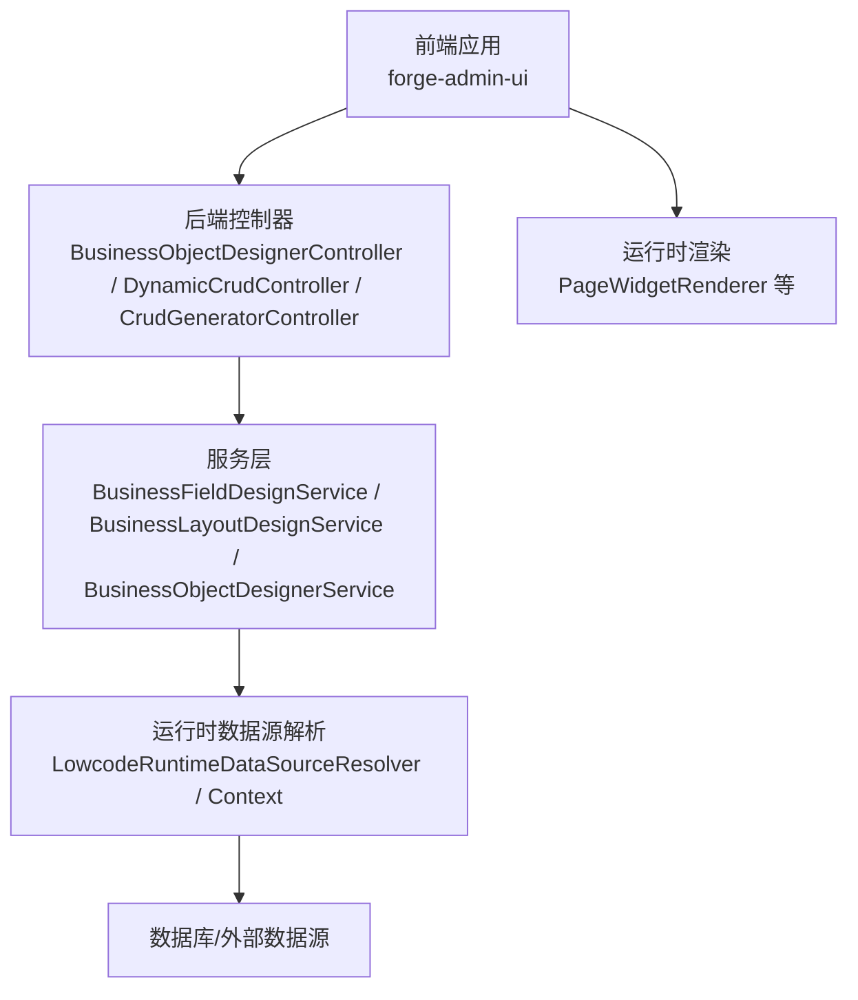
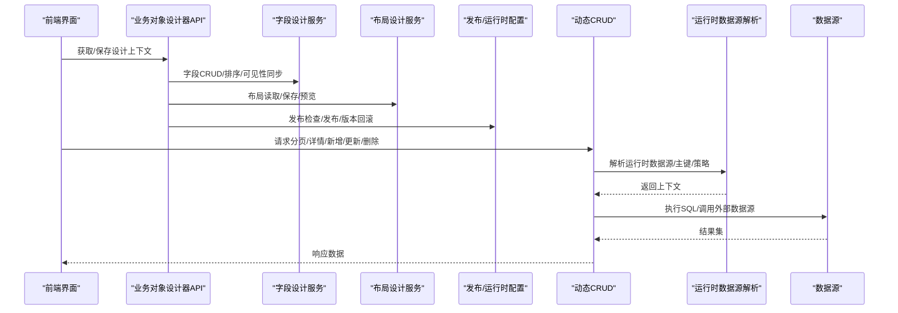
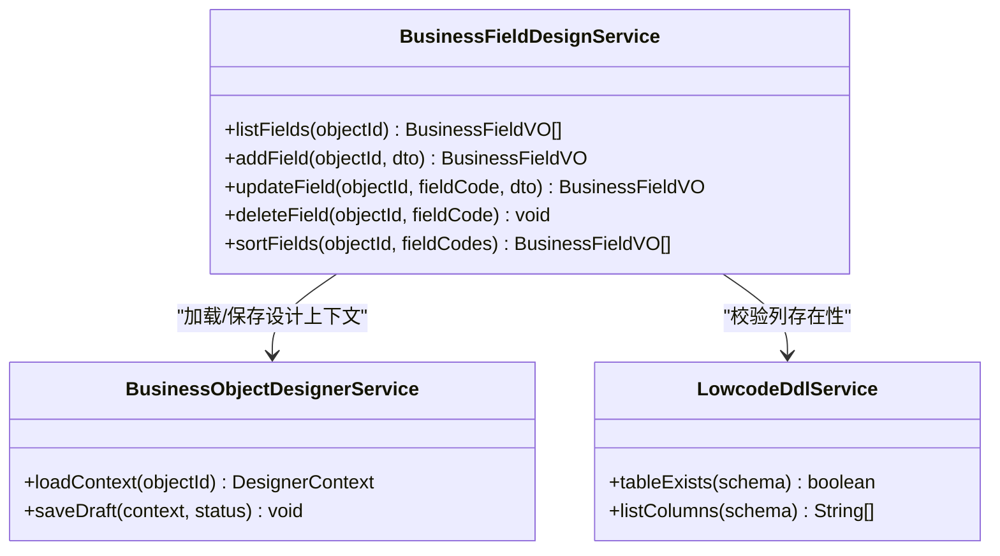
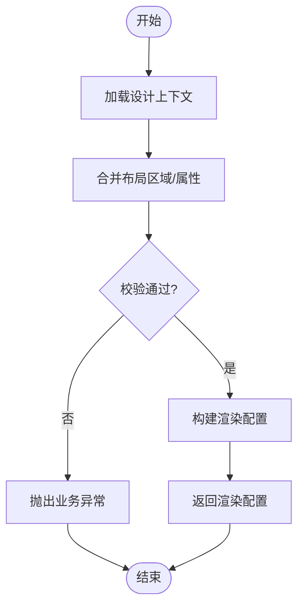
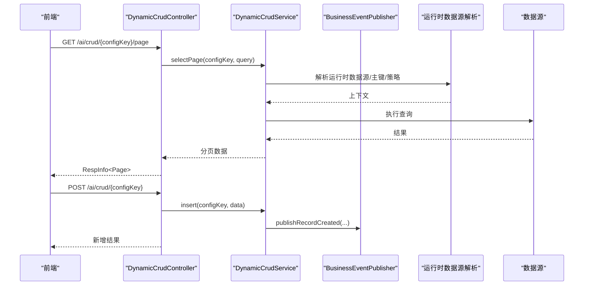
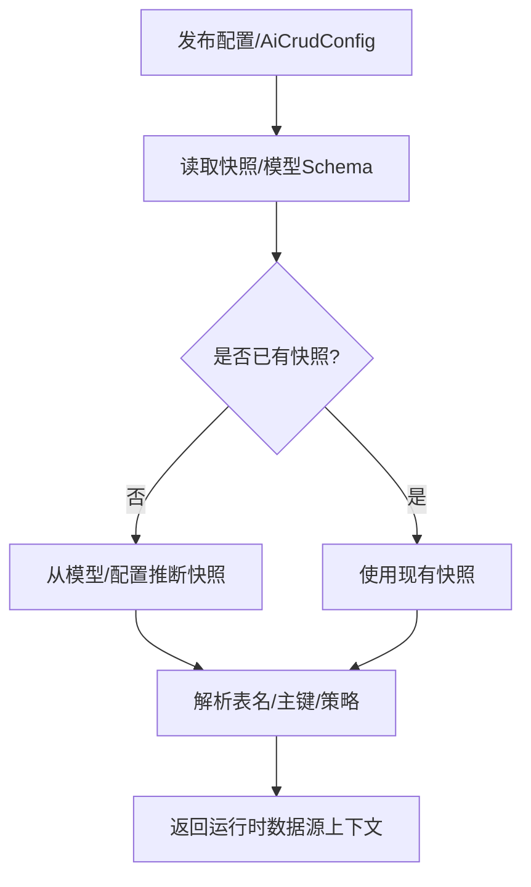
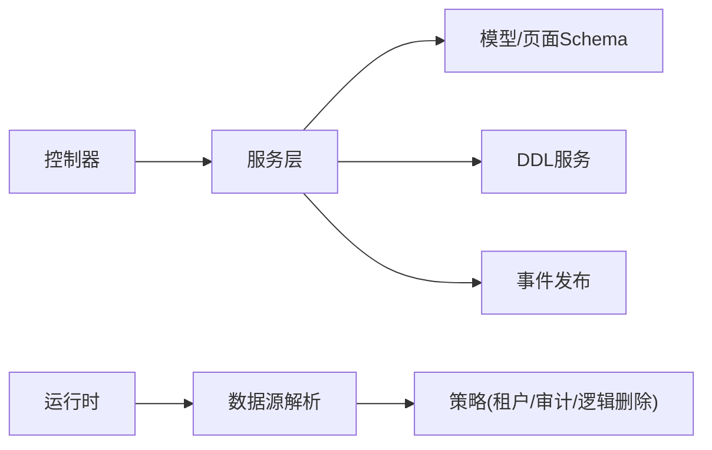

# 低代码平台API

<cite>
**本文引用的文件**
- [BusinessObjectDesignerController.java](file://forge-server/forge-framework/forge-plugin-parent/forge-plugin-generator/src/main/java/com/mdframe/forge/plugin/generator/controller/BusinessObjectDesignerController.java)
- [BusinessFieldDesignService.java](file://forge-server/forge-framework/forge-plugin-parent/forge-plugin-generator/src/main/java/com/mdframe/forge/plugin/generator/service/businessapp/BusinessFieldDesignService.java)
- [BusinessLayoutDesignService.java](file://forge-server/forge-framework/forge-plugin-parent/forge-plugin-generator/src/main/java/com/mdframe/forge/plugin/generator/service/businessapp/BusinessLayoutDesignService.java)
- [DynamicCrudController.java](file://forge-server/forge-framework/forge-plugin-parent/forge-plugin-generator/src/main/java/com/mdframe/forge/plugin/generator/controller/DynamicCrudController.java)
- [CrudGeneratorController.java](file://forge-server/forge-framework/forge-plugin-parent/forge-plugin-generator/src/main/java/com/mdframe/forge/plugin/generator/controller/CrudGeneratorController.java)
- [LowcodeRuntimeDataSourceResolver.java](file://forge-server/forge-framework/forge-plugin-parent/forge-plugin-generator/src/main/java/com/mdframe/forge/plugin/generator/service/lowcode/runtime/LowcodeRuntimeDataSourceResolver.java)
- [LowcodeRuntimeDataSourceContext.java](file://forge-server/forge-framework/forge-plugin-parent/forge-plugin-generator/src/main/java/com/mdframe/forge/plugin/generator/service/lowcode/runtime/LowcodeRuntimeDataSourceContext.java)
- [LowcodePublishService.java](file://forge-server/forge-framework/forge-plugin-parent/forge-plugin-generator/src/main/java/com/mdframe/forge/plugin/generator/service/lowcode/LowcodePublishService.java)
- [BusinessObjectDesignerService.java](file://forge-server/forge-framework/forge-plugin-parent/forge-plugin-generator/src/main/java/com/mdframe/forge/plugin/generator/service/businessapp/BusinessObjectDesignerService.java)
- [business-app.js](file://forge-admin-ui/src/api/business-app.js)
- [PageWidgetRenderer.vue](file://forge-admin-ui/src/components/lowcode-builder/shared/PageWidgetRenderer.vue)
</cite>

## 目录
1. [简介](#简介)
2. [项目结构](#项目结构)
3. [核心组件](#核心组件)
4. [架构总览](#架构总览)
5. [详细组件分析](#详细组件分析)
6. [依赖关系分析](#依赖关系分析)
7. [性能考虑](#性能考虑)
8. [故障排查指南](#故障排查指南)
9. [结论](#结论)
10. [附录：接口清单与示例](#附录接口清单与示例)

## 简介
本文件面向低代码平台的开发者与集成方，系统化说明业务对象设计器、表单设计器、CRUD生成器、页面模板管理等核心能力的API接口与运行时机制。文档覆盖：
- 业务对象的增删改查、字段配置、布局定义、数据绑定等接口
- 动态数据源解析与运行时渲染流程
- 完整的开发示例与集成指南（以接口路径与调用顺序为主）

## 项目结构
后端以“插件化”的生成器模块为核心，提供业务对象设计、字段与布局管理、动态CRUD访问、代码生成流式输出等能力；前端通过统一的API封装调用后端接口，并在运行时使用低代码运行时组件进行渲染。

图表来源
- [BusinessObjectDesignerController.java:50-72](file://forge-server/forge-framework/forge-plugin-parent/forge-plugin-generator/src/main/java/com/mdframe/forge/plugin/generator/controller/BusinessObjectDesignerController.java#L50-L72)
- [DynamicCrudController.java:30-84](file://forge-server/forge-framework/forge-plugin-parent/forge-plugin-generator/src/main/java/com/mdframe/forge/plugin/generator/controller/DynamicCrudController.java#L30-L84)
- [LowcodeRuntimeDataSourceResolver.java:64-87](file://forge-server/forge-framework/forge-plugin-parent/forge-plugin-generator/src/main/java/com/mdframe/forge/plugin/generator/service/lowcode/runtime/LowcodeRuntimeDataSourceResolver.java#L64-L87)

章节来源
- [BusinessObjectDesignerController.java:50-72](file://forge-server/forge-framework/forge-plugin-parent/forge-plugin-generator/src/main/java/com/mdframe/forge/plugin/generator/controller/BusinessObjectDesignerController.java#L50-L72)
- [DynamicCrudController.java:30-84](file://forge-server/forge-framework/forge-plugin-parent/forge-plugin-generator/src/main/java/com/mdframe/forge/plugin/generator/controller/DynamicCrudController.java#L30-L84)

## 核心组件
- 业务对象设计器：提供对象设计上下文加载、保存、表映射、DDL预览与同步、字段与布局管理、动作与权限摘要、发布检查与版本回滚等能力。
- 字段设计服务：负责字段的增删改查、排序、可见性与引用同步、模型与页面Schema一致性维护。
- 布局设计服务：统一管理表单、列表、详情三类布局的读取、保存与预览，支持区域级增量合并与校验。
- 动态CRUD：基于已发布的配置键（configKey）提供分页、树形、详情、新增、更新、删除、导入导出等通用数据访问能力。
- 代码生成器：提供流式代码生成接口，用于批量或增量生成前后端代码。
- 运行时数据源解析：根据发布配置与快照信息，解析目标数据源、主键策略、租户/审计/逻辑删除策略等。

章节来源
- [BusinessObjectDesignerController.java:67-254](file://forge-server/forge-framework/forge-plugin-parent/forge-plugin-generator/src/main/java/com/mdframe/forge/plugin/generator/controller/BusinessObjectDesignerController.java#L67-L254)
- [BusinessFieldDesignService.java:56-170](file://forge-server/forge-framework/forge-plugin-parent/forge-plugin-generator/src/main/java/com/mdframe/forge/plugin/generator/service/businessapp/BusinessFieldDesignService.java#L56-L170)
- [BusinessLayoutDesignService.java:40-189](file://forge-server/forge-framework/forge-plugin-parent/forge-plugin-generator/src/main/java/com/mdframe/forge/plugin/generator/service/businessapp/BusinessLayoutDesignService.java#L40-L189)
- [DynamicCrudController.java:42-148](file://forge-server/forge-framework/forge-plugin-parent/forge-plugin-generator/src/main/java/com/mdframe/forge/plugin/generator/controller/DynamicCrudController.java#L42-L148)
- [CrudGeneratorController.java:12-23](file://forge-server/forge-framework/forge-plugin-parent/forge-plugin-generator/src/main/java/com/mdframe/forge/plugin/generator/controller/CrudGeneratorController.java#L12-L23)
- [LowcodeRuntimeDataSourceResolver.java:64-87](file://forge-server/forge-framework/forge-plugin-parent/forge-plugin-generator/src/main/java/com/mdframe/forge/plugin/generator/service/lowcode/runtime/LowcodeRuntimeDataSourceResolver.java#L64-L87)

## 架构总览
低代码平台采用“设计态 + 运行态”的双态架构：
- 设计态：通过业务对象设计器完成模型、字段、布局、动作与权限的配置，并持久化为设计草稿与版本。
- 运行态：通过动态CRUD与运行时数据源解析，将配置转换为可执行的查询/写入操作；前端通过运行时组件渲染页面。

图表来源
- [BusinessObjectDesignerController.java:67-254](file://forge-server/forge-framework/forge-plugin-parent/forge-plugin-generator/src/main/java/com/mdframe/forge/plugin/generator/controller/BusinessObjectDesignerController.java#L67-L254)
- [BusinessFieldDesignService.java:56-170](file://forge-server/forge-framework/forge-plugin-parent/forge-plugin-generator/src/main/java/com/mdframe/forge/plugin/generator/service/businessapp/BusinessFieldDesignService.java#L56-L170)
- [BusinessLayoutDesignService.java:40-189](file://forge-server/forge-framework/forge-plugin-parent/forge-plugin-generator/src/main/java/com/mdframe/forge/plugin/generator/service/businessapp/BusinessLayoutDesignService.java#L40-L189)
- [DynamicCrudController.java:42-148](file://forge-server/forge-framework/forge-plugin-parent/forge-plugin-generator/src/main/java/com/mdframe/forge/plugin/generator/controller/DynamicCrudController.java#L42-L148)
- [LowcodeRuntimeDataSourceResolver.java:64-87](file://forge-server/forge-framework/forge-plugin-parent/forge-plugin-generator/src/main/java/com/mdframe/forge/plugin/generator/service/lowcode/runtime/LowcodeRuntimeDataSourceResolver.java#L64-L87)

## 详细组件分析

### 业务对象设计器API
- 设计上下文
  - GET /ai/business/object/{objectId}/designer：获取设计上下文（包含对象基本信息、发布状态、是否有未发布变更等）。
  - PUT /ai/business/object/{objectId}/designer：保存设计上下文（加密传输）。
- 表映射与DDL
  - GET /ai/business/object/{objectId}/table-mapping：查询数据库表映射。
  - POST /ai/business/object/{objectId}/database-diff：预览DDL差异。
  - POST /ai/business/object/{objectId}/database-sync：同步DDL（需部署权限）。
- 字段管理
  - GET /ai/business/object/{objectId}/fields：列出字段。
  - POST /ai/business/object/{objectId}/fields：新增字段。
  - PUT /ai/business/object/{objectId}/fields/sort：字段排序。
  - PUT /ai/business/object/{objectId}/fields/{fieldCode}：修改字段。
  - DELETE /ai/business/object/{objectId}/fields/{fieldCode}：删除字段。
- 布局管理
  - GET /ai/business/object/{objectId}/layout/{layoutKey}：读取布局（form/list/detail）。
  - PUT /ai/business/object/{objectId}/layout/form|list|detail：保存对应布局。
  - POST /ai/business/object/{objectId}/layout/preview：预览布局渲染配置。
- 动作与权限
  - GET /ai/business/object/{objectId}/actions：列出动作。
  - PUT /ai/business/object/{objectId}/actions：保存动作。
  - GET /ai/business/object/{objectId}/permission-summary：权限摘要。
  - GET /ai/business/object/{objectId}/permission-actions：动作权限摘要。
- 发布与版本
  - GET /ai/business/object/{objectId}/publish-check：发布前检查。
  - POST /ai/business/object/{objectId}/publish：发布。
  - GET /ai/business/object/{objectId}/versions：设计版本列表。
  - POST /ai/business/object/{objectId}/versions/{versionId}/rollback：回滚设计版本。

章节来源
- [BusinessObjectDesignerController.java:67-254](file://forge-server/forge-framework/forge-plugin-parent/forge-plugin-generator/src/main/java/com/mdframe/forge/plugin/generator/controller/BusinessObjectDesignerController.java#L67-L254)

#### 字段设计流程（类图）

图表来源
- [BusinessFieldDesignService.java:56-170](file://forge-server/forge-framework/forge-plugin-parent/forge-plugin-generator/src/main/java/com/mdframe/forge/plugin/generator/service/businessapp/BusinessFieldDesignService.java#L56-L170)
- [BusinessObjectDesignerService.java:191-212](file://forge-server/forge-framework/forge-plugin-parent/forge-plugin-generator/src/main/java/com/mdframe/forge/plugin/generator/service/businessapp/BusinessObjectDesignerService.java#L191-L212)

章节来源
- [BusinessFieldDesignService.java:56-170](file://forge-server/forge-framework/forge-plugin-parent/forge-plugin-generator/src/main/java/com/mdframe/forge/plugin/generator/service/businessapp/BusinessFieldDesignService.java#L56-L170)

### 布局设计与预览
- 读取布局：按布局键（form/list/detail）返回当前页面Schema与区域集合。
- 保存布局：仅对指定区域进行增量合并，自动设置默认布局类型与区域组件。
- 预览布局：将当前模型与页面Schema组装为AiCrudConfigRenderVO，供前端渲染预览。

图表来源
- [BusinessLayoutDesignService.java:55-133](file://forge-server/forge-framework/forge-plugin-parent/forge-plugin-generator/src/main/java/com/mdframe/forge/plugin/generator/service/businessapp/BusinessLayoutDesignService.java#L55-L133)

章节来源
- [BusinessLayoutDesignService.java:40-189](file://forge-server/forge-framework/forge-plugin-parent/forge-plugin-generator/src/main/java/com/mdframe/forge/plugin/generator/service/businessapp/BusinessLayoutDesignService.java#L40-L189)

### 动态CRUD接口
- 分页查询：GET /ai/crud/{configKey}/page
- 树形查询：GET /ai/crud/{configKey}/tree
- 详情查询：GET /ai/crud/{configKey}/{id}
- 新增记录：POST /ai/crud/{configKey}
- 更新记录：PUT /ai/crud/{configKey}
- 删除记录：DELETE /ai/crud/{configKey}/{id}
- Excel导入：POST /ai/crud/{configKey}/import
- Excel导出：POST /ai/crud/{configKey}/export
- 导出任务：GET /ai/crud/{configKey}/export/tasks
- 下载导入模板：GET /ai/crud/{configKey}/import-template

图表来源
- [DynamicCrudController.java:42-148](file://forge-server/forge-framework/forge-plugin-parent/forge-plugin-generator/src/main/java/com/mdframe/forge/plugin/generator/controller/DynamicCrudController.java#L42-L148)

章节来源
- [DynamicCrudController.java:42-148](file://forge-server/forge-framework/forge-plugin-parent/forge-plugin-generator/src/main/java/com/mdframe/forge/plugin/generator/controller/DynamicCrudController.java#L42-L148)

### 代码生成器
- 流式生成：POST /ai/crud-generator/stream-generate
  - 用于在生成过程中实时推送进度与产物片段，提升大工程体验。

章节来源
- [CrudGeneratorController.java:12-23](file://forge-server/forge-framework/forge-plugin-parent/forge-plugin-generator/src/main/java/com/mdframe/forge/plugin/generator/controller/CrudGeneratorController.java#L12-L23)

### 运行时数据源与发布
- 运行时数据源解析：根据发布配置与快照，解析目标数据源、表名、主键、租户/审计/逻辑删除策略等。
- 发布时注入运行时数据源信息到配置中，确保运行期一致性与可追溯性。

图表来源
- [LowcodeRuntimeDataSourceResolver.java:64-87](file://forge-server/forge-framework/forge-plugin-parent/forge-plugin-generator/src/main/java/com/mdframe/forge/plugin/generator/service/lowcode/runtime/LowcodeRuntimeDataSourceResolver.java#L64-L87)
- [LowcodePublishService.java:291-304](file://forge-server/forge-framework/forge-plugin-parent/forge-plugin-generator/src/main/java/com/mdframe/forge/plugin/generator/service/lowcode/LowcodePublishService.java#L291-L304)

章节来源
- [LowcodeRuntimeDataSourceResolver.java:64-87](file://forge-server/forge-framework/forge-plugin-parent/forge-plugin-generator/src/main/java/com/mdframe/forge/plugin/generator/service/lowcode/runtime/LowcodeRuntimeDataSourceResolver.java#L64-L87)
- [LowcodePublishService.java:291-304](file://forge-server/forge-framework/forge-plugin-parent/forge-plugin-generator/src/main/java/com/mdframe/forge/plugin/generator/service/lowcode/LowcodePublishService.java#L291-L304)

## 依赖关系分析
- 控制器与服务解耦：控制器仅负责路由与参数装配，具体逻辑下沉至服务层。
- 设计态与运行态分离：设计态关注Schema与版本管理；运行态通过配置键直接访问数据。
- 事件驱动：CRUD操作后发布记录事件，便于触发器引擎异步处理。
- 运行时数据源抽象：统一主键、租户、审计、逻辑删除策略，屏蔽底层差异。

图表来源
- [BusinessObjectDesignerController.java:50-72](file://forge-server/forge-framework/forge-plugin-parent/forge-plugin-generator/src/main/java/com/mdframe/forge/plugin/generator/controller/BusinessObjectDesignerController.java#L50-L72)
- [DynamicCrudController.java:75-115](file://forge-server/forge-framework/forge-plugin-parent/forge-plugin-generator/src/main/java/com/mdframe/forge/plugin/generator/controller/DynamicCrudController.java#L75-L115)
- [LowcodeRuntimeDataSourceContext.java:1-58](file://forge-server/forge-framework/forge-plugin-parent/forge-plugin-generator/src/main/java/com/mdframe/forge/plugin/generator/service/lowcode/runtime/LowcodeRuntimeDataSourceContext.java#L1-L58)

章节来源
- [BusinessObjectDesignerController.java:50-72](file://forge-server/forge-framework/forge-plugin-parent/forge-plugin-generator/src/main/java/com/mdframe/forge/plugin/generator/controller/BusinessObjectDesignerController.java#L50-L72)
- [DynamicCrudController.java:75-115](file://forge-server/forge-framework/forge-plugin-parent/forge-plugin-generator/src/main/java/com/mdframe/forge/plugin/generator/controller/DynamicCrudController.java#L75-L115)
- [LowcodeRuntimeDataSourceContext.java:1-58](file://forge-server/forge-framework/forge-plugin-parent/forge-plugin-generator/src/main/java/com/mdframe/forge/plugin/generator/service/lowcode/runtime/LowcodeRuntimeDataSourceContext.java#L1-L58)

## 性能考虑
- 分页与过滤：动态CRUD支持分页与搜索类型映射，建议合理设置pageSize与索引字段。
- 增量保存：布局保存支持区域级增量合并，减少全量重写带来的开销。
- 流式生成：代码生成采用SSE流式输出，避免长连接阻塞。
- 运行时数据源解析：优先使用快照，降低重复解析成本。

## 故障排查指南
- 字段不可修改/删除：系统字段或流程托管字段受保护；若字段已同步到数据表，需通过新增规范字段迁移后再停用旧字段。
- 布局校验失败：当模型字段为空或未正确初始化时，页面Schema校验会拒绝保存。
- 运行时数据源缺失：若发布配置未携带快照或数据源标识，解析可能失败，需检查发布流程是否正确注入运行时信息。
- 权限不足：设计器相关接口需要特定权限（如 ai:businessObject:design、ai:businessObject:publish），请确认角色与资源授权。

章节来源
- [BusinessFieldDesignService.java:81-146](file://forge-server/forge-framework/forge-plugin-parent/forge-plugin-generator/src/main/java/com/mdframe/forge/plugin/generator/service/businessapp/BusinessFieldDesignService.java#L81-L146)
- [BusinessLayoutDesignService.java:98-133](file://forge-server/forge-framework/forge-plugin-parent/forge-plugin-generator/src/main/java/com/mdframe/forge/plugin/generator/service/businessapp/BusinessLayoutDesignService.java#L98-L133)
- [LowcodeRuntimeDataSourceResolver.java:64-87](file://forge-server/forge-framework/forge-plugin-parent/forge-plugin-generator/src/main/java/com/mdframe/forge/plugin/generator/service/lowcode/runtime/LowcodeRuntimeDataSourceResolver.java#L64-L87)

## 结论
本低代码平台通过“设计态+运行态”的清晰分层，结合字段与布局的精细化控制、动态CRUD的通用数据访问、以及运行时数据源的统一抽象，提供了高效、可扩展的业务建模与页面搭建能力。配合流式代码生成与事件驱动机制，可满足复杂业务场景的快速交付与持续演进。

## 附录：接口清单与示例

### 业务对象设计器（前端调用示例）
- 获取设计器上下文：GET /ai/business/object/{objectId}/designer
- 保存设计器上下文：PUT /ai/business/object/{objectId}/designer（加密）
- 字段CRUD与排序：/ai/business/object/{objectId}/fields
- 布局读取/保存/预览：/ai/business/object/{objectId}/layout/{key}
- 发布检查/发布/版本回滚：/ai/business/object/{objectId}/publish-check | /publish | /versions/{versionId}/rollback

章节来源
- [business-app.js:259-337](file://forge-admin-ui/src/api/business-app.js#L259-L337)
- [BusinessObjectDesignerController.java:67-254](file://forge-server/forge-framework/forge-plugin-parent/forge-plugin-generator/src/main/java/com/mdframe/forge/plugin/generator/controller/BusinessObjectDesignerController.java#L67-L254)

### 动态CRUD（前端调用示例）
- 分页：GET /ai/crud/{configKey}/page
- 详情：GET /ai/crud/{configKey}/{id}
- 新增：POST /ai/crud/{configKey}
- 更新：PUT /ai/crud/{configKey}
- 删除：DELETE /ai/crud/{configKey}/{id}
- 导入/导出：/ai/crud/{configKey}/import | /export

章节来源
- [DynamicCrudController.java:42-148](file://forge-server/forge-framework/forge-plugin-parent/forge-plugin-generator/src/main/java/com/mdframe/forge/plugin/generator/controller/DynamicCrudController.java#L42-L148)

### 运行时数据绑定与组件渲染
- 数据绑定解析：组件根据dataBinding.sourceType与dataPath/contextPath解析绑定值。
- 渲染流程：前端通过运行时组件（如LowcodeRuntimePage）加载runtime-config，并按页面Schema渲染各区域与组件。

章节来源
- [PageWidgetRenderer.vue:718-745](file://forge-admin-ui/src/components/lowcode-builder/shared/PageWidgetRenderer.vue#L718-L745)