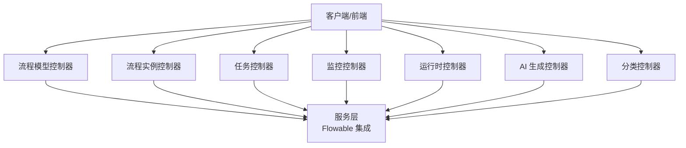
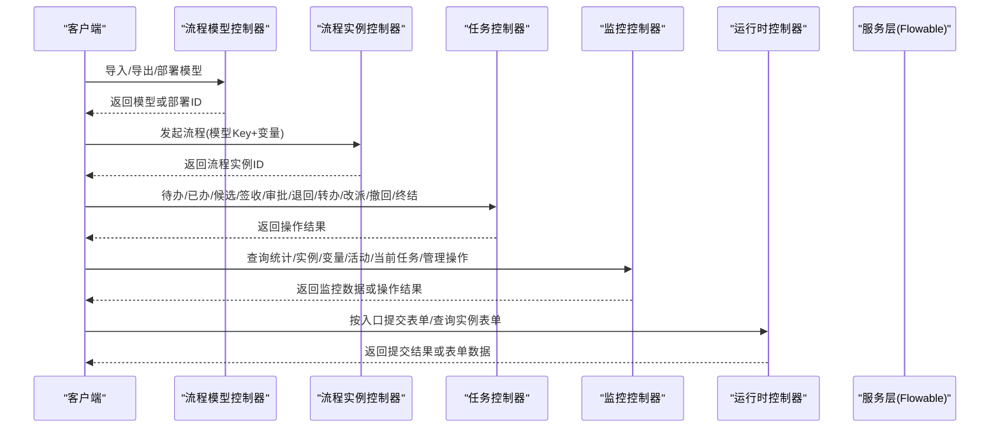
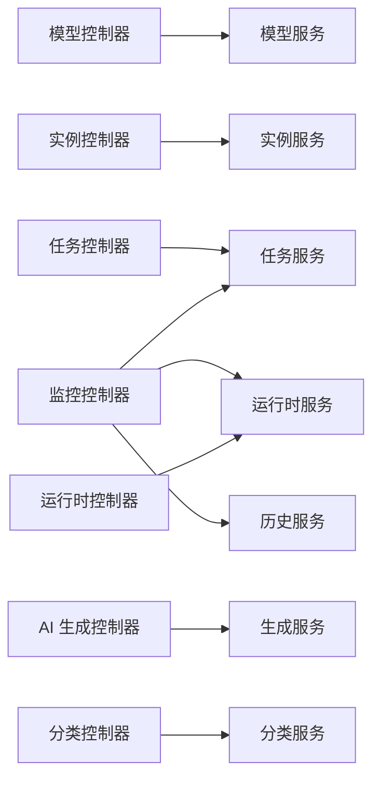

# 工作流引擎API

<cite>
**本文引用的文件**
- [FlowModelController.java](file://forge-server/forge-flow/forge-flow-server/src/main/java/com/mdframe/forge/flow/controller/FlowModelController.java)
- [FlowInstanceController.java](file://forge-server/forge-flow/forge-flow-server/src/main/java/com/mdframe/forge/flow/controller/FlowInstanceController.java)
- [FlowTaskController.java](file://forge-server/forge-flow/forge-flow-server/src/main/java/com/mdframe/forge/flow/controller/FlowTaskController.java)
- [FlowMonitorController.java](file://forge-server/forge-flow/forge-flow-server/src/main/java/com/mdframe/forge/flow/controller/FlowMonitorController.java)
- [FlowRuntimeController.java](file://forge-server/forge-flow/forge-flow-server/src/main/java/com/mdframe/forge/flow/controller/FlowRuntimeController.java)
- [FlowBpmnGenerateController.java](file://forge-server/forge-flow/forge-flow-server/src/main/java/com/mdframe/forge/flow/controller/FlowBpmnGenerateController.java)
- [FlowCategoryController.java](file://forge-server/forge-flow/forge-flow-server/src/main/java/com/mdframe/forge/flow/controller/FlowCategoryController.java)
</cite>

## 目录
1. [简介](#简介)
2. [项目结构](#项目结构)
3. [核心组件](#核心组件)
4. [架构总览](#架构总览)
5. [详细组件分析](#详细组件分析)
6. [依赖关系分析](#依赖关系分析)
7. [性能考虑](#性能考虑)
8. [故障排查指南](#故障排查指南)
9. [结论](#结论)
10. [附录](#附录)

## 简介
本文件面向使用与集成 Flowable 工作流引擎的开发者与运维人员，系统化梳理流程设计、流程审批、任务管理与流程监控等能力的 API 接口。文档覆盖：
- 流程定义的 CRUD 与部署、版本管理
- 流程实例的发起、状态查询、变量读写、终止与删除
- 任务待办处理（签收、通过、驳回、退回、转办、改派、撤回、终结）
- 流程监控（统计、分页、回退、转派、挂起/激活、清理）
- 运行时入口与表单提交
- BPMN 模型导入导出与 AI 生成
- Flowable 集成方式、流程状态管理与任务调度机制说明
- 完整示例：从流程设计到审批流转再到监控追踪

## 项目结构
工作流相关能力集中在 forge-flow-server 模块中，以控制器为对外暴露面，服务层封装 Flowable 引擎调用与业务编排。主要控制器职责如下：
- 流程模型：定义、版本、导入导出、启用/禁用、部署
- 流程实例：发起、状态、变量、终止、删除、分页查询
- 任务：待办/已办/我发起、候选任务、签收、审批、退回、转办、改派、撤回、终结、流程图、历史、表单信息
- 监控：统计、实例列表、详情、趋势、分布、管理员操作（终止、回退、转派、删除、挂起/激活）、变量与活动节点
- 运行时：按入口编码获取运行态、提交表单、按实例查询表单
- AI 生成：流式生成 BPMN 模型
- 分类：分类树、分页、CRUD、启用/禁用

**图表来源**
- [FlowModelController.java:20-233](file://forge-server/forge-flow/forge-flow-server/src/main/java/com/mdframe/forge/flow/controller/FlowModelController.java#L20-L233)
- [FlowInstanceController.java:27-240](file://forge-server/forge-flow/forge-flow-server/src/main/java/com/mdframe/forge/flow/controller/FlowInstanceController.java#L27-L240)
- [FlowTaskController.java:32-373](file://forge-server/forge-flow/forge-flow-server/src/main/java/com/mdframe/forge/flow/controller/FlowTaskController.java#L32-L373)
- [FlowMonitorController.java:31-403](file://forge-server/forge-flow/forge-flow-server/src/main/java/com/mdframe/forge/flow/controller/FlowMonitorController.java#L31-L403)
- [FlowRuntimeController.java:15-44](file://forge-server/forge-flow/forge-flow-server/src/main/java/com/mdframe/forge/flow/controller/FlowRuntimeController.java#L15-L44)
- [FlowBpmnGenerateController.java:15-28](file://forge-server/forge-flow/forge-flow-server/src/main/java/com/mdframe/forge/flow/controller/FlowBpmnGenerateController.java#L15-L28)
- [FlowCategoryController.java:16-149](file://forge-server/forge-flow/forge-flow-server/src/main/java/com/mdframe/forge/flow/controller/FlowCategoryController.java#L16-L149)

**章节来源**
- [FlowModelController.java:20-233](file://forge-server/forge-flow/forge-flow-server/src/main/java/com/mdframe/forge/flow/controller/FlowModelController.java#L20-L233)
- [FlowInstanceController.java:27-240](file://forge-server/forge-flow/forge-flow-server/src/main/java/com/mdframe/forge/flow/controller/FlowInstanceController.java#L27-L240)
- [FlowTaskController.java:32-373](file://forge-server/forge-flow/forge-flow-server/src/main/java/com/mdframe/forge/flow/controller/FlowTaskController.java#L32-L373)
- [FlowMonitorController.java:31-403](file://forge-server/forge-flow/forge-flow-server/src/main/java/com/mdframe/forge/flow/controller/FlowMonitorController.java#L31-L403)
- [FlowRuntimeController.java:15-44](file://forge-server/forge-flow/forge-flow-server/src/main/java/com/mdframe/forge/flow/controller/FlowRuntimeController.java#L15-L44)
- [FlowBpmnGenerateController.java:15-28](file://forge-server/forge-flow/forge-flow-server/src/main/java/com/mdframe/forge/flow/controller/FlowBpmnGenerateController.java#L15-L28)
- [FlowCategoryController.java:16-149](file://forge-server/forge-flow/forge-flow-server/src/main/java/com/mdframe/forge/flow/controller/FlowCategoryController.java#L16-L149)

## 核心组件
- 流程模型管理：提供模型分页、启用列表、统计、详情、Key 查询、创建/更新/删除、部署、挂起/激活/禁用、版本历史、导入/导出、复制、Key 存在性检查、下拉列表。
- 流程实例管理：支持按模型 Key 发起流程（含委托发起）、获取状态、终止、删除、变量读写、分页查询、按实例 ID 查询详情。
- 任务管理：待办/已办/我发起、候选任务、签收、通过、驳回、驳回至发起人修改路径、转办、退回上一节点、改派、终结、撤回、流程图与图详情、催办、逾期提醒扫描、历史时间轴、任务表单与流程表单信息。
- 流程监控：统计数据、实例分页、实例详情、任务趋势、流程分布、管理员终止/回退/转派/删除、批量清理、变量读取、活动节点读取、当前任务读取、挂起/激活。
- 运行时入口：按入口编码获取运行态、提交表单、按实例查询表单。
- AI 生成：流式生成 BPMN 模型。
- 分类管理：启用列表、树形列表、选择器树、分页、详情、编码查询、CRUD、启用/禁用。

**章节来源**
- [FlowModelController.java:33-231](file://forge-server/forge-flow/forge-flow-server/src/main/java/com/mdframe/forge/flow/controller/FlowModelController.java#L33-L231)
- [FlowInstanceController.java:44-238](file://forge-server/forge-flow/forge-flow-server/src/main/java/com/mdframe/forge/flow/controller/FlowInstanceController.java#L44-L238)
- [FlowTaskController.java:46-371](file://forge-server/forge-flow/forge-flow-server/src/main/java/com/mdframe/forge/flow/controller/FlowTaskController.java#L46-L371)
- [FlowMonitorController.java:48-382](file://forge-server/forge-flow/forge-flow-server/src/main/java/com/mdframe/forge/flow/controller/FlowMonitorController.java#L48-L382)
- [FlowRuntimeController.java:28-42](file://forge-server/forge-flow/forge-flow-server/src/main/java/com/mdframe/forge/flow/controller/FlowRuntimeController.java#L28-L42)
- [FlowBpmnGenerateController.java:23-26](file://forge-server/forge-flow/forge-flow-server/src/main/java/com/mdframe/forge/flow/controller/FlowBpmnGenerateController.java#L23-L26)
- [FlowCategoryController.java:29-147](file://forge-server/forge-flow/forge-flow-server/src/main/java/com/mdframe/forge/flow/controller/FlowCategoryController.java#L29-L147)

## 架构总览
系统采用“控制器 + 服务层”的分层架构。控制器负责参数校验、权限控制、租户隔离、加解密与统一响应；服务层封装 Flowable 引擎调用（RuntimeService、TaskService、HistoryService）与业务编排（实例生命周期、任务流转、监控统计）。

**图表来源**
- [FlowModelController.java:175-198](file://forge-server/forge-flow/forge-flow-server/src/main/java/com/mdframe/forge/flow/controller/FlowModelController.java#L175-L198)
- [FlowInstanceController.java:47-145](file://forge-server/forge-flow/forge-flow-server/src/main/java/com/mdframe/forge/flow/controller/FlowInstanceController.java#L47-L145)
- [FlowTaskController.java:116-270](file://forge-server/forge-flow/forge-flow-server/src/main/java/com/mdframe/forge/flow/controller/FlowTaskController.java#L116-L270)
- [FlowMonitorController.java:51-382](file://forge-server/forge-flow/forge-flow-server/src/main/java/com/mdframe/forge/flow/controller/FlowMonitorController.java#L51-L382)
- [FlowRuntimeController.java:28-42](file://forge-server/forge-flow/forge-flow-server/src/main/java/com/mdframe/forge/flow/controller/FlowRuntimeController.java#L28-L42)

## 详细组件分析

### 流程模型管理 API
- 分页查询模型：GET /api/flow/model/page
- 获取启用模型列表：GET /api/flow/model/enabled
- 模型状态统计：GET /api/flow/model/statistics
- 模型详情：GET /api/flow/model/{id}
- 按 Key 获取模型：GET /api/flow/model/key/{modelKey}
- 获取启动配置：GET /api/flow/model/key/{modelKey}/start-config
- 创建模型：POST /api/flow/model
- 更新模型：PUT /api/flow/model
- 删除模型：DELETE /api/flow/model/{id}
- 部署模型：POST /api/flow/model/{id}/deploy
- 挂起/激活/禁用/启用：POST /api/flow/model/{id}/suspend|activate|disable|enable
- 版本历史：GET /api/flow/model/{modelKey}/versions
- 导入 BPMN：POST /api/flow/model/import
- 导出 BPMN：GET /api/flow/model/{id}/export
- 复制模型：POST /api/flow/model/{id}/copy
- 检查 Key 是否存在：GET /api/flow/model/checkKey
- 下拉列表：GET /api/flow/model/list

提示：所有接口均返回统一响应体 RespInfo，支持分页对象 IPage。

**章节来源**
- [FlowModelController.java:33-231](file://forge-server/forge-flow/forge-flow-server/src/main/java/com/mdframe/forge/flow/controller/FlowModelController.java#L33-L231)

### 流程实例管理 API
- 发起流程：POST /api/flow/instance/start/{modelKey}
- 委托发起流程：POST /api/flow/instance/start-delegated/{modelKey}
- 高风险审批委托发起：POST /api/flow/instance/start-delegated-approval/{modelKey}
- 获取流程状态：GET /api/flow/instance/status/{businessKey}
- 终止流程：POST /api/flow/instance/terminate/{businessKey}
- 删除流程实例：DELETE /api/flow/instance/{businessKey}
- 获取变量：GET /api/flow/instance/variables/{businessKey}
- 更新变量：PUT /api/flow/instance/variables/{businessKey}
- 分页查询实例：GET /api/flow/instance/page
- 按实例 ID 查询详情：GET /api/flow/instance/detail/{processInstanceId}

说明：
- 委托发起需具备相应权限并满足会话验证要求。
- 未传入 businessKey 时会自动生成；未传入 businessType 时默认使用 modelKey。

**章节来源**
- [FlowInstanceController.java:47-238](file://forge-server/forge-flow/forge-flow-server/src/main/java/com/mdframe/forge/flow/controller/FlowInstanceController.java#L47-L238)

### 任务管理 API
- 我的待办：GET /api/flow/task/todo
- 我的已办：GET /api/flow/task/done
- 我发起的流程：GET /api/flow/task/started
- 候选任务：GET /api/flow/task/candidate
- 签收任务：POST /api/flow/task/claim
- 审批通过：POST /api/flow/task/approve
- 审批驳回：POST /api/flow/task/reject
- 驳回至发起人修改路径：POST /api/flow/task/reject-to-start
- 转办：POST /api/flow/task/delegate
- 退回上一节点：POST /api/flow/task/return
- 改派当前任务：POST /api/flow/task/reassign
- 终结流程：POST /api/flow/task/terminate
- 撤回流程：POST /api/flow/task/withdraw
- 任务详情：GET /api/flow/task/{taskId}
- 流程图（PNG）：GET /api/flow/task/diagram/{processInstanceId}
- 流程图详情（含节点信息）：GET /api/flow/task/diagram-info/{processInstanceId}
- 催办：POST /api/flow/task/remind
- 触发逾期提醒扫描：POST /api/flow/task/overdue-reminder/scan
- 历史时间轴：GET /api/flow/task/history/{processInstanceId}
- 任务表单信息：GET /api/flow/task/form/{taskId}
- 流程关联表单信息：GET /api/flow/task/form

注意：
- 审批类接口支持幂等键与请求摘要，用于防重放。
- 租户校验在任务接口内部完成，确保跨租户安全。

**章节来源**
- [FlowTaskController.java:46-371](file://forge-server/forge-flow/forge-flow-server/src/main/java/com/mdframe/forge/flow/controller/FlowTaskController.java#L46-L371)

### 流程监控 API
- 统计：GET /api/flow/monitor/statistics
- 实例分页：GET /api/flow/monitor/instances
- 实例详情：GET /api/flow/monitor/instance/{processInstanceId}
- 任务趋势：GET /api/flow/monitor/taskTrend
- 流程分布：GET /api/flow/monitor/processDistribution
- 管理员终止：POST /api/flow/monitor/terminate/{processInstanceId}
- 管理员回退：POST /api/flow/monitor/rollback/{processInstanceId}
- 管理员转派：POST /api/flow/monitor/reassign/{taskId}
- 删除单个实例：POST /api/flow/monitor/instance/{processInstanceId}/delete
- 批量清理：POST /api/flow/monitor/instances/cleanup
- 获取变量：GET /api/flow/monitor/variables/{processInstanceId}
- 活动节点：GET /api/flow/monitor/activities/{processInstanceId}
- 当前任务：GET /api/flow/monitor/current-tasks/{processInstanceId}
- 挂起：POST /api/flow/monitor/suspend/{processInstanceId}
- 激活：POST /api/flow/monitor/activate/{processInstanceId}

说明：
- 多数监控接口需要权限注解保护。
- 变量读取会优先从运行时获取，若流程已完成则从历史服务聚合。

**章节来源**
- [FlowMonitorController.java:48-382](file://forge-server/forge-flow/forge-flow-server/src/main/java/com/mdframe/forge/flow/controller/FlowMonitorController.java#L48-L382)

### 运行时入口 API
- 获取入口运行态：GET /api/flow/runtime/entry/{entryCode}
- 提交入口表单：POST /api/flow/runtime/submit/{entryCode}
- 按实例查询表单：GET /api/flow/runtime/instance/{processInstanceId}

用途：
- 面向外部系统或低代码场景的统一入口，简化发起与表单交互。

**章节来源**
- [FlowRuntimeController.java:28-42](file://forge-server/forge-flow/forge-flow-server/src/main/java/com/mdframe/forge/flow/controller/FlowRuntimeController.java#L28-L42)

### AI 生成 BPMN API
- 流式生成：POST /api/flow/ai-generator/stream-generate

说明：
- 返回 Server-Sent Events 流式事件，便于前端实时渲染生成进度与结果。

**章节来源**
- [FlowBpmnGenerateController.java:23-26](file://forge-server/forge-flow/forge-flow-server/src/main/java/com/mdframe/forge/flow/controller/FlowBpmnGenerateController.java#L23-L26)

### 分类管理 API
- 启用列表：GET /api/flow/category/enabled
- 树形列表：GET /api/flow/category/tree
- 选择器树：GET /api/flow/category/tree-select
- 分页：GET /api/flow/category/page
- 详情：GET /api/flow/category/{id}
- 按编码查询：GET /api/flow/category/code/{code}
- 创建：POST /api/flow/category
- 更新：PUT /api/flow/category
- 删除：DELETE /api/flow/category/{id}
- 启用：POST /api/flow/category/{id}/enable
- 禁用：POST /api/flow/category/{id}/disable

**章节来源**
- [FlowCategoryController.java:29-147](file://forge-server/forge-flow/forge-flow-server/src/main/java/com/mdframe/forge/flow/controller/FlowCategoryController.java#L29-L147)

## 依赖关系分析
- 控制器之间无直接耦合，均依赖各自的服务层。
- 监控控制器直接注入 Flowable 的 RuntimeService、TaskService、HistoryService，用于读取运行态、任务与历史数据。
- 任务控制器与服务层协作完成审批、退回、转办、改派等操作，并通过统一响应体返回结果。
- 实例控制器负责发起流程、状态与变量管理，以及分页与详情查询。
- 模型控制器负责模型生命周期与 BPMN 导入导出。
- 运行时控制器提供统一的入口提交与表单查询能力。
- AI 生成控制器通过流式接口输出 BPMN 生成过程。

**图表来源**
- [FlowModelController.java:20-233](file://forge-server/forge-flow/forge-flow-server/src/main/java/com/mdframe/forge/flow/controller/FlowModelController.java#L20-L233)
- [FlowInstanceController.java:27-240](file://forge-server/forge-flow/forge-flow-server/src/main/java/com/mdframe/forge/flow/controller/FlowInstanceController.java#L27-L240)
- [FlowTaskController.java:32-373](file://forge-server/forge-flow/forge-flow-server/src/main/java/com/mdframe/forge/flow/controller/FlowTaskController.java#L32-L373)
- [FlowMonitorController.java:31-403](file://forge-server/forge-flow/forge-flow-server/src/main/java/com/mdframe/forge/flow/controller/FlowMonitorController.java#L31-L403)
- [FlowRuntimeController.java:15-44](file://forge-server/forge-flow/forge-flow-server/src/main/java/com/mdframe/forge/flow/controller/FlowRuntimeController.java#L15-L44)
- [FlowBpmnGenerateController.java:15-28](file://forge-server/forge-flow/forge-flow-server/src/main/java/com/mdframe/forge/flow/controller/FlowBpmnGenerateController.java#L15-L28)
- [FlowCategoryController.java:16-149](file://forge-server/forge-flow/forge-flow-server/src/main/java/com/mdframe/forge/flow/controller/FlowCategoryController.java#L16-L149)

**章节来源**
- [FlowMonitorController.java:42-46](file://forge-server/forge-flow/forge-flow-server/src/main/java/com/mdframe/forge/flow/controller/FlowMonitorController.java#L42-L46)
- [FlowTaskController.java:43-44](file://forge-server/forge-flow/forge-flow-server/src/main/java/com/mdframe/forge/flow/controller/FlowTaskController.java#L43-L44)
- [FlowInstanceController.java:39-42](file://forge-server/forge-flow/forge-flow-server/src/main/java/com/mdframe/forge/flow/controller/FlowInstanceController.java#L39-L42)

## 性能考虑
- 分页查询：所有列表接口均支持分页参数，建议合理设置 pageSize，避免一次性加载过多数据。
- 流程图下载：流程图接口返回 PNG 二进制，建议在客户端进行缓存以减少重复请求。
- 监控变量读取：对于已完成流程，变量从历史服务聚合，可能涉及多次查询，建议在监控侧增加缓存或限制查询范围。
- 批量清理：批量删除接口需确认文本，避免误删；建议在后台异步执行并返回任务 ID 供前端轮询。
- 超时与重试：审批与任务操作建议携带幂等键，防止网络抖动导致重复提交。

[本节为通用性能建议，不直接分析具体文件]

## 故障排查指南
- 权限问题：监控类接口带有权限注解，如缺少权限将返回错误。请检查用户是否具备对应权限。
- 租户校验：任务接口对租户进行严格校验，若请求租户与会话租户不一致将报错。请确保请求头与会话上下文正确。
- 流程变量读取失败：当流程已结束且历史变量缺失时，可能无法获取完整变量。可结合实例详情与历史活动信息进行定位。
- 流程图不存在：若流程图信息为空，接口将返回空或 404。请确认流程已部署且包含图形信息。
- 批量删除确认：批量清理接口要求确认文本匹配，否则拒绝执行。请检查请求体中的确认字段。

**章节来源**
- [FlowMonitorController.java:191-235](file://forge-server/forge-flow/forge-flow-server/src/main/java/com/mdframe/forge/flow/controller/FlowMonitorController.java#L191-L235)
- [FlowTaskController.java:167-176](file://forge-server/forge-flow/forge-flow-server/src/main/java/com/mdframe/forge/flow/controller/FlowTaskController.java#L167-L176)
- [FlowTaskController.java:285-315](file://forge-server/forge-flow/forge-flow-server/src/main/java/com/mdframe/forge/flow/controller/FlowTaskController.java#L285-L315)

## 结论
本 API 体系围绕 Flowable 工作流引擎，提供了完整的流程建模、实例管理、任务处理与监控能力。通过分层设计与统一响应，既保证了扩展性与可维护性，也提升了前后端协作效率。建议在实际使用中：
- 明确流程模型的 Key 与版本管理策略
- 合理使用委托发起与权限控制
- 利用幂等键与请求摘要保障审批操作的稳定性
- 借助监控接口进行流程健康度分析与异常处置

[本节为总结性内容，不直接分析具体文件]

## 附录

### 典型端到端示例（文字步骤）
- 流程设计
  - 导入 BPMN：POST /api/flow/model/import
  - 部署模型：POST /api/flow/model/{id}/deploy
  - 启用模型：POST /api/flow/model/{id}/enable
- 流程发起
  - 发起流程：POST /api/flow/instance/start/{modelKey}
  - 获取状态：GET /api/flow/instance/status/{businessKey}
- 任务处理
  - 查看待办：GET /api/flow/task/todo
  - 签收任务：POST /api/flow/task/claim
  - 审批通过：POST /api/flow/task/approve
  - 驳回：POST /api/flow/task/reject
  - 退回上一节点：POST /api/flow/task/return
  - 转办：POST /api/flow/task/delegate
  - 改派：POST /api/flow/task/reassign
  - 撤回：POST /api/flow/task/withdraw
  - 终结：POST /api/flow/task/terminate
- 监控追踪
  - 统计概览：GET /api/flow/monitor/statistics
  - 实例列表：GET /api/flow/monitor/instances
  - 实例详情：GET /api/flow/monitor/instance/{processInstanceId}
  - 变量读取：GET /api/flow/monitor/variables/{processInstanceId}
  - 活动节点：GET /api/flow/monitor/activities/{processInstanceId}
  - 当前任务：GET /api/flow/monitor/current-tasks/{processInstanceId}
  - 管理员回退：POST /api/flow/monitor/rollback/{processInstanceId}
  - 管理员转派：POST /api/flow/monitor/reassign/{taskId}
  - 挂起/激活：POST /api/flow/monitor/suspend|activate/{processInstanceId}

[本节为概念性示例，不直接分析具体文件]