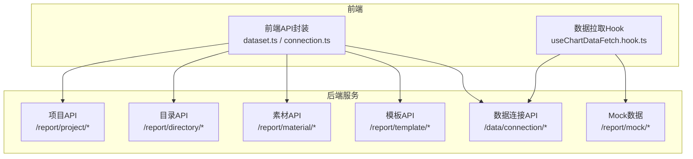
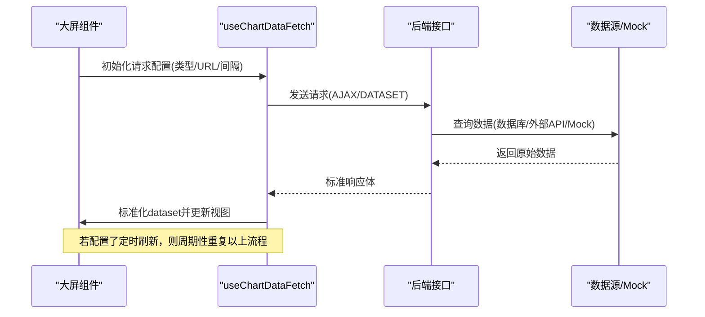
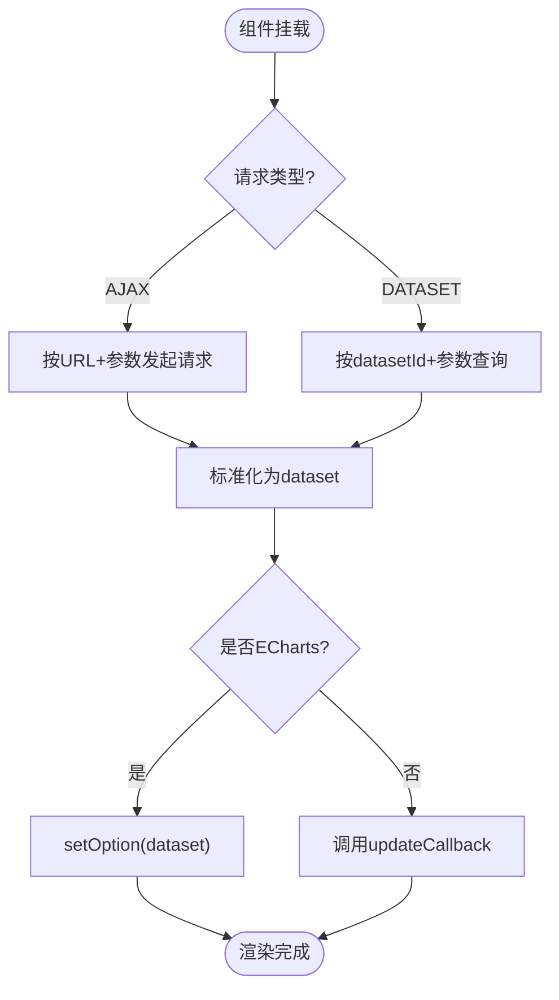
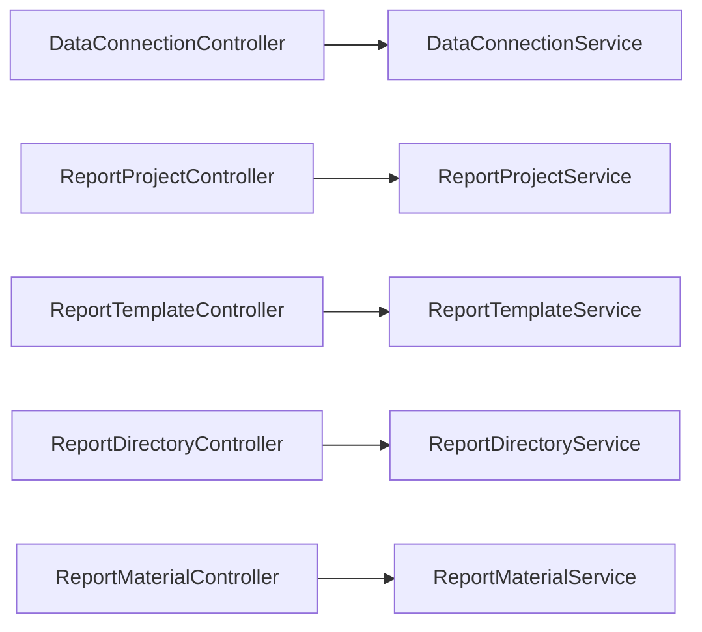

# 报表大屏API

<cite>
**本文引用的文件**
- [ReportProjectController.java](file://forge-server/forge-report-server/src/main/java/com/mdframe/forge/report/project/controller/ReportProjectController.java)
- [ReportTemplateController.java](file://forge-server/forge-report-server/src/main/java/com/mdframe/forge/report/project/template/controller/ReportTemplateController.java)
- [ReportDirectoryController.java](file://forge-server/forge-report-server/src/main/java/com/mdframe/forge/report/project/directory/controller/ReportDirectoryController.java)
- [ReportMaterialController.java](file://forge-server/forge-report-server/src/main/java/com/mdframe/forge/report/material/controller/ReportMaterialController.java)
- [ReportMockDataController.java](file://forge-server/forge-report-server/src/main/java/com/mdframe/forge/report/mock/controller/ReportMockDataController.java)
- [DataConnectionController.java](file://forge-server/forge-framework/forge-plugin-parent/forge-plugin-data/src/main/java/com/mdframe/forge/plugin/data/controller/DataConnectionController.java)
- [DataConnectionService.java](file://forge-server/forge-framework/forge-plugin-parent/forge-plugin-data/src/main/java/com/mdframe/forge/plugin/data/service/DataConnectionService.java)
- [dataset.ts（前端）](file://forge-report-ui/src/api/data/dataset.ts)
- [connection.ts（前端）](file://forge-admin-ui/src/api/data/connection.ts)
- [useChartDataFetch.hook.ts（前端）](file://forge-report-ui/src/hooks/useChartDataFetch.hook.ts)
</cite>

## 目录
1. [简介](#简介)
2. [项目结构](#项目结构)
3. [核心组件](#核心组件)
4. [架构总览](#架构总览)
5. [详细接口说明](#详细接口说明)
6. [依赖关系分析](#依赖关系分析)
7. [性能与实时性](#性能与实时性)
8. [故障排查指南](#故障排查指南)
9. [结论](#结论)
10. [附录：完整示例与最佳实践](#附录完整示例与最佳实践)

## 简介
本文件面向“AI数据大屏”的API使用与集成，覆盖可视化编辑器、组件库管理、数据源配置、模板市场等能力，重点提供大屏页面CRUD、图表组件配置、数据绑定、实时数据更新等接口的详细说明。同时解释数据可视化架构、组件渲染机制与数据聚合策略，并给出创建、编辑、发布大屏的完整示例与最佳实践。

## 项目结构
后端以Spring Boot控制器为核心，按功能域划分：
- 项目与版本：/report/project
- 目录组织：/report/directory
- 素材管理：/report/material
- 模板市场：/report/template
- Mock数据：/report/mock
- 数据连接：/data/connection（通用数据资产插件）

前端在报表工程中通过统一HTTP封装调用上述接口，并在组件层通过数据拉取Hook完成数据绑定与实时更新。

**图示来源**
- [ReportProjectController.java:17-110](file://forge-server/forge-report-server/src/main/java/com/mdframe/forge/report/project/controller/ReportProjectController.java#L17-L110)
- [ReportDirectoryController.java:17-77](file://forge-server/forge-report-server/src/main/java/com/mdframe/forge/report/project/directory/controller/ReportDirectoryController.java#L17-L77)
- [ReportMaterialController.java:16-65](file://forge-server/forge-report-server/src/main/java/com/mdframe/forge/report/material/controller/ReportMaterialController.java#L16-L65)
- [ReportTemplateController.java:17-101](file://forge-server/forge-report-server/src/main/java/com/mdframe/forge/report/project/template/controller/ReportTemplateController.java#L17-L101)
- [ReportMockDataController.java:18-57](file://forge-server/forge-report-server/src/main/java/com/mdframe/forge/report/mock/controller/ReportMockDataController.java#L18-L57)
- [DataConnectionController.java:31-89](file://forge-server/forge-framework/forge-plugin-parent/forge-plugin-data/src/main/java/com/mdframe/forge/plugin/data/controller/DataConnectionController.java#L31-L89)
- [dataset.ts（前端）:1-68](file://forge-report-ui/src/api/data/dataset.ts#L1-L68)
- [connection.ts（前端）:61-91](file://forge-admin-ui/src/api/data/connection.ts#L61-L91)
- [useChartDataFetch.hook.ts（前端）:26-118](file://forge-report-ui/src/hooks/useChartDataFetch.hook.ts#L26-L118)

**章节来源**
- [ReportProjectController.java:17-110](file://forge-server/forge-report-server/src/main/java/com/mdframe/forge/report/project/controller/ReportProjectController.java#L17-L110)
- [ReportDirectoryController.java:17-77](file://forge-server/forge-report-server/src/main/java/com/mdframe/forge/report/project/directory/controller/ReportDirectoryController.java#L17-L77)
- [ReportMaterialController.java:16-65](file://forge-server/forge-report-server/src/main/java/com/mdframe/forge/report/material/controller/ReportMaterialController.java#L16-L65)
- [ReportTemplateController.java:17-101](file://forge-server/forge-report-server/src/main/java/com/mdframe/forge/report/project/template/controller/ReportTemplateController.java#L17-L101)
- [ReportMockDataController.java:18-57](file://forge-server/forge-report-server/src/main/java/com/mdframe/forge/report/mock/controller/ReportMockDataController.java#L18-L57)
- [DataConnectionController.java:31-89](file://forge-server/forge-framework/forge-plugin-parent/forge-plugin-data/src/main/java/com/mdframe/forge/plugin/data/controller/DataConnectionController.java#L31-L89)
- [dataset.ts（前端）:1-68](file://forge-report-ui/src/api/data/dataset.ts#L1-L68)
- [connection.ts（前端）:61-91](file://forge-admin-ui/src/api/data/connection.ts#L61-L91)
- [useChartDataFetch.hook.ts（前端）:26-118](file://forge-report-ui/src/hooks/useChartDataFetch.hook.ts#L26-L118)

## 核心组件
- 项目与版本管理：支持分页查询、详情、历史版本、发布、回滚等。
- 目录管理：树形目录、增删改查与移动。
- 素材管理：分页查询、上传后登记、删除、重命名。
- 模板市场：我的模板、市场模板、从项目创建模板、复制为项目、发布。
- 数据连接：连接列表、新增/修改、测试连通、表/字段元数据获取。
- Mock数据：用于前端联调与演示的固定数据集。

**章节来源**
- [ReportProjectController.java:27-108](file://forge-server/forge-report-server/src/main/java/com/mdframe/forge/report/project/controller/ReportProjectController.java#L27-L108)
- [ReportDirectoryController.java:26-75](file://forge-server/forge-report-server/src/main/java/com/mdframe/forge/report/project/directory/controller/ReportDirectoryController.java#L26-L75)
- [ReportMaterialController.java:25-63](file://forge-server/forge-report-server/src/main/java/com/mdframe/forge/report/material/controller/ReportMaterialController.java#L25-L63)
- [ReportTemplateController.java:26-99](file://forge-server/forge-report-server/src/main/java/com/mdframe/forge/report/project/template/controller/ReportTemplateController.java#L26-L99)
- [DataConnectionController.java:43-89](file://forge-server/forge-framework/forge-plugin-parent/forge-plugin-data/src/main/java/com/mdframe/forge/plugin/data/controller/DataConnectionController.java#L43-L89)
- [ReportMockDataController.java:27-55](file://forge-server/forge-report-server/src/main/java/com/mdframe/forge/report/mock/controller/ReportMockDataController.java#L27-L55)

## 架构总览
大屏数据流由“前端组件 -> 数据拉取Hook -> 后端接口 -> 数据源/Mock”构成。组件通过统一的请求配置（URL、参数、定时刷新）发起请求；Hook负责将响应标准化为dataset，并驱动图表渲染或回调更新。

**图示来源**
- [useChartDataFetch.hook.ts（前端）:26-118](file://forge-report-ui/src/hooks/useChartDataFetch.hook.ts#L26-L118)
- [ReportMockDataController.java:27-55](file://forge-server/forge-report-server/src/main/java/com/mdframe/forge/report/mock/controller/ReportMockDataController.java#L27-L55)
- [DataConnectionController.java:43-89](file://forge-server/forge-framework/forge-plugin-parent/forge-plugin-data/src/main/java/com/mdframe/forge/plugin/data/controller/DataConnectionController.java#L43-L89)

## 详细接口说明

### 一、项目与版本管理（/report/project）
- 分页查询项目列表
  - 方法：GET
  - 路径：/report/project/page
  - 参数：pageNum, pageSize, projectName?, directoryId?
  - 返回：分页对象
- 查询项目详情
  - 方法：GET
  - 路径：/report/project/{id}
  - 返回：项目实体
- 分页查询历史版本
  - 方法：GET
  - 路径：/report/project/{projectId}/versions
  - 参数：projectId, pageNum, pageSize
  - 返回：版本分页
- 查询版本详情
  - 方法：GET
  - 路径：/report/project/version/{versionId}
  - 返回：版本实体
- 创建项目
  - 方法：POST
  - 路径：/report/project
  - 请求体：项目信息
  - 返回：新建项目
- 更新项目
  - 方法：PUT
  - 路径：/report/project
  - 请求体：项目信息
  - 返回：成功
- 删除项目
  - 方法：DELETE
  - 路径：/report/project/{id}
  - 返回：成功
- 发布项目
  - 方法：POST
  - 路径：/report/project/publish/{id}
  - 参数：publishUrl
  - 返回：成功
- 回退到指定版本
  - 方法：POST
  - 路径：/report/project/version/{versionId}/rollback
  - 返回：版本详情

**章节来源**
- [ReportProjectController.java:27-108](file://forge-server/forge-report-server/src/main/java/com/mdframe/forge/report/project/controller/ReportProjectController.java#L27-L108)

### 二、目录管理（/report/directory）
- 查询目录树
  - 方法：GET
  - 路径：/report/directory/tree
  - 返回：目录树
- 查询目录详情
  - 方法：GET
  - 路径：/report/directory/{id}
  - 返回：目录实体
- 创建目录
  - 方法：POST
  - 路径：/report/directory
  - 请求体：目录信息
  - 返回：新建目录
- 更新目录
  - 方法：PUT
  - 路径：/report/directory
  - 请求体：目录信息
  - 返回：成功
- 移动目录
  - 方法：PUT
  - 路径：/report/directory/move
  - 请求体：移动参数
  - 返回：成功
- 删除目录
  - 方法：DELETE
  - 路径：/report/directory/{id}
  - 返回：成功

**章节来源**
- [ReportDirectoryController.java:26-75](file://forge-server/forge-report-server/src/main/java/com/mdframe/forge/report/project/directory/controller/ReportDirectoryController.java#L26-L75)

### 三、素材管理（/report/material）
- 分页查询素材
  - 方法：GET
  - 路径：/report/material/page
  - 参数：pageNum, pageSize, originalName?, businessId?, isPrivate?, mimeType?
  - 返回：素材分页
- 登记素材（上传完成后）
  - 方法：POST
  - 路径：/report/material
  - 请求体：素材登记DTO
  - 返回：素材VO
- 删除素材
  - 方法：DELETE
  - 路径：/report/material/{fileId}
  - 返回：成功
- 重命名素材
  - 方法：PUT
  - 路径：/report/material/rename
  - 参数：fileId, originalName
  - 返回：成功

**章节来源**
- [ReportMaterialController.java:25-63](file://forge-server/forge-report-server/src/main/java/com/mdframe/forge/report/material/controller/ReportMaterialController.java#L25-L63)

### 四、模板市场（/report/template）
- 我的模板分页
  - 方法：GET
  - 路径：/report/template/page
  - 参数：pageNum, pageSize, templateName?, publishStatus?
  - 返回：模板分页
- 模板市场分页
  - 方法：GET
  - 路径：/report/template/market/page
  - 参数：pageNum, pageSize, templateName?
  - 返回：模板分页
- 模板详情
  - 方法：GET
  - 路径：/report/template/{id}
  - 返回：模板实体
- 从项目创建模板
  - 方法：POST
  - 路径：/report/template/from-project
  - 请求体：模板信息
  - 返回：新建模板
- 更新模板
  - 方法：PUT
  - 路径：/report/template
  - 请求体：模板信息
  - 返回：成功
- 删除模板
  - 方法：DELETE
  - 路径：/report/template/{id}
  - 返回：成功
- 发布模板到市场
  - 方法：POST
  - 路径：/report/template/publish/{id}
  - 参数：publishUrl?
  - 返回：成功
- 基于模板创建新项目
  - 方法：POST
  - 路径：/report/template/copy-to-project
  - 请求体：复制参数
  - 返回：复制结果

**章节来源**
- [ReportTemplateController.java:26-99](file://forge-server/forge-report-server/src/main/java/com/mdframe/forge/report/project/template/controller/ReportTemplateController.java#L26-L99)

### 五、数据源配置（/data/connection）
- 分页查询连接
  - 方法：GET
  - 路径：/data/connection/page
  - 参数：connectionName?, dbType?, status?, pageNum, pageSize
  - 返回：连接分页（敏感信息脱敏）
- 列出所有连接
  - 方法：GET
  - 路径：/data/connection/list
  - 返回：连接列表（敏感信息脱敏）
- 查询连接详情
  - 方法：GET
  - 路径：/data/connection/{id}
  - 返回：连接详情
- 新增连接
  - 方法：POST
  - 路径：/data/connection
  - 请求体：连接保存DTO
  - 返回：成功
- 修改连接
  - 方法：PUT
  - 路径：/data/connection
  - 请求体：连接保存DTO
  - 返回：成功
- 测试连接
  - 方法：POST
  - 路径：/data/connection/{id}/test
  - 返回：测试结果
- 临时测试连接
  - 方法：POST
  - 路径：/data/connection/test
  - 请求体：连接参数（dbType, driverClassName, jdbcUrl, username, password, testSql?）
  - 返回：测试结果
- 查询连接下的表
  - 方法：GET
  - 路径：/data/connection/{id}/tables
  - 参数：keyword?
  - 返回：表列表
- 查询表的字段
  - 方法：GET
  - 路径：/data/connection/{id}/tables/{tableName}/fields
  - 返回：字段元数据

**章节来源**
- [DataConnectionController.java:43-89](file://forge-server/forge-framework/forge-plugin-parent/forge-plugin-data/src/main/java/com/mdframe/forge/plugin/data/controller/DataConnectionController.java#L43-L89)
- [connection.ts（前端）:61-91](file://forge-admin-ui/src/api/data/connection.ts#L61-L91)

### 六、Mock数据（/report/mock）
- 财务月度营收支出
  - 方法：GET
  - 路径：/report/mock/finance/monthly-revenue-expense
  - 返回：包含dimensions与source的数据集

**章节来源**
- [ReportMockDataController.java:27-55](file://forge-server/forge-report-server/src/main/java/com/mdframe/forge/report/mock/controller/ReportMockDataController.java#L27-L55)

### 七、数据绑定与实时刷新（前端）
- 数据绑定
  - 组件通过chartConfig.option.dataset进行数据绑定。
  - 运行时通过dataset.ts中定义的查询DTO（datasetId, params, fields, pageNum, pageSize, maxRows, outputMode）向服务端请求数据。
- 实时刷新
  - useChartDataFetch根据组件配置的requestDataType、requestUrl、requestIntervalUnit/requestInterval进行AJAX或DATASET模式的数据拉取，并将标准化后的dataset注入组件。
  - ECharts类组件通过setOption更新dataset；其他组件通过updateCallback回调更新。

**图示来源**
- [useChartDataFetch.hook.ts（前端）:26-118](file://forge-report-ui/src/hooks/useChartDataFetch.hook.ts#L26-L118)
- [dataset.ts（前端）:19-68](file://forge-report-ui/src/api/data/dataset.ts#L19-L68)

**章节来源**
- [useChartDataFetch.hook.ts（前端）:26-118](file://forge-report-ui/src/hooks/useChartDataFetch.hook.ts#L26-L118)
- [dataset.ts（前端）:19-68](file://forge-report-ui/src/api/data/dataset.ts#L19-L68)

## 依赖关系分析
- 控制器与服务：各Controller依赖对应Service进行业务处理，返回RespInfo统一响应。
- 数据连接：DataConnectionController依赖DataConnectionService进行连接管理与校验，并对敏感信息进行脱敏。
- 前端与后端：前端API模块直接调用后端REST接口；数据拉取Hook统一处理请求与响应适配。

**图示来源**
- [DataConnectionController.java:31-89](file://forge-server/forge-framework/forge-plugin-parent/forge-plugin-data/src/main/java/com/mdframe/forge/plugin/data/controller/DataConnectionController.java#L31-L89)
- [DataConnectionService.java:10-23](file://forge-server/forge-framework/forge-plugin-parent/forge-plugin-data/src/main/java/com/mdframe/forge/plugin/data/service/DataConnectionService.java#L10-L23)
- [ReportProjectController.java:17-110](file://forge-server/forge-report-server/src/main/java/com/mdframe/forge/report/project/controller/ReportProjectController.java#L17-L110)
- [ReportTemplateController.java:17-101](file://forge-server/forge-report-server/src/main/java/com/mdframe/forge/report/project/template/controller/ReportTemplateController.java#L17-L101)
- [ReportDirectoryController.java:17-77](file://forge-server/forge-report-server/src/main/java/com/mdframe/forge/report/project/directory/controller/ReportDirectoryController.java#L17-L77)
- [ReportMaterialController.java:16-65](file://forge-server/forge-report-server/src/main/java/com/mdframe/forge/report/material/controller/ReportMaterialController.java#L16-L65)

**章节来源**
- [DataConnectionController.java:31-89](file://forge-server/forge-framework/forge-plugin-parent/forge-plugin-data/src/main/java/com/mdframe/forge/plugin/data/controller/DataConnectionController.java#L31-L89)
- [DataConnectionService.java:10-23](file://forge-server/forge-framework/forge-plugin-parent/forge-plugin-data/src/main/java/com/mdframe/forge/plugin/data/service/DataConnectionService.java#L10-L23)
- [ReportProjectController.java:17-110](file://forge-server/forge-report-server/src/main/java/com/mdframe/forge/report/project/controller/ReportProjectController.java#L17-L110)
- [ReportTemplateController.java:17-101](file://forge-server/forge-report-server/src/main/java/com/mdframe/forge/report/project/template/controller/ReportTemplateController.java#L17-L101)
- [ReportDirectoryController.java:17-77](file://forge-server/forge-report-server/src/main/java/com/mdframe/forge/report/project/directory/controller/ReportDirectoryController.java#L17-L77)
- [ReportMaterialController.java:16-65](file://forge-server/forge-report-server/src/main/java/com/mdframe/forge/report/material/controller/ReportMaterialController.java#L16-L65)

## 性能与实时性
- 分页与过滤：项目、目录、素材、模板均支持分页与可选过滤条件，减少首屏负载。
- 定时刷新：前端Hook支持全局与组件级定时刷新，避免频繁全量请求；建议合理设置间隔与maxRows限制。
- 数据脱敏：数据连接列表对敏感字段进行脱敏，降低泄露风险。
- 缓存与复用：建议在服务端对热点数据集做缓存，结合前端局部更新策略提升体验。

[本节为通用指导，不直接分析具体文件]

## 故障排查指南
- 数据连接失败
  - 使用“测试连接”接口验证连通性与凭据正确性。
  - 检查驱动类名、JDBC URL、用户名密码及Schema名称。
- 数据为空或格式异常
  - 确认组件的requestDataType与后端返回结构一致。
  - 检查dataset查询DTO中的params、fields、outputMode是否符合预期。
- 实时刷新不生效
  - 检查组件配置的requestIntervalUnit与requestInterval是否有效。
  - 查看网络请求是否被拦截或跨域限制。

**章节来源**
- [DataConnectionController.java:43-89](file://forge-server/forge-framework/forge-plugin-parent/forge-plugin-data/src/main/java/com/mdframe/forge/plugin/data/controller/DataConnectionController.java#L43-L89)
- [useChartDataFetch.hook.ts（前端）:26-118](file://forge-report-ui/src/hooks/useChartDataFetch.hook.ts#L26-L118)
- [dataset.ts（前端）:19-68](file://forge-report-ui/src/api/data/dataset.ts#L19-L68)

## 结论
本API体系围绕“项目-目录-素材-模板-数据连接-Mock”形成闭环，配合前端的统一数据拉取Hook，实现大屏的快速构建、灵活配置与实时展示。通过标准化的分页、版本化与发布能力，满足企业级大屏的协作与运维需求。

[本节为总结性内容，不直接分析具体文件]

## 附录：完整示例与最佳实践

### 示例一：创建并发布大屏
- 步骤
  1) 创建目录（可选）：POST /report/directory
  2) 创建项目：POST /report/project
  3) 添加素材（图片/视频）：POST /report/material
  4) 配置图表组件：在前端通过chartConfig.option.dataset绑定数据源或AJAX接口
  5) 发布项目：POST /report/project/publish/{id}?publishUrl=...
- 参考接口
  - [ReportDirectoryController.java:45-48](file://forge-server/forge-report-server/src/main/java/com/mdframe/forge/report/project/directory/controller/ReportDirectoryController.java#L45-L48)
  - [ReportProjectController.java:67-100](file://forge-server/forge-report-server/src/main/java/com/mdframe/forge/report/project/controller/ReportProjectController.java#L67-L100)
  - [ReportMaterialController.java:42-45](file://forge-server/forge-report-server/src/main/java/com/mdframe/forge/report/material/controller/ReportMaterialController.java#L42-L45)

**章节来源**
- [ReportDirectoryController.java:45-48](file://forge-server/forge-report-server/src/main/java/com/mdframe/forge/report/project/directory/controller/ReportDirectoryController.java#L45-L48)
- [ReportProjectController.java:67-100](file://forge-server/forge-report-server/src/main/java/com/mdframe/forge/report/project/controller/ReportProjectController.java#L67-L100)
- [ReportMaterialController.java:42-45](file://forge-server/forge-report-server/src/main/java/com/mdframe/forge/report/material/controller/ReportMaterialController.java#L42-L45)

### 示例二：基于模板快速生成大屏
- 步骤
  1) 浏览模板市场：GET /report/template/market/page
  2) 复制模板为项目：POST /report/template/copy-to-project
  3) 调整组件配置与数据绑定
  4) 发布项目
- 参考接口
  - [ReportTemplateController.java:38-47](file://forge-server/forge-report-server/src/main/java/com/mdframe/forge/report/project/template/controller/ReportTemplateController.java#L38-L47)
  - [ReportTemplateController.java:93-99](file://forge-server/forge-report-server/src/main/java/com/mdframe/forge/report/project/template/controller/ReportTemplateController.java#L93-L99)
  - [ReportProjectController.java:93-100](file://forge-server/forge-report-server/src/main/java/com/mdframe/forge/report/project/controller/ReportProjectController.java#L93-L100)

**章节来源**
- [ReportTemplateController.java:38-47](file://forge-server/forge-report-server/src/main/java/com/mdframe/forge/report/project/template/controller/ReportTemplateController.java#L38-L47)
- [ReportTemplateController.java:93-99](file://forge-server/forge-report-server/src/main/java/com/mdframe/forge/report/project/template/controller/ReportTemplateController.java#L93-L99)
- [ReportProjectController.java:93-100](file://forge-server/forge-report-server/src/main/java/com/mdframe/forge/report/project/controller/ReportProjectController.java#L93-L100)

### 示例三：配置数据源并绑定到图表
- 步骤
  1) 新增数据连接：POST /data/connection
  2) 测试连接：POST /data/connection/{id}/test
  3) 查询表与字段：GET /data/connection/{id}/tables & GET /data/connection/{id}/tables/{table}/fields
  4) 前端通过dataset.ts的queryDataDataset进行数据绑定
  5) 如需实时刷新，配置useChartDataFetch的interval
- 参考接口
  - [DataConnectionController.java:71-91](file://forge-server/forge-framework/forge-plugin-parent/forge-plugin-data/src/main/java/com/mdframe/forge/plugin/data/controller/DataConnectionController.java#L71-L91)
  - [connection.ts（前端）:61-91](file://forge-admin-ui/src/api/data/connection.ts#L61-L91)
  - [dataset.ts（前端）:19-68](file://forge-report-ui/src/api/data/dataset.ts#L19-L68)
  - [useChartDataFetch.hook.ts（前端）:26-118](file://forge-report-ui/src/hooks/useChartDataFetch.hook.ts#L26-L118)

**章节来源**
- [DataConnectionController.java:71-91](file://forge-server/forge-framework/forge-plugin-parent/forge-plugin-data/src/main/java/com/mdframe/forge/plugin/data/controller/DataConnectionController.java#L71-L91)
- [connection.ts（前端）:61-91](file://forge-admin-ui/src/api/data/connection.ts#L61-L91)
- [dataset.ts（前端）:19-68](file://forge-report-ui/src/api/data/dataset.ts#L19-L68)
- [useChartDataFetch.hook.ts（前端）:26-118](file://forge-report-ui/src/hooks/useChartDataFetch.hook.ts#L26-L118)

### 最佳实践
- 使用模板市场加速交付，优先复用已验证的布局与数据模型。
- 对高频数据采用分页与字段裁剪（fields），降低传输体积。
- 合理设置刷新间隔，避免过度请求；必要时在服务端引入缓存。
- 发布前务必执行“测试连接”，确保数据源可用。
- 版本化管理：利用版本列表与回滚能力，保障线上稳定性。

[本节为通用指导，不直接分析具体文件]