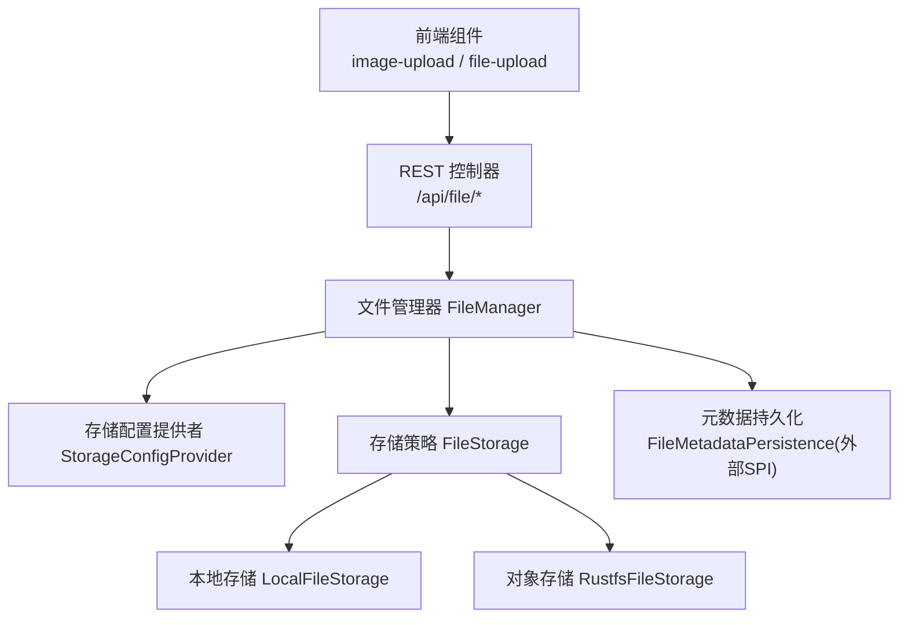
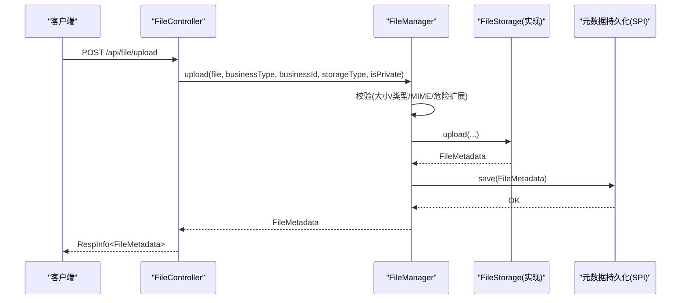
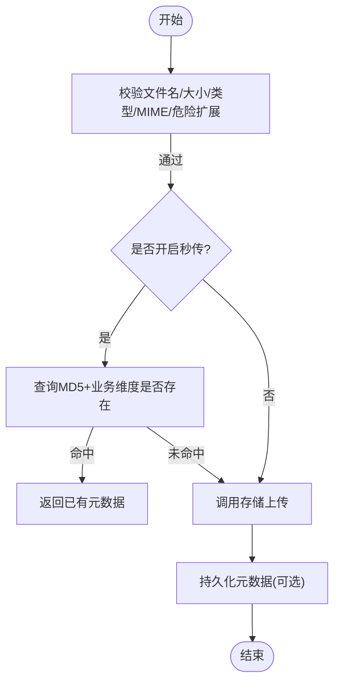
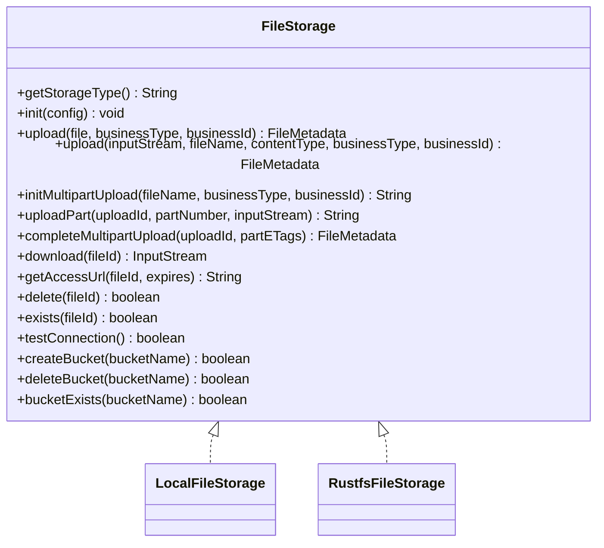
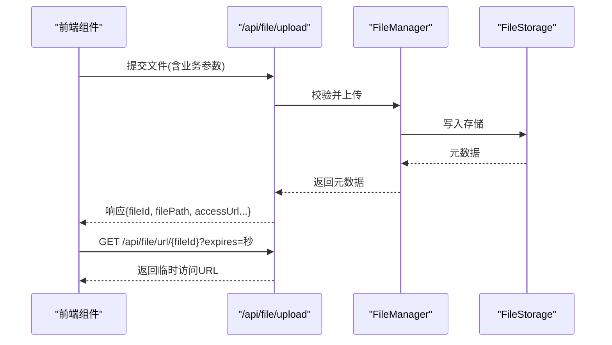
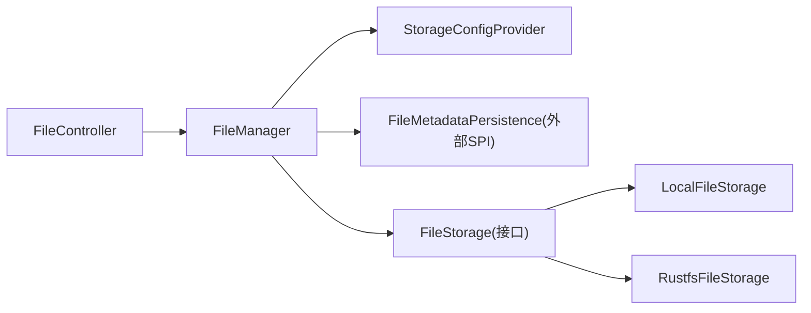

# 文件上传下载API

<cite>
**本文引用的文件**
- [FileController.java](file://forge-server/forge-framework/forge-starter-parent/forge-starter-file/src/main/java/com/mdframe/forge/starter/file/controller/FileController.java)
- [FileManager.java](file://forge-server/forge-framework/forge-starter-parent/forge-starter-file/src/main/java/com/mdframe/forge/starter/file/core/FileManager.java)
- [FileStorage.java](file://forge-server/forge-framework/forge-starter-parent/forge-starter-file/src/main/java/com/mdframe/forge/starter/file/storage/FileStorage.java)
- [LocalFileStorage.java](file://forge-server/forge-framework/forge-starter-parent/forge-starter-file/src/main/java/com/mdframe/forge/starter/file/storage/impl/LocalFileStorage.java)
- [RustfsFileStorage.java](file://forge-server/forge-framework/forge-starter-parent/forge-starter-file/src/main/java/com/mdframe/forge/starter/file/storage/impl/RustfsFileStorage.java)
- [StorageConfig.java](file://forge-server/forge-framework/forge-starter-parent/forge-starter-file/src/main/java/com/mdframe/forge/starter/file/model/StorageConfig.java)
- [FileMetadata.java](file://forge-server/forge-framework/forge-starter-parent/forge-starter-file/src/main/java/com/mdframe/forge/starter/file/model/FileMetadata.java)
- [StorageConfigProvider.java](file://forge-server/forge-framework/forge-starter-parent/forge-starter-file/src/main/java/com/mdframe/forge/starter/file/spi/StorageConfigProvider.java)
- [image-upload/index.vue](file://forge-admin-ui/src/components/image-upload/index.vue)
- [file-upload/index.vue](file://forge-admin-ui/src/components/file-upload/index.vue)
- [utils/file.js](file://forge-admin-ui/src/utils/file.js)
- [V1.0.72__require_file_storage_allowed_types.sql](file://forge-server/db/backup/V1.0.72__require_file_storage_allowed_types.sql)
</cite>

## 目录
1. [简介](#简介)
2. [项目结构](#项目结构)
3. [核心组件](#核心组件)
4. [架构总览](#架构总览)
5. [详细组件分析](#详细组件分析)
6. [依赖关系分析](#依赖关系分析)
7. [性能与容量规划](#性能与容量规划)
8. [故障排查指南](#故障排查指南)
9. [结论](#结论)
10. [附录：接口清单与安全最佳实践](#附录接口清单与安全最佳实践)

## 简介
本模块提供统一的文件上传、下载、访问URL生成、删除以及分片（断点续传）能力，支持本地存储与对象存储（如S3兼容）等多种后端。通过可插拔的存储策略与配置中心，实现灵活的文件存储策略、安全校验、格式与大小限制、临时链接生成与CDN集成等高级能力。前端提供图片与通用文件上传组件，并内置临时访问地址缓存与渲染优化。

## 项目结构
- 控制器层：统一对外暴露 /api/file 系列接口
- 核心服务：FileManager 负责上传、下载、删除、分片、访问URL生成、策略路由与校验
- 存储抽象：FileStorage 定义统一存储接口；LocalFileStorage、RustfsFileStorage 为具体实现
- 模型与SPI：StorageConfig、FileMetadata 描述配置与元数据；StorageConfigProvider 提供运行时配置读取
- 前端：image-upload、file-upload 组件封装上传流程；utils/file.js 提供临时访问地址解析与缓存

图表来源
- [FileController.java:22-27](file://forge-server/forge-framework/forge-starter-parent/forge-starter-file/src/main/java/com/mdframe/forge/starter/file/controller/FileController.java#L22-L27)
- [FileManager.java:74-80](file://forge-server/forge-framework/forge-starter-parent/forge-starter-file/src/main/java/com/mdframe/forge/starter/file/core/FileManager.java#L74-L80)
- [FileStorage.java:13-163](file://forge-server/forge-framework/forge-starter-parent/forge-starter-file/src/main/java/com/mdframe/forge/starter/file/storage/FileStorage.java#L13-L163)
- [LocalFileStorage.java:128-214](file://forge-server/forge-framework/forge-starter-parent/forge-starter-file/src/main/java/com/mdframe/forge/starter/file/storage/impl/LocalFileStorage.java#L128-L214)
- [RustfsFileStorage.java:230-261](file://forge-server/forge-framework/forge-starter-parent/forge-starter-file/src/main/java/com/mdframe/forge/starter/file/storage/impl/RustfsFileStorage.java#L230-L261)

章节来源
- [FileController.java:22-27](file://forge-server/forge-framework/forge-starter-parent/forge-starter-file/src/main/java/com/mdframe/forge/starter/file/controller/FileController.java#L22-L27)
- [FileManager.java:74-80](file://forge-server/forge-framework/forge-starter-parent/forge-starter-file/src/main/java/com/mdframe/forge/starter/file/core/FileManager.java#L74-L80)

## 核心组件
- 控制器 FileController：暴露 /api/file 的统一入口，包含上传、下载、获取访问URL、删除、桶管理、分片上传初始化/上传/完成
- 文件管理器 FileManager：统一编排上传、下载、删除、分片、访问URL生成；执行文件策略校验（类型、大小、MIME、危险扩展名）；路由到具体存储实现；可选秒传（基于MD5+业务维度）
- 存储抽象 FileStorage：定义上传、下载、分片、访问URL、删除、桶管理等标准方法
- 存储实现 LocalFileStorage、RustfsFileStorage：分别落地本地文件系统与S3兼容对象存储
- 配置与元数据 StorageConfig、FileMetadata：存储策略参数与文件元信息
- 配置SPI StorageConfigProvider：从数据库或外部源加载启用的存储配置，供运行时使用

章节来源
- [FileController.java:33-163](file://forge-server/forge-framework/forge-starter-parent/forge-starter-file/src/main/java/com/mdframe/forge/starter/file/controller/FileController.java#L33-L163)
- [FileManager.java:107-233](file://forge-server/forge-framework/forge-starter-parent/forge-starter-file/src/main/java/com/mdframe/forge/starter/file/core/FileManager.java#L107-L233)
- [FileStorage.java:13-163](file://forge-server/forge-framework/forge-starter-parent/forge-starter-file/src/main/java/com/mdframe/forge/starter/file/storage/FileStorage.java#L13-L163)
- [StorageConfig.java:12-108](file://forge-server/forge-framework/forge-starter-parent/forge-starter-file/src/main/java/com/mdframe/forge/starter/file/model/StorageConfig.java#L12-L108)
- [FileMetadata.java:13-109](file://forge-server/forge-framework/forge-starter-parent/forge-starter-file/src/main/java/com/mdframe/forge/starter/file/model/FileMetadata.java#L13-L109)
- [StorageConfigProvider.java:11-32](file://forge-server/forge-framework/forge-starter-parent/forge-starter-file/src/main/java/com/mdframe/forge/starter/file/spi/StorageConfigProvider.java#L11-L32)

## 架构总览
- 请求进入 FileController，按路径分发到对应方法
- 控制器调用 FileManager 执行业务逻辑
- FileManager 根据 storageType 选择具体 FileStorage 实现
- 上传前进行策略校验（大小、类型、MIME、危险扩展名），支持秒传
- 下载与访问URL由 FileManager 委托给具体存储实现
- 元数据通过外部 SPI 持久化（未在本仓库中实现）

图表来源
- [FileController.java:36-52](file://forge-server/forge-framework/forge-starter-parent/forge-starter-file/src/main/java/com/mdframe/forge/starter/file/controller/FileController.java#L36-L52)
- [FileManager.java:198-233](file://forge-server/forge-framework/forge-starter-parent/forge-starter-file/src/main/java/com/mdframe/forge/starter/file/core/FileManager.java#L198-L233)
- [FileStorage.java:25-46](file://forge-server/forge-framework/forge-starter-parent/forge-starter-file/src/main/java/com/mdframe/forge/starter/file/storage/FileStorage.java#L25-L46)

## 详细组件分析

### 控制器接口：/api/file
- 上传文件
  - 路径：POST /api/file/upload
  - 表单字段：file、businessType（默认common）、businessId（可选）、storageType（可选）、isPrivate（默认true）
  - 权限：仅管理员可上传公共素材（isPrivate=false）
  - 返回：文件元数据
- 下载文件
  - 路径：GET /api/file/download/{fileId}
  - 行为：以附件形式返回二进制流，更新下载次数
- 获取访问URL
  - 路径：GET /api/file/url/{fileId}?expires=秒
  - 行为：生成带过期时间的访问地址（私有资源需鉴权）
- 删除文件
  - 路径：DELETE /api/file/{fileId}
  - 行为：删除底层文件与元数据
- 分片上传
  - 初始化：POST /api/file/multipart/init
  - 上传分片：POST /api/file/multipart/upload
  - 完成合并：POST /api/file/multipart/complete
- 桶管理（需管理员）
  - 创建：POST /api/file/bucket
  - 删除：DELETE /api/file/bucket
  - 存在性检查：GET /api/file/bucket/exists

章节来源
- [FileController.java:33-163](file://forge-server/forge-framework/forge-starter-parent/forge-starter-file/src/main/java/com/mdframe/forge/starter/file/controller/FileController.java#L33-L163)

### 文件管理器：FileManager
- 上传流程
  - 校验：文件名、大小、扩展名、MIME、危险扩展名
  - 秒传：当 metadataPersistence 可用时，依据 MD5 + businessType + businessId 复用已有记录
  - 路由：根据 storageType 选择具体 FileStorage
  - 持久化：保存 FileMetadata（可选）
- 下载流程
  - 查询元数据 -> 定位存储 -> 流式下载 -> 更新下载次数
- 访问URL
  - 委托存储实现生成带过期时间的访问地址
- 分片上传
  - init/uploadPart/complete 三阶段，交由具体存储实现处理
- 配置刷新
  - 支持从 StorageConfigProvider 动态刷新已启用存储配置

图表来源
- [FileManager.java:198-233](file://forge-server/forge-framework/forge-starter-parent/forge-starter-file/src/main/java/com/mdframe/forge/starter/file/core/FileManager.java#L198-L233)
- [FileManager.java:479-509](file://forge-server/forge-framework/forge-starter-parent/forge-starter-file/src/main/java/com/mdframe/forge/starter/file/core/FileManager.java#L479-L509)

章节来源
- [FileManager.java:107-233](file://forge-server/forge-framework/forge-starter-parent/forge-starter-file/src/main/java/com/mdframe/forge/starter/file/core/FileManager.java#L107-L233)
- [FileManager.java:235-290](file://forge-server/forge-framework/forge-starter-parent/forge-starter-file/src/main/java/com/mdframe/forge/starter/file/core/FileManager.java#L235-L290)
- [FileManager.java:354-393](file://forge-server/forge-framework/forge-starter-parent/forge-starter-file/src/main/java/com/mdframe/forge/starter/file/core/FileManager.java#L354-L393)
- [FileManager.java:440-459](file://forge-server/forge-framework/forge-starter-parent/forge-starter-file/src/main/java/com/mdframe/forge/starter/file/core/FileManager.java#L440-L459)
- [FileManager.java:479-559](file://forge-server/forge-framework/forge-starter-parent/forge-starter-file/src/main/java/com/mdframe/forge/starter/file/core/FileManager.java#L479-L559)

### 存储策略：FileStorage 及实现
- 接口能力：上传（含流式与已知大小）、分片上传、下载、访问URL、删除、桶管理、连接测试
- 本地存储 LocalFileStorage：实现分片上传的初始化、分片写入、合并与清理
- 对象存储 RustfsFileStorage：实现S3兼容的分片上传完成流程与元信息回填

图表来源
- [FileStorage.java:13-163](file://forge-server/forge-framework/forge-starter-parent/forge-starter-file/src/main/java/com/mdframe/forge/starter/file/storage/FileStorage.java#L13-L163)
- [LocalFileStorage.java:128-214](file://forge-server/forge-framework/forge-starter-parent/forge-starter-file/src/main/java/com/mdframe/forge/starter/file/storage/impl/LocalFileStorage.java#L128-L214)
- [RustfsFileStorage.java:230-261](file://forge-server/forge-framework/forge-starter-parent/forge-starter-file/src/main/java/com/mdframe/forge/starter/file/storage/impl/RustfsFileStorage.java#L230-L261)

章节来源
- [FileStorage.java:13-163](file://forge-server/forge-framework/forge-starter-parent/forge-starter-file/src/main/java/com/mdframe/forge/starter/file/storage/FileStorage.java#L13-L163)
- [LocalFileStorage.java:128-214](file://forge-server/forge-framework/forge-starter-parent/forge-starter-file/src/main/java/com/mdframe/forge/starter/file/storage/impl/LocalFileStorage.java#L128-L214)
- [RustfsFileStorage.java:230-261](file://forge-server/forge-framework/forge-starter-parent/forge-starter-file/src/main/java/com/mdframe/forge/starter/file/storage/impl/RustfsFileStorage.java#L230-L261)

### 前端上传组件与访问URL
- 图片上传组件 image-upload
  - 默认上传地址：/api/file/upload
  - 支持业务类型、存储类型、数量限制、大小限制、文件类型过滤
  - 上传成功后优先使用本地 blob URL 预览，再替换为服务端返回的访问地址
- 通用文件上传组件 file-upload
  - 自动携带 Authorization、时间戳、随机数等请求头
  - 支持业务类型、存储类型、接受的文件类型过滤
- 访问URL工具 utils/file.js
  - 解析 fileId 或 filePath 为可直接渲染的URL
  - 调用 /api/file/url/{fileId}?expires=秒 获取临时访问地址
  - 内存与持久化双层缓存，避免频繁请求

图表来源
- [image-upload/index.vue:121-183](file://forge-admin-ui/src/components/image-upload/index.vue#L121-L183)
- [file-upload/index.vue:296-318](file://forge-admin-ui/src/components/file-upload/index.vue#L296-L318)
- [utils/file.js:194-244](file://forge-admin-ui/src/utils/file.js#L194-L244)
- [FileController.java:63-74](file://forge-server/forge-framework/forge-starter-parent/forge-starter-file/src/main/java/com/mdframe/forge/starter/file/controller/FileController.java#L63-L74)

章节来源
- [image-upload/index.vue:121-183](file://forge-admin-ui/src/components/image-upload/index.vue#L121-L183)
- [file-upload/index.vue:296-318](file://forge-admin-ui/src/components/file-upload/index.vue#L296-L318)
- [utils/file.js:194-244](file://forge-admin-ui/src/utils/file.js#L194-L244)

## 依赖关系分析
- 控制器依赖 FileManager
- FileManager 依赖 StorageConfigProvider（运行时配置）、FileMetadataPersistence（外部SPI，用于元数据持久化）
- FileManager 通过 FileStorage 接口解耦不同存储后端
- 前端组件依赖后端 /api/file 接口与临时URL接口

图表来源
- [FileController.java:22-27](file://forge-server/forge-framework/forge-starter-parent/forge-starter-file/src/main/java/com/mdframe/forge/starter/file/controller/FileController.java#L22-L27)
- [FileManager.java:74-80](file://forge-server/forge-framework/forge-starter-parent/forge-starter-file/src/main/java/com/mdframe/forge/starter/file/core/FileManager.java#L74-L80)
- [FileStorage.java:13-163](file://forge-server/forge-framework/forge-starter-parent/forge-starter-file/src/main/java/com/mdframe/forge/starter/file/storage/FileStorage.java#L13-L163)

章节来源
- [StorageConfigProvider.java:11-32](file://forge-server/forge-framework/forge-starter-parent/forge-starter-file/src/main/java/com/mdframe/forge/starter/file/spi/StorageConfigProvider.java#L11-L32)
- [FileManager.java:74-80](file://forge-server/forge-framework/forge-starter-parent/forge-starter-file/src/main/java/com/mdframe/forge/starter/file/core/FileManager.java#L74-L80)

## 性能与容量规划
- 大文件上传：使用分片上传接口，降低单次请求压力，提高网络容错与恢复能力
- 流式上传：对已知大小的文件流，优先使用带 fileSize 参数的上传方法，避免对象存储重复计算长度
- 访问URL缓存：前端对临时URL进行内存与持久化缓存，减少重复请求
- 并发控制：批量缩略图加载采用分批并发，避免一次性请求过多
- 存储选型：本地适合小规模与开发环境；对象存储适合大规模、高可用与CDN加速场景

[本节为通用指导，不直接分析具体文件]

## 故障排查指南
- 上传失败-类型不允许
  - 现象：提示“不支持的文件类型”
  - 原因：StorageConfig.allowedTypes 未配置或不包含该扩展名
  - 处理：在系统管理中配置允许的文件类型，确保非空且不含危险扩展名
- 上传失败-大小超限
  - 现象：提示“文件大小超过限制”
  - 原因：StorageConfig.maxFileSize 设置过小或未设置导致默认值限制
  - 处理：调整 maxFileSize 或前端限制
- 上传失败-MIME不匹配
  - 现象：提示“文件扩展名与内容类型不匹配”
  - 原因：客户端Content-Type与实际内容不一致
  - 处理：修正客户端上传时的Content-Type或文件本身
- 无法获取访问URL
  - 现象：临时URL为空或失效
  - 原因：expires过短或缓存过期
  - 处理：增大expires或强制刷新缓存后重试
- 分片上传失败
  - 现象：部分分片上传成功但合并失败
  - 原因：uploadId无效或分片顺序错误
  - 处理：重新初始化分片，确保partNumber连续且ETag顺序正确

章节来源
- [FileManager.java:479-559](file://forge-server/forge-framework/forge-starter-parent/forge-starter-file/src/main/java/com/mdframe/forge/starter/file/core/FileManager.java#L479-L559)
- [V1.0.72__require_file_storage_allowed_types.sql:1-22](file://forge-server/db/backup/V1.0.72__require_file_storage_allowed_types.sql#L1-L22)

## 结论
本模块通过统一的控制器与文件管理器，结合可插拔的存储策略与配置SPI，实现了安全可控、可扩展的文件上传下载能力。配合前端组件与临时URL机制，既保证了安全性又提升了用户体验。建议在生产环境启用对象存储与CDN，合理配置大小与类型限制，并通过分片上传提升大文件稳定性。

[本节为总结，不直接分析具体文件]

## 附录：接口清单与安全最佳实践

### 接口清单
- 上传文件
  - POST /api/file/upload
  - 参数：file、businessType、businessId、storageType、isPrivate
  - 说明：isPrivate=false 仅管理员可操作
- 下载文件
  - GET /api/file/download/{fileId}
  - 说明：以附件形式返回，更新下载次数
- 获取访问URL
  - GET /api/file/url/{fileId}?expires=秒
  - 说明：返回带过期时间的访问地址
- 删除文件
  - DELETE /api/file/{fileId}
- 分片上传
  - POST /api/file/multipart/init
  - POST /api/file/multipart/upload
  - POST /api/file/multipart/complete
- 桶管理（管理员）
  - POST /api/file/bucket
  - DELETE /api/file/bucket
  - GET /api/file/bucket/exists

章节来源
- [FileController.java:33-163](file://forge-server/forge-framework/forge-starter-parent/forge-starter-file/src/main/java/com/mdframe/forge/starter/file/controller/FileController.java#L33-L163)

### 配置项与限制
- 存储配置 StorageConfig
  - allowedTypes：必须配置且非空，逗号分隔的扩展名列表
  - maxFileSize：单位MB，未设置时使用默认值
  - domain/useHttps：访问域名与协议
  - endpoint/accessKey/secretKey/bucketName/region/basePath：各存储后端所需参数
- 安全限制
  - 危险扩展名与MIME白名单拦截
  - 上传前校验扩展名与Content-Type一致性
  - 公共素材上传仅限管理员

章节来源
- [StorageConfig.java:12-108](file://forge-server/forge-framework/forge-starter-parent/forge-starter-file/src/main/java/com/mdframe/forge/starter/file/model/StorageConfig.java#L12-L108)
- [FileManager.java:479-559](file://forge-server/forge-framework/forge-starter-parent/forge-starter-file/src/main/java/com/mdframe/forge/starter/file/core/FileManager.java#L479-L559)
- [V1.0.72__require_file_storage_allowed_types.sql:1-22](file://forge-server/db/backup/V1.0.72__require_file_storage_allowed_types.sql#L1-L22)

### 访问控制与临时链接
- 访问控制
  - 私有资源通过临时URL访问，URL带过期时间
  - 公共资源上传需管理员权限
- CDN集成
  - 可通过 StorageConfig.domain 指向CDN域名
  - 对象存储实现可结合CDN签名与缓存策略

章节来源
- [FileController.java:63-74](file://forge-server/forge-framework/forge-starter-parent/forge-starter-file/src/main/java/com/mdframe/forge/starter/file/controller/FileController.java#L63-L74)
- [FileManager.java:271-290](file://forge-server/forge-framework/forge-starter-parent/forge-starter-file/src/main/java/com/mdframe/forge/starter/file/core/FileManager.java#L271-L290)
- [StorageConfig.java:70-82](file://forge-server/forge-framework/forge-starter-parent/forge-starter-file/src/main/java/com/mdframe/forge/starter/file/model/StorageConfig.java#L70-L82)

### 完整示例（步骤说明）
- 单文件上传
  - 前端调用 /api/file/upload，携带 file 与业务参数
  - 后端校验并写入存储，返回元数据
  - 前端使用返回的 fileId 调用 /api/file/url 获取临时URL展示
- 图片上传
  - 使用 image-upload 组件，设置 fileType、limit、fileSize
  - 上传成功后优先本地预览，再替换为临时URL
- 批量上传
  - 前端循环调用 /api/file/upload，或使用分片上传组合多个文件
- 断点续传（分片）
  - 初始化分片 -> 上传分片 -> 合并完成
  - 失败可重试单个分片，无需重传整个文件

章节来源
- [image-upload/index.vue:121-183](file://forge-admin-ui/src/components/image-upload/index.vue#L121-L183)
- [file-upload/index.vue:296-318](file://forge-admin-ui/src/components/file-upload/index.vue#L296-L318)
- [utils/file.js:194-244](file://forge-admin-ui/src/utils/file.js#L194-L244)
- [FileController.java:119-163](file://forge-server/forge-framework/forge-starter-parent/forge-starter-file/src/main/java/com/mdframe/forge/starter/file/controller/FileController.java#L119-L163)

### 安全最佳实践
- 始终配置 allowedTypes，禁止危险扩展名
- 限制 maxFileSize，防止超大文件占用资源
- 校验 Content-Type 与扩展名一致性
- 私有资源一律通过临时URL访问，合理设置过期时间
- 对公共素材上传实施管理员权限控制
- 生产环境使用对象存储并启用CDN，结合签名与缓存策略

章节来源
- [FileManager.java:479-559](file://forge-server/forge-framework/forge-starter-parent/forge-starter-file/src/main/java/com/mdframe/forge/starter/file/core/FileManager.java#L479-L559)
- [FileController.java:33-52](file://forge-server/forge-framework/forge-starter-parent/forge-starter-file/src/main/java/com/mdframe/forge/starter/file/controller/FileController.java#L33-L52)
- [V1.0.72__require_file_storage_allowed_types.sql:1-22](file://forge-server/db/backup/V1.0.72__require_file_storage_allowed_types.sql#L1-L22)