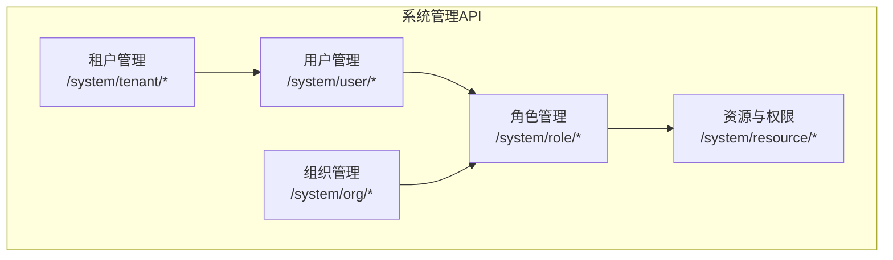
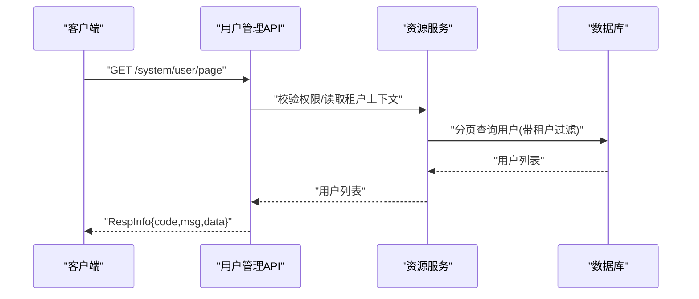
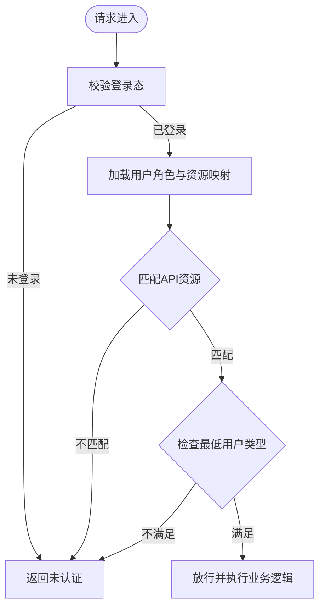
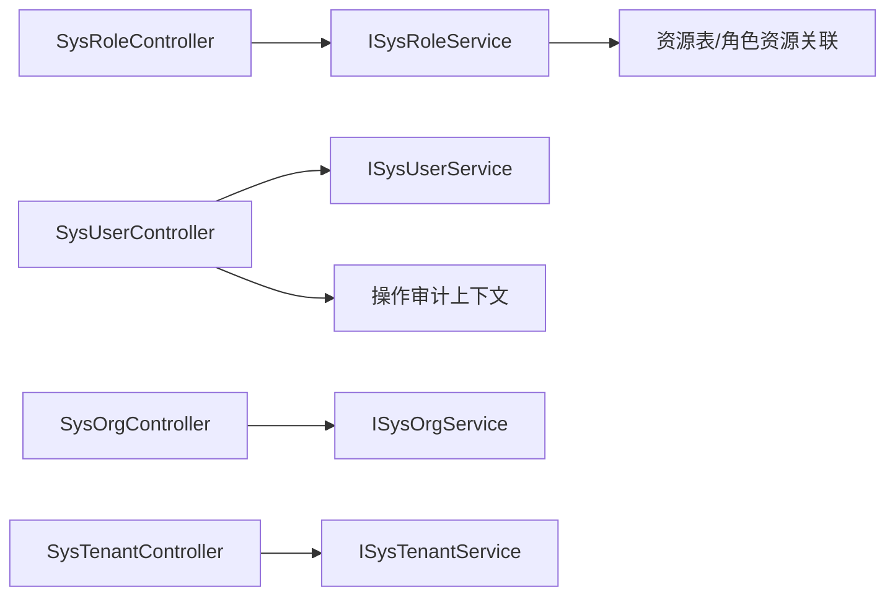

# 系统管理API

<cite>
**本文引用的文件**
- [SysUserController.java](file://forge-server/forge-framework/forge-plugin-parent/forge-plugin-system/src/main/java/com/mdframe/forge/plugin/system/controller/SysUserController.java)
- [SysRoleController.java](file://forge-server/forge-framework/forge-plugin-parent/forge-plugin-system/src/main/java/com/mdframe/forge/plugin/system/controller/SysRoleController.java)
- [SysOrgController.java](file://forge-server/forge-framework/forge-plugin-parent/forge-plugin-system/src/main/java/com/mdframe/forge/plugin/system/controller/SysOrgController.java)
- [SysTenantController.java](file://forge-server/forge-framework/forge-plugin-parent/forge-plugin-system/src/main/java/com/mdframe/forge/plugin/system/controller/SysTenantController.java)
- [api_resources_example.sql](file://forge-server/forge-admin-server/src/main/resources/sql/api_resources_example.sql)
- [V1.0.65__harden_user_type_permission_boundaries.sql](file://forge-server/db/backup/V1.0.65__harden_user_type_permission_boundaries.sql)
- [test_auth_data.sql](file://forge-server/forge-admin-server/src/main/resources/sql/test_auth_data.sql)
</cite>

## 目录
1. [简介](#简介)
2. [项目结构](#项目结构)
3. [核心组件](#核心组件)
4. [架构总览](#架构总览)
5. [详细组件分析](#详细组件分析)
6. [依赖关系分析](#依赖关系分析)
7. [性能考虑](#性能考虑)
8. [故障排查指南](#故障排查指南)
9. [结论](#结论)
10. [附录](#附录)

## 简介
本文件面向系统管理模块的RESTful API，覆盖用户管理、角色权限、菜单资源、组织部门与租户管理等核心能力。文档提供HTTP方法、URL模式、请求参数、响应格式与错误码说明，并给出认证方式、数据验证规则与最佳实践。同时解释RBAC在API层面的实现以及多租户环境下的数据隔离机制。

## 项目结构
系统管理API集中在“系统插件”模块中，按功能划分控制器：
- 用户管理：/system/user/*
- 角色管理：/system/role/*
- 组织管理：/system/org/*
- 租户管理：/system/tenant/*
- 资源与权限：/system/resource/*（由资源表驱动）

图表来源
- [SysUserController.java:50-56](file://forge-server/forge-framework/forge-plugin-parent/forge-plugin-system/src/main/java/com/mdframe/forge/plugin/system/controller/SysUserController.java#L50-L56)
- [SysRoleController.java:23-28](file://forge-server/forge-framework/forge-plugin-parent/forge-plugin-system/src/main/java/com/mdframe/forge/plugin/system/controller/SysRoleController.java#L23-L28)
- [SysOrgController.java:22-27](file://forge-server/forge-framework/forge-plugin-parent/forge-plugin-system/src/main/java/com/mdframe/forge/plugin/system/controller/SysOrgController.java#L22-L27)
- [SysTenantController.java:24-29](file://forge-server/forge-framework/forge-plugin-parent/forge-plugin-system/src/main/java/com/mdframe/forge/plugin/system/controller/SysTenantController.java#L24-L29)

章节来源
- [SysUserController.java:50-56](file://forge-server/forge-framework/forge-plugin-parent/forge-plugin-system/src/main/java/com/mdframe/forge/plugin/system/controller/SysUserController.java#L50-L56)
- [SysRoleController.java:23-28](file://forge-server/forge-framework/forge-plugin-parent/forge-plugin-system/src/main/java/com/mdframe/forge/plugin/system/controller/SysRoleController.java#L23-L28)
- [SysOrgController.java:22-27](file://forge-server/forge-framework/forge-plugin-parent/forge-plugin-system/src/main/java/com/mdframe/forge/plugin/system/controller/SysOrgController.java#L22-L27)
- [SysTenantController.java:24-29](file://forge-server/forge-framework/forge-plugin-parent/forge-plugin-system/src/main/java/com/mdframe/forge/plugin/system/controller/SysTenantController.java#L24-L29)

## 核心组件
- 用户管理：分页查询、详情、新增、编辑、删除、批量删除、绑定/解绑角色、组织、岗位、租户；导入导出；资料更新；状态管理；密码重置等。
- 角色管理：分页查询、详情、新增、编辑、删除、批量删除；绑定/解绑资源；数据范围配置；适用组织；角色下用户管理。
- 组织管理：分页查询、树形/懒加载树、子节点、当前可切换组织、切换组织；CRUD。
- 租户管理：分页查询、详情、用户当前租户配置、可切换租户选项、可分配租户选项；租户下用户列表；移出租户；切换租户；CRUD。
- 资源与权限：通过资源表维护菜单、按钮、接口等资源，支持通配符匹配；结合角色进行授权。

章节来源
- [SysUserController.java:63-419](file://forge-server/forge-framework/forge-plugin-parent/forge-plugin-system/src/main/java/com/mdframe/forge/plugin/system/controller/SysUserController.java#L63-L419)
- [SysRoleController.java:32-179](file://forge-server/forge-framework/forge-plugin-parent/forge-plugin-system/src/main/java/com/mdframe/forge/plugin/system/controller/SysRoleController.java#L32-L179)
- [SysOrgController.java:31-118](file://forge-server/forge-framework/forge-plugin-parent/forge-plugin-system/src/main/java/com/mdframe/forge/plugin/system/controller/SysOrgController.java#L31-L118)
- [SysTenantController.java:33-139](file://forge-server/forge-framework/forge-plugin-parent/forge-plugin-system/src/main/java/com/mdframe/forge/plugin/system/controller/SysTenantController.java#L33-L139)
- [api_resources_example.sql:13-43](file://forge-server/forge-admin-server/src/main/resources/sql/api_resources_example.sql#L13-L43)

## 架构总览
系统采用RBAC模型：用户-角色-资源（菜单/按钮/接口），并通过租户上下文实现数据隔离。接口统一返回RespInfo封装结果，支持加密/解密注解与操作审计。

图表来源
- [SysUserController.java:66-71](file://forge-server/forge-framework/forge-plugin-parent/forge-plugin-system/src/main/java/com/mdframe/forge/plugin/system/controller/SysUserController.java#L66-L71)
- [api_resources_example.sql:13-43](file://forge-server/forge-admin-server/src/main/resources/sql/api_resources_example.sql#L13-L43)

## 详细组件分析

### 用户管理API
- 基础信息
  - 路径前缀：/system/user
  - 安全：全局启用ApiDecrypt/ApiEncrypt；部分接口标注ApiPermissionIgnore免鉴权
  - 审计：关键写操作记录操作日志与差异快照
- 主要接口
  - GET /system/user/page：分页查询用户列表
    - 参数：查询条件对象（如用户名、状态、租户等）
    - 响应：RespInfo<IPage<SysUser>>
  - POST /system/user/getById：根据ID查询用户详情
    - 参数：id
    - 响应：RespInfo<SysUser>（自动清理敏感字段，管理员可见租户集合）
  - POST /system/user/add：新增用户
    - 请求体：SysUserDTO
    - 响应：RespInfo<Void>
  - POST /system/user/edit：修改用户
    - 请求体：SysUserDTO
    - 响应：RespInfo<Void>
  - POST /system/user/remove：删除用户
    - 参数：id
    - 响应：RespInfo<Void>
  - POST /system/user/removeBatch：批量删除
    - 请求体：Long[] ids
    - 响应：RespInfo<Void>
  - POST /system/user/{userId}/roles：绑定角色
    - 路径：userId
    - 请求体：Long[] roleIds
    - 可选参数：tenantId
    - 响应：RespInfo<Void>
  - POST /system/user/batch/roles：批量授权角色
    - 请求体：BatchUserRoleBindDTO
    - 响应：RespInfo<Void>
  - POST /system/user/{userId}/roles/unbind：解除角色
    - 路径：userId
    - 请求体：Long[] roleIds
    - 响应：RespInfo<Void>
  - POST /system/user/{userId}/org：绑定组织
    - 路径：userId
    - 参数：orgId, isMain(默认0)
    - 响应：RespInfo<Void>
  - POST /system/user/{userId}/org/unbind：解除组织
    - 路径：userId
    - 参数：orgId
    - 响应：RespInfo<Void>
  - GET /system/user/{userId}/roles：查询用户角色ID列表
    - 路径：userId
    - 可选参数：tenantId
    - 响应：RespInfo<List<Long>>
  - GET /system/user/{userId}/orgs：查询用户组织ID列表
    - 路径：userId
    - 可选参数：tenantId
    - 响应：RespInfo<List<Long>>
  - GET /system/user/{userId}/org-bindings：查询用户组织绑定详情
    - 路径：userId
    - 可选参数：tenantId
    - 响应：RespInfo<List<UserOrgBindingVO>>
  - GET /system/user/{userId}/tenants：查询用户租户绑定列表
    - 路径：userId
    - 响应：RespInfo<List<SysUserTenantVO>>
  - POST /system/user/{userId}/tenants：批量绑定租户
    - 路径：userId
    - 请求体：UserTenantBindDTO
    - 响应：RespInfo<Void>
  - POST /system/user/batch/tenants：批量加入租户
    - 请求体：BatchUserTenantBindDTO
    - 响应：RespInfo<Void>
  - POST /system/user/{userId}/orgs：批量绑定组织
    - 路径：userId
    - 请求体：UserOrgBindDTO
    - 可选参数：tenantId
    - 响应：RespInfo<Void>
  - GET /system/user/{userId}/org-roles：查询用户在指定组织的角色ID列表
    - 路径：userId
    - 参数：orgId
    - 可选参数：tenantId
    - 响应：RespInfo<List<Long>>
  - POST /system/user/{userId}/org-roles：保存用户在指定组织的角色
    - 路径：userId
    - 请求体：UserOrgRoleBindDTO
    - 响应：RespInfo<Void>
  - GET /system/user/{userId}/posts：查询用户岗位ID列表
    - 路径：userId
    - 可选参数：tenantId
    - 响应：RespInfo<List<Long>>
  - POST /system/user/{userId}/posts：批量绑定岗位
    - 路径：userId
    - 请求体：UserPostBindDTO
    - 可选参数：tenantId
    - 响应：RespInfo<Void>
  - POST /system/user/resetPwd：重置密码
    - 参数：id, password
    - 响应：RespInfo<Void>
  - POST /system/user/updateStatus：更新用户状态
    - 参数：id, status
    - 响应：RespInfo<Void>
  - POST /system/user/updateProfile：更新个人资料（免鉴权）
    - 请求体：SysUserDTO
    - 响应：RespInfo<Void>
  - GET /system/user/profile：获取当前登录用户资料（免鉴权）
    - 响应：RespInfo<SysUser>
  - POST /system/user/import：批量导入用户
    - 表单：file(MultipartFile)
    - 响应：RespInfo<ImportResult<?>>

- 数据验证与脱敏
  - 导入时必填校验：用户名、真实姓名、手机号、密码
  - 列表与详情返回时对电话、身份证、邮箱进行脱敏；清除密码与盐值

- 调用示例（以分页查询为例）
  - 认证：携带会话令牌或客户端凭据（依据平台集成）
  - 请求：GET /system/user/page?username=xxx&status=1
  - 响应：RespInfo{code: 200, msg: "成功", data: IPage}

- 错误码与异常
  - 业务失败：RespInfo.error("具体提示")
  - 参数缺失/非法：抛出业务异常（框架统一处理为错误响应）

章节来源
- [SysUserController.java:63-419](file://forge-server/forge-framework/forge-plugin-parent/forge-plugin-system/src/main/java/com/mdframe/forge/plugin/system/controller/SysUserController.java#L63-L419)
- [SysUserController.java:551-665](file://forge-server/forge-framework/forge-plugin-parent/forge-plugin-system/src/main/java/com/mdframe/forge/plugin/system/controller/SysUserController.java#L551-L665)

### 角色管理API
- 基础信息
  - 路径前缀：/system/role
  - 安全：全局启用ApiDecrypt/ApiEncrypt
- 主要接口
  - GET /system/role/page：分页查询角色
    - 参数：SysRoleQuery
    - 响应：RespInfo<IPage<SysRole>>
  - POST /system/role/getById：根据ID查询角色详情
    - 参数：id
    - 响应：RespInfo<SysRole>
  - POST /system/role/add：新增角色
    - 请求体：SysRoleDTO
    - 响应：RespInfo<Void>
  - POST /system/role/edit：修改角色
    - 请求体：SysRoleDTO
    - 响应：RespInfo<Void>
  - POST /system/role/remove：删除角色
    - 参数：id
    - 响应：RespInfo<Void>
  - POST /system/role/removeBatch：批量删除
    - 请求体：Long[] ids
    - 响应：RespInfo<Void>
  - POST /system/role/{roleId}/resources：绑定资源（菜单/按钮/接口）
    - 路径：roleId
    - 请求体：Long[] resourceIds
    - 可选参数：clientCode
    - 响应：RespInfo<Void>
  - POST /system/role/{roleId}/resources/unbind：解除资源
    - 路径：roleId
    - 请求体：Long[] resourceIds
    - 响应：RespInfo<Void>
  - GET /system/role/{roleId}/resources：查询角色资源ID列表
    - 路径：roleId
    - 可选参数：clientCode, includeParents
    - 响应：RespInfo<List<Long>>
  - GET /system/role/{roleId}/dataScopes：查询角色数据范围设置
    - 路径：roleId
    - 响应：RespInfo<RoleDataScopeSettingsVO>
  - POST /system/role/{roleId}/dataScopes：保存角色数据范围设置
    - 路径：roleId
    - 请求体：RoleDataScopeSettingsDTO
    - 响应：RespInfo<RoleDataScopeSettingsVO>
  - GET /system/role/{roleId}/orgs：查询角色适用组织ID列表
    - 路径：roleId
    - 响应：RespInfo<List<Long>>
  - POST /system/role/{roleId}/orgs：保存角色适用组织
    - 路径：roleId
    - 请求体：List<Long> orgIds
    - 响应：RespInfo<Void>
  - GET /system/role/{roleId}/users：查询角色下用户列表（分页）
    - 路径：roleId
    - 参数：RoleUserQuery
    - 响应：RespInfo<IPage<SysUser>>
  - POST /system/role/removeUserRole：移除角色用户
    - 参数：roleId, userId
    - 响应：RespInfo<Void>
  - POST /system/role/{roleId}/addUsers：批量添加用户到角色
    - 路径：roleId
    - 请求体：Long[] userIds
    - 响应：RespInfo<Void>

- 调用示例（以绑定资源为例）
  - 请求：POST /system/role/1/resources
  - 请求体：[10, 11, 12]
  - 响应：RespInfo<Void>

章节来源
- [SysRoleController.java:32-179](file://forge-server/forge-framework/forge-plugin-parent/forge-plugin-system/src/main/java/com/mdframe/forge/plugin/system/controller/SysRoleController.java#L32-L179)

### 组织管理API
- 基础信息
  - 路径前缀：/system/org
  - 安全：部分接口免鉴权（如树、懒加载、切换组织）
- 主要接口
  - GET /system/org/page：分页查询组织
    - 参数：SysOrgQuery
    - 响应：RespInfo<IPage<SysOrg>>
  - GET /system/org/tree：查询组织树
    - 参数：SysOrgQuery
    - 响应：RespInfo<List<SysOrg>>
  - GET /system/org/lazyTree：懒加载组织树
    - 参数：SysOrgQuery
    - 响应：RespInfo<List<SysOrgTreeVO>>
  - GET /system/org/children/{parentId}：查询子节点
    - 路径：parentId
    - 可选参数：tenantId
    - 响应：RespInfo<List<SysOrgTreeVO>>
  - GET /system/org/current/options：查询当前用户可切换组织
    - 响应：RespInfo<List<SysOrgTreeVO>>
  - POST /system/org/switch：切换当前组织
    - 参数：orgId
    - 响应：RespInfo<LoginUser>
  - POST /system/org/getById：根据ID查询组织详情
    - 参数：id
    - 响应：RespInfo<SysOrg>
  - POST /system/org/add：新增组织
    - 请求体：SysOrgDTO
    - 响应：RespInfo<Void>
  - POST /system/org/edit：修改组织
    - 请求体：SysOrgDTO
    - 响应：RespInfo<Void>
  - POST /system/org/remove：删除组织
    - 参数：id
    - 响应：RespInfo<Void>

- 调用示例（切换组织）
  - 请求：POST /system/org/switch?orgId=100
  - 响应：RespInfo<LoginUser>

章节来源
- [SysOrgController.java:31-118](file://forge-server/forge-framework/forge-plugin-parent/forge-plugin-system/src/main/java/com/mdframe/forge/plugin/system/controller/SysOrgController.java#L31-L118)

### 租户管理API
- 基础信息
  - 路径前缀：/system/tenant
  - 安全：部分接口免鉴权（如当前租户选项、切换租户）
- 主要接口
  - GET /system/tenant/page：分页查询租户
    - 参数：SysTenantQuery
    - 响应：RespInfo<IPage<SysTenant>>
  - POST /system/tenant/getById：根据ID查询租户详情
    - 参数：id
    - 响应：RespInfo<SysTenant>
  - POST /system/tenant/userTenantConfig：查询用户当前租户的配置
    - 可选参数：id
    - 响应：RespInfo<SysTenant>
  - GET /system/tenant/current/options：查询当前用户可切换租户
    - 响应：RespInfo<List<SysUserTenantVO>>
  - GET /system/tenant/assignable/options：查询可分配租户选项
    - 响应：RespInfo<List<SysTenant>>
  - GET /system/tenant/{tenantId}/users：分页查询租户下用户列表
    - 路径：tenantId
    - 参数：SysUserQuery
    - 响应：RespInfo<IPage<SysUser>>
  - POST /system/tenant/{tenantId}/users/{userId}/remove：将用户移出租户
    - 路径：tenantId, userId
    - 响应：RespInfo<Void>
  - POST /system/tenant/switch：切换当前登录租户
    - 参数：tenantId
    - 响应：RespInfo<LoginUser>
  - POST /system/tenant/add：新增租户
    - 请求体：SysTenantDTO
    - 响应：RespInfo<Void>
  - POST /system/tenant/edit：修改租户
    - 请求体：SysTenantDTO
    - 响应：RespInfo<Void>
  - POST /system/tenant/remove：删除租户
    - 参数：id
    - 响应：RespInfo<Void>
  - POST /system/tenant/removeBatch：批量删除租户
    - 请求体：Long[] ids
    - 响应：RespInfo<Void>

- 调用示例（切换租户）
  - 请求：POST /system/tenant/switch?tenantId=2
  - 响应：RespInfo<LoginUser>

章节来源
- [SysTenantController.java:33-139](file://forge-server/forge-framework/forge-plugin-parent/forge-plugin-system/src/main/java/com/mdframe/forge/plugin/system/controller/SysTenantController.java#L33-L139)

### 资源与权限（RBAC在API层面）
- 资源类型与匹配
  - 资源类型包含菜单、按钮、API接口等；API接口使用apiUrl字段，支持通配符匹配（如/system/**、/system/user/*）
- 权限校验流程
  - 登录成功后加载用户角色与资源映射
  - 访问受保护接口时，根据请求路径匹配资源表中的apiUrl
  - 若匹配成功且具备角色授权，则放行；否则拒绝
- 最低用户类型限制
  - 资源表支持min_user_type字段，限制最低可访问用户类型（系统管理员、租户管理员、普通用户）
- 示例资源与角色绑定
  - 示例SQL展示了系统管理模块API资源的注册与角色资源关联

图表来源
- [api_resources_example.sql:13-43](file://forge-server/forge-admin-server/src/main/resources/sql/api_resources_example.sql#L13-L43)
- [V1.0.65__harden_user_type_permission_boundaries.sql:1-38](file://forge-server/db/backup/V1.0.65__harden_user_type_permission_boundaries.sql#L1-L38)
- [test_auth_data.sql:93-122](file://forge-server/forge-admin-server/src/main/resources/sql/test_auth_data.sql#L93-L122)

章节来源
- [api_resources_example.sql:13-43](file://forge-server/forge-admin-server/src/main/resources/sql/api_resources_example.sql#L13-L43)
- [V1.0.65__harden_user_type_permission_boundaries.sql:1-38](file://forge-server/db/backup/V1.0.65__harden_user_type_permission_boundaries.sql#L1-L38)
- [test_auth_data.sql:93-122](file://forge-server/forge-admin-server/src/main/resources/sql/test_auth_data.sql#L93-L122)

## 依赖关系分析
- 控制器依赖服务层完成业务逻辑（如ISysUserService、ISysRoleService、ISysOrgService、ISysTenantService）
- 资源与权限通过资源表与角色-资源关联表实现
- 多租户通过租户上下文与用户-租户绑定实现数据隔离
- 审计与日志通过操作审计上下文记录变更前后快照

图表来源
- [SysUserController.java:58-61](file://forge-server/forge-framework/forge-plugin-parent/forge-plugin-system/src/main/java/com/mdframe/forge/plugin/system/controller/SysUserController.java#L58-L61)
- [SysRoleController.java:30-31](file://forge-server/forge-framework/forge-plugin-parent/forge-plugin-system/src/main/java/com/mdframe/forge/plugin/system/controller/SysRoleController.java#L30-L31)
- [SysOrgController.java:29-30](file://forge-server/forge-framework/forge-plugin-parent/forge-plugin-system/src/main/java/com/mdframe/forge/plugin/system/controller/SysOrgController.java#L29-L30)
- [SysTenantController.java:31-32](file://forge-server/forge-framework/forge-plugin-parent/forge-plugin-system/src/main/java/com/mdframe/forge/plugin/system/controller/SysTenantController.java#L31-L32)

章节来源
- [SysUserController.java:58-61](file://forge-server/forge-framework/forge-plugin-parent/forge-plugin-system/src/main/java/com/mdframe/forge/plugin/system/controller/SysUserController.java#L58-L61)
- [SysRoleController.java:30-31](file://forge-server/forge-framework/forge-plugin-parent/forge-plugin-system/src/main/java/com/mdframe/forge/plugin/system/controller/SysRoleController.java#L30-L31)
- [SysOrgController.java:29-30](file://forge-server/forge-framework/forge-plugin-parent/forge-plugin-system/src/main/java/com/mdframe/forge/plugin/system/controller/SysOrgController.java#L29-L30)
- [SysTenantController.java:31-32](file://forge-server/forge-framework/forge-plugin-parent/forge-plugin-system/src/main/java/com/mdframe/forge/plugin/system/controller/SysTenantController.java#L31-L32)

## 性能考虑
- 分页查询：所有列表接口均支持分页，避免一次性加载大量数据
- 树形结构：组织支持懒加载树，减少首屏数据量
- 缓存策略：可通过系统配置管理缓存策略（如字典、配置项）
- 数据脱敏：对敏感字段进行脱敏，降低网络传输与存储风险
- 批量操作：提供批量接口，减少往返次数

## 故障排查指南
- 常见错误
  - 未认证：检查会话令牌是否有效
  - 无权限：确认角色是否绑定对应资源，或用户类型是否满足最低要求
  - 参数缺失：检查必填参数是否完整
  - 导入失败：查看导入结果中的错误行与提示信息
- 定位方法
  - 查看操作日志与审计快照，对比变更前后数据
  - 核对资源表中的apiUrl与请求路径是否匹配
  - 检查租户上下文是否正确设置

章节来源
- [SysUserController.java:421-549](file://forge-server/forge-framework/forge-plugin-parent/forge-plugin-system/src/main/java/com/mdframe/forge/plugin/system/controller/SysUserController.java#L421-L549)
- [api_resources_example.sql:13-43](file://forge-server/forge-admin-server/src/main/resources/sql/api_resources_example.sql#L13-L43)

## 结论
本系统管理API基于RBAC与多租户设计，提供完整的用户、角色、资源、组织与租户管理能力。通过统一的响应封装、加密/解密注解与操作审计，确保安全性与可追溯性。建议在生产环境中合理配置资源权限、最小化用户类型限制，并结合分页与懒加载优化性能。

## 附录
- 通用响应格式
  - RespInfo：包含code、msg、data字段
- 认证方式
  - 会话令牌或客户端凭据（依平台集成）
- 数据验证规则
  - 导入时必填字段校验（用户名、真实姓名、手机号、密码）
  - 列表与详情返回时敏感字段脱敏
- 最佳实践
  - 使用分页与懒加载
  - 精确配置资源权限，遵循最小权限原则
  - 定期审查角色与资源绑定关系
  - 关注操作日志与审计快照