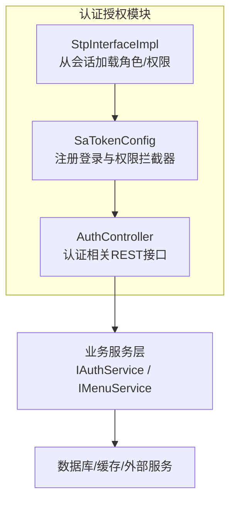
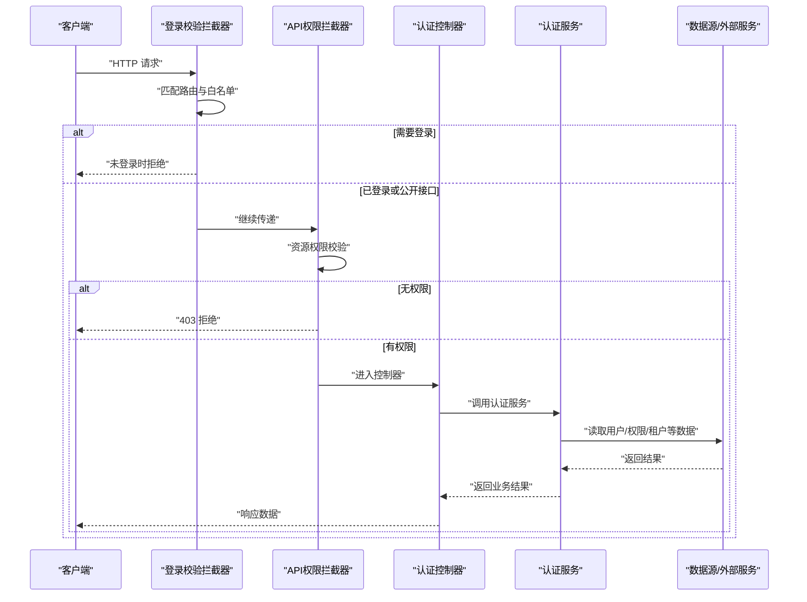
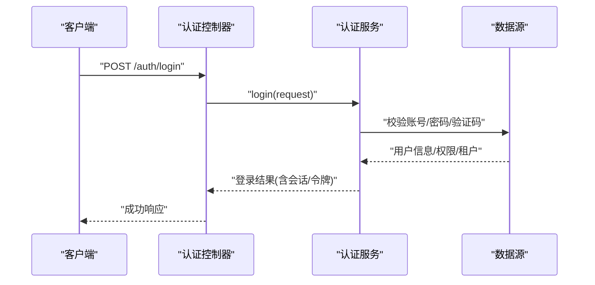
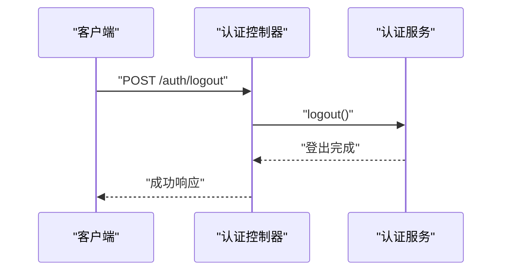
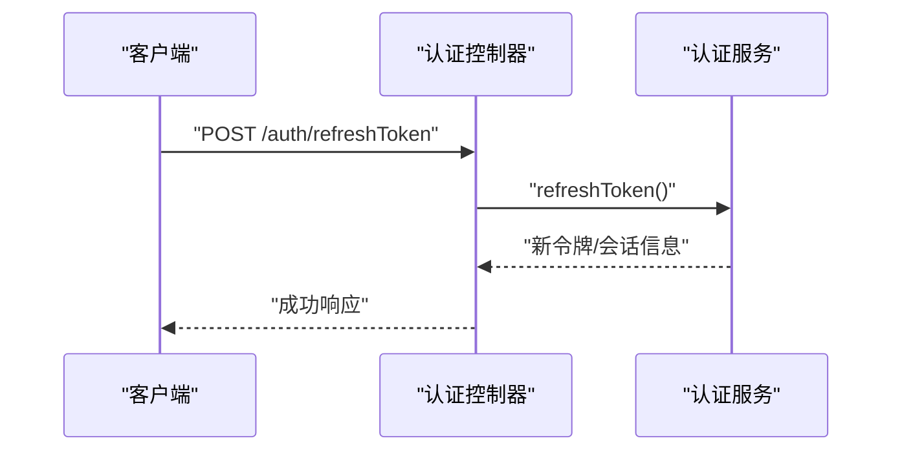
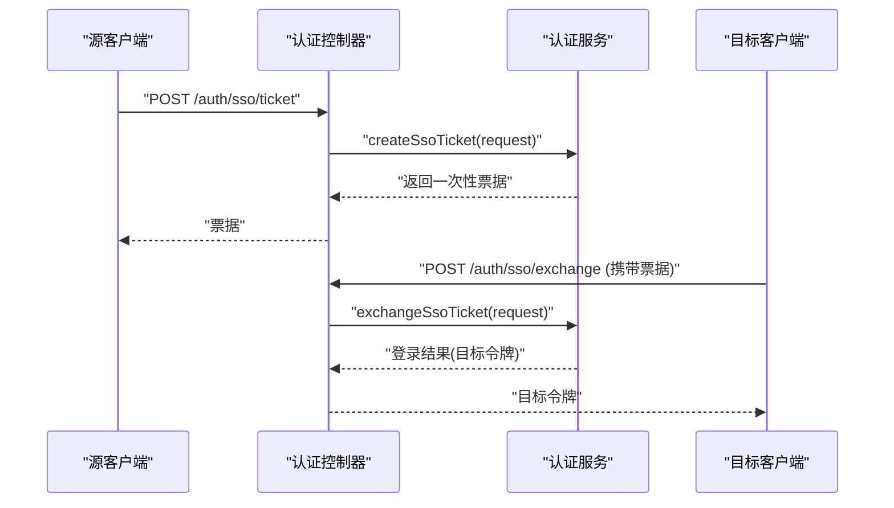
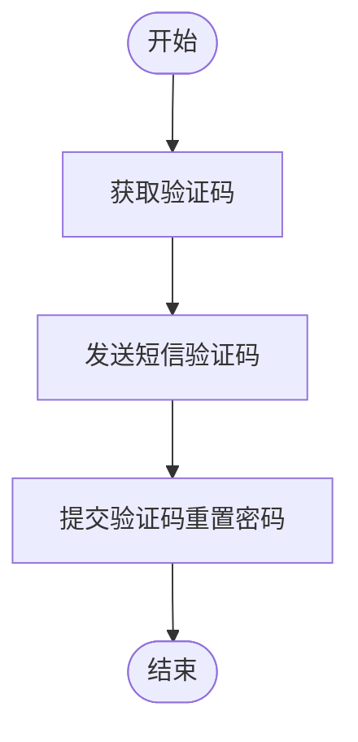
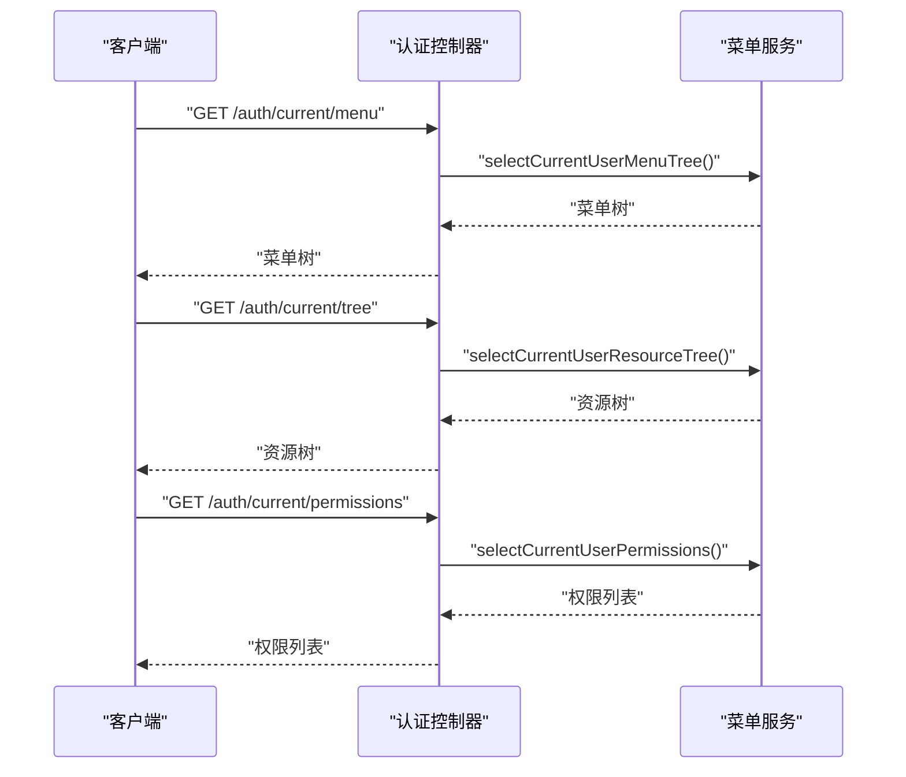
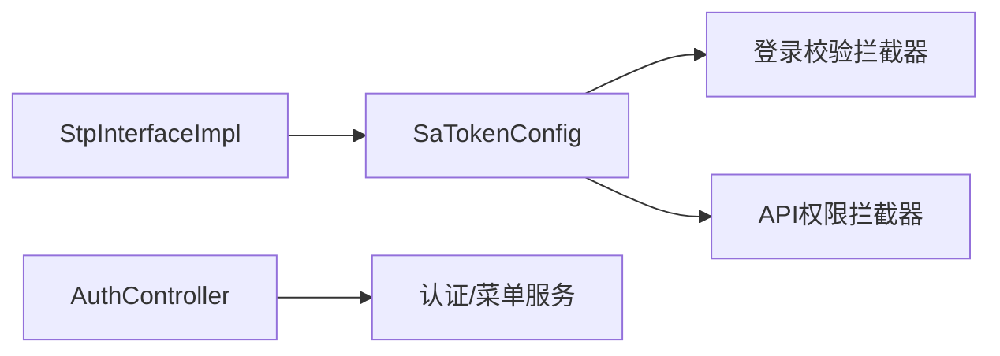

# 认证授权API

<cite>
**本文引用的文件**
- [SaTokenConfig.java](file://forge-server/forge-framework/forge-starter-parent/forge-starter-auth/src/main/java/com/mdframe/forge/starter/auth/config/SaTokenConfig.java)
- [StpInterfaceImpl.java](file://forge-server/forge-framework/forge-starter-parent/forge-starter-auth/src/main/java/com/mdframe/forge/starter/auth/config/StpInterfaceImpl.java)
- [AuthController.java](file://forge-server/forge-framework/forge-starter-parent/forge-starter-auth/src/main/java/com/mdframe/forge/starter/auth/controller/AuthController.java)
</cite>

## 目录
1. [简介](#简介)
2. [项目结构](#项目结构)
3. [核心组件](#核心组件)
4. [架构总览](#架构总览)
5. [详细组件分析](#详细组件分析)
6. [依赖关系分析](#依赖关系分析)
7. [性能考虑](#性能考虑)
8. [故障排查指南](#故障排查指南)
9. [结论](#结论)
10. [附录：接口清单与示例](#附录接口清单与示例)

## 简介
本文件面向认证授权模块的API文档，覆盖用户登录、登出、令牌刷新、SSO票据交换、验证码获取、密码重置、当前用户信息与权限资源查询等能力。系统基于 Sa-Token 实现会话与鉴权拦截，结合自定义权限扩展从会话中读取角色与权限集合；通过统一控制器暴露REST接口，并在配置层对公开与受保护路径进行细粒度白名单管理。多租户场景下，登录相关接口默认忽略租户上下文，确保跨租户登录流程稳定。

## 项目结构
认证授权能力集中在框架层的认证启动器模块中，包含：
- 安全配置与拦截器注册：定义登录校验与API权限校验的拦截顺序与排除规则
- 权限扩展：将会话中的角色与权限注入到 Sa-Token 的权限体系
- 认证控制器：提供统一的认证入口与常用认证操作

图表来源
- [SaTokenConfig.java:29-100](file://forge-server/forge-framework/forge-starter-parent/forge-starter-auth/src/main/java/com/mdframe/forge/starter/auth/config/SaTokenConfig.java#L29-L100)
- [StpInterfaceImpl.java:20-33](file://forge-server/forge-framework/forge-starter-parent/forge-starter-auth/src/main/java/com/mdframe/forge/starter/auth/config/StpInterfaceImpl.java#L20-L33)
- [AuthController.java:40-222](file://forge-server/forge-framework/forge-starter-parent/forge-starter-auth/src/main/java/com/mdframe/forge/starter/auth/controller/AuthController.java#L40-L222)

章节来源
- [SaTokenConfig.java:29-100](file://forge-server/forge-framework/forge-starter-parent/forge-starter-auth/src/main/java/com/mdframe/forge/starter/auth/config/SaTokenConfig.java#L29-L100)
- [StpInterfaceImpl.java:20-33](file://forge-server/forge-framework/forge-starter-parent/forge-starter-auth/src/main/java/com/mdframe/forge/starter/auth/config/StpInterfaceImpl.java#L20-L33)
- [AuthController.java:40-222](file://forge-server/forge-framework/forge-starter-parent/forge-starter-auth/src/main/java/com/mdframe/forge/starter/auth/controller/AuthController.java#L40-L222)

## 核心组件
- Sa-Token 配置与拦截器
  - 登录校验拦截器：对所有请求执行登录态检查，并对大量公开接口（登录、注册、验证码、SSO票据交换、健康检查、静态资源等）放行
  - API权限拦截器：在登录校验之后执行，基于数据库资源表配置进行细粒度权限控制，支持可配置的排除路径
- 权限扩展
  - 从会话中读取当前用户的角色键集合与权限码集合，并返回给 Sa-Token 用于注解式鉴权
- 认证控制器
  - 提供登录、登出、刷新令牌、SSO票据申请与交换、验证码、密码重置、当前用户信息、菜单与权限树等接口

章节来源
- [SaTokenConfig.java:29-100](file://forge-server/forge-framework/forge-starter-parent/forge-starter-auth/src/main/java/com/mdframe/forge/starter/auth/config/SaTokenConfig.java#L29-L100)
- [StpInterfaceImpl.java:20-33](file://forge-server/forge-framework/forge-starter-parent/forge-starter-auth/src/main/java/com/mdframe/forge/starter/auth/config/StpInterfaceImpl.java#L20-L33)
- [AuthController.java:40-222](file://forge-server/forge-framework/forge-starter-parent/forge-starter-auth/src/main/java/com/mdframe/forge/starter/auth/controller/AuthController.java#L40-L222)

## 架构总览
下图展示了认证请求的典型处理链路：客户端发起请求，先经过登录态校验，再进入API权限校验，最后到达控制器方法；控制器调用服务层完成具体业务逻辑，必要时访问数据源或外部服务。

图表来源
- [SaTokenConfig.java:29-100](file://forge-server/forge-framework/forge-starter-parent/forge-starter-auth/src/main/java/com/mdframe/forge/starter/auth/config/SaTokenConfig.java#L29-L100)
- [AuthController.java:40-222](file://forge-server/forge-framework/forge-starter-parent/forge-starter-auth/src/main/java/com/mdframe/forge/starter/auth/controller/AuthController.java#L40-L222)

## 详细组件分析

### 登录流程（用户名/密码/验证码）
- 入口：POST /auth/login
- 行为：根据请求参数选择认证方式（如用户名+密码或用户名+密码+验证码），由服务层完成校验与会话建立
- 安全：该接口被登录校验拦截器放行，且忽略租户上下文，便于跨租户登录

图表来源
- [AuthController.java:40-45](file://forge-server/forge-framework/forge-starter-parent/forge-starter-auth/src/main/java/com/mdframe/forge/starter/auth/controller/AuthController.java#L40-L45)

章节来源
- [AuthController.java:40-45](file://forge-server/forge-framework/forge-starter-parent/forge-starter-auth/src/main/java/com/mdframe/forge/starter/auth/controller/AuthController.java#L40-L45)

### 登出流程
- 入口：POST /auth/logout
- 行为：清除会话/令牌，支持幂等返回（重复登出不报错）
- 安全：被登录校验拦截器放行

图表来源
- [AuthController.java:73-78](file://forge-server/forge-framework/forge-starter-parent/forge-starter-auth/src/main/java/com/mdframe/forge/starter/auth/controller/AuthController.java#L73-L78)

章节来源
- [AuthController.java:73-78](file://forge-server/forge-framework/forge-starter-parent/forge-starter-auth/src/main/java/com/mdframe/forge/starter/auth/controller/AuthController.java#L73-L78)

### 令牌刷新
- 入口：POST /auth/refreshToken
- 行为：基于当前会话刷新令牌，延长有效期或更新令牌内容
- 安全：需已登录

图表来源
- [AuthController.java:193-198](file://forge-server/forge-framework/forge-starter-parent/forge-starter-auth/src/main/java/com/mdframe/forge/starter/auth/controller/AuthController.java#L193-L198)

章节来源
- [AuthController.java:193-198](file://forge-server/forge-framework/forge-starter-parent/forge-starter-auth/src/main/java/com/mdframe/forge/starter/auth/controller/AuthController.java#L193-L198)

### SSO 集成（一次性票据交换）
- 申请票据：POST /auth/sso/ticket（需已登录，忽略租户）
- 票据交换：POST /auth/sso/exchange（无需登录，忽略租户，支持加密传输）
- 行为：为第三方目标客户端签发一次性票据，再由目标客户端用票据换取目标令牌

图表来源
- [AuthController.java:48-68](file://forge-server/forge-framework/forge-starter-parent/forge-starter-auth/src/main/java/com/mdframe/forge/starter/auth/controller/AuthController.java#L48-L68)
- [SaTokenConfig.java:50-51](file://forge-server/forge-framework/forge-starter-parent/forge-starter-auth/src/main/java/com/mdframe/forge/starter/auth/config/SaTokenConfig.java#L50-L51)

章节来源
- [AuthController.java:48-68](file://forge-server/forge-framework/forge-starter-parent/forge-starter-auth/src/main/java/com/mdframe/forge/starter/auth/controller/AuthController.java#L48-L68)
- [SaTokenConfig.java:50-51](file://forge-server/forge-framework/forge-starter-parent/forge-starter-auth/src/main/java/com/mdframe/forge/starter/auth/config/SaTokenConfig.java#L50-L51)

### 验证码与密码重置
- 验证码：GET /auth/captcha、GET /auth/captcha/slider、POST /auth/captcha/sms
- 发送重置验证码：POST /auth/resetPassword/code
- 重置密码：POST /auth/resetPassword
- 安全：上述接口均被登录校验拦截器放行，忽略租户

图表来源
- [AuthController.java:141-139](file://forge-server/forge-framework/forge-starter-parent/forge-starter-auth/src/main/java/com/mdframe/forge/starter/auth/controller/AuthController.java#L141-L139)

章节来源
- [AuthController.java:141-169](file://forge-server/forge-framework/forge-starter-parent/forge-starter-auth/src/main/java/com/mdframe/forge/starter/auth/controller/AuthController.java#L141-L169)
- [AuthController.java:121-139](file://forge-server/forge-framework/forge-starter-parent/forge-starter-auth/src/main/java/com/mdframe/forge/starter/auth/controller/AuthController.java#L121-L139)

### 当前用户信息与权限资源
- 获取当前用户：GET /auth/userInfo（每次重建用户信息并回写会话）
- 获取菜单树：GET /auth/current/menu
- 获取资源树（含按钮权限）：GET /auth/current/tree
- 获取权限标识列表：GET /auth/current/permissions

图表来源
- [AuthController.java:200-222](file://forge-server/forge-framework/forge-starter-parent/forge-starter-auth/src/main/java/com/mdframe/forge/starter/auth/controller/AuthController.java#L200-L222)

章节来源
- [AuthController.java:80-99](file://forge-server/forge-framework/forge-starter-parent/forge-starter-auth/src/main/java/com/mdframe/forge/starter/auth/controller/AuthController.java#L80-L99)
- [AuthController.java:200-222](file://forge-server/forge-framework/forge-starter-parent/forge-starter-auth/src/main/java/com/mdframe/forge/starter/auth/controller/AuthController.java#L200-L222)

### 多租户认证
- 登录相关接口默认忽略租户上下文，避免登录阶段租户解析影响认证流程
- 登录后，后续业务接口按会话中的租户上下文进行数据隔离与权限过滤（由框架其他组件负责）

章节来源
- [AuthController.java:40-45](file://forge-server/forge-framework/forge-starter-parent/forge-starter-auth/src/main/java/com/mdframe/forge/starter/auth/controller/AuthController.java#L40-L45)
- [AuthController.java:48-68](file://forge-server/forge-framework/forge-starter-parent/forge-starter-auth/src/main/java/com/mdframe/forge/starter/auth/controller/AuthController.java#L48-L68)

### 角色权限控制与数据权限过滤
- 角色与权限来源：从会话中读取角色键集合与权限码集合，并注入到 Sa-Token 的权限体系
- 注解式鉴权：可在业务接口上使用权限注解进行细粒度控制（由框架统一处理）
- 数据权限：由业务层与数据访问层配合实现（例如按租户、组织维度过滤），不在认证模块内直接实现

章节来源
- [StpInterfaceImpl.java:20-33](file://forge-server/forge-framework/forge-starter-parent/forge-starter-auth/src/main/java/com/mdframe/forge/starter/auth/config/StpInterfaceImpl.java#L20-L33)

## 依赖关系分析
- 拦截器链：登录校验拦截器优先于API权限拦截器执行，确保先验证身份再进行资源级权限判断
- 控制器与服务：认证控制器仅做请求路由与响应封装，核心逻辑委托给服务层
- 权限扩展：通过会话持有者获取角色与权限，降低耦合度

图表来源
- [SaTokenConfig.java:29-100](file://forge-server/forge-framework/forge-starter-parent/forge-starter-auth/src/main/java/com/mdframe/forge/starter/auth/config/SaTokenConfig.java#L29-L100)
- [StpInterfaceImpl.java:20-33](file://forge-server/forge-framework/forge-starter-parent/forge-starter-auth/src/main/java/com/mdframe/forge/starter/auth/config/StpInterfaceImpl.java#L20-L33)
- [AuthController.java:40-222](file://forge-server/forge-framework/forge-starter-parent/forge-starter-auth/src/main/java/com/mdframe/forge/starter/auth/controller/AuthController.java#L40-L222)

章节来源
- [SaTokenConfig.java:29-100](file://forge-server/forge-framework/forge-starter-parent/forge-starter-auth/src/main/java/com/mdframe/forge/starter/auth/config/SaTokenConfig.java#L29-L100)
- [StpInterfaceImpl.java:20-33](file://forge-server/forge-framework/forge-starter-parent/forge-starter-auth/src/main/java/com/mdframe/forge/starter/auth/config/StpInterfaceImpl.java#L20-L33)
- [AuthController.java:40-222](file://forge-server/forge-framework/forge-starter-parent/forge-starter-auth/src/main/java/com/mdframe/forge/starter/auth/controller/AuthController.java#L40-L222)

## 性能考虑
- 登录校验与权限校验均为轻量级拦截器，建议保持白名单最小化以减少不必要的计算
- 当前用户信息接口每次重建用户对象，适合低频调用；高频场景可考虑前端缓存或增量刷新
- SSO票据交换为一次性凭证，减少长期票据泄露风险，但需保证票据生成与交换过程的高效性

[本节为通用指导，不直接分析具体文件]

## 故障排查指南
- 401 未登录：检查请求是否命中登录校验拦截器且未携带有效会话；确认未误加入白名单
- 403 无权限：检查API权限拦截器是否放行；核对当前用户角色与权限是否满足接口要求
- 登录失败：核对用户名、密码、验证码是否正确；查看服务层日志定位账户状态或策略限制
- SSO票据交换失败：确认票据是否过期、是否已被使用；检查加密配置与传输参数
- 密码重置失败：确认验证码是否有效、通道是否可用；检查用户邮箱/手机号绑定情况

[本节为通用指导，不直接分析具体文件]

## 结论
本认证授权模块以 Sa-Token 为核心，通过拦截器链实现“先登录、后权限”的统一鉴权模型；控制器提供完整的认证生命周期接口，涵盖登录、登出、刷新、SSO、验证码与密码重置等能力；权限体系通过会话注入角色与权限，支撑注解式鉴权与资源级控制。多租户场景下，登录相关接口忽略租户上下文，保障认证流程稳定性。

[本节为总结性内容，不直接分析具体文件]

## 附录：接口清单与示例
以下列出认证相关的主要接口及其用途说明（不包含具体代码片段）。

- 统一登录
  - 方法：POST
  - 路径：/auth/login
  - 说明：支持多种认证方式（用户名+密码或用户名+密码+验证码）
  - 参考：[AuthController.java:40-45](file://forge-server/forge-framework/forge-starter-parent/forge-starter-auth/src/main/java/com/mdframe/forge/starter/auth/controller/AuthController.java#L40-L45)

- 登出
  - 方法：POST
  - 路径：/auth/logout
  - 说明：清除会话/令牌，支持幂等返回
  - 参考：[AuthController.java:73-78](file://forge-server/forge-framework/forge-starter-parent/forge-starter-auth/src/main/java/com/mdframe/forge/starter/auth/controller/AuthController.java#L73-L78)

- 刷新令牌
  - 方法：POST
  - 路径：/auth/refreshToken
  - 说明：基于当前会话刷新令牌
  - 参考：[AuthController.java:193-198](file://forge-server/forge-framework/forge-starter-parent/forge-starter-auth/src/main/java/com/mdframe/forge/starter/auth/controller/AuthController.java#L193-L198)

- 申请SSO票据
  - 方法：POST
  - 路径：/auth/sso/ticket
  - 说明：为第三方目标客户端申请一次性票据
  - 参考：[AuthController.java:48-56](file://forge-server/forge-framework/forge-starter-parent/forge-starter-auth/src/main/java/com/mdframe/forge/starter/auth/controller/AuthController.java#L48-L56)

- 票据交换
  - 方法：POST
  - 路径：/auth/sso/exchange
  - 说明：使用一次性票据换发目标客户端令牌
  - 参考：[AuthController.java:58-68](file://forge-server/forge-framework/forge-starter-parent/forge-starter-auth/src/main/java/com/mdframe/forge/starter/auth/controller/AuthController.java#L58-L68)

- 获取验证码
  - 方法：GET
  - 路径：/auth/captcha
  - 说明：根据配置返回对应类型的验证码
  - 参考：[AuthController.java:141-149](file://forge-server/forge-framework/forge-starter-parent/forge-starter-auth/src/main/java/com/mdframe/forge/starter/auth/controller/AuthController.java#L141-L149)

- 获取滑块验证码
  - 方法：GET
  - 路径：/auth/captcha/slider
  - 说明：返回滑块验证码所需数据
  - 参考：[AuthController.java:151-159](file://forge-server/forge-framework/forge-starter-parent/forge-starter-auth/src/main/java/com/mdframe/forge/starter/auth/controller/AuthController.java#L151-L159)

- 发送短信验证码
  - 方法：POST
  - 路径：/auth/captcha/sms
  - 说明：向指定手机号发送短信验证码
  - 参考：[AuthController.java:161-169](file://forge-server/forge-framework/forge-starter-parent/forge-starter-auth/src/main/java/com/mdframe/forge/starter/auth/controller/AuthController.java#L161-L169)

- 发送找回密码验证码
  - 方法：POST
  - 路径：/auth/resetPassword/code
  - 说明：发送重置密码验证码（通道由全局配置决定）
  - 参考：[AuthController.java:121-129](file://forge-server/forge-framework/forge-starter-parent/forge-starter-auth/src/main/java/com/mdframe/forge/starter/auth/controller/AuthController.java#L121-L129)

- 重置密码
  - 方法：POST
  - 路径：/auth/resetPassword
  - 说明：通过验证码重置密码
  - 参考：[AuthController.java:131-139](file://forge-server/forge-framework/forge-starter-parent/forge-starter-auth/src/main/java/com/mdframe/forge/starter/auth/controller/AuthController.java#L131-L139)

- 获取登录配置
  - 方法：GET
  - 路径：/auth/loginConfig
  - 说明：返回登录页所需配置（如租户选项、品牌信息等）
  - 参考：[AuthController.java:171-180](file://forge-server/forge-framework/forge-starter-parent/forge-starter-auth/src/main/java/com/mdframe/forge/starter/auth/controller/AuthController.java#L171-L180)

- 查询登录页可选租户
  - 方法：GET
  - 路径：/auth/tenant/options
  - 说明：返回登录时可切换的租户列表
  - 参考：[AuthController.java:182-189](file://forge-server/forge-framework/forge-starter-parent/forge-starter-auth/src/main/java/com/mdframe/forge/starter/auth/controller/AuthController.java#L182-L189)

- 获取当前用户信息
  - 方法：GET
  - 路径：/auth/userInfo
  - 说明：每次重建用户信息并回写会话
  - 参考：[AuthController.java:80-99](file://forge-server/forge-framework/forge-starter-parent/forge-starter-auth/src/main/java/com/mdframe/forge/starter/auth/controller/AuthController.java#L80-L99)

- 获取当前用户菜单树
  - 方法：GET
  - 路径：/auth/current/menu
  - 说明：返回目录与菜单（不含按钮）
  - 参考：[AuthController.java:208-214](file://forge-server/forge-framework/forge-starter-parent/forge-starter-auth/src/main/java/com/mdframe/forge/starter/auth/controller/AuthController.java#L208-L214)

- 获取当前用户资源树
  - 方法：GET
  - 路径：/auth/current/tree
  - 说明：返回目录、菜单与按钮权限
  - 参考：[AuthController.java:200-206](file://forge-server/forge-framework/forge-starter-parent/forge-starter-auth/src/main/java/com/mdframe/forge/starter/auth/controller/AuthController.java#L200-L206)

- 获取当前用户权限标识
  - 方法：GET
  - 路径：/auth/current/permissions
  - 说明：返回权限码列表
  - 参考：[AuthController.java:216-222](file://forge-server/forge-framework/forge-starter-parent/forge-starter-auth/src/main/java/com/mdframe/forge/starter/auth/controller/AuthController.java#L216-L222)