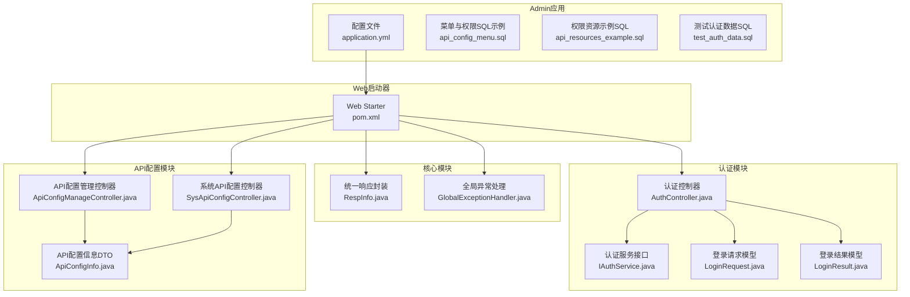
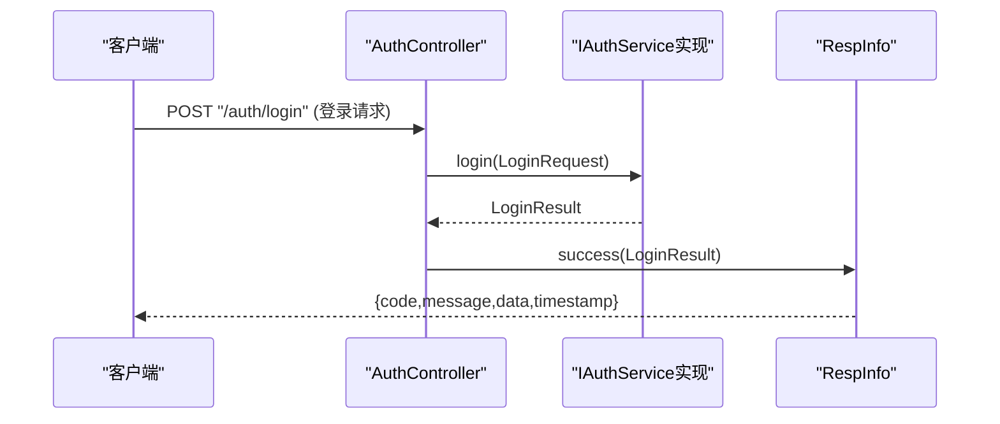
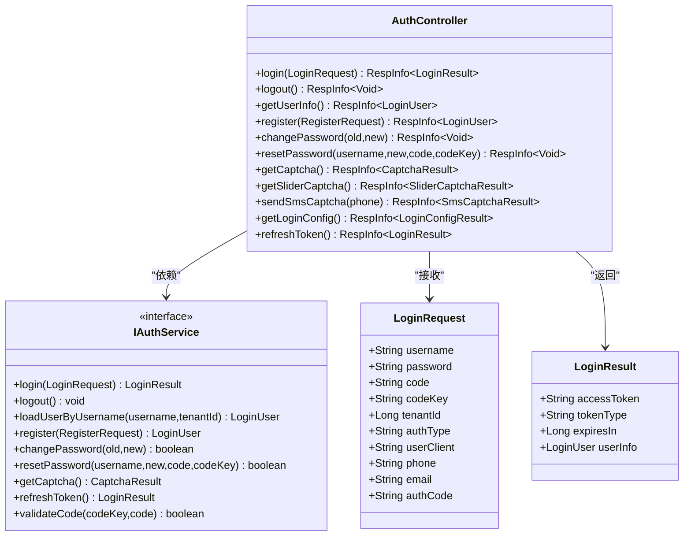
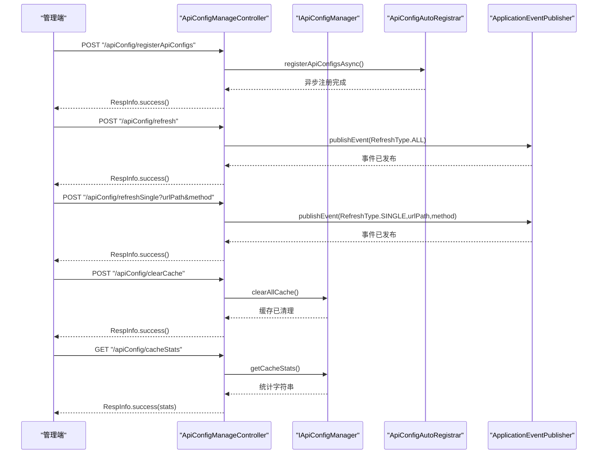
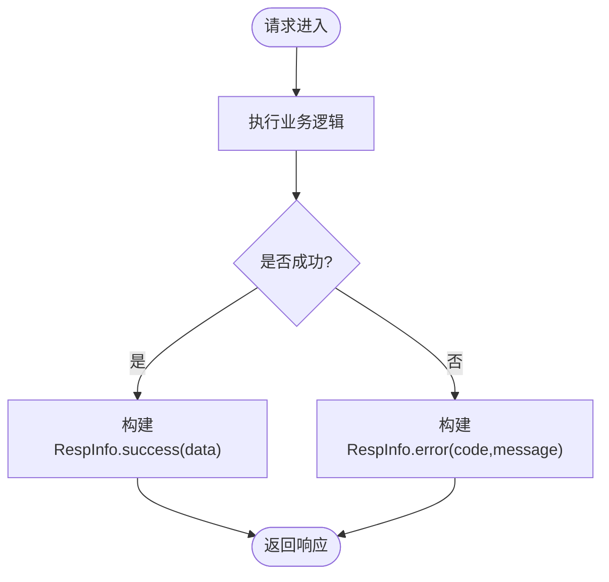
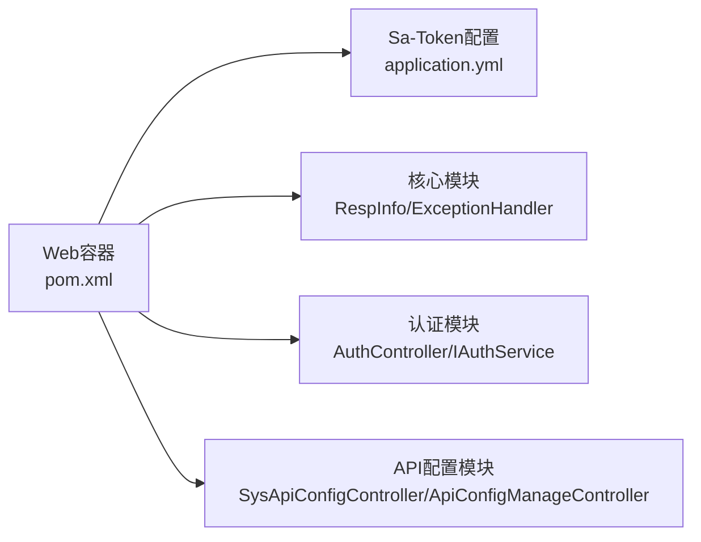

# API接口文档

<cite>
**本文档引用的文件**
- [application.yml](file://forge/forge-admin/src/main/resources/application.yml)
- [pom.xml](file://forge/forge-framework/forge-starter-parent/forge-starter-web/pom.xml)
- [GlobalExceptionHandler.java](file://forge/forge-framework/forge-starter-parent/forge-starter-core/src/main/java/com/mdframe/forge/starter/core/exception/GlobalExceptionHandler.java)
- [RespInfo.java](file://forge/forge-framework/forge-starter-parent/forge-starter-core/src/main/java/com/mdframe/forge/starter/core/domain/RespInfo.java)
- [AuthController.java](file://forge/forge-framework/forge-starter-parent/forge-starter-auth/src/main/java/com/mdframe/forge/starter/auth/controller/AuthController.java)
- [IAuthService.java](file://forge/forge-framework/forge-starter-parent/forge-starter-auth/src/main/java/com/mdframe/forge/starter/auth/service/IAuthService.java)
- [LoginRequest.java](file://forge/forge-framework/forge-starter-parent/forge-starter-auth/src/main/java/com/mdframe/forge/starter/auth/domain/LoginRequest.java)
- [LoginResult.java](file://forge/forge-framework/forge-starter-parent/forge-starter-auth/src/main/java/com/mdframe/forge/starter/auth/domain/LoginResult.java)
- [ApiConfigManageController.java](file://forge/forge-framework/forge-starter-parent/forge-starter-api-config/src/main/java/com/mdframe/forge/starter/apiconfig/controller/ApiConfigManageController.java)
- [SysApiConfigController.java](file://forge/forge-framework/forge-starter-parent/forge-starter-api-config/src/main/java/com/mdframe/forge/starter/apiconfig/controller/SysApiConfigController.java)
- [ApiConfigInfo.java](file://forge/forge-framework/forge-starter-parent/forge-starter-api-config/src/main/java/com/mdframe/forge/starter/apiconfig/domain/dto/ApiConfigInfo.java)
- [api_config_menu.sql](file://forge/forge-admin/src/main/resources/sql/api_config_menu.sql)
- [api_resources_example.sql](file://forge/forge-admin/src/main/resources/sql/api_resources_example.sql)
- [test_auth_data.sql](file://forge/forge-admin/src/main/resources/sql/test_auth_data.sql)
</cite>

## 目录
1. [简介](#简介)
2. [项目结构](#项目结构)
3. [核心组件](#核心组件)
4. [架构总览](#架构总览)
5. [详细组件分析](#详细组件分析)
6. [依赖关系分析](#依赖关系分析)
7. [性能考虑](#性能考虑)
8. [故障排除指南](#故障排除指南)
9. [结论](#结论)
10. [附录](#附录)

## 简介
本文件为Forge框架的完整API接口文档，覆盖RESTful API的设计规范与实现细节。文档面向后端开发者与前端/移动端集成人员，提供统一的响应格式、认证授权机制、权限控制策略、接口版本管理、调用示例与最佳实践。同时包含性能优化、限流策略与安全防护建议，帮助团队高效、安全地使用框架提供的所有API。

## 项目结构
Forge采用多模块Maven工程，核心Web容器基于Undertow，统一异常处理与响应封装，认证授权与API配置管理分别由独立模块提供能力。Admin子项目提供后台管理界面与基础数据示例。

**图表来源**
- [application.yml](file://forge/forge-admin/src/main/resources/application.yml#L1-L100)
- [pom.xml](file://forge/forge-framework/forge-starter-parent/forge-starter-web/pom.xml#L1-L63)
- [RespInfo.java](file://forge/forge-framework/forge-starter-parent/forge-starter-core/src/main/java/com/mdframe/forge/starter/core/domain/RespInfo.java#L1-L97)
- [GlobalExceptionHandler.java](file://forge/forge-framework/forge-starter-parent/forge-starter-core/src/main/java/com/mdframe/forge/starter/core/exception/GlobalExceptionHandler.java#L1-L175)
- [AuthController.java](file://forge/forge-framework/forge-starter-parent/forge-starter-auth/src/main/java/com/mdframe/forge/starter/auth/controller/AuthController.java#L1-L137)
- [IAuthService.java](file://forge/forge-framework/forge-starter-parent/forge-starter-auth/src/main/java/com/mdframe/forge/starter/auth/service/IAuthService.java#L1-L156)
- [LoginRequest.java](file://forge/forge-framework/forge-starter-parent/forge-starter-auth/src/main/java/com/mdframe/forge/starter/auth/domain/LoginRequest.java#L1-L77)
- [LoginResult.java](file://forge/forge-framework/forge-starter-parent/forge-starter-auth/src/main/java/com/mdframe/forge/starter/auth/domain/LoginResult.java#L1-L42)
- [ApiConfigManageController.java](file://forge/forge-framework/forge-starter-parent/forge-starter-api-config/src/main/java/com/mdframe/forge/starter/apiconfig/controller/ApiConfigManageController.java#L1-L90)
- [SysApiConfigController.java](file://forge/forge-framework/forge-starter-parent/forge-starter-api-config/src/main/java/com/mdframe/forge/starter/apiconfig/controller/SysApiConfigController.java#L30-L133)
- [ApiConfigInfo.java](file://forge/forge-framework/forge-starter-parent/forge-starter-api-config/src/main/java/com/mdframe/forge/starter/apiconfig/domain/dto/ApiConfigInfo.java#L1-L129)

**章节来源**
- [application.yml](file://forge/forge-admin/src/main/resources/application.yml#L1-L100)
- [pom.xml](file://forge/forge-framework/forge-starter-parent/forge-starter-web/pom.xml#L1-L63)

## 核心组件
- 统一响应封装RespInfo：所有接口返回固定结构，包含状态码、消息、数据与时间戳，便于前端统一处理。
- 全局异常处理器：集中捕获业务异常、参数校验异常、访问拒绝等，统一返回RespInfo格式。
- 认证控制器AuthController：提供登录、登出、用户信息、注册、密码修改/重置、验证码、登录配置、Token刷新等接口。
- API配置管理：支持API配置的注册、刷新、清理缓存、统计查询与分页列表，配合权限系统实现细粒度控制。

**章节来源**
- [RespInfo.java](file://forge/forge-framework/forge-starter-parent/forge-starter-core/src/main/java/com/mdframe/forge/starter/core/domain/RespInfo.java#L1-L97)
- [GlobalExceptionHandler.java](file://forge/forge-framework/forge-starter-parent/forge-starter-core/src/main/java/com/mdframe/forge/starter/core/exception/GlobalExceptionHandler.java#L1-L175)
- [AuthController.java](file://forge/forge-framework/forge-starter-parent/forge-starter-auth/src/main/java/com/mdframe/forge/starter/auth/controller/AuthController.java#L1-L137)
- [ApiConfigManageController.java](file://forge/forge-framework/forge-starter-parent/forge-starter-api-config/src/main/java/com/mdframe/forge/starter/apiconfig/controller/ApiConfigManageController.java#L1-L90)

## 架构总览
Forge的API层以Spring MVC为基础，使用Undertow作为Web容器，结合Sa-Token进行会话与权限管理。认证流程通过AuthController暴露REST接口，业务异常由GlobalExceptionHandler统一拦截并转为RespInfo响应；API配置模块通过SysApiConfigController与ApiConfigManageController提供配置与缓存管理能力。

**图表来源**
- [AuthController.java](file://forge/forge-framework/forge-starter-parent/forge-starter-auth/src/main/java/com/mdframe/forge/starter/auth/controller/AuthController.java#L31-L36)
- [IAuthService.java](file://forge/forge-framework/forge-starter-parent/forge-starter-auth/src/main/java/com/mdframe/forge/starter/auth/service/IAuthService.java#L18-L18)
- [LoginResult.java](file://forge/forge-framework/forge-starter-parent/forge-starter-auth/src/main/java/com/mdframe/forge/starter/auth/domain/LoginResult.java#L18-L41)
- [RespInfo.java](file://forge/forge-framework/forge-starter-parent/forge-starter-core/src/main/java/com/mdframe/forge/starter/core/domain/RespInfo.java#L51-L67)

## 详细组件分析

### 认证与授权接口
- 接口前缀：/auth
- 支持认证方式：用户名密码、验证码、短信验证码、微信、OAuth2等
- Token管理：支持刷新Token
- 权限注解：部分接口使用@IgnoreTenant忽略租户隔离

**图表来源**
- [AuthController.java](file://forge/forge-framework/forge-starter-parent/forge-starter-auth/src/main/java/com/mdframe/forge/starter/auth/controller/AuthController.java#L15-L137)
- [IAuthService.java](file://forge/forge-framework/forge-starter-parent/forge-starter-auth/src/main/java/com/mdframe/forge/starter/auth/service/IAuthService.java#L9-L156)
- [LoginRequest.java](file://forge/forge-framework/forge-starter-parent/forge-starter-auth/src/main/java/com/mdframe/forge/starter/auth/domain/LoginRequest.java#L11-L77)
- [LoginResult.java](file://forge/forge-framework/forge-starter-parent/forge-starter-auth/src/main/java/com/mdframe/forge/starter/auth/domain/LoginResult.java#L18-L41)

**章节来源**
- [AuthController.java](file://forge/forge-framework/forge-starter-parent/forge-starter-auth/src/main/java/com/mdframe/forge/starter/auth/controller/AuthController.java#L1-L137)
- [IAuthService.java](file://forge/forge-framework/forge-starter-parent/forge-starter-auth/src/main/java/com/mdframe/forge/starter/auth/service/IAuthService.java#L1-L156)
- [LoginRequest.java](file://forge/forge-framework/forge-starter-parent/forge-starter-auth/src/main/java/com/mdframe/forge/starter/auth/domain/LoginRequest.java#L1-L77)
- [LoginResult.java](file://forge/forge-framework/forge-starter-parent/forge-starter-auth/src/main/java/com/mdframe/forge/starter/auth/domain/LoginResult.java#L1-L42)

### API配置管理接口
- 接口前缀：/apiConfig 与 /system/apiConfig
- 功能：注册API配置、刷新缓存、清理缓存、获取统计、分页/列表查询、新增/修改/删除、批量删除
- 集成：发布缓存刷新事件，支持按URL与方法刷新单条配置

**图表来源**
- [ApiConfigManageController.java](file://forge/forge-framework/forge-starter-parent/forge-starter-api-config/src/main/java/com/mdframe/forge/starter/apiconfig/controller/ApiConfigManageController.java#L36-L90)
- [SysApiConfigController.java](file://forge/forge-framework/forge-starter-parent/forge-starter-api-config/src/main/java/com/mdframe/forge/starter/apiconfig/controller/SysApiConfigController.java#L36-L133)
- [ApiConfigInfo.java](file://forge/forge-framework/forge-starter-parent/forge-starter-api-config/src/main/java/com/mdframe/forge/starter/apiconfig/domain/dto/ApiConfigInfo.java#L99-L101)

**章节来源**
- [ApiConfigManageController.java](file://forge/forge-framework/forge-starter-parent/forge-starter-api-config/src/main/java/com/mdframe/forge/starter/apiconfig/controller/ApiConfigManageController.java#L1-L90)
- [SysApiConfigController.java](file://forge/forge-framework/forge-starter-parent/forge-starter-api-config/src/main/java/com/mdframe/forge/starter/apiconfig/controller/SysApiConfigController.java#L30-L133)
- [ApiConfigInfo.java](file://forge/forge-framework/forge-starter-parent/forge-starter-api-config/src/main/java/com/mdframe/forge/starter/apiconfig/domain/dto/ApiConfigInfo.java#L1-L129)

### 统一响应与异常处理
- 统一响应结构：code、message、data、timestamp
- 异常映射：参数校验、缺失参数、方法不支持、404、403、文件大小超限、运行时异常等
- 返回策略：成功统一200，失败统一错误码与消息

**图表来源**
- [RespInfo.java](file://forge/forge-framework/forge-starter-parent/forge-starter-core/src/main/java/com/mdframe/forge/starter/core/domain/RespInfo.java#L51-L95)
- [GlobalExceptionHandler.java](file://forge/forge-framework/forge-starter-parent/forge-starter-core/src/main/java/com/mdframe/forge/starter/core/exception/GlobalExceptionHandler.java#L35-L173)

**章节来源**
- [RespInfo.java](file://forge/forge-framework/forge-starter-parent/forge-starter-core/src/main/java/com/mdframe/forge/starter/core/domain/RespInfo.java#L1-L97)
- [GlobalExceptionHandler.java](file://forge/forge-framework/forge-starter-parent/forge-starter-core/src/main/java/com/mdframe/forge/starter/core/exception/GlobalExceptionHandler.java#L1-L175)

## 依赖关系分析
- Web容器：Spring Boot Starter Web + Undertow
- 会话与权限：Sa-Token（Redis存储）
- 异常处理：Spring MVC异常到RespInfo的映射
- 认证服务：IAuthService接口与AuthController控制器
- API配置：SysApiConfigController与ApiConfigManageController协同

**图表来源**
- [pom.xml](file://forge/forge-framework/forge-starter-parent/forge-starter-web/pom.xml#L14-L59)
- [application.yml](file://forge/forge-admin/src/main/resources/application.yml#L87-L100)
- [RespInfo.java](file://forge/forge-framework/forge-starter-parent/forge-starter-core/src/main/java/com/mdframe/forge/starter/core/domain/RespInfo.java#L1-L97)
- [GlobalExceptionHandler.java](file://forge/forge-framework/forge-starter-parent/forge-starter-core/src/main/java/com/mdframe/forge/starter/core/exception/GlobalExceptionHandler.java#L1-L175)
- [AuthController.java](file://forge/forge-framework/forge-starter-parent/forge-starter-auth/src/main/java/com/mdframe/forge/starter/auth/controller/AuthController.java#L1-L137)
- [ApiConfigManageController.java](file://forge/forge-framework/forge-starter-parent/forge-starter-api-config/src/main/java/com/mdframe/forge/starter/apiconfig/controller/ApiConfigManageController.java#L1-L90)

**章节来源**
- [pom.xml](file://forge/forge-framework/forge-starter-parent/forge-starter-web/pom.xml#L1-L63)
- [application.yml](file://forge/forge-admin/src/main/resources/application.yml#L87-L100)

## 性能考虑
- Web容器：使用Undertow替代Tomcat，具备更好的并发与低延迟特性。
- 会话存储：Sa-Token使用Redis存储Session，适合分布式部署与高并发场景。
- 响应格式：统一JSON结构，减少前端解析成本；非空字段序列化避免冗余。
- 文件上传：配置最大文件与请求大小，防止内存溢出与DoS攻击。
- 缓存：API配置支持异步注册与事件驱动刷新，降低配置变更对在线服务的影响。

**章节来源**
- [pom.xml](file://forge/forge-framework/forge-starter-parent/forge-starter-web/pom.xml#L26-L43)
- [application.yml](file://forge/forge-admin/src/main/resources/application.yml#L87-L100)
- [RespInfo.java](file://forge/forge-framework/forge-starter-parent/forge-starter-core/src/main/java/com/mdframe/forge/starter/core/domain/RespInfo.java#L16-L16)

## 故障排除指南
- 参数校验失败：检查请求体或查询参数是否符合模型定义，查看字段错误集合。
- 缺少请求参数：确认必填参数是否传递。
- 方法不支持：确认HTTP方法与接口定义一致。
- 访问拒绝：检查权限标识与用户角色是否匹配。
- 文件大小超限：调整上传大小配置或压缩文件。
- 未知异常：查看日志定位具体异常堆栈。

**章节来源**
- [GlobalExceptionHandler.java](file://forge/forge-framework/forge-starter-parent/forge-starter-core/src/main/java/com/mdframe/forge/starter/core/exception/GlobalExceptionHandler.java#L47-L173)

## 结论
Forge框架提供了清晰的RESTful API设计与实现，统一的响应与异常处理机制，完善的认证授权与API配置管理能力。通过Sa-Token与Undertow的组合，满足高并发与分布式部署需求。建议在生产环境中结合权限SQL示例完善RBAC配置，并按需启用API配置缓存与事件刷新机制，确保接口安全与性能。

## 附录

### 接口清单与规范

- 认证接口（/auth）
  - POST /auth/login：统一登录入口，支持多种认证方式
  - POST /auth/logout：登出
  - GET /auth/userInfo：获取当前登录用户信息
  - POST /auth/register：用户注册
  - POST /auth/changePassword：修改密码
  - POST /auth/resetPassword：重置密码（验证码）
  - GET /auth/captcha：获取图形验证码
  - GET /auth/captcha/slider：获取滑块验证码
  - POST /auth/captcha/sms：发送短信验证码
  - GET /auth/loginConfig：获取登录配置
  - POST /auth/refreshToken：刷新Token

- API配置管理（/apiConfig）
  - POST /apiConfig/registerApiConfigs：异步注册API配置
  - POST /apiConfig/refresh：刷新所有API配置缓存
  - POST /apiConfig/refreshSingle：刷新单个API配置缓存（urlPath, method）
  - POST /apiConfig/clearCache：清空所有缓存
  - GET /apiConfig/cacheStats：获取缓存统计信息
  - GET /apiConfig/getAllEnabled：获取所有启用的配置

- 系统API配置（/system/apiConfig）
  - GET /system/apiConfig/page：分页查询API配置列表
  - GET /system/apiConfig/list：查询API配置列表
  - POST /system/apiConfig/getById：根据ID查询配置详情（POST）
  - GET /system/apiConfig/getById：根据ID查询配置详情（GET）
  - POST /system/apiConfig/add：新增API配置
  - POST /system/apiConfig/edit：修改API配置
  - POST /system/apiConfig/remove：删除API配置
  - POST /system/apiConfig/removeBatch：批量删除API配置

**章节来源**
- [AuthController.java](file://forge/forge-framework/forge-starter-parent/forge-starter-auth/src/main/java/com/mdframe/forge/starter/auth/controller/AuthController.java#L31-L137)
- [ApiConfigManageController.java](file://forge/forge-framework/forge-starter-parent/forge-starter-api-config/src/main/java/com/mdframe/forge/starter/apiconfig/controller/ApiConfigManageController.java#L36-L90)
- [SysApiConfigController.java](file://forge/forge-framework/forge-starter-parent/forge-starter-api-config/src/main/java/com/mdframe/forge/starter/apiconfig/controller/SysApiConfigController.java#L36-L133)

### 响应格式与错误码
- 成功响应：code=200，message="操作成功"，data为业务数据
- 失败响应：默认code=500，message为错误描述
- 常见错误码：400（参数错误）、403（权限不足）、404（资源不存在）、405（方法不支持）、500（系统错误）

**章节来源**
- [RespInfo.java](file://forge/forge-framework/forge-starter-parent/forge-starter-core/src/main/java/com/mdframe/forge/starter/core/domain/RespInfo.java#L51-L95)
- [GlobalExceptionHandler.java](file://forge/forge-framework/forge-starter-parent/forge-starter-core/src/main/java/com/mdframe/forge/starter/core/exception/GlobalExceptionHandler.java#L103-L137)

### 认证与权限控制
- Sa-Token：基于Redis的会话与权限管理
- 权限SQL示例：提供菜单、按钮与API权限的初始化脚本
- RBAC：角色-资源-权限模型，支持通配符与层级路径

**章节来源**
- [application.yml](file://forge/forge-admin/src/main/resources/application.yml#L87-L100)
- [api_config_menu.sql](file://forge/forge-admin/src/main/resources/sql/api_config_menu.sql#L52-L319)
- [api_resources_example.sql](file://forge/forge-admin/src/main/resources/sql/api_resources_example.sql#L26-L48)
- [test_auth_data.sql](file://forge/forge-admin/src/main/resources/sql/test_auth_data.sql#L45-L54)

### 接口版本管理
- API配置DTO包含apiVersion字段，可用于版本识别与兼容性控制
- 建议在URL或Header中携带版本信息，配合网关实现路由与降级

**章节来源**
- [ApiConfigInfo.java](file://forge/forge-framework/forge-starter-parent/forge-starter-api-config/src/main/java/com/mdframe/forge/starter/apiconfig/domain/dto/ApiConfigInfo.java#L42-L44)

### SDK使用指南与客户端集成
- 前端/移动端建议统一封装HTTP客户端，对接RespInfo结构
- 认证流程：获取验证码（如需）→ 登录 → 保存Token → 后续请求携带Token → 刷新Token
- API配置：通过/refresh与/refreshSingle按需刷新，避免全量刷新影响性能

**章节来源**
- [AuthController.java](file://forge/forge-framework/forge-starter-parent/forge-starter-auth/src/main/java/com/mdframe/forge/starter/auth/controller/AuthController.java#L31-L137)
- [ApiConfigManageController.java](file://forge/forge-framework/forge-starter-parent/forge-starter-api-config/src/main/java/com/mdframe/forge/starter/apiconfig/controller/ApiConfigManageController.java#L46-L61)

### 性能优化与安全防护
- 性能：Undertow容器、Redis会话、统一响应、缓存刷新事件
- 安全：参数校验、访问控制、验证码、加密传输（建议在网关层启用HTTPS与WAF）
- 限流：可在网关层或业务层结合API配置标志位实现

**章节来源**
- [pom.xml](file://forge/forge-framework/forge-starter-parent/forge-starter-web/pom.xml#L26-L43)
- [application.yml](file://forge/forge-admin/src/main/resources/application.yml#L87-L100)
- [ApiConfigInfo.java](file://forge/forge-framework/forge-starter-parent/forge-starter-api-config/src/main/java/com/mdframe/forge/starter/apiconfig/domain/dto/ApiConfigInfo.java#L72-L74)