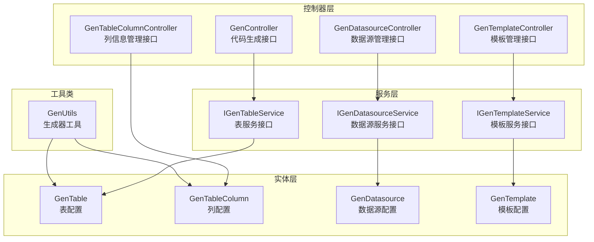
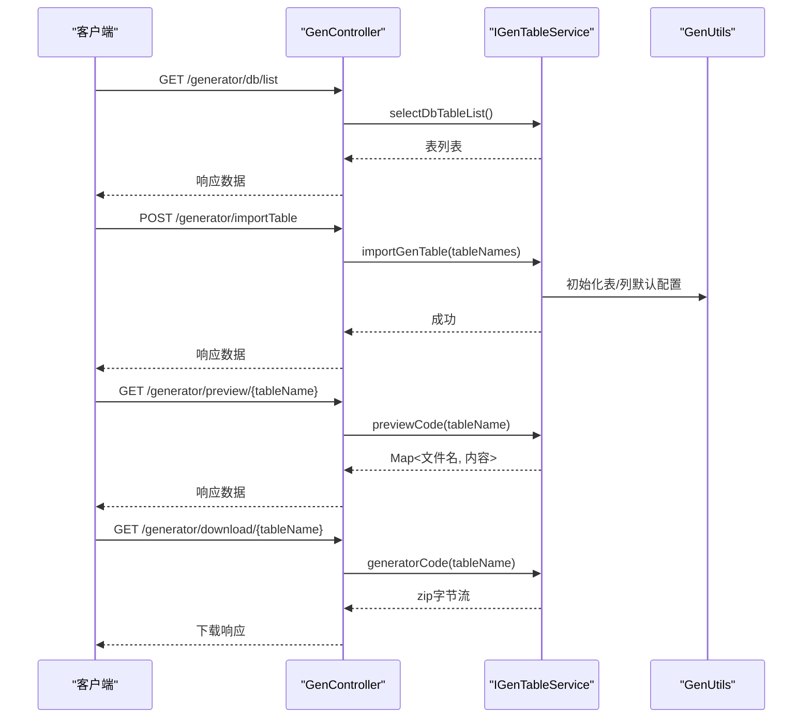
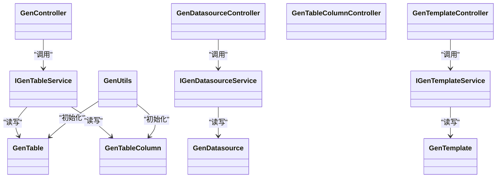

# 代码生成接口

<cite>
**本文档引用的文件**
- [GenController.java](file://forge/forge-framework/forge-plugin-parent/forge-plugin-generator/src/main/java/com/mdframe/forge/plugin/generator/controller/GenController.java)
- [GenDatasourceController.java](file://forge/forge-framework/forge-plugin-parent/forge-plugin-generator/src/main/java/com/mdframe/forge/plugin/generator/controller/GenDatasourceController.java)
- [GenTableColumnController.java](file://forge/forge-framework/forge-plugin-parent/forge-plugin-generator/src/main/java/com/mdframe/forge/plugin/generator/controller/GenTableColumnController.java)
- [GenTemplateController.java](file://forge/forge-framework/forge-plugin-parent/forge-plugin-generator/src/main/java/com/mdframe/forge/plugin/generator/controller/GenTemplateController.java)
- [GenTable.java](file://forge/forge-framework/forge-plugin-parent/forge-plugin-generator/src/main/java/com/mdframe/forge/plugin/generator/domain/entity/GenTable.java)
- [GenTableColumn.java](file://forge/forge-framework/forge-plugin-parent/forge-plugin-generator/src/main/java/com/mdframe/forge/plugin/generator/domain/entity/GenTableColumn.java)
- [GenDatasource.java](file://forge/forge-framework/forge-plugin-parent/forge-plugin-generator/src/main/java/com/mdframe/forge/plugin/generator/domain/entity/GenDatasource.java)
- [GenTemplate.java](file://forge/forge-framework/forge-plugin-parent/forge-plugin-generator/src/main/java/com/mdframe/forge/plugin/generator/domain/entity/GenTemplate.java)
- [IGenTableService.java](file://forge/forge-framework/forge-plugin-parent/forge-plugin-generator/src/main/java/com/mdframe/forge/plugin/generator/service/IGenTableService.java)
- [IGenDatasourceService.java](file://forge/forge-framework/forge-plugin-parent/forge-plugin-generator/src/main/java/com/mdframe/forge/plugin/generator/service/IGenDatasourceService.java)
- [IGenTemplateService.java](file://forge/forge-framework/forge-plugin-parent/forge-plugin-generator/src/main/java/com/mdframe/forge/plugin/generator/service/IGenTemplateService.java)
- [GenUtils.java](file://forge/forge-framework/forge-plugin-parent/forge-plugin-generator/src/main/java/com/mdframe/forge/plugin/generator/util/GenUtils.java)
</cite>

## 目录
1. [简介](#简介)
2. [项目结构](#项目结构)
3. [核心组件](#核心组件)
4. [架构总览](#架构总览)
5. [详细组件分析](#详细组件分析)
6. [依赖关系分析](#依赖关系分析)
7. [性能考虑](#性能考虑)
8. [故障排除指南](#故障排除指南)
9. [结论](#结论)

## 简介
本文件为代码生成模块的完整API接口文档，覆盖以下能力范围：
- 数据源配置接口：新增、编辑、删除、测试连接、查询启用数据源、按数据源查询表列表
- 表结构查询接口：查询数据库表列表、分页查询已导入表、根据ID查询表详情
- 列信息管理接口：查询表字段列表、批量更新字段配置、重置字段配置为默认值
- 模板配置接口：分页查询模板、查询启用模板、模板详情、新增模板、修改模板、删除模板、预览模板渲染结果、获取模板类型枚举
- 代码生成接口：导入表结构（默认/指定数据源）、修改表配置、删除表配置、预览代码、单表生成下载、批量生成下载
- 文件下载接口：单表代码打包下载、批量表代码打包下载

文档提供每个接口的请求方法、URL、参数说明、响应结构、错误处理机制，并给出从表结构导入到代码文件生成的完整流程示例，帮助开发者正确使用并理解内部工作机制。

## 项目结构
代码生成模块位于 `forge/forge-framework/forge-plugin-parent/forge-plugin-generator`，主要由以下层次组成：
- 控制器层：负责HTTP接口暴露，调用服务层完成业务逻辑
- 服务层：定义业务接口，具体实现位于对应 impl 包
- 实体层：数据库表映射对象
- 工具类：生成器通用工具方法
- 配置：生成器相关配置项

图表来源
- [GenController.java](file://forge/forge-framework/forge-plugin-parent/forge-plugin-generator/src/main/java/com/mdframe/forge/plugin/generator/controller/GenController.java#L25-L141)
- [GenDatasourceController.java](file://forge/forge-framework/forge-plugin-parent/forge-plugin-generator/src/main/java/com/mdframe/forge/plugin/generator/controller/GenDatasourceController.java#L21-L112)
- [GenTableColumnController.java](file://forge/forge-framework/forge-plugin-parent/forge-plugin-generator/src/main/java/com/mdframe/forge/plugin/generator/controller/GenTableColumnController.java#L19-L80)
- [GenTemplateController.java](file://forge/forge-framework/forge-plugin-parent/forge-plugin-generator/src/main/java/com/mdframe/forge/plugin/generator/controller/GenTemplateController.java#L21-L136)
- [IGenTableService.java](file://forge/forge-framework/forge-plugin-parent/forge-plugin-generator/src/main/java/com/mdframe/forge/plugin/generator/service/IGenTableService.java#L12-L48)
- [IGenDatasourceService.java](file://forge/forge-framework/forge-plugin-parent/forge-plugin-generator/src/main/java/com/mdframe/forge/plugin/generator/service/IGenDatasourceService.java#L12-L38)
- [IGenTemplateService.java](file://forge/forge-framework/forge-plugin-parent/forge-plugin-generator/src/main/java/com/mdframe/forge/plugin/generator/service/IGenTemplateService.java#L11-L36)
- [GenTable.java](file://forge/forge-framework/forge-plugin-parent/forge-plugin-generator/src/main/java/com/mdframe/forge/plugin/generator/domain/entity/GenTable.java#L14-L146)
- [GenTableColumn.java](file://forge/forge-framework/forge-plugin-parent/forge-plugin-generator/src/main/java/com/mdframe/forge/plugin/generator/domain/entity/GenTableColumn.java#L12-L58)
- [GenDatasource.java](file://forge/forge-framework/forge-plugin-parent/forge-plugin-generator/src/main/java/com/mdframe/forge/plugin/generator/domain/entity/GenDatasource.java#L12-L103)
- [GenTemplate.java](file://forge/forge-framework/forge-plugin-parent/forge-plugin-generator/src/main/java/com/mdframe/forge/plugin/generator/domain/entity/GenTemplate.java#L12-L88)
- [GenUtils.java](file://forge/forge-framework/forge-plugin-parent/forge-plugin-generator/src/main/java/com/mdframe/forge/plugin/generator/util/GenUtils.java#L15-L237)

章节来源
- [GenController.java](file://forge/forge-framework/forge-plugin-parent/forge-plugin-generator/src/main/java/com/mdframe/forge/plugin/generator/controller/GenController.java#L25-L141)
- [GenDatasourceController.java](file://forge/forge-framework/forge-plugin-parent/forge-plugin-generator/src/main/java/com/mdframe/forge/plugin/generator/controller/GenDatasourceController.java#L21-L112)
- [GenTableColumnController.java](file://forge/forge-framework/forge-plugin-parent/forge-plugin-generator/src/main/java/com/mdframe/forge/plugin/generator/controller/GenTableColumnController.java#L19-L80)
- [GenTemplateController.java](file://forge/forge-framework/forge-plugin-parent/forge-plugin-generator/src/main/java/com/mdframe/forge/plugin/generator/controller/GenTemplateController.java#L21-L136)

## 核心组件
- GenController：提供代码生成主流程接口，包括表结构导入、表配置管理、代码预览与下载
- GenDatasourceController：提供数据源配置与连接测试、按数据源查询表列表
- GenTableColumnController：提供表字段列表查询、批量更新字段配置、重置字段默认配置
- GenTemplateController：提供模板配置管理、模板类型枚举、模板渲染预览
- 实体类：GenTable、GenTableColumn、GenDatasource、GenTemplate 对应数据库表映射
- 服务接口：IGenTableService、IGenDatasourceService、IGenTemplateService 定义业务契约
- 工具类：GenUtils 提供数据库类型到Java类型的映射、命名转换、默认配置初始化等

章节来源
- [GenController.java](file://forge/forge-framework/forge-plugin-parent/forge-plugin-generator/src/main/java/com/mdframe/forge/plugin/generator/controller/GenController.java#L25-L141)
- [GenDatasourceController.java](file://forge/forge-framework/forge-plugin-parent/forge-plugin-generator/src/main/java/com/mdframe/forge/plugin/generator/controller/GenDatasourceController.java#L21-L112)
- [GenTableColumnController.java](file://forge/forge-framework/forge-plugin-parent/forge-plugin-generator/src/main/java/com/mdframe/forge/plugin/generator/controller/GenTableColumnController.java#L19-L80)
- [GenTemplateController.java](file://forge/forge-framework/forge-plugin-parent/forge-plugin-generator/src/main/java/com/mdframe/forge/plugin/generator/controller/GenTemplateController.java#L21-L136)
- [GenTable.java](file://forge/forge-framework/forge-plugin-parent/forge-plugin-generator/src/main/java/com/mdframe/forge/plugin/generator/domain/entity/GenTable.java#L14-L146)
- [GenTableColumn.java](file://forge/forge-framework/forge-plugin-parent/forge-plugin-generator/src/main/java/com/mdframe/forge/plugin/generator/domain/entity/GenTableColumn.java#L12-L58)
- [GenDatasource.java](file://forge/forge-framework/forge-plugin-parent/forge-plugin-generator/src/main/java/com/mdframe/forge/plugin/generator/domain/entity/GenDatasource.java#L12-L103)
- [GenTemplate.java](file://forge/forge-framework/forge-plugin-parent/forge-plugin-generator/src/main/java/com/mdframe/forge/plugin/generator/domain/entity/GenTemplate.java#L12-L88)
- [IGenTableService.java](file://forge/forge-framework/forge-plugin-parent/forge-plugin-generator/src/main/java/com/mdframe/forge/plugin/generator/service/IGenTableService.java#L12-L48)
- [IGenDatasourceService.java](file://forge/forge-framework/forge-plugin-parent/forge-plugin-generator/src/main/java/com/mdframe/forge/plugin/generator/service/IGenDatasourceService.java#L12-L38)
- [IGenTemplateService.java](file://forge/forge-framework/forge-plugin-parent/forge-plugin-generator/src/main/java/com/mdframe/forge/plugin/generator/service/IGenTemplateService.java#L11-L36)
- [GenUtils.java](file://forge/forge-framework/forge-plugin-parent/forge-plugin-generator/src/main/java/com/mdframe/forge/plugin/generator/util/GenUtils.java#L15-L237)

## 架构总览
下图展示代码生成模块的端到端调用链路，从HTTP请求到服务层再到数据访问层：

图表来源
- [GenController.java](file://forge/forge-framework/forge-plugin-parent/forge-plugin-generator/src/main/java/com/mdframe/forge/plugin/generator/controller/GenController.java#L35-L140)
- [IGenTableService.java](file://forge/forge-framework/forge-plugin-parent/forge-plugin-generator/src/main/java/com/mdframe/forge/plugin/generator/service/IGenTableService.java#L14-L48)
- [GenUtils.java](file://forge/forge-framework/forge-plugin-parent/forge-plugin-generator/src/main/java/com/mdframe/forge/plugin/generator/util/GenUtils.java#L84-L131)

## 详细组件分析

### 数据源配置接口
- 查询数据库表列表（默认数据源）
  - 方法：GET
  - URL：/generator/db/list
  - 请求参数：无
  - 响应：表列表（GenTable）
  - 错误：无显式错误返回，异常由统一响应包装
- 分页查询数据源列表
  - 方法：GET
  - URL：/generator/datasource/list
  - 参数：pageQuery（分页）、datasourceName（可选）
  - 响应：分页数据（GenDatasource）
- 查询启用的数据源
  - 方法：GET
  - URL：/generator/datasource/enabled
  - 参数：datasourceName（可选）
  - 响应：启用数据源列表
- 根据ID查询数据源详情
  - 方法：GET
  - URL：/generator/datasource/{datasourceId}
  - 路径参数：datasourceId
  - 响应：GenDatasource
- 新增数据源
  - 方法：POST
  - URL：/generator/datasource/add
  - 请求体：GenDatasource
  - 响应：成功
- 修改数据源
  - 方法：POST
  - URL：/generator/datasource/edit
  - 请求体：GenDatasource
  - 响应：成功
- 删除数据源
  - 方法：POST
  - URL：/generator/datasource/remove/{datasourceId}
  - 路径参数：datasourceId
  - 响应：成功
- 测试数据源连接
  - 方法：POST
  - URL：/generator/datasource/test/{datasourceId}
  - 路径参数：datasourceId
  - 响应：成功或错误消息
- 查询指定数据源的表列表
  - 方法：GET
  - URL：/generator/datasource/{datasourceId}/tables
  - 路径参数：datasourceId
  - 响应：表列表（GenTable）

章节来源
- [GenDatasourceController.java](file://forge/forge-framework/forge-plugin-parent/forge-plugin-generator/src/main/java/com/mdframe/forge/plugin/generator/controller/GenDatasourceController.java#L31-L111)
- [IGenDatasourceService.java](file://forge/forge-framework/forge-plugin-parent/forge-plugin-generator/src/main/java/com/mdframe/forge/plugin/generator/service/IGenDatasourceService.java#L12-L38)

### 表结构查询接口
- 查询数据库表列表（默认数据源）
  - 方法：GET
  - URL：/generator/db/list
  - 响应：表列表（GenTable）
- 分页查询已导入的表列表
  - 方法：GET
  - URL：/generator/list
  - 参数：pageQuery（分页）、tableName（可选）、tableComment（可选）
  - 响应：分页数据（GenTable）
- 根据表ID查询表配置详情
  - 方法：GET
  - URL：/generator/{tableId}
  - 路径参数：tableId
  - 响应：GenTable
- 导入表结构（默认数据源）
  - 方法：POST
  - URL：/generator/importTable
  - 请求体：字符串数组（表名列表）
  - 响应：成功
- 导入表结构（指定数据源）
  - 方法：POST
  - URL：/generator/importTable/{datasourceId}
  - 路径参数：datasourceId
  - 请求体：字符串数组（表名列表）
  - 响应：成功
- 修改表配置
  - 方法：POST
  - URL：/generator/edit
  - 请求体：GenTable
  - 响应：成功
- 删除表配置
  - 方法：POST
  - URL：/generator/remove
  - 请求体：长整型数组（表ID列表）
  - 响应：成功

章节来源
- [GenController.java](file://forge/forge-framework/forge-plugin-parent/forge-plugin-generator/src/main/java/com/mdframe/forge/plugin/generator/controller/GenController.java#L35-L105)
- [IGenTableService.java](file://forge/forge-framework/forge-plugin-parent/forge-plugin-generator/src/main/java/com/mdframe/forge/plugin/generator/service/IGenTableService.java#L12-L48)

### 列信息管理接口
- 查询表字段列表
  - 方法：GET
  - URL：/generator/column/list/{tableId}
  - 路径参数：tableId
  - 响应：字段列表（GenTableColumn）
- 批量更新字段配置
  - 方法：POST
  - URL：/generator/column/batchUpdate
  - 请求体：字段列表（GenTableColumn）
  - 响应：成功
  - 错误：字段列表为空时返回错误
- 重置字段配置为默认值
  - 方法：POST
  - URL：/generator/column/resetConfig/{tableId}
  - 路径参数：tableId
  - 响应：成功
  - 说明：将字段配置重置为默认值（含GenUtils初始化逻辑）

章节来源
- [GenTableColumnController.java](file://forge/forge-framework/forge-plugin-parent/forge-plugin-generator/src/main/java/com/mdframe/forge/plugin/generator/controller/GenTableColumnController.java#L29-L79)
- [GenUtils.java](file://forge/forge-framework/forge-plugin-parent/forge-plugin-generator/src/main/java/com/mdframe/forge/plugin/generator/util/GenUtils.java#L99-L131)

### 模板配置接口
- 分页查询模板列表
  - 方法：GET
  - URL：/generator/template/list
  - 参数：pageQuery（分页）、templateName（可选）、templateType（可选）、templateEngine（可选）
  - 响应：分页数据（GenTemplate）
- 查询启用的模板
  - 方法：GET
  - URL：/generator/template/enabled
  - 参数：templateEngine（可选）
  - 响应：启用模板列表
- 根据ID查询模板详情
  - 方法：GET
  - URL：/generator/template/{templateId}
  - 路径参数：templateId
  - 响应：GenTemplate
- 新增模板
  - 方法：POST
  - URL：/generator/template/add
  - 请求体：GenTemplate
  - 说明：新增模板默认非系统内置
  - 响应：成功
- 修改模板
  - 方法：POST
  - URL：/generator/template/edit
  - 请求体：GenTemplate
  - 说明：系统内置模板仅允许修改启用状态、排序和备注
  - 响应：成功
- 删除模板
  - 方法：POST
  - URL：/generator/template/remove/{templateId}
  - 路径参数：templateId
  - 说明：系统内置模板不允许删除
  - 响应：成功或错误
- 预览模板渲染结果
  - 方法：POST
  - URL：/generator/template/preview
  - 请求体：JSON（包含 templateId、tableId）
  - 响应：渲染后的代码文本
- 获取模板类型枚举
  - 方法：GET
  - URL：/generator/template/types
  - 响应：模板类型列表

章节来源
- [GenTemplateController.java](file://forge/forge-framework/forge-plugin-parent/forge-plugin-generator/src/main/java/com/mdframe/forge/plugin/generator/controller/GenTemplateController.java#L31-L135)
- [IGenTemplateService.java](file://forge/forge-framework/forge-plugin-parent/forge-plugin-generator/src/main/java/com/mdframe/forge/plugin/generator/service/IGenTemplateService.java#L11-L36)

### 代码生成接口
- 预览代码
  - 方法：GET
  - URL：/generator/preview/{tableName}
  - 路径参数：tableName
  - 响应：Map<文件名, 内容>
- 单表生成代码（下载）
  - 方法：GET
  - URL：/generator/download/{tableName}
  - 路径参数：tableName
  - 响应：application/octet-stream（zip文件）
- 批量生成代码（下载）
  - 方法：POST
  - URL：/generator/batchDownload
  - 请求体：字符串数组（表名列表）
  - 响应：application/octet-stream（zip文件）

章节来源
- [GenController.java](file://forge/forge-framework/forge-plugin-parent/forge-plugin-generator/src/main/java/com/mdframe/forge/plugin/generator/controller/GenController.java#L108-L140)
- [IGenTableService.java](file://forge/forge-framework/forge-plugin-parent/forge-plugin-generator/src/main/java/com/mdframe/forge/plugin/generator/service/IGenTableService.java#L25-L37)

### 文件下载接口
- 单表下载：GET /generator/download/{tableName} 返回zip字节流
- 批量下载：POST /generator/batchDownload 返回zip字节流

章节来源
- [GenController.java](file://forge/forge-framework/forge-plugin-parent/forge-plugin-generator/src/main/java/com/mdframe/forge/plugin/generator/controller/GenController.java#L118-L139)

## 依赖关系分析
- 控制器依赖服务接口，服务接口依赖实体类与工具类
- GenController 依赖 IGenTableService；GenDatasourceController 依赖 IGenDatasourceService；GenTemplateController 依赖 IGenTemplateService
- GenUtils 在导入表与字段初始化时被调用，提供类型映射与默认配置

图表来源
- [GenController.java](file://forge/forge-framework/forge-plugin-parent/forge-plugin-generator/src/main/java/com/mdframe/forge/plugin/generator/controller/GenController.java#L25-L141)
- [GenDatasourceController.java](file://forge/forge-framework/forge-plugin-parent/forge-plugin-generator/src/main/java/com/mdframe/forge/plugin/generator/controller/GenDatasourceController.java#L21-L112)
- [GenTableColumnController.java](file://forge/forge-framework/forge-plugin-parent/forge-plugin-generator/src/main/java/com/mdframe/forge/plugin/generator/controller/GenTableColumnController.java#L19-L80)
- [GenTemplateController.java](file://forge/forge-framework/forge-plugin-parent/forge-plugin-generator/src/main/java/com/mdframe/forge/plugin/generator/controller/GenTemplateController.java#L21-L136)
- [IGenTableService.java](file://forge/forge-framework/forge-plugin-parent/forge-plugin-generator/src/main/java/com/mdframe/forge/plugin/generator/service/IGenTableService.java#L12-L48)
- [IGenDatasourceService.java](file://forge/forge-framework/forge-plugin-parent/forge-plugin-generator/src/main/java/com/mdframe/forge/plugin/generator/service/IGenDatasourceService.java#L12-L38)
- [IGenTemplateService.java](file://forge/forge-framework/forge-plugin-parent/forge-plugin-generator/src/main/java/com/mdframe/forge/plugin/generator/service/IGenTemplateService.java#L11-L36)
- [GenTable.java](file://forge/forge-framework/forge-plugin-parent/forge-plugin-generator/src/main/java/com/mdframe/forge/plugin/generator/domain/entity/GenTable.java#L14-L146)
- [GenTableColumn.java](file://forge/forge-framework/forge-plugin-parent/forge-plugin-generator/src/main/java/com/mdframe/forge/plugin/generator/domain/entity/GenTableColumn.java#L12-L58)
- [GenDatasource.java](file://forge/forge-framework/forge-plugin-parent/forge-plugin-generator/src/main/java/com/mdframe/forge/plugin/generator/domain/entity/GenDatasource.java#L12-L103)
- [GenTemplate.java](file://forge/forge-framework/forge-plugin-parent/forge-plugin-generator/src/main/java/com/mdframe/forge/plugin/generator/domain/entity/GenTemplate.java#L12-L88)
- [GenUtils.java](file://forge/forge-framework/forge-plugin-parent/forge-plugin-generator/src/main/java/com/mdframe/forge/plugin/generator/util/GenUtils.java#L15-L237)

## 性能考虑
- 分页查询：列表接口均支持分页参数，建议在大数据量场景下使用分页避免一次性加载过多数据
- 字段批量更新：批量更新字段配置时按顺序重排排序字段，事务保证一致性
- 模板预览：预览模板渲染结果时仅进行模板渲染，不涉及持久化写入
- 代码生成：预览返回Map结构便于前端即时展示；下载返回zip字节流，注意内存占用与网络传输开销

## 故障排除指南
- 数据源连接测试失败
  - 现象：测试连接返回失败
  - 可能原因：JDBC驱动、连接URL、用户名密码、数据库类型配置错误
  - 处理：检查GenDatasource配置与数据库连通性
- 模板删除失败（系统内置模板）
  - 现象：删除模板返回错误
  - 原因：系统内置模板不允许删除
  - 处理：修改模板为非系统内置后再删除
- 字段批量更新失败
  - 现象：批量更新返回错误
  - 原因：请求体字段列表为空
  - 处理：确保传入非空字段列表
- 代码下载失败
  - 现象：下载接口无响应或响应为空
  - 可能原因：表名不存在、模板缺失、生成过程异常
  - 处理：确认表已导入且模板启用，检查日志定位异常

章节来源
- [GenDatasourceController.java](file://forge/forge-framework/forge-plugin-parent/forge-plugin-generator/src/main/java/com/mdframe/forge/plugin/generator/controller/GenDatasourceController.java#L96-L102)
- [GenTemplateController.java](file://forge/forge-framework/forge-plugin-parent/forge-plugin-generator/src/main/java/com/mdframe/forge/plugin/generator/controller/GenTemplateController.java#L103-L113)
- [GenTableColumnController.java](file://forge/forge-framework/forge-plugin-parent/forge-plugin-generator/src/main/java/com/mdframe/forge/plugin/generator/controller/GenTableColumnController.java#L42-L58)
- [GenController.java](file://forge/forge-framework/forge-plugin-parent/forge-plugin-generator/src/main/java/com/mdframe/forge/plugin/generator/controller/GenController.java#L118-L140)

## 结论
本文档提供了代码生成模块的完整API接口说明，涵盖数据源配置、表结构与列信息管理、模板配置、代码生成与下载等全流程接口。通过统一的响应包装与清晰的错误提示，开发者可以快速集成并稳定使用该模块。建议在生产环境中结合分页查询、模板预览与连接测试等能力，确保系统的可靠性与可维护性。