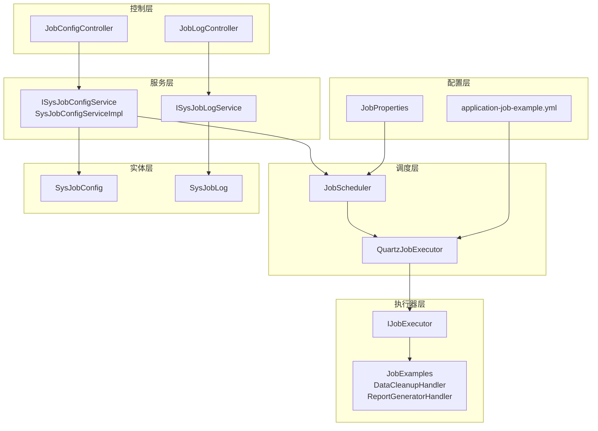
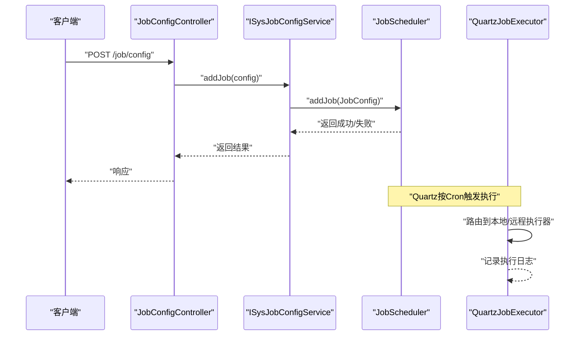
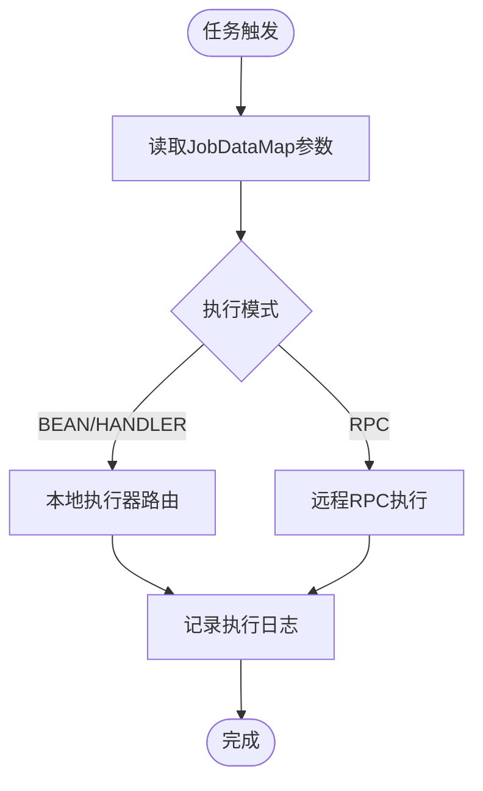
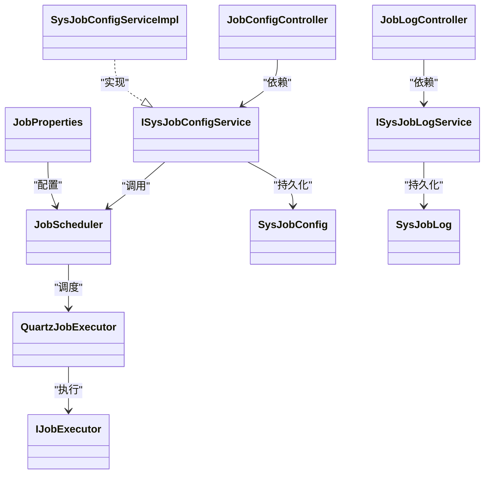

# 定时任务接口

<cite>
**本文引用的文件**
- [API.md](file://forge/forge-framework/forge-starter-parent/forge-starter-job/API.md)
- [JobConfigController.java](file://forge/forge-framework/forge-plugin-parent/forge-plugin-job/src/main/java/com/mdframe/forge/plugin/job/controller/JobConfigController.java)
- [JobLogController.java](file://forge/forge-framework/forge-plugin-parent/forge-plugin-job/src/main/java/com/mdframe/forge/plugin/job/controller/JobLogController.java)
- [SysJobConfig.java](file://forge/forge-framework/forge-plugin-parent/forge-plugin-job/src/main/java/com/mdframe/forge/plugin/job/entity/SysJobConfig.java)
- [SysJobLog.java](file://forge/forge-framework/forge-plugin-parent/forge-plugin-job/src/main/java/com/mdframe/forge/plugin/job/entity/SysJobLog.java)
- [ISysJobConfigService.java](file://forge/forge-framework/forge-plugin-parent/forge-plugin-job/src/main/java/com/mdframe/forge/plugin/job/service/ISysJobConfigService.java)
- [ISysJobLogService.java](file://forge/forge-framework/forge-plugin-parent/forge-plugin-job/src/main/java/com/mdframe/forge/plugin/job/service/ISysJobLogService.java)
- [SysJobConfigServiceImpl.java](file://forge/forge-framework/forge-plugin-parent/forge-plugin-job/src/main/java/com/mdframe/forge/plugin/job/service/impl/SysJobConfigServiceImpl.java)
- [IJobExecutor.java](file://forge/forge-framework/forge-plugin-parent/forge-plugin-job/src/main/java/com/mdframe/forge/plugin/job/executor/IJobExecutor.java)
- [JobProperties.java](file://forge/forge-framework/forge-plugin-parent/forge-plugin-job/src/main/java/com/mdframe/forge/plugin/job/config/JobProperties.java)
- [JobScheduler.java](file://forge/forge-framework/forge-plugin-parent/forge-plugin-job/src/main/java/com/mdframe/forge/plugin/job/scheduler/JobScheduler.java)
- [QuartzJobExecutor.java](file://forge/forge-framework/forge-plugin-parent/forge-plugin-job/src/main/java/com/mdframe/forge/plugin/job/scheduler/QuartzJobExecutor.java)
- [application-job-example.yml](file://forge/forge-framework/forge-plugin-parent/forge-plugin-job/src/main/resources/application-job-example.yml)
- [JobExamples.java](file://forge/forge-framework/forge-plugin-parent/forge-plugin-job/src/main/java/com/mdframe/forge/plugin/job/example/JobExamples.java)
</cite>

## 目录
1. [简介](#简介)
2. [项目结构](#项目结构)
3. [核心组件](#核心组件)
4. [架构总览](#架构总览)
5. [详细组件分析](#详细组件分析)
6. [依赖关系分析](#依赖关系分析)
7. [性能与可靠性](#性能与可靠性)
8. [故障排查指南](#故障排查指南)
9. [结论](#结论)
10. [附录](#附录)

## 简介
本文件为定时任务模块的完整API接口文档，涵盖任务配置、任务启停控制、任务执行历史查询、任务日志查看等能力，并提供任务调度工作原理、执行机制、监控方式说明，以及异常处理、重试机制、超时控制等高级功能的接口说明。开发者可据此正确配置与管理定时任务。

## 项目结构
定时任务模块位于 forge/forge-framework/forge-plugin-parent/forge-plugin-job 下，主要由以下层次构成：
- 控制层：提供REST接口，负责任务配置与日志管理
- 服务层：封装业务逻辑，协调调度器与持久化
- 调度层：基于Quartz实现任务的增删改查与执行控制
- 执行器层：定义统一的IJobExecutor接口，支持本地Handler与远程RPC两种执行模式
- 实体层：SysJobConfig与SysJobLog映射数据库表结构
- 配置层：JobProperties提供部署模式、分布式配置等开关项

图表来源
- [JobConfigController.java](file://forge/forge-framework/forge-plugin-parent/forge-plugin-job/src/main/java/com/mdframe/forge/plugin/job/controller/JobConfigController.java#L15-L110)
- [JobLogController.java](file://forge/forge-framework/forge-plugin-parent/forge-plugin-job/src/main/java/com/mdframe/forge/plugin/job/controller/JobLogController.java#L15-L56)
- [ISysJobConfigService.java](file://forge/forge-framework/forge-plugin-parent/forge-plugin-job/src/main/java/com/mdframe/forge/plugin/job/service/ISysJobConfigService.java#L10-L52)
- [SysJobConfigServiceImpl.java](file://forge/forge-framework/forge-plugin-parent/forge-plugin-job/src/main/java/com/mdframe/forge/plugin/job/service/impl/SysJobConfigServiceImpl.java#L92-L154)
- [JobScheduler.java](file://forge/forge-framework/forge-plugin-parent/forge-plugin-job/src/main/java/com/mdframe/forge/plugin/job/scheduler/JobScheduler.java#L13-L219)
- [QuartzJobExecutor.java](file://forge/forge-framework/forge-plugin-parent/forge-plugin-job/src/main/java/com/mdframe/forge/plugin/job/scheduler/QuartzJobExecutor.java#L13-L41)
- [IJobExecutor.java](file://forge/forge-framework/forge-plugin-parent/forge-plugin-job/src/main/java/com/mdframe/forge/plugin/job/executor/IJobExecutor.java#L7-L16)
- [JobExamples.java](file://forge/forge-framework/forge-plugin-parent/forge-plugin-job/src/main/java/com/mdframe/forge/plugin/job/example/JobExamples.java#L17-L97)
- [SysJobConfig.java](file://forge/forge-framework/forge-plugin-parent/forge-plugin-job/src/main/java/com/mdframe/forge/plugin/job/entity/SysJobConfig.java#L13-L97)
- [SysJobLog.java](file://forge/forge-framework/forge-plugin-parent/forge-plugin-job/src/main/java/com/mdframe/forge/plugin/job/entity/SysJobLog.java#L13-L80)
- [JobProperties.java](file://forge/forge-framework/forge-plugin-parent/forge-plugin-job/src/main/java/com/mdframe/forge/plugin/job/config/JobProperties.java#L9-L66)
- [application-job-example.yml](file://forge/forge-framework/forge-plugin-parent/forge-plugin-job/src/main/resources/application-job-example.yml#L1-L34)

章节来源
- [JobConfigController.java](file://forge/forge-framework/forge-plugin-parent/forge-plugin-job/src/main/java/com/mdframe/forge/plugin/job/controller/JobConfigController.java#L15-L110)
- [JobLogController.java](file://forge/forge-framework/forge-plugin-parent/forge-plugin-job/src/main/java/com/mdframe/forge/plugin/job/controller/JobLogController.java#L15-L56)
- [SysJobConfig.java](file://forge/forge-framework/forge-plugin-parent/forge-plugin-job/src/main/java/com/mdframe/forge/plugin/job/entity/SysJobConfig.java#L13-L97)
- [SysJobLog.java](file://forge/forge-framework/forge-plugin-parent/forge-plugin-job/src/main/java/com/mdframe/forge/plugin/job/entity/SysJobLog.java#L13-L80)
- [JobProperties.java](file://forge/forge-framework/forge-plugin-parent/forge-plugin-job/src/main/java/com/mdframe/forge/plugin/job/config/JobProperties.java#L9-L66)
- [application-job-example.yml](file://forge/forge-framework/forge-plugin-parent/forge-plugin-job/src/main/resources/application-job-example.yml#L1-L34)

## 核心组件
- 任务配置实体：SysJobConfig，包含任务名称、分组、描述、执行器信息、Cron表达式、参数、状态、执行模式、重试次数、告警与WebHook等字段
- 任务日志实体：SysJobLog，包含任务名称/分组、执行器Handler、任务参数、触发/开始/结束时间、耗时、状态、结果、异常信息、重试次数等
- 任务配置控制器：JobConfigController，提供分页查询、详情、新增、更新、删除、启动、停止、立即触发、更新Cron等接口
- 任务日志控制器：JobLogController，提供分页查询、详情、清理日志接口
- 任务配置服务：ISysJobConfigService/SysJobConfigServiceImpl，封装任务CRUD与启停控制，协调JobScheduler
- 任务调度器：JobScheduler，基于Quartz封装任务的添加、暂停、恢复、重新调度、检查存在性
- 任务执行器接口：IJobExecutor，统一的业务执行入口
- 配置属性：JobProperties，提供启用开关、部署模式（单体/分布式）、分布式配置（注册中心、超时、重试）

章节来源
- [SysJobConfig.java](file://forge/forge-framework/forge-plugin-parent/forge-plugin-job/src/main/java/com/mdframe/forge/plugin/job/entity/SysJobConfig.java#L13-L97)
- [SysJobLog.java](file://forge/forge-framework/forge-plugin-parent/forge-plugin-job/src/main/java/com/mdframe/forge/plugin/job/entity/SysJobLog.java#L13-L80)
- [JobConfigController.java](file://forge/forge-framework/forge-plugin-parent/forge-plugin-job/src/main/java/com/mdframe/forge/plugin/job/controller/JobConfigController.java#L15-L110)
- [JobLogController.java](file://forge/forge-framework/forge-plugin-parent/forge-plugin-job/src/main/java/com/mdframe/forge/plugin/job/controller/JobLogController.java#L15-L56)
- [ISysJobConfigService.java](file://forge/forge-framework/forge-plugin-parent/forge-plugin-job/src/main/java/com/mdframe/forge/plugin/job/service/ISysJobConfigService.java#L10-L52)
- [SysJobConfigServiceImpl.java](file://forge/forge-framework/forge-plugin-parent/forge-plugin-job/src/main/java/com/mdframe/forge/plugin/job/service/impl/SysJobConfigServiceImpl.java#L92-L154)
- [JobScheduler.java](file://forge/forge-framework/forge-plugin-parent/forge-plugin-job/src/main/java/com/mdframe/forge/plugin/job/scheduler/JobScheduler.java#L13-L219)
- [IJobExecutor.java](file://forge/forge-framework/forge-plugin-parent/forge-plugin-job/src/main/java/com/mdframe/forge/plugin/job/executor/IJobExecutor.java#L7-L16)
- [JobProperties.java](file://forge/forge-framework/forge-plugin-parent/forge-plugin-job/src/main/java/com/mdframe/forge/plugin/job/config/JobProperties.java#L9-L66)

## 架构总览
定时任务采用“控制器-服务-调度器-执行器”的分层架构，Quartz作为核心调度引擎，负责任务的触发与执行；服务层协调数据库状态与调度器状态；执行器层支持本地Handler与远程RPC两种模式。

图表来源
- [JobConfigController.java](file://forge/forge-framework/forge-plugin-parent/forge-plugin-job/src/main/java/com/mdframe/forge/plugin/job/controller/JobConfigController.java#L47-L54)
- [ISysJobConfigService.java](file://forge/forge-framework/forge-plugin-parent/forge-plugin-job/src/main/java/com/mdframe/forge/plugin/job/service/ISysJobConfigService.java#L18-L20)
- [JobScheduler.java](file://forge/forge-framework/forge-plugin-parent/forge-plugin-job/src/main/java/com/mdframe/forge/plugin/job/scheduler/JobScheduler.java#L20-L44)
- [QuartzJobExecutor.java](file://forge/forge-framework/forge-plugin-parent/forge-plugin-job/src/main/java/com/mdframe/forge/plugin/job/scheduler/QuartzJobExecutor.java#L17-L41)

## 详细组件分析

### 任务配置接口
- 接口概览
  - 分页查询任务列表：GET /job/config/page
  - 查询任务详情：GET /job/config/{id}
  - 新增任务：POST /job/config
  - 更新任务：PUT /job/config
  - 删除任务：DELETE /job/config/{id}
  - 启动任务：POST /job/config/{id}/start
  - 停止任务：POST /job/config/{id}/stop
  - 立即触发一次：POST /job/config/{id}/trigger
  - 更新Cron表达式：POST /job/config/{id}/cron?cronExpression=...

- 请求与响应要点
  - 分页查询支持按任务名称、分组、执行模式、状态过滤
  - 新增/更新任务需提供任务名称、分组、描述、执行器信息、Cron表达式、参数、状态、执行模式、重试次数等
  - 启停控制与立即触发均返回布尔结果，成功时返回通用成功响应，失败时返回错误提示

- 任务配置字段说明
  - 任务名称与分组：唯一标识任务
  - 执行器信息：executorBean/executorMethod（本地Bean直连）、executorHandler（本地Handler）、executorService（远程服务名）
  - 执行模式：BEAN/HANDLER/RPC
  - Cron表达式：标准Cron语法
  - 任务参数：JSON字符串传参
  - 状态：0-停止 1-运行
  - 重试次数：失败自动重试次数
  - 告警与WebHook：异常通知渠道

- 高级配置示例（参考）
  - Cron表达式示例：每5秒、每分钟、每5分钟、每小时、每日凌晨2点、每周一凌晨2点、每月1号凌晨2点
  - 分布式模式：通过配置属性指定注册中心类型、服务名列表、RPC超时与重试次数

章节来源
- [API.md](file://forge/forge-framework/forge-starter-parent/forge-starter-job/API.md#L5-L109)
- [JobConfigController.java](file://forge/forge-framework/forge-plugin-parent/forge-plugin-job/src/main/java/com/mdframe/forge/plugin/job/controller/JobConfigController.java#L29-L108)
- [SysJobConfig.java](file://forge/forge-framework/forge-plugin-parent/forge-plugin-job/src/main/java/com/mdframe/forge/plugin/job/entity/SysJobConfig.java#L20-L95)
- [JobProperties.java](file://forge/forge-framework/forge-plugin-parent/forge-plugin-job/src/main/java/com/mdframe/forge/plugin/job/config/JobProperties.java#L24-L49)
- [API.md](file://forge/forge-framework/forge-starter-parent/forge-starter-job/API.md#L174-L184)

### 任务日志与监控接口
- 接口概览
  - 分页查询日志：GET /job/log/page
  - 查询日志详情：GET /job/log/{id}
  - 清理日志：DELETE /job/log/clean?days=N

- 日志字段说明
  - 任务名称/分组、执行器Handler、任务参数
  - 触发/开始/结束时间、耗时（毫秒）、状态（1-成功 0-失败）
  - 执行结果、异常信息、重试次数

- 监控与告警
  - 成功/失败状态便于前端展示与统计
  - 告警邮箱与WebHook字段可用于集成外部告警系统

章节来源
- [API.md](file://forge/forge-framework/forge-starter-parent/forge-starter-job/API.md#L111-L173)
- [JobLogController.java](file://forge/forge-framework/forge-plugin-parent/forge-plugin-job/src/main/java/com/mdframe/forge/plugin/job/controller/JobLogController.java#L29-L54)
- [SysJobLog.java](file://forge/forge-framework/forge-plugin-parent/forge-plugin-job/src/main/java/com/mdframe/forge/plugin/job/entity/SysJobLog.java#L20-L79)

### 任务执行与调度机制
- 路由与执行
  - QuartzJobExecutor从JobDataMap读取执行器信息与参数，根据执行模式选择本地Handler或远程RPC
  - 本地模式通过JobExecutorRouterManager路由至IJobExecutor实现
  - 远程模式在分布式配置下通过注册中心与RPC超时/重试策略执行

- 状态同步
  - 启动/停止：服务层调用JobScheduler暂停/恢复任务，并同步更新数据库状态
  - 立即触发：直接触发一次执行
  - 更新Cron：重新构建Trigger并更新数据库

图表来源
- [QuartzJobExecutor.java](file://forge/forge-framework/forge-plugin-parent/forge-plugin-job/src/main/java/com/mdframe/forge/plugin/job/scheduler/QuartzJobExecutor.java#L17-L41)
- [IJobExecutor.java](file://forge/forge-framework/forge-plugin-parent/forge-plugin-job/src/main/java/com/mdframe/forge/plugin/job/executor/IJobExecutor.java#L7-L16)
- [JobProperties.java](file://forge/forge-framework/forge-plugin-parent/forge-plugin-job/src/main/java/com/mdframe/forge/plugin/job/config/JobProperties.java#L24-L49)

### 任务异常处理、重试与超时
- 重试机制
  - 任务配置支持失败重试次数字段
  - 服务层在更新Cron时保持一致性，避免重复更新
- 超时控制
  - 分布式RPC模式下可通过配置属性设置超时时间与重试次数
- 异常记录
  - 执行日志包含异常信息字段，便于问题定位

章节来源
- [SysJobConfig.java](file://forge/forge-framework/forge-plugin-parent/forge-plugin-job/src/main/java/com/mdframe/forge/plugin/job/entity/SysJobConfig.java#L72-L85)
- [SysJobLog.java](file://forge/forge-framework/forge-plugin-parent/forge-plugin-job/src/main/java/com/mdframe/forge/plugin/job/entity/SysJobLog.java#L69-L73)
- [JobProperties.java](file://forge/forge-framework/forge-plugin-parent/forge-plugin-job/src/main/java/com/mdframe/forge/plugin/job/config/JobProperties.java#L41-L48)
- [SysJobConfigServiceImpl.java](file://forge/forge-framework/forge-plugin-parent/forge-plugin-job/src/main/java/com/mdframe/forge/plugin/job/service/impl/SysJobConfigServiceImpl.java#L128-L144)

## 依赖关系分析
- 控制器依赖服务接口，服务实现依赖调度器与实体模型
- QuartzJobExecutor依赖执行器路由管理器与IJobExecutor接口
- JobProperties为分布式执行提供配置支撑

图表来源
- [JobConfigController.java](file://forge/forge-framework/forge-plugin-parent/forge-plugin-job/src/main/java/com/mdframe/forge/plugin/job/controller/JobConfigController.java#L25-L27)
- [JobLogController.java](file://forge/forge-framework/forge-plugin-parent/forge-plugin-job/src/main/java/com/mdframe/forge/plugin/job/controller/JobLogController.java#L25-L27)
- [ISysJobConfigService.java](file://forge/forge-framework/forge-plugin-parent/forge-plugin-job/src/main/java/com/mdframe/forge/plugin/job/service/ISysJobConfigService.java#L10-L52)
- [ISysJobLogService.java](file://forge/forge-framework/forge-plugin-parent/forge-plugin-job/src/main/java/com/mdframe/forge/plugin/job/service/ISysJobLogService.java#L10-L22)
- [SysJobConfigServiceImpl.java](file://forge/forge-framework/forge-plugin-parent/forge-plugin-job/src/main/java/com/mdframe/forge/plugin/job/service/impl/SysJobConfigServiceImpl.java#L92-L154)
- [JobScheduler.java](file://forge/forge-framework/forge-plugin-parent/forge-plugin-job/src/main/java/com/mdframe/forge/plugin/job/scheduler/JobScheduler.java#L13-L219)
- [QuartzJobExecutor.java](file://forge/forge-framework/forge-plugin-parent/forge-plugin-job/src/main/java/com/mdframe/forge/plugin/job/scheduler/QuartzJobExecutor.java#L17-L41)
- [IJobExecutor.java](file://forge/forge-framework/forge-plugin-parent/forge-plugin-job/src/main/java/com/mdframe/forge/plugin/job/executor/IJobExecutor.java#L7-L16)
- [SysJobConfig.java](file://forge/forge-framework/forge-plugin-parent/forge-plugin-job/src/main/java/com/mdframe/forge/plugin/job/entity/SysJobConfig.java#L13-L97)
- [SysJobLog.java](file://forge/forge-framework/forge-plugin-parent/forge-plugin-job/src/main/java/com/mdframe/forge/plugin/job/entity/SysJobLog.java#L13-L80)
- [JobProperties.java](file://forge/forge-framework/forge-plugin-parent/forge-plugin-job/src/main/java/com/mdframe/forge/plugin/job/config/JobProperties.java#L9-L66)

## 性能与可靠性
- 数据持久化：Quartz使用JDBC持久化，支持集群模式以提升可用性
- 线程池配置：可通过应用配置调整线程数量与优先级
- 分布式执行：合理设置RPC超时与重试次数，避免阻塞与雪崩
- 日志清理：定期清理历史日志，控制存储占用

章节来源
- [application-job-example.yml](file://forge/forge-framework/forge-plugin-parent/forge-plugin-job/src/main/resources/application-job-example.yml#L16-L34)
- [JobProperties.java](file://forge/forge-framework/forge-plugin-parent/forge-plugin-job/src/main/java/com/mdframe/forge/plugin/job/config/JobProperties.java#L41-L48)
- [JobLogController.java](file://forge/forge-framework/forge-plugin-parent/forge-plugin-job/src/main/java/com/mdframe/forge/plugin/job/controller/JobLogController.java#L47-L54)

## 故障排查指南
- 任务无法启动/停止
  - 检查任务是否存在与状态是否正确
  - 查看服务层对JobScheduler的调用返回值
- Cron更新无效
  - 确认新旧表达式不同，避免重复更新
- 执行无日志
  - 确认QuartzJobExecutor已正确路由到执行器
  - 检查异常信息字段是否为空
- 分布式执行失败
  - 校验注册中心类型与服务名列表
  - 检查RPC超时与重试配置

章节来源
- [JobScheduler.java](file://forge/forge-framework/forge-plugin-parent/forge-plugin-job/src/main/java/com/mdframe/forge/plugin/job/scheduler/JobScheduler.java#L188-L206)
- [SysJobConfigServiceImpl.java](file://forge/forge-framework/forge-plugin-parent/forge-plugin-job/src/main/java/com/mdframe/forge/plugin/job/service/impl/SysJobConfigServiceImpl.java#L100-L144)
- [QuartzJobExecutor.java](file://forge/forge-framework/forge-plugin-parent/forge-plugin-job/src/main/java/com/mdframe/forge/plugin/job/scheduler/QuartzJobExecutor.java#L17-L41)
- [JobProperties.java](file://forge/forge-framework/forge-plugin-parent/forge-plugin-job/src/main/java/com/mdframe/forge/plugin/job/config/JobProperties.java#L24-L49)

## 结论
定时任务模块提供了完善的任务生命周期管理与监控能力，支持本地与分布式两种执行模式，并具备重试与超时控制等高级特性。通过本文档的接口说明与配置指引，开发者可快速搭建并维护可靠的定时任务体系。

## 附录
- 常用Cron表达式示例
  - 每5秒执行一次
  - 每分钟执行一次
  - 每5分钟执行一次
  - 每小时执行一次
  - 每日凌晨2点执行
  - 每周一凌晨2点执行
  - 每月1号凌晨2点执行

章节来源
- [API.md](file://forge/forge-framework/forge-starter-parent/forge-starter-job/API.md#L174-L184)