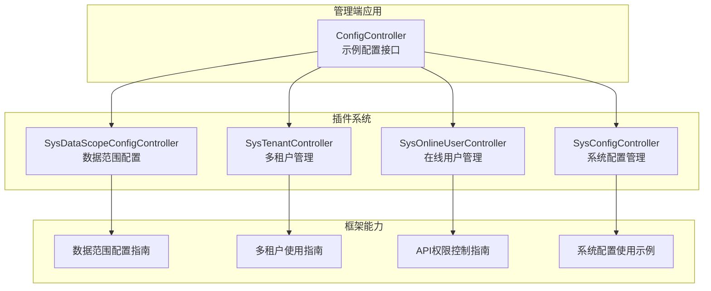
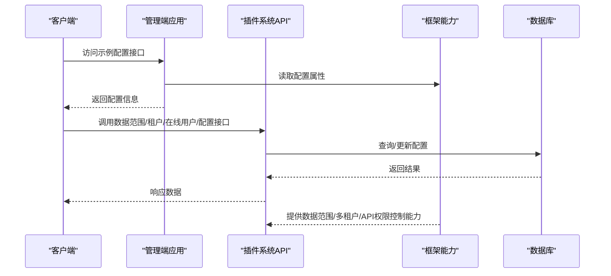
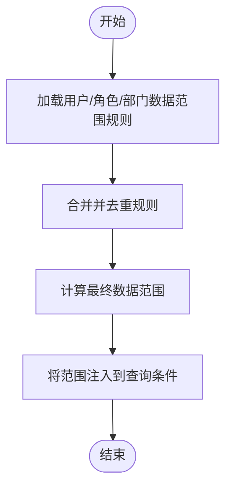
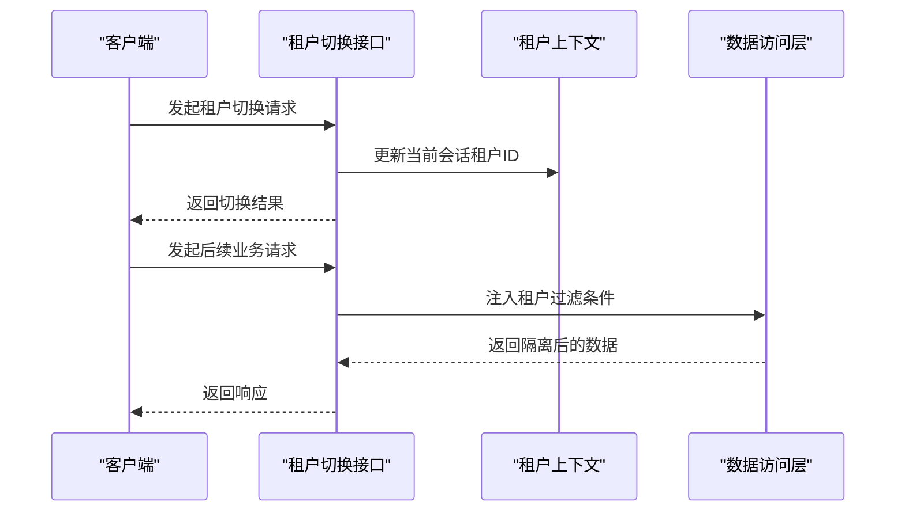
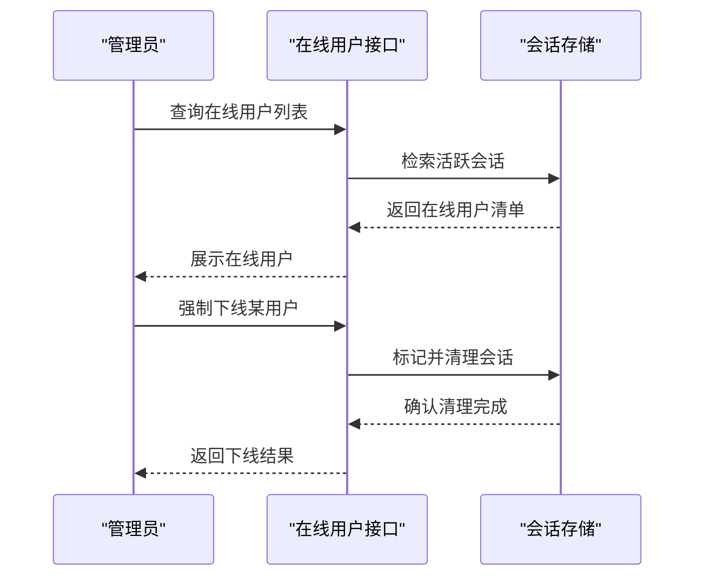
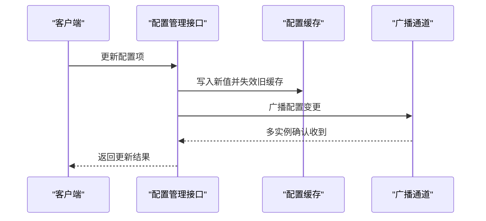
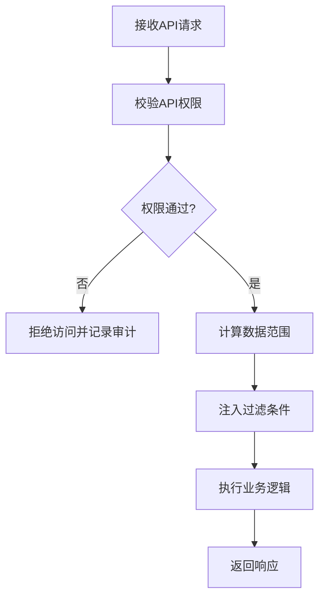
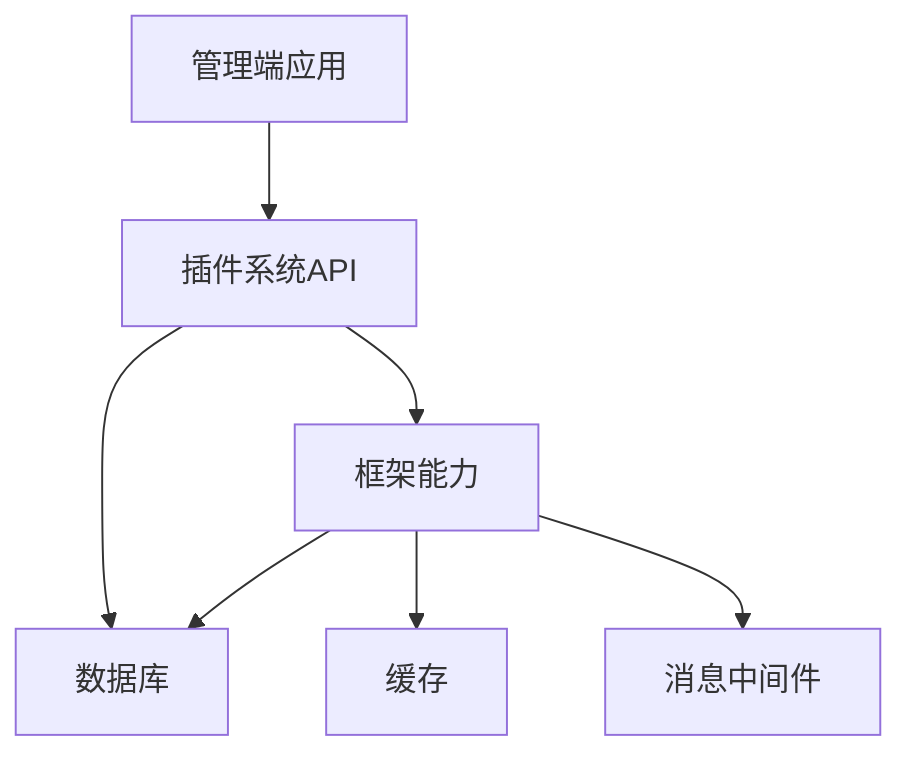

# 数据管理接口

<cite>
**本文引用的文件**
- [ConfigController.java](file://forge/forge-admin/src/main/java/com/mdframe/forge/admin/ConfigController.java)
- [SysDataScopeConfigController.java](file://forge/forge-framework/forge-plugin-parent/forge-plugin-system/src/main/java/com/mdframe/forge/plugin/system/controller/SysDataScopeConfigController.java)
- [SysTenantController.java](file://forge/forge-framework/forge-plugin-parent/forge-plugin-system/src/main/java/com/mdframe/forge/plugin/system/controller/SysTenantController.java)
- [SysOnlineUserController.java](file://forge/forge-framework/forge-plugin-parent/forge-plugin-system/src/main/java/com/mdframe/forge/plugin/system/controller/SysOnlineUserController.java)
- [SysConfigController.java](file://forge/forge-framework/forge-plugin-parent/forge-plugin-system/src/main/java/com/mdframe/forge/plugin/system/controller/SysConfigController.java)
- [DATA_SCOPE_CONFIG_GUIDE.md](file://forge/forge-framework/forge-starter-parent/forge-starter-datascope/DATA_SCOPE_CONFIG_GUIDE.md)
- [TENANT_USAGE.md](file://forge/forge-framework/forge-starter-parent/forge-starter-tenant/TENANT_USAGE.md)
- [API_CONFIG_USAGE.md](file://forge/forge-framework/forge-starter-parent/forge-starter-api-config/API_CONFIG_USAGE.md)
- [USAGE_EXAMPLE.md](file://forge/forge-framework/forge-starter-parent/forge-starter-config/USAGE_EXAMPLE.md)
- [API权限控制使用说明.md](file://forge/forge-admin/src/main/resources/sql/API权限控制使用说明.md)
</cite>

## 目录
1. [简介](#简介)
2. [项目结构](#项目结构)
3. [核心组件](#核心组件)
4. [架构总览](#架构总览)
5. [详细组件分析](#详细组件分析)
6. [依赖关系分析](#依赖关系分析)
7. [性能考虑](#性能考虑)
8. [故障排除指南](#故障排除指南)
9. [结论](#结论)
10. [附录](#附录)

## 简介
本文件面向开发者，系统化梳理数据管理模块的API接口与实现机制，覆盖以下核心能力：
- 数据权限控制：通过数据范围配置接口实现动态数据访问边界控制
- 多租户管理：提供租户切换与数据隔离能力
- 系统配置管理：集中式配置项的查询与热更新支持
- 在线用户管理：在线用户的查询与强制下线操作

文档同时给出数据范围计算逻辑、租户上下文传递机制以及配置热更新的技术要点，帮助开发者正确实现数据权限控制与多租户隔离。

## 项目结构
数据管理相关能力主要分布在三处：
- 后端插件系统（forge-plugin-system）：提供系统管理类API（数据范围、租户、在线用户、配置）
- 后端框架（forge-starter-*）：提供基础能力与使用指南（数据范围、多租户、API配置、系统配置）
- 管理端应用（forge-admin）：提供示例配置接口用于演示与调试

**图表来源**
- [ConfigController.java](file://forge/forge-admin/src/main/java/com/mdframe/forge/admin/ConfigController.java#L1-L38)
- [SysDataScopeConfigController.java](file://forge/forge-framework/forge-plugin-parent/forge-plugin-system/src/main/java/com/mdframe/forge/plugin/system/controller/SysDataScopeConfigController.java)
- [SysTenantController.java](file://forge/forge-framework/forge-plugin-parent/forge-plugin-system/src/main/java/com/mdframe/forge/plugin/system/controller/SysTenantController.java)
- [SysOnlineUserController.java](file://forge/forge-framework/forge-plugin-parent/forge-plugin-system/src/main/java/com/mdframe/forge/plugin/system/controller/SysOnlineUserController.java)
- [SysConfigController.java](file://forge/forge-framework/forge-plugin-parent/forge-plugin-system/src/main/java/com/mdframe/forge/plugin/system/controller/SysConfigController.java)
- [DATA_SCOPE_CONFIG_GUIDE.md](file://forge/forge-framework/forge-starter-parent/forge-starter-datascope/DATA_SCOPE_CONFIG_GUIDE.md)
- [TENANT_USAGE.md](file://forge/forge-framework/forge-starter-parent/forge-starter-tenant/TENANT_USAGE.md)
- [API_CONFIG_USAGE.md](file://forge/forge-framework/forge-starter-parent/forge-starter-api-config/API_CONFIG_USAGE.md)
- [USAGE_EXAMPLE.md](file://forge/forge-framework/forge-starter-parent/forge-starter-config/USAGE_EXAMPLE.md)

**章节来源**
- [ConfigController.java](file://forge/forge-admin/src/main/java/com/mdframe/forge/admin/ConfigController.java#L1-L38)

## 核心组件
- 数据范围配置接口：用于维护与查询数据访问范围规则，支持按角色/岗位/部门等维度进行动态配置
- 租户切换接口：在多租户模式下切换当前会话所属租户，确保后续请求的数据隔离
- 配置管理接口：提供系统级配置项的查询与热更新能力
- 在线用户管理接口：查询在线用户列表并支持强制下线操作

这些组件共同构成数据管理模块的API体系，支撑数据权限控制与多租户隔离的落地实施。

**章节来源**
- [SysDataScopeConfigController.java](file://forge/forge-framework/forge-plugin-parent/forge-plugin-system/src/main/java/com/mdframe/forge/plugin/system/controller/SysDataScopeConfigController.java)
- [SysTenantController.java](file://forge/forge-framework/forge-plugin-parent/forge-plugin-system/src/main/java/com/mdframe/forge/plugin/system/controller/SysTenantController.java)
- [SysOnlineUserController.java](file://forge/forge-framework/forge-plugin-parent/forge-plugin-system/src/main/java/com/mdframe/forge/plugin/system/controller/SysOnlineUserController.java)
- [SysConfigController.java](file://forge/forge-framework/forge-plugin-parent/forge-plugin-system/src/main/java/com/mdframe/forge/plugin/system/controller/SysConfigController.java)

## 架构总览
下图展示数据管理模块的调用链路与职责划分：

**图表来源**
- [ConfigController.java](file://forge/forge-admin/src/main/java/com/mdframe/forge/admin/ConfigController.java#L30-L36)
- [SysDataScopeConfigController.java](file://forge/forge-framework/forge-plugin-parent/forge-plugin-system/src/main/java/com/mdframe/forge/plugin/system/controller/SysDataScopeConfigController.java)
- [SysTenantController.java](file://forge/forge-framework/forge-plugin-parent/forge-plugin-system/src/main/java/com/mdframe/forge/plugin/system/controller/SysTenantController.java)
- [SysOnlineUserController.java](file://forge/forge-framework/forge-plugin-parent/forge-plugin-system/src/main/java/com/mdframe/forge/plugin/system/controller/SysOnlineUserController.java)
- [SysConfigController.java](file://forge/forge-framework/forge-plugin-parent/forge-plugin-system/src/main/java/com/mdframe/forge/plugin/system/controller/SysConfigController.java)
- [DATA_SCOPE_CONFIG_GUIDE.md](file://forge/forge-framework/forge-starter-parent/forge-starter-datascope/DATA_SCOPE_CONFIG_GUIDE.md)
- [TENANT_USAGE.md](file://forge/forge-framework/forge-starter-parent/forge-starter-tenant/TENANT_USAGE.md)
- [API_CONFIG_USAGE.md](file://forge/forge-framework/forge-starter-parent/forge-starter-api-config/API_CONFIG_USAGE.md)
- [USAGE_EXAMPLE.md](file://forge/forge-framework/forge-starter-parent/forge-starter-config/USAGE_EXAMPLE.md)

## 详细组件分析

### 数据范围配置接口
- 接口职责
  - 维护数据访问范围规则，支持按角色、岗位、部门等维度进行动态配置
  - 支持查询当前用户可访问的数据范围，用于业务层过滤数据
- 关键实现点
  - 规则解析与缓存：建议将规则解析为可执行表达式或SQL片段，并进行缓存以提升性能
  - 动态生效：配置变更后，通过缓存失效或事件通知机制实现规则的动态生效
  - 权限校验：在数据查询前，结合当前用户上下文计算数据范围并注入到查询条件中
- 数据范围计算逻辑
  - 用户维度：基于用户的角色/岗位/部门继承关系，合并所有允许的数据范围规则
  - 角色维度：合并角色关联的数据范围规则，去重并按优先级排序
  - 最终范围：对多个来源的范围进行交集/并集运算，得到最终的可访问范围集合
- 示例参考
  - 参考数据范围配置指南，了解规则定义与生效流程

**图表来源**
- [SysDataScopeConfigController.java](file://forge/forge-framework/forge-plugin-parent/forge-plugin-system/src/main/java/com/mdframe/forge/plugin/system/controller/SysDataScopeConfigController.java)
- [DATA_SCOPE_CONFIG_GUIDE.md](file://forge/forge-framework/forge-starter-parent/forge-starter-datascope/DATA_SCOPE_CONFIG_GUIDE.md)

**章节来源**
- [SysDataScopeConfigController.java](file://forge/forge-framework/forge-plugin-parent/forge-plugin-system/src/main/java/com/mdframe/forge/plugin/system/controller/SysDataScopeConfigController.java)
- [DATA_SCOPE_CONFIG_GUIDE.md](file://forge/forge-framework/forge-starter-parent/forge-starter-datascope/DATA_SCOPE_CONFIG_GUIDE.md)

### 租户切换接口
- 接口职责
  - 在多租户模式下，切换当前会话所属的租户标识
  - 确保后续请求在正确的租户上下文中执行，实现数据隔离
- 关键实现点
  - 上下文传递：将租户ID写入当前会话上下文（如ThreadLocal、MDC或安全上下文），供后续处理链使用
  - 隔离策略：在数据访问层（DAO/ORM）自动拼接租户过滤条件，或在查询前注入租户ID
  - 切换校验：切换前校验目标租户是否对当前用户可见或具备访问权限
- 切换流程
  - 客户端发起租户切换请求
  - 服务端验证用户权限并更新会话租户上下文
  - 返回成功状态，后续请求自动携带该租户上下文

**图表来源**
- [SysTenantController.java](file://forge/forge-framework/forge-plugin-parent/forge-plugin-system/src/main/java/com/mdframe/forge/plugin/system/controller/SysTenantController.java)
- [TENANT_USAGE.md](file://forge/forge-framework/forge-starter-parent/forge-starter-tenant/TENANT_USAGE.md)

**章节来源**
- [SysTenantController.java](file://forge/forge-framework/forge-plugin-parent/forge-plugin-system/src/main/java/com/mdframe/forge/plugin/system/controller/SysTenantController.java)
- [TENANT_USAGE.md](file://forge/forge-framework/forge-starter-parent/forge-starter-tenant/TENANT_USAGE.md)

### 在线用户管理接口
- 接口职责
  - 查询当前系统中的在线用户列表
  - 支持强制下线指定在线用户，保障会话安全
- 关键实现点
  - 在线检测：基于会话存储或登录令牌状态判断用户在线状态
  - 强制下线：清除对应会话或标记会话失效，触发客户端重新认证
  - 安全审计：记录强制下线操作的日志，便于审计与追踪

**图表来源**
- [SysOnlineUserController.java](file://forge/forge-framework/forge-plugin-parent/forge-plugin-system/src/main/java/com/mdframe/forge/plugin/system/controller/SysOnlineUserController.java)

**章节来源**
- [SysOnlineUserController.java](file://forge/forge-framework/forge-plugin-parent/forge-plugin-system/src/main/java/com/mdframe/forge/plugin/system/controller/SysOnlineUserController.java)

### 系统配置管理接口
- 接口职责
  - 提供系统级配置项的查询与更新能力
  - 支持配置的热更新，避免重启服务即可生效
- 关键实现点
  - 集中式存储：统一存储在配置中心或数据库表中，提供统一入口
  - 缓存与广播：配置变更后，通过本地缓存与消息广播实现多实例同步
  - 生效策略：区分立即生效与延迟生效的配置类型，避免对业务造成冲击
- 示例参考
  - 参考系统配置使用示例，了解配置项的定义与更新流程

**图表来源**
- [SysConfigController.java](file://forge/forge-framework/forge-plugin-parent/forge-plugin-system/src/main/java/com/mdframe/forge/plugin/system/controller/SysConfigController.java)
- [USAGE_EXAMPLE.md](file://forge/forge-framework/forge-starter-parent/forge-starter-config/USAGE_EXAMPLE.md)

**章节来源**
- [SysConfigController.java](file://forge/forge-framework/forge-plugin-parent/forge-plugin-system/src/main/java/com/mdframe/forge/plugin/system/controller/SysConfigController.java)
- [USAGE_EXAMPLE.md](file://forge/forge-framework/forge-starter-parent/forge-starter-config/USAGE_EXAMPLE.md)

### API权限控制与数据权限联动
- 接口职责
  - 将API级别的权限控制与数据范围控制联动，确保“能访问的API”与“能访问的数据”一致
- 关键实现点
  - 权限矩阵：建立API资源与数据范围规则的映射关系
  - 执行顺序：先进行API权限校验，再进行数据范围计算，最后注入过滤条件
  - 审计日志：记录每次权限校验与数据范围应用的结果，便于问题排查
- 示例参考
  - 参考API权限控制使用说明，了解权限配置与校验流程

**图表来源**
- [API_CONFIG_USAGE.md](file://forge/forge-framework/forge-starter-parent/forge-starter-api-config/API_CONFIG_USAGE.md)
- [API权限控制使用说明.md](file://forge/forge-admin/src/main/resources/sql/API权限控制使用说明.md)

**章节来源**
- [API_CONFIG_USAGE.md](file://forge/forge-framework/forge-starter-parent/forge-starter-api-config/API_CONFIG_USAGE.md)
- [API权限控制使用说明.md](file://forge/forge-admin/src/main/resources/sql/API权限控制使用说明.md)

## 依赖关系分析
- 组件耦合
  - 插件系统API作为统一入口，依赖框架提供的数据范围、多租户与API权限控制能力
  - 管理端应用通过示例配置接口演示配置读取与热更新效果
- 外部依赖
  - 数据库：存储配置项、数据范围规则、租户信息与在线用户会话
  - 缓存：用于配置与数据范围规则的缓存，提升查询性能
  - 消息中间件：用于配置变更的广播与多实例同步

**图表来源**
- [ConfigController.java](file://forge/forge-admin/src/main/java/com/mdframe/forge/admin/ConfigController.java#L1-L38)
- [SysDataScopeConfigController.java](file://forge/forge-framework/forge-plugin-parent/forge-plugin-system/src/main/java/com/mdframe/forge/plugin/system/controller/SysDataScopeConfigController.java)
- [SysTenantController.java](file://forge/forge-framework/forge-plugin-parent/forge-plugin-system/src/main/java/com/mdframe/forge/plugin/system/controller/SysTenantController.java)
- [SysOnlineUserController.java](file://forge/forge-framework/forge-plugin-parent/forge-plugin-system/src/main/java/com/mdframe/forge/plugin/system/controller/SysOnlineUserController.java)
- [SysConfigController.java](file://forge/forge-framework/forge-plugin-parent/forge-plugin-system/src/main/java/com/mdframe/forge/plugin/system/controller/SysConfigController.java)

**章节来源**
- [ConfigController.java](file://forge/forge-admin/src/main/java/com/mdframe/forge/admin/ConfigController.java#L1-L38)

## 性能考虑
- 缓存策略
  - 对高频查询的配置项与数据范围规则进行缓存，设置合理的过期时间与失效策略
- 广播同步
  - 使用消息广播实现多实例间的配置变更同步，降低一致性成本
- 查询优化
  - 在数据访问层为租户字段与数据范围字段建立索引，减少过滤查询的开销
- 并发控制
  - 配置更新采用互斥锁或版本号机制，避免并发更新导致的数据不一致

## 故障排除指南
- 数据范围不生效
  - 检查用户角色/部门/岗位是否正确关联了数据范围规则
  - 确认规则解析与注入流程是否正常执行
- 租户切换失败
  - 校验用户对目标租户的访问权限
  - 检查租户上下文是否正确写入会话
- 配置未热更新
  - 确认配置变更后是否触发缓存失效与广播
  - 检查多实例间的消息通道是否正常
- 在线用户无法强制下线
  - 检查会话存储是否支持删除或标记失效
  - 确认客户端是否及时刷新状态并重新认证

## 结论
数据管理模块通过“数据范围配置+多租户隔离+系统配置管理+在线用户治理”的组合拳，实现了灵活且安全的数据访问控制。开发者可依据本文档的接口职责、实现要点与最佳实践，快速搭建符合业务需求的数据权限体系与多租户隔离方案。

## 附录
- 快速参考
  - 数据范围配置指南：用于定义与生效数据范围规则
  - 多租户使用指南：用于理解租户上下文与数据隔离机制
  - API权限控制使用说明：用于建立API与数据范围的联动校验
  - 系统配置使用示例：用于了解配置项的定义与热更新流程
- 示例文件路径
  - [DATA_SCOPE_CONFIG_GUIDE.md](file://forge/forge-framework/forge-starter-parent/forge-starter-datascope/DATA_SCOPE_CONFIG_GUIDE.md)
  - [TENANT_USAGE.md](file://forge/forge-framework/forge-starter-parent/forge-starter-tenant/TENANT_USAGE.md)
  - [API_CONFIG_USAGE.md](file://forge/forge-framework/forge-starter-parent/forge-starter-api-config/API_CONFIG_USAGE.md)
  - [USAGE_EXAMPLE.md](file://forge/forge-framework/forge-starter-parent/forge-starter-config/USAGE_EXAMPLE.md)
  - [API权限控制使用说明.md](file://forge/forge-admin/src/main/resources/sql/API权限控制使用说明.md)