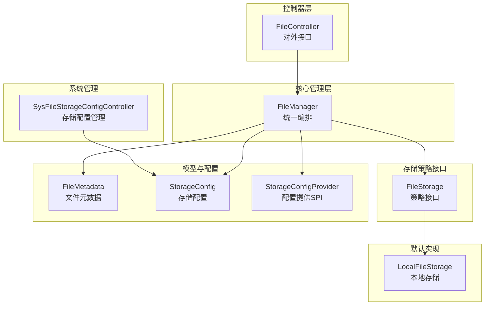
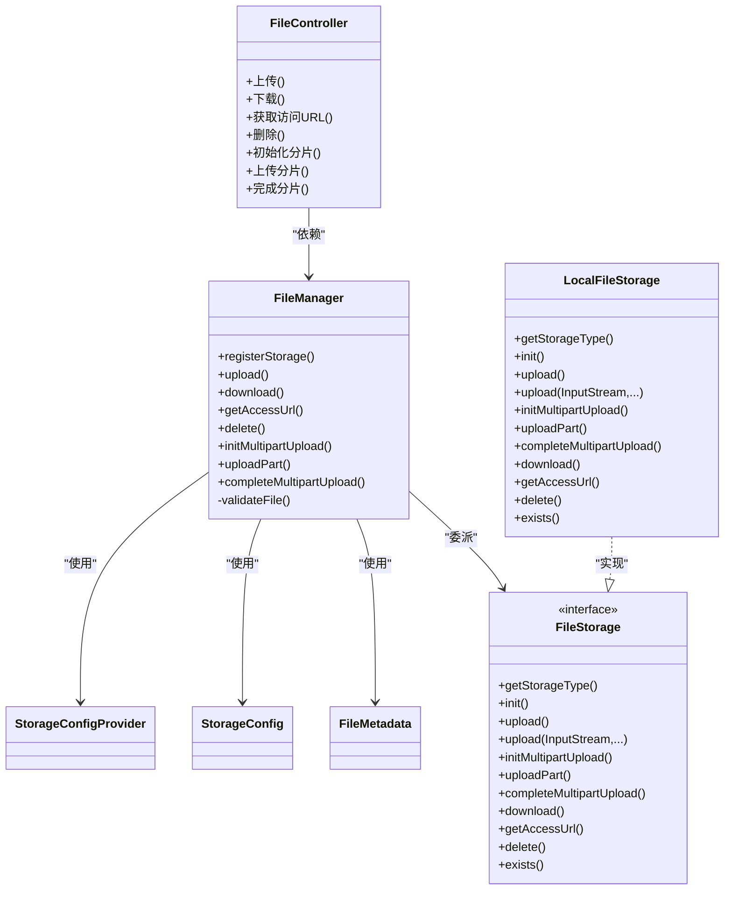
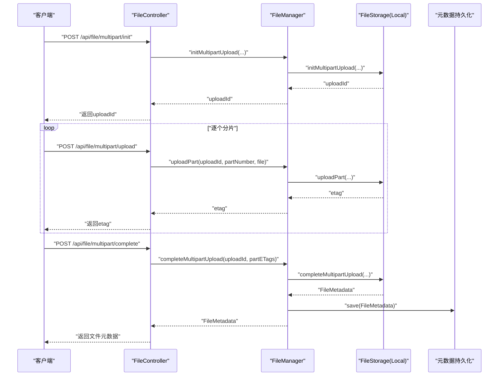
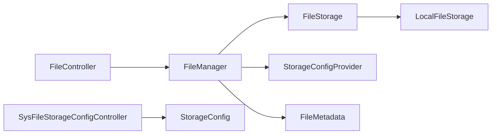

# 文件管理接口

<cite>
**本文引用的文件**
- [FileController.java](file://forge/forge-framework/forge-starter-parent/forge-starter-file/src/main/java/com/mdframe/forge/starter/file/controller/FileController.java)
- [FileManager.java](file://forge/forge-framework/forge-starter-parent/forge-starter-file/src/main/java/com/mdframe/forge/starter/file/core/FileManager.java)
- [FileMetadata.java](file://forge/forge-framework/forge-starter-parent/forge-starter-file/src/main/java/com/mdframe/forge/starter/file/model/FileMetadata.java)
- [StorageConfig.java](file://forge/forge-framework/forge-starter-parent/forge-starter-file/src/main/java/com/mdframe/forge/starter/file/model/StorageConfig.java)
- [StorageConfigProvider.java](file://forge/forge-framework/forge-starter-parent/forge-starter-file/src/main/java/com/mdframe/forge/starter/file/spi/StorageConfigProvider.java)
- [FileStorage.java](file://forge/forge-framework/forge-starter-parent/forge-starter-file/src/main/java/com/mdframe/forge/starter/file/storage/FileStorage.java)
- [LocalFileStorage.java](file://forge/forge-framework/forge-starter-parent/forge-starter-file/src/main/java/com/mdframe/forge/starter/file/storage/impl/LocalFileStorage.java)
- [SysFileStorageConfigController.java](file://forge/forge-framework/forge-plugin-parent/forge-plugin-system/src/main/java/com/mdframe/forge/plugin/system/controller/SysFileStorageConfigController.java)
</cite>

## 目录
1. [简介](#简介)
2. [项目结构](#项目结构)
3. [核心组件](#核心组件)
4. [架构总览](#架构总览)
5. [详细组件分析](#详细组件分析)
6. [依赖关系分析](#依赖关系分析)
7. [性能与安全考虑](#性能与安全考虑)
8. [故障排查指南](#故障排查指南)
9. [结论](#结论)
10. [附录：接口定义与示例](#附录接口定义与示例)

## 简介
本文件管理接口文档面向后端开发者与集成方，覆盖文件上传、下载、删除、访问链接获取、分片上传、存储配置管理等核心能力。文档同时说明文件元数据模型、存储策略配置、访问权限控制与错误处理，并提供从初始化到完成的完整上传流程示例，以及不同存储策略的配置方法与适用场景。

## 项目结构
文件管理相关代码位于“starter-file”模块中，采用“接口 + SPI + 默认实现”的分层设计：
- 控制器层：对外暴露REST接口
- 核心管理层：统一编排上传、下载、删除、分片等流程
- 存储策略接口：抽象不同存储实现
- 默认实现：本地文件系统存储
- 元数据与配置模型：描述文件属性与存储策略参数
- 系统插件：提供存储配置的增删改查管理接口

图表来源
- [FileController.java](file://forge/forge-framework/forge-starter-parent/forge-starter-file/src/main/java/com/mdframe/forge/starter/file/controller/FileController.java#L1-L117)
- [FileManager.java](file://forge/forge-framework/forge-starter-parent/forge-starter-file/src/main/java/com/mdframe/forge/starter/file/core/FileManager.java#L1-L255)
- [FileStorage.java](file://forge/forge-framework/forge-starter-parent/forge-starter-file/src/main/java/com/mdframe/forge/starter/file/storage/FileStorage.java#L1-L110)
- [LocalFileStorage.java](file://forge/forge-framework/forge-starter-parent/forge-starter-file/src/main/java/com/mdframe/forge/starter/file/storage/impl/LocalFileStorage.java#L1-L439)
- [FileMetadata.java](file://forge/forge-framework/forge-starter-parent/forge-starter-file/src/main/java/com/mdframe/forge/starter/file/model/FileMetadata.java#L1-L110)
- [StorageConfig.java](file://forge/forge-framework/forge-starter-parent/forge-starter-file/src/main/java/com/mdframe/forge/starter/file/model/StorageConfig.java#L1-L109)
- [StorageConfigProvider.java](file://forge/forge-framework/forge-starter-parent/forge-starter-file/src/main/java/com/mdframe/forge/starter/file/spi/StorageConfigProvider.java#L1-L33)
- [SysFileStorageConfigController.java](file://forge/forge-framework/forge-plugin-parent/forge-plugin-system/src/main/java/com/mdframe/forge/plugin/system/controller/SysFileStorageConfigController.java#L1-L68)

章节来源
- [FileController.java](file://forge/forge-framework/forge-starter-parent/forge-starter-file/src/main/java/com/mdframe/forge/starter/file/controller/FileController.java#L1-L117)
- [FileManager.java](file://forge/forge-framework/forge-starter-parent/forge-starter-file/src/main/java/com/mdframe/forge/starter/file/core/FileManager.java#L1-L255)
- [FileStorage.java](file://forge/forge-framework/forge-starter-parent/forge-starter-file/src/main/java/com/mdframe/forge/starter/file/storage/FileStorage.java#L1-L110)
- [LocalFileStorage.java](file://forge/forge-framework/forge-starter-parent/forge-starter-file/src/main/java/com/mdframe/forge/starter/file/storage/impl/LocalFileStorage.java#L1-L439)
- [FileMetadata.java](file://forge/forge-framework/forge-starter-parent/forge-starter-file/src/main/java/com/mdframe/forge/starter/file/model/FileMetadata.java#L1-L110)
- [StorageConfig.java](file://forge/forge-framework/forge-starter-parent/forge-starter-file/src/main/java/com/mdframe/forge/starter/file/model/StorageConfig.java#L1-L109)
- [StorageConfigProvider.java](file://forge/forge-framework/forge-starter-parent/forge-starter-file/src/main/java/com/mdframe/forge/starter/file/spi/StorageConfigProvider.java#L1-L33)
- [SysFileStorageConfigController.java](file://forge/forge-framework/forge-plugin-parent/forge-plugin-system/src/main/java/com/mdframe/forge/plugin/system/controller/SysFileStorageConfigController.java#L1-L68)

## 核心组件
- FileController：对外HTTP接口入口，提供上传、下载、删除、获取访问URL、分片上传等REST接口。
- FileManager：统一编排文件生命周期，负责校验、秒传、调用具体存储策略、持久化元数据、更新下载计数等。
- FileStorage：存储策略接口，定义上传、下载、分片、URL生成、删除等标准能力。
- LocalFileStorage：默认本地文件系统实现，支持本地磁盘存储、分片合并、相对路径URL生成。
- FileMetadata：文件元数据模型，包含文件标识、原始名、存储名、路径、大小、MIME、扩展名、MD5、存储策略、桶、访问URL、缩略图URL、业务类型/ID、上传者、上传时间、过期时间、是否私有、下载次数等。
- StorageConfig：存储策略配置模型，包含配置ID、名称、类型、是否默认/启用、端点、密钥、桶、区域、基础路径、域名、是否HTTPS、最大文件大小、允许类型、排序、扩展配置等。
- StorageConfigProvider：存储配置提供SPI，业务侧可实现从数据库加载配置、刷新缓存等。
- SysFileStorageConfigController：系统管理端的存储配置管理接口，提供分页查询、详情、新增、修改、删除等。

章节来源
- [FileController.java](file://forge/forge-framework/forge-starter-parent/forge-starter-file/src/main/java/com/mdframe/forge/starter/file/controller/FileController.java#L1-L117)
- [FileManager.java](file://forge/forge-framework/forge-starter-parent/forge-starter-file/src/main/java/com/mdframe/forge/starter/file/core/FileManager.java#L1-L255)
- [FileStorage.java](file://forge/forge-framework/forge-starter-parent/forge-starter-file/src/main/java/com/mdframe/forge/starter/file/storage/FileStorage.java#L1-L110)
- [LocalFileStorage.java](file://forge/forge-framework/forge-starter-parent/forge-starter-file/src/main/java/com/mdframe/forge/starter/file/storage/impl/LocalFileStorage.java#L1-L439)
- [FileMetadata.java](file://forge/forge-framework/forge-starter-parent/forge-starter-file/src/main/java/com/mdframe/forge/starter/file/model/FileMetadata.java#L1-L110)
- [StorageConfig.java](file://forge/forge-framework/forge-starter-parent/forge-starter-file/src/main/java/com/mdframe/forge/starter/file/model/StorageConfig.java#L1-L109)
- [StorageConfigProvider.java](file://forge/forge-framework/forge-starter-parent/forge-starter-file/src/main/java/com/mdframe/forge/starter/file/spi/StorageConfigProvider.java#L1-L33)
- [SysFileStorageConfigController.java](file://forge/forge-framework/forge-plugin-parent/forge-plugin-system/src/main/java/com/mdframe/forge/plugin/system/controller/SysFileStorageConfigController.java#L1-L68)

## 架构总览
文件管理采用“控制器 -> 管理器 -> 存储策略”的分层架构，通过SPI注入存储配置与元数据持久化，支持多存储策略扩展。

图表来源
- [FileController.java](file://forge/forge-framework/forge-starter-parent/forge-starter-file/src/main/java/com/mdframe/forge/starter/file/controller/FileController.java#L1-L117)
- [FileManager.java](file://forge/forge-framework/forge-starter-parent/forge-starter-file/src/main/java/com/mdframe/forge/starter/file/core/FileManager.java#L1-L255)
- [FileStorage.java](file://forge/forge-framework/forge-starter-parent/forge-starter-file/src/main/java/com/mdframe/forge/starter/file/storage/FileStorage.java#L1-L110)
- [LocalFileStorage.java](file://forge/forge-framework/forge-starter-parent/forge-starter-file/src/main/java/com/mdframe/forge/starter/file/storage/impl/LocalFileStorage.java#L1-L439)
- [FileMetadata.java](file://forge/forge-framework/forge-starter-parent/forge-starter-file/src/main/java/com/mdframe/forge/starter/file/model/FileMetadata.java#L1-L110)
- [StorageConfig.java](file://forge/forge-framework/forge-starter-parent/forge-starter-file/src/main/java/com/mdframe/forge/starter/file/model/StorageConfig.java#L1-L109)
- [StorageConfigProvider.java](file://forge/forge-framework/forge-starter-parent/forge-starter-file/src/main/java/com/mdframe/forge/starter/file/spi/StorageConfigProvider.java#L1-L33)

## 详细组件分析

### 文件上传接口
- 单文件上传
  - 方法与路径：POST /api/file/upload
  - 请求参数：
    - file：二进制文件（必填）
    - businessType：业务类型，默认 common
    - businessId：业务ID（可选）
    - storageType：存储策略类型（可选，不传则使用默认配置）
  - 响应：成功返回文件元数据对象
  - 处理逻辑：
    - 校验文件大小与类型（依据存储配置）
    - 若开启元数据持久化且同MD5文件已存在，则“秒传”直接返回已有元数据
    - 调用指定或默认存储策略执行上传
    - 将MD5写入元数据并持久化
- 批量上传
  - 当前通用控制器未提供批量上传接口；如需批量，请在客户端循环调用单文件上传接口，或在业务侧自定义批量上传接口。

章节来源
- [FileController.java](file://forge/forge-framework/forge-starter-parent/forge-starter-file/src/main/java/com/mdframe/forge/starter/file/controller/FileController.java#L28-L43)
- [FileManager.java](file://forge/forge-framework/forge-starter-parent/forge-starter-file/src/main/java/com/mdframe/forge/starter/file/core/FileManager.java#L58-L99)
- [StorageConfigProvider.java](file://forge/forge-framework/forge-starter-parent/forge-starter-file/src/main/java/com/mdframe/forge/starter/file/spi/StorageConfigProvider.java#L1-L33)
- [StorageConfig.java](file://forge/forge-framework/forge-starter-parent/forge-starter-file/src/main/java/com/mdframe/forge/starter/file/model/StorageConfig.java#L1-L109)

### 分片上传接口
- 初始化分片上传
  - 方法与路径：POST /api/file/multipart/init
  - 请求参数：
    - fileName：文件名（必填）
    - businessType：业务类型，默认 common
    - businessId：业务ID（可选）
    - storageType：存储策略类型，默认 local
  - 响应：返回uploadId（用于后续分片上传）
- 上传分片
  - 方法与路径：POST /api/file/multipart/upload
  - 请求参数：
    - uploadId：初始化时返回的ID（必填）
    - partNumber：分片序号（必填）
    - file：该分片的二进制内容（必填）
    - storageType：存储策略类型，默认 local
  - 响应：返回该分片的ETag（当前实现返回分片文件名）
- 完成分片上传
  - 方法与路径：POST /api/file/multipart/complete
  - 请求参数：
    - uploadId：初始化时返回的ID（必填）
    - partETags：各分片ETag列表（必填）
    - storageType：存储策略类型，默认 local
  - 响应：返回合并后的文件元数据
- 本地存储实现要点：
  - 临时目录：基于uploadId创建独立临时目录存放分片
  - 合并：按分片序号顺序合并至最终目标文件
  - 清理：合并完成后删除临时目录

图表来源
- [FileController.java](file://forge/forge-framework/forge-starter-parent/forge-starter-file/src/main/java/com/mdframe/forge/starter/file/controller/FileController.java#L77-L115)
- [FileManager.java](file://forge/forge-framework/forge-starter-parent/forge-starter-file/src/main/java/com/mdframe/forge/starter/file/core/FileManager.java#L183-L218)
- [LocalFileStorage.java](file://forge/forge-framework/forge-starter-parent/forge-starter-file/src/main/java/com/mdframe/forge/starter/file/storage/impl/LocalFileStorage.java#L137-L255)

章节来源
- [FileController.java](file://forge/forge-framework/forge-starter-parent/forge-starter-file/src/main/java/com/mdframe/forge/starter/file/controller/FileController.java#L77-L115)
- [FileManager.java](file://forge/forge-framework/forge-starter-parent/forge-starter-file/src/main/java/com/mdframe/forge/starter/file/core/FileManager.java#L183-L218)
- [LocalFileStorage.java](file://forge/forge-framework/forge-starter-parent/forge-starter-file/src/main/java/com/mdframe/forge/starter/file/storage/impl/LocalFileStorage.java#L137-L255)

### 文件下载接口
- 方法与路径：GET /api/file/download/{fileId}
- 请求参数：
  - fileId：文件唯一ID（路径参数）
- 响应：直接输出文件流，设置Content-Type与Content-Disposition
- 行为：
  - 读取元数据，定位存储策略与文件路径
  - 通过对应存储策略读取文件流并写出
  - 成功下载后更新下载次数

章节来源
- [FileController.java](file://forge/forge-framework/forge-starter-parent/forge-starter-file/src/main/java/com/mdframe/forge/starter/file/controller/FileController.java#L48-L51)
- [FileManager.java](file://forge/forge-framework/forge-starter-parent/forge-starter-file/src/main/java/com/mdframe/forge/starter/file/core/FileManager.java#L104-L135)

### 获取访问URL接口
- 方法与路径：GET /api/file/url/{fileId}?expires=3600
- 请求参数：
  - fileId：文件唯一ID（路径参数）
  - expires：URL过期时间（秒），默认3600
- 响应：返回可访问URL字符串
- 行为：
  - 读取元数据与存储策略
  - 本地存储返回相对路径或拼接域名后的下载地址（配合下载接口）

章节来源
- [FileController.java](file://forge/forge-framework/forge-starter-parent/forge-starter-file/src/main/java/com/mdframe/forge/starter/file/controller/FileController.java#L56-L63)
- [FileManager.java](file://forge/forge-framework/forge-starter-parent/forge-starter-file/src/main/java/com/mdframe/forge/starter/file/core/FileManager.java#L140-L156)
- [LocalFileStorage.java](file://forge/forge-framework/forge-starter-parent/forge-starter-file/src/main/java/com/mdframe/forge/starter/file/storage/impl/LocalFileStorage.java#L279-L292)

### 文件删除接口
- 方法与路径：DELETE /api/file/{fileId}
- 请求参数：
  - fileId：文件唯一ID（路径参数）
- 响应：布尔值表示是否删除成功
- 行为：
  - 读取元数据，定位存储策略
  - 调用存储策略删除文件
  - 删除元数据

章节来源
- [FileController.java](file://forge/forge-framework/forge-starter-parent/forge-starter-file/src/main/java/com/mdframe/forge/starter/file/controller/FileController.java#L68-L72)
- [FileManager.java](file://forge/forge-framework/forge-starter-parent/forge-starter-file/src/main/java/com/mdframe/forge/starter/file/core/FileManager.java#L161-L178)

### 存储配置管理接口
- 分页查询
  - 方法与路径：GET /system/storage/config/page
  - 请求参数：分页查询条件与筛选条件
  - 响应：分页结果
- 详情
  - 方法与路径：POST /system/storage/config/detail
  - 请求参数：id
  - 响应：配置详情
- 新增
  - 方法与路径：POST /system/storage/config
  - 请求参数：SysFileStorageConfig（由业务实体映射）
  - 响应：成功
- 修改
  - 方法与路径：PUT /system/storage/config
  - 请求参数：SysFileStorageConfig
  - 响应：成功
- 删除
  - 方法与路径：DELETE /system/storage/config/{ids}
  - 请求参数：ids（数组）
  - 响应：成功

章节来源
- [SysFileStorageConfigController.java](file://forge/forge-framework/forge-plugin-parent/forge-plugin-system/src/main/java/com/mdframe/forge/plugin/system/controller/SysFileStorageConfigController.java#L1-L68)

### 文件元数据管理
- FileMetadata字段说明（节选）：
  - fileId：文件唯一ID
  - originalName：原始文件名
  - storageName：存储文件名
  - filePath：存储相对路径
  - fileSize：文件大小（字节）
  - mimeType：MIME类型
  - extension：扩展名
  - md5：文件MD5
  - storageType：存储策略类型
  - bucket：桶/命名空间
  - accessUrl：访问URL
  - thumbnailUrl：缩略图URL
  - businessType/businessId：业务类型与ID
  - uploaderId：上传者ID
  - uploadTime：上传时间
  - expireTime：过期时间
  - isPrivate：是否私有
  - downloadCount：下载次数

章节来源
- [FileMetadata.java](file://forge/forge-framework/forge-starter-parent/forge-starter-file/src/main/java/com/mdframe/forge/starter/file/model/FileMetadata.java#L1-L110)

### 存储策略配置
- StorageConfig字段说明（节选）：
  - id、configName、storageType、isDefault、enabled
  - endpoint、accessKey、secretKey、bucketName、region
  - basePath、domain、useHttps
  - maxFileSize、allowedTypes、orderNum、extraConfig
- StorageConfigProvider：
  - 提供默认配置、按类型获取配置、获取所有启用配置、刷新缓存
- LocalFileStorage：
  - 存储类型：local
  - 支持初始化分片、上传分片、合并分片、下载、生成URL、删除、存在性检查
  - URL生成：若配置了domain则返回完整下载URL，否则返回相对路径

章节来源
- [StorageConfig.java](file://forge/forge-framework/forge-starter-parent/forge-starter-file/src/main/java/com/mdframe/forge/starter/file/model/StorageConfig.java#L1-L109)
- [StorageConfigProvider.java](file://forge/forge-framework/forge-starter-parent/forge-starter-file/src/main/java/com/mdframe/forge/starter/file/spi/StorageConfigProvider.java#L1-L33)
- [LocalFileStorage.java](file://forge/forge-framework/forge-starter-parent/forge-starter-file/src/main/java/com/mdframe/forge/starter/file/storage/impl/LocalFileStorage.java#L1-L439)

## 依赖关系分析
- 控制器依赖核心管理器
- 核心管理器依赖存储策略接口与配置提供SPI
- 默认实现实现存储策略接口
- 元数据持久化可选注入，用于秒传与下载计数

图表来源
- [FileController.java](file://forge/forge-framework/forge-starter-parent/forge-starter-file/src/main/java/com/mdframe/forge/starter/file/controller/FileController.java#L1-L117)
- [FileManager.java](file://forge/forge-framework/forge-starter-parent/forge-starter-file/src/main/java/com/mdframe/forge/starter/file/core/FileManager.java#L1-L255)
- [FileStorage.java](file://forge/forge-framework/forge-starter-parent/forge-starter-file/src/main/java/com/mdframe/forge/starter/file/storage/FileStorage.java#L1-L110)
- [LocalFileStorage.java](file://forge/forge-framework/forge-starter-parent/forge-starter-file/src/main/java/com/mdframe/forge/starter/file/storage/impl/LocalFileStorage.java#L1-L439)
- [StorageConfigProvider.java](file://forge/forge-framework/forge-starter-parent/forge-starter-file/src/main/java/com/mdframe/forge/starter/file/spi/StorageConfigProvider.java#L1-L33)
- [SysFileStorageConfigController.java](file://forge/forge-framework/forge-plugin-parent/forge-plugin-system/src/main/java/com/mdframe/forge/plugin/system/controller/SysFileStorageConfigController.java#L1-L68)

## 性能与安全考虑
- 性能
  - 秒传：基于MD5去重，避免重复上传与IO开销
  - 分片上传：支持断点续传与并发分片，适合大文件
  - 本地存储：建议将basePath置于高性能磁盘，合理规划目录层级
- 安全
  - 文件类型与大小限制：通过存储配置的allowedTypes与maxFileSize进行约束
  - URL过期：通过expires参数控制访问时效
  - 私有文件：isPrivate字段可用于策略层控制访问策略（需结合具体存储实现）
- 可靠性
  - 分片合并：本地实现按序合并，异常时保留临时目录便于排查
  - 异常处理：统一抛出运行时异常，便于上层统一处理

[本节为通用指导，无需列出章节来源]

## 故障排查指南
- 未配置StorageConfigProvider
  - 现象：上传时报错提示未配置
  - 处理：实现StorageConfigProvider并确保默认配置可用
- 不支持的存储类型
  - 现象：上传/分片初始化时报错
  - 处理：确认storageType正确，且对应存储策略已注册
- 文件不存在
  - 现象：下载/删除/获取URL时报错
  - 处理：确认fileId有效，检查元数据是否持久化
- 文件大小/类型不合法
  - 现象：上传报错“文件大小超过限制/不支持的文件类型”
  - 处理：调整StorageConfig中的maxFileSize与allowedTypes

章节来源
- [FileManager.java](file://forge/forge-framework/forge-starter-parent/forge-starter-file/src/main/java/com/mdframe/forge/starter/file/core/FileManager.java#L59-L64)
- [FileManager.java](file://forge/forge-framework/forge-starter-parent/forge-starter-file/src/main/java/com/mdframe/forge/starter/file/core/FileManager.java#L86-L88)
- [FileManager.java](file://forge/forge-framework/forge-starter-parent/forge-starter-file/src/main/java/com/mdframe/forge/starter/file/core/FileManager.java#L110-L112)
- [FileManager.java](file://forge/forge-framework/forge-starter-parent/forge-starter-file/src/main/java/com/mdframe/forge/starter/file/core/FileManager.java#L240-L252)

## 结论
文件管理模块通过清晰的分层设计与SPI机制，提供了可扩展的文件上传、下载、删除、分片上传与存储配置管理能力。默认本地存储实现满足常见需求，同时预留了接入其他云存储的扩展点。结合存储配置与元数据持久化，可实现文件的高效管理与安全控制。

[本节为总结性内容，无需列出章节来源]

## 附录：接口定义与示例

### 上传文件（单文件）
- 方法与路径：POST /api/file/upload
- 请求参数：
  - file：二进制文件（必填）
  - businessType：业务类型（可选，默认 common）
  - businessId：业务ID（可选）
  - storageType：存储策略类型（可选）
- 响应：文件元数据

章节来源
- [FileController.java](file://forge/forge-framework/forge-starter-parent/forge-starter-file/src/main/java/com/mdframe/forge/starter/file/controller/FileController.java#L31-L43)
- [FileManager.java](file://forge/forge-framework/forge-starter-parent/forge-starter-file/src/main/java/com/mdframe/forge/starter/file/core/FileManager.java#L58-L99)

### 下载文件
- 方法与路径：GET /api/file/download/{fileId}
- 请求参数：
  - fileId：文件唯一ID（路径参数）
- 响应：文件流

章节来源
- [FileController.java](file://forge/forge-framework/forge-starter-parent/forge-starter-file/src/main/java/com/mdframe/forge/starter/file/controller/FileController.java#L48-L51)
- [FileManager.java](file://forge/forge-framework/forge-starter-parent/forge-starter-file/src/main/java/com/mdframe/forge/starter/file/core/FileManager.java#L104-L135)

### 获取访问URL
- 方法与路径：GET /api/file/url/{fileId}?expires=3600
- 请求参数：
  - fileId：文件唯一ID（路径参数）
  - expires：过期时间（秒，默认3600）
- 响应：访问URL字符串

章节来源
- [FileController.java](file://forge/forge-framework/forge-starter-parent/forge-starter-file/src/main/java/com/mdframe/forge/starter/file/controller/FileController.java#L56-L63)
- [FileManager.java](file://forge/forge-framework/forge-starter-parent/forge-starter-file/src/main/java/com/mdframe/forge/starter/file/core/FileManager.java#L140-L156)
- [LocalFileStorage.java](file://forge/forge-framework/forge-starter-parent/forge-starter-file/src/main/java/com/mdframe/forge/starter/file/storage/impl/LocalFileStorage.java#L279-L292)

### 删除文件
- 方法与路径：DELETE /api/file/{fileId}
- 请求参数：
  - fileId：文件唯一ID（路径参数）
- 响应：布尔值

章节来源
- [FileController.java](file://forge/forge-framework/forge-starter-parent/forge-starter-file/src/main/java/com/mdframe/forge/starter/file/controller/FileController.java#L68-L72)
- [FileManager.java](file://forge/forge-framework/forge-starter-parent/forge-starter-file/src/main/java/com/mdframe/forge/starter/file/core/FileManager.java#L161-L178)

### 初始化分片上传
- 方法与路径：POST /api/file/multipart/init
- 请求参数：
  - fileName：文件名（必填）
  - businessType：业务类型（可选，默认 common）
  - businessId：业务ID（可选）
  - storageType：存储策略类型（可选，默认 local）
- 响应：uploadId

章节来源
- [FileController.java](file://forge/forge-framework/forge-starter-parent/forge-starter-file/src/main/java/com/mdframe/forge/starter/file/controller/FileController.java#L77-L86)
- [FileManager.java](file://forge/forge-framework/forge-starter-parent/forge-starter-file/src/main/java/com/mdframe/forge/starter/file/core/FileManager.java#L183-L189)
- [LocalFileStorage.java](file://forge/forge-framework/forge-starter-parent/forge-starter-file/src/main/java/com/mdframe/forge/starter/file/storage/impl/LocalFileStorage.java#L137-L163)

### 上传分片
- 方法与路径：POST /api/file/multipart/upload
- 请求参数：
  - uploadId：初始化时返回的ID（必填）
  - partNumber：分片序号（必填）
  - file：该分片的二进制内容（必填）
  - storageType：存储策略类型（可选，默认 local）
- 响应：分片ETag

章节来源
- [FileController.java](file://forge/forge-framework/forge-starter-parent/forge-starter-file/src/main/java/com/mdframe/forge/starter/file/controller/FileController.java#L91-L102)
- [FileManager.java](file://forge/forge-framework/forge-starter-parent/forge-starter-file/src/main/java/com/mdframe/forge/starter/file/core/FileManager.java#L194-L200)
- [LocalFileStorage.java](file://forge/forge-framework/forge-starter-parent/forge-starter-file/src/main/java/com/mdframe/forge/starter/file/storage/impl/LocalFileStorage.java#L166-L185)

### 完成分片上传
- 方法与路径：POST /api/file/multipart/complete
- 请求参数：
  - uploadId：初始化时返回的ID（必填）
  - partETags：各分片ETag列表（必填）
  - storageType：存储策略类型（可选，默认 local）
- 响应：文件元数据

章节来源
- [FileController.java](file://forge/forge-framework/forge-starter-parent/forge-starter-file/src/main/java/com/mdframe/forge/starter/file/controller/FileController.java#L107-L115)
- [FileManager.java](file://forge/forge-framework/forge-starter-parent/forge-starter-file/src/main/java/com/mdframe/forge/starter/file/core/FileManager.java#L205-L218)
- [LocalFileStorage.java](file://forge/forge-framework/forge-starter-parent/forge-starter-file/src/main/java/com/mdframe/forge/starter/file/storage/impl/LocalFileStorage.java#L188-L255)

### 存储配置管理
- 分页查询：GET /system/storage/config/page
- 详情：POST /system/storage/config/detail
- 新增：POST /system/storage/config
- 修改：PUT /system/storage/config
- 删除：DELETE /system/storage/config/{ids}

章节来源
- [SysFileStorageConfigController.java](file://forge/forge-framework/forge-plugin-parent/forge-plugin-system/src/main/java/com/mdframe/forge/plugin/system/controller/SysFileStorageConfigController.java#L1-L68)

### 上传流程示例（从初始化到完成）
- 步骤：
  1) 初始化分片上传，获得uploadId
  2) 循环上传各分片，记录每个分片的ETag
  3) 完成分片合并，获得文件元数据
- 注意：
  - 分片数量与顺序需与合并时一致
  - 合并完成后临时目录会被清理

章节来源
- [FileController.java](file://forge/forge-framework/forge-starter-parent/forge-starter-file/src/main/java/com/mdframe/forge/starter/file/controller/FileController.java#L77-L115)
- [FileManager.java](file://forge/forge-framework/forge-starter-parent/forge-starter-file/src/main/java/com/mdframe/forge/starter/file/core/FileManager.java#L183-L218)
- [LocalFileStorage.java](file://forge/forge-framework/forge-starter-parent/forge-starter-file/src/main/java/com/mdframe/forge/starter/file/storage/impl/LocalFileStorage.java#L137-L255)

### 存储策略配置方法与场景
- 本地存储（local）
  - 适用：开发环境、小规模部署、对延迟敏感但不需要对象存储特性
  - 关键配置：basePath（基础存储路径）、domain（访问域名，用于生成URL）
- 对象存储（如OSS/COS/MinIO等）
  - 适用：生产环境、高可用、跨地域分发、CDN加速
  - 关键配置：endpoint、accessKey、secretKey、bucketName、region、domain、useHttps、maxFileSize、allowedTypes
- 配置生效方式
  - 通过StorageConfigProvider加载配置
  - 在系统管理端维护StorageConfig，或在业务侧实现动态刷新

章节来源
- [StorageConfig.java](file://forge/forge-framework/forge-starter-parent/forge-starter-file/src/main/java/com/mdframe/forge/starter/file/model/StorageConfig.java#L1-L109)
- [StorageConfigProvider.java](file://forge/forge-framework/forge-starter-parent/forge-starter-file/src/main/java/com/mdframe/forge/starter/file/spi/StorageConfigProvider.java#L1-L33)
- [LocalFileStorage.java](file://forge/forge-framework/forge-starter-parent/forge-starter-file/src/main/java/com/mdframe/forge/starter/file/storage/impl/LocalFileStorage.java#L51-L69)