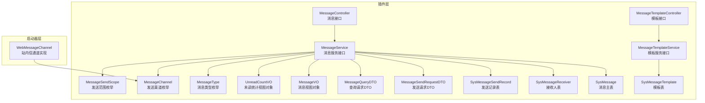
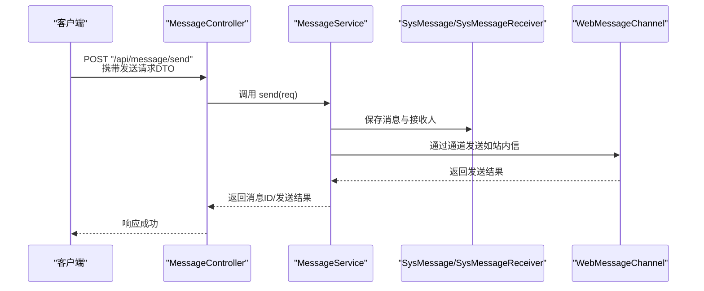
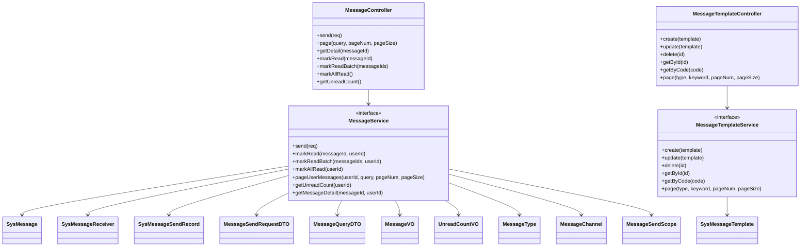

# 消息通知接口

<cite>
**本文引用的文件**
- [MessageController.java](file://forge/forge-framework/forge-plugin-parent/forge-plugin-message/src/main/java/com/mdframe/forge/plugin/message/controller/MessageController.java)
- [MessageTemplateController.java](file://forge/forge-framework/forge-plugin-parent/forge-plugin-message/src/main/java/com/mdframe/forge/plugin/message/controller/MessageTemplateController.java)
- [MessageService.java](file://forge/forge-framework/forge-plugin-parent/forge-plugin-message/src/main/java/com/mdframe/forge/plugin/message/service/MessageService.java)
- [MessageTemplateService.java](file://forge/forge-framework/forge-plugin-parent/forge-plugin-message/src/main/java/com/mdframe/forge/plugin/message/service/MessageTemplateService.java)
- [SysMessage.java](file://forge/forge-framework/forge-plugin-parent/forge-plugin-message/src/main/java/com/mdframe/forge/plugin/message/domain/entity/SysMessage.java)
- [SysMessageTemplate.java](file://forge/forge-framework/forge-plugin-parent/forge-plugin-message/src/main/java/com/mdframe/forge/plugin/message/domain/entity/SysMessageTemplate.java)
- [SysMessageReceiver.java](file://forge/forge-framework/forge-plugin-parent/forge-plugin-message/src/main/java/com/mdframe/forge/plugin/message/domain/entity/SysMessageReceiver.java)
- [SysMessageSendRecord.java](file://forge/forge-framework/forge-plugin-parent/forge-plugin-message/src/main/java/com/mdframe/forge/plugin/message/domain/entity/SysMessageSendRecord.java)
- [MessageSendRequestDTO.java](file://forge/forge-framework/forge-plugin-parent/forge-plugin-message/src/main/java/com/mdframe/forge/plugin/message/domain/dto/MessageSendRequestDTO.java)
- [MessageQueryDTO.java](file://forge/forge-framework/forge-plugin-parent/forge-plugin-message/src/main/java/com/mdframe/forge/plugin/message/domain/dto/MessageQueryDTO.java)
- [MessageVO.java](file://forge/forge-framework/forge-plugin-parent/forge-plugin-message/src/main/java/com/mdframe/forge/plugin/message/domain/vo/MessageVO.java)
- [UnreadCountVO.java](file://forge/forge-framework/forge-plugin-parent/forge-plugin-message/src/main/java/com/mdframe/forge/plugin/message/domain/vo/UnreadCountVO.java)
- [MessageType.java](file://forge/forge-framework/forge-plugin-parent/forge-plugin-message/src/main/java/com/mdframe/forge/plugin/message/domain/MessageType.java)
- [MessageChannel.java](file://forge/forge-framework/forge-plugin-parent/forge-plugin-message/src/main/java/com/mdframe/forge/plugin/message/domain/MessageChannel.java)
- [MessageSendScope.java](file://forge/forge-framework/forge-plugin-parent/forge-plugin-message/src/main/java/com/mdframe/forge/plugin/message/domain/MessageSendScope.java)
- [WebMessageChannel.java](file://forge/forge-framework/forge-starter-parent/forge-starter-message/src/main/java/com/mdframe/forge/starter/message/channel/WebMessageChannel.java)
</cite>

## 目录
1. [简介](#简介)
2. [项目结构](#项目结构)
3. [核心组件](#核心组件)
4. [架构总览](#架构总览)
5. [详细组件分析](#详细组件分析)
6. [依赖关系分析](#依赖关系分析)
7. [性能与可靠性](#性能与可靠性)
8. [故障排查指南](#故障排查指南)
9. [结论](#结论)
10. [附录](#附录)

## 简介
本文件为消息通知模块的API接口文档，覆盖消息发送、消息查询、消息模板管理、接收人配置等核心能力。文档同时说明不同消息类型的发送方式（站内消息、短信、邮件、自定义），模板变量替换机制，发送策略与状态跟踪，并对WebSocket推送通道进行说明，帮助开发者快速集成与使用。

## 项目结构
消息通知模块位于插件工程中，采用“控制器-服务-领域模型-数据访问”的分层设计；同时在启动器工程中提供通用的消息通道抽象与实现（如站内信通道）。

**图表来源**
- [MessageController.java](file://forge/forge-framework/forge-plugin-parent/forge-plugin-message/src/main/java/com/mdframe/forge/plugin/message/controller/MessageController.java#L1-L94)
- [MessageTemplateController.java](file://forge/forge-framework/forge-plugin-parent/forge-plugin-message/src/main/java/com/mdframe/forge/plugin/message/controller/MessageTemplateController.java#L1-L83)
- [MessageService.java](file://forge/forge-framework/forge-plugin-parent/forge-plugin-message/src/main/java/com/mdframe/forge/plugin/message/service/MessageService.java#L1-L51)
- [MessageTemplateService.java](file://forge/forge-framework/forge-plugin-parent/forge-plugin-message/src/main/java/com/mdframe/forge/plugin/message/service/MessageTemplateService.java#L1-L41)
- [SysMessage.java](file://forge/forge-framework/forge-plugin-parent/forge-plugin-message/src/main/java/com/mdframe/forge/plugin/message/domain/entity/SysMessage.java#L1-L76)
- [SysMessageTemplate.java](file://forge/forge-framework/forge-plugin-parent/forge-plugin-message/src/main/java/com/mdframe/forge/plugin/message/domain/entity/SysMessageTemplate.java#L1-L71)
- [SysMessageReceiver.java](file://forge/forge-framework/forge-plugin-parent/forge-plugin-message/src/main/java/com/mdframe/forge/plugin/message/domain/entity/SysMessageReceiver.java#L1-L63)
- [SysMessageSendRecord.java](file://forge/forge-framework/forge-plugin-parent/forge-plugin-message/src/main/java/com/mdframe/forge/plugin/message/domain/entity/SysMessageSendRecord.java#L1-L83)
- [MessageSendRequestDTO.java](file://forge/forge-framework/forge-plugin-parent/forge-plugin-message/src/main/java/com/mdframe/forge/plugin/message/domain/dto/MessageSendRequestDTO.java#L1-L64)
- [MessageQueryDTO.java](file://forge/forge-framework/forge-plugin-parent/forge-plugin-message/src/main/java/com/mdframe/forge/plugin/message/domain/dto/MessageQueryDTO.java)
- [MessageVO.java](file://forge/forge-framework/forge-plugin-parent/forge-plugin-message/src/main/java/com/mdframe/forge/plugin/message/domain/vo/MessageVO.java)
- [UnreadCountVO.java](file://forge/forge-framework/forge-plugin-parent/forge-plugin-message/src/main/java/com/mdframe/forge/plugin/message/domain/vo/UnreadCountVO.java)
- [MessageType.java](file://forge/forge-framework/forge-plugin-parent/forge-plugin-message/src/main/java/com/mdframe/forge/plugin/message/domain/MessageType.java#L1-L39)
- [MessageChannel.java](file://forge/forge-framework/forge-plugin-parent/forge-plugin-message/src/main/java/com/mdframe/forge/plugin/message/domain/MessageChannel.java#L1-L39)
- [MessageSendScope.java](file://forge/forge-framework/forge-plugin-parent/forge-plugin-message/src/main/java/com/mdframe/forge/plugin/message/domain/MessageSendScope.java#L1-L34)
- [WebMessageChannel.java](file://forge/forge-framework/forge-starter-parent/forge-starter-message/src/main/java/com/mdframe/forge/starter/message/channel/WebMessageChannel.java#L1-L15)

**章节来源**
- [MessageController.java](file://forge/forge-framework/forge-plugin-parent/forge-plugin-message/src/main/java/com/mdframe/forge/plugin/message/controller/MessageController.java#L1-L94)
- [MessageTemplateController.java](file://forge/forge-framework/forge-plugin-parent/forge-plugin-message/src/main/java/com/mdframe/forge/plugin/message/controller/MessageTemplateController.java#L1-L83)

## 核心组件
- 控制器层
  - 消息接口控制器：提供消息发送、分页查询、详情查询、已读标记、未读统计等REST接口。
  - 模板接口控制器：提供模板的增删改查、按编码查询、分页查询等REST接口。
- 服务层
  - 消息服务接口：定义消息发送、已读标记、分页查询、未读统计、详情查询等方法。
  - 模板服务接口：定义模板的创建、更新、删除、查询等方法。
- 领域模型
  - 消息主表、模板表、接收人表、发送记录表，支撑消息生命周期与状态管理。
- 数据传输对象
  - 发送请求DTO、查询请求DTO、消息视图对象、未读统计视图对象。
- 枚举与通道
  - 消息类型、发送渠道、发送范围枚举；站内信通道实现。

**章节来源**
- [MessageService.java](file://forge/forge-framework/forge-plugin-parent/forge-plugin-message/src/main/java/com/mdframe/forge/plugin/message/service/MessageService.java#L1-L51)
- [MessageTemplateService.java](file://forge/forge-framework/forge-plugin-parent/forge-plugin-message/src/main/java/com/mdframe/forge/plugin/message/service/MessageTemplateService.java#L1-L41)
- [SysMessage.java](file://forge/forge-framework/forge-plugin-parent/forge-plugin-message/src/main/java/com/mdframe/forge/plugin/message/domain/entity/SysMessage.java#L1-L76)
- [SysMessageTemplate.java](file://forge/forge-framework/forge-plugin-parent/forge-plugin-message/src/main/java/com/mdframe/forge/plugin/message/domain/entity/SysMessageTemplate.java#L1-L71)
- [SysMessageReceiver.java](file://forge/forge-framework/forge-plugin-parent/forge-plugin-message/src/main/java/com/mdframe/forge/plugin/message/domain/entity/SysMessageReceiver.java#L1-L63)
- [SysMessageSendRecord.java](file://forge/forge-framework/forge-plugin-parent/forge-plugin-message/src/main/java/com/mdframe/forge/plugin/message/domain/entity/SysMessageSendRecord.java#L1-L83)
- [MessageSendRequestDTO.java](file://forge/forge-framework/forge-plugin-parent/forge-plugin-message/src/main/java/com/mdframe/forge/plugin/message/domain/dto/MessageSendRequestDTO.java#L1-L64)
- [MessageQueryDTO.java](file://forge/forge-framework/forge-plugin-parent/forge-plugin-message/src/main/java/com/mdframe/forge/plugin/message/domain/dto/MessageQueryDTO.java)
- [MessageVO.java](file://forge/forge-framework/forge-plugin-parent/forge-plugin-message/src/main/java/com/mdframe/forge/plugin/message/domain/vo/MessageVO.java)
- [UnreadCountVO.java](file://forge/forge-framework/forge-plugin-parent/forge-plugin-message/src/main/java/com/mdframe/forge/plugin/message/domain/vo/UnreadCountVO.java)
- [MessageType.java](file://forge/forge-framework/forge-plugin-parent/forge-plugin-message/src/main/java/com/mdframe/forge/plugin/message/domain/MessageType.java#L1-L39)
- [MessageChannel.java](file://forge/forge-framework/forge-plugin-parent/forge-plugin-message/src/main/java/com/mdframe/forge/plugin/message/domain/MessageChannel.java#L1-L39)
- [MessageSendScope.java](file://forge/forge-framework/forge-plugin-parent/forge-plugin-message/src/main/java/com/mdframe/forge/plugin/message/domain/MessageSendScope.java#L1-L34)
- [WebMessageChannel.java](file://forge/forge-framework/forge-starter-parent/forge-starter-message/src/main/java/com/mdframe/forge/starter/message/channel/WebMessageChannel.java#L1-L15)

## 架构总览
消息通知模块遵循清晰的分层架构：控制器负责HTTP请求处理与响应封装；服务层编排业务流程；领域模型承载数据与状态；通道抽象支持多渠道发送（如站内信）。下图展示消息发送的关键交互序列。

**图表来源**
- [MessageController.java](file://forge/forge-framework/forge-plugin-parent/forge-plugin-message/src/main/java/com/mdframe/forge/plugin/message/controller/MessageController.java#L33-L39)
- [MessageService.java](file://forge/forge-framework/forge-plugin-parent/forge-plugin-message/src/main/java/com/mdframe/forge/plugin/message/service/MessageService.java#L14-L50)
- [SysMessage.java](file://forge/forge-framework/forge-plugin-parent/forge-plugin-message/src/main/java/com/mdframe/forge/plugin/message/domain/entity/SysMessage.java#L14-L75)
- [SysMessageReceiver.java](file://forge/forge-framework/forge-plugin-parent/forge-plugin-message/src/main/java/com/mdframe/forge/plugin/message/domain/entity/SysMessageReceiver.java#L16-L62)
- [WebMessageChannel.java](file://forge/forge-framework/forge-starter-parent/forge-starter-message/src/main/java/com/mdframe/forge/starter/message/channel/WebMessageChannel.java#L5-L14)

## 详细组件分析

### 消息发送接口
- 接口定义
  - 方法：POST
  - 路径：/api/message/send
  - 请求体：发送请求DTO（标题、内容、模板编码、模板参数、接收人集合、发送范围、渠道、类型）
  - 响应：封装后的响应对象，包含发送结果
- 功能要点
  - 支持模板与非模板两种发送路径
  - 支持多种发送范围（全员、组织、指定人员）
  - 支持多种发送渠道（站内信、短信、邮件、推送）
  - 返回消息ID或发送结果标识
- 使用建议
  - 若使用模板，需提供模板编码与对应参数
  - 明确发送范围与渠道，避免无效投递
  - 对批量接收人场景，优先使用组织或全员范围以提升效率

**章节来源**
- [MessageController.java](file://forge/forge-framework/forge-plugin-parent/forge-plugin-message/src/main/java/com/mdframe/forge/plugin/message/controller/MessageController.java#L33-L39)
- [MessageSendRequestDTO.java](file://forge/forge-framework/forge-plugin-parent/forge-plugin-message/src/main/java/com/mdframe/forge/plugin/message/domain/dto/MessageSendRequestDTO.java#L11-L64)
- [MessageType.java](file://forge/forge-framework/forge-plugin-parent/forge-plugin-message/src/main/java/com/mdframe/forge/plugin/message/domain/MessageType.java#L8-L38)
- [MessageChannel.java](file://forge/forge-framework/forge-plugin-parent/forge-plugin-message/src/main/java/com/mdframe/forge/plugin/message/domain/MessageChannel.java#L8-L38)
- [MessageSendScope.java](file://forge/forge-framework/forge-plugin-parent/forge-plugin-message/src/main/java/com/mdframe/forge/plugin/message/domain/MessageSendScope.java#L8-L33)

### 消息查询接口
- 接口定义
  - 分页查询：POST /api/message/page（请求体：查询DTO；参数：pageNum、pageSize）
  - 详情查询：GET /api/message/{messageId}
  - 未读统计：GET /api/message/unread/count
- 功能要点
  - 仅允许查询当前登录用户的可见消息
  - 支持按条件筛选与分页
  - 提供未读计数，便于前端展示
- 使用建议
  - 在用户进入消息中心时调用未读统计
  - 列表分页查询时结合标题/类型/时间等维度过滤

**章节来源**
- [MessageController.java](file://forge/forge-framework/forge-plugin-parent/forge-plugin-message/src/main/java/com/mdframe/forge/plugin/message/controller/MessageController.java#L41-L92)
- [MessageQueryDTO.java](file://forge/forge-framework/forge-plugin-parent/forge-plugin-message/src/main/java/com/mdframe/forge/plugin/message/domain/dto/MessageQueryDTO.java)

### 消息模板管理接口
- 接口定义
  - 创建模板：POST /api/message/template
  - 更新模板：PUT /api/message/template
  - 删除模板：DELETE /api/message/template/{id}
  - 查询模板：GET /api/message/template/{id}
  - 按编码查询：GET /api/message/template/code/{templateCode}
  - 分页查询：GET /api/message/template/page?type&keyword&pageNum&pageSize
- 功能要点
  - 模板支持标题与内容模板，均支持${}变量占位符
  - 可设置默认发送渠道与启用状态
  - 支持按类型与关键词筛选
- 使用建议
  - 模板编码需全局唯一
  - 变量命名规范统一，避免渲染冲突
  - 启用状态与默认渠道需与业务场景匹配

**章节来源**
- [MessageTemplateController.java](file://forge/forge-framework/forge-plugin-parent/forge-plugin-message/src/main/java/com/mdframe/forge/plugin/message/controller/MessageTemplateController.java#L28-L81)
- [SysMessageTemplate.java](file://forge/forge-framework/forge-plugin-parent/forge-plugin-message/src/main/java/com/mdframe/forge/plugin/message/domain/entity/SysMessageTemplate.java#L16-L70)

### 接收人配置接口
- 接口定义
  - 当前模块未提供独立的“接收人配置”REST接口
  - 接收人信息通过消息发送接口的用户ID/组织ID集合传入
  - 系统内部维护接收人表，记录每位接收人的阅读状态与时间
- 功能要点
  - 支持按用户、组织、租户维度配置接收人
  - 记录阅读状态与时间，支持已读/未读统计
- 使用建议
  - 发送前明确接收人群，减少无效投递
  - 对组织级发送，建议配合组织树结构进行权限校验

**章节来源**
- [SysMessageReceiver.java](file://forge/forge-framework/forge-plugin-parent/forge-plugin-message/src/main/java/com/mdframe/forge/plugin/message/domain/entity/SysMessageReceiver.java#L16-L62)
- [MessageSendRequestDTO.java](file://forge/forge-framework/forge-plugin-parent/forge-plugin-message/src/main/java/com/mdframe/forge/plugin/message/domain/dto/MessageSendRequestDTO.java#L36-L47)

### 消息模板变量替换机制
- 模板结构
  - 标题模板与内容模板均支持${变量名}占位符
  - 模板参数以键值对形式传入，用于渲染最终消息
- 渲染流程
  - 解析模板字符串，将占位符替换为实际参数值
  - 生成最终标题与内容，再按渠道发送
- 注意事项
  - 参数键名需与模板一致
  - 对空值或缺失参数，需有兜底策略（如空字符串或占位符保留）

**章节来源**
- [SysMessageTemplate.java](file://forge/forge-framework/forge-plugin-parent/forge-plugin-message/src/main/java/com/mdframe/forge/plugin/message/domain/entity/SysMessageTemplate.java#L47-L54)
- [SysMessage.java](file://forge/forge-framework/forge-plugin-parent/forge-plugin-message/src/main/java/com/mdframe/forge/plugin/message/domain/entity/SysMessage.java#L73-L74)

### 发送策略与状态跟踪
- 发送策略
  - 渠道选择：根据消息类型与默认渠道决定发送方式（站内信、短信、邮件、推送）
  - 范围选择：全员、组织、指定人员三类范围，支持组合参数
  - 模板优先：若提供模板编码，则优先使用模板渲染
- 状态跟踪
  - 消息状态：草稿、已发送、发送失败
  - 发送记录：记录各渠道发送数量、成功/失败数、第三方外部ID与错误信息
  - 接收人阅读：记录已读/未读与阅读时间
- 重试机制
  - 当前接口未暴露显式重试参数；可结合发送记录状态与定时任务实现重试策略

**章节来源**
- [SysMessage.java](file://forge/forge-framework/forge-plugin-parent/forge-plugin-message/src/main/java/com/mdframe/forge/plugin/message/domain/entity/SysMessage.java#L50-L53)
- [SysMessageSendRecord.java](file://forge/forge-framework/forge-plugin-parent/forge-plugin-message/src/main/java/com/mdframe/forge/plugin/message/domain/entity/SysMessageSendRecord.java#L38-L70)
- [SysMessageReceiver.java](file://forge/forge-framework/forge-plugin-parent/forge-plugin-message/src/main/java/com/mdframe/forge/plugin/message/domain/entity/SysMessageReceiver.java#L47-L55)

### WebSocket推送与实时通信
- 站内信通道
  - 站内信通道实现提供发送入口，返回发送结果标识
  - 实际的WebSocket推送由插件模块完成，启动器层提供占位实现
- 实时通信建议
  - 建议在前端监听WebSocket主题，收到新消息后刷新未读计数与消息列表
  - 对高并发场景，建议结合消息去重与限流策略

**章节来源**
- [WebMessageChannel.java](file://forge/forge-framework/forge-starter-parent/forge-starter-message/src/main/java/com/mdframe/forge/starter/message/channel/WebMessageChannel.java#L5-L14)

## 依赖关系分析
消息模块的类关系与依赖如下所示：

**图表来源**
- [MessageController.java](file://forge/forge-framework/forge-plugin-parent/forge-plugin-message/src/main/java/com/mdframe/forge/plugin/message/controller/MessageController.java#L25-L93)
- [MessageTemplateController.java](file://forge/forge-framework/forge-plugin-parent/forge-plugin-message/src/main/java/com/mdframe/forge/plugin/message/controller/MessageTemplateController.java#L23-L82)
- [MessageService.java](file://forge/forge-framework/forge-plugin-parent/forge-plugin-message/src/main/java/com/mdframe/forge/plugin/message/service/MessageService.java#L14-L50)
- [MessageTemplateService.java](file://forge/forge-framework/forge-plugin-parent/forge-plugin-message/src/main/java/com/mdframe/forge/plugin/message/service/MessageTemplateService.java#L9-L40)
- [SysMessage.java](file://forge/forge-framework/forge-plugin-parent/forge-plugin-message/src/main/java/com/mdframe/forge/plugin/message/domain/entity/SysMessage.java#L15-L75)
- [SysMessageTemplate.java](file://forge/forge-framework/forge-plugin-parent/forge-plugin-message/src/main/java/com/mdframe/forge/plugin/message/domain/entity/SysMessageTemplate.java#L16-L70)
- [SysMessageReceiver.java](file://forge/forge-framework/forge-plugin-parent/forge-plugin-message/src/main/java/com/mdframe/forge/plugin/message/domain/entity/SysMessageReceiver.java#L17-L62)
- [SysMessageSendRecord.java](file://forge/forge-framework/forge-plugin-parent/forge-plugin-message/src/main/java/com/mdframe/forge/plugin/message/domain/entity/SysMessageSendRecord.java#L16-L82)
- [MessageSendRequestDTO.java](file://forge/forge-framework/forge-plugin-parent/forge-plugin-message/src/main/java/com/mdframe/forge/plugin/message/domain/dto/MessageSendRequestDTO.java#L12-L63)
- [MessageQueryDTO.java](file://forge/forge-framework/forge-plugin-parent/forge-plugin-message/src/main/java/com/mdframe/forge/plugin/message/domain/dto/MessageQueryDTO.java)
- [MessageVO.java](file://forge/forge-framework/forge-plugin-parent/forge-plugin-message/src/main/java/com/mdframe/forge/plugin/message/domain/vo/MessageVO.java)
- [UnreadCountVO.java](file://forge/forge-framework/forge-plugin-parent/forge-plugin-message/src/main/java/com/mdframe/forge/plugin/message/domain/vo/UnreadCountVO.java)
- [MessageType.java](file://forge/forge-framework/forge-plugin-parent/forge-plugin-message/src/main/java/com/mdframe/forge/plugin/message/domain/MessageType.java#L9-L38)
- [MessageChannel.java](file://forge/forge-framework/forge-plugin-parent/forge-plugin-message/src/main/java/com/mdframe/forge/plugin/message/domain/MessageChannel.java#L9-L38)
- [MessageSendScope.java](file://forge/forge-framework/forge-plugin-parent/forge-plugin-message/src/main/java/com/mdframe/forge/plugin/message/domain/MessageSendScope.java#L9-L33)

## 性能与可靠性
- 性能优化
  - 批量发送时优先使用组织或全员范围，减少多次调用
  - 模板渲染尽量避免复杂逻辑，参数传递保持简洁
  - 分页查询时合理设置页大小，避免一次性加载过多数据
- 可靠性保障
  - 发送记录表记录发送状态与错误信息，便于问题定位
  - 未读统计与阅读状态分离，降低并发写入冲突
  - 建议对高频接口增加缓存与限流策略

[本节为通用指导，无需列出具体文件来源]

## 故障排查指南
- 常见问题
  - 模板变量未生效：检查模板编码与参数键名是否一致
  - 未读统计不准确：确认阅读状态更新逻辑与用户会话一致性
  - 发送失败：查看发送记录表的错误信息字段，定位第三方渠道异常
- 定位步骤
  - 通过消息ID查询详情与发送记录，核对渠道与状态
  - 结合接收人表确认目标用户是否正确
  - 对站内信通道，确认WebSocket连接与主题订阅

**章节来源**
- [SysMessageSendRecord.java](file://forge/forge-framework/forge-plugin-parent/forge-plugin-message/src/main/java/com/mdframe/forge/plugin/message/domain/entity/SysMessageSendRecord.java#L63-L70)
- [SysMessageReceiver.java](file://forge/forge-framework/forge-plugin-parent/forge-plugin-message/src/main/java/com/mdframe/forge/plugin/message/domain/entity/SysMessageReceiver.java#L47-L55)

## 结论
消息通知模块提供了完整的消息发送、查询、模板管理与接收人配置能力，支持多类型、多渠道、多范围的消息投递，并具备完善的发送状态跟踪与未读统计。结合WebSocket通道，可实现站内消息的实时推送。开发者可基于本文档快速集成并扩展消息通知功能。

[本节为总结性内容，无需列出具体文件来源]

## 附录

### API清单与说明
- 消息发送
  - 方法：POST
  - 路径：/api/message/send
  - 请求体：发送请求DTO
  - 响应：封装后的响应对象
- 消息分页查询
  - 方法：POST
  - 路径：/api/message/page
  - 请求体：查询DTO；参数：pageNum、pageSize
  - 响应：分页结果
- 消息详情查询
  - 方法：GET
  - 路径：/api/message/{messageId}
  - 响应：消息详情
- 标记已读
  - 方法：POST
  - 路径：/api/message/{messageId}/read
  - 响应：空
- 批量已读
  - 方法：POST
  - 路径：/api/message/read/batch
  - 请求体：消息ID列表
  - 响应：空
- 全部已读
  - 方法：POST
  - 路径：/api/message/read/all
  - 响应：空
- 未读统计
  - 方法：GET
  - 路径：/api/message/unread/count
  - 响应：未读计数

- 模板管理
  - 创建模板：POST /api/message/template
  - 更新模板：PUT /api/message/template
  - 删除模板：DELETE /api/message/template/{id}
  - 查询模板：GET /api/message/template/{id}
  - 按编码查询：GET /api/message/template/code/{templateCode}
  - 分页查询：GET /api/message/template/page?type&keyword&pageNum&pageSize

**章节来源**
- [MessageController.java](file://forge/forge-framework/forge-plugin-parent/forge-plugin-message/src/main/java/com/mdframe/forge/plugin/message/controller/MessageController.java#L33-L92)
- [MessageTemplateController.java](file://forge/forge-framework/forge-plugin-parent/forge-plugin-message/src/main/java/com/mdframe/forge/plugin/message/controller/MessageTemplateController.java#L29-L81)