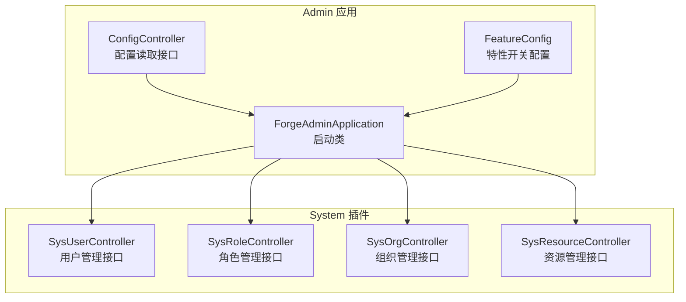
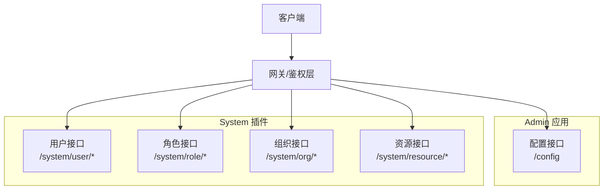
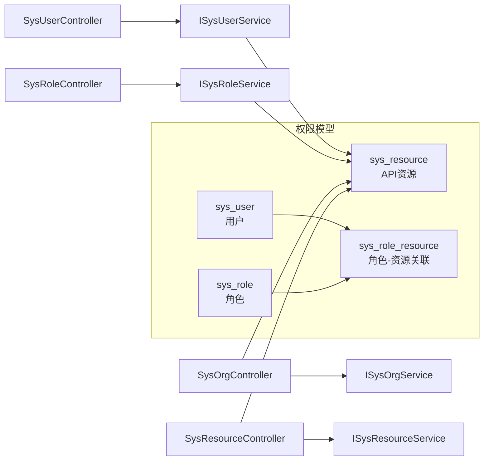

# 系统管理接口

<cite>
**本文引用的文件**
- [ConfigController.java](file://forge/forge-admin/src/main/java/com/mdframe/forge/admin/ConfigController.java)
- [FeatureConfig.java](file://forge/forge-admin/src/main/java/com/mdframe/forge/admin/FeatureConfig.java)
- [ForgeAdminApplication.java](file://forge/forge-admin/src/main/java/com/mdframe/forge/admin/ForgeAdminApplication.java)
- [SysUserController.java](file://forge/forge-framework/forge-plugin-parent/forge-plugin-system/src/main/java/com/mdframe/forge/plugin/system/controller/SysUserController.java)
- [SysRoleController.java](file://forge/forge-framework/forge-plugin-parent/forge-plugin-system/src/main/java/com/mdframe/forge/plugin/system/controller/SysRoleController.java)
- [SysOrgController.java](file://forge/forge-framework/forge-plugin-parent/forge-plugin-system/src/main/java/com/mdframe/forge/plugin/system/controller/SysOrgController.java)
- [SysResourceController.java](file://forge/forge-framework/forge-plugin-parent/forge-plugin-system/src/main/java/com/mdframe/forge/plugin/system/controller/SysResourceController.java)
- [api_resources_example.sql](file://forge/forge-admin/src/main/resources/sql/api_resources_example.sql)
- [api_config_menu.sql](file://forge/forge-admin/sql/api_config_menu.sql)
- [test_auth_data.sql](file://forge/forge-admin/src/main/resources/sql/test_auth_data.sql)
</cite>

## 目录
1. [简介](#简介)
2. [项目结构](#项目结构)
3. [核心组件](#核心组件)
4. [架构总览](#架构总览)
5. [详细组件分析](#详细组件分析)
6. [依赖分析](#依赖分析)
7. [性能考虑](#性能考虑)
8. [故障排查指南](#故障排查指南)
9. [结论](#结论)
10. [附录](#附录)

## 简介
本文件为系统管理模块的API接口文档，覆盖用户管理、角色管理、组织架构、资源管理和配置管理等核心功能。文档详细说明每个接口的HTTP方法、URL路径、请求参数、响应格式与错误码，并结合仓库中的权限配置示例，解释认证与权限控制机制。开发者可据此准确理解并使用系统管理相关的所有API。

## 项目结构
系统管理模块由后端Admin应用与System插件共同组成：
- Admin应用负责启动、配置与部分通用能力（如配置读取）。
- System插件提供系统管理领域的业务接口（用户、角色、组织、资源等）。

图表来源
- [ForgeAdminApplication.java](file://forge/forge-admin/src/main/java/com/mdframe/forge/admin/ForgeAdminApplication.java#L8-L15)
- [ConfigController.java](file://forge/forge-admin/src/main/java/com/mdframe/forge/admin/ConfigController.java#L12-L36)
- [FeatureConfig.java](file://forge/forge-admin/src/main/java/com/mdframe/forge/admin/FeatureConfig.java#L10-L17)
- [SysUserController.java](file://forge/forge-framework/forge-plugin-parent/forge-plugin-system/src/main/java/com/mdframe/forge/plugin/system/controller/SysUserController.java#L21-L180)
- [SysRoleController.java](file://forge/forge-framework/forge-plugin-parent/forge-plugin-system/src/main/java/com/mdframe/forge/plugin/system/controller/SysRoleController.java#L20-L110)
- [SysOrgController.java](file://forge/forge-framework/forge-plugin-parent/forge-plugin-system/src/main/java/com/mdframe/forge/plugin/system/controller/SysOrgController.java#L18-L83)
- [SysResourceController.java](file://forge/forge-framework/forge-plugin-parent/forge-plugin-system/src/main/java/com/mdframe/forge/plugin/system/controller/SysResourceController.java#L20-L116)

章节来源
- [ForgeAdminApplication.java](file://forge/forge-admin/src/main/java/com/mdframe/forge/admin/ForgeAdminApplication.java#L8-L15)
- [ConfigController.java](file://forge/forge-admin/src/main/java/com/mdframe/forge/admin/ConfigController.java#L12-L36)
- [FeatureConfig.java](file://forge/forge-admin/src/main/java/com/mdframe/forge/admin/FeatureConfig.java#L10-L17)
- [SysUserController.java](file://forge/forge-framework/forge-plugin-parent/forge-plugin-system/src/main/java/com/mdframe/forge/plugin/system/controller/SysUserController.java#L21-L180)
- [SysRoleController.java](file://forge/forge-framework/forge-plugin-parent/forge-plugin-system/src/main/java/com/mdframe/forge/plugin/system/controller/SysRoleController.java#L20-L110)
- [SysOrgController.java](file://forge/forge-framework/forge-plugin-parent/forge-plugin-system/src/main/java/com/mdframe/forge/plugin/system/controller/SysOrgController.java#L18-L83)
- [SysResourceController.java](file://forge/forge-framework/forge-plugin-parent/forge-plugin-system/src/main/java/com/mdframe/forge/plugin/system/controller/SysResourceController.java#L20-L116)

## 核心组件
- Admin应用启动器：扫描基础包、启用MyBatis Mapper扫描与AOP代理。
- 配置控制器：提供配置读取接口，便于查看运行时配置。
- 特性开关配置：基于属性条件加载特性配置。
- 系统管理控制器：提供用户、角色、组织、资源管理的REST接口。

章节来源
- [ForgeAdminApplication.java](file://forge/forge-admin/src/main/java/com/mdframe/forge/admin/ForgeAdminApplication.java#L8-L15)
- [ConfigController.java](file://forge/forge-admin/src/main/java/com/mdframe/forge/admin/ConfigController.java#L12-L36)
- [FeatureConfig.java](file://forge/forge-admin/src/main/java/com/mdframe/forge/admin/FeatureConfig.java#L10-L17)
- [SysUserController.java](file://forge/forge-framework/forge-plugin-parent/forge-plugin-system/src/main/java/com/mdframe/forge/plugin/system/controller/SysUserController.java#L21-L180)
- [SysRoleController.java](file://forge/forge-framework/forge-plugin-parent/forge-plugin-system/src/main/java/com/mdframe/forge/plugin/system/controller/SysRoleController.java#L20-L110)
- [SysOrgController.java](file://forge/forge-framework/forge-plugin-parent/forge-plugin-system/src/main/java/com/mdframe/forge/plugin/system/controller/SysOrgController.java#L18-L83)
- [SysResourceController.java](file://forge/forge-framework/forge-plugin-parent/forge-plugin-system/src/main/java/com/mdframe/forge/plugin/system/controller/SysResourceController.java#L20-L116)

## 架构总览
系统采用“Admin应用 + System插件”的分层架构，Admin应用负责启动与配置，System插件提供具体业务接口。接口统一返回封装的响应对象，便于前端处理。

图表来源
- [SysUserController.java](file://forge/forge-framework/forge-plugin-parent/forge-plugin-system/src/main/java/com/mdframe/forge/plugin/system/controller/SysUserController.java#L21-L180)
- [SysRoleController.java](file://forge/forge-framework/forge-plugin-parent/forge-plugin-system/src/main/java/com/mdframe/forge/plugin/system/controller/SysRoleController.java#L20-L110)
- [SysOrgController.java](file://forge/forge-framework/forge-plugin-parent/forge-plugin-system/src/main/java/com/mdframe/forge/plugin/system/controller/SysOrgController.java#L18-L83)
- [SysResourceController.java](file://forge/forge-framework/forge-plugin-parent/forge-plugin-system/src/main/java/com/mdframe/forge/plugin/system/controller/SysResourceController.java#L20-L116)
- [ConfigController.java](file://forge/forge-admin/src/main/java/com/mdframe/forge/admin/ConfigController.java#L30-L36)

## 详细组件分析

### 用户管理接口
- 接口范围：/system/user/*
- 支持功能：分页查询、详情查询、新增、编辑、删除、批量删除、绑定/解绑角色、绑定/解绑组织、批量绑定组织、重置密码、更新状态、更新资料、查询用户角色ID列表、查询用户组织ID列表。

请求与响应约定
- 统一响应：成功返回包含数据的对象；失败返回包含错误信息的对象。
- 加解密注解：接口标注了加解密注解，请求体与响应体可能经过加解密处理。
- 权限忽略：接口标注了权限忽略注解，通常由上层鉴权或业务逻辑控制。

接口清单
- GET /system/user/page
  - 功能：分页查询用户列表
  - 请求参数：分页查询参数（见查询DTO定义）
  - 响应：分页结果
  - 错误码：无特定业务错误码时，遵循统一响应
- POST /system/user/getById
  - 功能：根据ID查询用户详情
  - 请求参数：id（Long）
  - 响应：用户对象
- POST /system/user/add
  - 功能：新增用户
  - 请求参数：用户创建DTO
  - 响应：空结果或统一响应
- POST /system/user/edit
  - 功能：编辑用户信息
  - 请求参数：用户更新DTO
  - 响应：统一响应
- POST /system/user/remove
  - 功能：删除用户
  - 请求参数：id（Long）
  - 响应：统一响应
- POST /system/user/removeBatch
  - 功能：批量删除用户
  - 请求参数：id数组（Long[]）
  - 响应：统一响应
- POST /system/user/{userId}/roles
  - 功能：给用户绑定角色
  - 请求参数：userId（路径变量），roleIds（Long[]）
  - 响应：统一响应
- POST /system/user/{userId}/roles/unbind
  - 功能：解除用户角色
  - 请求参数：userId（路径变量），roleIds（Long[]）
  - 响应：统一响应
- POST /system/user/{userId}/org
  - 功能：给用户绑定组织（可指定主组织）
  - 请求参数：userId（路径变量），orgId（Long），isMain（Integer，默认0）
  - 响应：统一响应
- POST /system/user/{userId}/org/unbind
  - 功能：解除用户组织
  - 请求参数：userId（路径变量），orgId（Long）
  - 响应：统一响应
- GET /system/user/{userId}/roles
  - 功能：查询用户的角色ID列表
  - 请求参数：userId（路径变量）
  - 响应：角色ID列表
- GET /system/user/{userId}/orgs
  - 功能：查询用户的组织ID列表
  - 请求参数：userId（路径变量）
  - 响应：组织ID列表
- POST /system/user/{userId}/orgs
  - 功能：批量绑定用户组织
  - 请求参数：userId（路径变量），组织绑定DTO（包含orgIds与主组织ID）
  - 响应：统一响应
- POST /system/user/resetPwd
  - 功能：重置用户密码
  - 请求参数：id（Long），password（String）
  - 响应：统一响应
- POST /system/user/updateStatus
  - 功能：更新用户状态
  - 请求参数：id（Long），status（Integer）
  - 响应：统一响应
- POST /system/user/updateProfile
  - 功能：更新用户资料
  - 请求参数：用户资料DTO
  - 响应：统一响应

章节来源
- [SysUserController.java](file://forge/forge-framework/forge-plugin-parent/forge-plugin-system/src/main/java/com/mdframe/forge/plugin/system/controller/SysUserController.java#L34-L179)

### 角色管理接口
- 接口范围：/system/role/*
- 支持功能：分页查询、详情查询、新增、编辑、删除、批量删除、绑定/解绑资源、查询角色资源ID列表。

接口清单
- GET /system/role/page
  - 功能：分页查询角色列表
  - 请求参数：分页查询参数（见查询DTO定义）
  - 响应：分页结果
- POST /system/role/getById
  - 功能：根据ID查询角色详情
  - 请求参数：id（Long）
  - 响应：角色对象
- POST /system/role/add
  - 功能：新增角色
  - 请求参数：角色创建DTO
  - 响应：统一响应
- POST /system/role/edit
  - 功能：编辑角色信息
  - 请求参数：角色更新DTO
  - 响应：统一响应
- POST /system/role/remove
  - 功能：删除角色
  - 请求参数：id（Long）
  - 响应：统一响应
- POST /system/role/removeBatch
  - 功能：批量删除角色
  - 请求参数：id数组（Long[]）
  - 响应：统一响应
- POST /system/role/{roleId}/resources
  - 功能：给角色绑定资源（菜单/按钮/接口）
  - 请求参数：roleId（路径变量），resourceIds（Long[]）
  - 响应：统一响应
- POST /system/role/{roleId}/resources/unbind
  - 功能：解除角色资源
  - 请求参数：roleId（路径变量），resourceIds（Long[]）
  - 响应：统一响应
- GET /system/role/{roleId}/resources
  - 功能：查询角色的资源ID列表
  - 请求参数：roleId（路径变量）
  - 响应：资源ID列表

章节来源
- [SysRoleController.java](file://forge/forge-framework/forge-plugin-parent/forge-plugin-system/src/main/java/com/mdframe/forge/plugin/system/controller/SysRoleController.java#L33-L109)

### 组织管理接口
- 接口范围：/system/org/*
- 支持功能：分页查询、组织树查询、详情查询、新增、编辑、删除。

接口清单
- GET /system/org/page
  - 功能：分页查询组织列表
  - 请求参数：分页查询参数（见查询DTO定义）
  - 响应：分页结果
- GET /system/org/tree
  - 功能：查询组织树形列表
  - 请求参数：查询条件（见查询DTO定义）
  - 响应：树形组织列表
- POST /system/org/getById
  - 功能：根据ID查询组织详情
  - 请求参数：id（Long）
  - 响应：组织对象
- POST /system/org/add
  - 功能：新增组织
  - 请求参数：组织创建DTO
  - 响应：统一响应
- POST /system/org/edit
  - 功能：编辑组织信息
  - 请求参数：组织更新DTO
  - 响应：统一响应
- POST /system/org/remove
  - 功能：删除组织
  - 请求参数：id（Long）
  - 响应：统一响应

章节来源
- [SysOrgController.java](file://forge/forge-framework/forge-plugin-parent/forge-plugin-system/src/main/java/com/mdframe/forge/plugin/system/controller/SysOrgController.java#L33-L81)

### 资源管理接口
- 接口范围：/system/resource/*
- 支持功能：分页查询、资源树查询、详情查询、新增、编辑、删除、当前用户资源树、当前用户菜单树、当前用户权限列表。

接口清单
- GET /system/resource/page
  - 功能：分页查询资源列表
  - 请求参数：分页查询参数（见查询DTO定义）
  - 响应：分页结果
- GET /system/resource/tree
  - 功能：查询资源树形列表
  - 请求参数：查询条件（见查询DTO定义）
  - 响应：树形资源列表
- POST /system/resource/getById
  - 功能：根据ID查询资源详情
  - 请求参数：id（Long）
  - 响应：资源对象
- POST /system/resource/add
  - 功能：新增资源
  - 请求参数：资源创建DTO
  - 响应：统一响应（含操作日志）
- POST /system/resource/edit
  - 功能：编辑资源信息
  - 请求参数：资源更新DTO
  - 响应：统一响应
- POST /system/resource/remove
  - 功能：删除资源
  - 请求参数：id（Long）
  - 响应：统一响应
- GET /system/resource/current/tree
  - 功能：查询当前用户资源树（包含菜单和按钮权限）
  - 请求参数：无
  - 响应：资源树视图对象列表
- GET /system/resource/current/menu
  - 功能：查询当前用户菜单树（仅目录和菜单，不含按钮）
  - 请求参数：无
  - 响应：菜单树视图对象列表
- GET /system/resource/current/permissions
  - 功能：查询当前用户权限标识列表（按钮权限）
  - 请求参数：无
  - 响应：权限标识字符串列表

章节来源
- [SysResourceController.java](file://forge/forge-framework/forge-plugin-parent/forge-plugin-system/src/main/java/com/mdframe/forge/plugin/system/controller/SysResourceController.java#L36-L115)

### 配置管理接口
- 接口范围：/config
- 支持功能：读取运行时配置信息（示例接口）

接口清单
- GET /config
  - 功能：读取配置信息
  - 请求参数：无
  - 响应：配置信息字符串（示例）
  - 认证：该接口标注忽略鉴权（可用于健康检查或公开信息读取）

章节来源
- [ConfigController.java](file://forge/forge-admin/src/main/java/com/mdframe/forge/admin/ConfigController.java#L30-L36)

## 依赖分析
- 控制器依赖服务层接口，服务层再依赖数据访问层（Mapper/DAO），形成清晰的分层依赖。
- 权限控制通过资源与角色关联实现，支持通配符路径匹配。
- 鉴权与权限控制在上层网关或拦截器完成，控制器层通过注解忽略权限校验，便于系统内部调用或特殊场景。

图表来源
- [SysUserController.java](file://forge/forge-framework/forge-plugin-parent/forge-plugin-system/src/main/java/com/mdframe/forge/plugin/system/controller/SysUserController.java#L29-L29)
- [SysRoleController.java](file://forge/forge-framework/forge-plugin-parent/forge-plugin-system/src/main/java/com/mdframe/forge/plugin/system/controller/SysRoleController.java#L28-L28)
- [SysOrgController.java](file://forge/forge-framework/forge-plugin-parent/forge-plugin-system/src/main/java/com/mdframe/forge/plugin/system/controller/SysOrgController.java#L28-L28)
- [SysResourceController.java](file://forge/forge-framework/forge-plugin-parent/forge-plugin-system/src/main/java/com/mdframe/forge/plugin/system/controller/SysResourceController.java#L31-L31)
- [api_resources_example.sql](file://forge/forge-admin/src/main/resources/sql/api_resources_example.sql#L14-L43)
- [test_auth_data.sql](file://forge/forge-admin/src/main/resources/sql/test_auth_data.sql#L93-L122)

章节来源
- [SysUserController.java](file://forge/forge-framework/forge-plugin-parent/forge-plugin-system/src/main/java/com/mdframe/forge/plugin/system/controller/SysUserController.java#L29-L29)
- [SysRoleController.java](file://forge/forge-framework/forge-plugin-parent/forge-plugin-system/src/main/java/com/mdframe/forge/plugin/system/controller/SysRoleController.java#L28-L28)
- [SysOrgController.java](file://forge/forge-framework/forge-plugin-parent/forge-plugin-system/src/main/java/com/mdframe/forge/plugin/system/controller/SysOrgController.java#L28-L28)
- [SysResourceController.java](file://forge/forge-framework/forge-plugin-parent/forge-plugin-system/src/main/java/com/mdframe/forge/plugin/system/controller/SysResourceController.java#L31-L31)
- [api_resources_example.sql](file://forge/forge-admin/src/main/resources/sql/api_resources_example.sql#L14-L43)
- [test_auth_data.sql](file://forge/forge-admin/src/main/resources/sql/test_auth_data.sql#L93-L122)

## 性能考虑
- 分页查询：建议对高频查询接口使用分页参数，避免一次性返回大量数据。
- 树形查询：组织树与资源树查询应限制层级深度与节点数量，必要时进行缓存。
- 批量操作：批量删除与批量绑定接口适合减少网络往返，但需注意事务边界与回滚策略。
- 加解密：接口启用了加解密注解，注意对大体量数据的加解密开销。

## 故障排查指南
- 统一响应格式：所有接口返回统一的响应对象，失败时包含错误信息。请优先检查响应中的错误描述。
- 权限问题：若出现403/401，请确认用户角色是否已绑定对应资源权限，或资源路径是否正确配置。
- 路径通配符：资源路径支持通配符（如/system/**、/system/user/*），请核对配置与实际请求路径是否匹配。
- 超级管理员：用户类型为特定值的用户自动拥有所有权限，可作为排障时的参考。

章节来源
- [api_resources_example.sql](file://forge/forge-admin/src/main/resources/sql/api_resources_example.sql#L57-L64)
- [test_auth_data.sql](file://forge/forge-admin/src/main/resources/sql/test_auth_data.sql#L153-L167)

## 结论
系统管理模块提供了完善的用户、角色、组织、资源与配置管理接口，配合资源-角色权限模型与通配符路径配置，可灵活实现细粒度的权限控制。建议在生产环境中结合鉴权网关与审计日志，确保接口安全与可追溯。

## 附录

### 权限控制与资源配置要点
- API资源配置：在资源表中配置API资源，设置资源类型为接口，填写支持通配符的URL路径。
- 角色绑定：通过角色-资源关联表将资源授权给角色。
- 超级管理员：特定用户类型自动拥有全部权限，便于系统维护与排障。

章节来源
- [api_resources_example.sql](file://forge/forge-admin/src/main/resources/sql/api_resources_example.sql#L14-L43)
- [api_resources_example.sql](file://forge/forge-admin/src/main/resources/sql/api_resources_example.sql#L57-L64)
- [test_auth_data.sql](file://forge/forge-admin/src/main/resources/sql/test_auth_data.sql#L93-L122)

### API配置管理菜单与权限
- 菜单与子权限：通过SQL脚本在资源表中插入菜单与API权限条目，并设置方法与URL。
- 自动注册：提供自动注册API配置的接口，便于动态生成资源条目。

章节来源
- [api_config_menu.sql](file://forge/forge-admin/sql/api_config_menu.sql#L52-L121)
- [api_config_menu.sql](file://forge/forge-admin/sql/api_config_menu.sql#L321-L352)