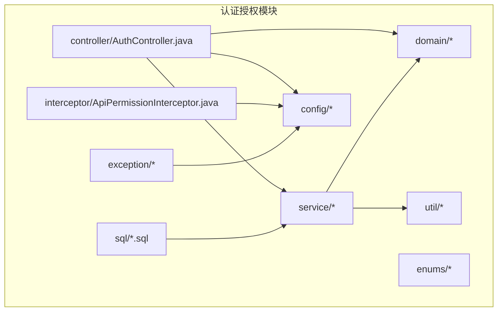
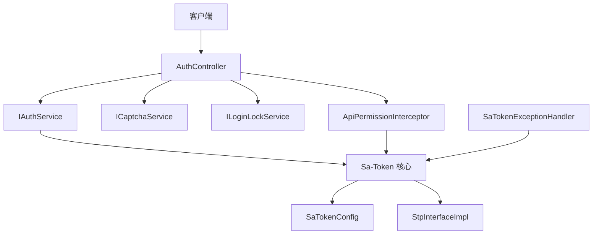
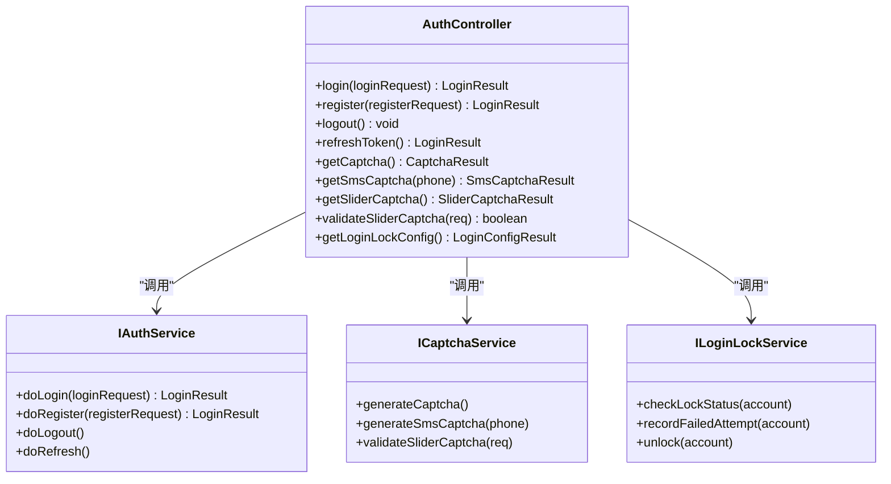
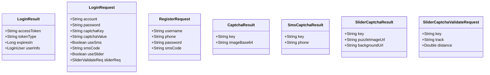
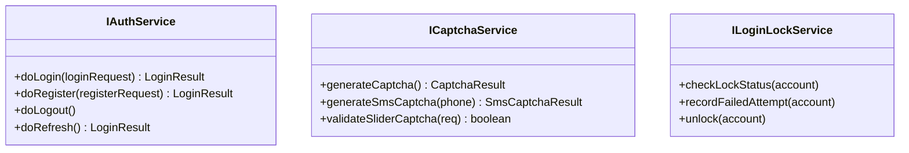
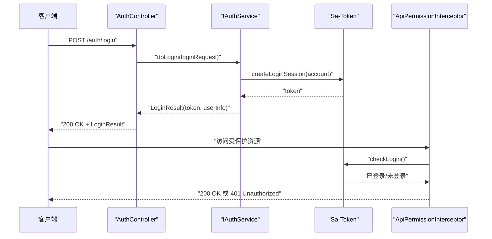
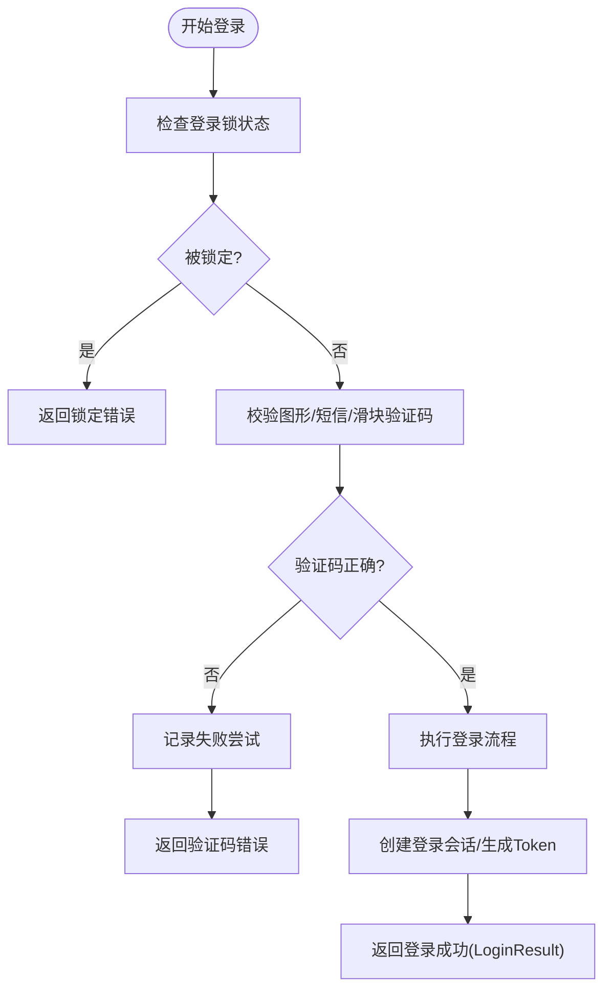
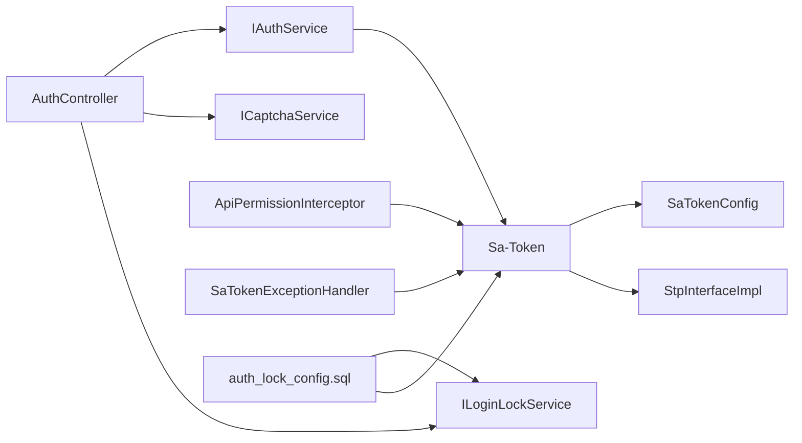

# 认证授权接口

<cite>
**本文引用的文件**
- [AuthController.java](file://forge/forge-framework/forge-starter-parent/forge-starter-auth/src/main/java/com/mdframe/forge/starter/auth/controller/AuthController.java)
- [LoginResult.java](file://forge/forge-framework/forge-starter-parent/forge-starter-auth/src/main/java/com/mdframe/forge/starter/auth/domain/LoginResult.java)
- [LoginRequest.java](file://forge/forge-framework/forge-starter-parent/forge-starter-auth/src/main/java/com/mdframe/forge/starter/auth/domain/LoginRequest.java)
- [RegisterRequest.java](file://forge/forge-framework/forge-starter-parent/forge-starter-auth/src/main/java/com/mdframe/forge/starter/auth/domain/RegisterRequest.java)
- [CaptchaResult.java](file://forge/forge-framework/forge-starter-parent/forge-starter-auth/src/main/java/com/mdframe/forge/starter/auth/domain/CaptchaResult.java)
- [SmsCaptchaResult.java](file://forge/forge-framework/forge-starter-parent/forge-starter-auth/src/main/java/com/mdframe/forge/starter/auth/domain/SmsCaptchaResult.java)
- [SliderCaptchaResult.java](file://forge/forge-framework/forge-starter-parent/forge-starter-auth/src/main/java/com/mdframe/forge/starter/auth/domain/SliderCaptchaResult.java)
- [SliderCaptchaValidateRequest.java](file://forge/forge-framework/forge-starter-parent/forge-starter-auth/src/main/java/com/mdframe/forge/starter/auth/domain/SliderCaptchaValidateRequest.java)
- [SaTokenConfig.java](file://forge/forge-framework/forge-starter-parent/forge-starter-auth/src/main/java/com/mdframe/forge/starter/auth/config/SaTokenConfig.java)
- [StpInterfaceImpl.java](file://forge/forge-framework/forge-starter-parent/forge-starter-auth/src/main/java/com/mdframe/forge/starter/auth/config/StpInterfaceImpl.java)
- [IAuthService.java](file://forge/forge-framework/forge-starter-parent/forge-starter-auth/src/main/java/com/mdframe/forge/starter/auth/service/IAuthService.java)
- [ICaptchaService.java](file://forge/forge-framework/forge-starter-parent/forge-starter-auth/src/main/java/com/mdframe/forge/starter/auth/service/ICaptchaService.java)
- [ILoginLockService.java](file://forge/forge-framework/forge-starter-parent/forge-starter-auth/src/main/java/com/mdframe/forge/starter/auth/service/ILoginLockService.java)
- [ApiPermissionInterceptor.java](file://forge/forge-framework/forge-starter-parent/forge-starter-auth/src/main/java/com/mdframe/forge/starter/auth/interceptor/ApiPermissionInterceptor.java)
- [auth_lock_config.sql](file://forge/forge-framework/forge-starter-parent/forge-starter-auth/sql/auth_lock_config.sql)
- [auth_online_user.sql](file://forge/forge-framework/forge-starter-parent/forge-starter-auth/sql/auth_online_user.sql)
- [online_user_menu.sql](file://forge/forge-framework/forge-starter-parent/forge-starter-auth/sql/online_user_menu.sql)
- [PasswordUtil.java](file://forge/forge-framework/forge-starter-parent/forge-starter-auth/src/main/java/com/mdframe/forge/starter/auth/util/PasswordUtil.java)
- [PathMatcher.java](file://forge/forge-framework/forge-starter-parent/forge-starter-auth/src/main/java/com/mdframe/forge/starter/auth/util/PathMatcher.java)
- [AccountLockedException.java](file://forge/forge-framework/forge-starter-parent/forge-starter-auth/src/main/java/com/mdframe/forge/starter/auth/exception/AccountLockedException.java)
- [SaTokenExceptionHandler.java](file://forge/forge-framework/forge-starter-parent/forge-starter-auth/src/main/java/com/mdframe/forge/starter/auth/exception/SaTokenExceptionHandler.java)
- [AuthType.java](file://forge/forge-framework/forge-starter-parent/forge-starter-auth/src/main/java/com/mdframe/forge/starter/auth/enums/AuthType.java)
</cite>

## 目录
1. [简介](#简介)
2. [项目结构](#项目结构)
3. [核心组件](#核心组件)
4. [架构总览](#架构总览)
5. [详细组件分析](#详细组件分析)
6. [依赖关系分析](#依赖关系分析)
7. [性能考虑](#性能考虑)
8. [故障排除指南](#故障排除指南)
9. [结论](#结论)
10. [附录](#附录)

## 简介
本文件面向开发者，系统化梳理认证授权模块的API接口与实现机制，覆盖用户登录、注册、权限验证、Token管理、登录锁、验证码与滑块验证等核心能力。文档基于实际源码进行分析，提供从登录到权限验证的完整流程说明，并解释Sa-Token框架的集成方式、JWT令牌生成与验证机制、权限控制策略以及异常处理与拦截器设计。

## 项目结构
认证授权模块位于 forge/forge-framework/forge-starter-parent/forge-starter-auth 目录下，采用按职责分层的组织方式：
- controller：对外暴露认证相关HTTP接口
- domain：数据传输对象（DTO）与领域模型
- config：框架配置与鉴权扩展点
- service：业务服务接口与实现
- interceptor：API权限拦截器
- exception：异常定义与全局异常处理器
- util：工具类
- enums：枚举类型
- sql：数据库初始化脚本

图表来源
- [AuthController.java](file://forge/forge-framework/forge-starter-parent/forge-starter-auth/src/main/java/com/mdframe/forge/starter/auth/controller/AuthController.java#L1-L200)
- [IAuthService.java](file://forge/forge-framework/forge-starter-parent/forge-starter-auth/src/main/java/com/mdframe/forge/starter/auth/service/IAuthService.java#L1-L200)
- [SaTokenConfig.java](file://forge/forge-framework/forge-starter-parent/forge-starter-auth/src/main/java/com/mdframe/forge/starter/auth/config/SaTokenConfig.java#L1-L200)

章节来源
- [AuthController.java](file://forge/forge-framework/forge-starter-parent/forge-starter-auth/src/main/java/com/mdframe/forge/starter/auth/controller/AuthController.java#L1-L200)
- [IAuthService.java](file://forge/forge-framework/forge-starter-parent/forge-starter-auth/src/main/java/com/mdframe/forge/starter/auth/service/IAuthService.java#L1-L200)
- [SaTokenConfig.java](file://forge/forge-framework/forge-starter-parent/forge-starter-auth/src/main/java/com/mdframe/forge/starter/auth/config/SaTokenConfig.java#L1-L200)

## 核心组件
- 控制器：对外提供登录、注册、登出、刷新Token、获取验证码、滑块验证、登录锁配置等接口
- 领域模型：LoginRequest、RegisterRequest、LoginResult、CaptchaResult、SmsCaptchaResult、SliderCaptchaResult、SliderCaptchaValidateRequest 等
- 服务层：IAuthService、ICaptchaService、ILoginLockService
- 框架集成：Sa-Token配置、自定义StpInterface实现
- 权限拦截：ApiPermissionInterceptor
- 异常处理：AccountLockedException、SaTokenExceptionHandler
- 工具类：PasswordUtil、PathMatcher
- 枚举：AuthType

章节来源
- [LoginResult.java](file://forge/forge-framework/forge-starter-parent/forge-starter-auth/src/main/java/com/mdframe/forge/starter/auth/domain/LoginResult.java#L1-L41)
- [LoginRequest.java](file://forge/forge-framework/forge-starter-parent/forge-starter-auth/src/main/java/com/mdframe/forge/starter/auth/domain/LoginRequest.java#L1-L200)
- [RegisterRequest.java](file://forge/forge-framework/forge-starter-parent/forge-starter-auth/src/main/java/com/mdframe/forge/starter/auth/domain/RegisterRequest.java#L1-L200)
- [CaptchaResult.java](file://forge/forge-framework/forge-starter-parent/forge-starter-auth/src/main/java/com/mdframe/forge/starter/auth/domain/CaptchaResult.java#L1-L200)
- [SmsCaptchaResult.java](file://forge/forge-framework/forge-starter-parent/forge-starter-auth/src/main/java/com/mdframe/forge/starter/auth/domain/SmsCaptchaResult.java#L1-L200)
- [SliderCaptchaResult.java](file://forge/forge-framework/forge-starter-parent/forge-starter-auth/src/main/java/com/mdframe/forge/starter/auth/domain/SliderCaptchaResult.java#L1-L200)
- [SliderCaptchaValidateRequest.java](file://forge/forge-framework/forge-starter-parent/forge-starter-auth/src/main/java/com/mdframe/forge/starter/auth/domain/SliderCaptchaValidateRequest.java#L1-L200)

## 架构总览
认证授权模块围绕Sa-Token构建，通过控制器接收请求，调用服务层完成业务处理，结合配置类与拦截器实现统一的权限校验与异常处理。

图表来源
- [AuthController.java](file://forge/forge-framework/forge-starter-parent/forge-starter-auth/src/main/java/com/mdframe/forge/starter/auth/controller/AuthController.java#L1-L200)
- [IAuthService.java](file://forge/forge-framework/forge-starter-parent/forge-starter-auth/src/main/java/com/mdframe/forge/starter/auth/service/IAuthService.java#L1-L200)
- [ICaptchaService.java](file://forge/forge-framework/forge-starter-parent/forge-starter-auth/src/main/java/com/mdframe/forge/starter/auth/service/ICaptchaService.java#L1-L200)
- [ILoginLockService.java](file://forge/forge-framework/forge-starter-parent/forge-starter-auth/src/main/java/com/mdframe/forge/starter/auth/service/ILoginLockService.java#L1-L200)
- [SaTokenConfig.java](file://forge/forge-framework/forge-starter-parent/forge-starter-auth/src/main/java/com/mdframe/forge/starter/auth/config/SaTokenConfig.java#L1-L200)
- [StpInterfaceImpl.java](file://forge/forge-framework/forge-starter-parent/forge-starter-auth/src/main/java/com/mdframe/forge/starter/auth/config/StpInterfaceImpl.java#L1-L200)
- [ApiPermissionInterceptor.java](file://forge/forge-framework/forge-starter-parent/forge-starter-auth/src/main/java/com/mdframe/forge/starter/auth/interceptor/ApiPermissionInterceptor.java#L1-L200)
- [SaTokenExceptionHandler.java](file://forge/forge-framework/forge-starter-parent/forge-starter-auth/src/main/java/com/mdframe/forge/starter/auth/exception/SaTokenExceptionHandler.java#L1-L200)

## 详细组件分析

### 控制器：AuthController
- 职责：提供认证相关HTTP接口，包括登录、注册、登出、刷新Token、获取验证码、滑块验证、登录锁配置等
- 关键点：
  - 统一返回LoginResult封装访问令牌、令牌类型、过期时间与用户信息
  - 调用服务层完成业务逻辑，如验证码生成、滑块验证、登录锁判断等
  - 结合权限拦截器进行API访问控制

图表来源
- [AuthController.java](file://forge/forge-framework/forge-starter-parent/forge-starter-auth/src/main/java/com/mdframe/forge/starter/auth/controller/AuthController.java#L1-L200)
- [IAuthService.java](file://forge/forge-framework/forge-starter-parent/forge-starter-auth/src/main/java/com/mdframe/forge/starter/auth/service/IAuthService.java#L1-L200)
- [ICaptchaService.java](file://forge/forge-framework/forge-starter-parent/forge-starter-auth/src/main/java/com/mdframe/forge/starter/auth/service/ICaptchaService.java#L1-L200)
- [ILoginLockService.java](file://forge/forge-framework/forge-starter-parent/forge-starter-auth/src/main/java/com/mdframe/forge/starter/auth/service/ILoginLockService.java#L1-L200)

章节来源
- [AuthController.java](file://forge/forge-framework/forge-starter-parent/forge-starter-auth/src/main/java/com/mdframe/forge/starter/auth/controller/AuthController.java#L1-L200)

### 领域模型：LoginResult与请求对象
- LoginResult：封装访问令牌、令牌类型、过期时间与用户信息
- LoginRequest：登录请求参数（用户名/手机号、密码、验证码、滑块验证等）
- RegisterRequest：注册请求参数
- CaptchaResult/SmsCaptchaResult/SliderCaptchaResult：验证码相关响应
- SliderCaptchaValidateRequest：滑块验证请求

图表来源
- [LoginResult.java](file://forge/forge-framework/forge-starter-parent/forge-starter-auth/src/main/java/com/mdframe/forge/starter/auth/domain/LoginResult.java#L1-L41)
- [LoginRequest.java](file://forge/forge-framework/forge-starter-parent/forge-starter-auth/src/main/java/com/mdframe/forge/starter/auth/domain/LoginRequest.java#L1-L200)
- [RegisterRequest.java](file://forge/forge-framework/forge-starter-parent/forge-starter-auth/src/main/java/com/mdframe/forge/starter/auth/domain/RegisterRequest.java#L1-L200)
- [CaptchaResult.java](file://forge/forge-framework/forge-starter-parent/forge-starter-auth/src/main/java/com/mdframe/forge/starter/auth/domain/CaptchaResult.java#L1-L200)
- [SmsCaptchaResult.java](file://forge/forge-framework/forge-starter-parent/forge-starter-auth/src/main/java/com/mdframe/forge/starter/auth/domain/SmsCaptchaResult.java#L1-L200)
- [SliderCaptchaResult.java](file://forge/forge-framework/forge-starter-parent/forge-starter-auth/src/main/java/com/mdframe/forge/starter/auth/domain/SliderCaptchaResult.java#L1-L200)
- [SliderCaptchaValidateRequest.java](file://forge/forge-framework/forge-starter-parent/forge-starter-auth/src/main/java/com/mdframe/forge/starter/auth/domain/SliderCaptchaValidateRequest.java#L1-L200)

章节来源
- [LoginResult.java](file://forge/forge-framework/forge-starter-parent/forge-starter-auth/src/main/java/com/mdframe/forge/starter/auth/domain/LoginResult.java#L1-L41)
- [LoginRequest.java](file://forge/forge-framework/forge-starter-parent/forge-starter-auth/src/main/java/com/mdframe/forge/starter/auth/domain/LoginRequest.java#L1-L200)
- [RegisterRequest.java](file://forge/forge-framework/forge-starter-parent/forge-starter-auth/src/main/java/com/mdframe/forge/starter/auth/domain/RegisterRequest.java#L1-L200)
- [CaptchaResult.java](file://forge/forge-framework/forge-starter-parent/forge-starter-auth/src/main/java/com/mdframe/forge/starter/auth/domain/CaptchaResult.java#L1-L200)
- [SmsCaptchaResult.java](file://forge/forge-framework/forge-starter-parent/forge-starter-auth/src/main/java/com/mdframe/forge/starter/auth/domain/SmsCaptchaResult.java#L1-L200)
- [SliderCaptchaResult.java](file://forge/forge-framework/forge-starter-parent/forge-starter-auth/src/main/java/com/mdframe/forge/starter/auth/domain/SliderCaptchaResult.java#L1-L200)
- [SliderCaptchaValidateRequest.java](file://forge/forge-framework/forge-starter-parent/forge-starter-auth/src/main/java/com/mdframe/forge/starter/auth/domain/SliderCaptchaValidateRequest.java#L1-L200)

### 服务层：IAuthService、ICaptchaService、ILoginLockService
- IAuthService：登录、注册、登出、Token刷新等核心认证流程
- ICaptchaService：图形验证码、短信验证码、滑块验证
- ILoginLockService：登录锁策略（失败次数、锁定时间、解锁）

图表来源
- [IAuthService.java](file://forge/forge-framework/forge-starter-parent/forge-starter-auth/src/main/java/com/mdframe/forge/starter/auth/service/IAuthService.java#L1-L200)
- [ICaptchaService.java](file://forge/forge-framework/forge-starter-parent/forge-starter-auth/src/main/java/com/mdframe/forge/starter/auth/service/ICaptchaService.java#L1-L200)
- [ILoginLockService.java](file://forge/forge-framework/forge-starter-parent/forge-starter-auth/src/main/java/com/mdframe/forge/starter/auth/service/ILoginLockService.java#L1-L200)

章节来源
- [IAuthService.java](file://forge/forge-framework/forge-starter-parent/forge-starter-auth/src/main/java/com/mdframe/forge/starter/auth/service/IAuthService.java#L1-L200)
- [ICaptchaService.java](file://forge/forge-framework/forge-starter-parent/forge-starter-auth/src/main/java/com/mdframe/forge/starter/auth/service/ICaptchaService.java#L1-L200)
- [ILoginLockService.java](file://forge/forge-framework/forge-starter-parent/forge-starter-auth/src/main/java/com/mdframe/forge/starter/auth/service/ILoginLockService.java#L1-L200)

### Sa-Token集成与权限控制
- SaTokenConfig：框架配置（如Token名称、超时、存储等）
- StpInterfaceImpl：自定义登录策略与权限接口实现
- ApiPermissionInterceptor：API访问权限拦截器，统一校验登录态与资源权限
- SaTokenExceptionHandler：全局异常处理，将登录锁等业务异常转换为标准响应

图表来源
- [AuthController.java](file://forge/forge-framework/forge-starter-parent/forge-starter-auth/src/main/java/com/mdframe/forge/starter/auth/controller/AuthController.java#L1-L200)
- [IAuthService.java](file://forge/forge-framework/forge-starter-parent/forge-starter-auth/src/main/java/com/mdframe/forge/starter/auth/service/IAuthService.java#L1-L200)
- [SaTokenConfig.java](file://forge/forge-framework/forge-starter-parent/forge-starter-auth/src/main/java/com/mdframe/forge/starter/auth/config/SaTokenConfig.java#L1-L200)
- [StpInterfaceImpl.java](file://forge/forge-framework/forge-starter-parent/forge-starter-auth/src/main/java/com/mdframe/forge/starter/auth/config/StpInterfaceImpl.java#L1-L200)
- [ApiPermissionInterceptor.java](file://forge/forge-framework/forge-starter-parent/forge-starter-auth/src/main/java/com/mdframe/forge/starter/auth/interceptor/ApiPermissionInterceptor.java#L1-L200)

章节来源
- [SaTokenConfig.java](file://forge/forge-framework/forge-starter-parent/forge-starter-auth/src/main/java/com/mdframe/forge/starter/auth/config/SaTokenConfig.java#L1-L200)
- [StpInterfaceImpl.java](file://forge/forge-framework/forge-starter-parent/forge-starter-auth/src/main/java/com/mdframe/forge/starter/auth/config/StpInterfaceImpl.java#L1-L200)
- [ApiPermissionInterceptor.java](file://forge/forge-framework/forge-starter-parent/forge-starter-auth/src/main/java/com/mdframe/forge/starter/auth/interceptor/ApiPermissionInterceptor.java#L1-L200)
- [SaTokenExceptionHandler.java](file://forge/forge-framework/forge-starter-parent/forge-starter-auth/src/main/java/com/mdframe/forge/starter/auth/exception/SaTokenExceptionHandler.java#L1-L200)

### 安全功能：登录锁、验证码、滑块验证
- 登录锁：通过ILoginLockService记录失败尝试并判定是否锁定账户
- 图形验证码：生成与校验
- 短信验证码：发送与校验
- 滑块验证：生成拼图与背景图，校验轨迹距离

图表来源
- [ILoginLockService.java](file://forge/forge-framework/forge-starter-parent/forge-starter-auth/src/main/java/com/mdframe/forge/starter/auth/service/ILoginLockService.java#L1-L200)
- [ICaptchaService.java](file://forge/forge-framework/forge-starter-parent/forge-starter-auth/src/main/java/com/mdframe/forge/starter/auth/service/ICaptchaService.java#L1-L200)
- [AuthController.java](file://forge/forge-framework/forge-starter-parent/forge-starter-auth/src/main/java/com/mdframe/forge/starter/auth/controller/AuthController.java#L1-L200)

章节来源
- [auth_lock_config.sql](file://forge/forge-framework/forge-starter-parent/forge-starter-auth/sql/auth_lock_config.sql#L1-L200)
- [auth_online_user.sql](file://forge/forge-framework/forge-starter-parent/forge-starter-auth/sql/auth_online_user.sql#L1-L200)
- [online_user_menu.sql](file://forge/forge-framework/forge-starter-parent/forge-starter-auth/sql/online_user_menu.sql#L1-L200)

## 依赖关系分析
- 控制器依赖服务层接口，服务层依赖工具类与配置
- Sa-Token作为统一认证基础设施，贯穿登录、权限校验与拦截
- 数据库脚本提供登录锁配置、在线用户与菜单权限基础数据

图表来源
- [AuthController.java](file://forge/forge-framework/forge-starter-parent/forge-starter-auth/src/main/java/com/mdframe/forge/starter/auth/controller/AuthController.java#L1-L200)
- [IAuthService.java](file://forge/forge-framework/forge-starter-parent/forge-starter-auth/src/main/java/com/mdframe/forge/starter/auth/service/IAuthService.java#L1-L200)
- [ICaptchaService.java](file://forge/forge-framework/forge-starter-parent/forge-starter-auth/src/main/java/com/mdframe/forge/starter/auth/service/ICaptchaService.java#L1-L200)
- [ILoginLockService.java](file://forge/forge-framework/forge-starter-parent/forge-starter-auth/src/main/java/com/mdframe/forge/starter/auth/service/ILoginLockService.java#L1-L200)
- [SaTokenConfig.java](file://forge/forge-framework/forge-starter-parent/forge-starter-auth/src/main/java/com/mdframe/forge/starter/auth/config/SaTokenConfig.java#L1-L200)
- [StpInterfaceImpl.java](file://forge/forge-framework/forge-starter-parent/forge-starter-auth/src/main/java/com/mdframe/forge/starter/auth/config/StpInterfaceImpl.java#L1-L200)
- [ApiPermissionInterceptor.java](file://forge/forge-framework/forge-starter-parent/forge-starter-auth/src/main/java/com/mdframe/forge/starter/auth/interceptor/ApiPermissionInterceptor.java#L1-L200)
- [auth_lock_config.sql](file://forge/forge-framework/forge-starter-parent/forge-starter-auth/sql/auth_lock_config.sql#L1-L200)

章节来源
- [AuthController.java](file://forge/forge-framework/forge-starter-parent/forge-starter-auth/src/main/java/com/mdframe/forge/starter/auth/controller/AuthController.java#L1-L200)
- [IAuthService.java](file://forge/forge-framework/forge-starter-parent/forge-starter-auth/src/main/java/com/mdframe/forge/starter/auth/service/IAuthService.java#L1-L200)
- [ICaptchaService.java](file://forge/forge-framework/forge-starter-parent/forge-starter-auth/src/main/java/com/mdframe/forge/starter/auth/service/ICaptchaService.java#L1-L200)
- [ILoginLockService.java](file://forge/forge-framework/forge-starter-parent/forge-starter-auth/src/main/java/com/mdframe/forge/starter/auth/service/ILoginLockService.java#L1-L200)
- [SaTokenConfig.java](file://forge/forge-framework/forge-starter-parent/forge-starter-auth/src/main/java/com/mdframe/forge/starter/auth/config/SaTokenConfig.java#L1-L200)
- [StpInterfaceImpl.java](file://forge/forge-framework/forge-starter-parent/forge-starter-auth/src/main/java/com/mdframe/forge/starter/auth/config/StpInterfaceImpl.java#L1-L200)
- [ApiPermissionInterceptor.java](file://forge/forge-framework/forge-starter-parent/forge-starter-auth/src/main/java/com/mdframe/forge/starter/auth/interceptor/ApiPermissionInterceptor.java#L1-L200)
- [auth_lock_config.sql](file://forge/forge-framework/forge-starter-parent/forge-starter-auth/sql/auth_lock_config.sql#L1-L200)

## 性能考虑
- Token缓存：建议在Sa-Token中启用合适的存储后端（Redis等），降低重复校验开销
- 验证码缓存：图形与短信验证码建议短期缓存，避免频繁IO
- 登录锁阈值：合理设置失败次数与锁定时间，平衡安全与用户体验
- 接口幂等：登录、验证码等接口应具备幂等性，避免重复提交造成状态不一致

## 故障排除指南
- 常见异常
  - 登录锁异常：当账户被锁定时抛出AccountLockedException，需提示用户等待解锁或联系管理员
  - 参数校验异常：请求参数缺失或格式错误，需在控制器层进行前置校验
  - 权限不足：ApiPermissionInterceptor拦截未授权访问，返回403
- 排查步骤
  - 检查Sa-Token配置是否正确加载
  - 确认拦截器链路是否生效
  - 查看登录锁配置表与当前状态
  - 核对验证码生成与校验流程

章节来源
- [AccountLockedException.java](file://forge/forge-framework/forge-starter-parent/forge-starter-auth/src/main/java/com/mdframe/forge/starter/auth/exception/AccountLockedException.java#L1-L200)
- [SaTokenExceptionHandler.java](file://forge/forge-framework/forge-starter-parent/forge-starter-auth/src/main/java/com/mdframe/forge/starter/auth/exception/SaTokenExceptionHandler.java#L1-L200)
- [ApiPermissionInterceptor.java](file://forge/forge-framework/forge-starter-parent/forge-starter-auth/src/main/java/com/mdframe/forge/starter/auth/interceptor/ApiPermissionInterceptor.java#L1-L200)

## 结论
该认证授权模块以Sa-Token为核心，提供了完善的登录、注册、权限验证与Token管理能力，并集成了登录锁、验证码与滑块验证等安全功能。通过清晰的分层设计与统一的拦截器机制，开发者可快速实现安全可靠的用户认证与权限控制。

## 附录

### API接口清单与说明
- 登录
  - 方法与路径：POST /auth/login
  - 请求体：LoginRequest（账号、密码、验证码、短信验证码、滑块验证等）
  - 返回体：LoginResult（accessToken、tokenType、expiresIn、userInfo）
- 注册
  - 方法与路径：POST /auth/register
  - 请求体：RegisterRequest（用户名、手机号、密码、短信验证码）
  - 返回体：LoginResult
- 登出
  - 方法与路径：POST /auth/logout
  - 请求体：无
  - 返回体：无
- 刷新Token
  - 方法与路径：POST /auth/refresh
  - 请求体：无
  - 返回体：LoginResult
- 获取图形验证码
  - 方法与路径：GET /auth/captcha
  - 返回体：CaptchaResult（key、imageBase64）
- 获取短信验证码
  - 方法与路径：POST /auth/sms-captcha
  - 请求体：手机号
  - 返回体：SmsCaptchaResult（key、phone）
- 获取滑块验证码
  - 方法与路径：GET /auth/slider-captcha
  - 返回体：SliderCaptchaResult（key、puzzleImageUrl、backgroundUrl）
- 校验滑块验证码
  - 方法与路径：POST /auth/validate-slider-captcha
  - 请求体：SliderCaptchaValidateRequest（key、track、distance）
  - 返回体：boolean
- 获取登录锁配置
  - 方法与路径：GET /auth/login-lock-config
  - 返回体：LoginConfigResult（失败次数阈值、锁定时间等）

章节来源
- [AuthController.java](file://forge/forge-framework/forge-starter-parent/forge-starter-auth/src/main/java/com/mdframe/forge/starter/auth/controller/AuthController.java#L1-L200)
- [LoginResult.java](file://forge/forge-framework/forge-starter-parent/forge-starter-auth/src/main/java/com/mdframe/forge/starter/auth/domain/LoginResult.java#L1-L41)
- [LoginRequest.java](file://forge/forge-framework/forge-starter-parent/forge-starter-auth/src/main/java/com/mdframe/forge/starter/auth/domain/LoginRequest.java#L1-L200)
- [RegisterRequest.java](file://forge/forge-framework/forge-starter-parent/forge-starter-auth/src/main/java/com/mdframe/forge/starter/auth/domain/RegisterRequest.java#L1-L200)
- [CaptchaResult.java](file://forge/forge-framework/forge-starter-parent/forge-starter-auth/src/main/java/com/mdframe/forge/starter/auth/domain/CaptchaResult.java#L1-L200)
- [SmsCaptchaResult.java](file://forge/forge-framework/forge-starter-parent/forge-starter-auth/src/main/java/com/mdframe/forge/starter/auth/domain/SmsCaptchaResult.java#L1-L200)
- [SliderCaptchaResult.java](file://forge/forge-framework/forge-starter-parent/forge-starter-auth/src/main/java/com/mdframe/forge/starter/auth/domain/SliderCaptchaResult.java#L1-L200)
- [SliderCaptchaValidateRequest.java](file://forge/forge-framework/forge-starter-parent/forge-starter-auth/src/main/java/com/mdframe/forge/starter/auth/domain/SliderCaptchaValidateRequest.java#L1-L200)

### Sa-Token集成要点
- 配置项：Token名称、有效期、存储策略、拦截规则
- 自定义策略：StpInterfaceImpl中实现登录账号识别与权限判定
- 全局异常：SaTokenExceptionHandler统一处理认证与授权异常

章节来源
- [SaTokenConfig.java](file://forge/forge-framework/forge-starter-parent/forge-starter-auth/src/main/java/com/mdframe/forge/starter/auth/config/SaTokenConfig.java#L1-L200)
- [StpInterfaceImpl.java](file://forge/forge-framework/forge-starter-parent/forge-starter-auth/src/main/java/com/mdframe/forge/starter/auth/config/StpInterfaceImpl.java#L1-L200)
- [SaTokenExceptionHandler.java](file://forge/forge-framework/forge-starter-parent/forge-starter-auth/src/main/java/com/mdframe/forge/starter/auth/exception/SaTokenExceptionHandler.java#L1-L200)

### 权限控制策略
- 登录态校验：通过ApiPermissionInterceptor拦截未登录请求
- 资源权限：在StpInterfaceImpl中实现角色/菜单/按钮级权限判定
- 白名单：PathMatcher用于匹配免鉴权路径

章节来源
- [ApiPermissionInterceptor.java](file://forge/forge-framework/forge-starter-parent/forge-starter-auth/src/main/java/com/mdframe/forge/starter/auth/interceptor/ApiPermissionInterceptor.java#L1-L200)
- [StpInterfaceImpl.java](file://forge/forge-framework/forge-starter-parent/forge-starter-auth/src/main/java/com/mdframe/forge/starter/auth/config/StpInterfaceImpl.java#L1-L200)
- [PathMatcher.java](file://forge/forge-framework/forge-starter-parent/forge-starter-auth/src/main/java/com/mdframe/forge/starter/auth/util/PathMatcher.java#L1-L200)

### 安全功能实现要点
- 登录锁：基于auth_lock_config.sql配置阈值，ILoginLockService记录失败并判定锁定
- 验证码：图形、短信、滑块三类验证码分别由ICaptchaService生成与校验
- 密码处理：PasswordUtil提供密码加密与校验工具

章节来源
- [auth_lock_config.sql](file://forge/forge-framework/forge-starter-parent/forge-starter-auth/sql/auth_lock_config.sql#L1-L200)
- [ICaptchaService.java](file://forge/forge-framework/forge-starter-parent/forge-starter-auth/src/main/java/com/mdframe/forge/starter/auth/service/ICaptchaService.java#L1-L200)
- [ILoginLockService.java](file://forge/forge-framework/forge-starter-parent/forge-starter-auth/src/main/java/com/mdframe/forge/starter/auth/service/ILoginLockService.java#L1-L200)
- [PasswordUtil.java](file://forge/forge-framework/forge-starter-parent/forge-starter-auth/src/main/java/com/mdframe/forge/starter/auth/util/PasswordUtil.java#L1-L200)