# Flow 设计模块

<cite>
**本文档引用的文件**
- [ForgeFlowApplication.java](file://forge/forge-flow/src/main/java/com/mdframe/forge/flow/ForgeFlowApplication.java)
- [FlowClient.java](file://forge/forge-framework/forge-starter-parent/forge-flow-client/src/main/java/com/mdframe/forge/flow/client/FlowClient.java)
- [flow_tables.sql](file://forge/forge-framework/forge-plugin-parent/forge-plugin-flow/sql/flow_tables.sql)
- [flow_tables_v2.sql](file://forge/forge-framework/forge-plugin-parent/forge-plugin-flow/sql/flow_tables_v2.sql)
- [FlowModelController.java](file://forge/forge-flow/src/main/java/com/mdframe/forge/flow/controller/FlowModelController.java)
- [FlowInstanceController.java](file://forge/forge-flow/src/main/java/com/mdframe/forge/flow/controller/FlowInstanceController.java)
- [FlowTaskController.java](file://forge/forge-flow/src/main/java/com/mdframe/forge/flow/controller/FlowTaskController.java)
- [FlowMonitorController.java](file://forge/forge-flow/src/main/java/com/mdframe/forge/flow/controller/FlowMonitorController.java)
- [FlowTemplateController.java](file://forge/forge-flow/src/main/java/com/mdframe/forge/flow/controller/FlowTemplateController.java)
- [FlowNodeConfigController.java](file://forge/forge-flow/src/main/java/com/mdframe/forge/flow/controller/FlowNodeConfigController.java)
- [FlowModelServiceImpl.java](file://forge/forge-framework/forge-plugin-parent/forge-plugin-flow/src/main/java/com/mdframe/forge/starter/flow/service/impl/FlowModelServiceImpl.java)
- [FlowInstanceServiceImpl.java](file://forge/forge-framework/forge-plugin-parent/forge-plugin-flow/src/main/java/com/mdframe/forge/starter/flow/service/impl/FlowInstanceServiceImpl.java)
- [FlowMonitorService.java](file://forge/forge-framework/forge-plugin-parent/forge-plugin-flow/src/main/java/com/mdframe/forge/starter/flow/service/FlowMonitorService.java)
- [FlowTemplateService.java](file://forge/forge-framework/forge-plugin-parent/forge-plugin-flow/src/main/java/com/mdframe/forge/starter/flow/service/FlowTemplateService.java)
- [FlowNodeConfigService.java](file://forge/forge-framework/forge-plugin-parent/forge-plugin-flow/src/main/java/com/mdframe/forge/starter/flow/service/FlowNodeConfigService.java)
- [FlowConditionRuleService.java](file://forge/forge-framework/forge-plugin-parent/forge-plugin-flow/src/main/java/com/mdframe/forge/starter/flow/service/FlowConditionRuleService.java)
- [FlowConditionRuleServiceImpl.java](file://forge/forge-framework/forge-plugin-parent/forge-plugin-flow/src/main/java/com/mdframe/forge/starter/flow/service/impl/FlowConditionRuleServiceImpl.java)
- [FlowMonitorServiceImpl.java](file://forge/forge-framework/forge-plugin-parent/forge-plugin-flow/src/main/java/com/mdframe/forge/starter/flow/service/impl/FlowMonitorServiceImpl.java)
- [FlowNodeConfigServiceImpl.java](file://forge/forge-framework/forge-plugin-parent/forge-plugin-flow/src/main/java/com/mdframe/forge/starter/flow/service/impl/FlowNodeConfigServiceImpl.java)
- [FlowTemplateServiceImpl.java](file://forge/forge-framework/forge-plugin-parent/forge-plugin-flow/src/main/java/com/mdframe/forge/starter/flow/service/impl/FlowTemplateServiceImpl.java)
- [FlowTemplate.java](file://forge/forge-framework/forge-plugin-parent/forge-plugin-flow/src/main/java/com/mdframe/forge/starter/flow/entity/FlowTemplate.java)
- [FlowConditionRule.java](file://forge/forge-framework/forge-plugin-parent/forge-plugin-flow/src/main/java/com/mdframe/forge/starter/flow/entity/FlowConditionRule.java)
- [FlowConditionItem.java](file://forge/forge-framework/forge-plugin-parent/forge-plugin-flow/src/main/java/com/mdframe/forge/starter/flow/entity/FlowConditionItem.java)
- [NodePropertiesPanel.vue](file://forge-admin-ui/src/components/bpmn/NodePropertiesPanel.vue)
- [flowable-moddle.json](file://forge-admin-ui/src/components/bpmn/flowable-moddle.json)
- [FlowModeler.vue](file://forge-admin-ui/src/components/bpmn/FlowModeler.vue)
- [BpmnModeler.vue](file://forge-admin-ui/src/components/bpmn/BpmnModeler.vue)
</cite>

## 更新摘要
**所做更改**
- 增强 NodePropertiesPanel 属性面板，改进 Flowable 扩展属性处理
- 新增多实例配置的完整支持，包括并行会签和依次审批
- 改进扩展属性的双向绑定和兼容性处理
- 增强多实例完成条件的表达式处理
- 优化属性面板的用户体验和交互逻辑

## 目录
1. [简介](#简介)
2. [项目结构](#项目结构)
3. [核心组件](#核心组件)
4. [架构概览](#架构概览)
5. [详细组件分析](#详细组件分析)
6. [BPMN 7.0 支持](#bpmn-70-支持)
7. [流程模板管理](#流程模板管理)
8. [条件规则管理](#条件规则管理)
9. [工作流监控](#工作流监控)
10. [节点配置管理](#节点配置管理)
11. [属性面板增强](#属性面板增强)
12. [依赖关系分析](#依赖关系分析)
13. [性能考虑](#性能考虑)
14. [故障排除指南](#故障排除指南)
15. [结论](#结论)

## 简介

Flow 设计模块是基于 Flowable 6.8.0 的企业级工作流引擎解决方案，提供完整的流程设计、部署、执行和监控功能。该模块采用微服务架构设计，通过 Spring Boot 提供 RESTful API 接口，支持动态表单、条件规则、审批节点配置等高级特性。

**更新** 模块现已支持 BPMN 7.0 标准，增强了流程模板管理、条件规则管理和工作流监控功能，并新增了节点配置管理能力。特别地，NodePropertiesPanel 属性面板经过重大增强，改进了 Flowable 扩展属性处理机制，新增了完整的多实例配置支持。

模块的核心特性包括：
- 基于 BPMN 2.0 和 7.0 的流程设计和执行
- 动态表单和业务表单支持
- 多级审批和条件分支
- 流程监控和统计分析
- 抄送和意见管理
- 流程模板和版本管理
- 条件规则可视化配置
- 实时工作流监控
- 增强的属性面板和多实例配置

## 项目结构

Flow 设计模块采用分层架构设计，主要包含以下层次：

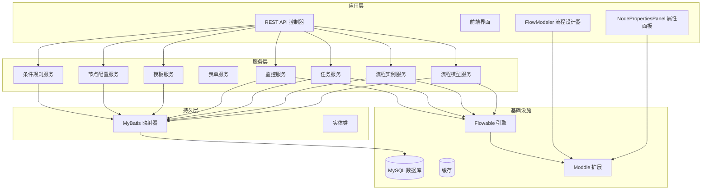
```mermaid
graph TB
subgraph "应用层"
API[REST API 控制器]
UI[前端界面]
NodePropertiesPanel[NodePropertiesPanel 属性面板]
FlowModeler[FlowModeler 流程设计器]
end
subgraph "服务层"
ModelSvc[流程模型服务]
InstanceSvc[流程实例服务]
TaskSvc[任务服务]
FormSvc[表单服务]
MonitorSvc[监控服务]
TemplateSvc[模板服务]
NodeConfigSvc[节点配置服务]
ConditionRuleSvc[条件规则服务]
end
subgraph "持久层"
Mapper[MyBatis 映射器]
Entity[实体类]
end
subgraph "基础设施"
Flowable[Flowable 引擎]
DB[(MySQL 数据库)]
Redis[(缓存)]
Moddle[Moddle 扩展]
end
API --> ModelSvc
API --> InstanceSvc
API --> TaskSvc
API --> MonitorSvc
API --> TemplateSvc
API --> NodeConfigSvc
API --> ConditionRuleSvc
ModelSvc --> Mapper
InstanceSvc --> Mapper
TaskSvc --> Mapper
MonitorSvc --> Mapper
TemplateSvc --> Mapper
NodeConfigSvc --> Mapper
ConditionRuleSvc --> Mapper
Mapper --> DB
ModelSvc --> Flowable
InstanceSvc --> Flowable
TaskSvc --> Flowable
MonitorSvc --> Flowable
NodePropertiesPanel --> Moddle
FlowModeler --> Moddle
Flowable --> Moddle
```

**图表来源**
- [ForgeFlowApplication.java:12-18](file://forge/forge-flow/src/main/java/com/mdframe/forge/flow/ForgeFlowApplication.java#L12-L18)
- [FlowModelController.java:22-28](file://forge/forge-flow/src/main/java/com/mdframe/forge/flow/controller/FlowModelController.java#L22-L28)
- [NodePropertiesPanel.vue:474-493](file://forge-admin-ui/src/components/bpmn/NodePropertiesPanel.vue#L474-L493)
- [FlowModeler.vue:231-240](file://forge-admin-ui/src/components/bpmn/FlowModeler.vue#L231-L240)

**章节来源**
- [ForgeFlowApplication.java:1-20](file://forge/forge-flow/src/main/java/com/mdframe/forge/flow/ForgeFlowApplication.java#L1-L20)

## 核心组件

### 数据库架构

Flow 设计模块采用 MySQL 作为主要存储介质，支持两种数据库模式：

#### 基础版本 (flow_tables.sql)
- 流程模型表 (sys_flow_model)
- 流程业务关联表 (sys_flow_business)
- 流程任务表 (sys_flow_task)
- 流程抄送表 (sys_flow_cc)
- 流程意见表 (sys_flow_comment)
- 流程分类表 (sys_flow_category)
- 流程模板表 (sys_flow_template)

#### 增强版本 (flow_tables_v2.sql)
在基础版本基础上增加了：
- 审批节点配置表 (sys_flow_node_config)
- 审批层级配置表 (sys_flow_approval_level)
- 流程条件规则表 (sys_flow_condition_rule)
- 条件规则明细表 (sys_flow_condition_item)
- 流程监控统计表 (sys_flow_statistics)
- 流程表单定义表 (sys_flow_form)

**新增表结构**：
```sql
-- 流程条件规则表
CREATE TABLE sys_flow_condition_rule (
    id VARCHAR(64) PRIMARY KEY,
    model_id VARCHAR(64) NOT NULL COMMENT '流程模型ID',
    sequence_flow_id VARCHAR(100) NOT NULL COMMENT '序列流ID',
    rule_name VARCHAR(200) COMMENT '规则名称',
    rule_type VARCHAR(50) DEFAULT 'expression' COMMENT '规则类型',
    
    -- 条件配置
    condition_groups TEXT COMMENT '条件组配置JSON',
    condition_expr VARCHAR(1000) COMMENT '条件表达式',
    priority INT DEFAULT 0 COMMENT '优先级',
    
    -- 默认分支
    is_default TINYINT DEFAULT 0 COMMENT '是否默认分支',
    
    create_time DATETIME DEFAULT CURRENT_TIMESTAMP,
    update_time DATETIME DEFAULT CURRENT_TIMESTAMP ON UPDATE CURRENT_TIMESTAMP,
    
    UNIQUE KEY uk_model_flow(model_id, sequence_flow_id)
);

-- 条件规则明细表
CREATE TABLE sys_flow_condition_item (
    id VARCHAR(64) PRIMARY KEY,
    rule_id VARCHAR(64) NOT NULL COMMENT '规则ID',
    group_index INT NOT NULL COMMENT '条件组索引',
    item_index INT NOT NULL COMMENT '条件项索引',
    
    -- 条件配置
    field_name VARCHAR(100) COMMENT '字段名',
    operator VARCHAR(50) COMMENT '操作符(eq/ne/gt/lt/ge/le/contains/empty)',
    field_value VARCHAR(500) COMMENT '字段值',
    value_type VARCHAR(50) DEFAULT 'string' COMMENT '值类型',
    
    -- 逻辑关系
    logic_operator VARCHAR(10) DEFAULT 'AND' COMMENT '逻辑操作符(AND/OR)',
    
    create_time DATETIME DEFAULT CURRENT_TIMESTAMP
);

-- 流程监控统计表
CREATE TABLE sys_flow_statistics (
    id VARCHAR(64) PRIMARY KEY COMMENT '主键',
    process_def_key VARCHAR(100) NOT NULL COMMENT '流程定义KEY',
    stat_date DATE NOT NULL COMMENT '统计日期',
    
    -- 实例统计
    total_instances INT DEFAULT 0 COMMENT '总实例数',
    running_instances INT DEFAULT 0 COMMENT '运行中实例数',
    completed_instances INT DEFAULT 0 COMMENT '已完成实例数',
    terminated_instances INT DEFAULT 0 COMMENT '已终止实例数',
    
    -- 耗时统计
    avg_duration BIGINT COMMENT '平均耗时(毫秒)',
    max_duration BIGINT COMMENT '最大耗时',
    min_duration BIGINT COMMENT '最小耗时',
    
    -- 任务统计
    total_tasks INT DEFAULT 0 COMMENT '总任务数',
    avg_task_duration BIGINT COMMENT '平均任务耗时',
    timeout_tasks INT DEFAULT 0 COMMENT '超时任务数',
    
    create_time DATETIME DEFAULT CURRENT_TIMESTAMP,
    
    UNIQUE KEY uk_process_date(process_def_key, stat_date),
    INDEX idx_stat_date(stat_date)
);
```

**章节来源**
- [flow_tables.sql:6-173](file://forge/forge-framework/forge-plugin-parent/forge-plugin-flow/sql/flow_tables.sql#L6-L173)
- [flow_tables_v2.sql:233-384](file://forge/forge-framework/forge-plugin-parent/forge-plugin-flow/sql/flow_tables_v2.sql#L233-L384)

## 架构概览

Flow 设计模块采用分层架构，各层职责清晰分离：

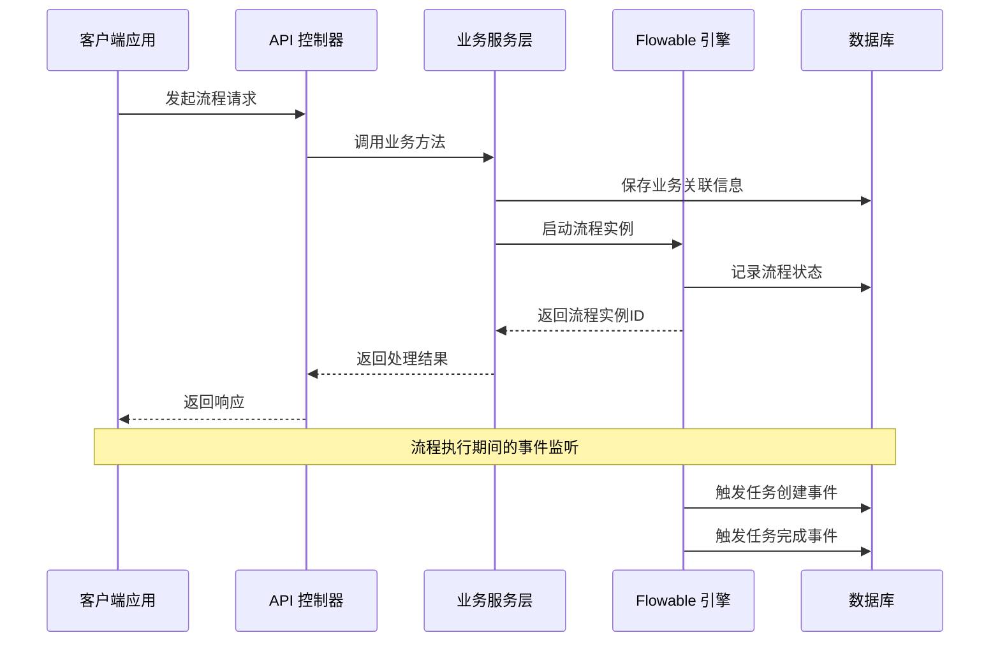
```mermaid
sequenceDiagram
participant Client as 客户端应用
participant API as API 控制器
participant Service as 业务服务层
participant Engine as Flowable 引擎
participant DB as 数据库
Client->>API : 发起流程请求
API->>Service : 调用业务方法
Service->>DB : 保存业务关联信息
Service->>Engine : 启动流程实例
Engine->>DB : 记录流程状态
Engine-->>Service : 返回流程实例ID
Service-->>API : 返回处理结果
API-->>Client : 返回响应
Note over Client,DB : 流程执行期间的事件监听
Engine->>DB : 触发任务创建事件
Engine->>DB : 触发任务完成事件
```

**图表来源**
- [FlowInstanceController.java:43-97](file://forge/forge-flow/src/main/java/com/mdframe/forge/flow/controller/FlowInstanceController.java#L43-L97)
- [FlowInstanceServiceImpl.java:38-104](file://forge/forge-framework/forge-plugin-parent/forge-plugin-flow/src/main/java/com/mdframe/forge/starter/flow/service/impl/FlowInstanceServiceImpl.java#L38-L104)

### 客户端集成架构

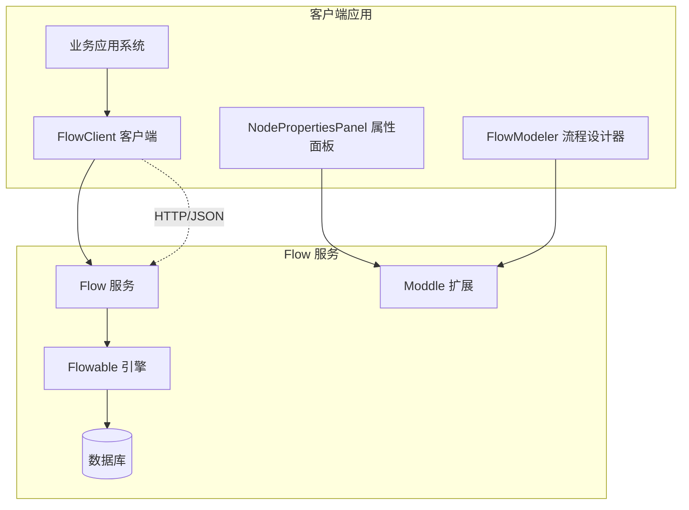
```mermaid
graph TB
subgraph "客户端应用"
App[业务应用系统]
Client[FlowClient 客户端]
NodePropertiesPanel[NodePropertiesPanel 属性面板]
FlowModeler[FlowModeler 流程设计器]
end
subgraph "Flow 服务"
Service[Flow 服务]
Engine[Flowable 引擎]
Moddle[Moddle 扩展]
Storage[(数据库)]
end
App --> Client
Client --> Service
NodePropertiesPanel --> Moddle
FlowModeler --> Moddle
Service --> Engine
Engine --> Storage
Client -.->|HTTP/JSON| Service
```

**图表来源**
- [FlowClient.java:52-156](file://forge/forge-framework/forge-starter-parent/forge-flow-client/src/main/java/com/mdframe/forge/flow/client/FlowClient.java#L52-L156)

**章节来源**
- [FlowClient.java:1-197](file://forge/forge-framework/forge-starter-parent/forge-flow-client/src/main/java/com/mdframe/forge/flow/client/FlowClient.java#L1-L197)

## 详细组件分析

### 流程模型服务

流程模型服务负责流程的设计、部署和管理：

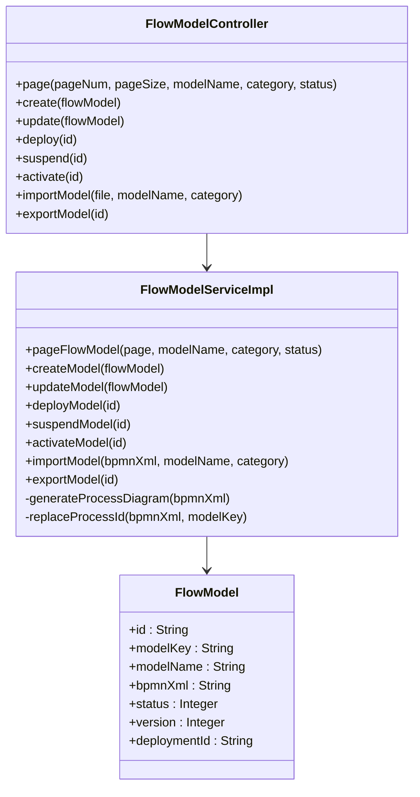
```mermaid
classDiagram
class FlowModelController {
+page(pageNum, pageSize, modelName, category, status)
+create(flowModel)
+update(flowModel)
+deploy(id)
+suspend(id)
+activate(id)
+importModel(file, modelName, category)
+exportModel(id)
}
class FlowModelServiceImpl {
+pageFlowModel(page, modelName, category, status)
+createModel(flowModel)
+updateModel(flowModel)
+deployModel(id)
+suspendModel(id)
+activateModel(id)
+importModel(bpmnXml, modelName, category)
+exportModel(id)
-generateProcessDiagram(bpmnXml)
-replaceProcessId(bpmnXml, modelKey)
}
class FlowModel {
+id : String
+modelKey : String
+modelName : String
+bpmnXml : String
+status : Integer
+version : Integer
+deploymentId : String
}
FlowModelController --> FlowModelServiceImpl
FlowModelServiceImpl --> FlowModel
```

**图表来源**
- [FlowModelController.java:35-215](file://forge/forge-flow/src/main/java/com/mdframe/forge/flow/controller/FlowModelController.java#L35-L215)
- [FlowModelServiceImpl.java:43-567](file://forge/forge-framework/forge-plugin-parent/forge-plugin-flow/src/main/java/com/mdframe/forge/starter/flow/service/impl/FlowModelServiceImpl.java#L43-L567)

#### 部署流程分析

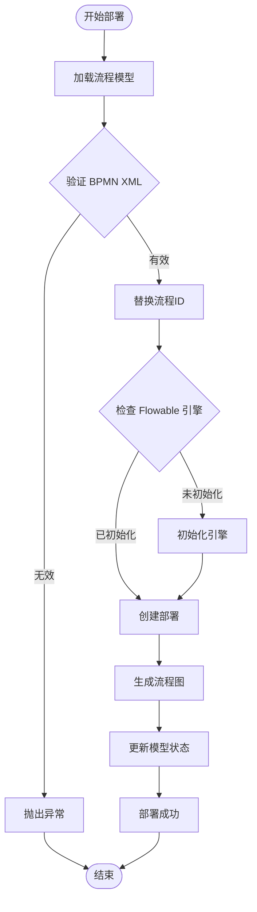
```mermaid
flowchart TD
Start([开始部署]) --> LoadModel[加载流程模型]
LoadModel --> ValidateXML{验证 BPMN XML}
ValidateXML --> |无效| Error[抛出异常]
ValidateXML --> |有效| ReplaceID[替换流程ID]
ReplaceID --> CheckEngine{检查 Flowable 引擎}
CheckEngine --> |未初始化| InitEngine[初始化引擎]
CheckEngine --> |已初始化| Deploy[创建部署]
InitEngine --> Deploy
Deploy --> GenerateDiagram[生成流程图]
GenerateDiagram --> SaveModel[更新模型状态]
SaveModel --> Success[部署成功]
Error --> End([结束])
Success --> End
```

**图表来源**
- [FlowModelServiceImpl.java:124-222](file://forge/forge-framework/forge-plugin-parent/forge-plugin-flow/src/main/java/com/mdframe/forge/starter/flow/service/impl/FlowModelServiceImpl.java#L124-L222)

**章节来源**
- [FlowModelController.java:1-216](file://forge/forge-flow/src/main/java/com/mdframe/forge/flow/controller/FlowModelController.java#L1-L216)
- [FlowModelServiceImpl.java:1-567](file://forge/forge-framework/forge-plugin-parent/forge-plugin-flow/src/main/java/com/mdframe/forge/starter/flow/service/impl/FlowModelServiceImpl.java#L1-L567)

### 流程实例服务

流程实例服务负责流程的启动、执行和状态管理：

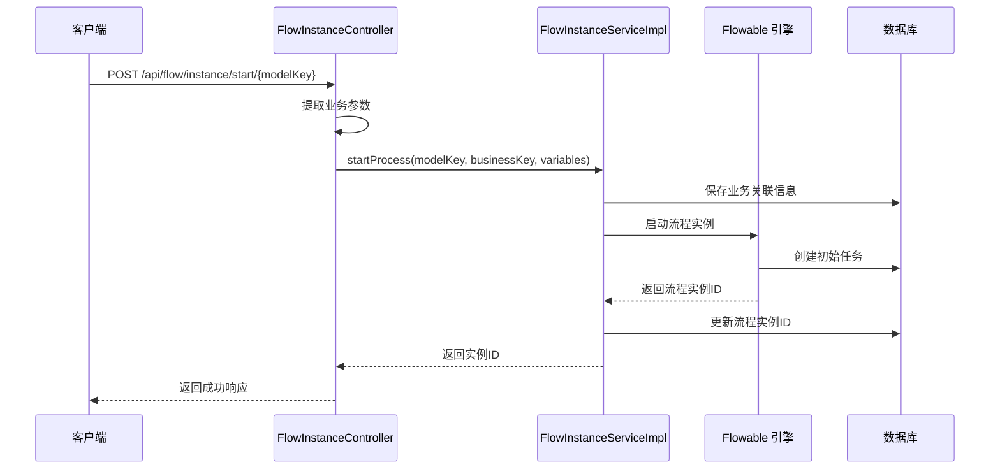
```mermaid
sequenceDiagram
participant Client as 客户端
participant Controller as FlowInstanceController
participant Service as FlowInstanceServiceImpl
participant Engine as Flowable 引擎
participant DB as 数据库
Client->>Controller : POST /api/flow/instance/start/{modelKey}
Controller->>Controller : 提取业务参数
Controller->>Service : startProcess(modelKey, businessKey, variables)
Service->>DB : 保存业务关联信息
Service->>Engine : 启动流程实例
Engine->>DB : 创建初始任务
Engine-->>Service : 返回流程实例ID
Service->>DB : 更新流程实例ID
Service-->>Controller : 返回实例ID
Controller-->>Client : 返回成功响应
```

**图表来源**
- [FlowInstanceController.java:43-97](file://forge/forge-flow/src/main/java/com/mdframe/forge/flow/controller/FlowInstanceController.java#L43-L97)
- [FlowInstanceServiceImpl.java:38-104](file://forge/forge-framework/forge-plugin-parent/forge-plugin-flow/src/main/java/com/mdframe/forge/starter/flow/service/impl/FlowInstanceServiceImpl.java#L38-L104)

#### 流程终止流程

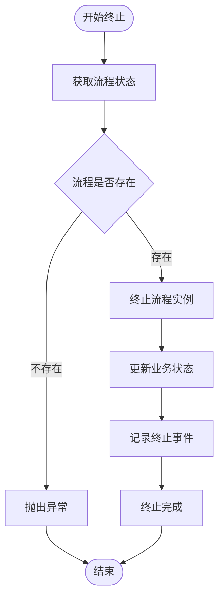
```mermaid
flowchart TD
Start([开始终止]) --> GetStatus[获取流程状态]
GetStatus --> CheckExist{流程是否存在}
CheckExist --> |不存在| ThrowError[抛出异常]
CheckExist --> |存在| Terminate[终止流程实例]
Terminate --> UpdateStatus[更新业务状态]
UpdateStatus --> LogEvent[记录终止事件]
LogEvent --> Success[终止完成]
ThrowError --> End([结束])
Success --> End
```

**图表来源**
- [FlowInstanceServiceImpl.java:114-128](file://forge/forge-framework/forge-plugin-parent/forge-plugin-flow/src/main/java/com/mdframe/forge/starter/flow/service/impl/FlowInstanceServiceImpl.java#L114-L128)

**章节来源**
- [FlowInstanceController.java:1-205](file://forge/forge-flow/src/main/java/com/mdframe/forge/flow/controller/FlowInstanceController.java#L1-L205)
- [FlowInstanceServiceImpl.java:1-164](file://forge/forge-framework/forge-plugin-parent/forge-plugin-flow/src/main/java/com/mdframe/forge/starter/flow/service/impl/FlowInstanceServiceImpl.java#L1-L164)

### 任务管理服务

任务管理服务提供完整的任务生命周期管理：

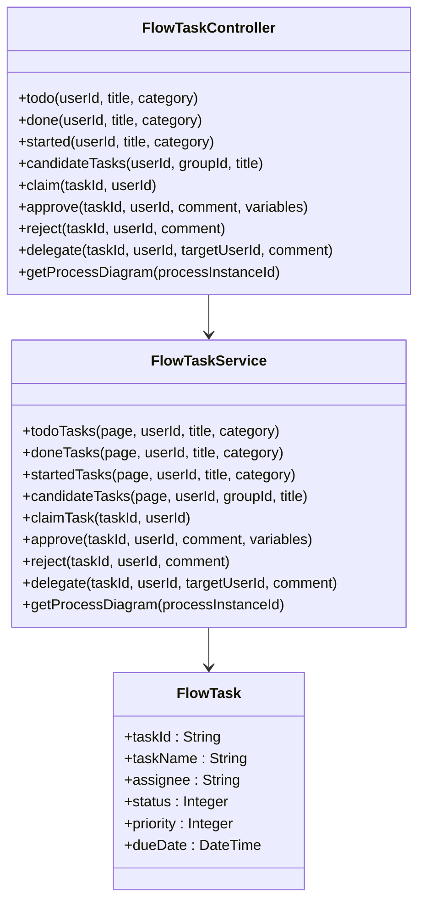
```mermaid
classDiagram
class FlowTaskController {
+todo(userId, title, category)
+done(userId, title, category)
+started(userId, title, category)
+candidateTasks(userId, groupId, title)
+claim(taskId, userId)
+approve(taskId, userId, comment, variables)
+reject(taskId, userId, comment)
+delegate(taskId, userId, targetUserId, comment)
+getProcessDiagram(processInstanceId)
}
class FlowTaskService {
+todoTasks(page, userId, title, category)
+doneTasks(page, userId, title, category)
+startedTasks(page, userId, title, category)
+candidateTasks(page, userId, groupId, title)
+claimTask(taskId, userId)
+approve(taskId, userId, comment, variables)
+reject(taskId, userId, comment)
+delegate(taskId, userId, targetUserId, comment)
+getProcessDiagram(processInstanceId)
}
class FlowTask {
+taskId : String
+taskName : String
+assignee : String
+status : Integer
+priority : Integer
+dueDate : DateTime
}
FlowTaskController --> FlowTaskService
FlowTaskService --> FlowTask
```

**图表来源**
- [FlowTaskController.java:37-220](file://forge/forge-flow/src/main/java/com/mdframe/forge/flow/controller/FlowTaskController.java#L37-L220)

**章节来源**
- [FlowTaskController.java:1-220](file://forge/forge-flow/src/main/java/com/mdframe/forge/flow/controller/FlowTaskController.java#L1-L220)

## BPMN 7.0 支持

Flow 设计模块现已全面支持 BPMN 7.0 标准，提供更强大的流程建模能力：

### 新增特性

1. **增强的流程定义支持**
   - 支持 BPMN 2.0 和 7.0 标准的混合使用
   - 更精确的流程元素语义定义
   - 增强的事件处理机制

2. **改进的流程执行引擎**
   - 更高效的流程实例执行
   - 增强的并发处理能力
   - 改进的内存管理

3. **扩展的可视化工具**
   - 支持更复杂的流程图布局
   - 增强的节点属性编辑器
   - 改进的流程验证机制

### 兼容性保证

- 向后兼容现有 BPMN 2.0 流程
- 渐进式迁移支持
- 自动转换机制确保平滑升级

## 流程模板管理

新增的流程模板管理功能提供了标准化的流程创建和复用能力：

### 模板实体结构

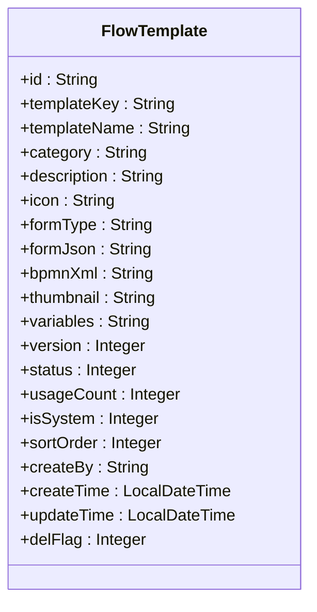
```mermaid
classDiagram
class FlowTemplate {
+id : String
+templateKey : String
+templateName : String
+category : String
+description : String
+icon : String
+formType : String
+formJson : String
+bpmnXml : String
+thumbnail : String
+variables : String
+version : Integer
+status : Integer
+usageCount : Integer
+isSystem : Integer
+sortOrder : Integer
+createBy : String
+createTime : LocalDateTime
+updateTime : LocalDateTime
+delFlag : Integer
}
```

**图表来源**
- [FlowTemplate.java:14-116](file://forge/forge-framework/forge-plugin-parent/forge-plugin-flow/src/main/java/com/mdframe/forge/starter/flow/entity/FlowTemplate.java#L14-L116)

### 模板管理功能

1. **模板创建和编辑**
   - 支持从 BPMN XML 创建模板
   - 动态表单配置集成
   - 分类和标签管理

2. **模板使用统计**
   - 使用次数跟踪
   - 模板效果分析
   - 最佳实践推荐

3. **模板复制和版本管理**
   - 快速复制现有模板
   - 版本控制和变更追踪
   - 模板继承和扩展

**章节来源**
- [FlowTemplateController.java:1-141](file://forge/forge-flow/src/main/java/com/mdframe/forge/flow/controller/FlowTemplateController.java#L1-L141)
- [FlowTemplateService.java:1-112](file://forge/forge-framework/forge-plugin-parent/forge-plugin-flow/src/main/java/com/mdframe/forge/starter/flow/service/FlowTemplateService.java#L1-L112)
- [FlowTemplateServiceImpl.java:1-221](file://forge/forge-framework/forge-plugin-parent/forge-plugin-flow/src/main/java/com/mdframe/forge/starter/flow/service/impl/FlowTemplateServiceImpl.java#L1-L221)

## 条件规则管理

条件规则管理系统提供了强大的流程分支控制能力：

### 规则实体结构

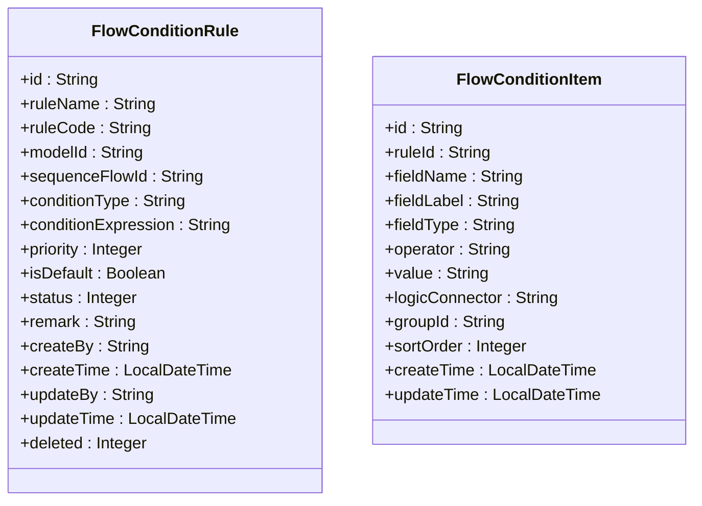
```mermaid
classDiagram
class FlowConditionRule {
+id : String
+ruleName : String
+ruleCode : String
+modelId : String
+sequenceFlowId : String
+conditionType : String
+conditionExpression : String
+priority : Integer
+isDefault : Boolean
+status : Integer
+remark : String
+createBy : String
+createTime : LocalDateTime
+updateBy : String
+updateTime : LocalDateTime
+deleted : Integer
}
class FlowConditionItem {
+id : String
+ruleId : String
+fieldName : String
+fieldLabel : String
+fieldType : String
+operator : String
+value : String
+logicConnector : String
+groupId : String
+sortOrder : Integer
+createTime : LocalDateTime
+updateTime : LocalDateTime
}
```

**图表来源**
- [FlowConditionRule.java:20-107](file://forge/forge-framework/forge-plugin-parent/forge-plugin-flow/src/main/java/com/mdframe/forge/starter/flow/entity/FlowConditionRule.java#L20-L107)
- [FlowConditionItem.java:18-83](file://forge/forge-framework/forge-plugin-parent/forge-plugin-flow/src/main/java/com/mdframe/forge/starter/flow/entity/FlowConditionItem.java#L18-L83)

### 规则类型支持

1. **简单条件规则**
   - 基于单个字段的比较
   - 支持多种操作符 (eq, ne, gt, lt, ge, le)
   - 数值、字符串、日期类型支持

2. **组合条件规则**
   - 多条件组合 (AND, OR)
   - 条件分组管理
   - 嵌套条件支持

3. **脚本条件规则**
   - 基于表达式的动态条件
   - Spring Expression Language (SpEL) 支持
   - 复杂业务逻辑实现

### 规则评估机制

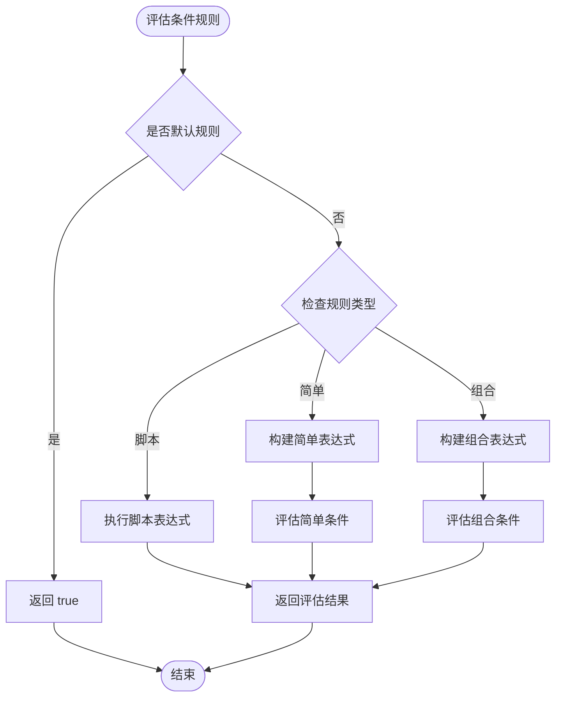
```mermaid
flowchart TD
Start([评估条件规则]) --> CheckDefault{是否默认规则}
CheckDefault --> |是| ReturnTrue[返回 true]
CheckDefault --> |否| CheckType{检查规则类型}
CheckType --> |脚本| EvalScript[执行脚本表达式]
CheckType --> |简单| BuildSimple[构建简单表达式]
CheckType --> |组合| BuildComposite[构建组合表达式]
EvalScript --> Result[返回评估结果]
BuildSimple --> EvalSimple[评估简单条件]
BuildComposite --> EvalComposite[评估组合条件]
EvalSimple --> Result
EvalComposite --> Result
ReturnTrue --> End([结束])
Result --> End
```

**图表来源**
- [FlowConditionRuleServiceImpl.java:112-133](file://forge/forge-framework/forge-plugin-parent/forge-plugin-flow/src/main/java/com/mdframe/forge/starter/flow/service/impl/FlowConditionRuleServiceImpl.java#L112-L133)

**章节来源**
- [FlowConditionRuleService.java:53-91](file://forge/forge-framework/forge-plugin-parent/forge-plugin-flow/src/main/java/com/mdframe/forge/starter/flow/service/FlowConditionRuleService.java#L53-L91)
- [FlowConditionRuleServiceImpl.java:1-460](file://forge/forge-framework/forge-plugin-parent/forge-plugin-flow/src/main/java/com/mdframe/forge/starter/flow/service/impl/FlowConditionRuleServiceImpl.java#L1-L460)

## 工作流监控

增强的工作流监控功能提供了实时的流程执行状态和历史数据分析：

### 监控服务接口

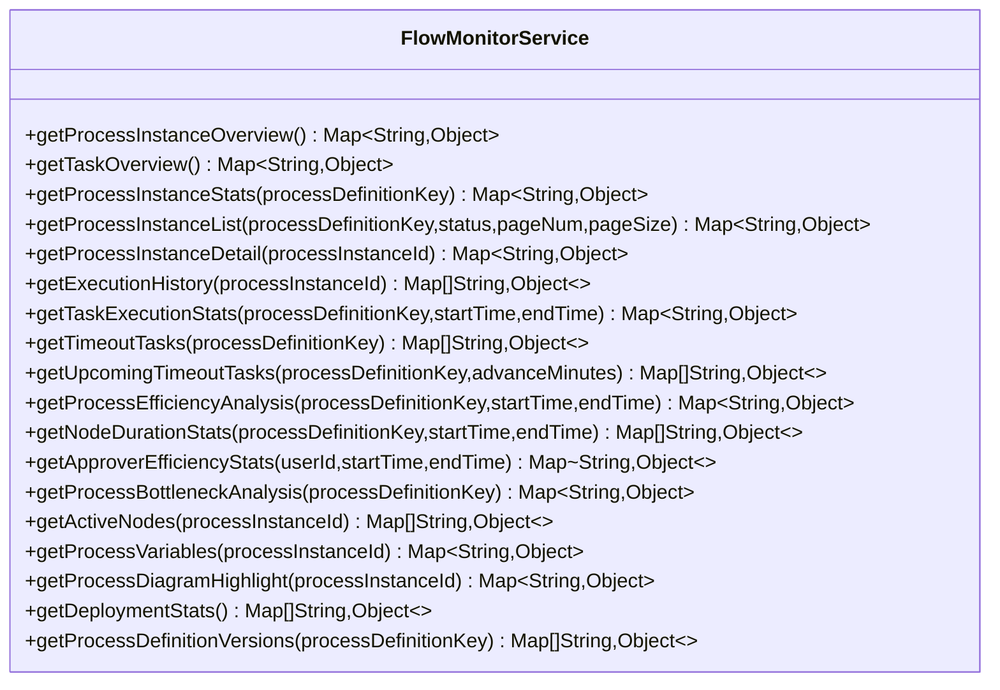
```mermaid
classDiagram
class FlowMonitorService {
+getProcessInstanceOverview() Map~String,Object~
+getTaskOverview() Map~String,Object~
+getProcessInstanceStats(processDefinitionKey) Map~String,Object~
+getProcessInstanceList(processDefinitionKey,status,pageNum,pageSize) Map~String,Object~
+getProcessInstanceDetail(processInstanceId) Map~String,Object~
+getExecutionHistory(processInstanceId) Map[]String,Object~~
+getTaskExecutionStats(processDefinitionKey,startTime,endTime) Map~String,Object~
+getTimeoutTasks(processDefinitionKey) Map[]String,Object~~
+getUpcomingTimeoutTasks(processDefinitionKey,advanceMinutes) Map[]String,Object~~
+getProcessEfficiencyAnalysis(processDefinitionKey,startTime,endTime) Map~String,Object~
+getNodeDurationStats(processDefinitionKey,startTime,endTime) Map[]String,Object~~
+getApproverEfficiencyStats(userId,startTime,endTime) Map~String,Object~~
+getProcessBottleneckAnalysis(processDefinitionKey) Map~String,Object~
+getActiveNodes(processInstanceId) Map[]String,Object~~
+getProcessVariables(processInstanceId) Map~String,Object~
+getProcessDiagramHighlight(processInstanceId) Map~String,Object~
+getDeploymentStats() Map[]String,Object~~
+getProcessDefinitionVersions(processDefinitionKey) Map[]String,Object~~
}
```

**图表来源**
- [FlowMonitorService.java:12-148](file://forge/forge-framework/forge-plugin-parent/forge-plugin-flow/src/main/java/com/mdframe/forge/starter/flow/service/FlowMonitorService.java#L12-L148)

### 监控控制器

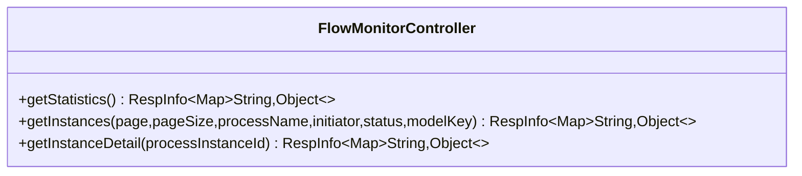
```mermaid
classDiagram
class FlowMonitorController {
+getStatistics() RespInfo~Map~String,Object~~
+getInstances(page,pageSize,processName,initiator,status,modelKey) RespInfo~Map~String,Object~~
+getInstanceDetail(processInstanceId) RespInfo~Map~String,Object~~
}
```

**图表来源**
- [FlowMonitorController.java:38-250](file://forge/forge-flow/src/main/java/com/mdframe/forge/flow/controller/FlowMonitorController.java#L38-L250)

### 监控功能特性

1. **实时统计概览**
   - 运行中流程实例数量
   - 待办任务统计
   - 今日完成流程统计
   - 超时任务监控

2. **流程实例监控**
   - 分页查询流程实例列表
   - 实时流程状态跟踪
   - 当前节点和处理人显示
   - 运行时长计算

3. **历史数据分析**
   - 流程执行历史记录
   - 节点耗时统计
   - 审批人效率分析
   - 流程瓶颈识别

4. **部署和版本管理**
   - 流程部署状态监控
   - 版本历史追踪
   - 部署统计分析

**章节来源**
- [FlowMonitorController.java:1-250](file://forge/forge-flow/src/main/java/com/mdframe/forge/flow/controller/FlowMonitorController.java#L1-L250)
- [FlowMonitorService.java:1-148](file://forge/forge-framework/forge-plugin-parent/forge-plugin-flow/src/main/java/com/mdframe/forge/starter/flow/service/FlowMonitorService.java#L1-L148)
- [FlowMonitorServiceImpl.java:1-494](file://forge/forge-framework/forge-plugin-parent/forge-plugin-flow/src/main/java/com/mdframe/forge/starter/flow/service/impl/FlowMonitorServiceImpl.java#L1-L494)

## 节点配置管理

节点配置管理功能提供了灵活的审批节点控制能力：

### 节点配置实体

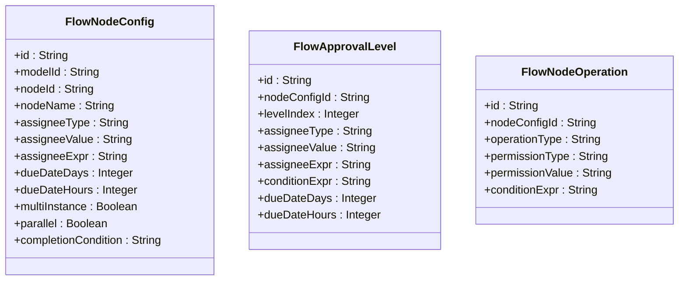
```mermaid
classDiagram
class FlowNodeConfig {
+id : String
+modelId : String
+nodeId : String
+nodeName : String
+assigneeType : String
+assigneeValue : String
+assigneeExpr : String
+dueDateDays : Integer
+dueDateHours : Integer
+multiInstance : Boolean
+parallel : Boolean
+completionCondition : String
}
class FlowApprovalLevel {
+id : String
+nodeConfigId : String
+levelIndex : Integer
+assigneeType : String
+assigneeValue : String
+assigneeExpr : String
+conditionExpr : String
+dueDateDays : Integer
+dueDateHours : Integer
}
class FlowNodeOperation {
+id : String
+nodeConfigId : String
+operationType : String
+permissionType : String
+permissionValue : String
+conditionExpr : String
}
```

**图表来源**
- [FlowNodeConfigServiceImpl.java:261-485](file://forge/forge-framework/forge-plugin-parent/forge-plugin-flow/src/main/java/com/mdframe/forge/starter/flow/service/impl/FlowNodeConfigServiceImpl.java#L261-L485)

### 审批层级管理

1. **多层级审批支持**
   - 动态层级配置
   - 层级条件评估
   - 下一级审批判断

2. **审批人动态计算**
   - 基于组织架构的自动计算
   - 支持多维度审批人选择
   - 表达式驱动的审批人计算

3. **操作权限控制**
   - 节点操作权限配置
   - 动态权限评估
   - 条件驱动的权限控制

### 超时管理

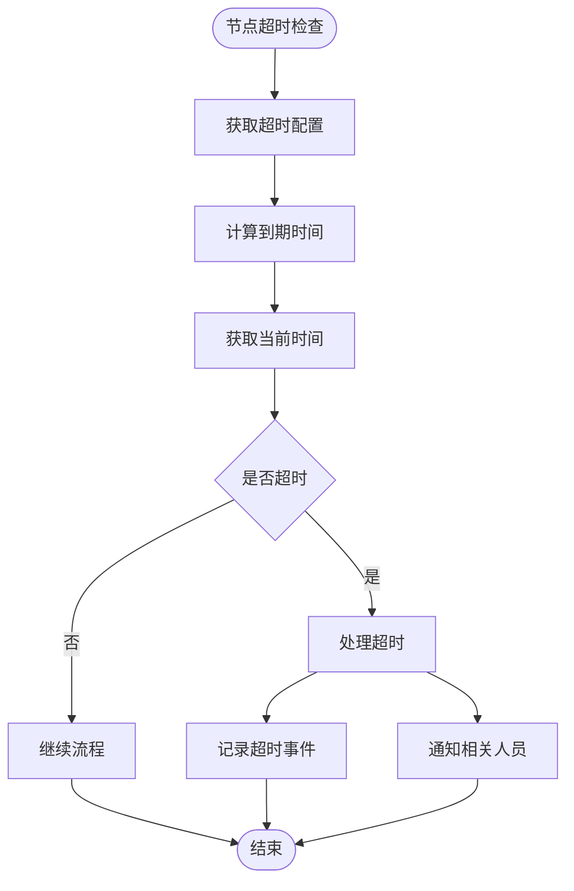
```mermaid
flowchart TD
Start([节点超时检查]) --> GetTimeout[获取超时配置]
GetTimeout --> CalcDueDate[计算到期时间]
CalcDueDate --> GetCurrentTime[获取当前时间]
GetCurrentTime --> CompareTime{是否超时}
CompareTime --> |是| HandleTimeout[处理超时]
CompareTime --> |否| ContinueProcess[继续流程]
HandleTimeout --> LogTimeout[记录超时事件]
HandleTimeout --> NotifyTimeout[通知相关人员]
ContinueProcess --> End([结束])
LogTimeout --> End
NotifyTimeout --> End
```

**图表来源**
- [FlowNodeConfigServiceImpl.java:241-256](file://forge/forge-framework/forge-plugin-parent/forge-plugin-flow/src/main/java/com/mdframe/forge/starter/flow/service/impl/FlowNodeConfigServiceImpl.java#L241-L256)

**章节来源**
- [FlowNodeConfigController.java:1-157](file://forge/forge-flow/src/main/java/com/mdframe/forge/flow/controller/FlowNodeConfigController.java#L1-L157)
- [FlowNodeConfigService.java:1-137](file://forge/forge-framework/forge-plugin-parent/forge-plugin-flow/src/main/java/com/mdframe/forge/starter/flow/service/FlowNodeConfigService.java#L1-L137)
- [FlowNodeConfigServiceImpl.java:1-485](file://forge/forge-framework/forge-plugin-parent/forge-plugin-flow/src/main/java/com/mdframe/forge/starter/flow/service/impl/FlowNodeConfigServiceImpl.java#L1-L485)

## 属性面板增强

NodePropertiesPanel 属性面板经过重大增强，改进了 Flowable 扩展属性处理机制，并新增了完整的多实例配置支持。

### 增强的扩展属性处理

**更新** NodePropertiesPanel 现在提供了更完善的 Flowable 扩展属性处理能力：

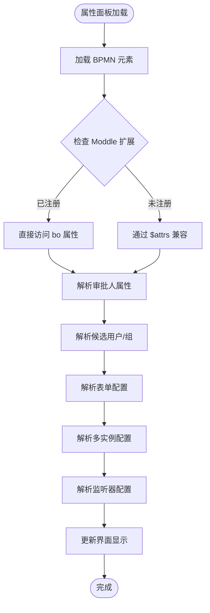
```mermaid
flowchart TD
Start([属性面板加载]) --> LoadElement[加载 BPMN 元素]
LoadElement --> CheckModdle{检查 Moddle 扩展}
CheckModdle --> |已注册| DirectAccess[直接访问 bo 属性]
CheckModdle --> |未注册| AttrAccess[通过 $attrs 兼容]
DirectAccess --> ParseAssignee[解析审批人属性]
ParseAssignee --> ParseCandidates[解析候选用户/组]
ParseCandidates --> ParseForm[解析表单配置]
ParseForm --> ParseMultiInstance[解析多实例配置]
ParseMultiInstance --> ParseListeners[解析监听器配置]
ParseListeners --> UpdateUI[更新界面显示]
AttrAccess --> ParseAssignee
UpdateUI --> End([完成])
```

**图表来源**
- [NodePropertiesPanel.vue:762-907](file://forge-admin-ui/src/components/bpmn/NodePropertiesPanel.vue#L762-L907)

#### 扩展属性处理改进

1. **双路径兼容性**
   - 直接访问：`bo.assignee`、`bo.candidateUsers` 等
   - 兼容访问：`attrs['flowable:assignee']`、`bo.flowable:assignee`
   - 自动检测和回退机制

2. **属性类型识别**
   - 审批人类型自动判断（指定、候选用户、候选组）
   - 表单类型智能识别（动态、外部、无表单）
   - 多实例类型自动检测

3. **数据格式转换**
   - ISO 8601 时长格式解析（如 `P3D` → `3`）
   - 表达式字符串处理
   - 多值属性分割和合并

### 多实例配置增强

**更新** 新增了完整的多实例配置支持，包括并行会签和依次审批：

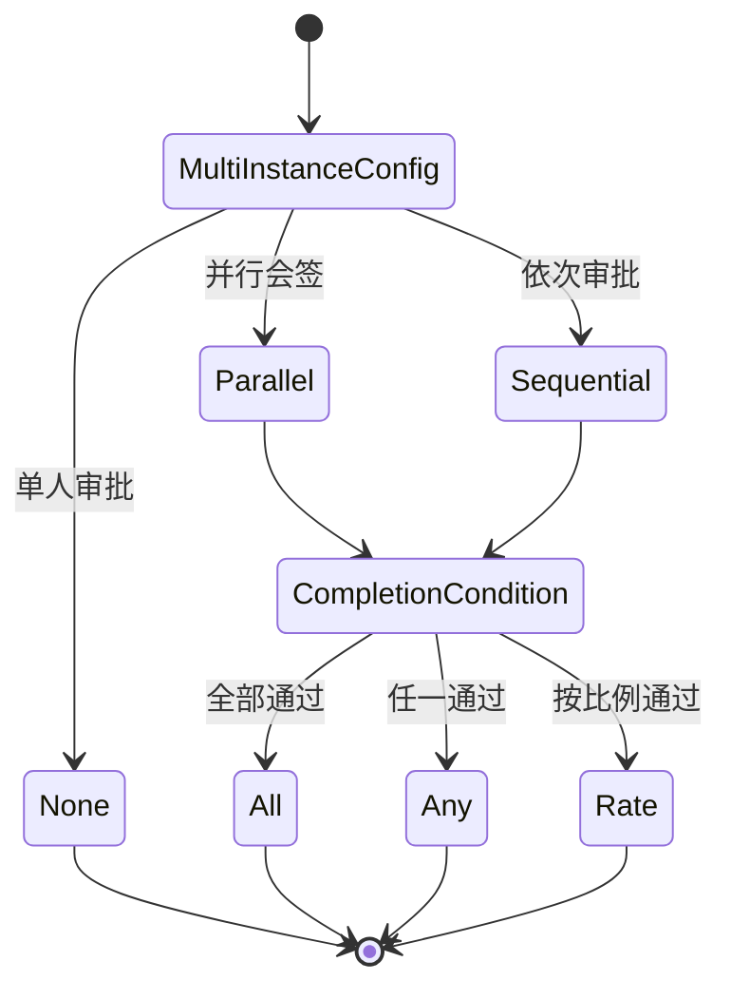
```mermaid
stateDiagram-v2
[*] --> MultiInstanceConfig
MultiInstanceConfig --> None : 单人审批
MultiInstanceConfig --> Parallel : 并行会签
MultiInstanceConfig --> Sequential : 依次审批
None --> [*]
Parallel --> CompletionCondition
Sequential --> CompletionCondition
CompletionCondition --> All : 全部通过
CompletionCondition --> Any : 任一通过
CompletionCondition --> Rate : 按比例通过
All --> [*]
Any --> [*]
Rate --> [*]
```

**图表来源**
- [NodePropertiesPanel.vue:255-286](file://forge-admin-ui/src/components/bpmn/NodePropertiesPanel.vue#L255-L286)
- [NodePropertiesPanel.vue:858-883](file://forge-admin-ui/src/components/bpmn/NodePropertiesPanel.vue#L858-L883)

#### 多实例配置功能

1. **三种执行模式**
   - **单人审批** (`none`)：传统单人处理
   - **并行会签** (`parallel`)：多个审批人同时处理
   - **依次审批** (`sequential`)：多个审批人顺序处理

2. **完成条件配置**
   - **全部通过** (`all`)：需要所有参与者同意
   - **任一通过** (`any`)：任意一个参与者同意即可
   - **按比例通过** (`rate`)：按设定比例通过

3. **比例配置**
   - 滑块控制通过比例（0-100%）
   - 动态计算完成条件表达式
   - 支持小数比例配置

### 用户界面增强

**更新** 属性面板的用户界面经过优化，提供了更好的用户体验：

1. **折叠面板组织**
   - 基础属性、审批设置、表单配置等分组显示
   - 默认展开重要配置面板
   - 支持面板折叠和展开

2. **交互优化**
   - 实时属性更新和预览
   - 用户选择弹窗集成
   - 角色选择表格支持
   - 清除和移除操作按钮

3. **数据绑定**
   - 双向数据绑定确保实时同步
   - 属性变更自动触发 BPMN 更新
   - 错误处理和提示机制

### 监听器配置

**更新** 新增了任务监听器和执行监听器的完整配置支持：

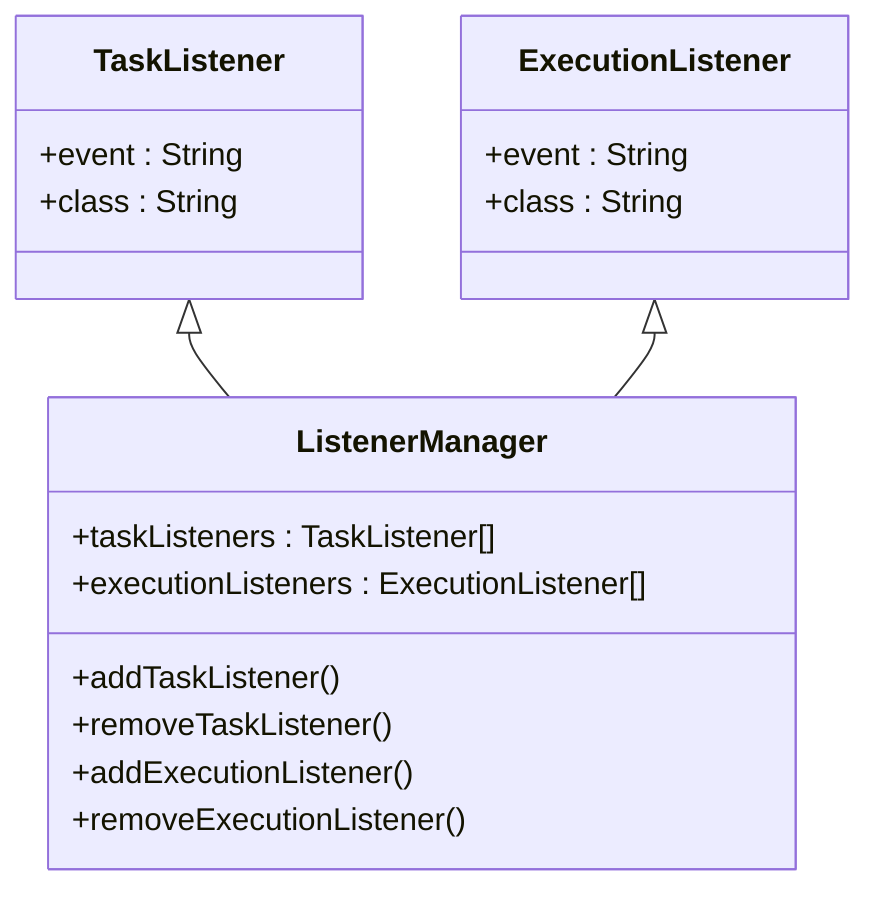
```mermaid
classDiagram
class TaskListener {
+event : String
+class : String
}
class ExecutionListener {
+event : String
+class : String
}
class ListenerManager {
+taskListeners : TaskListener[]
+executionListeners : ExecutionListener[]
+addTaskListener()
+removeTaskListener()
+addExecutionListener()
+removeExecutionListener()
}
TaskListener <|-- ListenerManager
ExecutionListener <|-- ListenerManager
```

**图表来源**
- [NodePropertiesPanel.vue:1126-1177](file://forge-admin-ui/src/components/bpmn/NodePropertiesPanel.vue#L1126-L1177)

#### 监听器功能

1. **任务监听器**
   - 事件类型：创建、分配、完成、删除
   - Java 类配置支持
   - 实时监听器管理

2. **执行监听器**
   - 事件类型：开始、结束、执行
   - 支持多种实现方式
   - 流程生命周期监控

3. **配置管理**
   - 动态添加和删除监听器
   - 实时生效和更新
   - 错误处理和验证

**章节来源**
- [NodePropertiesPanel.vue:1-1330](file://forge-admin-ui/src/components/bpmn/NodePropertiesPanel.vue#L1-L1330)
- [flowable-moddle.json:1-190](file://forge-admin-ui/src/components/bpmn/flowable-moddle.json#L1-L190)
- [FlowModeler.vue:231-240](file://forge-admin-ui/src/components/bpmn/FlowModeler.vue#L231-L240)

## 依赖关系分析

### 外部依赖

Flow 设计模块依赖以下核心组件：

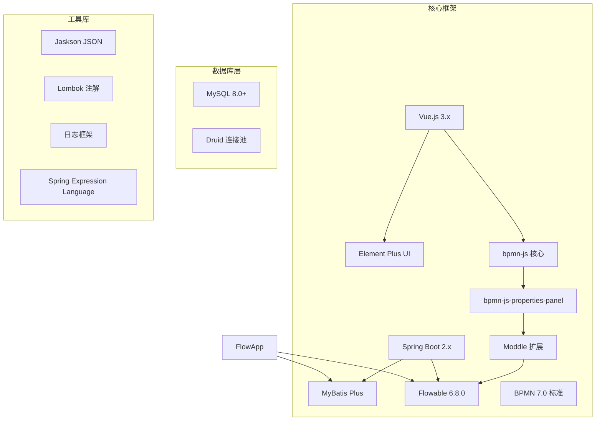
```mermaid
graph TB
subgraph "核心框架"
SpringBoot[Spring Boot 2.x]
MyBatis[MyBatis Plus]
Flowable[Flowable 6.8.0]
BPMN7[BPMN 7.0 标准]
Vue[Vue.js 3.x]
ElementPlus[Element Plus UI]
bpmn-js[bpmn-js 核心]
properties-panel[bpmn-js-properties-panel]
moddle[Moddle 扩展]
end
subgraph "数据库层"
MySQL[MySQL 8.0+]
Druid[Druid 连接池]
end
subgraph "工具库"
Jackson[Jaskson JSON]
Lombok[Lombok 注解]
SLF4J[日志框架]
SpEL[Spring Expression Language]
end
FlowApp --> Flowable
FlowApp --> MyBatis
SpringBoot --> Flowable
SpringBoot --> MyBatis
Vue --> ElementPlus
Vue --> bpmn-js
bpmn-js --> properties-panel
properties-panel --> moddle
moddle --> Flowable
```

### 内部模块依赖

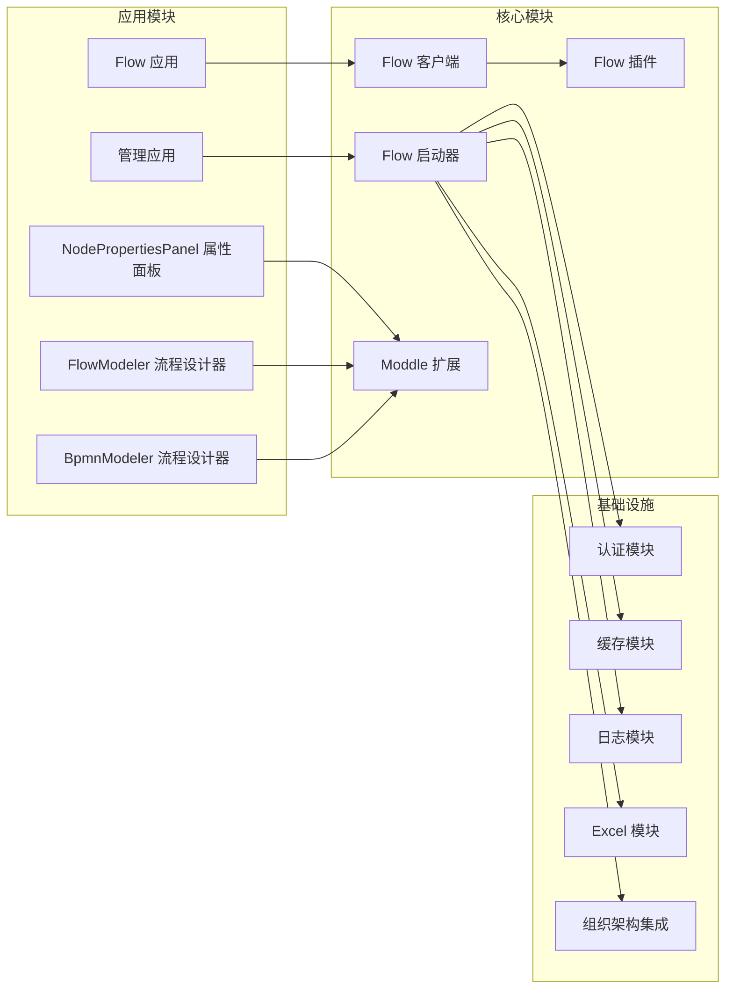
```mermaid
graph LR
subgraph "应用模块"
FlowApp[Flow 应用]
AdminApp[管理应用]
NodePropertiesPanel[NodePropertiesPanel 属性面板]
FlowModeler[FlowModeler 流程设计器]
BpmnModeler[BpmnModeler 流程设计器]
end
subgraph "核心模块"
FlowClient[Flow 客户端]
Starter[Flow 启动器]
Plugin[Flow 插件]
Moddle[Moddle 扩展]
end
subgraph "基础设施"
Auth[认证模块]
Cache[缓存模块]
Log[日志模块]
Excel[Excel 模块]
Org[组织架构集成]
end
FlowApp --> FlowClient
AdminApp --> Starter
NodePropertiesPanel --> Moddle
FlowModeler --> Moddle
BpmnModeler --> Moddle
FlowClient --> Plugin
Starter --> Auth
Starter --> Cache
Starter --> Log
Starter --> Excel
Starter --> Org
```

**图表来源**
- [ForgeFlowApplication.java:12-18](file://forge/forge-flow/src/main/java/com/mdframe/forge/flow/ForgeFlowApplication.java#L12-L18)
- [NodePropertiesPanel.vue:474-493](file://forge-admin-ui/src/components/bpmn/NodePropertiesPanel.vue#L474-L493)
- [FlowModeler.vue:231-240](file://forge-admin-ui/src/components/bpmn/FlowModeler.vue#L231-L240)

**章节来源**
- [ForgeFlowApplication.java:1-20](file://forge/forge-flow/src/main/java/com/mdframe/forge/flow/ForgeFlowApplication.java#L1-L20)

## 性能考虑

### 数据库优化

1. **索引策略**
   - 流程模型表：按 model_key、category、status 建立复合索引
   - 流程任务表：按 task_id、assignee、status、create_time 建立索引
   - 业务关联表：按 business_key、process_instance_id 建立唯一索引
   - **新增** 条件规则表：按 model_id、sequence_flow_id 建立唯一索引
   - **新增** 监控统计表：按 process_def_key、stat_date 建立复合索引

2. **查询优化**
   - 使用分页查询避免全表扫描
   - 合理使用连接查询减少 N+1 问题
   - 对高频查询建立适当的索引
   - **新增** 条件规则评估使用缓存机制

3. **缓存策略**
   - 流程定义缓存：缓存最新版本的流程定义
   - 用户信息缓存：缓存用户组织架构信息
   - 表单配置缓存：缓存表单定义和权限配置
   - **新增** 条件规则缓存：缓存常用条件规则配置
   - **新增** 模板缓存：缓存流程模板定义
   - **新增** 属性面板缓存：缓存用户选择和角色列表

### 流程引擎优化

1. **并发控制**
   - 使用乐观锁防止并发冲突
   - 合理设置任务超时时间
   - 监控长时间运行的流程实例
   - **新增** 条件规则评估的线程安全保证

2. **内存管理**
   - 合理设置流程变量大小限制
   - 及时清理已完成流程的历史数据
   - 监控流程引擎内存使用情况
   - **新增** 监控统计数据的定期清理机制

3. **监控优化**
   - **新增** 实时监控数据的批量处理
   - **新增** 历史监控数据的分区存储
   - **新增** 监控查询的索引优化
   - **新增** 属性面板操作的性能优化

4. **前端性能优化**
   - **新增** 属性面板的虚拟滚动支持
   - **新增** 用户选择弹窗的懒加载
   - **新增** 角色列表的分页加载
   - **新增** 多实例配置的实时预览

## 故障排除指南

### 常见问题及解决方案

#### 流程部署失败

**问题症状**：部署流程时抛出 "BPMN XML 缺少图形信息" 异常

**可能原因**：
1. BPMN XML 文件不完整
2. 流程图未保存图形坐标
3. XML 格式不符合规范
4. **新增** BPMN 7.0 元素不兼容

**解决步骤**：
1. 检查 BPMN XML 文件完整性
2. 在流程设计器中重新保存流程图
3. 验证 XML 格式的正确性
4. **新增** 确保 BPMN 7.0 元素符合标准规范

#### 流程启动异常

**问题症状**：启动流程时报 "流程定义不存在" 错误

**可能原因**：
1. 流程模型未正确部署
2. 流程 Key 不匹配
3. Flowable 引擎未正确初始化
4. **新增** 模板引用错误

**解决步骤**：
1. 确认流程模型状态为已发布
2. 验证 modelKey 与 BPMN 中的 process id 一致
3. 检查 Flowable 引擎配置
4. **新增** 验证模板引用的正确性

#### 任务处理异常

**问题症状**：任务签收或审批时报 "任务不存在" 错误

**可能原因**：
1. 任务 ID 错误
2. 任务已被其他用户处理
3. 流程实例已结束
4. **新增** 节点配置错误

**解决步骤**：
1. 验证任务 ID 的正确性
2. 检查任务的当前状态
3. 确认流程实例仍在运行中
4. **新增** 检查节点配置的正确性

#### 条件规则评估失败

**问题症状**：条件规则评估时报 "表达式解析失败" 错误

**可能原因**：
1. 条件表达式语法错误
2. 变量引用不存在
3. 数据类型不匹配
4. **新增** BPMN 7.0 表达式不支持

**解决步骤**：
1. 检查条件表达式的语法正确性
2. 验证变量的定义和值
3. 确认数据类型的兼容性
4. **新增** 使用支持的 BPMN 7.0 表达式语法

#### 监控数据异常

**问题症状**：监控数据显示异常或缺失

**可能原因**：
1. 监控数据收集失败
2. 数据库连接问题
3. 缓存同步延迟
4. **新增** 监控统计表结构不匹配

**解决步骤**：
1. 检查监控数据收集任务的状态
2. 验证数据库连接和权限
3. 清理和重建缓存
4. **新增** 检查监控统计表结构的完整性

#### 属性面板配置失败

**问题症状**：NodePropertiesPanel 属性面板无法正确显示或保存配置

**可能原因**：
1. Moddle 扩展未正确注册
2. Flowable 属性访问冲突
3. Vue 响应式数据绑定问题
4. **新增** 多实例配置表达式错误

**解决步骤**：
1. 检查 flowable-moddle.json 配置
2. 验证 Moddle 扩展注册状态
3. 检查 Vue 组件的响应式数据
4. **新增** 验证多实例完成条件表达式的正确性

#### 多实例执行异常

**问题症状**：多实例配置无法正确执行或显示异常

**可能原因**：
1. 多实例表达式格式错误
2. 完成条件计算异常
3. 执行人集合获取失败
4. **新增** 并行执行超时

**解决步骤**：
1. 检查多实例表达式的格式和语法
2. 验证完成条件的计算逻辑
3. 确认执行人的集合获取
4. **新增** 检查并行执行的超时设置

**章节来源**
- [FlowModelServiceImpl.java:132-143](file://forge/forge-framework/forge-plugin-parent/forge-plugin-flow/src/main/java/com/mdframe/forge/starter/flow/service/impl/FlowModelServiceImpl.java#L132-L143)
- [FlowInstanceServiceImpl.java:58-60](file://forge/forge-framework/forge-plugin-parent/forge-plugin-flow/src/main/java/com/mdframe/forge/starter/flow/service/impl/FlowInstanceServiceImpl.java#L58-L60)
- [FlowConditionRuleServiceImpl.java:321-333](file://forge/forge-framework/forge-plugin-parent/forge-plugin-flow/src/main/java/com/mdframe/forge/starter/flow/service/impl/FlowConditionRuleServiceImpl.java#L321-L333)
- [NodePropertiesPanel.vue:962-1011](file://forge-admin-ui/src/components/bpmn/NodePropertiesPanel.vue#L962-L1011)
- [NodePropertiesPanel.vue:1082-1124](file://forge-admin-ui/src/components/bpmn/NodePropertiesPanel.vue#L1082-L1124)

## 结论

Flow 设计模块是一个功能完整、架构清晰的企业级工作流解决方案。通过采用分层架构设计和微服务理念，模块实现了良好的可扩展性和可维护性。

**更新** 本次更新显著增强了模块的功能性和实用性，特别是在属性面板和多实例配置方面：

### 主要优势

1. **完整的流程生命周期管理**：从设计到执行再到监控的全流程覆盖
2. **灵活的配置能力**：支持动态表单、条件规则、审批配置等高级特性
3. **强大的模板管理**：提供标准化的流程创建和复用能力
4. **智能条件控制**：支持复杂条件表达式和可视化配置
5. **实时监控分析**：提供全面的流程执行状态和历史数据分析
6. **企业级特性**：支持多租户、权限控制、审计日志等
7. **BPMN 7.0 标准支持**：提供最新的流程建模能力
8. **增强的属性面板**：提供更完善的 Flowable 扩展属性处理
9. **完整的多实例支持**：支持并行会签和依次审批配置

### 技术特点

1. **基于标准规范**：完全遵循 BPMN 2.0 和 7.0 标准
2. **高性能设计**：合理的数据库设计和缓存策略
3. **易用性**：提供丰富的 API 接口和客户端 SDK
4. **可扩展性**：插件化架构便于功能扩展和定制
5. **监控完善**：提供流程执行状态、性能指标等监控能力
6. **前端现代化**：基于 Vue.js 3.x 和 Element Plus 的现代化界面
7. **扩展性强**：Moddle 扩展机制支持自定义属性和行为

### 未来发展方向

1. **AI 驱动的流程优化**：基于机器学习的流程自动优化建议
2. **移动端支持**：增强的移动设备工作流处理能力
3. **云原生架构**：容器化和微服务化的进一步演进
4. **实时协作**：增强的多人协作和沟通功能
5. **智能表单**：基于 AI 的智能表单生成和填充
6. **流程预测**：基于历史数据的流程执行预测和优化

该模块为企业数字化转型提供了强大的流程自动化能力，能够有效提升业务流程的标准化和自动化水平，支持企业实现更高效、透明、可控的业务运营。通过本次更新，模块在用户体验、功能完整性和技术先进性方面都得到了显著提升，为企业提供了更加完善的工作流解决方案。