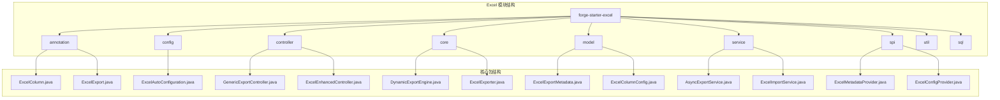
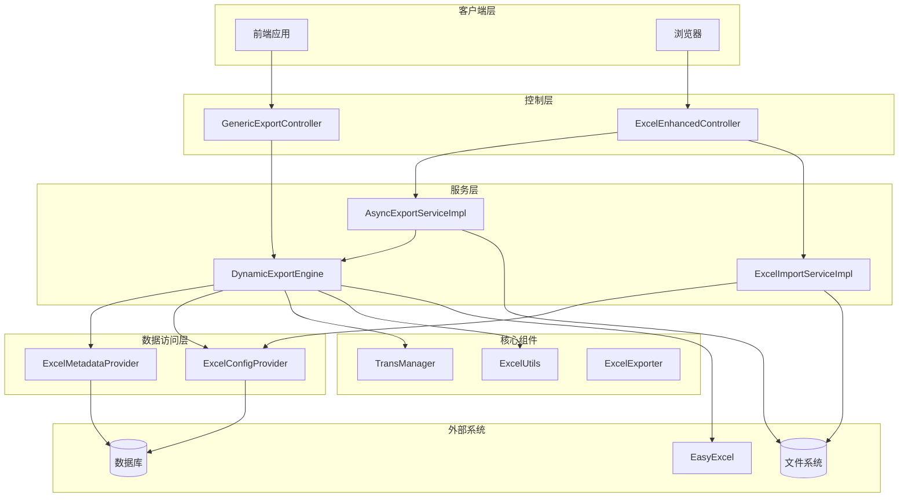
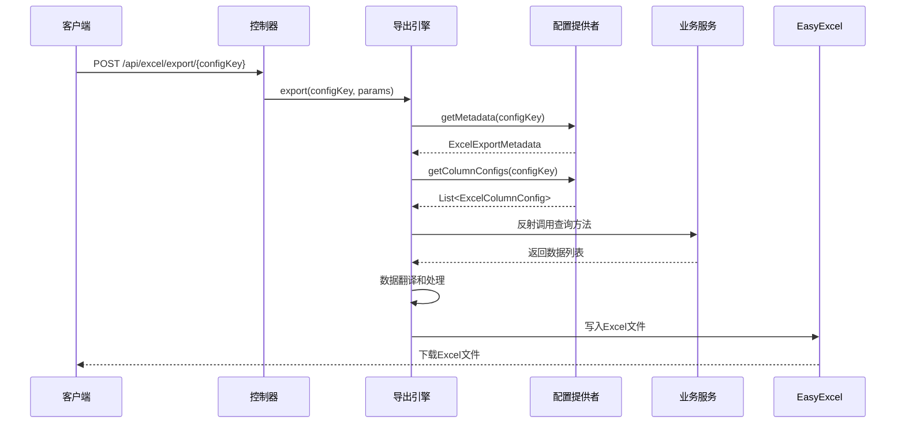
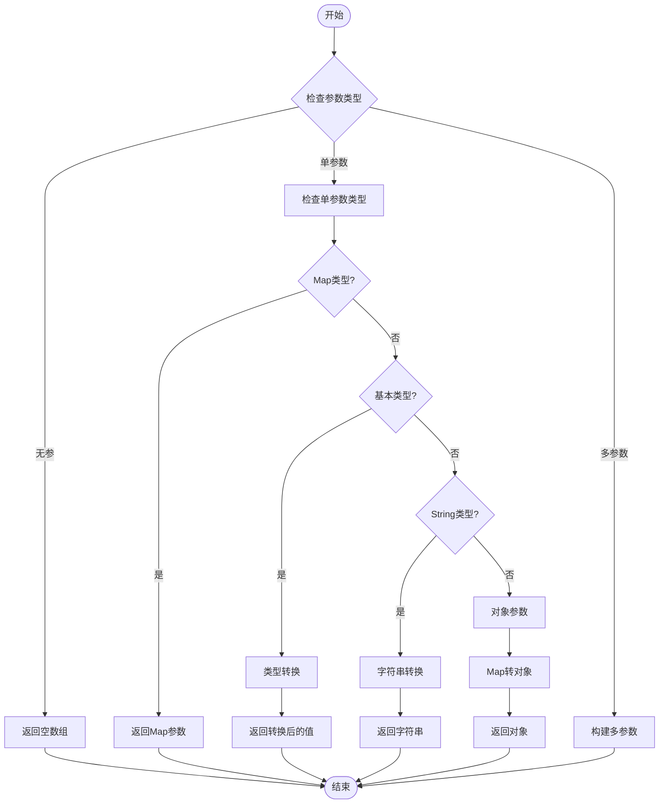
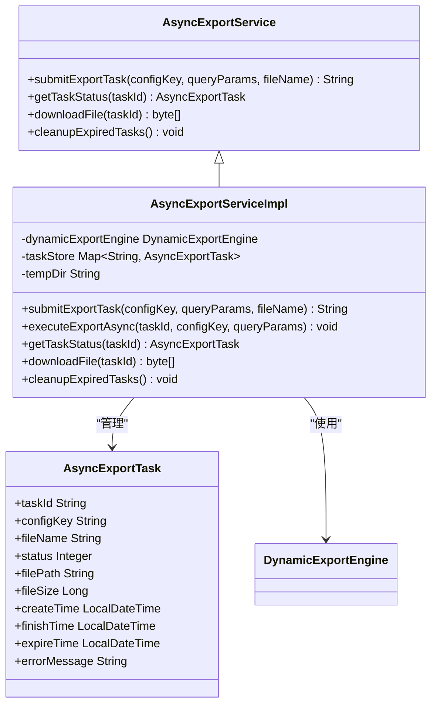
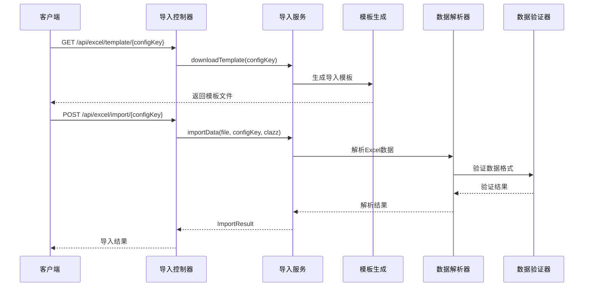
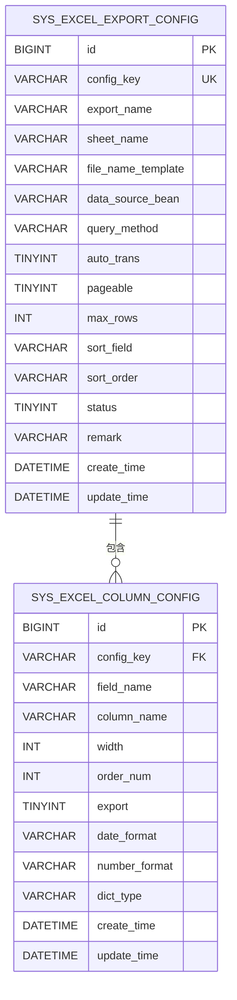
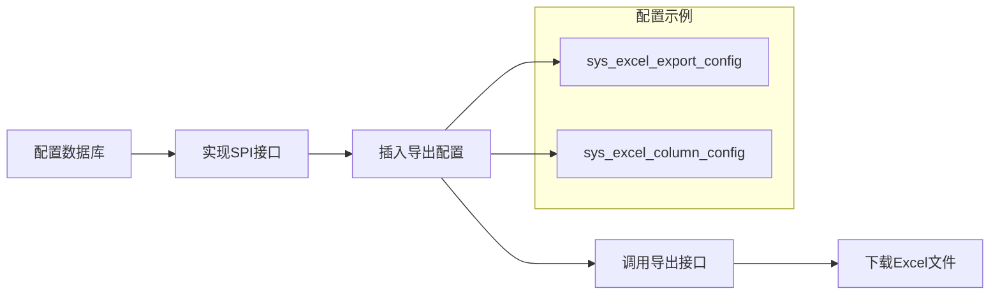

# Forge Starter Excel 项目文档

<cite>
**本文档引用的文件**
- [pom.xml](file://forge/forge-framework/forge-starter-parent/forge-starter-excel/pom.xml)
- [README.md](file://forge/forge-framework/forge-starter-parent/forge-starter-excel/README.md)
- [excel_export_config.sql](file://forge/forge-framework/forge-starter-parent/forge-starter-excel/sql/excel_export_config.sql)
- [GenericExportController.java](file://forge/forge-framework/forge-starter-parent/forge-starter-excel/src/main/java/com/mdframe/forge/starter/excel/controller/GenericExportController.java)
- [DynamicExportEngine.java](file://forge/forge-framework/forge-starter-parent/forge-starter-excel/src/main/java/com/mdframe/forge/starter/excel/core/DynamicExportEngine.java)
- [ExcelMetadataProvider.java](file://forge/forge-framework/forge-starter-parent/forge-starter-excel/src/main/java/com/mdframe/forge/starter/excel/spi/ExcelMetadataProvider.java)
- [ExcelConfigProvider.java](file://forge/forge-framework/forge-starter-parent/forge-starter-excel/src/main/java/com/mdframe/forge/starter/excel/spi/ExcelConfigProvider.java)
- [ExcelExportMetadata.java](file://forge/forge-framework/forge-starter-parent/forge-starter-excel/src/main/java/com/mdframe/forge/starter/excel/model/ExcelExportMetadata.java)
- [ExcelColumnConfig.java](file://forge/forge-framework/forge-starter-parent/forge-starter-excel/src/main/java/com/mdframe/forge/starter/excel/model/ExcelColumnConfig.java)
- [ExcelAutoConfiguration.java](file://forge/forge-framework/forge-starter-parent/forge-starter-excel/src/main/java/com/mdframe/forge/starter/excel/config/ExcelAutoConfiguration.java)
- [ExcelExport.java](file://forge/forge-framework/forge-starter-parent/forge-starter-excel/src/main/java/com/mdframe/forge/starter/excel/annotation/ExcelExport.java)
- [ExcelUtils.java](file://forge/forge-framework/forge-starter-parent/forge-starter-excel/src/main/java/com/mdframe/forge/starter/excel/util/ExcelUtils.java)
- [ExcelEnhancedController.java](file://forge/forge-framework/forge-starter-parent/forge-starter-excel/src/main/java/com/mdframe/forge/starter/excel/controller/ExcelEnhancedController.java)
- [AsyncExportServiceImpl.java](file://forge/forge-framework/forge-starter-parent/forge-starter-excel/src/main/java/com/mdframe/forge/starter/excel/service/impl/AsyncExportServiceImpl.java)
- [ExcelImportServiceImpl.java](file://forge/forge-framework/forge-starter-parent/forge-starter-excel/src/main/java/com/mdframe/forge/starter/excel/service/impl/ExcelImportServiceImpl.java)
- [ExcelExporter.java](file://forge/forge-framework/forge-starter-parent/forge-starter-excel/src/main/java/com/mdframe/forge/starter/excel/core/ExcelExporter.java)
</cite>

## 目录
1. [项目概述](#项目概述)
2. [项目结构](#项目结构)
3. [核心组件](#核心组件)
4. [架构概览](#架构概览)
5. [详细组件分析](#详细组件分析)
6. [数据库设计](#数据库设计)
7. [使用指南](#使用指南)
8. [性能考虑](#性能考虑)
9. [故障排除](#故障排除)
10. [总结](#总结)

## 项目概述

Forge Starter Excel 是一个基于 Spring Boot 的 Excel 导入导出解决方案，采用零代码设计理念，通过数据库配置驱动 Excel 导出功能。该模块提供了完整的 Excel 导入导出能力，包括通用导出接口、异步导出、模板下载、数据验证等功能。

### 核心特性

- **零代码开发**：无需编写导出接口代码，仅通过数据库配置即可实现 Excel 导出
- **动态配置**：支持通过数据库动态配置导出列、样式、字典翻译等
- **灵活参数**：支持多种参数类型的反射调用，包括 Map、实体类、基本类型等
- **异步处理**：提供异步导出功能，支持大数据量导出
- **导入功能**：内置 Excel 导入功能，支持模板下载和错误报告生成
- **字典翻译**：集成字典翻译功能，自动进行数据翻译

## 项目结构



**图表来源**
- [pom.xml:1-42](file://forge/forge-framework/forge-starter-parent/forge-starter-excel/pom.xml#L1-L42)
- [ExcelAutoConfiguration.java:1-46](file://forge/forge-framework/forge-starter-parent/forge-starter-excel/src/main/java/com/mdframe/forge/starter/excel/config/ExcelAutoConfiguration.java#L1-L46)

**章节来源**
- [pom.xml:1-42](file://forge/forge-framework/forge-starter-parent/forge-starter-excel/pom.xml#L1-L42)
- [README.md:1-268](file://forge/forge-framework/forge-starter-parent/forge-starter-excel/README.md#L1-L268)

## 核心组件

### 1. 通用导出控制器
- **GenericExportController**：提供统一的 Excel 导出接口，支持 POST 和 GET 请求
- **ExcelEnhancedController**：增强版控制器，提供导入导出、异步导出等高级功能

### 2. 导出引擎
- **DynamicExportEngine**：动态导出引擎，通过反射调用 Service 方法获取数据
- **ExcelExporter**：静态导出工具类，支持注解驱动的导出配置

### 3. SPI 接口
- **ExcelMetadataProvider**：元数据提供者接口，用于从数据库读取导出配置
- **ExcelConfigProvider**：配置提供者接口，用于读取列配置信息

### 4. 模型类
- **ExcelExportMetadata**：导出元数据模型
- **ExcelColumnConfig**：列配置模型
- **ImportResult**：导入结果模型

**章节来源**
- [GenericExportController.java:1-51](file://forge/forge-framework/forge-starter-parent/forge-starter-excel/src/main/java/com/mdframe/forge/starter/excel/controller/GenericExportController.java#L1-L51)
- [DynamicExportEngine.java:1-569](file://forge/forge-framework/forge-starter-parent/forge-starter-excel/src/main/java/com/mdframe/forge/starter/excel/core/DynamicExportEngine.java#L1-L569)
- [ExcelMetadataProvider.java:1-19](file://forge/forge-framework/forge-starter-parent/forge-starter-excel/src/main/java/com/mdframe/forge/starter/excel/spi/ExcelMetadataProvider.java#L1-L19)
- [ExcelConfigProvider.java:1-21](file://forge/forge-framework/forge-starter-parent/forge-starter-excel/src/main/java/com/mdframe/forge/starter/excel/spi/ExcelConfigProvider.java#L1-L21)

## 架构概览



**图表来源**
- [GenericExportController.java:16-51](file://forge/forge-framework/forge-starter-parent/forge-starter-excel/src/main/java/com/mdframe/forge/starter/excel/controller/GenericExportController.java#L16-L51)
- [ExcelEnhancedController.java:24-218](file://forge/forge-framework/forge-starter-parent/forge-starter-excel/src/main/java/com/mdframe/forge/starter/excel/controller/ExcelEnhancedController.java#L24-L218)
- [DynamicExportEngine.java:31-569](file://forge/forge-framework/forge-starter-parent/forge-starter-excel/src/main/java/com/mdframe/forge/starter/excel/core/DynamicExportEngine.java#L31-L569)

## 详细组件分析

### 动态导出引擎

DynamicExportEngine 是整个 Excel 导出系统的核心组件，负责协调各个组件完成数据导出任务。



**图表来源**
- [GenericExportController.java:32-49](file://forge/forge-framework/forge-starter-parent/forge-starter-excel/src/main/java/com/mdframe/forge/starter/excel/controller/GenericExportController.java#L32-L49)
- [DynamicExportEngine.java:54-93](file://forge/forge-framework/forge-starter-parent/forge-starter-excel/src/main/java/com/mdframe/forge/starter/excel/core/DynamicExportEngine.java#L54-L93)

#### 参数构建机制

引擎支持多种参数类型的自动构建：



**图表来源**
- [DynamicExportEngine.java:174-251](file://forge/forge-framework/forge-starter-parent/forge-starter-excel/src/main/java/com/mdframe/forge/starter/excel/core/DynamicExportEngine.java#L174-L251)

**章节来源**
- [DynamicExportEngine.java:1-569](file://forge/forge-framework/forge-starter-parent/forge-starter-excel/src/main/java/com/mdframe/forge/starter/excel/core/DynamicExportEngine.java#L1-L569)

### 异步导出服务

异步导出服务提供大数据量导出能力，避免长时间阻塞请求线程。



**图表来源**
- [AsyncExportServiceImpl.java:26-178](file://forge/forge-framework/forge-starter-parent/forge-starter-excel/src/main/java/com/mdframe/forge/starter/excel/service/impl/AsyncExportServiceImpl.java#L26-L178)

**章节来源**
- [AsyncExportServiceImpl.java:1-178](file://forge/forge-framework/forge-starter-parent/forge-starter-excel/src/main/java/com/mdframe/forge/starter/excel/service/impl/AsyncExportServiceImpl.java#L1-L178)

### Excel 导入服务

Excel 导入服务提供完整的数据导入功能，包括模板下载、数据校验、错误报告生成等。



**图表来源**
- [ExcelEnhancedController.java:35-81](file://forge/forge-framework/forge-starter-parent/forge-starter-excel/src/main/java/com/mdframe/forge/starter/excel/controller/ExcelEnhancedController.java#L35-L81)
- [ExcelImportServiceImpl.java:116-172](file://forge/forge-framework/forge-starter-parent/forge-starter-excel/src/main/java/com/mdframe/forge/starter/excel/service/impl/ExcelImportServiceImpl.java#L116-L172)

**章节来源**
- [ExcelImportServiceImpl.java:1-289](file://forge/forge-framework/forge-starter-parent/forge-starter-excel/src/main/java/com/mdframe/forge/starter/excel/service/impl/ExcelImportServiceImpl.java#L1-L289)

## 数据库设计

Excel 模块使用两个核心表来存储导出配置信息：



**图表来源**
- [excel_export_config.sql:4-42](file://forge/forge-framework/forge-starter-parent/forge-starter-excel/sql/excel_export_config.sql#L4-L42)

### 配置表结构说明

#### sys_excel_export_config（主配置表）
- **config_key**：配置键，唯一标识导出配置
- **export_name**：导出名称，用于显示
- **data_source_bean**：数据源Bean名称，指向具体的Service类
- **query_method**：查询方法名，调用Service中的查询方法
- **auto_trans**：是否自动翻译字典
- **pageable**：是否分页查询
- **max_rows**：最大导出条数，防止大数据量导出

#### sys_excel_column_config（列配置表）
- **field_name**：实体字段名，对应数据对象的属性
- **column_name**：Excel列名，显示在表头
- **width**：列宽设置
- **order_num**：排序字段，决定列的显示顺序
- **export**：是否导出该列
- **dict_type**：字典类型，用于自动翻译

**章节来源**
- [excel_export_config.sql:1-80](file://forge/forge-framework/forge-starter-parent/forge-starter-excel/sql/excel_export_config.sql#L1-L80)
- [ExcelExportMetadata.java:1-82](file://forge/forge-framework/forge-starter-parent/forge-starter-excel/src/main/java/com/mdframe/forge/starter/excel/model/ExcelExportMetadata.java#L1-L82)
- [ExcelColumnConfig.java:1-81](file://forge/forge-framework/forge-starter-parent/forge-starter-excel/src/main/java/com/mdframe/forge/starter/excel/model/ExcelColumnConfig.java#L1-L81)

## 使用指南

### 快速开始

1. **创建数据库表**：执行 excel_export_config.sql 脚本创建配置表
2. **实现 SPI 接口**：在业务模块中实现 ExcelMetadataProvider 和 ExcelConfigProvider
3. **配置导出规则**：向数据库插入导出配置和列配置
4. **调用导出接口**：通过 /api/excel/export/{configKey} 调用导出功能

### 基本导出示例



**图表来源**
- [README.md:53-129](file://forge/forge-framework/forge-starter-parent/forge-starter-excel/README.md#L53-L129)

### 高级功能

#### 异步导出
```java
// 提交异步导出任务
@PostMapping("/api/excel/async-export/{configKey}")
public ResponseEntity submitAsyncExport(@PathVariable String configKey, 
                                       @RequestBody Map<String,Object> queryParams);

// 查询任务状态
@GetMapping("/api/excel/async-export/status/{taskId}")

// 下载导出文件
@GetMapping("/api/excel/async-export/download/{taskId}")
```

#### 模板导入
```java
// 下载导入模板
@GetMapping("/api/excel/template/{configKey}")

// 导入数据
@PostMapping("/api/excel/import/{configKey}")

// 下载错误报告
@GetMapping("/api/excel/error-report/{taskId}")
```

**章节来源**
- [README.md:133-268](file://forge/forge-framework/forge-starter-parent/forge-starter-excel/README.md#L133-L268)
- [ExcelEnhancedController.java:1-218](file://forge/forge-framework/forge-starter-parent/forge-starter-excel/src/main/java/com/mdframe/forge/starter/excel/controller/ExcelEnhancedController.java#L1-L218)

## 性能考虑

### 内存优化
- **流式写入**：使用 ByteArrayOutputStream 进行内存优化
- **分页查询**：支持分页查询减少内存占用
- **数据截断**：通过 max_rows 限制最大导出条数

### 异步处理
- **异步导出**：大数据量导出使用异步处理避免阻塞
- **任务管理**：提供任务状态查询和过期清理机制
- **临时文件**：异步导出结果存储在临时目录中

### 缓存策略
- **配置缓存**：建议在业务层实现配置缓存
- **字典缓存**：利用 TransManager 的缓存机制
- **连接池**：合理配置数据库连接池

## 故障排除

### 常见问题

#### 导出配置错误
- **问题**：配置键不存在或被禁用
- **解决方案**：检查 sys_excel_export_config 表中的配置状态

#### 数据查询失败
- **问题**：Service Bean 未找到或方法不存在
- **解决方案**：确认 data_source_bean 和 query_method 配置正确

#### 参数类型不匹配
- **问题**：查询方法参数类型与传入参数不匹配
- **解决方案**：检查参数类型转换逻辑或调整查询方法签名

#### 内存溢出
- **问题**：导出数据量过大导致内存不足
- **解决方案**：设置 max_rows 限制或启用分页查询

**章节来源**
- [DynamicExportEngine.java:89-93](file://forge/forge-framework/forge-starter-parent/forge-starter-excel/src/main/java/com/mdframe/forge/starter/excel/core/DynamicExportEngine.java#L89-L93)
- [AsyncExportServiceImpl.java:102-108](file://forge/forge-framework/forge-starter-parent/forge-starter-excel/src/main/java/com/mdframe/forge/starter/excel/service/impl/AsyncExportServiceImpl.java#L102-L108)

## 总结

Forge Starter Excel 提供了一个完整、灵活且易于使用的 Excel 导入导出解决方案。其核心优势包括：

### 技术优势
- **零代码开发**：通过数据库配置实现完全无代码的导出功能
- **高度灵活**：支持动态配置、多种参数类型、异步处理等
- **企业级特性**：包含字典翻译、数据验证、错误处理等企业级功能

### 设计特点
- **模块化设计**：清晰的包结构和职责分离
- **SPI 扩展**：通过接口实现业务定制化
- **Spring Boot 集成**：无缝集成 Spring Boot 生态系统

### 应用场景
- **报表系统**：快速生成各种业务报表
- **数据导出**：批量数据导出和下载
- **数据交换**：与其他系统的数据交换
- **审计日志**：生成审计和操作日志

该模块为 Forge 框架提供了强大的数据导出能力，大大简化了开发流程，提高了开发效率。