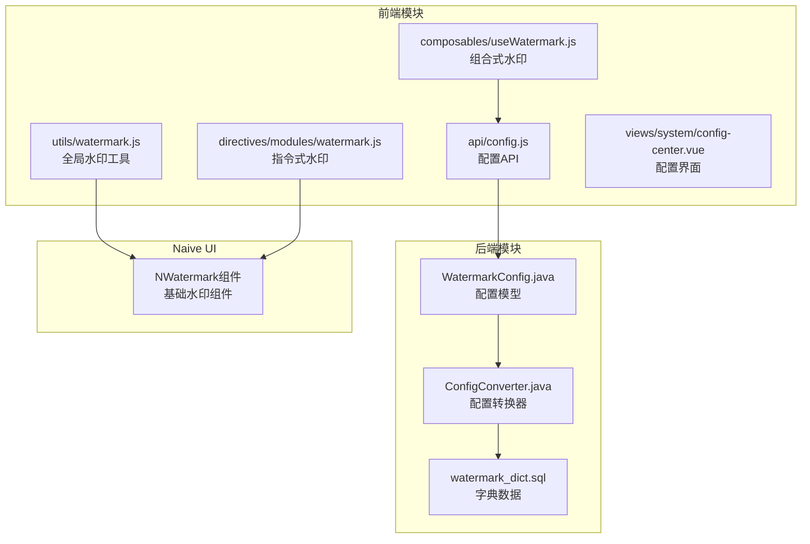
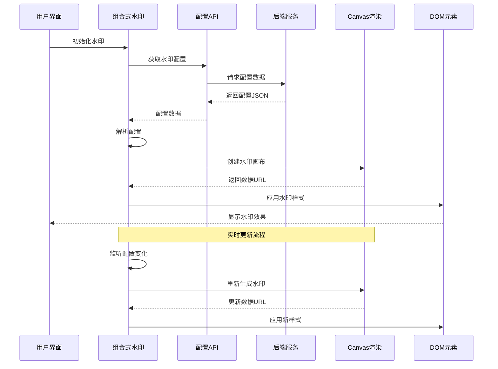
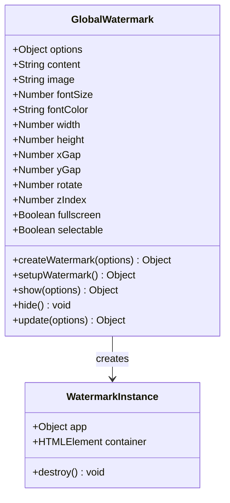
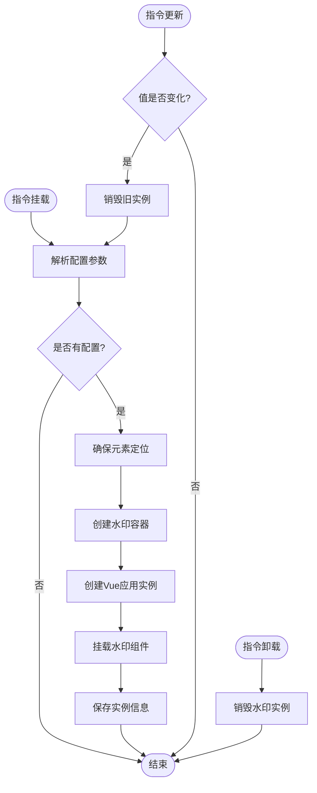
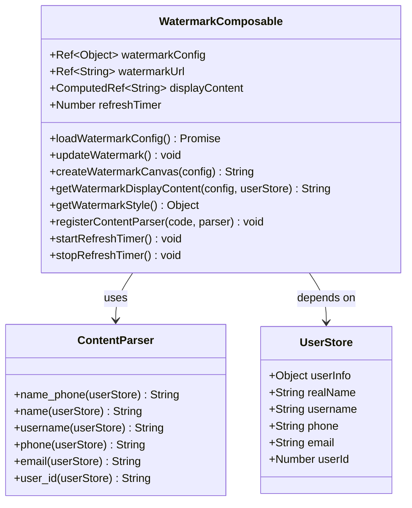
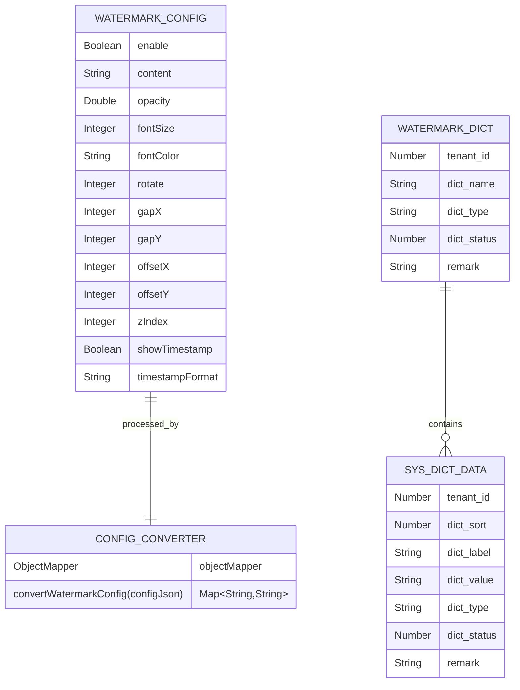
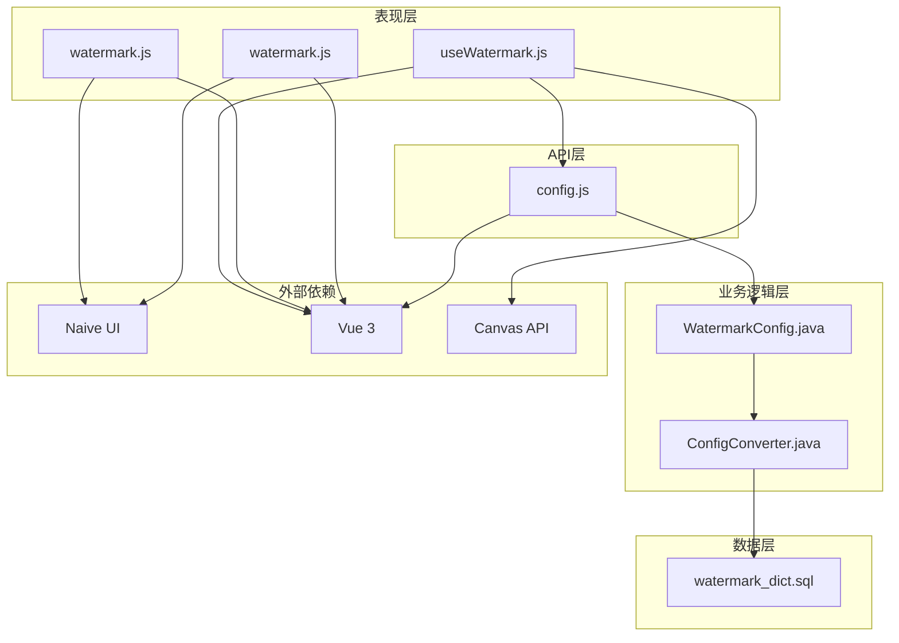

# 水印模块

<cite>
**本文档引用的文件**
- [watermark.js](file://forge-admin-ui/src/utils/watermark.js)
- [watermark.js](file://forge-admin-ui/src/directives/modules/watermark.js)
- [useWatermark.js](file://forge-admin-ui/src/composables/useWatermark.js)
- [watermark_dict.sql](file://forge/forge-framework/forge-starter-parent/forge-starter-config/src/main/resources/sql/watermark_dict.sql)
- [WatermarkConfig.java](file://forge/forge-framework/forge-starter-parent/forge-starter-config/src/main/java/com/mdframe/forge/starter/config/config/WatermarkConfig.java)
- [ConfigConverter.java](file://forge/forge-framework/forge-starter-parent/forge-starter-config/src/main/java/com/mdframe/forge/starter/config/converter/ConfigConverter.java)
- [config.js](file://forge-admin-ui/src/api/config.js)
- [config-center.vue](file://forge-admin-ui/src/views/system/config-center.vue)
</cite>

## 目录
1. [简介](#简介)
2. [项目结构](#项目结构)
3. [核心组件](#核心组件)
4. [架构概览](#架构概览)
5. [详细组件分析](#详细组件分析)
6. [依赖关系分析](#依赖关系分析)
7. [性能考虑](#性能考虑)
8. [故障排除指南](#故障排除指南)
9. [结论](#结论)

## 简介

Forge项目的水印模块是一个完整的文档保护解决方案，提供了多种水印实现方式和灵活的配置管理。该模块支持全局水印、元素级水印和动态水印三种模式，能够根据用户身份信息动态生成个性化水印内容。

水印模块的核心特性包括：
- **多模式支持**：全局全屏水印、元素内水印、基于Canvas的动态水印
- **灵活配置**：支持透明度、字体大小、颜色、旋转角度等全方位定制
- **动态内容**：可根据用户登录信息动态生成水印内容
- **实时更新**：支持配置变更的实时生效和时间戳自动更新
- **字典管理**：提供标准化的水印内容类型字典配置

## 项目结构

水印模块在Forge项目中的组织结构如下：

**图表来源**
- [watermark.js:1-132](file://forge-admin-ui/src/utils/watermark.js#L1-L132)
- [watermark.js:1-129](file://forge-admin-ui/src/directives/modules/watermark.js#L1-L129)
- [useWatermark.js:1-299](file://forge-admin-ui/src/composables/useWatermark.js#L1-L299)
- [WatermarkConfig.java:1-75](file://forge/forge-framework/forge-starter-parent/forge-starter-config/src/main/java/com/mdframe/forge/starter/config/config/WatermarkConfig.java#L1-L75)

**章节来源**
- [watermark.js:1-132](file://forge-admin-ui/src/utils/watermark.js#L1-L132)
- [watermark.js:1-129](file://forge-admin-ui/src/directives/modules/watermark.js#L1-L129)
- [useWatermark.js:1-299](file://forge-admin-ui/src/composables/useWatermark.js#L1-L299)

## 核心组件

### 前端组件

#### 全局水印工具
提供页面级全屏水印功能，支持一次性创建和销毁操作。

#### 指令式水印
通过Vue指令为单个元素添加水印效果，支持响应式更新。

#### 组合式水印
基于Vue 3 Composition API的水印解决方案，提供完整的生命周期管理和状态控制。

### 后端组件

#### 水印配置模型
定义了完整的水印配置参数结构，包括启用状态、内容、样式属性等。

#### 配置转换器
负责将JSON格式的配置数据转换为系统配置键值对格式。

**章节来源**
- [WatermarkConfig.java:1-75](file://forge/forge-framework/forge-starter-parent/forge-starter-config/src/main/java/com/mdframe/forge/starter/config/config/WatermarkConfig.java#L1-L75)
- [ConfigConverter.java:1-189](file://forge/forge-framework/forge-starter-parent/forge-starter-config/src/main/java/com/mdframe/forge/starter/config/converter/ConfigConverter.java#L1-L189)

## 架构概览

水印模块采用前后端分离的架构设计，实现了完整的水印功能生态系统：

**图表来源**
- [useWatermark.js:158-296](file://forge-admin-ui/src/composables/useWatermark.js#L158-L296)
- [config.js:49-63](file://forge-admin-ui/src/api/config.js#L49-L63)

## 详细组件分析

### 全局水印工具分析

全局水印工具提供了最简单的水印使用方式，通过一个函数调用即可实现全屏水印效果。

**图表来源**
- [watermark.js:25-86](file://forge-admin-ui/src/utils/watermark.js#L25-L86)

#### 主要功能特性

1. **配置灵活性**：支持完整的水印属性配置，包括文本内容、图片、字体样式等
2. **生命周期管理**：提供完整的创建、显示、隐藏、销毁生命周期
3. **默认值优化**：预设合理的默认值，确保开箱即用
4. **内存管理**：自动处理DOM元素的创建和销毁，防止内存泄漏

**章节来源**
- [watermark.js:1-132](file://forge-admin-ui/src/utils/watermark.js#L1-L132)

### 指令式水印分析

指令式水印通过Vue指令的方式为DOM元素添加水印效果，具有更好的复用性和维护性。

**图表来源**
- [watermark.js:24-128](file://forge-admin-ui/src/directives/modules/watermark.js#L24-L128)

#### 核心实现机制

1. **WeakMap存储**：使用WeakMap存储元素与水印实例的映射关系
2. **响应式更新**：监听指令值的变化，自动更新水印内容
3. **内存安全**：确保每个元素只对应一个水印实例
4. **定位处理**：自动处理元素的CSS定位属性

**章节来源**
- [watermark.js:1-129](file://forge-admin-ui/src/directives/modules/watermark.js#L1-L129)

### 组合式水印分析

组合式水印是水印模块的核心实现，提供了最完整和强大的功能集。

**图表来源**
- [useWatermark.js:158-296](file://forge-admin-ui/src/composables/useWatermark.js#L158-L296)

#### 高级功能特性

1. **动态内容解析**：支持基于用户信息的动态水印内容生成
2. **Canvas渲染**：使用HTML5 Canvas进行高质量的水印渲染
3. **时间戳功能**：支持可选的时间戳显示和自动更新
4. **配置持久化**：通过API接口实现配置的远程管理
5. **响应式设计**：自动响应配置变化和用户状态变化

**章节来源**
- [useWatermark.js:1-299](file://forge-admin-ui/src/composables/useWatermark.js#L1-L299)

### 后端配置管理分析

后端提供了完整的水印配置管理能力，包括配置模型定义、数据转换和字典管理。

**图表来源**
- [WatermarkConfig.java:9-75](file://forge/forge-framework/forge-starter-parent/forge-starter-config/src/main/java/com/mdframe/forge/starter/config/config/WatermarkConfig.java#L9-L75)
- [ConfigConverter.java:42-61](file://forge/forge-framework/forge-starter-parent/forge-starter-config/src/main/java/com/mdframe/forge/starter/config/converter/ConfigConverter.java#L42-L61)

#### 配置转换机制

1. **JSON解析**：将前端传入的JSON配置转换为Java对象
2. **键值映射**：将配置项映射到系统标准的配置键
3. **类型转换**：自动处理不同数据类型的转换
4. **默认值处理**：确保缺失配置项的合理默认值

**章节来源**
- [watermark_dict.sql:1-14](file://forge/forge-framework/forge-starter-parent/forge-starter-config/src/main/resources/sql/watermark_dict.sql#L1-L14)
- [ConfigConverter.java:1-189](file://forge/forge-framework/forge-starter-parent/forge-starter-config/src/main/java/com/mdframe/forge/starter/config/converter/ConfigConverter.java#L1-L189)

## 依赖关系分析

水印模块的依赖关系体现了清晰的分层架构：

**图表来源**
- [useWatermark.js:1-3](file://forge-admin-ui/src/composables/useWatermark.js#L1-L3)
- [watermark.js:5-6](file://forge-admin-ui/src/utils/watermark.js#L5-L6)
- [watermark.js:13-14](file://forge-admin-ui/src/directives/modules/watermark.js#L13-L14)

### 关键依赖点

1. **Vue生态集成**：完全基于Vue 3生态系统构建
2. **Naive UI组件库**：利用成熟的UI组件实现高质量的水印效果
3. **Canvas API**：使用原生Canvas API实现高性能的水印渲染
4. **配置系统**：与Forge框架的统一配置管理系统深度集成

**章节来源**
- [config-center.vue:84-153](file://forge-admin-ui/src/views/system/config-center.vue#L84-L153)

## 性能考虑

水印模块在设计时充分考虑了性能优化：

### 渲染性能优化

1. **Canvas缓存**：水印内容渲染完成后缓存为图像数据，避免重复计算
2. **懒加载策略**：只有在需要时才创建和渲染水印元素
3. **内存管理**：及时清理不再使用的DOM元素和Vue实例
4. **事件节流**：对频繁触发的配置更新进行节流处理

### 内存管理

1. **WeakMap引用**：使用WeakMap避免循环引用导致的内存泄漏
2. **定时器清理**：组件卸载时自动清理所有定时器
3. **实例销毁**：提供完整的实例销毁机制

### 网络优化

1. **配置缓存**：配置数据获取后进行本地缓存
2. **批量更新**：支持配置的批量更新以减少网络请求
3. **增量更新**：只更新发生变化的配置项

## 故障排除指南

### 常见问题及解决方案

#### 水印不显示问题

**症状**：水印配置正确但页面无水印效果

**可能原因**：
1. CSS z-index层级过低被其他元素遮挡
2. 页面内容区域设置了overflow: hidden
3. 水印内容为空或用户信息未加载

**解决步骤**：
1. 检查水印样式中的z-index值
2. 确认目标元素的CSS定位属性
3. 验证用户登录状态和信息完整性

#### 水印内容不更新问题

**症状**：修改配置后水印内容未实时更新

**可能原因**：
1. 配置监听器未正确触发
2. Canvas实例未重新创建
3. 缓存的数据URL未更新

**解决步骤**：
1. 检查配置变更监听逻辑
2. 确认updateWatermark函数正常执行
3. 验证数据URL的重新生成

#### 性能问题

**症状**：页面卡顿或水印渲染缓慢

**可能原因**：
1. Canvas尺寸过大
2. 频繁的配置更新
3. 多个水印实例同时存在

**优化建议**：
1. 调整水印尺寸和间距参数
2. 减少配置更新频率
3. 确保及时销毁不需要的水印实例

**章节来源**
- [useWatermark.js:172-182](file://forge-admin-ui/src/composables/useWatermark.js#L172-L182)
- [watermark.js:100-110](file://forge-admin-ui/src/utils/watermark.js#L100-L110)

## 结论

Forge项目的水印模块是一个设计精良、功能完整的文档保护解决方案。它通过多层次的实现方式满足了不同的使用场景需求，从简单的全局水印到复杂的动态水印配置，都提供了优雅的解决方案。

### 主要优势

1. **多模式支持**：覆盖了从简单到复杂的所有水印使用场景
2. **配置灵活**：提供了全面的水印样式和行为配置选项
3. **性能优化**：通过缓存和懒加载机制确保良好的运行性能
4. **易于集成**：与Vue生态系统的无缝集成，使用简单
5. **扩展性强**：支持自定义内容解析器和配置转换器

### 技术亮点

1. **Canvas渲染**：使用原生Canvas API实现高质量的水印效果
2. **响应式设计**：充分利用Vue 3的响应式系统实现配置的实时更新
3. **内存安全**：完善的生命周期管理确保内存资源的有效利用
4. **配置管理**：与框架的统一配置系统深度集成

该水印模块为Forge项目提供了强大的文档保护能力，不仅满足了当前的需求，也为未来的功能扩展奠定了坚实的基础。