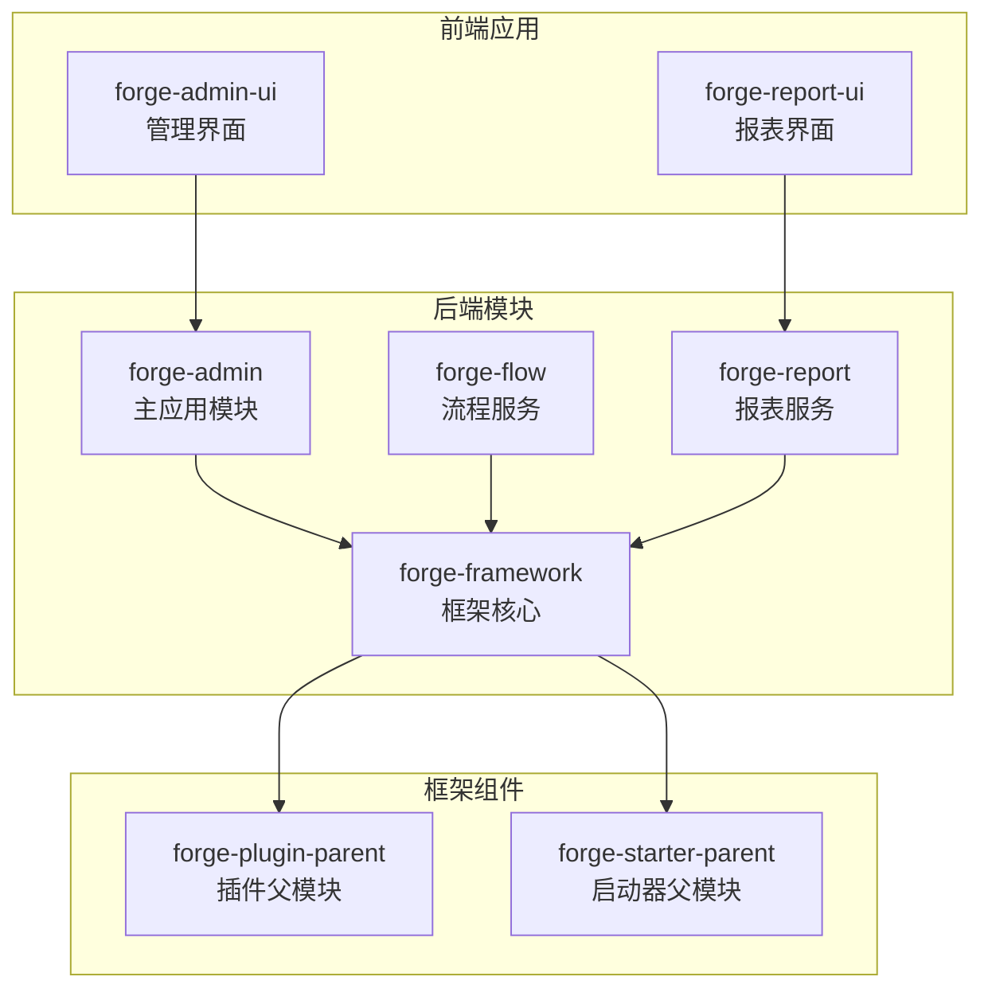
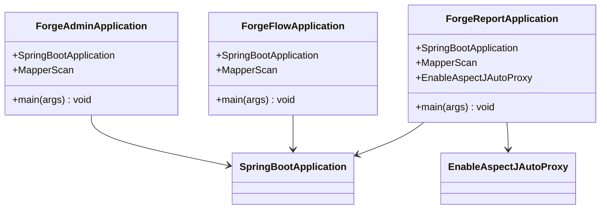
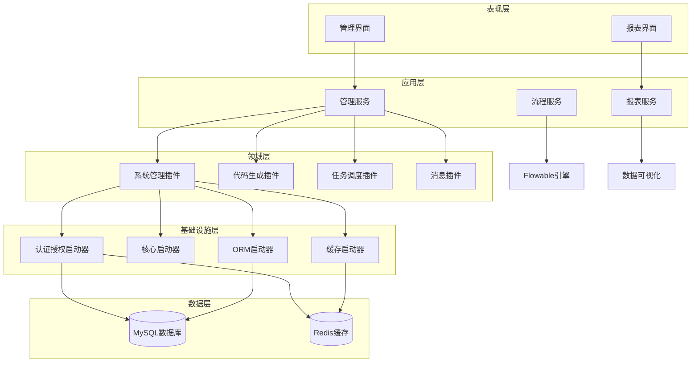
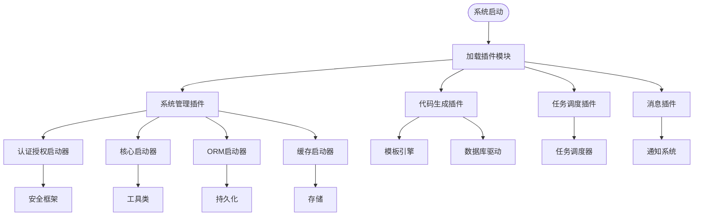
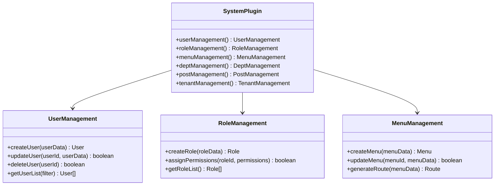
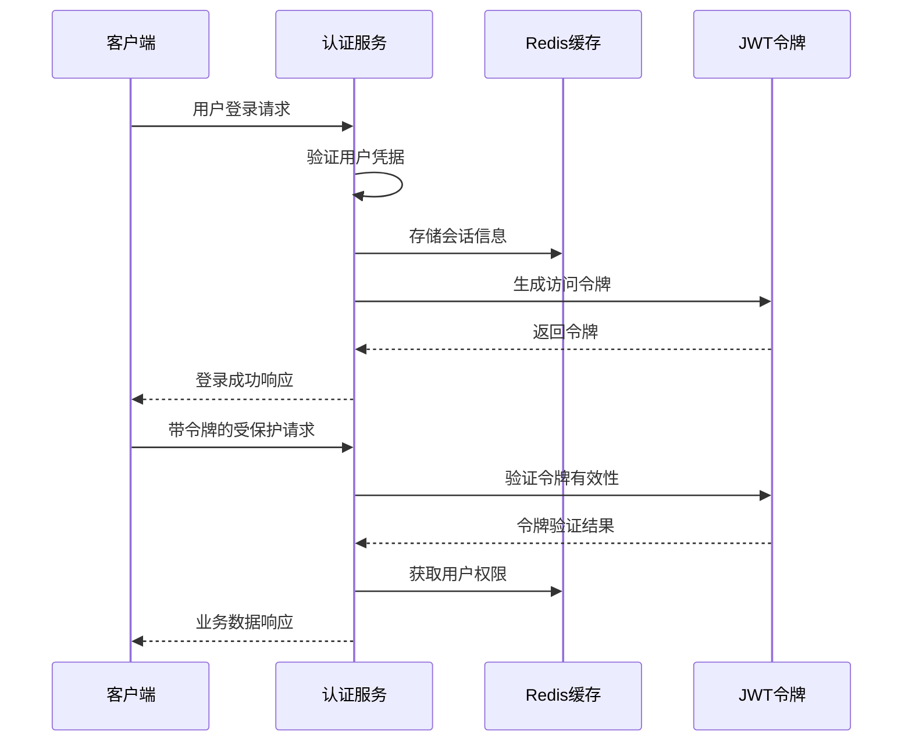
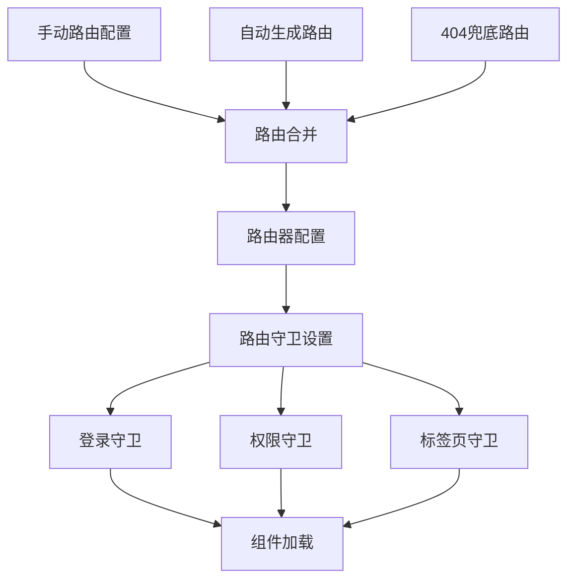
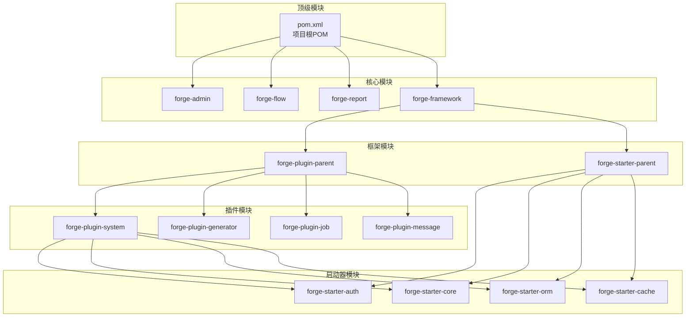

# 仪表板项目管理

<cite>
**本文档引用的文件**
- [README.md](file://README.md)
- [ForgeAdminApplication.java](file://forge/forge-admin/src/main/java/com/mdframe/forge/admin/ForgeAdminApplication.java)
- [ForgeFlowApplication.java](file://forge/forge-flow/src/main/java/com/mdframe/forge/flow/ForgeFlowApplication.java)
- [ForgeReportApplication.java](file://forge/forge-report/src/main/java/com/mdframe/forge/report/ForgeReportApplication.java)
- [application.yml](file://forge/forge-admin/src/main/resources/application.yml)
- [package.json](file://forge-admin-ui/package.json)
- [main.js](file://forge-admin-ui/src/main.js)
- [router/index.js](file://forge-admin-ui/src/router/index.js)
- [store/index.js](file://forge-admin-ui/src/store/index.js)
- [package.json](file://forge-report-ui/package.json)
- [main.ts](file://forge-report-ui/src/main.ts)
- [forge-starter-auth/pom.xml](file://forge/forge-framework/forge-starter-parent/forge-starter-auth/pom.xml)
- [forge-starter-core/pom.xml](file://forge/forge-framework/forge-starter-parent/forge-starter-core/pom.xml)
- [forge-plugin-system/pom.xml](file://forge/forge-framework/forge-plugin-parent/forge-plugin-system/pom.xml)
- [forge-plugin-generator/pom.xml](file://forge/forge-framework/forge-plugin-parent/forge-plugin-generator/pom.xml)
</cite>

## 目录
1. [项目概述](#项目概述)
2. [项目结构](#项目结构)
3. [核心组件](#核心组件)
4. [架构概览](#架构概览)
5. [详细组件分析](#详细组件分析)
6. [依赖关系分析](#依赖关系分析)
7. [性能考虑](#性能考虑)
8. [故障排除指南](#故障排除指南)
9. [结论](#结论)

## 项目概述

Forge Admin 是一个基于 Vue3 + TypeScript 的开箱即用企业级中后台管理框架。该项目采用微内核 + 插件化架构，旨在为企业提供快速开发和业务扩展的中后台基础框架。

### 核心特性

- **微内核架构**：核心框架轻量级，功能通过插件扩展
- **多租户支持**：完善的多租户体系，支持数据隔离
- **权限管理**：基于 RBAC 的细粒度权限控制
- **代码生成**：可视化代码生成，快速构建业务模块
- **动态 API**：运行时 API 配置管理，支持动态调整接口行为
- **任务调度**：分布式任务调度，支持 Cron 表达式
- **流程管理**：基于 Flowable 自研的轻量级流程管理模块
- **消息中心**：统一消息管理，支持多种通知渠道
- **系统监控**：实时系统监控，掌握服务器状态
- **数据加解密**：支持接口数据加解密，字段加解密

### 技术栈

**后端技术栈**
- Spring Boot：应用开发框架
- Spring Cloud：微服务框架（可选）
- MyBatis-Plus：ORM 框架
- Sa-Token：认证授权框架
- Redisson：分布式缓存
- Quartz：任务调度
- Spring Cloud Gateway：网关（可选）

**前端技术栈**
- Vue 3：渐进式前端框架
- Naive UI：Vue 3 组件库
- Pinia：状态管理
- Vue Router：路由管理
- Vite：构建工具
- UnoCSS：原子化 CSS

## 项目结构

项目采用多模块架构设计，包含后端主应用、流程服务、报表服务以及两个前端应用：

**图表来源**
- [README.md:136-172](file://README.md#L136-L172)

### 后端模块说明

**主应用模块 (forge-admin)**
- 包含完整的系统管理功能
- 提供用户、角色、菜单、部门等管理模块
- 集成多租户支持和权限控制

**流程服务 (forge-flow)**
- 基于 Flowable 工作流引擎
- 提供轻量级流程管理模块
- 支持业务流程的配置和执行

**报表服务 (forge-report)**
- 数据可视化大屏后端服务
- 提供报表和数据分析功能
- 支持多种图表和可视化组件

**框架核心 (forge-framework)**
- forge-plugin-parent：插件父模块
- forge-starter-parent：启动器父模块
- 提供基础功能和扩展机制

**图表来源**
- [README.md:138-154](file://README.md#L138-L154)

### 前端应用结构

**管理界面 (forge-admin-ui)**
- 基于 Vue 3 + TypeScript
- 提供完整的后台管理功能
- 包含系统管理、流程管理、报表等功能模块

**报表界面 (forge-report-ui)**
- 专注于数据可视化和报表展示
- 提供丰富的图表和交互组件
- 支持实时数据展示和分析

**图表来源**
- [README.md:156-172](file://README.md#L156-L172)

**章节来源**
- [README.md:136-172](file://README.md#L136-L172)

## 核心组件

### 后端启动类分析

项目包含三个主要的 Spring Boot 启动类，分别对应不同的服务模块：

**图表来源**
- [ForgeAdminApplication.java:1-20](file://forge/forge-admin/src/main/java/com/mdframe/forge/admin/ForgeAdminApplication.java#L1-L20)
- [ForgeFlowApplication.java:1-20](file://forge/forge-flow/src/main/java/com/mdframe/forge/flow/ForgeFlowApplication.java#L1-L20)
- [ForgeReportApplication.java:1-26](file://forge/forge-report/src/main/java/com/mdframe/forge/report/ForgeReportApplication.java#L1-L26)

### 前端应用初始化流程

**管理界面初始化**
- 应用创建和依赖注入
- Store 状态管理初始化
- 路由系统配置
- 主题和样式应用

**报表界面初始化**
- 多层次应用实例创建
- 插件系统注册
- 国际化配置
- 图标和样式资源加载

**章节来源**
- [main.js:17-39](file://forge-admin-ui/src/main.js#L17-L39)
- [main.ts:25-68](file://forge-report-ui/src/main.ts#L25-L68)

## 架构概览

项目采用分层架构设计，结合微服务和插件化模式：

**图表来源**
- [README.md:28-40](file://README.md#L28-L40)
- [forge-plugin-system/pom.xml:15-83](file://forge/forge-framework/forge-plugin-parent/forge-plugin-system/pom.xml#L15-L83)
- [forge-starter-auth/pom.xml:14-87](file://forge/forge-framework/forge-starter-parent/forge-starter-auth/pom.xml#L14-L87)

### 插件化架构

系统采用插件化架构，通过 Maven 模块管理实现功能扩展：

**图表来源**
- [forge-plugin-system/pom.xml:15-83](file://forge/forge-framework/forge-plugin-parent/forge-plugin-system/pom.xml#L15-L83)
- [forge-plugin-generator/pom.xml:14-62](file://forge/forge-framework/forge-plugin-parent/forge-plugin-generator/pom.xml#L14-L62)

**章节来源**
- [README.md:28-40](file://README.md#L28-L40)

## 详细组件分析

### 系统管理插件

系统管理插件是项目的核心模块，提供完整的后台管理功能：

**图表来源**
- [forge-plugin-system/pom.xml:15-83](file://forge/forge-framework/forge-plugin-parent/forge-plugin-system/pom.xml#L15-L83)

### 认证授权系统

基于 Sa-Token 的认证授权系统提供了完善的安全控制：

**图表来源**
- [forge-starter-auth/pom.xml:25-46](file://forge/forge-framework/forge-starter-parent/forge-starter-auth/pom.xml#L25-L46)

### 前端路由系统

管理界面采用灵活的路由配置系统：

**图表来源**
- [router/index.js:5-114](file://forge-admin-ui/src/router/index.js#L5-L114)

**章节来源**
- [forge-starter-auth/pom.xml:14-87](file://forge/forge-framework/forge-starter-parent/forge-starter-auth/pom.xml#L14-L87)
- [router/index.js:1-114](file://forge-admin-ui/src/router/index.js#L1-L114)

## 依赖关系分析

### Maven 依赖层次

项目采用分层的 Maven 依赖管理：

**图表来源**
- [forge-plugin-system/pom.xml:15-83](file://forge/forge-framework/forge-plugin-parent/forge-plugin-system/pom.xml#L15-L83)
- [forge-starter-auth/pom.xml:14-87](file://forge/forge-framework/forge-starter-parent/forge-starter-auth/pom.xml#L14-L87)

### 前端依赖分析

**管理界面依赖特点**
- Vue 3.5.20：最新版本的 Vue 框架
- Naive UI 2.42.0：现代化的 Vue 3 组件库
- Pinia 3.0.3：Vue 3 的状态管理
- Vite 7.1.3：高性能的构建工具

**报表界面依赖特点**
- Vue 3.5.13：稳定的 Vue 3 版本
- @visactor/vchart 2.0.0：专业的可视化图表库
- ECharts 5.3.2：成熟的图表解决方案
- TypeScript 4.6.3：类型安全的 JavaScript

**章节来源**
- [package.json:15-79](file://forge-admin-ui/package.json#L15-L79)
- [package.json:16-93](file://forge-report-ui/package.json#L16-L93)

## 性能考虑

### 后端性能优化

**数据库连接池配置**
- HikariCP：高性能的 JDBC 连接池
- 连接池大小：根据并发需求合理配置
- 连接超时：避免长时间阻塞

**缓存策略**
- Redis 缓存：热点数据缓存
- 多级缓存：本地缓存 + 分布式缓存
- 缓存失效：合理的过期策略

**异步处理**
- 任务调度：Quartz 分布式调度
- 异步方法：@Async 注解标记
- 消息队列：异步解耦

### 前端性能优化

**构建优化**
- Vite 构建：快速的开发体验
- 代码分割：按需加载模块
- Tree Shaking：移除无用代码

**运行时优化**
- 组件懒加载：减少初始包体积
- 图片优化：压缩和格式选择
- 样式优化：CSS 压缩和提取

## 故障排除指南

### 常见启动问题

**数据库连接失败**
- 检查数据库连接字符串
- 验证数据库服务状态
- 确认网络连通性

**Redis 连接问题**
- 检查 Redis 服务器配置
- 验证认证信息
- 确认防火墙设置

**端口冲突**
- 修改应用端口号
- 检查端口占用情况
- 配置反向代理

### 配置文件管理

**环境配置分离**
- 开发环境：application-dev.yml
- 测试环境：application-test.yml
- 生产环境：application-prod.yml

**敏感信息保护**
- 不要提交包含敏感信息的配置文件
- 使用环境变量替代硬编码
- 定期轮换密钥和密码

**章节来源**
- [application.yml:1-102](file://forge/forge-admin/src/main/resources/application.yml#L1-L102)

## 结论

Forge Admin 项目展现了现代企业级中后台管理系统的最佳实践。通过微内核 + 插件化的架构设计，项目实现了高度的模块化和可扩展性。前后端分离的架构配合完善的权限管理和数据安全机制，为企业提供了可靠的技术基础。

项目的主要优势包括：

1. **架构清晰**：模块化设计便于维护和扩展
2. **功能完整**：涵盖企业后台管理的核心需求
3. **技术先进**：采用最新的技术和工具链
4. **易于使用**：提供开箱即用的功能和配置

对于后续的开发和维护，建议重点关注插件系统的扩展性和性能优化，同时保持代码质量和文档的完整性。