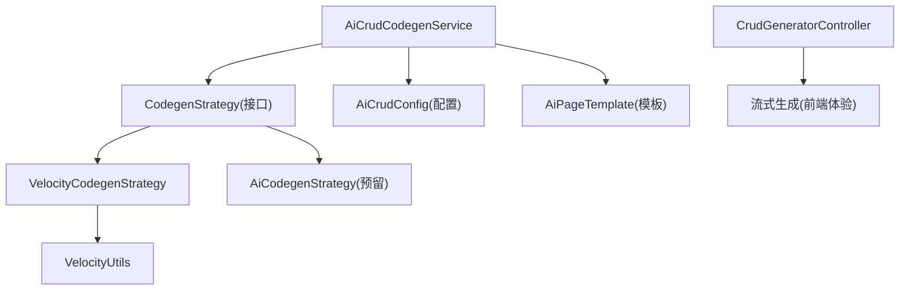
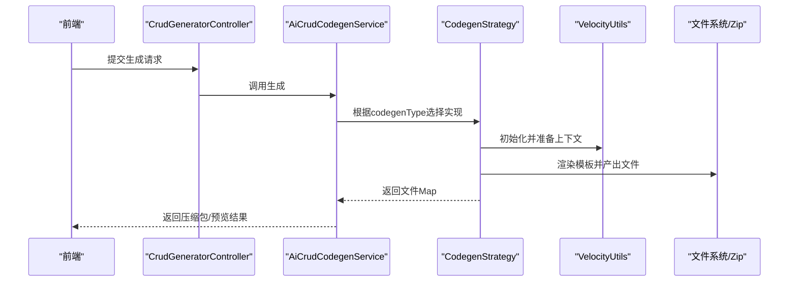
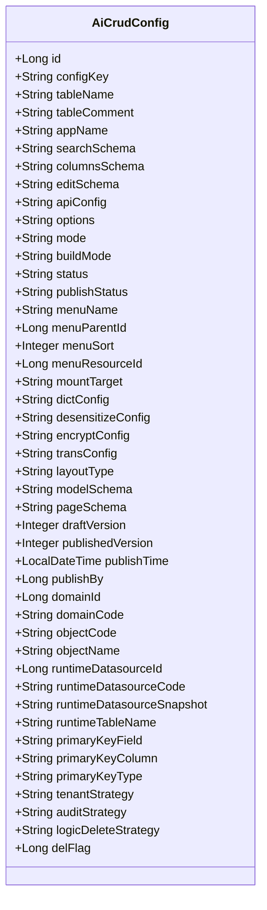
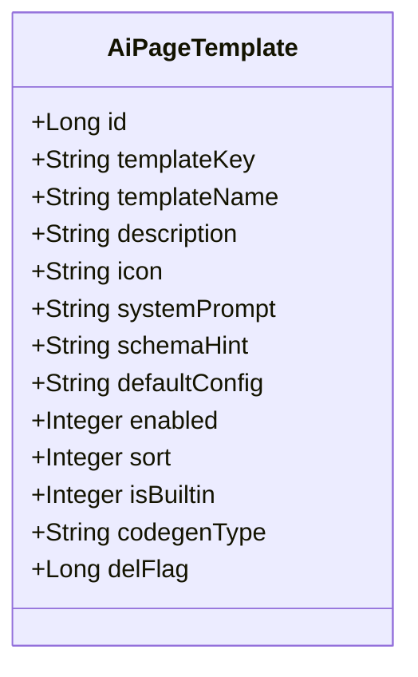
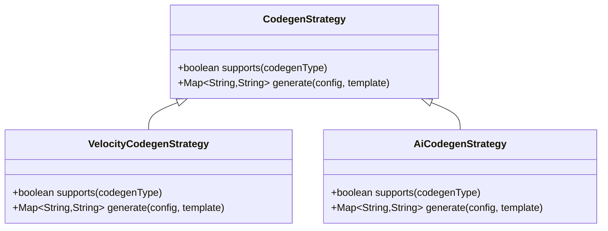
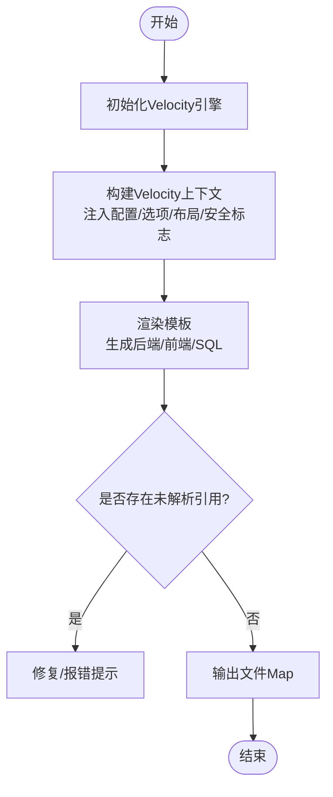
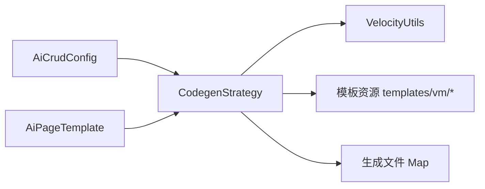

# CRUD生成器

<cite>
**本文引用的文件**
- [README.md](file://README.md)
- [SKILL.md](file://.agents/skills/forge-codegen-crud/SKILL.md)
- [single-table-crud.md](file://.agents/skills/forge-codegen-crud/references/single-table-crud.md)
- [sql-seeds.md](file://.agents/skills/forge-codegen-crud/references/sql-seeds.md)
- [validation-checklist.md](file://.agents/skills/forge-codegen-crud/references/validation-checklist.md)
- [CodegenStrategy.java](file://forge-server/forge-framework/forge-plugin-parent/forge-plugin-generator/src/main/java/com/mdframe/forge/plugin/generator/codegen/CodegenStrategy.java)
- [VelocityCodegenStrategy.java](file://forge-server/forge-framework/forge-plugin-parent/forge-plugin-generator/src/main/java/com/mdframe/forge/plugin/generator/codegen/VelocityCodegenStrategy.java)
- [AiCodegenStrategy.java](file://forge-server/forge-framework/forge-plugin-parent/forge-plugin-generator/src/main/java/com/mdframe/forge/plugin/generator/codegen/AiCodegenStrategy.java)
- [AiCrudCodegenService.java](file://forge-server/forge-framework/forge-plugin-parent/forge-plugin-generator/src/main/java/com/mdframe/forge/plugin/generator/service/AiCrudCodegenService.java)
- [AiCrudConfig.java](file://forge-server/forge-framework/forge-plugin-parent/forge-plugin-generator/src/main/java/com/mdframe/forge/plugin/generator/domain/entity/AiCrudConfig.java)
- [AiPageTemplate.java](file://forge-server/forge-framework/forge-plugin-parent/forge-plugin-generator/src/main/java/com/mdframe/forge/plugin/generator/domain/entity/AiPageTemplate.java)
- [VelocityUtils.java](file://forge-server/forge-framework/forge-plugin-parent/forge-plugin-generator/src/main/java/com/mdframe/forge/plugin/generator/util/VelocityUtils.java)
- [GenTemplateServiceImpl.java](file://forge-server/forge-framework/forge-plugin-parent/forge-plugin-generator/src/main/java/com/mdframe/forge/plugin/generator/service/impl/GenTemplateServiceImpl.java)
- [CrudGeneratorController.java](file://forge-server/forge-framework/forge-plugin-parent/forge-plugin-generator/src/main/java/com/mdframe/forge/plugin/generator/controller/CrudGeneratorController.java)
- [2026-04-21-crud-generator-design.md](file://docs/superpowers/specs/2026-04-21-crud-generator-design.md)
</cite>

## 目录
1. [简介](#简介)
2. [项目结构](#项目结构)
3. [核心组件](#核心组件)
4. [架构总览](#架构总览)
5. [详细组件分析](#详细组件分析)
6. [依赖关系分析](#依赖关系分析)
7. [性能与扩展性](#性能与扩展性)
8. [故障排查指南](#故障排查指南)
9. [结论](#结论)
10. [附录：配置示例与最佳实践](#附录：配置示例与最佳实践)

## 简介
本技术文档面向“CRUD生成器”能力，围绕基于业务对象的自动代码生成、页面模板定制和API接口生成展开。重点说明：
- 生成规则配置：通过配置项控制后端包路径、输出目录、是否包含前后端、实体前缀、表名前缀剥离等。
- 页面布局定制：支持单表CRUD、树形列表（左树右表）、主子表CRUD等多种布局类型。
- 查询条件构建：通过searchSchema声明式定义搜索字段、控件类型、字典绑定与过滤逻辑。
- 操作权限控制：菜单与按钮资源、API资源、RBAC绑定与前端按钮显隐。
- 批量操作、导入导出、搜索过滤、分页：统一由模板与通用Excel能力驱动。
- 自定义扩展：通过静态代码生成贡献者、模板覆盖、AI策略预留扩展点。

该生成器以“配置即产物”的方式工作：维护一份结构化配置（模型、页面、API、选项），即可稳定生成后端Java代码、Mapper XML、SQL种子数据以及前端Vue页面与API调用。

**章节来源**
- [README.md:29-72](file://README.md#L29-L72)
- [SKILL.md:1-57](file://.agents/skills/forge-codegen-crud/SKILL.md#L1-L57)

## 项目结构
CRUD生成器位于插件体系中的“代码生成”插件，核心目录如下：
- 策略层：CodegenStrategy接口与具体实现（Velocity模板、AI预留）
- 服务层：AiCrudCodegenService编排配置解析、模板渲染、打包下载
- 领域模型：AiCrudConfig（CRUD配置）、AiPageTemplate（页面模板元信息）
- 工具层：VelocityUtils负责Velocity引擎初始化与上下文准备
- 控制器：提供流式生成接口（用于前端体验优化）
- 模板资源：templates/vm下包含后端、SQL、前端模板

**图表来源**
- [AiCrudCodegenService.java:1-33](file://forge-server/forge-framework/forge-plugin-parent/forge-plugin-generator/src/main/java/com/mdframe/forge/plugin/generator/service/AiCrudCodegenService.java#L1-L33)
- [CodegenStrategy.java:1-30](file://forge-server/forge-framework/forge-plugin-parent/forge-plugin-generator/src/main/java/com/mdframe/forge/plugin/generator/codegen/CodegenStrategy.java#L1-L30)
- [VelocityCodegenStrategy.java:1-200](file://forge-server/forge-framework/forge-plugin-parent/forge-plugin-generator/src/main/java/com/mdframe/forge/plugin/generator/codegen/VelocityCodegenStrategy.java#L1-L200)
- [AiCodegenStrategy.java:28-54](file://forge-server/forge-framework/forge-plugin-parent/forge-plugin-generator/src/main/java/com/mdframe/forge/plugin/generator/codegen/AiCodegenStrategy.java#L28-L54)
- [VelocityUtils.java:1-27](file://forge-server/forge-framework/forge-plugin-parent/forge-plugin-generator/src/main/java/com/mdframe/forge/plugin/generator/util/VelocityUtils.java#L1-L27)
- [CrudGeneratorController.java:1-24](file://forge-server/forge-framework/forge-plugin-parent/forge-plugin-generator/src/main/java/com/mdframe/forge/plugin/generator/controller/CrudGeneratorController.java#L1-L24)

**章节来源**
- [README.md:241-259](file://README.md#L241-L259)
- [2026-04-21-crud-generator-design.md:1-31](file://docs/superpowers/specs/2026-04-21-crud-generator-design.md#L1-L31)

## 核心组件
- CodegenStrategy：定义“是否支持某模板类型”和“生成文件Map”的抽象，便于按codegenType路由到不同实现。
- VelocityCodegenStrategy：当前主力实现，基于Velocity模板生成后端Java、Mapper XML、SQL种子、前端Vue与API调用；支持树形、主子表、加密、字典、导入导出等。
- AiCodegenStrategy：预留AI驱动的代码生成策略，待接入大模型后替代或补充模板方式。
- AiCrudCodegenService：聚合配置服务、模板服务与策略集合，完成从配置到文件包的端到端生成。
- AiCrudConfig：承载CRUD全量配置，包括模型、页面、API、选项、发布状态、运行时数据源、审计/逻辑删除策略等。
- AiPageTemplate：页面模板元信息，含模板键、名称、描述、图标、系统提示、默认配置、代码生成策略类型等。
- VelocityUtils：Velocity引擎初始化与上下文准备，供模板渲染使用。
- GenTemplateServiceImpl：模板配置的持久化与查询服务，配合Velocity体系进行模板管理。
- CrudGeneratorController：提供SSE流式生成接口，提升前端交互体验。

**章节来源**
- [CodegenStrategy.java:1-30](file://forge-server/forge-framework/forge-plugin-parent/forge-plugin-generator/src/main/java/com/mdframe/forge/plugin/generator/codegen/CodegenStrategy.java#L1-L30)
- [VelocityCodegenStrategy.java:1-200](file://forge-server/forge-framework/forge-plugin-parent/forge-plugin-generator/src/main/java/com/mdframe/forge/plugin/generator/codegen/VelocityCodegenStrategy.java#L1-L200)
- [AiCodegenStrategy.java:28-54](file://forge-server/forge-framework/forge-plugin-parent/forge-plugin-generator/src/main/java/com/mdframe/forge/plugin/generator/codegen/AiCodegenStrategy.java#L28-L54)
- [AiCrudCodegenService.java:1-33](file://forge-server/forge-framework/forge-plugin-parent/forge-plugin-generator/src/main/java/com/mdframe/forge/plugin/generator/service/AiCrudCodegenService.java#L1-L33)
- [AiCrudConfig.java:1-97](file://forge-server/forge-framework/forge-plugin-parent/forge-plugin-generator/src/main/java/com/mdframe/forge/plugin/generator/domain/entity/AiCrudConfig.java#L1-L97)
- [AiPageTemplate.java:1-58](file://forge-server/forge-framework/forge-plugin-parent/forge-plugin-generator/src/main/java/com/mdframe/forge/plugin/generator/domain/entity/AiPageTemplate.java#L1-L58)
- [VelocityUtils.java:1-27](file://forge-server/forge-framework/forge-plugin-parent/forge-plugin-generator/src/main/java/com/mdframe/forge/plugin/generator/util/VelocityUtils.java#L1-L27)
- [GenTemplateServiceImpl.java:1-34](file://forge-server/forge-framework/forge-plugin-parent/forge-plugin-generator/src/main/java/com/mdframe/forge/plugin/generator/service/impl/GenTemplateServiceImpl.java#L1-L34)
- [CrudGeneratorController.java:1-24](file://forge-server/forge-framework/forge-plugin-parent/forge-plugin-generator/src/main/java/com/mdframe/forge/plugin/generator/controller/CrudGeneratorController.java#L1-L24)

## 架构总览
CRUD生成器采用“策略+模板+配置”的分层设计：
- 配置层：AiCrudConfig集中表达业务对象、页面、API、选项、安全与运行时策略。
- 模板层：Velocity模板定义代码骨架与变量注入点；模板资源位于resources/templates/vm。
- 策略层：根据模板类型选择Velocity或AI策略执行生成。
- 服务层：AiCrudCodegenService协调配置解析、模板渲染、文件打包与下载。
- 控制器层：对外暴露流式生成接口，改善前端体验。

**图表来源**
- [CrudGeneratorController.java:1-24](file://forge-server/forge-framework/forge-plugin-parent/forge-plugin-generator/src/main/java/com/mdframe/forge/plugin/generator/controller/CrudGeneratorController.java#L1-L24)
- [AiCrudCodegenService.java:1-33](file://forge-server/forge-framework/forge-plugin-parent/forge-plugin-generator/src/main/java/com/mdframe/forge/plugin/generator/service/AiCrudCodegenService.java#L1-L33)
- [CodegenStrategy.java:1-30](file://forge-server/forge-framework/forge-plugin-parent/forge-plugin-generator/src/main/java/com/mdframe/forge/plugin/generator/codegen/CodegenStrategy.java#L1-L30)
- [VelocityUtils.java:1-27](file://forge-server/forge-framework/forge-plugin-parent/forge-plugin-generator/src/main/java/com/mdframe/forge/plugin/generator/util/VelocityUtils.java#L1-L27)

## 详细组件分析

### 配置模型：AiCrudConfig
- 作用：承载CRUD全量配置，包括configKey、表名、应用名、search/columns/edit/api/options、模式、构建模式、状态、发布状态、菜单挂载、字典/脱敏/加密/翻译配置、页面模板类型、可视化模型/页面协议、版本与发布人、运行数据源、主键信息、租户/审计/逻辑删除策略等。
- 关键点：
  - 支持多构建模式：AI智能生成、LOWCODE可视化、CODEGEN代码生成。
  - 支持运行时数据源切换与快照，便于动态生成与部署。
  - 支持逻辑删除策略与审计策略，保证生成的后端符合平台规范。
  - 支持菜单挂载目标（管理端/移动端/两端）。

**图表来源**
- [AiCrudConfig.java:1-97](file://forge-server/forge-framework/forge-plugin-parent/forge-plugin-generator/src/main/java/com/mdframe/forge/plugin/generator/domain/entity/AiCrudConfig.java#L1-L97)

**章节来源**
- [AiCrudConfig.java:1-97](file://forge-server/forge-framework/forge-plugin-parent/forge-plugin-generator/src/main/java/com/mdframe/forge/plugin/generator/domain/entity/AiCrudConfig.java#L1-L97)

### 页面模板：AiPageTemplate
- 作用：描述可用页面模板的元信息，如模板键、名称、描述、图标、系统提示、schema提示、默认配置、启用状态、排序、是否内置、代码生成策略类型（TEMPLATE/AI）。
- 关键点：
  - codegenType决定走Velocity还是AI策略。
  - defaultConfig可预置布局参数（如modalType、searchGridCols等）。
  - systemPrompt/schemaHint可用于AI生成时的约束与引导。

**图表来源**
- [AiPageTemplate.java:1-58](file://forge-server/forge-framework/forge-plugin-parent/forge-plugin-generator/src/main/java/com/mdframe/forge/plugin/generator/domain/entity/AiPageTemplate.java#L1-L58)

**章节来源**
- [AiPageTemplate.java:1-58](file://forge-server/forge-framework/forge-plugin-parent/forge-plugin-generator/src/main/java/com/mdframe/forge/plugin/generator/domain/entity/AiPageTemplate.java#L1-L58)

### 代码生成策略
- CodegenStrategy：定义supports(codegenType)与generate(config, template)。
- VelocityCodegenStrategy：
  - 解析apiBase、moduleName、businessPath，构造GenTable与列元数据。
  - 解析四类安全配置（注解控制变量），并注入Velocity上下文。
  - 支持tree/master-detail布局、树表、字典、加密、导入导出、前后端输出路径、实体前缀、表名前缀剥离等。
  - 将search/columns/edit/api等JSON配置注入模板，生成Vue页面与后端代码。
- AiCodegenStrategy：预留AI驱动生成，待接入大模型后实现prompt组装与响应解析。

**图表来源**
- [CodegenStrategy.java:1-30](file://forge-server/forge-framework/forge-plugin-parent/forge-plugin-generator/src/main/java/com/mdframe/forge/plugin/generator/codegen/CodegenStrategy.java#L1-L30)
- [VelocityCodegenStrategy.java:1-200](file://forge-server/forge-framework/forge-plugin-parent/forge-plugin-generator/src/main/java/com/mdframe/forge/plugin/generator/codegen/VelocityCodegenStrategy.java#L1-L200)
- [AiCodegenStrategy.java:28-54](file://forge-server/forge-framework/forge-plugin-parent/forge-plugin-generator/src/main/java/com/mdframe/forge/plugin/generator/codegen/AiCodegenStrategy.java#L28-L54)

**章节来源**
- [CodegenStrategy.java:1-30](file://forge-server/forge-framework/forge-plugin-parent/forge-plugin-generator/src/main/java/com/mdframe/forge/plugin/generator/codegen/CodegenStrategy.java#L1-L30)
- [VelocityCodegenStrategy.java:1-200](file://forge-server/forge-framework/forge-plugin-parent/forge-plugin-generator/src/main/java/com/mdframe/forge/plugin/generator/codegen/VelocityCodegenStrategy.java#L1-L200)
- [AiCodegenStrategy.java:28-54](file://forge-server/forge-framework/forge-plugin-parent/forge-plugin-generator/src/main/java/com/mdframe/forge/plugin/generator/codegen/AiCodegenStrategy.java#L28-L54)

### 模板引擎与上下文
- VelocityUtils：初始化Velocity引擎，设置编码与资源加载器；prepareContext用于准备上下文。
- GenTemplateServiceImpl：模板配置的持久化与查询，结合Velocity体系进行模板管理。
- VelocityCodegenStrategy：将配置、选项、布局、安全标志、路径、字典、加密等注入Velocity上下文，渲染模板生成文件。

**图表来源**
- [VelocityUtils.java:1-27](file://forge-server/forge-framework/forge-plugin-parent/forge-plugin-generator/src/main/java/com/mdframe/forge/plugin/generator/util/VelocityUtils.java#L1-L27)
- [VelocityCodegenStrategy.java:1-200](file://forge-server/forge-framework/forge-plugin-parent/forge-plugin-generator/src/main/java/com/mdframe/forge/plugin/generator/codegen/VelocityCodegenStrategy.java#L1-L200)
- [GenTemplateServiceImpl.java:1-34](file://forge-server/forge-framework/forge-plugin-parent/forge-plugin-generator/src/main/java/com/mdframe/forge/plugin/generator/service/impl/GenTemplateServiceImpl.java#L1-L34)

**章节来源**
- [VelocityUtils.java:1-27](file://forge-server/forge-framework/forge-plugin-parent/forge-plugin-generator/src/main/java/com/mdframe/forge/plugin/generator/util/VelocityUtils.java#L1-L27)
- [GenTemplateServiceImpl.java:1-34](file://forge-server/forge-framework/forge-plugin-parent/forge-plugin-generator/src/main/java/com/mdframe/forge/plugin/generator/service/impl/GenTemplateServiceImpl.java#L1-L34)
- [VelocityCodegenStrategy.java:1-200](file://forge-server/forge-framework/forge-plugin-parent/forge-plugin-generator/src/main/java/com/mdframe/forge/plugin/generator/codegen/VelocityCodegenStrategy.java#L1-L200)

### 页面模板定制与布局
- 布局类型：simple-crud（单表）、tree-crud（左树右表）、master-detail-crud（主子表）。
- 配置项：layoutType、options（treeConfig、masterDetailConfig）、pageSchema/modelSchema。
- 模板资源：templates/vm下包含controller、service、entity、mapper、xml、dto、query、前端index.vue、api.js、SQL种子等模板。
- 关键行为：
  - 当为tree布局时，注入树相关上下文（treeMeta、childrenField等）。
  - 当为master-detail布局时，注入子表关系与保存/清理逻辑。
  - 通过columnsSchema控制表格列展示、字典渲染、格式化等。
  - 通过editSchema控制表单字段、校验规则、字典绑定等。

**章节来源**
- [VelocityCodegenStrategy.java:1-200](file://forge-server/forge-framework/forge-plugin-parent/forge-plugin-generator/src/main/java/com/mdframe/forge/plugin/generator/codegen/VelocityCodegenStrategy.java#L1-L200)
- [single-table-crud.md:142-196](file://.agents/skills/forge-codegen-crud/references/single-table-crud.md#L142-L196)

### API接口生成与约定
- 后端约定：
  - 分页：GET /.../page
  - 详情：POST /.../getById
  - 新增：POST /.../add
  - 修改：POST /.../edit
  - 删除：POST /.../remove/{id}
  - 批量删除：POST /.../removeBatch
- 前端约定：
  - 使用AiCrudPage，api-config中detail/update/delete使用post@...与:id占位符。
  - 字典字段使用useDict()/DictSelect/DictTag。
- 安全：
  - 敏感字段可通过encryptConfig开启加解密，模板会注入hasEncrypt/enableDecrypt/enableEncrypt标志。
- 权限：
  - 通过sys_resource生成菜单与按钮权限，必要时生成API资源（resource_type=4）。

**章节来源**
- [single-table-crud.md:57-120](file://.agents/skills/forge-codegen-crud/references/single-table-crud.md#L57-L120)
- [single-table-crud.md:142-196](file://.agents/skills/forge-codegen-crud/references/single-table-crud.md#L142-L196)
- [sql-seeds.md:161-237](file://.agents/skills/forge-codegen-crud/references/sql-seeds.md#L161-L237)
- [VelocityCodegenStrategy.java:573-593](file://forge-server/forge-framework/forge-plugin-parent/forge-plugin-generator/src/main/java/com/mdframe/forge/plugin/generator/codegen/VelocityCodegenStrategy.java#L573-L593)

### 查询条件构建
- 通过searchSchema声明搜索字段、控件类型、占位符、字典绑定、是否可清空等。
- 后端Mapper XML根据Query对象动态拼接WHERE条件，支持模糊匹配与精确匹配。
- 支持组织范围（region_code）虚拟规则注入。

**章节来源**
- [single-table-crud.md:142-196](file://.agents/skills/forge-codegen-crud/references/single-table-crud.md#L142-L196)
- [single-table-crud.md:122-141](file://.agents/skills/forge-codegen-crud/references/single-table-crud.md#L122-L141)

### 批量操作、导入导出、搜索过滤、分页
- 批量删除：后端提供removeBatch接口，接受ID数组；前端通过AiCrudPage触发。
- 导入导出：
  - 通用Excel端点：export/import/template，需配置sys_excel_export_config与sys_excel_column_config。
  - 业务封装：如需自定义权限/校验/持久化，可在业务Controller包装相同请求/响应契约。
- 搜索过滤：searchSchema驱动前端搜索区与后端Mapper XML条件拼接。
- 分页：后端使用PageQuery或pageNum/pageSize；前端通过AiCrudPage处理。

**章节来源**
- [single-table-crud.md:198-209](file://.agents/skills/forge-codegen-crud/references/single-table-crud.md#L198-L209)
- [sql-seeds.md:98-160](file://.agents/skills/forge-codegen-crud/references/sql-seeds.md#L98-L160)
- [single-table-crud.md:57-120](file://.agents/skills/forge-codegen-crud/references/single-table-crud.md#L57-L120)

### 操作权限控制
- 菜单与按钮：通过sys_resource插入菜单与按钮权限，perms命名遵循模块:资源:动作。
- API资源：可为生成的CRUD接口注册API资源（resource_type=4），绑定方法与URL。
- 前端控制：按钮显隐与路由权限由菜单与资源绑定控制。

**章节来源**
- [sql-seeds.md:161-237](file://.agents/skills/forge-codegen-crud/references/sql-seeds.md#L161-L237)
- [validation-checklist.md:19-43](file://.agents/skills/forge-codegen-crud/references/validation-checklist.md#L19-L43)

## 依赖关系分析
- 策略解耦：通过CodegenStrategy接口隔离模板与AI两种生成路径，便于扩展。
- 配置驱动：AiCrudConfig作为单一事实源，贯穿模板渲染与运行时配置。
- 模板复用：Velocity模板集中管理，避免硬编码；通过上下文变量控制分支与内容。
- 外部依赖：MyBatis-Plus、Sa-Token、Redis、Flowable等由框架Starter提供；生成器聚焦于代码与配置生成。

**图表来源**
- [CodegenStrategy.java:1-30](file://forge-server/forge-framework/forge-plugin-parent/forge-plugin-generator/src/main/java/com/mdframe/forge/plugin/generator/codegen/CodegenStrategy.java#L1-L30)
- [VelocityCodegenStrategy.java:1-200](file://forge-server/forge-framework/forge-plugin-parent/forge-plugin-generator/src/main/java/com/mdframe/forge/plugin/generator/codegen/VelocityCodegenStrategy.java#L1-L200)
- [VelocityUtils.java:1-27](file://forge-server/forge-framework/forge-plugin-parent/forge-plugin-generator/src/main/java/com/mdframe/forge/plugin/generator/util/VelocityUtils.java#L1-L27)

**章节来源**
- [CodegenStrategy.java:1-30](file://forge-server/forge-framework/forge-plugin-parent/forge-plugin-generator/src/main/java/com/mdframe/forge/plugin/generator/codegen/CodegenStrategy.java#L1-L30)
- [VelocityCodegenStrategy.java:1-200](file://forge-server/forge-framework/forge-plugin-parent/forge-plugin-generator/src/main/java/com/mdframe/forge/plugin/generator/codegen/VelocityCodegenStrategy.java#L1-L200)

## 性能与扩展性
- 性能考虑：
  - 模板渲染在内存中进行，避免频繁IO；最终打包为Zip返回。
  - 复杂布局（主子表、树）会增加上下文构建成本，建议合理拆分配置。
  - 导入导出建议使用通用Excel端点，避免重复实现。
- 扩展性：
  - 新增模板：在templates/vm下添加模板文件，并在VelocityCodegenStrategy中注册渲染逻辑。
  - 新增策略：实现CodegenStrategy，注册为Spring Bean，通过codegenType路由。
  - 静态代码贡献：通过LowcodeStaticCodegenContributor扩展上下文与生成逻辑。
  - AI策略：完善AiCodegenStrategy，接入大模型，实现prompt组装与响应解析。

[本节为通用指导，不直接分析具体文件]

## 故障排查指南
- 常见问题：
  - 首次启动数据库/Redis连接错误：检查本地配置文件application-dev.yml。
  - 前端请求失败：确认后端端口与代理配置VITE_HTTP_PROXY_TARGET/VITE_FLOW_PROXY_TARGET。
  - 生成结果存在未解析引用：检查Velocity模板上下文变量是否完整注入。
  - 导入导出无效：确认sys_excel_export_config与sys_excel_column_config已正确插入。
  - 权限按钮不显示：检查sys_resource菜单与按钮权限是否正确生成与绑定。
- 验证命令：
  - 后端编译：cd forge && mvn -pl forge-admin-server -am compile -DskipTests
  - 前端构建：cd forge-admin-ui && source ~/.nvm/nvm.sh && nvm use v20.19.0 && pnpm build

**章节来源**
- [README.md:502-515](file://README.md#L502-L515)
- [validation-checklist.md:44-57](file://.agents/skills/forge-codegen-crud/references/validation-checklist.md#L44-L57)

## 结论
CRUD生成器通过“配置即产物”的方式，将业务对象、页面布局、API接口、权限与导入导出等能力标准化、自动化。其核心优势在于：
- 高内聚低耦合：策略模式与模板引擎解耦，易于扩展与维护。
- 强一致性：统一的API约定、页面组件与SQL种子规范，降低集成成本。
- 可扩展：支持静态代码贡献、模板覆盖、AI策略预留，满足复杂场景演进。
- 可观测：流式生成接口提升用户体验，便于调试与反馈。

[本节为总结，不直接分析具体文件]

## 附录：配置示例与最佳实践

### 生成规则配置要点
- 输出路径与包名：backendBasePath、frontendBasePath、frontendApiBasePath、entityPrefix、stripTablePrefixes。
- 是否包含前后端：includeBackend、includeFrontend。
- 布局类型：layoutType（simple-crud/tree-crud/master-detail-crud）。
- 安全配置：dictConfig、desensitizeConfig、encryptConfig、transConfig。
- 运行时数据源：runtimeDatasourceId/Code/Snapshot、runtimeTableName、primaryKey*。
- 策略：tenantStrategy、auditStrategy、logicDeleteStrategy。

**章节来源**
- [VelocityCodegenStrategy.java:167-200](file://forge-server/forge-framework/forge-plugin-parent/forge-plugin-generator/src/main/java/com/mdframe/forge/plugin/generator/codegen/VelocityCodegenStrategy.java#L167-L200)
- [AiCrudConfig.java:73-97](file://forge-server/forge-framework/forge-plugin-parent/forge-plugin-generator/src/main/java/com/mdframe/forge/plugin/generator/domain/entity/AiCrudConfig.java#L73-L97)

### 页面布局定制
- 单表CRUD：使用simple-crud布局，配置search/columns/edit/api。
- 树形列表：配置treeConfig与layoutType=tree-crud，注入treeMeta与childrenField。
- 主子表：配置masterDetailConfig与layoutType=master-detail-crud，确保子表关系有效。

**章节来源**
- [VelocityCodegenStrategy.java:94-115](file://forge-server/forge-framework/forge-plugin-parent/forge-plugin-generator/src/main/java/com/mdframe/forge/plugin/generator/codegen/VelocityCodegenStrategy.java#L94-L115)
- [single-table-crud.md:142-196](file://.agents/skills/forge-codegen-crud/references/single-table-crud.md#L142-L196)

### 查询条件构建
- 在searchSchema中声明字段、控件类型、字典绑定与占位符。
- 后端Mapper XML根据Query对象动态拼接条件，支持模糊与精确匹配。
- 对region_code字段，注入组织范围虚拟规则。

**章节来源**
- [single-table-crud.md:122-141](file://.agents/skills/forge-codegen-crud/references/single-table-crud.md#L122-L141)
- [single-table-crud.md:142-196](file://.agents/skills/forge-codegen-crud/references/single-table-crud.md#L142-L196)

### 操作权限控制
- 菜单与按钮：通过sys_resource插入菜单与按钮权限，perms遵循模块:资源:动作。
- API资源：为生成的CRUD接口注册API资源（resource_type=4），绑定方法与URL。
- 前端控制：按钮显隐与路由权限由菜单与资源绑定控制。

**章节来源**
- [sql-seeds.md:161-237](file://.agents/skills/forge-codegen-crud/references/sql-seeds.md#L161-L237)
- [validation-checklist.md:19-43](file://.agents/skills/forge-codegen-crud/references/validation-checklist.md#L19-L43)

### 批量操作、导入导出、搜索过滤、分页
- 批量删除：后端提供removeBatch接口，前端通过AiCrudPage触发。
- 导入导出：配置sys_excel_export_config与sys_excel_column_config，使用通用Excel端点。
- 搜索过滤：searchSchema驱动前端搜索区与后端Mapper XML条件拼接。
- 分页：后端使用PageQuery或pageNum/pageSize；前端通过AiCrudPage处理。

**章节来源**
- [single-table-crud.md:198-209](file://.agents/skills/forge-codegen-crud/references/single-table-crud.md#L198-L209)
- [sql-seeds.md:98-160](file://.agents/skills/forge-codegen-crud/references/sql-seeds.md#L98-L160)
- [single-table-crud.md:57-120](file://.agents/skills/forge-codegen-crud/references/single-table-crud.md#L57-L120)

### 自定义扩展指南
- 新增模板：在templates/vm下添加模板文件，并在VelocityCodegenStrategy中注册渲染逻辑。
- 新增策略：实现CodegenStrategy，注册为Spring Bean，通过codegenType路由。
- 静态代码贡献：通过LowcodeStaticCodegenContributor扩展上下文与生成逻辑。
- AI策略：完善AiCodegenStrategy，接入大模型，实现prompt组装与响应解析。

**章节来源**
- [CodegenStrategy.java:1-30](file://forge-server/forge-framework/forge-plugin-parent/forge-plugin-generator/src/main/java/com/mdframe/forge/plugin/generator/codegen/CodegenStrategy.java#L1-L30)
- [VelocityCodegenStrategy.java:1-200](file://forge-server/forge-framework/forge-plugin-parent/forge-plugin-generator/src/main/java/com/mdframe/forge/plugin/generator/codegen/VelocityCodegenStrategy.java#L1-L200)
- [AiCodegenStrategy.java:28-54](file://forge-server/forge-framework/forge-plugin-parent/forge-plugin-generator/src/main/java/com/mdframe/forge/plugin/generator/codegen/AiCodegenStrategy.java#L28-L54)

### 最佳实践
- 优先使用AiCrudPage与通用Excel端点，减少重复实现。
- 使用字典与枚举，避免硬编码状态值。
- 使用POST-safe路由约定，避免PUT/DELETE导致的网关与安全策略问题。
- 使用Flyway脚本管理DDL与种子数据，确保幂等与可回滚。
- 对敏感字段启用加密/脱敏，前后端保持一致。

**章节来源**
- [single-table-crud.md:57-120](file://.agents/skills/forge-codegen-crud/references/single-table-crud.md#L57-L120)
- [sql-seeds.md:1-12](file://.agents/skills/forge-codegen-crud/references/sql-seeds.md#L1-L12)
- [validation-checklist.md:19-43](file://.agents/skills/forge-codegen-crud/references/validation-checklist.md#L19-L43)