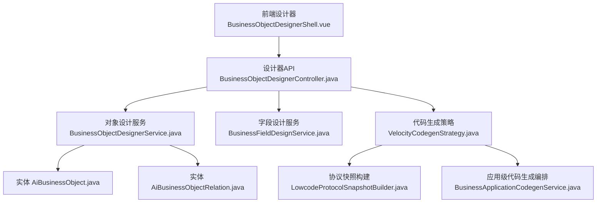
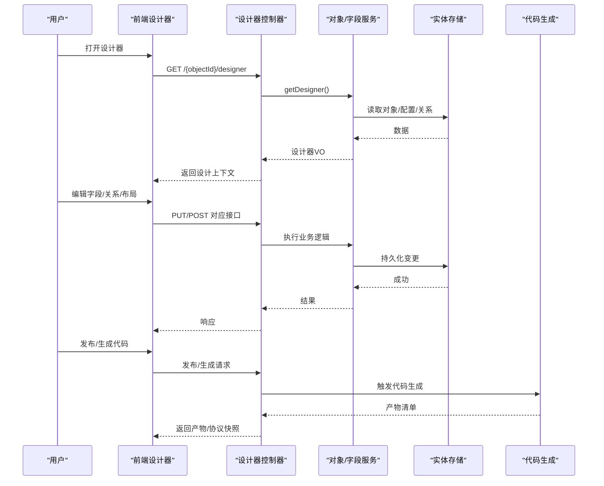
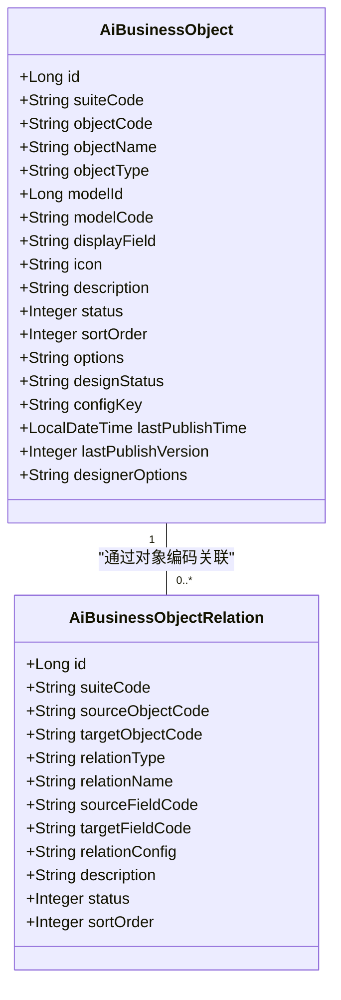
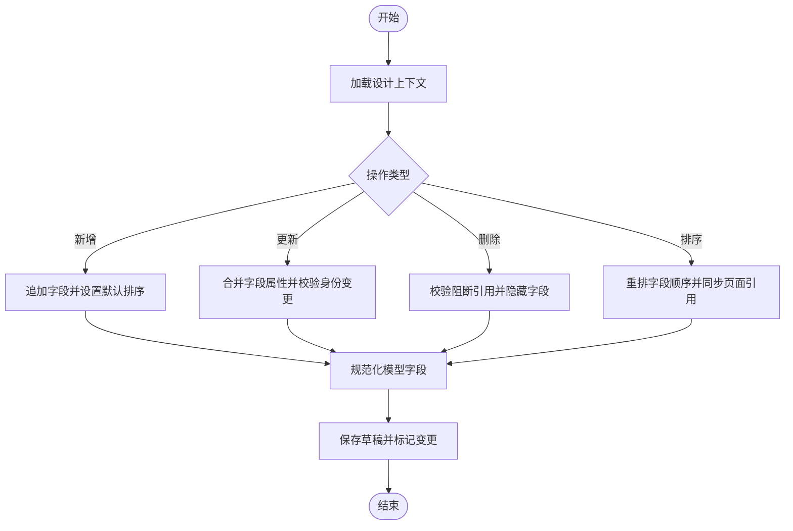
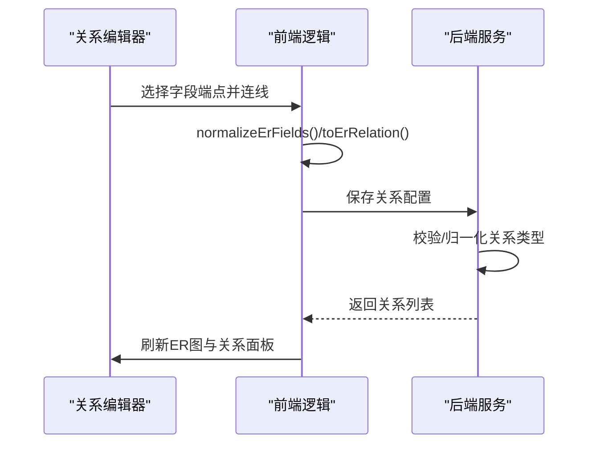
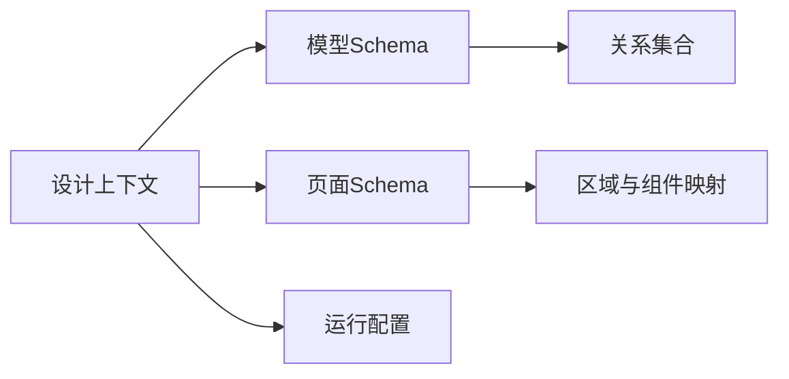
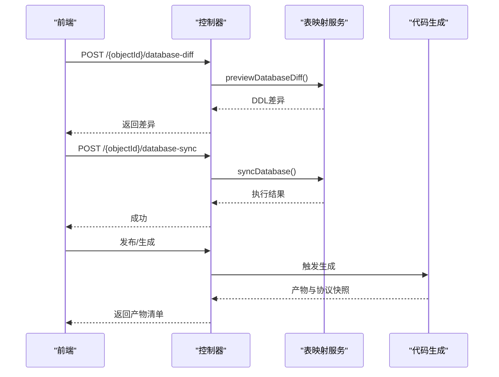
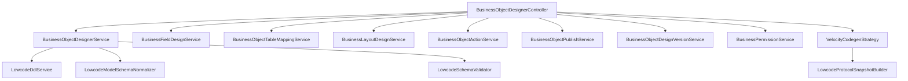

# 业务对象设计器

<cite>
**本文引用的文件**
- [BusinessObjectDesignerController.java](file://forge-server/forge-framework/forge-plugin-parent/forge-plugin-generator/src/main/java/com/mdframe/forge/plugin/generator/controller/BusinessObjectDesignerController.java)
- [BusinessObjectDesignerService.java](file://forge-server/forge-framework/forge-plugin-parent/forge-plugin-generator/src/main/java/com/mdframe/forge/plugin/generator/service/businessapp/BusinessObjectDesignerService.java)
- [BusinessFieldDesignService.java](file://forge-server/forge-framework/forge-plugin-parent/forge-plugin-generator/src/main/java/com/mdframe/forge/plugin/generator/service/businessapp/BusinessFieldDesignService.java)
- [AiBusinessObject.java](file://forge-server/forge-framework/forge-plugin-parent/forge-plugin-generator/src/main/java/com/mdframe/forge/plugin/generator/domain/entity/AiBusinessObject.java)
- [AiBusinessObjectRelation.java](file://forge-server/forge-framework/forge-plugin-parent/forge-plugin-generator/src/main/java/com/mdframe/forge/plugin/generator/domain/entity/AiBusinessObjectRelation.java)
- [BusinessObjectDesignerShell.vue](file://forge-admin-ui/src/views/app-center/components/designer/BusinessObjectDesignerShell.vue)
- [BusinessRelationDesigner.vue](file://forge-admin-ui/src/views/app-center/components/designer/BusinessRelationDesigner.vue)
- [business-app.js](file://forge-admin-ui/src/api/business-app.js)
- [VelocityCodegenStrategy.java](file://forge-server/forge-framework/forge-plugin-parent/forge-plugin-generator/src/main/java/com/mdframe/forge/plugin/generator/codegen/VelocityCodegenStrategy.java)
- [LowcodeProtocolSnapshotBuilder.java](file://forge-server/forge-framework/forge-plugin-parent/forge-plugin-generator/src/main/java/com/mdframe/forge/plugin/generator/service/lowcode/LowcodeProtocolSnapshotBuilder.java)
- [BusinessApplicationCodegenService.java](file://forge-server/forge-framework/forge-plugin-parent/forge-plugin-generator/src/main/java/com/mdframe/forge/plugin/generator/service/businessapp/BusinessApplicationCodegenService.java)
</cite>

## 目录
1. [简介](#简介)
2. [项目结构](#项目结构)
3. [核心组件](#核心组件)
4. [架构总览](#架构总览)
5. [详细组件分析](#详细组件分析)
6. [依赖关系分析](#依赖关系分析)
7. [性能考虑](#性能考虑)
8. [故障排查指南](#故障排查指南)
9. [结论](#结论)
10. [附录：API参考与示例](#附录api参考与示例)

## 简介
本技术文档面向“业务对象设计器”，围绕实体建模、字段类型定义、关系映射与ER图可视化，系统阐述数据模型设计、字段属性配置、验证规则设置、关联关系管理，以及导入导出、版本管理与代码生成等能力。文档同时提供前端工作区、后端服务与代码生成的交互流程说明，并给出常用问题定位建议。

## 项目结构
业务对象设计器由前后端协同实现：
- 前端：以Vue组件构建设计器外壳、关系编辑器与ER图展示，负责用户交互与状态同步。
- 后端：以控制器暴露REST接口，聚合多个领域服务完成对象、字段、布局、动作、权限、发布与版本管理等。
- 代码生成：基于低代码协议快照与模板引擎，输出前后端代码与运行时配置。

**图表来源**
- [BusinessObjectDesignerController.java:67-254](file://forge-server/forge-framework/forge-plugin-parent/forge-plugin-generator/src/main/java/com/mdframe/forge/plugin/generator/controller/BusinessObjectDesignerController.java#L67-L254)
- [BusinessObjectDesignerService.java:191-212](file://forge-server/forge-framework/forge-plugin-parent/forge-plugin-generator/src/main/java/com/mdframe/forge/plugin/generator/service/businessapp/BusinessObjectDesignerService.java#L191-L212)
- [BusinessFieldDesignService.java:56-169](file://forge-server/forge-framework/forge-plugin-parent/forge-plugin-generator/src/main/java/com/mdframe/forge/plugin/generator/service/businessapp/BusinessFieldDesignService.java#L56-L169)
- [AiBusinessObject.java:17-72](file://forge-server/forge-framework/forge-plugin-parent/forge-plugin-generator/src/main/java/com/mdframe/forge/plugin/generator/domain/entity/AiBusinessObject.java#L17-L72)
- [AiBusinessObjectRelation.java:15-50](file://forge-server/forge-framework/forge-plugin-parent/forge-plugin-generator/src/main/java/com/mdframe/forge/plugin/generator/domain/entity/AiBusinessObjectRelation.java#L15-L50)
- [VelocityCodegenStrategy.java:256-283](file://forge-server/forge-framework/forge-plugin-parent/forge-plugin-generator/src/main/java/com/mdframe/forge/plugin/generator/codegen/VelocityCodegenStrategy.java#L256-L283)
- [LowcodeProtocolSnapshotBuilder.java:61-90](file://forge-server/forge-framework/forge-plugin-parent/forge-plugin-generator/src/main/java/com/mdframe/forge/plugin/generator/service/lowcode/LowcodeProtocolSnapshotBuilder.java#L61-L90)
- [BusinessApplicationCodegenService.java:159-380](file://forge-server/forge-framework/forge-plugin-parent/forge-plugin-generator/src/main/java/com/mdframe/forge/plugin/generator/service/businessapp/BusinessApplicationCodegenService.java#L159-L380)

**章节来源**
- [BusinessObjectDesignerController.java:67-254](file://forge-server/forge-framework/forge-plugin-parent/forge-plugin-generator/src/main/java/com/mdframe/forge/plugin/generator/controller/BusinessObjectDesignerController.java#L67-L254)
- [BusinessObjectDesignerService.java:191-212](file://forge-server/forge-framework/forge-plugin-parent/forge-plugin-generator/src/main/java/com/mdframe/forge/plugin/generator/service/businessapp/BusinessObjectDesignerService.java#L191-L212)
- [BusinessFieldDesignService.java:56-169](file://forge-server/forge-framework/forge-plugin-parent/forge-plugin-generator/src/main/java/com/mdframe/forge/plugin/generator/service/businessapp/BusinessFieldDesignService.java#L56-L169)
- [AiBusinessObject.java:17-72](file://forge-server/forge-framework/forge-plugin-parent/forge-plugin-generator/src/main/java/com/mdframe/forge/plugin/generator/domain/entity/AiBusinessObject.java#L17-L72)
- [AiBusinessObjectRelation.java:15-50](file://forge-server/forge-framework/forge-plugin-parent/forge-plugin-generator/src/main/java/com/mdframe/forge/plugin/generator/domain/entity/AiBusinessObjectRelation.java#L15-L50)
- [VelocityCodegenStrategy.java:256-283](file://forge-server/forge-framework/forge-plugin-parent/forge-plugin-generator/src/main/java/com/mdframe/forge/plugin/generator/codegen/VelocityCodegenStrategy.java#L256-L283)
- [LowcodeProtocolSnapshotBuilder.java:61-90](file://forge-server/forge-framework/forge-plugin-parent/forge-plugin-generator/src/main/java/com/mdframe/forge/plugin/generator/service/lowcode/LowcodeProtocolSnapshotBuilder.java#L61-L90)
- [BusinessApplicationCodegenService.java:159-380](file://forge-server/forge-framework/forge-plugin-parent/forge-plugin-generator/src/main/java/com/mdframe/forge/plugin/generator/service/businessapp/BusinessApplicationCodegenService.java#L159-L380)

## 核心组件
- 设计器控制器：统一对外暴露对象设计、字段CRUD、布局保存、动作配置、权限摘要、发布检查与版本回滚等能力。
- 对象设计服务：加载上下文、装配关系到模型、计算设计/发布状态、持久化草稿与变更。
- 字段设计服务：新增/更新/删除/排序字段，维护字段可见性、联动与选项引用一致性。
- 关系与ER图：前端可视化编辑关系，归一化为ER字段与关系类型，支持一对多明细关系。
- 代码生成：将模型与页面Schema转换为可交付的前后端代码与协议快照。

**章节来源**
- [BusinessObjectDesignerController.java:67-254](file://forge-server/forge-framework/forge-plugin-parent/forge-plugin-generator/src/main/java/com/mdframe/forge/plugin/generator/controller/BusinessObjectDesignerController.java#L67-L254)
- [BusinessObjectDesignerService.java:191-212](file://forge-server/forge-framework/forge-plugin-parent/forge-plugin-generator/src/main/java/com/mdframe/forge/plugin/generator/service/businessapp/BusinessObjectDesignerService.java#L191-L212)
- [BusinessFieldDesignService.java:56-169](file://forge-server/forge-framework/forge-plugin-parent/forge-plugin-generator/src/main/java/com/mdframe/forge/plugin/generator/service/businessapp/BusinessFieldDesignService.java#L56-L169)
- [BusinessRelationDesigner.vue:2394-2434](file://forge-admin-ui/src/views/app-center/components/designer/BusinessRelationDesigner.vue#L2394-L2434)

## 架构总览
设计器采用“前端工作区 + 后端聚合服务 + 代码生成”的分层架构。前端通过标准化API与设计器交互；后端按职责拆分服务，并通过实体持久化；代码生成阶段产出可部署产物与协议快照，供运行期使用。

**图表来源**
- [BusinessObjectDesignerController.java:67-254](file://forge-server/forge-framework/forge-plugin-parent/forge-plugin-generator/src/main/java/com/mdframe/forge/plugin/generator/controller/BusinessObjectDesignerController.java#L67-L254)
- [BusinessObjectDesignerService.java:191-212](file://forge-server/forge-framework/forge-plugin-parent/forge-plugin-generator/src/main/java/com/mdframe/forge/plugin/generator/service/businessapp/BusinessObjectDesignerService.java#L191-L212)
- [BusinessFieldDesignService.java:56-169](file://forge-server/forge-framework/forge-plugin-parent/forge-plugin-generator/src/main/java/com/mdframe/forge/plugin/generator/service/businessapp/BusinessFieldDesignService.java#L56-L169)
- [VelocityCodegenStrategy.java:256-283](file://forge-server/forge-framework/forge-plugin-parent/forge-plugin-generator/src/main/java/com/mdframe/forge/plugin/generator/codegen/VelocityCodegenStrategy.java#L256-L283)
- [LowcodeProtocolSnapshotBuilder.java:61-90](file://forge-server/forge-framework/forge-plugin-parent/forge-plugin-generator/src/main/java/com/mdframe/forge/plugin/generator/service/lowcode/LowcodeProtocolSnapshotBuilder.java#L61-L90)

## 详细组件分析

### 实体建模与数据模型
- 业务对象实体包含对象编码、名称、类型、显示字段、图标、描述、状态、排序、扩展配置、设计状态、运行配置键、最近发布信息与版本等。
- 对象关系实体记录源/目标对象、关系类型（REFERENCE/DETAIL/CHILD_LIST/MANY_TO_MANY）、关系名、字段端点、关系配置JSON、描述、状态与排序。

**图表来源**
- [AiBusinessObject.java:17-72](file://forge-server/forge-framework/forge-plugin-parent/forge-plugin-generator/src/main/java/com/mdframe/forge/plugin/generator/domain/entity/AiBusinessObject.java#L17-L72)
- [AiBusinessObjectRelation.java:15-50](file://forge-server/forge-framework/forge-plugin-parent/forge-plugin-generator/src/main/java/com/mdframe/forge/plugin/generator/domain/entity/AiBusinessObjectRelation.java#L15-L50)

**章节来源**
- [AiBusinessObject.java:17-72](file://forge-server/forge-framework/forge-plugin-parent/forge-plugin-generator/src/main/java/com/mdframe/forge/plugin/generator/domain/entity/AiBusinessObject.java#L17-L72)
- [AiBusinessObjectRelation.java:15-50](file://forge-server/forge-framework/forge-plugin-parent/forge-plugin-generator/src/main/java/com/mdframe/forge/plugin/generator/domain/entity/AiBusinessObjectRelation.java#L15-L50)

### 字段类型定义与属性配置
- 字段设计服务支持新增、更新、删除、排序字段，自动处理字段可见性、查询类型、字典类型、敏感字段、加密算法、是否只读、字段状态等。
- 更新时若字段标识或列名变化，会替换模型与页面中的字段引用，并清理/更新设计器选项中的字段引用。
- 删除字段时会进行阻断校验（如被关系引用），并将字段置为隐藏，移除页面引用与选项引用。

**图表来源**
- [BusinessFieldDesignService.java:56-169](file://forge-server/forge-framework/forge-plugin-parent/forge-plugin-generator/src/main/java/com/mdframe/forge/plugin/generator/service/businessapp/BusinessFieldDesignService.java#L56-L169)

**章节来源**
- [BusinessFieldDesignService.java:56-169](file://forge-server/forge-framework/forge-plugin-parent/forge-plugin-generator/src/main/java/com/mdframe/forge/plugin/generator/service/businessapp/BusinessFieldDesignService.java#L56-L169)

### 关系映射与ER图可视化
- 前端关系编辑器提供可视化关系图与字段联动配置，支持拖拽连线建立关系。
- ER字段归一化过程确保每个模型至少包含主键id，并映射字段标签、数据类型与主键标志。
- 关系类型在内部统一为ONE_TO_MANY等标准类型，DETAIL映射为一对多明细关系。

**图表来源**
- [BusinessRelationDesigner.vue:2394-2434](file://forge-admin-ui/src/views/app-center/components/designer/BusinessRelationDesigner.vue#L2394-L2434)
- [BusinessRelationDesigner.vue:955-978](file://forge-admin-ui/src/views/app-center/components/designer/BusinessRelationDesigner.vue#L955-L978)
- [BusinessRelationDesigner.vue:2350-2392](file://forge-admin-ui/src/views/app-center/components/designer/BusinessRelationDesigner.vue#L2350-L2392)

**章节来源**
- [BusinessRelationDesigner.vue:2394-2434](file://forge-admin-ui/src/views/app-center/components/designer/BusinessRelationDesigner.vue#L2394-L2434)
- [BusinessRelationDesigner.vue:955-978](file://forge-admin-ui/src/views/app-center/components/designer/BusinessRelationDesigner.vue#L955-L978)
- [BusinessRelationDesigner.vue:2350-2392](file://forge-admin-ui/src/views/app-center/components/designer/BusinessRelationDesigner.vue#L2350-L2392)

### 数据模型设计与页面Schema
- 设计器上下文包含对象、模型Schema、页面Schema与配置，服务在获取设计器视图时会将关系注入模型，便于前端渲染与校验。
- 页面区域与组件映射（如search/table/edit/detail/toolbar）在服务中维护别名与默认组件，保证不同命名的一致性。

**图表来源**
- [BusinessObjectDesignerService.java:191-212](file://forge-server/forge-framework/forge-plugin-parent/forge-plugin-generator/src/main/java/com/mdframe/forge/plugin/generator/service/businessapp/BusinessObjectDesignerService.java#L191-L212)

**章节来源**
- [BusinessObjectDesignerService.java:191-212](file://forge-server/forge-framework/forge-plugin-parent/forge-plugin-generator/src/main/java/com/mdframe/forge/plugin/generator/service/businessapp/BusinessObjectDesignerService.java#L191-L212)

### 验证规则与联动配置
- 字段属性中包含查询类型、字典类型、敏感字段、加密算法、是否必填、是否只读等，用于表单与列表的校验与展示。
- 联动规则通过LinkageSchema注入到模型字段的基础属性中，支持条件启用与级联行为。

**章节来源**
- [BusinessFieldDesignService.java:172-200](file://forge-server/forge-framework/forge-plugin-parent/forge-plugin-generator/src/main/java/com/mdframe/forge/plugin/generator/service/businessapp/BusinessFieldDesignService.java#L172-L200)
- [BusinessObjectDesignerService.java:3151-3176](file://forge-server/forge-framework/forge-plugin-parent/forge-plugin-generator/src/main/java/com/mdframe/forge/plugin/generator/service/businessapp/BusinessObjectDesignerService.java#L3151-L3176)

### 导入导出、版本管理与代码生成
- 导入导出：通过数据库差异预览与同步接口，可将设计态DDL与数据库结构对齐，支持在线确认执行。
- 版本管理：提供版本列表与回滚接口，结合设计状态与发布状态，保障设计演进的可追溯性。
- 代码生成：基于Velocity模板与低代码协议快照，生成前端页面、API调用脚本、运行时配置与覆盖报告，并附带README与所有权清单。

**图表来源**
- [BusinessObjectDesignerController.java:90-111](file://forge-server/forge-framework/forge-plugin-parent/forge-plugin-generator/src/main/java/com/mdframe/forge/plugin/generator/controller/BusinessObjectDesignerController.java#L90-L111)
- [VelocityCodegenStrategy.java:256-283](file://forge-server/forge-framework/forge-plugin-parent/forge-plugin-generator/src/main/java/com/mdframe/forge/plugin/generator/codegen/VelocityCodegenStrategy.java#L256-L283)
- [LowcodeProtocolSnapshotBuilder.java:61-90](file://forge-server/forge-framework/forge-plugin-parent/forge-plugin-generator/src/main/java/com/mdframe/forge/plugin/generator/service/lowcode/LowcodeProtocolSnapshotBuilder.java#L61-L90)
- [BusinessApplicationCodegenService.java:159-380](file://forge-server/forge-framework/forge-plugin-parent/forge-plugin-generator/src/main/java/com/mdframe/forge/plugin/generator/service/businessapp/BusinessApplicationCodegenService.java#L159-L380)

**章节来源**
- [BusinessObjectDesignerController.java:90-111](file://forge-server/forge-framework/forge-plugin-parent/forge-plugin-generator/src/main/java/com/mdframe/forge/plugin/generator/controller/BusinessObjectDesignerController.java#L90-L111)
- [VelocityCodegenStrategy.java:256-283](file://forge-server/forge-framework/forge-plugin-parent/forge-plugin-generator/src/main/java/com/mdframe/forge/plugin/generator/codegen/VelocityCodegenStrategy.java#L256-L283)
- [LowcodeProtocolSnapshotBuilder.java:61-90](file://forge-server/forge-framework/forge-plugin-parent/forge-plugin-generator/src/main/java/com/mdframe/forge/plugin/generator/service/lowcode/LowcodeProtocolSnapshotBuilder.java#L61-L90)
- [BusinessApplicationCodegenService.java:159-380](file://forge-server/forge-framework/forge-plugin-parent/forge-plugin-generator/src/main/java/com/mdframe/forge/plugin/generator/service/businessapp/BusinessApplicationCodegenService.java#L159-L380)

## 依赖关系分析
- 控制器依赖多个服务：对象设计、表映射、字段设计、布局设计、动作、发布、版本、权限。
- 对象设计服务依赖低代码模型、DDL、领域服务、数据源解析与校验器，形成强内聚的业务编排。
- 代码生成依赖模板策略与协议快照构建，确保产物与运行期一致。

**图表来源**
- [BusinessObjectDesignerController.java:58-65](file://forge-server/forge-framework/forge-plugin-parent/forge-plugin-generator/src/main/java/com/mdframe/forge/plugin/generator/controller/BusinessObjectDesignerController.java#L58-L65)
- [BusinessObjectDesignerService.java:170-188](file://forge-server/forge-framework/forge-plugin-parent/forge-plugin-generator/src/main/java/com/mdframe/forge/plugin/generator/service/businessapp/BusinessObjectDesignerService.java#L170-L188)
- [VelocityCodegenStrategy.java:256-283](file://forge-server/forge-framework/forge-plugin-parent/forge-plugin-generator/src/main/java/com/mdframe/forge/plugin/generator/codegen/VelocityCodegenStrategy.java#L256-L283)
- [LowcodeProtocolSnapshotBuilder.java:61-90](file://forge-server/forge-framework/forge-plugin-parent/forge-plugin-generator/src/main/java/com/mdframe/forge/plugin/generator/service/lowcode/LowcodeProtocolSnapshotBuilder.java#L61-L90)

**章节来源**
- [BusinessObjectDesignerController.java:58-65](file://forge-server/forge-framework/forge-plugin-parent/forge-plugin-generator/src/main/java/com/mdframe/forge/plugin/generator/controller/BusinessObjectDesignerController.java#L58-L65)
- [BusinessObjectDesignerService.java:170-188](file://forge-server/forge-framework/forge-plugin-parent/forge-plugin-generator/src/main/java/com/mdframe/forge/plugin/generator/service/businessapp/BusinessObjectDesignerService.java#L170-L188)

## 性能考虑
- 字段排序与页面引用重排采用有序结构与批量更新，减少多次往返。
- 设计上下文加载与关系注入在服务端集中完成，降低前端复杂度。
- 代码生成阶段产出协议快照与覆盖报告，便于运行期快速适配与诊断。

[本节为通用指导，不直接分析具体文件]

## 故障排查指南
- 字段不可修改/删除：系统字段或流程托管字段受保护，需调整字段归属或解除托管后再操作。
- 删除字段受阻：存在关系引用时需先移除相关关系，避免数据不一致。
- 发布失败：检查发布检查接口返回项，补齐缺失的配置或权限。
- 代码生成异常：核对协议快照与模板字段白名单，确认前端嵌套协议字段策略与后端未知字段策略。

**章节来源**
- [BusinessFieldDesignService.java:81-146](file://forge-server/forge-framework/forge-plugin-parent/forge-plugin-generator/src/main/java/com/mdframe/forge/plugin/generator/service/businessapp/BusinessFieldDesignService.java#L81-L146)
- [BusinessObjectDesignerController.java:226-254](file://forge-server/forge-framework/forge-plugin-parent/forge-plugin-generator/src/main/java/com/mdframe/forge/plugin/generator/controller/BusinessObjectDesignerController.java#L226-L254)
- [LowcodeProtocolSnapshotBuilder.java:61-90](file://forge-server/forge-framework/forge-plugin-parent/forge-plugin-generator/src/main/java/com/mdframe/forge/plugin/generator/service/lowcode/LowcodeProtocolSnapshotBuilder.java#L61-L90)

## 结论
业务对象设计器通过清晰的分层与职责划分，实现了从实体建模、字段配置、关系映射到ER可视化、版本管理与代码生成的完整闭环。其前后端协作紧密，服务编排合理，具备较强的可扩展性与可维护性。

[本节为总结，不直接分析具体文件]

## 附录：API参考与示例
- 设计器基础
  - 获取设计器上下文：GET /ai/business/object/{objectId}/designer
  - 保存设计器上下文：PUT /ai/business/object/{objectId}/designer
- 字段管理
  - 列出字段：GET /ai/business/object/{objectId}/fields
  - 新增字段：POST /ai/business/object/{objectId}/fields
  - 更新字段：PUT /ai/business/object/{objectId}/fields/{fieldCode}
  - 删除字段：DELETE /ai/business/object/{objectId}/fields/{fieldCode}
  - 字段排序：PUT /ai/business/object/{objectId}/fields/sort
- 布局管理
  - 查询布局：GET /ai/business/object/{objectId}/layout/{layoutKey}
  - 保存表单/列表/详情布局：PUT /ai/business/object/{objectId}/layout/{form|list|detail}
  - 预览布局：POST /ai/business/object/{objectId}/layout/preview
- 动作与权限
  - 列出动作：GET /ai/business/object/{objectId}/actions
  - 保存动作：PUT /ai/business/object/{objectId}/actions
  - 权限摘要：GET /ai/business/object/{objectId}/permission-summary
  - 动作权限摘要：GET /ai/business/object/{objectId}/permission-actions
- 发布与版本
  - 发布检查：GET /ai/business/object/{objectId}/publish-check
  - 发布：POST /ai/business/object/{objectId}/publish
  - 版本列表：GET /ai/business/object/{objectId}/versions
  - 版本回滚：POST /ai/business/object/{objectId}/versions/{versionId}/rollback
- 数据结构同步
  - 差异预览：POST /ai/business/object/{objectId}/database-diff
  - 结构同步：POST /ai/business/object/{objectId}/database-sync

前端API封装路径：
- [business-app.js](file://forge-admin-ui/src/api/business-app.js)

**章节来源**
- [BusinessObjectDesignerController.java:67-254](file://forge-server/forge-framework/forge-plugin-parent/forge-plugin-generator/src/main/java/com/mdframe/forge/plugin/generator/controller/BusinessObjectDesignerController.java#L67-L254)
- [business-app.js:255-293](file://forge-admin-ui/src/api/business-app.js#L255-L293)