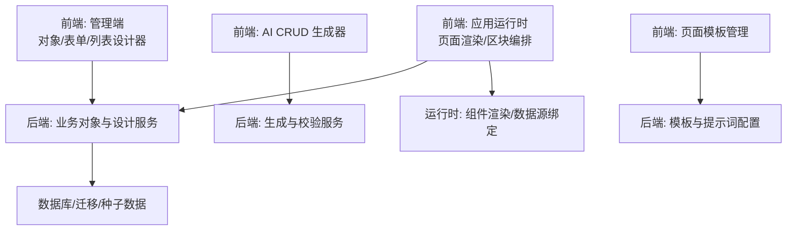
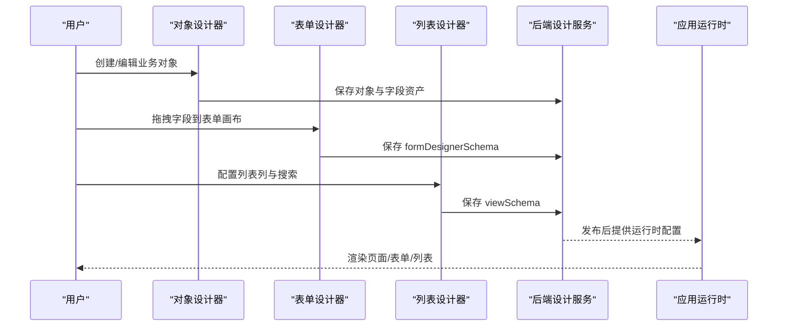
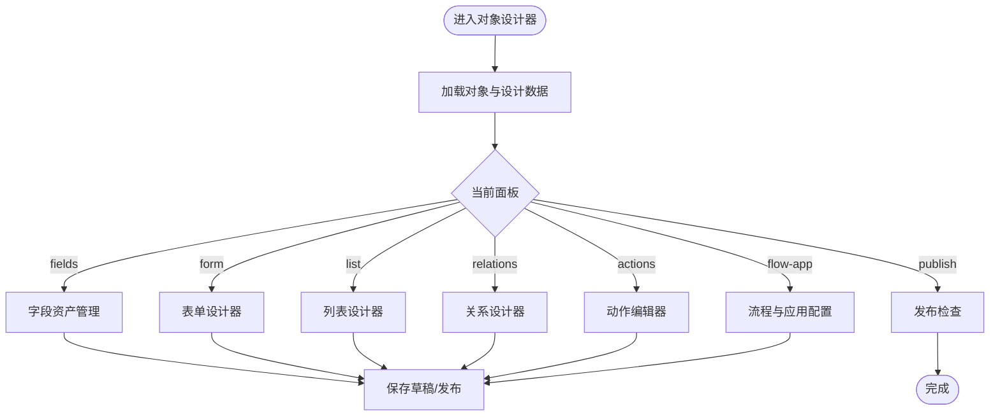
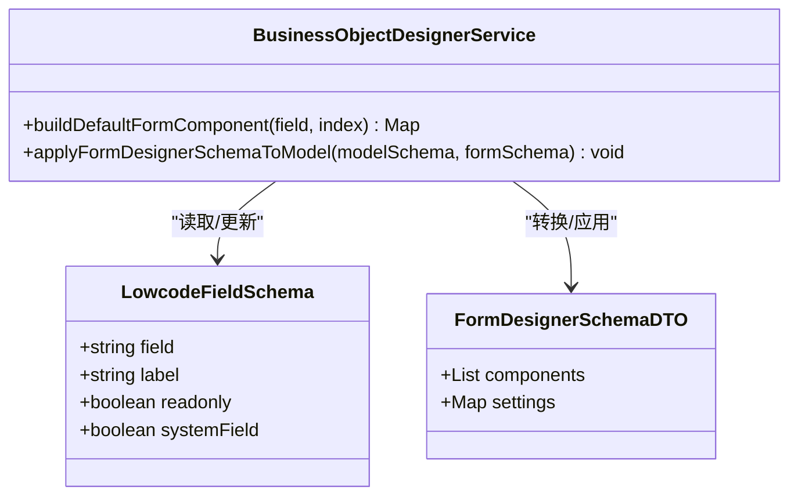
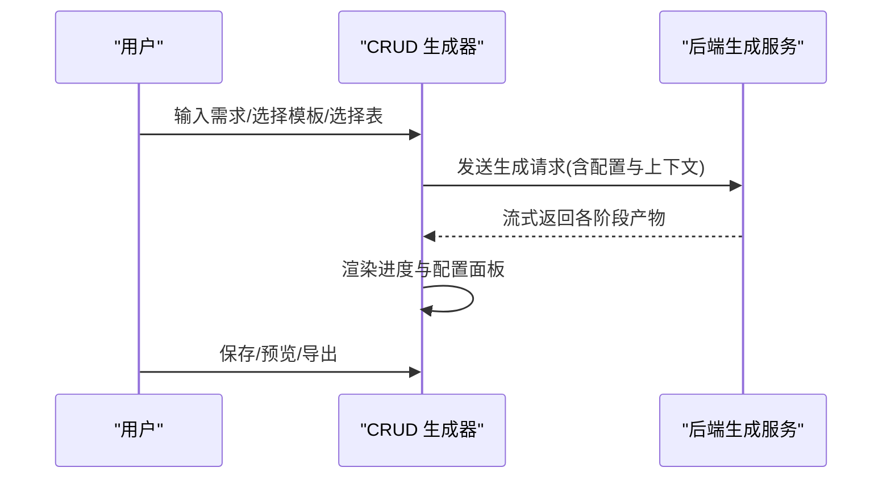
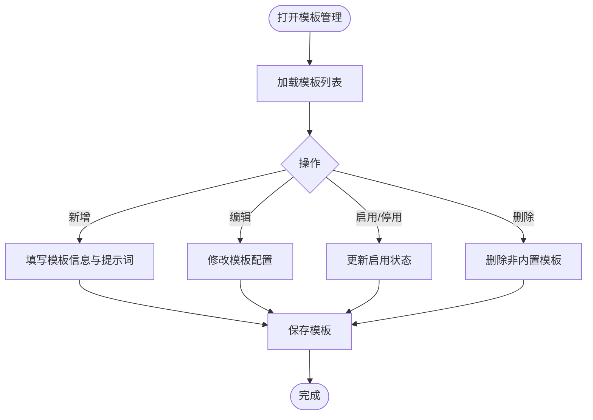
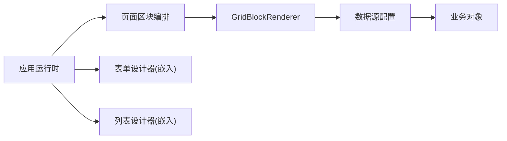
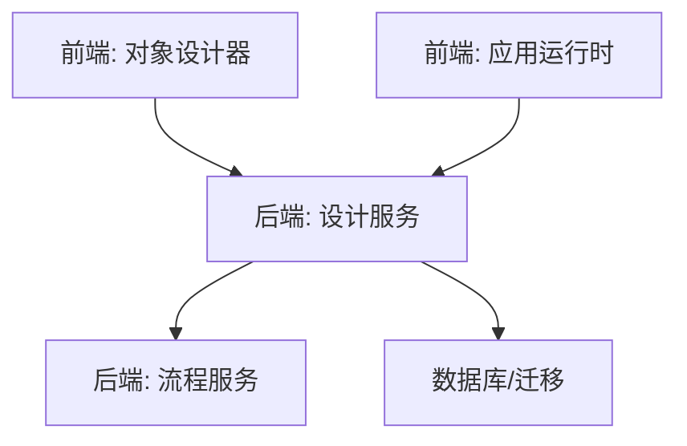

# 低代码平台

<cite>
**本文引用的文件**
- [README.md](file://README.md)
- [object-designer.[objectCode].vue](file://forge-admin-ui/src/views/app-center/object-designer.[objectCode].vue)
- [application-runtime.[applicationCode].vue](file://forge-admin-ui/src/views/app-center/application-runtime.[applicationCode].vue)
- [crud-generator.vue](file://forge-admin-ui/src/views/ai/crud-generator.vue)
- [page-template.vue](file://forge-admin-ui/src/views/ai/page-template.vue)
- [BusinessObjectDesignerService.java](file://forge-server/forge-framework/forge-plugin-parent/forge-plugin-generator/src/main/java/com/mdframe/forge/plugin/generator/service/businessapp/BusinessObjectDesignerService.java)
- [BusinessApplicationPageDesignService.java](file://forge-server/forge-framework/forge-plugin-parent/forge-plugin-generator/src/main/java/com/mdframe/forge/plugin/generator/service/businessapp/BusinessApplicationPageDesignService.java)
- [BusinessFlowService.java](file://forge-server/forge-framework/forge-plugin-parent/forge-plugin-generator/src/main/java/com/mdframe/forge/plugin/generator/service/businessapp/BusinessFlowService.java)
- [BusinessObjectDesignerPageSchemaTest.java](file://forge-server/forge-framework/forge-plugin-parent/forge-plugin-generator/src/test/java/com/mdframe/forge/plugin/generator/service/businessapp/BusinessObjectDesignerPageSchemaTest.java)
</cite>

## 目录
1. [简介](#简介)
2. [项目结构](#项目结构)
3. [核心组件](#核心组件)
4. [架构总览](#架构总览)
5. [详细组件分析](#详细组件分析)
6. [依赖关系分析](#依赖关系分析)
7. [性能考量](#性能考量)
8. [故障排查指南](#故障排查指南)
9. [结论](#结论)
10. [附录：配置与API参考](#附录配置与api参考)

## 简介
本技术文档面向 Forge Admin 低代码平台，围绕业务对象设计器、表单设计器、CRUD 生成器与页面模板管理四大核心能力展开。文档重点解释可视化拖拽编辑、动态表单渲染、数据绑定机制与组件扩展模式，并覆盖低代码应用生命周期管理、发布部署流程与二次开发指南。同时提供配置示例、API 参考与常见问题解决方案，帮助读者快速上手并深入掌握平台能力。

## 项目结构
Forge Admin 采用前后端分离与插件化架构：
- 前端以 Vue 3 + Naive UI 构建管理端与运行时工作台，包含对象设计器、表单/列表设计器、应用运行时、AI CRUD 生成器与页面模板管理等模块。
- 后端以 Spring Boot 3 + MyBatis-Plus 为核心，通过 forge-plugin-parent 插件体系提供业务对象、表单/视图、关联联动、发布检查等能力。
- 工程组织按“框架层 Starter → 插件层 Plugin → 应用服务”分层，便于扩展与维护。

**图表来源**
- [README.md:241-259](file://README.md#L241-L259)
- [application-runtime.[applicationCode].vue:459-473](file://forge-admin-ui/src/views/app-center/application-runtime.[applicationCode].vue#L459-L473)
- [BusinessObjectDesignerService.java:2231-2245](file://forge-server/forge-framework/forge-plugin-parent/forge-plugin-generator/src/main/java/com/mdframe/forge/plugin/generator/service/businessapp/BusinessObjectDesignerService.java#L2231-L2245)

**章节来源**
- [README.md:241-259](file://README.md#L241-L259)

## 核心组件
- 业务对象设计器：维护对象基本信息、字段资产、关系模型、树形权限模型、动作与流程配置，支持草稿保存、发布检查与运行时信息查看。
- 表单设计器：基于 FormDesignerSchema 协议，支持字段拖拽、布局、属性面板、级联联动、字典/远程过滤、视图投影（查询/列表/详情）。
- 列表设计器：基于 ViewSchema 与 ModelSchema 生成表格列、搜索条件、操作按钮与分页行为。
- CRUD 生成器：通过 AI 对话式交互，自动生成搜索配置、表格列、编辑表单、接口配置、建表 SQL 与表结构，支持模板选择与导出下载。
- 页面模板管理：管理 AI 页面生成器的模板，包括标识、名称、描述、图标、排序、启用状态、默认配置、Schema 约束与系统提示词。

**章节来源**
- [object-designer.[objectCode].vue:42-271](file://forge-admin-ui/src/views/app-center/object-designer.[objectCode].vue#L42-L271)
- [crud-generator.vue:167-533](file://forge-admin-ui/src/views/ai/crud-generator.vue#L167-L533)
- [page-template.vue:1-148](file://forge-admin-ui/src/views/ai/page-template.vue#L1-L148)

## 架构总览
低代码平台的核心数据流遵循“设计态 → 发布态 → 运行态”的三段式：
- 设计态：对象设计器与表单/列表设计器产出 FormDesignerSchema、ViewSchema、LinkageSchema、ModelSchema 等配置。
- 发布态：后端对配置进行编译、校验与锁定，确保字段绑定与布局一致性，生成可发布的运行时资源。
- 运行态：应用运行时读取 pageSchema、formDesignerSchema 等，渲染区块与组件，完成数据绑定与交互。

**图表来源**
- [object-designer.[objectCode].vue:152-190](file://forge-admin-ui/src/views/app-center/object-designer.[objectCode].vue#L152-L190)
- [BusinessApplicationPageDesignService.java:119-137](file://forge-server/forge-framework/forge-plugin-parent/forge-plugin-generator/src/main/java/com/mdframe/forge/plugin/generator/service/businessapp/BusinessApplicationPageDesignService.java#L119-L137)
- [application-runtime.[applicationCode].vue:459-473](file://forge-admin-ui/src/views/app-center/application-runtime.[applicationCode].vue#L459-L473)

## 详细组件分析

### 业务对象设计器
- 功能要点：
  - 基本信息：对象名称、默认标题字段、图标、启用状态、说明。
  - 字段资产：字段增删改查、是否放入表单、是否可见、是否已发布。
  - 关系与树形模型：对象关系设计与权限树配置。
  - 动作与流程：业务动作配置与流程自动化入口。
  - 发布检查：发布前校验必填项与脏规则修复。
- 关键交互：
  - 切换面板（fields/form/list/relations/actions/flow-app/publish）并异步加载对应设计器。
  - 草稿保存与未保存变更提示，路由参数驱动初始面板与 Tab。
  - 代码应用模式与种子配置接管确认。

**图表来源**
- [object-designer.[objectCode].vue:42-271](file://forge-admin-ui/src/views/app-center/object-designer.[objectCode].vue#L42-L271)

**章节来源**
- [object-designer.[objectCode].vue:42-271](file://forge-admin-ui/src/views/app-center/object-designer.[objectCode].vue#L42-L271)

### 表单设计器与动态渲染
- 数据绑定机制：
  - 组件通过 fieldBinding 指定绑定模式（field/virtual）、字段编码与来源（field_asset），支持只读锁定与自动创建缺失字段。
  - 后端在保存时将 FormDesignerSchema 映射到 ModelSchema，同步 label、运行时组件类型等元数据。
- 视图投影：
  - ViewSchema 用于查询、列表、详情视图的字段投影与展示控制。
  - LinkageSchema 用于级联联动规则，支持字典联动、远程参数、组织与对象引用过滤。
- 运行时渲染：
  - 应用运行时根据 pageSchema 与 formDesignerSchema 渲染区块与组件，支持数据源绑定与交互事件。

**图表来源**
- [BusinessObjectDesignerService.java:2231-2245](file://forge-server/forge-framework/forge-plugin-parent/forge-plugin-generator/src/main/java/com/mdframe/forge/plugin/generator/service/businessapp/BusinessObjectDesignerService.java#L2231-L2245)
- [BusinessObjectDesignerService.java:2592-2617](file://forge-server/forge-framework/forge-plugin-parent/forge-plugin-generator/src/main/java/com/mdframe/forge/plugin/generator/service/businessapp/BusinessObjectDesignerService.java#L2592-L2617)

**章节来源**
- [BusinessObjectDesignerService.java:2231-2245](file://forge-server/forge-framework/forge-plugin-parent/forge-plugin-generator/src/main/java/com/mdframe/forge/plugin/generator/service/businessapp/BusinessObjectDesignerService.java#L2231-L2245)
- [BusinessObjectDesignerService.java:2592-2617](file://forge-server/forge-framework/forge-plugin-parent/forge-plugin-generator/src/main/java/com/mdframe/forge/plugin/generator/service/businessapp/BusinessObjectDesignerService.java#L2592-L2617)

### CRUD 生成器
- 交互流程：
  - 左侧会话历史与输入区，右侧配置面板分组（核心配置/高级配置/SQL与表结构）。
  - 生成阶段进度条显示分析需求、推断元数据、生成搜索配置、表格列、编辑表单、接口配置、建表 SQL。
  - 支持导入数据库表、选择页面模板、选择 AI 供应商与模型。
- 输出产物：
  - searchSchema、columnsSchema、editSchema、apiConfig、dictConfig、desensitizeConfig、encryptConfig、transConfig、createTableSql、tableStructure。
- 保存与预览：
  - 保存配置后可预览页面或下载代码包，支持复制当前文件与导出全部配置。

**图表来源**
- [crud-generator.vue:64-533](file://forge-admin-ui/src/views/ai/crud-generator.vue#L64-L533)

**章节来源**
- [crud-generator.vue:64-533](file://forge-admin-ui/src/views/ai/crud-generator.vue#L64-L533)

### 页面模板管理
- 功能要点：
  - 模板卡片网格展示模板标识、名称、描述、图标、排序、启用状态、内置标记。
  - 默认配置预览与 AI 提示词摘要，支持新增/编辑/删除/启用停用。
  - JSON 格式默认配置与 Schema 约束，系统提示词追加到 AI system prompt 末尾约束生成。
- 使用场景：
  - 为 AI 页面生成器提供模板约束，确保生成的页面结构与字段满足业务规范。

**图表来源**
- [page-template.vue:1-148](file://forge-admin-ui/src/views/ai/page-template.vue#L1-L148)
- [page-template.vue:149-269](file://forge-admin-ui/src/views/ai/page-template.vue#L149-L269)

**章节来源**
- [page-template.vue:1-148](file://forge-admin-ui/src/views/ai/page-template.vue#L1-L148)
- [page-template.vue:149-269](file://forge-admin-ui/src/views/ai/page-template.vue#L149-L269)

### 应用运行时与页面编排
- 运行时视图：
  - 应用运行时提供页面管理、业务流程、增强、设置与发布等 Tab。
  - 编辑模式下支持表单设计与列表设计嵌入，以及页面区块拖拽编排。
- 组件与数据源：
  - 通过 GridBlockRenderer 渲染区块，支持数据源配置、字段解析与运行时交互。
  - 支持选择业务对象作为数据源，并在对象设计器中精调字段与表单。

**图表来源**
- [application-runtime.[applicationCode].vue:459-473](file://forge-admin-ui/src/views/app-center/application-runtime.[applicationCode].vue#L459-L473)
- [application-runtime.[applicationCode].vue:143-222](file://forge-admin-ui/src/views/app-center/application-runtime.[applicationCode].vue#L143-L222)

**章节来源**
- [application-runtime.[applicationCode].vue:143-222](file://forge-admin-ui/src/views/app-center/application-runtime.[applicationCode].vue#L143-L222)
- [application-runtime.[applicationCode].vue:459-473](file://forge-admin-ui/src/views/app-center/application-runtime.[applicationCode].vue#L459-L473)

## 依赖关系分析
- 前端依赖：
  - 对象设计器依赖表单/列表/关系/动作/流程配置面板，并通过路由参数与状态管理驱动面板切换。
  - 应用运行时依赖区块渲染器与数据源配置，支持嵌入设计器与页面编排。
- 后端依赖：
  - 设计服务负责将 FormDesignerSchema 应用到 ModelSchema，保证字段与运行时组件类型一致。
  - 页面设计服务在保存时校验并锁定表单组件绑定，防止破坏已发布配置。
  - 流程服务在运行时组装业务对象表单资产，支持多表单与默认表单键解析。

**图表来源**
- [BusinessApplicationPageDesignService.java:119-137](file://forge-server/forge-framework/forge-plugin-parent/forge-plugin-generator/src/main/java/com/mdframe/forge/plugin/generator/service/businessapp/BusinessApplicationPageDesignService.java#L119-L137)
- [BusinessFlowService.java:5530-5556](file://forge-server/forge-framework/forge-plugin-parent/forge-plugin-generator/src/main/java/com/mdframe/forge/plugin/generator/service/businessapp/BusinessFlowService.java#L5530-L5556)

**章节来源**
- [BusinessApplicationPageDesignService.java:119-137](file://forge-server/forge-framework/forge-plugin-parent/forge-plugin-generator/src/main/java/com/mdframe/forge/plugin/generator/service/businessapp/BusinessApplicationPageDesignService.java#L119-L137)
- [BusinessFlowService.java:5530-5556](file://forge-server/forge-framework/forge-plugin-parent/forge-plugin-generator/src/main/java/com/mdframe/forge/plugin/generator/service/businessapp/BusinessFlowService.java#L5530-L5556)

## 性能考量
- 设计态优化：
  - 使用懒加载与异步组件减少首屏体积，提升设计器响应速度。
  - 草稿保存与脏检查避免频繁全量提交，降低网络开销。
- 运行态优化：
  - 区块渲染按需加载，结合数据源配置减少无效请求。
  - 表单组件与视图投影分离，避免重复计算与渲染。
- 生成器优化：
  - AI 生成过程分阶段流式返回，前端实时反馈进度，提升用户体验。
  - 模板与提示词约束提高生成质量，减少后期调整成本。

[本节为通用性能建议，不直接分析具体文件]

## 故障排查指南
- 首次启动数据库或 Redis 连接错误：
  - 检查 application-dev.yml 配置是否正确，确保 MySQL/Redis 地址与端口无误。
- 前端请求后端失败：
  - 确认后端服务端口与代理目标配置（VITE_HTTP_PROXY_TARGET、VITE_FLOW_PROXY_TARGET）指向本地服务。
- 新增配置项注意事项：
  - 敏感配置不要提交；通用配置需同步到 example 文件并使用占位符。
- 发布检查失败：
  - 检查表单字段绑定与视图投影是否完整，必要时通过发布检查修复脏规则。

**章节来源**
- [README.md:502-519](file://README.md#L502-L519)

## 结论
Forge Admin 低代码平台通过业务对象设计器、表单/列表设计器、CRUD 生成器与页面模板管理，构建了从设计到运行的完整闭环。其插件化架构与统一协议（FormDesignerSchema、ViewSchema、LinkageSchema）确保了可扩展性与一致性。结合 AI 能力与可视化编排，平台显著提升了交付效率与可维护性，适合企业后台、SaaS 管理与内部工具的低代码建设。

[本节为总结性内容，不直接分析具体文件]

## 附录：配置与API参考
- 配置示例
  - 后端环境配置：application-dev.yml（MySQL、Redis、文件存储、AI 供应商等）。
  - 前端代理配置：.env.development 中的 VITE_HTTP_PROXY_TARGET 与 VITE_FLOW_PROXY_TARGET。
  - 页面模板默认配置：JSON 格式的 defaultConfig 与 schemaHint。
- API 参考
  - 对象设计器接口：businessObjectDesigner、saveBusinessObjectDesigner、publishBusinessObject。
  - 页面设计接口：BusinessApplicationPageDesignService 相关保存与校验接口。
  - 流程服务接口：BusinessFlowService 运行时表单资产组装与默认表单键解析。
- 常见问题
  - 数据库迁移执行状态查询：SELECT installed_rank, version, description, success FROM forge_schema_history ORDER BY installed_rank DESC;
  - 敏感配置泄露处理：立即更换密钥并从仓库历史清理，补充 .gitignore 规则。

**章节来源**
- [README.md:292-341](file://README.md#L292-L341)
- [README.md:343-393](file://README.md#L343-L393)
- [page-template.vue:207-256](file://forge-admin-ui/src/views/ai/page-template.vue#L207-L256)