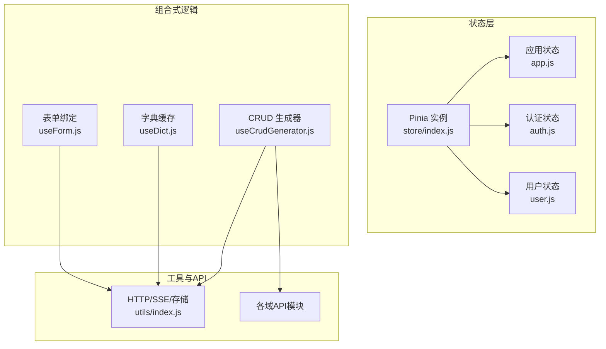
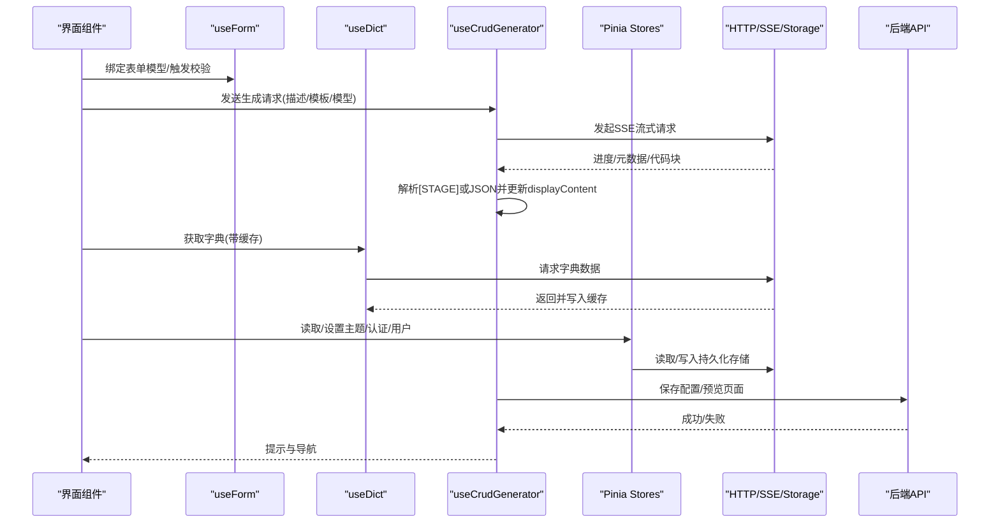
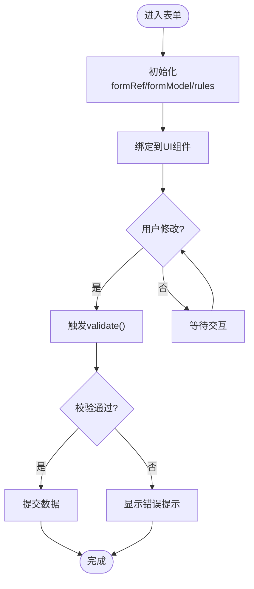
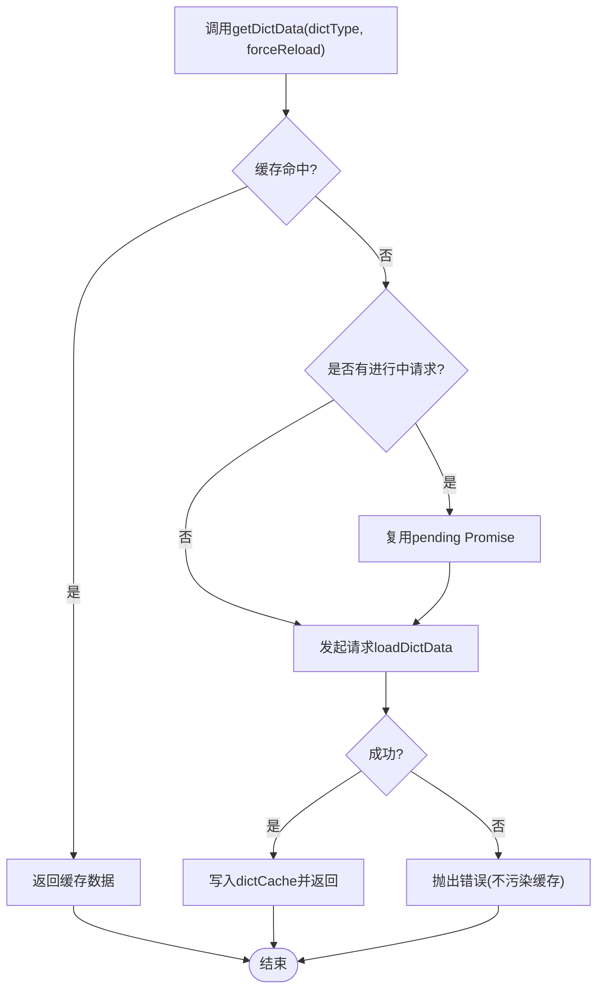
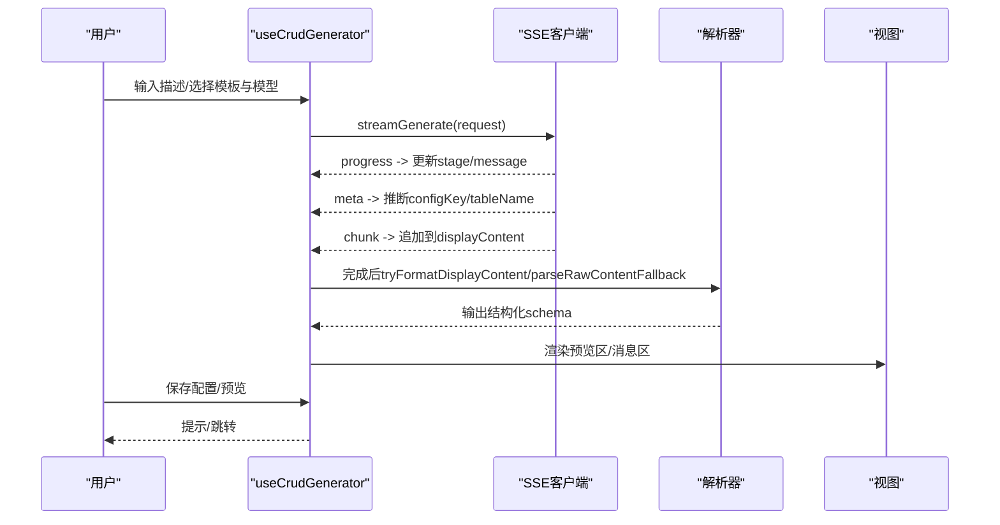
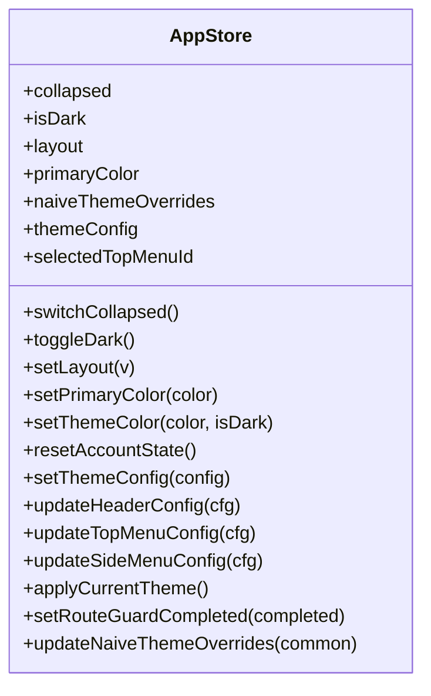
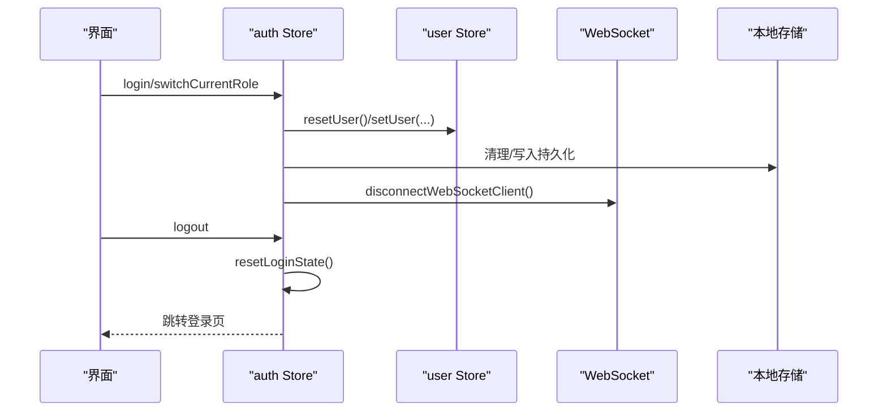
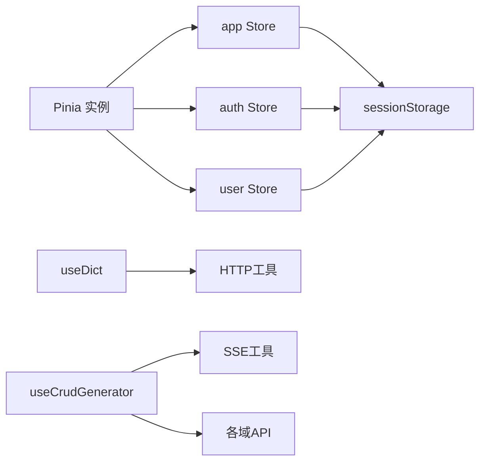

# 数据绑定与状态管理

<cite>
**本文引用的文件**
- [store/index.js](file://forge-admin-ui/src/store/index.js)
- [store/modules/app.js](file://forge-admin-ui/src/store/modules/app.js)
- [store/modules/auth.js](file://forge-admin-ui/src/store/modules/auth.js)
- [store/modules/user.js](file://forge-admin-ui/src/store/modules/user.js)
- [composables/useForm.js](file://forge-admin-ui/src/composables/useForm.js)
- [composables/useDict.js](file://forge-admin-ui/src/composables/useDict.js)
- [composables/useCrudGenerator.js](file://forge-admin-ui/src/composables/useCrudGenerator.js)
- [utils/index.js](file://forge-admin-ui/src/utils/index.js)
</cite>

## 目录
1. [简介](#简介)
2. [项目结构](#项目结构)
3. [核心组件](#核心组件)
4. [架构总览](#架构总览)
5. [详细组件分析](#详细组件分析)
6. [依赖关系分析](#依赖关系分析)
7. [性能考虑](#性能考虑)
8. [故障排查指南](#故障排查指南)
9. [结论](#结论)
10. [附录](#附录)

## 简介
本技术文档聚焦于 Forge Admin 前端的数据绑定与状态管理，围绕表单数据绑定、CRUD 操作状态、实时数据同步与缓存策略展开。内容涵盖：
- 数据流管理：从 UI 到 Store/Composable 再到 API 的单向数据流
- 状态持久化：基于 Pinia + 插件的本地存储策略
- 异步处理：SSE 流式生成、并发请求合并与重试
- 错误恢复：失败降级、兜底解析与用户提示
- 数据验证：表单校验规则与输入约束
- 权限控制：认证态、路由与菜单联动
- 性能优化：字典缓存、请求去重、主题与布局持久化

## 项目结构
本项目采用 Vue 3 + Pinia 的状态管理模式，结合 Composables 封装业务逻辑，API 层通过统一工具进行网络请求与 SSE 支持。关键目录与职责：
- store：全局状态（应用主题、认证、用户等），使用 pinia-plugin-persistedstate 实现持久化
- composables：可复用的组合式函数，如表单、字典、CRUD 生成器
- utils：HTTP、加密、SSE、存储等通用能力
- api：按领域划分的接口模块

图表来源
- [store/index.js:1-11](file://forge-admin-ui/src/store/index.js#L1-L11)
- [store/modules/app.js:1-107](file://forge-admin-ui/src/store/modules/app.js#L1-L107)
- [store/modules/auth.js:1-112](file://forge-admin-ui/src/store/modules/auth.js#L1-L112)
- [store/modules/user.js:1-137](file://forge-admin-ui/src/store/modules/user.js#L1-L137)
- [composables/useForm.js:1-18](file://forge-admin-ui/src/composables/useForm.js#L1-L18)
- [composables/useDict.js:1-254](file://forge-admin-ui/src/composables/useDict.js#L1-L254)
- [composables/useCrudGenerator.js:1-869](file://forge-admin-ui/src/composables/useCrudGenerator.js#L1-L869)
- [utils/index.js:1-15](file://forge-admin-ui/src/utils/index.js#L1-L15)

章节来源
- [store/index.js:1-11](file://forge-admin-ui/src/store/index.js#L1-L11)
- [utils/index.js:1-15](file://forge-admin-ui/src/utils/index.js#L1-L15)

## 核心组件
- Pinia 初始化与持久化：创建 Pinia 并启用持久化插件，为后续所有 Store 提供持久化能力
- 应用状态 Store：管理主题、布局、折叠侧边栏、顶部菜单选中项等，支持持久化
- 认证状态 Store：管理访问令牌、登录/登出流程、重置登录态、跳转登录页
- 用户状态 Store：管理用户信息、员工信息、数据权限及派生属性（角色、权限等）
- 表单绑定 Composable：提供表单引用、模型、校验方法与默认必填规则
- 字典缓存 Composable：带缓存与并发控制的字典加载、刷新与查询工具
- CRUD 生成器 Composable：负责 AI 驱动的 CRUD 配置生成、SSE 流式接收、分阶段解析、保存与预览

章节来源
- [store/modules/app.js:1-107](file://forge-admin-ui/src/store/modules/app.js#L1-L107)
- [store/modules/auth.js:1-112](file://forge-admin-ui/src/store/modules/auth.js#L1-L112)
- [store/modules/user.js:1-137](file://forge-admin-ui/src/store/modules/user.js#L1-L137)
- [composables/useForm.js:1-18](file://forge-admin-ui/src/composables/useForm.js#L1-L18)
- [composables/useDict.js:1-254](file://forge-admin-ui/src/composables/useDict.js#L1-L254)
- [composables/useCrudGenerator.js:1-869](file://forge-admin-ui/src/composables/useCrudGenerator.js#L1-L869)

## 架构总览
下图展示数据在 UI、Store/Composable、API 之间的流动路径，以及 SSE 流式更新与缓存机制。

图表来源
- [composables/useCrudGenerator.js:231-448](file://forge-admin-ui/src/composables/useCrudGenerator.js#L231-L448)
- [composables/useDict.js:27-92](file://forge-admin-ui/src/composables/useDict.js#L27-L92)
- [store/modules/app.js:101-105](file://forge-admin-ui/src/store/modules/app.js#L101-L105)
- [store/modules/auth.js:99-106](file://forge-admin-ui/src/store/modules/auth.js#L99-L106)
- [utils/index.js:1-15](file://forge-admin-ui/src/utils/index.js#L1-L15)

## 详细组件分析

### 表单数据绑定与校验（useForm）
- 提供表单引用、响应式模型与校验方法
- 内置必填规则，便于快速集成
- 适合与 UI 框架的表单组件配合，实现双向绑定与提交前校验

图表来源
- [composables/useForm.js:3-16](file://forge-admin-ui/src/composables/useForm.js#L3-L16)

章节来源
- [composables/useForm.js:1-18](file://forge-admin-ui/src/composables/useForm.js#L1-L18)

### 字典数据缓存与加载（useDict）
- 全局 Map 缓存字典数据，避免重复请求
- 并发安全：同一字典类型仅发起一次请求，其他调用复用 Promise
- 批量加载与单项重试：Promise.allSettled 聚合结果，失败项可单独重试
- 提供 getLabel/getDict 便捷查询

图表来源
- [composables/useDict.js:27-92](file://forge-admin-ui/src/composables/useDict.js#L27-L92)
- [composables/useDict.js:130-167](file://forge-admin-ui/src/composables/useDict.js#L130-L167)

章节来源
- [composables/useDict.js:1-254](file://forge-admin-ui/src/composables/useDict.js#L1-L254)

### CRUD 生成器状态与数据流（useCrudGenerator）
- 会话与消息：维护 sessionId、messages、currentStage、generating 等状态
- 流式接收：SSE 事件 progress/meta/chunk，实时更新 displayContent 与 messages
- 解析策略：优先按 [STAGE:xxx] 分段解析；否则尝试整体 JSON；最后兜底保留原始内容
- 保存与预览：保存配置到后端，支持跳转到预览页
- 表结构加载：根据表名拉取列信息并渲染为 Markdown 表格

图表来源
- [composables/useCrudGenerator.js:231-448](file://forge-admin-ui/src/composables/useCrudGenerator.js#L231-L448)
- [composables/useCrudGenerator.js:454-582](file://forge-admin-ui/src/composables/useCrudGenerator.js#L454-L582)
- [composables/useCrudGenerator.js:620-671](file://forge-admin-ui/src/composables/useCrudGenerator.js#L620-L671)
- [composables/useCrudGenerator.js:673-705](file://forge-admin-ui/src/composables/useCrudGenerator.js#L673-L705)

章节来源
- [composables/useCrudGenerator.js:1-869](file://forge-admin-ui/src/composables/useCrudGenerator.js#L1-L869)

### 应用状态与主题持久化（app Store）
- 管理布局、主题色、深色模式、Naive 主题覆盖、顶部菜单选中项
- 通过 persist 将关键配置写入 sessionStorage，跨刷新保持
- 提供主题切换、布局切换、重置账号状态等方法

图表来源
- [store/modules/app.js:12-100](file://forge-admin-ui/src/store/modules/app.js#L12-L100)
- [store/modules/app.js:101-105](file://forge-admin-ui/src/store/modules/app.js#L101-L105)

章节来源
- [store/modules/app.js:1-107](file://forge-admin-ui/src/store/modules/app.js#L1-L107)

### 认证与用户状态（auth/user Stores）
- auth Store：持有 accessToken，提供 setToken/resetToken/logout/switchCurrentRole 等操作，并在登出时清理路由、用户、权限、Tabs、WebSocket 连接等
- user Store：集中管理 userInfo/staffInfo/dataPermission，并提供多个 getter 暴露常用字段（角色、权限、租户信息等）

图表来源
- [store/modules/auth.js:28-106](file://forge-admin-ui/src/store/modules/auth.js#L28-L106)
- [store/modules/user.js:108-131](file://forge-admin-ui/src/store/modules/user.js#L108-L131)

章节来源
- [store/modules/auth.js:1-112](file://forge-admin-ui/src/store/modules/auth.js#L1-L112)
- [store/modules/user.js:1-137](file://forge-admin-ui/src/store/modules/user.js#L1-L137)

## 依赖关系分析
- Pinia 作为状态中心，被 app/auth/user 三个 Store 共享
- useDict 依赖 HTTP 工具与全局缓存，避免重复请求
- useCrudGenerator 依赖 SSE、API 与消息提示，承担复杂异步编排
- 所有 Store 通过持久化插件将关键状态落盘，保证刷新一致性

图表来源
- [store/index.js:1-11](file://forge-admin-ui/src/store/index.js#L1-L11)
- [store/modules/app.js:101-105](file://forge-admin-ui/src/store/modules/app.js#L101-L105)
- [store/modules/auth.js:108-110](file://forge-admin-ui/src/store/modules/auth.js#L108-L110)
- [store/modules/user.js:133-135](file://forge-admin-ui/src/store/modules/user.js#L133-L135)
- [composables/useDict.js:27-92](file://forge-admin-ui/src/composables/useDict.js#L27-L92)
- [composables/useCrudGenerator.js:231-448](file://forge-admin-ui/src/composables/useCrudGenerator.js#L231-L448)
- [utils/index.js:1-15](file://forge-admin-ui/src/utils/index.js#L1-L15)

章节来源
- [store/index.js:1-11](file://forge-admin-ui/src/store/index.js#L1-L11)
- [utils/index.js:1-15](file://forge-admin-ui/src/utils/index.js#L1-L15)

## 性能考虑
- 字典缓存与并发控制：通过全局 Map 与 pending 队列避免重复请求与竞态
- 流式渲染：SSE 分块更新 displayContent，减少首屏阻塞
- 解析优化：先尝试结构化 JSON，再回退到原始文本，降低解析失败对体验的影响
- 持久化范围最小化：仅持久化必要配置（主题、布局、认证、用户），减少存储体积
- 资源释放：登出时断开 WebSocket、清理路由与 Tabs，避免内存泄漏

[本节为通用性能建议，无需特定文件来源]

## 故障排查指南
- 字典加载失败
  - 现象：对应字典为空或报错
  - 排查：检查网络请求是否成功；确认 dictType 是否正确；必要时调用 reload 强制刷新
  - 参考位置：字典加载与缓存逻辑
- CRUD 生成中断或解析异常
  - 现象：预览区无内容或内容格式错乱
  - 排查：查看 messages 中错误提示；检查 rawContent 与 displayContent；确认是否命中 [STAGE] 标记
  - 参考位置：SSE 处理与解析逻辑
- 主题/布局未持久化
  - 现象：刷新后主题或布局恢复默认
  - 排查：确认浏览器 sessionStorage 是否可用；检查 persist 配置键名与白名单
  - 参考位置：app Store 持久化配置
- 认证态异常
  - 现象：登录后仍跳转登录或权限不足
  - 排查：检查 accessToken 是否设置；确认路由守卫与权限状态；检查登出流程是否完整
  - 参考位置：auth Store 的登录/登出与重置逻辑

章节来源
- [composables/useDict.js:130-167](file://forge-admin-ui/src/composables/useDict.js#L130-L167)
- [composables/useCrudGenerator.js:586-616](file://forge-admin-ui/src/composables/useCrudGenerator.js#L586-L616)
- [store/modules/app.js:101-105](file://forge-admin-ui/src/store/modules/app.js#L101-L105)
- [store/modules/auth.js:61-106](file://forge-admin-ui/src/store/modules/auth.js#L61-L106)

## 结论
本项目以 Pinia 为核心，结合 Composables 将数据绑定、缓存、异步与错误处理解耦，形成清晰的数据流与可维护的状态管理方案。通过字典缓存、SSE 流式渲染与最小化持久化策略，兼顾了用户体验与性能。认证与用户状态贯穿全局，确保权限与上下文的一致性。建议在新增功能时遵循“单向数据流、可测试的组合式函数、明确的错误边界”的原则，持续优化数据一致性与性能。

[本节为总结性内容，无需特定文件来源]

## 附录
- 数据绑定示例
  - 表单：使用 useForm 获取 formRef、formModel、validation、rules，并与 UI 组件绑定
  - 字典：使用 useDict 获取 dict、loading、errors，并通过 getLabel/getDict 进行取值
  - CRUD：使用 useCrudGenerator 管理生成会话、流式内容与保存预览
- 状态管理模式
  - 应用级：主题/布局/菜单选中项等通过 app Store 管理并持久化
  - 认证级：token/用户/权限通过 auth/user Store 管理，登出时统一清理
- 最佳实践
  - 使用 Composables 封装可复用逻辑，避免组件内状态耦合
  - 对长耗时或高频请求使用缓存与并发控制
  - 对异步流程提供明确的用户反馈与错误恢复路径
  - 谨慎选择持久化范围，避免敏感信息泄露

[本节为实践指导，无需特定文件来源]