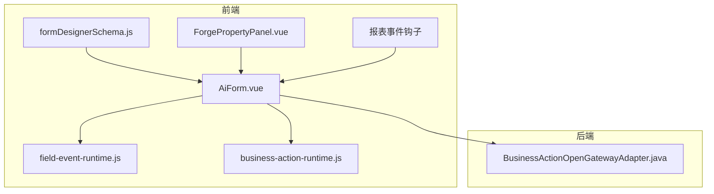
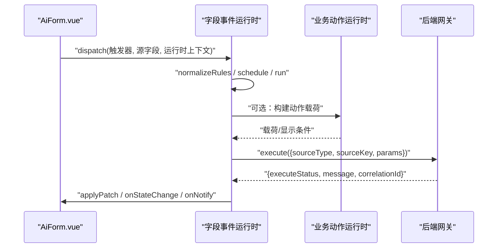
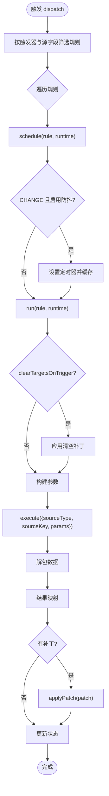
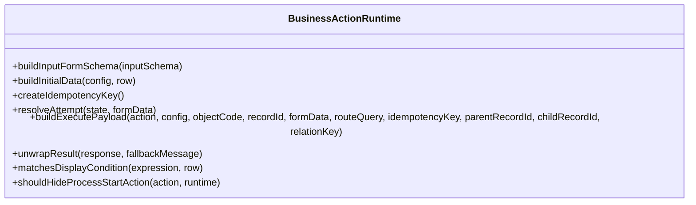
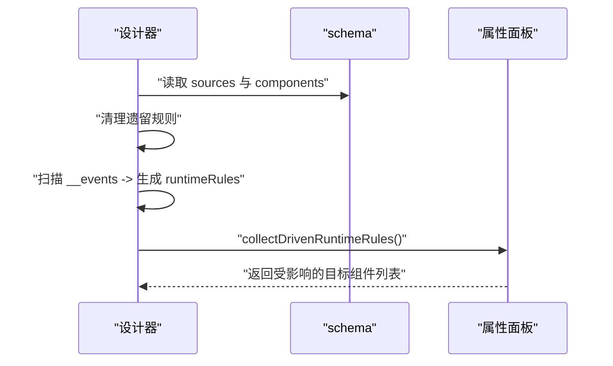
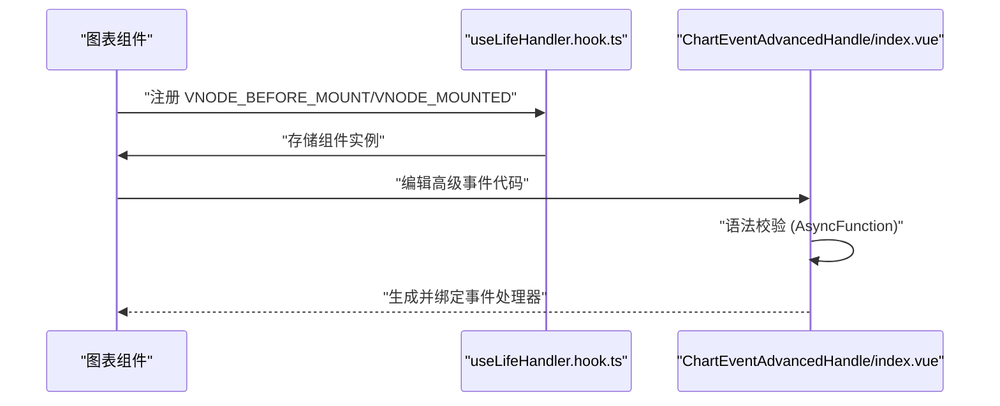
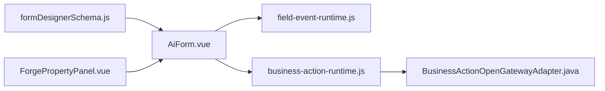

# 组件事件系统

<cite>
**本文引用的文件**
- [field-event-runtime.js](file://forge-admin-ui/src/components/ai-form/field-event-runtime.js)
- [business-action-runtime.js](file://forge-admin-ui/src/components/ai-form/business-action-runtime.js)
- [AiForm.vue](file://forge-admin-ui/src/components/ai-form/AiForm.vue)
- [formDesignerSchema.js](file://forge-admin-ui/src/views/app-center/components/designer/form-first/formDesignerSchema.js)
- [ForgePropertyPanel.vue](file://forge-admin-ui/src/views/app-center/components/designer/forge-form-designer/ForgePropertyPanel.vue)
- [BusinessActionOpenGatewayAdapter.java](file://forge-server/forge-framework/forge-plugin-parent/forge-plugin-capability-parent/forge-plugin-capability-actions/src/main/java/com/mdframe/forge/plugin/capability/secureaction/gateway/BusinessActionOpenGatewayAdapter.java)
- [useLifeHandler.hook.ts](file://forge-report-ui/src/hooks/useLifeHandler.hook.ts)
- [ChartEventAdvancedHandle/index.vue](file://forge-report-ui/src/views/chart/ContentConfigurations/components/ChartEvent/components/ChartEventAdvancedHandle/index.vue)
</cite>

## 目录
1. [简介](#简介)
2. [项目结构](#项目结构)
3. [核心组件](#核心组件)
4. [架构总览](#架构总览)
5. [详细组件分析](#详细组件分析)
6. [依赖关系分析](#依赖关系分析)
7. [性能考量](#性能考量)
8. [故障排查指南](#故障排查指南)
9. [结论](#结论)
10. [附录：API参考与规范](#附录api参考与规范)

## 简介
本技术文档围绕低代码平台的“组件事件系统”展开，重点覆盖事件总线设计、事件冒泡机制、监听器与处理器管理、运行时规则引擎、业务动作执行、数据绑定与状态同步。同时给出自定义事件开发指引、调试工具建议、性能优化策略与错误处理方案，并提供事件API参考、开发规范与最佳实践。

## 项目结构
事件系统主要分布在以下模块：
- 表单运行时与字段事件：位于 ai-form 子模块，负责字段级事件触发、参数映射、结果映射、状态更新与通知。
- 业务动作运行时：位于 ai-form 子模块，负责构建动作入参、幂等键、显示条件判断、流程启动隐藏逻辑等。
- 设计器与属性面板：用于收集、校验、迁移和展示运行时规则（runtimeRules）与旧版事件（__events）。
- 报表端事件：提供生命周期事件与高级事件编辑能力，支持动态生成函数并执行。
- 后端网关：将前端动作请求转换为服务端执行命令，返回统一的结果结构。

**图表来源**
- [AiForm.vue:148-159](file://forge-admin-ui/src/components/ai-form/AiForm.vue#L148-L159)
- [field-event-runtime.js:99-294](file://forge-admin-ui/src/components/ai-form/field-event-runtime.js#L99-L294)
- [business-action-runtime.js:115-154](file://forge-admin-ui/src/components/ai-form/business-action-runtime.js#L115-L154)
- [formDesignerSchema.js:491-518](file://forge-admin-ui/src/views/app-center/components/designer/form-first/formDesignerSchema.js#L491-L518)
- [ForgePropertyPanel.vue:6487-6517](file://forge-admin-ui/src/views/app-center/components/designer/forge-form-designer/ForgePropertyPanel.vue#L6487-L6517)
- [BusinessActionOpenGatewayAdapter.java:103-135](file://forge-server/forge-framework/forge-plugin-parent/forge-plugin-capability-parent/forge-plugin-capability-actions/src/main/java/com/mdframe/forge/plugin/capability/secureaction/gateway/BusinessActionOpenGatewayAdapter.java#L103-L135)

**章节来源**
- [AiForm.vue:148-159](file://forge-admin-ui/src/components/ai-form/AiForm.vue#L148-L159)
- [field-event-runtime.js:99-294](file://forge-admin-ui/src/components/ai-form/field-event-runtime.js#L99-L294)
- [business-action-runtime.js:115-154](file://forge-admin-ui/src/components/ai-form/business-action-runtime.js#L115-L154)
- [formDesignerSchema.js:491-518](file://forge-admin-ui/src/views/app-center/components/designer/form-first/formDesignerSchema.js#L491-L518)
- [ForgePropertyPanel.vue:6487-6517](file://forge-admin-ui/src/views/app-center/components/designer/forge-form-designer/ForgePropertyPanel.vue#L6487-L6517)
- [BusinessActionOpenGatewayAdapter.java:103-135](file://forge-server/forge-framework/forge-plugin-parent/forge-plugin-capability-parent/forge-plugin-capability-actions/src/main/java/com/mdframe/forge/plugin/capability/secureaction/gateway/BusinessActionOpenGatewayAdapter.java#L103-L135)

## 核心组件
- 字段事件运行时（Field Event Runtime）
  - 职责：规范化规则、参数映射、结果映射、防抖调度、并发控制、状态更新与通知。
  - 关键能力：支持多种触发器（如表单加载、变更、手动触发等）、安全路径读取、分页参数、错误模式与未命中提示。
- 业务动作运行时（Business Action Runtime）
  - 职责：构建动作执行载荷、幂等键、显示条件计算、流程启动隐藏逻辑、结果解包。
  - 关键能力：输入表单模式化、默认值注入、上下文传递、表达式解析与比较。
- 设计器与属性面板
  - 职责：收集目标组件的运行时规则依赖、清理旧事件投影、迁移到新的 runtimeRules 模型。
- 报表端事件
  - 职责：提供生命周期事件与高级事件编辑器，动态生成并执行用户代码。

**章节来源**
- [field-event-runtime.js:44-97](file://forge-admin-ui/src/components/ai-form/field-event-runtime.js#L44-L97)
- [business-action-runtime.js:26-90](file://forge-admin-ui/src/components/ai-form/business-action-runtime.js#L26-L90)
- [formDesignerSchema.js:491-518](file://forge-admin-ui/src/views/app-center/components/designer/form-first/formDesignerSchema.js#L491-L518)
- [useLifeHandler.hook.ts:33-69](file://forge-report-ui/src/hooks/useLifeHandler.hook.ts#L33-L69)

## 架构总览
事件系统采用“组件内事件总线 + 运行时规则引擎 + 业务动作网关”的分层架构：
- 组件层：AiForm 作为入口，聚合字段事件运行时与业务动作运行时。
- 运行时层：字段事件运行时负责规则调度与状态同步；业务动作运行时负责动作载荷与显示条件。
- 服务层：后端网关接收动作执行请求，调用发布后的动作实现并返回统一结果。

**图表来源**
- [AiForm.vue:148-159](file://forge-admin-ui/src/components/ai-form/AiForm.vue#L148-L159)
- [field-event-runtime.js:123-227](file://forge-admin-ui/src/components/ai-form/field-event-runtime.js#L123-L227)
- [business-action-runtime.js:115-154](file://forge-admin-ui/src/components/ai-form/business-action-runtime.js#L115-L154)
- [BusinessActionOpenGatewayAdapter.java:116-135](file://forge-server/forge-framework/forge-plugin-parent/forge-plugin-capability-parent/forge-plugin-capability-actions/src/main/java/com/mdframe/forge/plugin/capability/secureaction/gateway/BusinessActionOpenGatewayAdapter.java#L116-L135)

## 详细组件分析

### 字段事件运行时（Field Event Runtime）
- 规则规范化与过滤
  - 仅保留合法标识符、受支持的触发器、查询源类型、安全路径与结果模式。
  - 去重与已知字段白名单校验，避免非法或危险配置进入运行期。
- 参数与结果映射
  - 参数来源支持表单字段、上下文路径、路由查询；结果支持根节点或首行选择，缺失时可按策略清空。
- 调度与并发控制
  - CHANGE 触发器支持防抖；同一规则多次触发会取消上一次定时器与中止控制器。
  - 使用序列号保证最新请求优先，丢弃过期响应。
- 状态与通知
  - 统一的状态机：idle/loading/success/not_found/error，并通过回调上报状态与消息。
  - 错误模式支持 MESSAGE/SILENT，未命中时提供可配置提示。

**图表来源**
- [field-event-runtime.js:123-227](file://forge-admin-ui/src/components/ai-form/field-event-runtime.js#L123-L227)
- [field-event-runtime.js:306-362](file://forge-admin-ui/src/components/ai-form/field-event-runtime.js#L306-L362)
- [field-event-runtime.js:483-503](file://forge-admin-ui/src/components/ai-form/field-event-runtime.js#L483-L503)

**章节来源**
- [field-event-runtime.js:44-97](file://forge-admin-ui/src/components/ai-form/field-event-runtime.js#L44-L97)
- [field-event-runtime.js:99-294](file://forge-admin-ui/src/components/ai-form/field-event-runtime.js#L99-L294)
- [field-event-runtime.js:306-434](file://forge-admin-ui/src/components/ai-form/field-event-runtime.js#L306-L434)
- [field-event-runtime.js:483-523](file://forge-admin-ui/src/components/ai-form/field-event-runtime.js#L483-L523)

### 业务动作运行时（Business Action Runtime）
- 输入表单模式化
  - 根据输入 schema 生成统一的输入项类型、占位符、精度与选项。
- 初始数据与默认值
  - 支持从 row 中读取默认值，合并外部 defaultValues。
- 幂等性
  - 基于 crypto 或降级策略生成幂等键，结合负载摘要自动轮换。
- 载荷构建
  - 组装 suiteCode、objectCode、recordId、formData、context、idempotencyKey 等必要字段。
- 显示条件与流程控制
  - 解析结构化或文本表达式，支持 IN/NOT IN、比较运算符、包含匹配等。
  - 针对流程启动按钮，依据运行态隐藏重复启动。

**图表来源**
- [business-action-runtime.js:26-154](file://forge-admin-ui/src/components/ai-form/business-action-runtime.js#L26-L154)
- [business-action-runtime.js:205-310](file://forge-admin-ui/src/components/ai-form/business-action-runtime.js#L205-L310)

**章节来源**
- [business-action-runtime.js:26-154](file://forge-admin-ui/src/components/ai-form/business-action-runtime.js#L26-L154)
- [business-action-runtime.js:170-203](file://forge-admin-ui/src/components/ai-form/business-action-runtime.js#L170-L203)
- [business-action-runtime.js:205-310](file://forge-admin-ui/src/components/ai-form/business-action-runtime.js#L205-L310)

### 设计器与属性面板（运行时规则收集与迁移）
- 旧事件到新规则的迁移
  - 在保存或刷新时，扫描来源组件的 __events，识别 showHide/enableDisable 等动作，生成对应的 runtimeRules，并标记 legacyEventId 以便后续清理。
- 依赖收集
  - 收集被某字段驱动的运行时规则，便于在设计器中展示影响范围。

**图表来源**
- [formDesignerSchema.js:491-518](file://forge-admin-ui/src/views/app-center/components/designer/form-first/formDesignerSchema.js#L491-L518)
- [ForgePropertyPanel.vue:6487-6517](file://forge-admin-ui/src/views/app-center/components/designer/forge-form-designer/ForgePropertyPanel.vue#L6487-L6517)

**章节来源**
- [formDesignerSchema.js:491-518](file://forge-admin-ui/src/views/app-center/components/designer/form-first/formDesignerSchema.js#L491-L518)
- [ForgePropertyPanel.vue:6487-6517](file://forge-admin-ui/src/views/app-center/components/designer/forge-form-designer/ForgePropertyPanel.vue#L6487-L6517)

### 报表端事件（生命周期与高级事件）
- 生命周期事件
  - 在渲染前后挂载组件实例，便于后续通过 ID 访问。
- 高级事件
  - 支持编写异步函数，并在运行时通过 new Function/AsyncFunction 动态生成并执行。
  - 提供语法校验与错误定位。

**图表来源**
- [useLifeHandler.hook.ts:33-69](file://forge-report-ui/src/hooks/useLifeHandler.hook.ts#L33-L69)
- [ChartEventAdvancedHandle/index.vue:173-221](file://forge-report-ui/src/views/chart/ContentConfigurations/components/ChartEvent/components/ChartEventAdvancedHandle/index.vue#L173-L221)

**章节来源**
- [useLifeHandler.hook.ts:33-69](file://forge-report-ui/src/hooks/useLifeHandler.hook.ts#L33-L69)
- [ChartEventAdvancedHandle/index.vue:173-221](file://forge-report-ui/src/views/chart/ContentConfigurations/components/ChartEvent/components/ChartEventAdvancedHandle/index.vue#L173-L221)

## 依赖关系分析
- AiForm 依赖字段事件运行时与业务动作运行时，形成“事件触发 -> 规则调度 -> 动作执行 -> 状态同步”的闭环。
- 设计器与属性面板对运行时规则进行收集、校验与迁移，确保新旧事件平滑过渡。
- 后端网关统一封装动作执行结果，前端通过统一结构解包与错误处理。

**图表来源**
- [AiForm.vue:148-159](file://forge-admin-ui/src/components/ai-form/AiForm.vue#L148-L159)
- [field-event-runtime.js:99-294](file://forge-admin-ui/src/components/ai-form/field-event-runtime.js#L99-L294)
- [business-action-runtime.js:115-154](file://forge-admin-ui/src/components/ai-form/business-action-runtime.js#L115-L154)
- [BusinessActionOpenGatewayAdapter.java:116-135](file://forge-server/forge-framework/forge-plugin-parent/forge-plugin-capability-parent/forge-plugin-capability-actions/src/main/java/com/mdframe/forge/plugin/capability/secureaction/gateway/BusinessActionOpenGatewayAdapter.java#L116-L135)

**章节来源**
- [AiForm.vue:148-159](file://forge-admin-ui/src/components/ai-form/AiForm.vue#L148-L159)
- [field-event-runtime.js:99-294](file://forge-admin-ui/src/components/ai-form/field-event-runtime.js#L99-L294)
- [business-action-runtime.js:115-154](file://forge-admin-ui/src/components/ai-form/business-action-runtime.js#L115-L154)
- [BusinessActionOpenGatewayAdapter.java:116-135](file://forge-server/forge-framework/forge-plugin-parent/forge-plugin-capability-parent/forge-plugin-capability-actions/src/main/java/com/mdframe/forge/plugin/capability/secureaction/gateway/BusinessActionOpenGatewayAdapter.java#L116-L135)

## 性能考量
- 防抖与节流
  - CHANGE 触发器默认启用防抖，避免频繁请求；可通过规则配置调整延迟。
- 并发与取消
  - 使用 AbortController 取消过时请求；序列号机制确保最新响应优先。
- 资源清理
  - dispose 时清理定时器与控制器，防止内存泄漏。
- 数据解包与映射
  - 统一解包策略减少分支判断；结果映射仅在必要时生成补丁，降低渲染开销。

[本节为通用指导，不直接分析具体文件]

## 故障排查指南
- 常见错误模式
  - 未命中数据：not_found 状态与可配置提示。
  - 执行失败：error 状态与错误消息；支持静默模式。
- 调试建议
  - 利用 onStateChange 与 onNotify 输出规则执行状态与消息。
  - 在设计器中查看“被驱动规则”，确认字段变更的影响范围。
  - 报表端高级事件编辑器提供语法校验与错误定位。
- 后端问题定位
  - 检查网关返回的 executeStatus、message、correlationId，结合前端日志定位链路。

**章节来源**
- [field-event-runtime.js:216-233](file://forge-admin-ui/src/components/ai-form/field-event-runtime.js#L216-L233)
- [ForgePropertyPanel.vue:6487-6517](file://forge-admin-ui/src/views/app-center/components/designer/forge-form-designer/ForgePropertyPanel.vue#L6487-L6517)
- [ChartEventAdvancedHandle/index.vue:192-216](file://forge-report-ui/src/views/chart/ContentConfigurations/components/ChartEvent/components/ChartEventAdvancedHandle/index.vue#L192-L216)
- [BusinessActionOpenGatewayAdapter.java:116-135](file://forge-server/forge-framework/forge-plugin-parent/forge-plugin-capability-parent/forge-plugin-capability-actions/src/main/java/com/mdframe/forge/plugin/capability/secureaction/gateway/BusinessActionOpenGatewayAdapter.java#L116-L135)

## 结论
该事件系统以字段事件运行时为核心，配合业务动作运行时与设计器规则迁移，实现了从事件触发、规则调度、动作执行到状态同步的完整闭环。通过防抖、并发控制、统一解包与错误模式，兼顾了性能与稳定性。报表端的事件能力进一步扩展了可视化组件的动态交互边界。建议在复杂场景中合理使用运行时规则与动作载荷，结合调试与监控手段，持续提升用户体验与可维护性。

[本节为总结，不直接分析具体文件]

## 附录：API参考与规范

### 字段事件运行时 API
- createFieldEventRuntime(options)
  - options.rules：规则数组，需通过 normalizeFieldEventRules 校验。
  - options.fields：已知字段集合，用于白名单校验。
  - options.getFormData：获取当前表单数据。
  - options.getContext：获取上下文数据。
  - options.getRouteQuery：获取路由查询参数。
  - options.execute：执行查询或动作，返回统一数据结构。
  - options.applyPatch：应用字段补丁，触发状态更新。
  - options.onStateChange：状态变化回调。
  - options.onNotify：通知回调（警告/错误）。
- 方法
  - dispatch(trigger, sourceField, runtime)：分发事件。
  - getRules(trigger, sourceField)：获取匹配规则。
  - hasRule(trigger, sourceField)：是否存在规则。
  - setRules(rules, fields)：更新规则集。
  - dispose()：销毁资源。

**章节来源**
- [field-event-runtime.js:99-294](file://forge-admin-ui/src/components/ai-form/field-event-runtime.js#L99-L294)
- [field-event-runtime.js:44-97](file://forge-admin-ui/src/components/ai-form/field-event-runtime.js#L44-L97)

### 业务动作运行时 API
- buildBusinessActionInputFormSchema(inputSchema)：生成输入表单模式。
- buildBusinessActionInitialData(config, row)：构建初始数据。
- createBusinessActionIdempotencyKey(cryptoLike)：生成幂等键。
- resolveBusinessActionAttempt(state, formData, keyFactory)：计算幂等键与负载摘要。
- buildBusinessActionExecutePayload(...)：构建执行载荷。
- unwrapBusinessActionResult(response, fallbackMessage)：解包结果并抛出失败异常。
- matchesRuntimeDisplayCondition(expression, row)：计算显示条件。
- shouldHideProcessStartAction(action, runtime)：决定是否隐藏流程启动按钮。

**章节来源**
- [business-action-runtime.js:26-154](file://forge-admin-ui/src/components/ai-form/business-action-runtime.js#L26-L154)
- [business-action-runtime.js:205-310](file://forge-admin-ui/src/components/ai-form/business-action-runtime.js#L205-L310)

### 设计器与属性面板
- collectDrivenRuntimeRules(components, sourceField, sourceId)：收集被某字段驱动的运行时规则。
- runtimeRuleDependsOnField(rule, sourceField)：判断规则是否依赖指定字段。

**章节来源**
- [ForgePropertyPanel.vue:6487-6517](file://forge-admin-ui/src/views/app-center/components/designer/forge-form-designer/ForgePropertyPanel.vue#L6487-L6517)

### 报表端事件
- 生命周期事件：VNODE_BEFORE_MOUNT、VNODE_MOUNTED。
- 高级事件：支持异步函数，运行时动态生成并执行。

**章节来源**
- [useLifeHandler.hook.ts:33-69](file://forge-report-ui/src/hooks/useLifeHandler.hook.ts#L33-L69)
- [ChartEventAdvancedHandle/index.vue:173-221](file://forge-report-ui/src/views/chart/ContentConfigurations/components/ChartEvent/components/ChartEventAdvancedHandle/index.vue#L173-L221)

### 开发规范与最佳实践
- 规则配置
  - 使用安全的标识符与路径；避免危险键名；明确 resultMode 与 errorMode。
- 事件触发
  - 对高频事件启用防抖；合理设置 clearTargetsOnTrigger 以避免脏数据。
- 动作执行
  - 始终携带 idempotencyKey；正确构造 context 与 formData。
- 状态与通知
  - 通过 onStateChange 与 onNotify 统一处理反馈；错误模式按需选择。
- 设计器
  - 定期清理遗留事件投影；利用依赖收集功能评估变更影响。

[本节为通用指导，不直接分析具体文件]