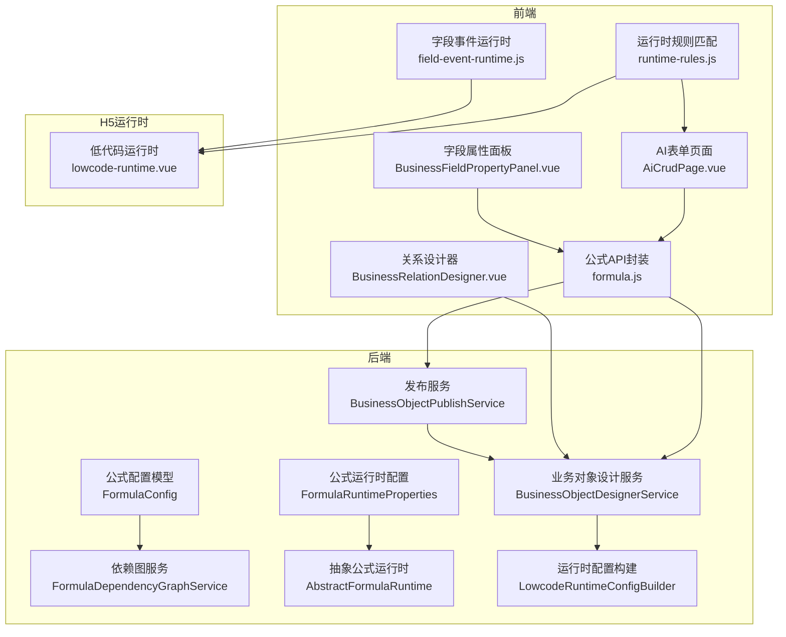
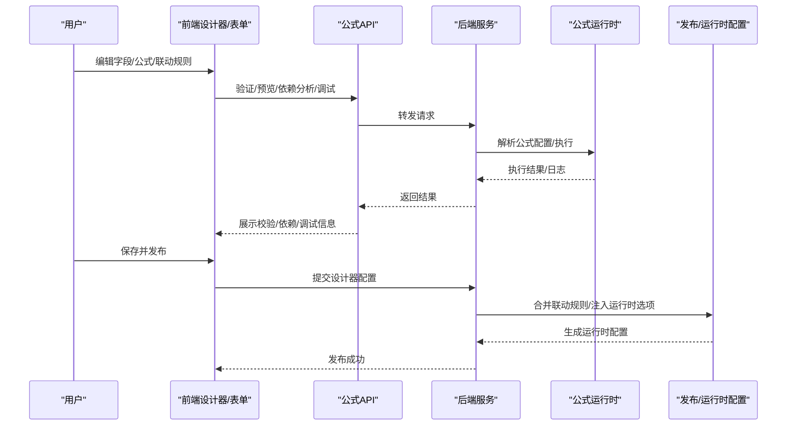
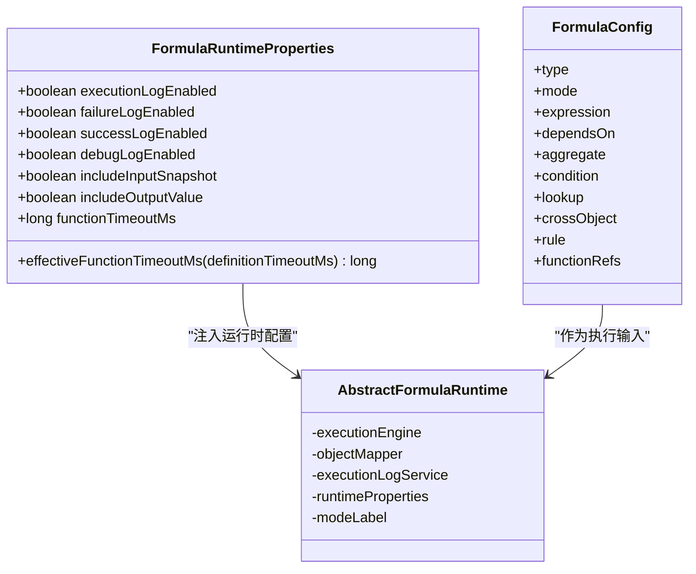
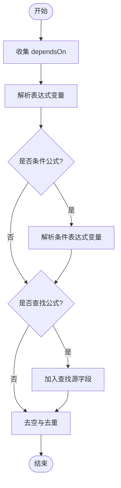
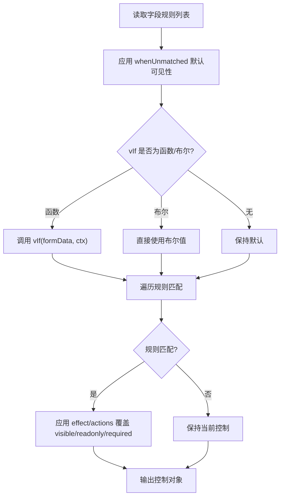
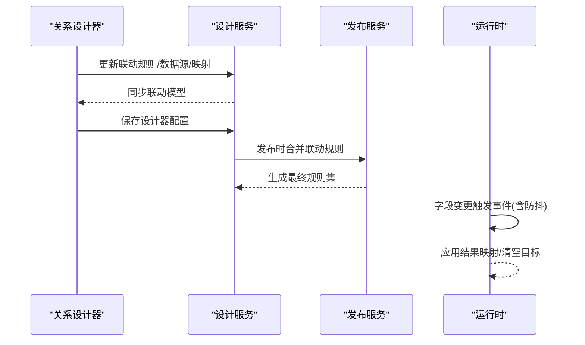
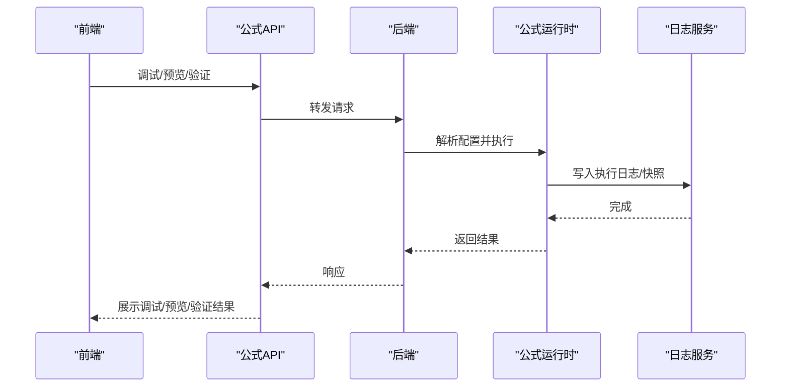
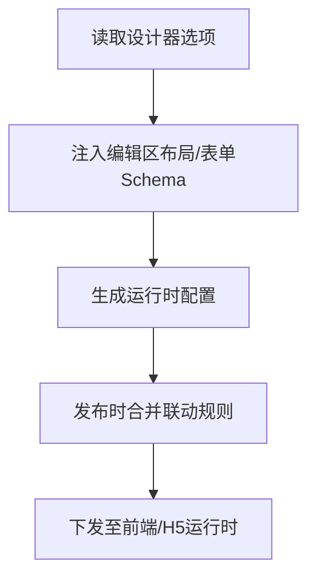
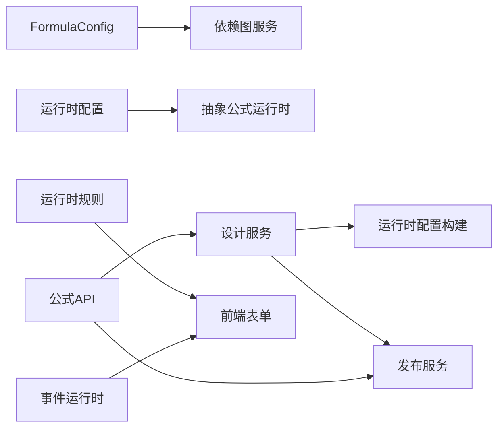

# 动态配置机制

<cite>
**本文引用的文件**
- [FormulaRuntimeProperties.java](file://forge-server/forge-framework/forge-plugin-parent/forge-plugin-generator/src/main/java/com/mdframe/forge/plugin/generator/service/formula/FormulaRuntimeProperties.java)
- [FormulaConfig.java](file://forge-server/forge-framework/forge-plugin-parent/forge-plugin-generator/src/main/java/com/mdframe/forge/plugin/generator/domain/formula/FormulaConfig.java)
- [FormulaDependencyGraphService.java](file://forge-server/forge-framework/forge-plugin-parent/forge-plugin-generator/src/main/java/com/mdframe/forge/plugin/generator/service/formula/FormulaDependencyGraphService.java)
- [AbstractFormulaRuntime.java](file://forge-server/forge-framework/forge-plugin-parent/forge-plugin-generator/src/main/java/com/mdframe/forge/plugin/generator/service/formula/AbstractFormulaRuntime.java)
- [BusinessObjectDesignerService.java](file://forge-server/forge-framework/forge-plugin-parent/forge-plugin-generator/src/main/java/com/mdframe/forge/plugin/generator/service/businessapp/BusinessObjectDesignerService.java)
- [BusinessObjectPublishService.java](file://forge-server/forge-framework/forge-plugin-parent/forge-plugin-generator/src/main/java/com/mdframe/forge/plugin/generator/service/businessapp/BusinessObjectPublishService.java)
- [LowcodeRuntimeConfigBuilder.java](file://forge-server/forge-framework/forge-plugin-parent/forge-plugin-generator/src/main/java/com/mdframe/forge/plugin/generator/service/lowcode/LowcodeRuntimeConfigBuilder.java)
- [formula.js](file://forge-admin-ui/src/api/formula.js)
- [runtime-rules.js](file://forge-admin-ui/src/components/lowcode-builder/shared/runtime-rules.js)
- [field-event-runtime.js](file://forge-admin-ui/src/components/ai-form/field-event-runtime.js)
- [AiCrudPage.vue](file://forge-admin-ui/src/components/ai-form/AiCrudPage.vue)
- [BusinessRelationDesigner.vue](file://forge-admin-ui/src/views/app-center/components/designer/BusinessRelationDesigner.vue)
- [BusinessFieldPropertyPanel.vue](file://forge-admin-ui/src/views/app-center/components/designer/BusinessFieldPropertyPanel.vue)
- [lowcode-runtime.vue](file://forge-h5-ui/src/pages/lowcode-runtime.vue)
</cite>

## 目录
1. [简介](#简介)
2. [项目结构](#项目结构)
3. [核心组件](#核心组件)
4. [架构总览](#架构总览)
5. [详细组件分析](#详细组件分析)
6. [依赖关系分析](#依赖关系分析)
7. [性能考量](#性能考量)
8. [故障排查指南](#故障排查指南)
9. [结论](#结论)
10. [附录](#附录)

## 简介
本技术文档围绕低代码平台的“属性动态配置机制”展开，重点说明：
- 属性依赖关系建模与解析
- 条件显示逻辑与运行时控制
- 动态计算属性的实现与公式引擎集成
- 属性联动规则、运行时配置更新机制
- 复杂业务场景的配置方案、性能优化策略与调试工具使用
- 最佳实践与常见问题解决方案

该机制贯穿设计期（Schema 定义、校验、预览）与运行期（事件驱动、表单渲染、数据回填），通过前后端协作实现高内聚、可维护的动态能力。

## 项目结构
从仓库中可见，动态配置涉及后端服务层（公式引擎、依赖图、发布与运行时配置）、前端设计器（字段属性面板、关系设计器、运行时规则）以及 H5 运行时（事件调度）。关键模块分布如下：
- 后端：公式运行时、依赖图构建、发布时联动规则合并、运行时配置构建
- 前端：API 封装、运行时规则匹配、字段事件运行时、设计器联动编辑
- H5：轻量运行时事件调度与防抖执行

**图表来源**
- [FormulaRuntimeProperties.java:1-59](file://forge-server/forge-framework/forge-plugin-parent/forge-plugin-generator/src/main/java/com/mdframe/forge/plugin/generator/service/formula/FormulaRuntimeProperties.java#L1-L59)
- [FormulaConfig.java:142-168](file://forge-server/forge-framework/forge-plugin-parent/forge-plugin-generator/src/main/java/com/mdframe/forge/plugin/generator/domain/formula/FormulaConfig.java#L142-L168)
- [FormulaDependencyGraphService.java:188-221](file://forge-server/forge-framework/forge-plugin-parent/forge-plugin-generator/src/main/java/com/mdframe/forge/plugin/generator/service/formula/FormulaDependencyGraphService.java#L188-L221)
- [AbstractFormulaRuntime.java:1-34](file://forge-server/forge-framework/forge-plugin-parent/forge-plugin-generator/src/main/java/com/mdframe/forge/plugin/generator/service/formula/AbstractFormulaRuntime.java#L1-L34)
- [BusinessObjectDesignerService.java:2959-2991](file://forge-server/forge-framework/forge-plugin-parent/forge-plugin-generator/src/main/java/com/mdframe/forge/plugin/generator/service/businessapp/BusinessObjectDesignerService.java#L2959-L2991)
- [BusinessObjectPublishService.java:2223-2247](file://forge-server/forge-framework/forge-plugin-parent/forge-plugin-generator/src/main/java/com/mdframe/forge/plugin/generator/service/businessapp/BusinessObjectPublishService.java#L2223-L2247)
- [LowcodeRuntimeConfigBuilder.java:197-205](file://forge-server/forge-framework/forge-plugin-parent/forge-plugin-generator/src/main/java/com/mdframe/forge/plugin/generator/service/lowcode/LowcodeRuntimeConfigBuilder.java#L197-L205)
- [formula.js:1-84](file://forge-admin-ui/src/api/formula.js#L1-L84)
- [runtime-rules.js:36-163](file://forge-admin-ui/src/components/lowcode-builder/shared/runtime-rules.js#L36-L163)
- [field-event-runtime.js:89-127](file://forge-admin-ui/src/components/ai-form/field-event-runtime.js#L89-L127)
- [AiCrudPage.vue:3195-3216](file://forge-admin-ui/src/components/ai-form/AiCrudPage.vue#L3195-L3216)
- [BusinessRelationDesigner.vue:1361-2123](file://forge-admin-ui/src/views/app-center/components/designer/BusinessRelationDesigner.vue#L1361-L2123)
- [lowcode-runtime.vue:709-748](file://forge-h5-ui/src/pages/lowcode-runtime.vue#L709-L748)

**章节来源**
- [FormulaRuntimeProperties.java:1-59](file://forge-server/forge-framework/forge-plugin-parent/forge-plugin-generator/src/main/java/com/mdframe/forge/plugin/generator/service/formula/FormulaRuntimeProperties.java#L1-L59)
- [FormulaConfig.java:142-168](file://forge-server/forge-framework/forge-plugin-parent/forge-plugin-generator/src/main/java/com/mdframe/forge/plugin/generator/domain/formula/FormulaConfig.java#L142-L168)
- [FormulaDependencyGraphService.java:188-221](file://forge-server/forge-framework/forge-plugin-parent/forge-plugin-generator/src/main/java/com/mdframe/forge/plugin/generator/service/formula/FormulaDependencyGraphService.java#L188-L221)
- [AbstractFormulaRuntime.java:1-34](file://forge-server/forge-framework/forge-plugin-parent/forge-plugin-generator/src/main/java/com/mdframe/forge/plugin/generator/service/formula/AbstractFormulaRuntime.java#L1-L34)
- [BusinessObjectDesignerService.java:2959-2991](file://forge-server/forge-framework/forge-plugin-parent/forge-plugin-generator/src/main/java/com/mdframe/forge/plugin/generator/service/businessapp/BusinessObjectDesignerService.java#L2959-L2991)
- [BusinessObjectPublishService.java:2223-2247](file://forge-server/forge-framework/forge-plugin-parent/forge-plugin-generator/src/main/java/com/mdframe/forge/plugin/generator/service/businessapp/BusinessObjectPublishService.java#L2223-L2247)
- [LowcodeRuntimeConfigBuilder.java:197-205](file://forge-server/forge-framework/forge-plugin-parent/forge-plugin-generator/src/main/java/com/mdframe/forge/plugin/generator/service/lowcode/LowcodeRuntimeConfigConfigBuilder.java#L197-L205)
- [formula.js:1-84](file://forge-admin-ui/src/api/formula.js#L1-L84)
- [runtime-rules.js:36-163](file://forge-admin-ui/src/components/lowcode-builder/shared/runtime-rules.js#L36-L163)
- [field-event-runtime.js:89-127](file://forge-admin-ui/src/components/ai-form/field-event-runtime.js#L89-L127)
- [AiCrudPage.vue:3195-3216](file://forge-admin-ui/src/components/ai-form/AiCrudPage.vue#L3195-L3216)
- [BusinessRelationDesigner.vue:1361-2123](file://forge-admin-ui/src/views/app-center/components/designer/BusinessRelationDesigner.vue#L1361-L2123)
- [lowcode-runtime.vue:709-748](file://forge-h5-ui/src/pages/lowcode-runtime.vue#L709-L748)

## 核心组件
- 公式运行时配置：提供公式执行开关、日志策略、函数超时等运行时参数，支持按定义级超时进行有效值计算。
- 公式配置模型：以 Builder 模式构造公式类型、表达式、依赖、聚合、条件、查找、跨对象、函数引用等。
- 依赖图服务：从 dependsOn、表达式变量、条件表达式、查找源字段等维度提取依赖并构建边。
- 抽象公式运行时：模板方法统一执行流程，子类负责按模式过滤公式；集成执行引擎、日志与运行时配置。
- 业务对象设计服务：处理运行时可见性规则检测、字段属性清洗、表单设计器 Schema 与选项注入。
- 发布服务：将设计器中的联动规则与字段级 cascade 配置合并为最终联动规则集。
- 运行时配置构建：将编辑区布局、表单设计器 Schema 等注入到运行时选项中。
- 前端公式 API：封装验证、预览、依赖分析、调试、函数市场等接口。
- 运行时规则匹配：统一解析 runtimeRules/visibilityRules/displayRules，计算 visible/readonly/required 控制。
- 字段事件运行时：基于触发器与源字段筛选规则，支持防抖、序列执行、结果映射与清理。
- AI 表单页面：运行时依赖收集、数值归一化、算术操作数识别等。
- 关系设计器：联动规则编辑、数据源类型推断、默认值填充与模型同步。
- H5 运行时：事件调度、防抖执行、跳过与清空目标字段。

**章节来源**
- [FormulaRuntimeProperties.java:1-59](file://forge-server/forge-framework/forge-plugin-parent/forge-plugin-generator/src/main/java/com/mdframe/forge/plugin/generator/service/formula/FormulaRuntimeProperties.java#L1-L59)
- [FormulaConfig.java:142-168](file://forge-server/forge-framework/forge-plugin-parent/forge-plugin-generator/src/main/java/com/mdframe/forge/plugin/generator/domain/formula/FormulaConfig.java#L142-L168)
- [FormulaDependencyGraphService.java:188-221](file://forge-server/forge-framework/forge-plugin-parent/forge-plugin-generator/src/main/java/com/mdframe/forge/plugin/generator/service/formula/FormulaDependencyGraphService.java#L188-L221)
- [AbstractFormulaRuntime.java:1-34](file://forge-server/forge-framework/forge-plugin-parent/forge-plugin-generator/src/main/java/com/mdframe/forge/plugin/generator/service/formula/AbstractFormulaRuntime.java#L1-L34)
- [BusinessObjectDesignerService.java:2959-2991](file://forge-server/forge-framework/forge-plugin-parent/forge-plugin-generator/src/main/java/com/mdframe/forge/plugin/generator/service/businessapp/BusinessObjectDesignerService.java#L2959-L2991)
- [BusinessObjectPublishService.java:2223-2247](file://forge-server/forge-framework/forge-plugin-parent/forge-plugin-generator/src/main/java/com/mdframe/forge/plugin/generator/service/businessapp/BusinessObjectPublishService.java#L2223-L2247)
- [LowcodeRuntimeConfigBuilder.java:197-205](file://forge-server/forge-framework/forge-plugin-parent/forge-plugin-generator/src/main/java/com/mdframe/forge/plugin/generator/service/lowcode/LowcodeRuntimeConfigBuilder.java#L197-L205)
- [formula.js:1-84](file://forge-admin-ui/src/api/formula.js#L1-L84)
- [runtime-rules.js:36-163](file://forge-admin-ui/src/components/lowcode-builder/shared/runtime-rules.js#L36-L163)
- [field-event-runtime.js:89-127](file://forge-admin-ui/src/components/ai-form/field-event-runtime.js#L89-L127)
- [AiCrudPage.vue:3195-3216](file://forge-admin-ui/src/components/ai-form/AiCrudPage.vue#L3195-L3216)
- [BusinessRelationDesigner.vue:1361-2123](file://forge-admin-ui/src/views/app-center/components/designer/BusinessRelationDesigner.vue#L1361-L2123)
- [lowcode-runtime.vue:709-748](file://forge-h5-ui/src/pages/lowcode-runtime.vue#L709-L748)

## 架构总览
动态配置机制由“设计期 + 运行期”双阶段组成：
- 设计期：在业务对象设计器中定义字段、公式、联动规则与运行时规则；后端提供依赖分析与校验、预览与调试能力。
- 运行期：表单加载或字段变更触发事件运行时，根据运行时规则与联动规则更新字段状态与值；公式引擎按需计算并持久化或虚拟输出。

**图表来源**
- [formula.js:1-84](file://forge-admin-ui/src/api/formula.js#L1-L84)
- [BusinessObjectDesignerService.java:2959-2991](file://forge-server/forge-framework/forge-plugin-parent/forge-plugin-generator/src/main/java/com/mdframe/forge/plugin/generator/service/businessapp/BusinessObjectDesignerService.java#L2959-L2991)
- [BusinessObjectPublishService.java:2223-2247](file://forge-server/forge-framework/forge-plugin-parent/forge-plugin-generator/src/main/java/com/mdframe/forge/plugin/generator/service/businessapp/BusinessObjectPublishService.java#L2223-L2247)
- [LowcodeRuntimeConfigBuilder.java:197-205](file://forge-server/forge-framework/forge-plugin-parent/forge-plugin-generator/src/main/java/com/mdframe/forge/plugin/generator/service/lowcode/LowcodeRuntimeConfigBuilder.java#L197-L205)
- [AbstractFormulaRuntime.java:1-34](file://forge-server/forge-framework/forge-plugin-parent/forge-plugin-generator/src/main/java/com/mdframe/forge/plugin/generator/service/formula/AbstractFormulaRuntime.java#L1-L34)

## 详细组件分析

### 公式引擎与运行时配置
- 运行时开关与日志：通过配置项控制执行日志、失败/成功/调试日志、输入输出快照捕获，以及 Java Bean 函数调用超时。
- 公式配置模型：支持 CALC/AGGREGATE/CONDITIONAL/LOOKUP/CROSS_OBJECT 等类型，包含表达式、依赖、聚合、条件、查找、跨对象、函数引用等。
- 依赖提取：综合 dependsOn、表达式变量、条件表达式、查找源字段，去空后形成字段依赖集合。
- 执行基类：模板方法统一执行循环，子类按模式过滤公式；集成执行引擎、日志服务与运行时配置。

**图表来源**
- [FormulaRuntimeProperties.java:1-59](file://forge-server/forge-framework/forge-plugin-parent/forge-plugin-generator/src/main/java/com/mdframe/forge/plugin/generator/service/formula/FormulaRuntimeProperties.java#L1-L59)
- [FormulaConfig.java:142-168](file://forge-server/forge-framework/forge-plugin-parent/forge-plugin-generator/src/main/java/com/mdframe/forge/plugin/generator/domain/formula/FormulaConfig.java#L142-L168)
- [AbstractFormulaRuntime.java:1-34](file://forge-server/forge-framework/forge-plugin-parent/forge-plugin-generator/src/main/java/com/mdframe/forge/plugin/generator/service/formula/AbstractFormulaRuntime.java#L1-L34)

**章节来源**
- [FormulaRuntimeProperties.java:1-59](file://forge-server/forge-framework/forge-plugin-parent/forge-plugin-generator/src/main/java/com/mdframe/forge/plugin/generator/service/formula/FormulaRuntimeProperties.java#L1-L59)
- [FormulaConfig.java:142-168](file://forge-server/forge-framework/forge-plugin-parent/forge-plugin-generator/src/main/java/com/mdframe/forge/plugin/generator/domain/formula/FormulaConfig.java#L142-L168)
- [AbstractFormulaRuntime.java:1-34](file://forge-server/forge-framework/forge-plugin-parent/forge-plugin-generator/src/main/java/com/mdframe/forge/plugin/generator/service/formula/AbstractFormulaRuntime.java#L1-L34)

### 属性依赖关系与依赖图
- 依赖来源：显式 dependsOn、表达式变量、条件表达式变量、查找源字段。
- 边构建：以 source->target:type 为键避免重复边，附带标签与元数据。
- 前端辅助：运行时依赖收集函数会追加 dependsOn 与表达式变量，并过滤目标字段自身。

**图表来源**
- [FormulaDependencyGraphService.java:188-221](file://forge-server/forge-framework/forge-plugin-parent/forge-plugin-generator/src/main/java/com/mdframe/forge/plugin/generator/service/formula/FormulaDependencyGraphService.java#L188-L221)
- [AiCrudPage.vue:3195-3216](file://forge-admin-ui/src/components/ai-form/AiCrudPage.vue#L3195-L3216)

**章节来源**
- [FormulaDependencyGraphService.java:188-221](file://forge-server/forge-framework/forge-plugin-parent/forge-plugin-generator/src/main/java/com/mdframe/forge/plugin/generator/service/formula/FormulaDependencyGraphService.java#L188-L221)
- [AiCrudPage.vue:3195-3216](file://forge-admin-ui/src/components/ai-form/AiCrudPage.vue#L3195-L3216)

### 条件显示与运行时控制
- 规则来源：runtimeRules、visibilityRules、displayRules 统一纳入控制计算。
- 默认态：whenUnmatched 支持 hidden/visible，决定未匹配时的初始可见性。
- 控制项：visible、hidden、readonly、required 均可由规则 effect/actions 覆盖。
- 后端检测：设计服务可检测组件是否包含可见性规则，并对字段 props 进行清洗。

**图表来源**
- [runtime-rules.js:36-163](file://forge-admin-ui/src/components/lowcode-builder/shared/runtime-rules.js#L36-L163)
- [BusinessObjectDesignerService.java:2959-2991](file://forge-server/forge-framework/forge-plugin-parent/forge-plugin-generator/src/main/java/com/mdframe/forge/plugin/generator/service/businessapp/BusinessObjectDesignerService.java#L2959-L2991)

**章节来源**
- [runtime-rules.js:36-163](file://forge-admin-ui/src/components/lowcode-builder/shared/runtime-rules.js#L36-L163)
- [BusinessObjectDesignerService.java:2959-2991](file://forge-server/forge-framework/forge-plugin-parent/forge-plugin-generator/src/main/java/com/mdframe/forge/plugin/generator/service/businessapp/BusinessObjectDesignerService.java#L2959-L2991)

### 属性联动规则与运行时更新
- 设计期：关系设计器支持选择对象、搜索参数、映射行增删、数据源类型推断（字典/组织/对象引用/远程），并同步联动模型。
- 发布期：合并设计器选项中的联动规则与字段级 cascade 配置，去重后生成最终规则集。
- 运行期：字段事件运行时根据触发器与源字段筛选规则，支持防抖、序列执行、结果映射与清空目标字段。

**图表来源**
- [BusinessRelationDesigner.vue:1361-2123](file://forge-admin-ui/src/views/app-center/components/designer/BusinessRelationDesigner.vue#L1361-L2123)
- [BusinessObjectPublishService.java:2223-2247](file://forge-server/forge-framework/forge-plugin-parent/forge-plugin-generator/src/main/java/com/mdframe/forge/plugin/generator/service/businessapp/BusinessObjectPublishService.java#L2223-L2247)
- [field-event-runtime.js:89-127](file://forge-admin-ui/src/components/ai-form/field-event-runtime.js#L89-L127)
- [lowcode-runtime.vue:709-748](file://forge-h5-ui/src/pages/lowcode-runtime.vue#L709-L748)

**章节来源**
- [BusinessRelationDesigner.vue:1361-2123](file://forge-admin-ui/src/views/app-center/components/designer/BusinessRelationDesigner.vue#L1361-L2123)
- [BusinessObjectPublishService.java:2223-2247](file://forge-server/forge-framework/forge-plugin-parent/forge-plugin-generator/src/main/java/com/mdframe/forge/plugin/generator/service/businessapp/BusinessObjectPublishService.java#L2223-L2247)
- [field-event-runtime.js:89-127](file://forge-admin-ui/src/components/ai-form/field-event-runtime.js#L89-L127)
- [lowcode-runtime.vue:709-748](file://forge-h5-ui/src/pages/lowcode-runtime.vue#L709-L748)

### 公式引擎集成与调试
- 前端 API：提供 validate、preview、dependency、debug、log/page、log/{id}、functions、function-market 等接口。
- 后端执行：抽象运行时统一执行流程，结合日志服务与运行时配置，支持失败/成功/调试日志与输入输出快照。
- 调试建议：开启调试日志、记录输入快照与输出值，结合依赖图定位问题字段。

**图表来源**
- [formula.js:1-84](file://forge-admin-ui/src/api/formula.js#L1-L84)
- [AbstractFormulaRuntime.java:1-34](file://forge-server/forge-framework/forge-plugin-parent/forge-plugin-generator/src/main/java/com/mdframe/forge/plugin/generator/service/formula/AbstractFormulaRuntime.java#L1-L34)

**章节来源**
- [formula.js:1-84](file://forge-admin-ui/src/api/formula.js#L1-L84)
- [AbstractFormulaRuntime.java:1-34](file://forge-server/forge-framework/forge-plugin-parent/forge-plugin-generator/src/main/java/com/mdframe/forge/plugin/generator/service/formula/AbstractFormulaRuntime.java#L1-L34)

### 运行时配置更新机制
- 设计器选项注入：编辑区布局、表单设计器 Schema 等被注入到运行时选项中，供渲染与交互使用。
- 运行时可见性：后端在服务层检测并清洗运行时字段属性，确保仅下发必要控制信息。
- 发布合并：发布时将设计器联动规则与字段级 cascade 配置合并，保证运行期一致性。

**图表来源**
- [LowcodeRuntimeConfigBuilder.java:197-205](file://forge-server/forge-framework/forge-plugin-parent/forge-plugin-generator/src/main/java/com/mdframe/forge/plugin/generator/service/lowcode/LowcodeRuntimeConfigBuilder.java#L197-L205)
- [BusinessObjectDesignerService.java:2959-2991](file://forge-server/forge-framework/forge-plugin-parent/forge-plugin-generator/src/main/java/com/mdframe/forge/plugin/generator/service/businessapp/BusinessObjectDesignerService.java#L2959-L2991)
- [BusinessObjectPublishService.java:2223-2247](file://forge-server/forge-framework/forge-plugin-parent/forge-plugin-generator/src/main/java/com/mdframe/forge/plugin/generator/service/businessapp/BusinessObjectPublishService.java#L2223-L2247)

**章节来源**
- [LowcodeRuntimeConfigBuilder.java:197-205](file://forge-server/forge-framework/forge-plugin-parent/forge-plugin-generator/src/main/java/com/mdframe/forge/plugin/generator/service/lowcode/LowcodeRuntimeConfigBuilder.java#L197-L205)
- [BusinessObjectDesignerService.java:2959-2991](file://forge-server/forge-framework/forge-plugin-parent/forge-plugin-generator/src/main/java/com/mdframe/forge/plugin/generator/service/businessapp/BusinessObjectDesignerService.java#L2959-L2991)
- [BusinessObjectPublishService.java:2223-2247](file://forge-server/forge-framework/forge-plugin-parent/forge-plugin-generator/src/main/java/com/mdframe/forge/plugin/generator/service/businessapp/BusinessObjectPublishService.java#L2223-L2247)

### 复杂业务场景配置方案
- 多源联动：同一目标字段可由多个规则影响，需明确优先级与 whenUnmatched 默认态。
- 条件显示+联动：先计算可见性，再执行联动赋值，避免对隐藏字段进行无效计算。
- 公式+联动：公式依赖字段变更触发联动，联动结果可能再次触发公式计算，需注意循环依赖与防抖。
- 跨对象查找：查找源字段变化应纳入依赖图，确保正确重算。

[本节为概念性说明，不直接分析具体文件]

## 依赖关系分析
- 组件耦合：
  - 公式运行时依赖运行时配置与执行引擎，解耦于具体公式类型。
  - 依赖图服务依赖公式配置模型，抽取依赖并构建边。
  - 设计服务与发布服务共同维护联动规则，前者负责编辑与检测，后者负责合并与发布。
  - 前端运行时规则与事件运行时协同，确保 UI 控制与数据更新的时序一致。
- 外部依赖：
  - 公式 API 与后端服务通信，提供调试与依赖分析能力。
  - H5 运行时复用事件调度逻辑，适配移动端场景。

**图表来源**
- [FormulaConfig.java:142-168](file://forge-server/forge-framework/forge-plugin-parent/forge-plugin-generator/src/main/java/com/mdframe/forge/plugin/generator/domain/formula/FormulaConfig.java#L142-L168)
- [FormulaDependencyGraphService.java:188-221](file://forge-server/forge-framework/forge-plugin-parent/forge-plugin-generator/src/main/java/com/mdframe/forge/plugin/generator/service/formula/FormulaDependencyGraphService.java#L188-L221)
- [FormulaRuntimeProperties.java:1-59](file://forge-server/forge-framework/forge-plugin-parent/forge-plugin-generator/src/main/java/com/mdframe/forge/plugin/generator/service/formula/FormulaRuntimeProperties.java#L1-L59)
- [AbstractFormulaRuntime.java:1-34](file://forge-server/forge-framework/forge-plugin-parent/forge-plugin-generator/src/main/java/com/mdframe/forge/plugin/generator/service/formula/AbstractFormulaRuntime.java#L1-L34)
- [BusinessObjectDesignerService.java:2959-2991](file://forge-server/forge-framework/forge-plugin-parent/forge-plugin-generator/src/main/java/com/mdframe/forge/plugin/generator/service/businessapp/BusinessObjectDesignerService.java#L2959-L2991)
- [BusinessObjectPublishService.java:2223-2247](file://forge-server/forge-framework/forge-plugin-parent/forge-plugin-generator/src/main/java/com/mdframe/forge/plugin/generator/service/businessapp/BusinessObjectPublishService.java#L2223-L2247)
- [LowcodeRuntimeConfigBuilder.java:197-205](file://forge-server/forge-framework/forge-plugin-parent/forge-plugin-generator/src/main/java/com/mdframe/forge/plugin/generator/service/lowcode/LowcodeRuntimeConfigBuilder.java#L197-L205)
- [formula.js:1-84](file://forge-admin-ui/src/api/formula.js#L1-L84)
- [runtime-rules.js:36-163](file://forge-admin-ui/src/components/lowcode-builder/shared/runtime-rules.js#L36-L163)
- [field-event-runtime.js:89-127](file://forge-admin-ui/src/components/ai-form/field-event-runtime.js#L89-L127)

**章节来源**
- [FormulaConfig.java:142-168](file://forge-server/forge-framework/forge-plugin-parent/forge-plugin-generator/src/main/java/com/mdframe/forge/plugin/generator/domain/formula/FormulaConfig.java#L142-L168)
- [FormulaDependencyGraphService.java:188-221](file://forge-server/forge-framework/forge-plugin-parent/forge-plugin-generator/src/main/java/com/mdframe/forge/plugin/generator/service/formula/FormulaDependencyGraphService.java#L188-L221)
- [FormulaRuntimeProperties.java:1-59](file://forge-server/forge-framework/forge-plugin-parent/forge-plugin-generator/src/main/java/com/mdframe/forge/plugin/generator/service/formula/FormulaRuntimeProperties.java#L1-L59)
- [AbstractFormulaRuntime.java:1-34](file://forge-server/forge-framework/forge-plugin-parent/forge-plugin-generator/src/main/java/com/mdframe/forge/plugin/generator/service/formula/AbstractFormulaRuntime.java#L1-L34)
- [BusinessObjectDesignerService.java:2959-2991](file://forge-server/forge-framework/forge-plugin-parent/forge-plugin-generator/src/main/java/com/mdframe/forge/plugin/generator/service/businessapp/BusinessObjectDesignerService.java#L2959-L2991)
- [BusinessObjectPublishService.java:2223-2247](file://forge-server/forge-framework/forge-plugin-parent/forge-plugin-generator/src/main/java/com/mdframe/forge/plugin/generator/service/businessapp/BusinessObjectPublishService.java#L2223-L2247)
- [LowcodeRuntimeConfigBuilder.java:197-205](file://forge-server/forge-framework/forge-plugin-parent/forge-plugin-generator/src/main/java/com/mdframe/forge/plugin/generator/service/lowcode/LowcodeRuntimeConfigBuilder.java#L197-L205)
- [formula.js:1-84](file://forge-admin-ui/src/api/formula.js#L1-L84)
- [runtime-rules.js:36-163](file://forge-admin-ui/src/components/lowcode-builder/shared/runtime-rules.js#L36-L163)
- [field-event-runtime.js:89-127](file://forge-admin-ui/src/components/ai-form/field-event-runtime.js#L89-L127)

## 性能考量
- 公式执行超时：通过运行时配置限制函数执行时间，避免长耗时阻塞。
- 依赖图最小化：仅收集必要依赖，减少重算范围。
- 事件防抖：CHANGE 触发的事件支持防抖，降低频繁更新带来的开销。
- 规则合并去重：发布时合并联动规则并去重，避免运行期重复计算。
- 运行时属性清洗：仅下发必要控制信息，减少前端处理负担。

[本节提供通用指导，不直接分析具体文件]

## 故障排查指南
- 公式调试：使用调试接口获取执行日志与输入输出快照，结合依赖图定位问题字段。
- 依赖缺失：检查 dependsOn 与表达式变量是否正确，确保所有依赖字段存在。
- 可见性异常：确认 whenUnmatched 设置与规则顺序，必要时调整默认态。
- 联动未生效：检查规则 enabled、sourceField/targetField 与数据源类型，确认发布时已合并。
- 事件未触发：确认触发器与源字段匹配，检查防抖时间与序列执行状态。

**章节来源**
- [formula.js:1-84](file://forge-admin-ui/src/api/formula.js#L1-L84)
- [FormulaDependencyGraphService.java:188-221](file://forge-server/forge-framework/forge-plugin-parent/forge-plugin-generator/src/main/java/com/mdframe/forge/plugin/generator/service/formula/FormulaDependencyGraphService.java#L188-L221)
- [runtime-rules.js:36-163](file://forge-admin-ui/src/components/lowcode-builder/shared/runtime-rules.js#L36-L163)
- [BusinessObjectPublishService.java:2223-2247](file://forge-server/forge-framework/forge-plugin-parent/forge-plugin-generator/src/main/java/com/mdframe/forge/plugin/generator/service/businessapp/BusinessObjectPublishService.java#L2223-L2247)
- [field-event-runtime.js:89-127](file://forge-admin-ui/src/components/ai-form/field-event-runtime.js#L89-L127)

## 结论
该动态配置机制通过“公式引擎 + 依赖图 + 运行时规则 + 事件驱动”的组合，实现了高灵活性与可维护性的低代码属性配置能力。设计期与运行期的清晰边界、完善的调试与日志体系、以及发布时的规则合并，确保了复杂业务场景下的稳定与高效。遵循本文的最佳实践与排障建议，可进一步提升配置质量与用户体验。

[本节为总结性内容，不直接分析具体文件]

## 附录
- 最佳实践
  - 明确依赖：优先使用 dependsOn 显式声明依赖，辅以表达式变量解析。
  - 合理默认态：使用 whenUnmatched 控制初始可见性，避免规则“看似不生效”。
  - 控制粒度：将可见性、只读、必填等控制拆分为独立规则，便于维护。
  - 防抖与节流：对高频 CHANGE 事件启用防抖，减少不必要的网络与计算。
  - 发布前校验：利用验证与依赖分析接口，提前发现配置问题。
- 常见问题
  - 循环依赖：通过依赖图检测并拆分复杂依赖链。
  - 规则冲突：明确优先级与 whenUnmatched，避免多规则互相覆盖。
  - 数据源不一致：确保联动数据源类型与目标字段类型匹配。
  - 运行时配置未更新：检查设计器选项注入与发布合并流程。

[本节为通用指导，不直接分析具体文件]