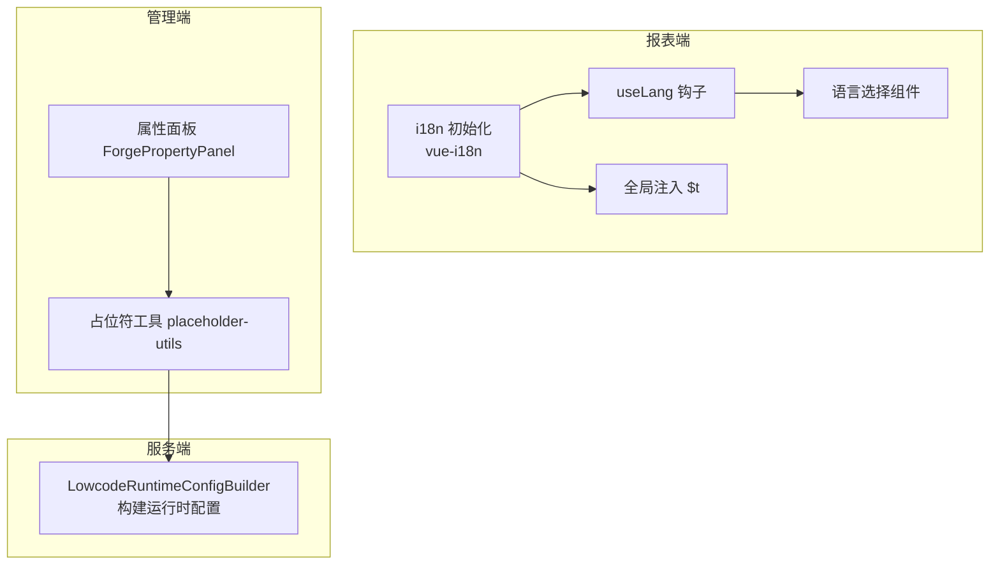
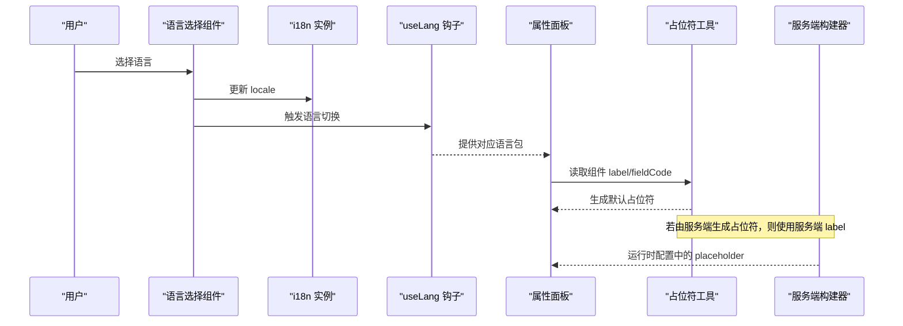
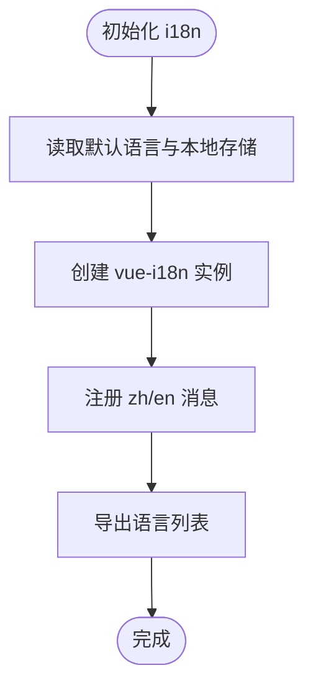
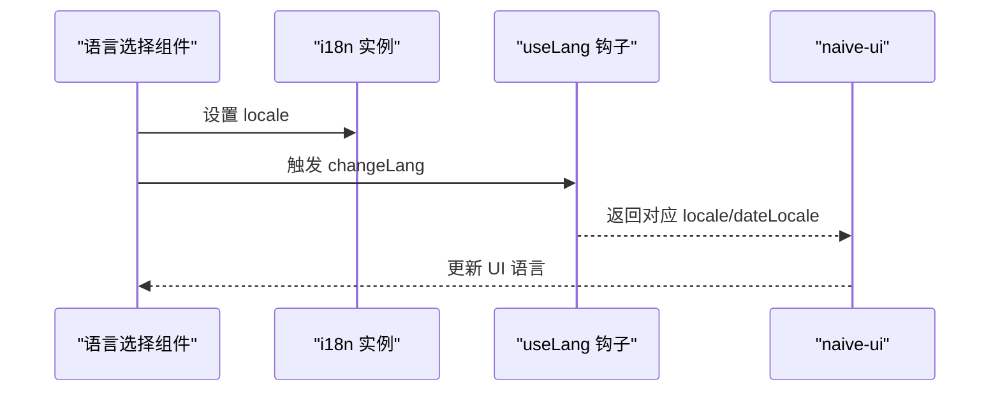
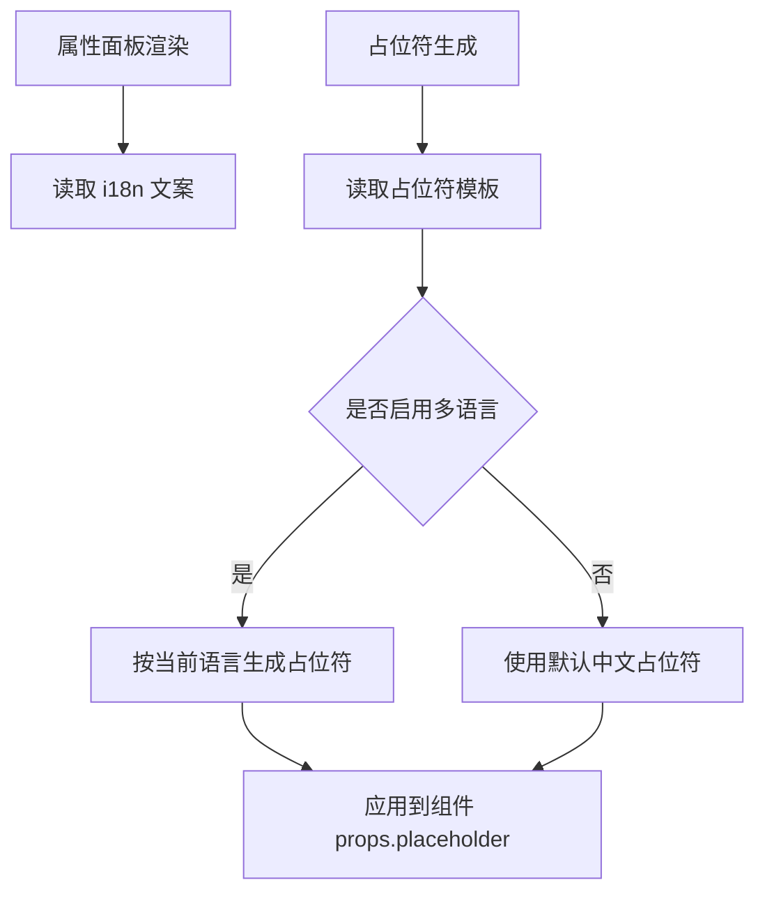
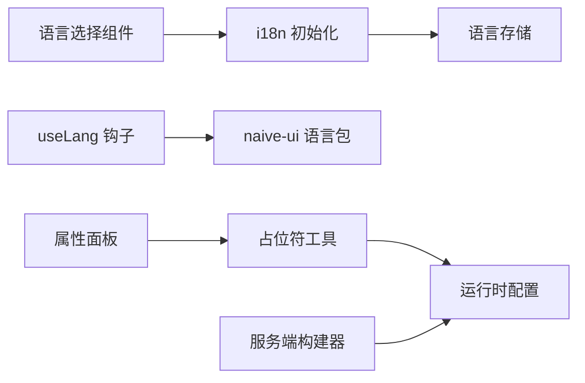

# 国际化支持

<cite>
**本文引用的文件**
- [forge-report-ui/src/i18n/index.ts](file://forge-report-ui/src/i18n/index.ts)
- [forge-report-ui/src/i18n/zh/index.ts](file://forge-report-ui/src/i18n/zh/index.ts)
- [forge-report-ui/src/i18n/en/index.ts](file://forge-report-ui/src/i18n/en/index.ts)
- [forge-report-ui/src/hooks/useLang.hook.ts](file://forge-report-ui/src/hooks/useLang.hook.ts)
- [forge-report-ui/src/components/FgLangSelect/index.vue](file://forge-report-ui/src/components/FgLangSelect/index.vue)
- [forge-report-ui/src/components/I18n/index.vue](file://forge-report-ui/src/components/I18n/index.vue)
- [forge-admin-ui/src/views/app-center/components/designer/forge-form-designer/ForgePropertyPanel.vue](file://forge-admin-ui/src/views/app-center/components/designer/forge-form-designer/ForgePropertyPanel.vue)
- [forge-admin-ui/src/views/app-center/components/designer/forge-form-designer/placeholder-utils.js](file://forge-admin-ui/src/views/app-center/components/designer/forge-form-designer/placeholder-utils.js)
- [forge-server/forge-framework/forge-plugin-parent/forge-plugin-generator/src/main/java/com/mdframe/forge/plugin/generator/service/lowcode/LowcodeRuntimeConfigBuilder.java](file://forge-server/forge-framework/forge-plugin-parent/forge-plugin-generator/src/main/java/com/mdframe/forge/plugin/generator/service/lowcode/LowcodeRuntimeConfigBuilder.java)
</cite>

## 目录
1. [简介](#简介)
2. [项目结构](#项目结构)
3. [核心组件](#核心组件)
4. [架构总览](#架构总览)
5. [详细组件分析](#详细组件分析)
6. [依赖关系分析](#依赖关系分析)
7. [性能考量](#性能考量)
8. [故障排查指南](#故障排查指南)
9. [结论](#结论)
10. [附录](#附录)

## 简介
本技术文档聚焦低代码组件属性面板的国际化（i18n）支持，覆盖多语言资源管理、动态语言切换与本地化字符串处理机制。重点说明属性标题、描述、占位符与错误消息的国际化实现方式，并给出语言包结构定义、翻译键管理与第三方库集成方案。同时提供新增语言支持指南、翻译工作流与质量检查方法，帮助团队在低代码设计器中稳定扩展多语言能力。

## 项目结构
本项目在多端均具备 i18n 能力：
- 报表端（forge-report-ui）使用 vue-i18n 进行全局国际化，并提供语言选择组件与运行时语言切换 Hook。
- 管理端（forge-admin-ui）的低代码表单设计器包含属性面板与占位符生成逻辑，当前占位符为硬编码中文，需通过 i18n 抽象以支持多语言。
- 服务端（forge-server）在构建运行时配置时，会基于字段标签生成占位符，该行为也需纳入国际化策略。

图表来源
- [forge-report-ui/src/i18n/index.ts:1-37](file://forge-report-ui/src/i18n/index.ts#L1-L37)
- [forge-report-ui/src/hooks/useLang.hook.ts:1-24](file://forge-report-ui/src/hooks/useLang.hook.ts#L1-L24)
- [forge-report-ui/src/components/FgLangSelect/index.vue:1-32](file://forge-report-ui/src/components/FgLangSelect/index.vue#L1-L32)
- [forge-report-ui/src/components/I18n/index.vue:1-8](file://forge-report-ui/src/components/I18n/index.vue#L1-L8)
- [forge-admin-ui/src/views/app-center/components/designer/forge-form-designer/placeholder-utils.js:1-133](file://forge-admin-ui/src/views/app-center/components/designer/forge-form-designer/placeholder-utils.js#L1-L133)
- [forge-server/forge-framework/forge-plugin-parent/forge-plugin-generator/src/main/java/com/mdframe/forge/plugin/generator/service/lowcode/LowcodeRuntimeConfigBuilder.java:2099-2123](file://forge-server/forge-framework/forge-plugin-parent/forge-plugin-generator/src/main/java/com/mdframe/forge/plugin/generator/service/lowcode/LowcodeRuntimeConfigBuilder.java#L2099-L2123)

章节来源
- [forge-report-ui/src/i18n/index.ts:1-37](file://forge-report-ui/src/i18n/index.ts#L1-L37)
- [forge-report-ui/src/hooks/useLang.hook.ts:1-24](file://forge-report-ui/src/hooks/useLang.hook.ts#L1-L24)
- [forge-report-ui/src/components/FgLangSelect/index.vue:1-32](file://forge-report-ui/src/components/FgLangSelect/index.vue#L1-L32)
- [forge-report-ui/src/components/I18n/index.vue:1-8](file://forge-report-ui/src/components/I18n/index.vue#L1-L8)
- [forge-admin-ui/src/views/app-center/components/designer/forge-form-designer/placeholder-utils.js:1-133](file://forge-admin-ui/src/views/app-center/components/designer/forge-form-designer/placeholder-utils.js#L1-L133)
- [forge-server/forge-framework/forge-plugin-parent/forge-plugin-generator/src/main/java/com/mdframe/forge/plugin/generator/service/lowcode/LowcodeRuntimeConfigBuilder.java:2099-2123](file://forge-server/forge-framework/forge-plugin-parent/forge-plugin-generator/src/main/java/com/mdframe/forge/plugin/generator/service/lowcode/LowcodeRuntimeConfigBuilder.java#L2099-L2123)

## 核心组件
- 报表端 i18n 初始化与语言列表
  - 使用 vue-i18n 创建实例，设置默认语言与回退语言，注册中文与英文消息。
  - 暴露语言列表供下拉选择组件使用。
- 运行时语言切换
  - useLang 钩子根据当前语言返回对应的 naive-ui 语言包与日期语言包。
- 语言选择组件
  - 通过 vue-i18n 的 locale 与 store 联动，切换语言并持久化。
- 全局 $t 注入
  - 将 i18n 的 t 函数挂载到 window，便于非 Vue 环境调用。
- 属性面板与占位符
  - 属性面板展示“表单属性”等界面文案；占位符工具根据组件类型与字段名生成默认占位提示。
- 服务端运行时配置构建
  - 在服务端构建运行时配置时，基于字段标签生成占位符，影响前端渲染。

章节来源
- [forge-report-ui/src/i18n/index.ts:1-37](file://forge-report-ui/src/i18n/index.ts#L1-L37)
- [forge-report-ui/src/hooks/useLang.hook.ts:1-24](file://forge-report-ui/src/hooks/useLang.hook.ts#L1-L24)
- [forge-report-ui/src/components/FgLangSelect/index.vue:1-32](file://forge-report-ui/src/components/FgLangSelect/index.vue#L1-L32)
- [forge-report-ui/src/components/I18n/index.vue:1-8](file://forge-report-ui/src/components/I18n/index.vue#L1-L8)
- [forge-admin-ui/src/views/app-center/components/designer/forge-form-designer/ForgePropertyPanel.vue:1-200](file://forge-admin-ui/src/views/app-center/components/designer/forge-form-designer/ForgePropertyPanel.vue#L1-L200)
- [forge-admin-ui/src/views/app-center/components/designer/forge-form-designer/placeholder-utils.js:1-133](file://forge-admin-ui/src/views/app-center/components/designer/forge-form-designer/placeholder-utils.js#L1-L133)
- [forge-server/forge-framework/forge-plugin-parent/forge-plugin-generator/src/main/java/com/mdframe/forge/plugin/generator/service/lowcode/LowcodeRuntimeConfigBuilder.java:2099-2123](file://forge-server/forge-framework/forge-plugin-parent/forge-plugin-generator/src/main/java/com/mdframe/forge/plugin/generator/service/lowcode/LowcodeRuntimeConfigBuilder.java#L2099-L2123)

## 架构总览
下图展示了从用户切换到语言，到界面文案与占位符呈现的完整链路。

图表来源
- [forge-report-ui/src/components/FgLangSelect/index.vue:1-32](file://forge-report-ui/src/components/FgLangSelect/index.vue#L1-L32)
- [forge-report-ui/src/i18n/index.ts:1-37](file://forge-report-ui/src/i18n/index.ts#L1-L37)
- [forge-report-ui/src/hooks/useLang.hook.ts:1-24](file://forge-report-ui/src/hooks/useLang.hook.ts#L1-L24)
- [forge-admin-ui/src/views/app-center/components/designer/forge-form-designer/placeholder-utils.js:1-133](file://forge-admin-ui/src/views/app-center/components/designer/forge-form-designer/placeholder-utils.js#L1-L133)
- [forge-server/forge-framework/forge-plugin-parent/forge-plugin-generator/src/main/java/com/mdframe/forge/plugin/generator/service/lowcode/LowcodeRuntimeConfigBuilder.java:2099-2123](file://forge-server/forge-framework/forge-plugin-parent/forge-plugin-generator/src/main/java/com/mdframe/forge/plugin/generator/service/lowcode/LowcodeRuntimeConfigBuilder.java#L2099-L2123)

## 详细组件分析

### 报表端 i18n 初始化与语言包结构
- 初始化
  - 创建 vue-i18n 实例，设置 legacy 模式关闭、全局注入开启。
  - 从本地存储或默认配置读取初始语言，并设置回退语言。
  - 注册中文与英文消息对象。
- 语言包结构
  - 按模块组织（如 global、login、project、ai），便于维护与按需扩展。
  - 每个语言目录下提供 index 聚合各模块翻译。

图表来源
- [forge-report-ui/src/i18n/index.ts:1-37](file://forge-report-ui/src/i18n/index.ts#L1-L37)
- [forge-report-ui/src/i18n/zh/index.ts:1-36](file://forge-report-ui/src/i18n/zh/index.ts#L1-L36)
- [forge-report-ui/src/i18n/en/index.ts:1-36](file://forge-report-ui/src/i18n/en/index.ts#L1-L36)

章节来源
- [forge-report-ui/src/i18n/index.ts:1-37](file://forge-report-ui/src/i18n/index.ts#L1-L37)
- [forge-report-ui/src/i18n/zh/index.ts:1-36](file://forge-report-ui/src/i18n/zh/index.ts#L1-L36)
- [forge-report-ui/src/i18n/en/index.ts:1-36](file://forge-report-ui/src/i18n/en/index.ts#L1-L36)

### 运行时语言切换与 UI 语言包绑定
- useLang 钩子
  - 根据当前语言返回 naive-ui 的语言包与日期语言包，确保日期控件显示正确。
- 语言选择组件
  - 通过 vue-i18n 的 locale 与 store 联动，切换语言并持久化。
- 全局 $t 注入
  - 将 t 函数挂载到 window，便于在非 Vue 环境中调用。

图表来源
- [forge-report-ui/src/components/FgLangSelect/index.vue:1-32](file://forge-report-ui/src/components/FgLangSelect/index.vue#L1-L32)
- [forge-report-ui/src/hooks/useLang.hook.ts:1-24](file://forge-report-ui/src/hooks/useLang.hook.ts#L1-L24)
- [forge-report-ui/src/components/I18n/index.vue:1-8](file://forge-report-ui/src/components/I18n/index.vue#L1-L8)

章节来源
- [forge-report-ui/src/hooks/useLang.hook.ts:1-24](file://forge-report-ui/src/hooks/useLang.hook.ts#L1-L24)
- [forge-report-ui/src/components/FgLangSelect/index.vue:1-32](file://forge-report-ui/src/components/FgLangSelect/index.vue#L1-L32)
- [forge-report-ui/src/components/I18n/index.vue:1-8](file://forge-report-ui/src/components/I18n/index.vue#L1-L8)

### 属性面板与占位符的国际化现状与建议
- 现状
  - 属性面板中存在多处硬编码中文文案（如“表单属性”、“搜索属性：字典 / 默认值 / 校验 / 弹窗”等）。
  - 占位符工具根据组件类型与字段名生成默认占位提示，前缀为中文（如“请填写”、“请输入”、“请选择”）。
  - 服务端在构建运行时配置时，也会基于字段标签生成占位符。
- 建议
  - 将属性面板文案抽离为 i18n 键，统一通过 t() 渲染。
  - 将占位符前缀与默认文本抽象为可配置的多语言资源，并在前端与服务端共享键空间。
  - 对已存在的占位符，提供“自动同步”开关，允许用户在切换语言后重新生成占位符。

图表来源
- [forge-admin-ui/src/views/app-center/components/designer/forge-form-designer/ForgePropertyPanel.vue:1-200](file://forge-admin-ui/src/views/app-center/components/designer/forge-form-designer/ForgePropertyPanel.vue#L1-L200)
- [forge-admin-ui/src/views/app-center/components/designer/forge-form-designer/placeholder-utils.js:1-133](file://forge-admin-ui/src/views/app-center/components/designer/forge-form-designer/placeholder-utils.js#L1-L133)
- [forge-server/forge-framework/forge-plugin-parent/forge-plugin-generator/src/main/java/com/mdframe/forge/plugin/generator/service/lowcode/LowcodeRuntimeConfigBuilder.java:2099-2123](file://forge-server/forge-framework/forge-plugin-parent/forge-plugin-generator/src/main/java/com/mdframe/forge/plugin/generator/service/lowcode/LowcodeRuntimeConfigBuilder.java#L2099-L2123)

章节来源
- [forge-admin-ui/src/views/app-center/components/designer/forge-form-designer/ForgePropertyPanel.vue:1-200](file://forge-admin-ui/src/views/app-center/components/designer/forge-form-designer/ForgePropertyPanel.vue#L1-L200)
- [forge-admin-ui/src/views/app-center/components/designer/forge-form-designer/placeholder-utils.js:1-133](file://forge-admin-ui/src/views/app-center/components/designer/forge-form-designer/placeholder-utils.js#L1-L133)
- [forge-server/forge-framework/forge-plugin-parent/forge-plugin-generator/src/main/java/com/mdframe/forge/plugin/generator/service/lowcode/LowcodeRuntimeConfigBuilder.java:2099-2123](file://forge-server/forge-framework/forge-plugin-parent/forge-plugin-generator/src/main/java/com/mdframe/forge/plugin/generator/service/lowcode/LowcodeRuntimeConfigBuilder.java#L2099-L2123)

### 服务端运行时配置构建中的占位符
- 行为
  - 在构建运行时配置时，会为组件设置 placeholder，并根据字段长度、精度等属性调整其他配置。
  - 当字段为系统字段或只读时，会禁用并设为只读。
- 影响
  - 若服务端生成的占位符未考虑多语言，可能导致前端显示不一致。
  - 建议将占位符生成逻辑与前端保持一致，或通过 i18n 键在服务端解析为当前语言文本。

章节来源
- [forge-server/forge-framework/forge-plugin-parent/forge-plugin-generator/src/main/java/com/mdframe/forge/plugin/generator/service/lowcode/LowcodeRuntimeConfigBuilder.java:2099-2123](file://forge-server/forge-framework/forge-plugin-parent/forge-plugin-generator/src/main/java/com/mdframe/forge/plugin/generator/service/lowcode/LowcodeRuntimeConfigBuilder.java#L2099-L2123)

## 依赖关系分析
- 报表端
  - i18n 初始化依赖本地存储与默认配置。
  - 语言选择组件依赖 i18n 实例与 store。
  - useLang 钩子依赖枚举与 naive-ui 语言包。
- 管理端
  - 属性面板依赖组件模型与占位符工具。
  - 占位符工具依赖组件类型与字段信息。
- 服务端
  - 运行时配置构建依赖字段元数据与设计器配置。

图表来源
- [forge-report-ui/src/i18n/index.ts:1-37](file://forge-report-ui/src/i18n/index.ts#L1-L37)
- [forge-report-ui/src/components/FgLangSelect/index.vue:1-32](file://forge-report-ui/src/components/FgLangSelect/index.vue#L1-L32)
- [forge-report-ui/src/hooks/useLang.hook.ts:1-24](file://forge-report-ui/src/hooks/useLang.hook.ts#L1-L24)
- [forge-admin-ui/src/views/app-center/components/designer/forge-form-designer/placeholder-utils.js:1-133](file://forge-admin-ui/src/views/app-center/components/designer/forge-form-designer/placeholder-utils.js#L1-L133)
- [forge-server/forge-framework/forge-plugin-parent/forge-plugin-generator/src/main/java/com/mdframe/forge/plugin/generator/service/lowcode/LowcodeRuntimeConfigBuilder.java:2099-2123](file://forge-server/forge-framework/forge-plugin-parent/forge-plugin-generator/src/main/java/com/mdframe/forge/plugin/generator/service/lowcode/LowcodeRuntimeConfigBuilder.java#L2099-L2123)

章节来源
- [forge-report-ui/src/i18n/index.ts:1-37](file://forge-report-ui/src/i18n/index.ts#L1-L37)
- [forge-report-ui/src/components/FgLangSelect/index.vue:1-32](file://forge-report-ui/src/components/FgLangSelect/index.vue#L1-L32)
- [forge-report-ui/src/hooks/useLang.hook.ts:1-24](file://forge-report-ui/src/hooks/useLang.hook.ts#L1-L24)
- [forge-admin-ui/src/views/app-center/components/designer/forge-form-designer/placeholder-utils.js:1-133](file://forge-admin-ui/src/views/app-center/components/designer/forge-form-designer/placeholder-utils.js#L1-L133)
- [forge-server/forge-framework/forge-plugin-parent/forge-plugin-generator/src/main/java/com/mdframe/forge/plugin/generator/service/lowcode/LowcodeRuntimeConfigBuilder.java:2099-2123](file://forge-server/forge-framework/forge-plugin-parent/forge-plugin-generator/src/main/java/com/mdframe/forge/plugin/generator/service/lowcode/LowcodeRuntimeConfigBuilder.java#L2099-L2123)

## 性能考量
- 语言包加载
  - 采用模块化拆分（global、login、project、ai），可按需引入，减少首屏体积。
- 运行时切换
  - 语言切换仅更新 locale，避免全量重建组件树。
- 占位符生成
  - 前端与服务端共享占位符模板，避免重复计算；必要时缓存结果。
- 日期与时间
  - 使用 naive-ui 提供的日期语言包，减少自定义格式化开销。

## 故障排查指南
- 语言未生效
  - 检查 i18n 实例是否正确创建与注入。
  - 确认语言选择组件是否正确更新 locale 与 store。
- 占位符显示异常
  - 检查占位符工具是否被正确调用。
  - 确认服务端构建的运行时配置是否覆盖前端占位符。
- 日期显示不正确
  - 检查 useLang 钩子是否返回正确的 dateLocale。
- 新增语言缺失
  - 确认新语言的消息对象已注册到 i18n 实例。
  - 确认语言列表已更新，且 store 支持新语言。

章节来源
- [forge-report-ui/src/i18n/index.ts:1-37](file://forge-report-ui/src/i18n/index.ts#L1-L37)
- [forge-report-ui/src/components/FgLangSelect/index.vue:1-32](file://forge-report-ui/src/components/FgLangSelect/index.vue#L1-L32)
- [forge-report-ui/src/hooks/useLang.hook.ts:1-24](file://forge-report-ui/src/hooks/useLang.hook.ts#L1-L24)
- [forge-admin-ui/src/views/app-center/components/designer/forge-form-designer/placeholder-utils.js:1-133](file://forge-admin-ui/src/views/app-center/components/designer/forge-form-designer/placeholder-utils.js#L1-L133)
- [forge-server/forge-framework/forge-plugin-parent/forge-plugin-generator/src/main/java/com/mdframe/forge/plugin/generator/service/lowcode/LowcodeRuntimeConfigBuilder.java:2099-2123](file://forge-server/forge-framework/forge-plugin-parent/forge-plugin-generator/src/main/java/com/mdframe/forge/plugin/generator/service/lowcode/LowcodeRuntimeConfigBuilder.java#L2099-L2123)

## 结论
当前项目在报表端已具备完善的 i18n 能力，包括语言包管理、运行时切换与 naive-ui 集成。管理端的低代码属性面板与占位符生成仍存在硬编码中文的情况，建议通过 i18n 抽象与前后端共享模板，实现统一的国际化体验。服务端在构建运行时配置时的占位符生成也应纳入多语言策略，确保端到端的一致性。

## 附录

### 新增语言支持指南
- 步骤
  - 在 i18n 目录下新增语言文件夹（如 ja），并创建 index 与各模块文件。
  - 在 i18n 初始化文件中注册新语言的消息对象。
  - 更新语言列表，添加新语言的显示名称与键。
  - 如需日期语言包，请在 useLang 钩子中映射对应资源。
  - 在属性面板与占位符工具中，将硬编码文案替换为 i18n 键。
  - 在服务端构建器中，若涉及占位符生成，需支持多语言解析。
- 注意事项
  - 保持键命名一致，避免遗漏。
  - 测试语言切换与日期显示。
  - 验证属性面板与占位符在新语言下的表现。

### 翻译工作流
- 键管理
  - 建立统一的键规范（模块.功能.元素）。
  - 使用工具扫描代码中的硬编码文案，生成待翻译清单。
- 协作流程
  - 开发提交变更时，附带新增键与默认值。
  - 翻译人员按清单补充多语言文案。
  - 代码审查时检查键的一致性与完整性。
- 质量检查
  - 自动化扫描未使用的键与缺失的键。
  - 构建阶段检查关键界面的文案覆盖率。
  - 人工抽检关键路径的显示效果。

### 第三方库集成
- vue-i18n
  - 用于全局国际化与运行时切换。
- naive-ui
  - 提供组件与日期的语言包，需在 useLang 中正确映射。
- 其他
  - 如有需要，可引入富文本编辑器、图表库等的语言包，并在 i18n 初始化时统一配置。