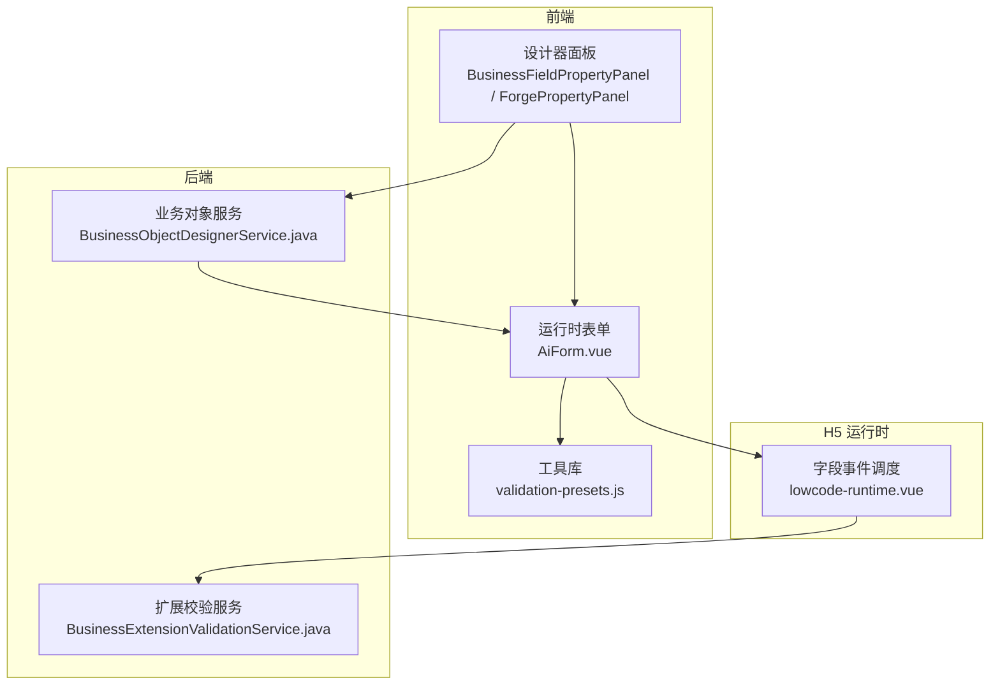
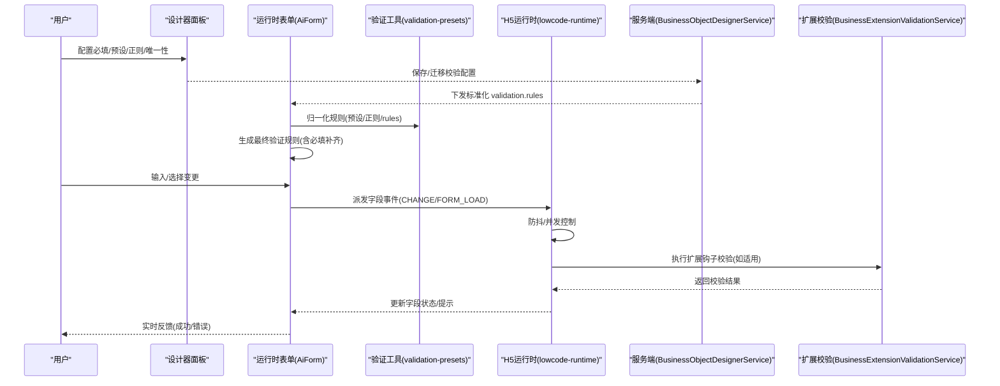
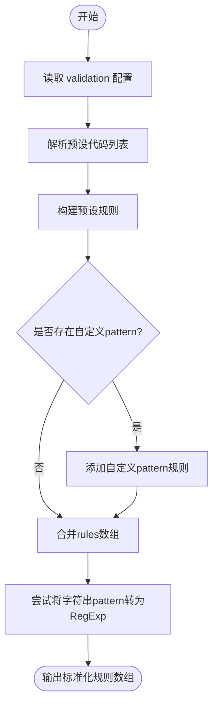
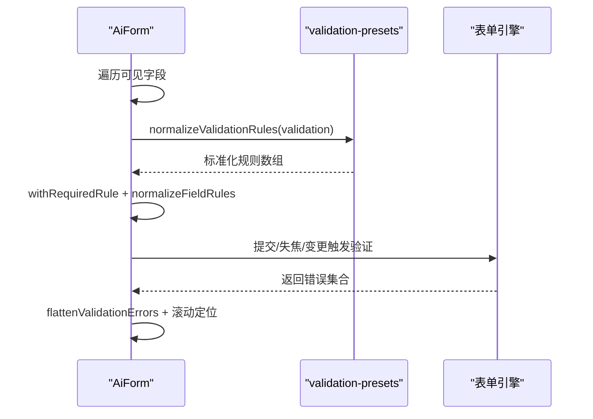
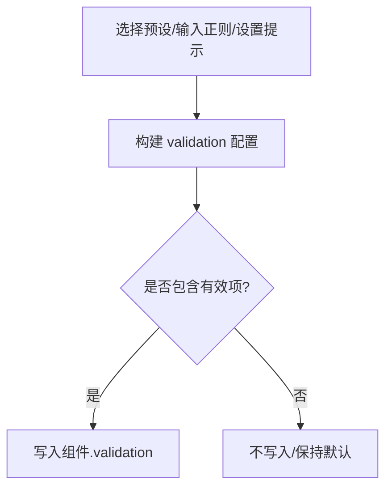
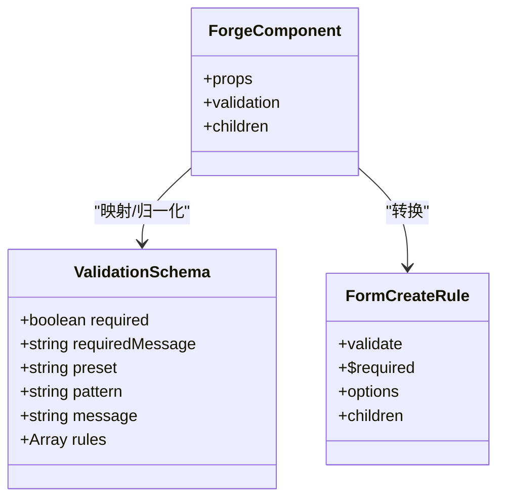
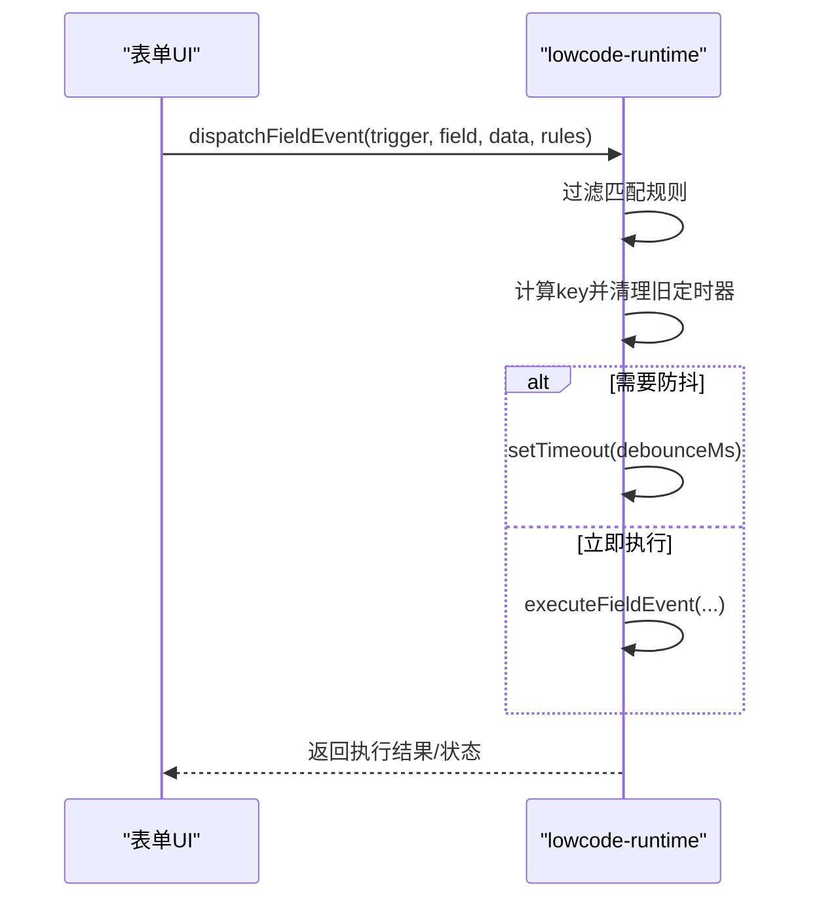
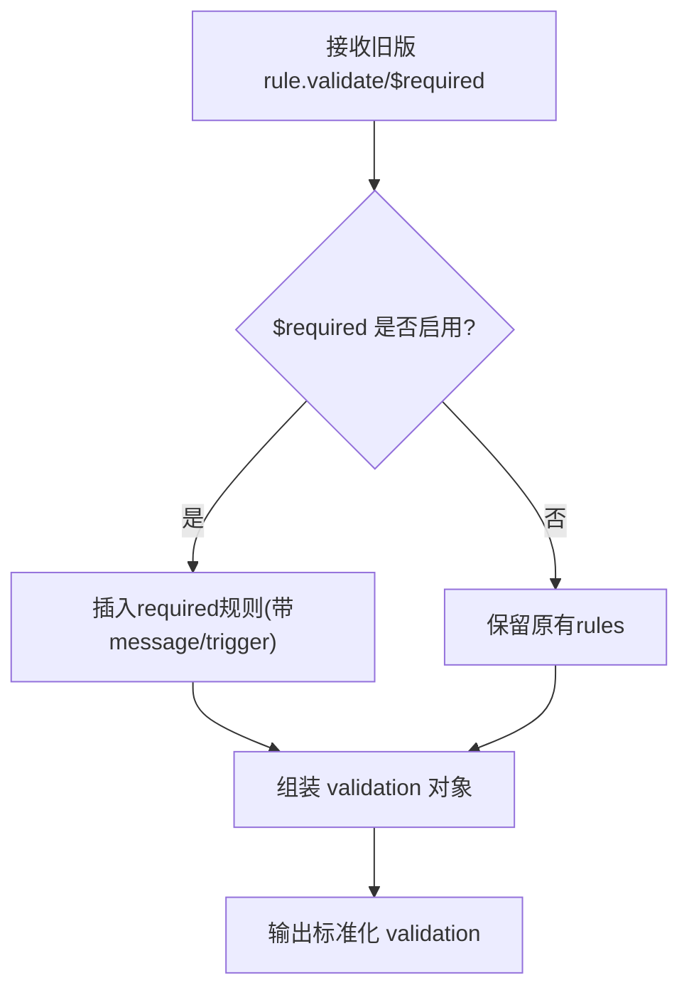
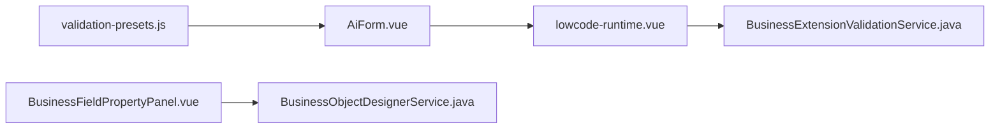

# 属性验证系统

<cite>
**本文引用的文件**
- [validation-presets.js](file://forge-admin-ui/src/utils/validation-presets.js)
- [AiForm.vue](file://forge-admin-ui/src/components/ai-form/AiForm.vue)
- [BusinessFieldPropertyPanel.vue](file://forge-admin-ui/src/views/app-center/components/designer/BusinessFieldPropertyPanel.vue)
- [ForgePropertyPanel.vue](file://forge-admin-ui/src/views/app-center/components/designer/forge-form-designer/ForgePropertyPanel.vue)
- [formDesignerSchema.js](file://forge-admin-ui/src/views/app-center/components/designer/form-first/formDesignerSchema.js)
- [forgeToFormCreate.js](file://forge-admin-ui/src/views/app-center/components/designer/form-first/forgeToFormCreate.js)
- [lowcode-runtime.vue](file://forge-h5-ui/src/pages/lowcode-runtime.vue)
- [BusinessObjectDesignerService.java](file://forge-server/forge-framework/forge-plugin-parent/forge-plugin-generator/src/main/java/com/mdframe/forge/plugin/generator/service/businessapp/BusinessObjectDesignerService.java)
- [BusinessExtensionValidationService.java](file://forge-server/forge-framework/forge-plugin-parent/forge-plugin-generator/src/main/java/com/mdframe/forge/plugin/generator/service/businessapp/BusinessExtensionValidationService.java)
</cite>

## 目录
1. [简介](#简介)
2. [项目结构](#项目结构)
3. [核心组件](#核心组件)
4. [架构总览](#架构总览)
5. [详细组件分析](#详细组件分析)
6. [依赖关系分析](#依赖关系分析)
7. [性能考虑](#性能考虑)
8. [故障排查指南](#故障排查指南)
9. [结论](#结论)
10. [附录](#附录)

## 简介
本技术文档围绕低代码表单的“属性验证系统”展开，系统性说明：
- 如何定义与配置属性验证规则（必填、格式、范围、业务规则）
- 内置验证器与自定义验证器的开发方式
- 数据类型校验、格式校验、范围校验与业务规则校验的实现机制
- 实时验证反馈、错误提示展示与验证状态管理
- 验证规则配置示例、性能优化技巧与调试方法

该体系贯穿前端设计器、运行时表单渲染、H5 运行时事件调度以及后端扩展校验，形成端到端的可配置、可扩展、可观测的属性验证能力。

## 项目结构
验证系统涉及前后端多个模块，关键位置如下：
- 前端工具层：提供常用校验预设、规则归一化、正则处理等能力
- 前端运行时：将字段配置转换为表单验证规则，并负责触发与展示
- 设计器面板：可视化配置必填、预设、正则、唯一性等校验
- H5 运行时：基于字段事件进行异步校验与防抖执行
- 服务端：迁移旧版校验到新版结构，并对扩展钩子进行合法性校验

图表来源
- [BusinessFieldPropertyPanel.vue:183-203](file://forge-admin-ui/src/views/app-center/components/designer/BusinessFieldPropertyPanel.vue#L183-L203)
- [AiForm.vue:348-477](file://forge-admin-ui/src/components/ai-form/AiForm.vue#L348-L477)
- [validation-presets.js:1-114](file://forge-admin-ui/src/utils/validation-presets.js#L1-L114)
- [lowcode-runtime.vue:709-737](file://forge-h5-ui/src/pages/lowcode-runtime.vue#L709-L737)
- [BusinessObjectDesignerService.java:1952-1968](file://forge-server/forge-framework/forge-plugin-parent/forge-plugin-generator/src/main/java/com/mdframe/forge/plugin/generator/service/businessapp/BusinessObjectDesignerService.java#L1952-L1968)
- [BusinessExtensionValidationService.java:55-77](file://forge-server/forge-framework/forge-plugin-parent/forge-plugin-generator/src/main/java/com/mdframe/forge/plugin/generator/service/businessapp/BusinessExtensionValidationService.java#L55-L77)

章节来源
- [BusinessFieldPropertyPanel.vue:183-203](file://forge-admin-ui/src/views/app-center/components/designer/BusinessFieldPropertyPanel.vue#L183-L203)
- [AiForm.vue:348-477](file://forge-admin-ui/src/components/ai-form/AiForm.vue#L348-L477)
- [validation-presets.js:1-114](file://forge-admin-ui/src/utils/validation-presets.js#L1-L114)
- [lowcode-runtime.vue:709-737](file://forge-h5-ui/src/pages/lowcode-runtime.vue#L709-L737)
- [BusinessObjectDesignerService.java:1952-1968](file://forge-server/forge-framework/forge-plugin-parent/forge-plugin-generator/src/main/java/com/mdframe/forge/plugin/generator/service/businessapp/BusinessObjectDesignerService.java#L1952-L1968)
- [BusinessExtensionValidationService.java:55-77](file://forge-server/forge-framework/forge-plugin-parent/forge-plugin-generator/src/main/java/com/mdframe/forge/plugin/generator/service/businessapp/BusinessExtensionValidationService.java#L55-L77)

## 核心组件
- 验证预设与规则归一化工具：集中维护常见格式的正则与提示，支持从多种历史字段名兼容读取，统一输出标准规则数组
- 运行时表单验证引擎：将字段配置转换为最终验证规则，自动补齐必填规则，适配数字/日期/选择类控件的空值语义
- 设计器配置面板：提供必填开关、预设选择、正则输入、唯一性开关等可视化配置入口
- H5 运行时事件调度：对 CHANGE 等事件进行防抖与并发控制，驱动异步校验与数据回填
- 服务端迁移与扩展校验：将旧版 validate/$required 迁移为新版 validation.rules；校验扩展类型与钩子的合法性

章节来源
- [validation-presets.js:1-114](file://forge-admin-ui/src/utils/validation-presets.js#L1-L114)
- [AiForm.vue:348-477](file://forge-admin-ui/src/components/ai-form/AiForm.vue#L348-L477)
- [BusinessFieldPropertyPanel.vue:1170-1211](file://forge-admin-ui/src/views/app-center/components/designer/BusinessFieldPropertyPanel.vue#L1170-L1211)
- [ForgePropertyPanel.vue:1456-1487](file://forge-admin-ui/src/views/app-center/components/designer/forge-form-designer/ForgePropertyPanel.vue#L1456-L1487)
- [lowcode-runtime.vue:709-737](file://forge-h5-ui/src/pages/lowcode-runtime.vue#L709-L737)
- [BusinessObjectDesignerService.java:1952-1968](file://forge-server/forge-framework/forge-plugin-parent/forge-plugin-generator/src/main/java/com/mdframe/forge/plugin/generator/service/businessapp/BusinessObjectDesignerService.java#L1952-L1968)
- [BusinessExtensionValidationService.java:55-77](file://forge-server/forge-framework/forge-plugin-parent/forge-plugin-generator/src/main/java/com/mdframe/forge/plugin/generator/service/businessapp/BusinessExtensionValidationService.java#L55-L77)

## 架构总览
下图展示了从设计器配置到运行时验证、再到 H5 事件调度与服务端扩展校验的整体流程。

图表来源
- [BusinessFieldPropertyPanel.vue:1170-1211](file://forge-admin-ui/src/views/app-center/components/designer/BusinessFieldPropertyPanel.vue#L1170-L1211)
- [BusinessObjectDesignerService.java:1952-1968](file://forge-server/forge-framework/forge-plugin-parent/forge-plugin-generator/src/main/java/com/mdframe/forge/plugin/generator/service/businessapp/BusinessObjectDesignerService.java#L1952-L1968)
- [AiForm.vue:348-477](file://forge-admin-ui/src/components/ai-form/AiForm.vue#L348-L477)
- [validation-presets.js:1-114](file://forge-admin-ui/src/utils/validation-presets.js#L1-L114)
- [lowcode-runtime.vue:709-737](file://forge-h5-ui/src/pages/lowcode-runtime.vue#L709-L737)
- [BusinessExtensionValidationService.java:55-77](file://forge-server/forge-framework/forge-plugin-parent/forge-plugin-generator/src/main/java/com/mdframe/forge/plugin/generator/service/businessapp/BusinessExtensionValidationService.java#L55-L77)

## 详细组件分析

### 验证预设与规则归一化工具
- 功能要点
  - 内置常见格式（手机号、邮箱、身份证、银行卡、固话、统一社会信用代码、整数、非负数、网址）及对应提示
  - 支持多源字段名兼容（preset/presetCode/commonRule/presets/presetCodes），统一解析为规则数组
  - 支持自定义 pattern 与 message，自动将字符串正则转为 RegExp 实例，异常时降级忽略
  - 支持 rules 透传，便于扩展复杂规则

- 复杂度与性能
  - 规则归一化为 O(n)，n 为规则数量；正则编译失败时回退，避免阻塞
  - 建议缓存已编译的正则或规则对象，减少重复计算

图表来源
- [validation-presets.js:1-114](file://forge-admin-ui/src/utils/validation-presets.js#L1-L114)

章节来源
- [validation-presets.js:1-114](file://forge-admin-ui/src/utils/validation-presets.js#L1-L114)

### 运行时表单验证引擎（AiForm）
- 功能要点
  - 根据可见字段生成最终验证规则：收集 field.rules 与 validation 归一化后的规则
  - 自动补齐必填规则：对数字/日期/选择类控件使用自定义 validator，避免 0、空数组等误判为空
  - 支持 trigger 差异化：数值/日期/选择默认 change，其他默认 blur+change
  - 错误定位与滚动：扁平化错误树，定位首个错误字段并平滑滚动至可视区域

- 实现细节
  - withRequiredRule：若已有 required 或 __required 标记则不再重复添加
  - normalizeFieldRules：针对特殊类型注入空值校验逻辑，确保语义正确
  - flattenValidationErrors：递归展开 errors/inner/children，便于上层统一处理

图表来源
- [AiForm.vue:348-477](file://forge-admin-ui/src/components/ai-form/AiForm.vue#L348-L477)
- [AiForm.vue:864-906](file://forge-admin-ui/src/components/ai-form/AiForm.vue#L864-L906)
- [validation-presets.js:1-114](file://forge-admin-ui/src/utils/validation-presets.js#L1-L114)

章节来源
- [AiForm.vue:348-477](file://forge-admin-ui/src/components/ai-form/AiForm.vue#L348-L477)
- [AiForm.vue:864-906](file://forge-admin-ui/src/components/ai-form/AiForm.vue#L864-L906)

### 设计器配置面板
- BusinessFieldPropertyPanel
  - 提供“校验提示”“正则表达式”输入框
  - 预设选择后自动填充 pattern 与 message，并可联动敏感类型（手机/邮箱/身份证/银行卡）
  - 构建 validation 配置对象，仅当存在有效项时写入

- ForgePropertyPanel
  - 提供“校验提示”“正则表达式 Pattern”“唯一校验”开关等配置项
  - 通过 updateComponent 同步更新 selectedComponent.validation

图表来源
- [BusinessFieldPropertyPanel.vue:1170-1211](file://forge-admin-ui/src/views/app-center/components/designer/BusinessFieldPropertyPanel.vue#L1170-L1211)
- [ForgePropertyPanel.vue:1456-1487](file://forge-admin-ui/src/views/app-center/components/designer/forge-form-designer/ForgePropertyPanel.vue#L1456-L1487)

章节来源
- [BusinessFieldPropertyPanel.vue:1170-1211](file://forge-admin-ui/src/views/app-center/components/designer/BusinessFieldPropertyPanel.vue#L1170-L1211)
- [ForgePropertyPanel.vue:1456-1487](file://forge-admin-ui/src/views/app-center/components/designer/forge-form-designer/ForgePropertyPanel.vue#L1456-L1487)

### 表单 Schema 规范化与迁移
- formDesignerSchema
  - normalizeValidation：将 legacy 字段映射为标准结构（required、requiredMessage、preset、pattern、message、rules）
  - 用于统一设计器内校验配置的存储与展示

- forgeToFormCreate
  - 将 Forge 组件配置转换为 FormCreate 规则，包含 validate、$required、options、children 等
  - 保证不同渲染器间验证行为一致

图表来源
- [formDesignerSchema.js:1257-1267](file://forge-admin-ui/src/views/app-center/components/designer/form-first/formDesignerSchema.js#L1257-L1267)
- [forgeToFormCreate.js:40-65](file://forge-admin-ui/src/views/app-center/components/designer/form-first/forgeToFormCreate.js#L40-L65)

章节来源
- [formDesignerSchema.js:1257-1267](file://forge-admin-ui/src/views/app-center/components/designer/form-first/formDesignerSchema.js#L1257-L1267)
- [forgeToFormCreate.js:40-65](file://forge-admin-ui/src/views/app-center/components/designer/form-first/forgeToFormCreate.js#L40-L65)

### H5 运行时事件调度与防抖
- 功能要点
  - 按 trigger 过滤规则，支持 FORM_LOAD 与字段级触发
  - CHANGE 事件支持防抖（debounceMs），同一 key 的多次触发只保留最后一次
  - 并发安全：每个 scope:rule:field 独立计时器，避免竞态

图表来源
- [lowcode-runtime.vue:709-737](file://forge-h5-ui/src/pages/lowcode-runtime.vue#L709-L737)

章节来源
- [lowcode-runtime.vue:709-737](file://forge-h5-ui/src/pages/lowcode-runtime.vue#L709-L737)

### 服务端迁移与扩展校验
- 旧版迁移
  - 将 validate/$required 迁移为 validation.required、validation.requiredMessage、validation.rules
  - 若 $required 开启但无 required 规则，自动插入一条 required 规则并设置触发时机

- 扩展校验
  - 校验扩展类型与钩子是否允许
  - 针对不同扩展类型（VISUAL_RULE、CLIENT_JS、SCOPED_CSS、SERVER_BINDING）执行相应校验逻辑

图表来源
- [BusinessObjectDesignerService.java:2052-2078](file://forge-server/forge-framework/forge-plugin-parent/forge-plugin-generator/src/main/java/com/mdframe/forge/plugin/generator/service/businessapp/BusinessObjectDesignerService.java#L2052-L2078)

章节来源
- [BusinessObjectDesignerService.java:2052-2078](file://forge-server/forge-framework/forge-plugin-parent/forge-plugin-generator/src/main/java/com/mdframe/forge/plugin/generator/service/businessapp/BusinessObjectDesignerService.java#L2052-L2078)
- [BusinessExtensionValidationService.java:55-77](file://forge-server/forge-framework/forge-plugin-parent/forge-plugin-generator/src/main/java/com/mdframe/forge/plugin/generator/service/businessapp/BusinessExtensionValidationService.java#L55-L77)

## 依赖关系分析
- 组件耦合
  - AiForm 依赖 validation-presets 完成规则归一化，依赖低层表单引擎进行实际校验
  - 设计器面板依赖 BusinessObjectDesignerService 的迁移逻辑以兼容历史配置
  - H5 运行时作为事件总线，串联前端交互与服务端扩展校验

- 外部依赖
  - 正则表达式引擎（RegExp）
  - 表单框架（如 FormCreate/Element 等，具体由渲染层决定）
  - 后端扩展注册表（LowcodeExtensionRegistry）

图表来源
- [validation-presets.js:1-114](file://forge-admin-ui/src/utils/validation-presets.js#L1-L114)
- [AiForm.vue:348-477](file://forge-admin-ui/src/components/ai-form/AiForm.vue#L348-L477)
- [lowcode-runtime.vue:709-737](file://forge-h5-ui/src/pages/lowcode-runtime.vue#L709-L737)
- [BusinessFieldPropertyPanel.vue:1170-1211](file://forge-admin-ui/src/views/app-center/components/designer/BusinessFieldPropertyPanel.vue#L1170-L1211)
- [BusinessObjectDesignerService.java:1952-1968](file://forge-server/forge-framework/forge-plugin-parent/forge-plugin-generator/src/main/java/com/mdframe/forge/plugin/generator/service/businessapp/BusinessObjectDesignerService.java#L1952-L1968)
- [BusinessExtensionValidationService.java:55-77](file://forge-server/forge-framework/forge-plugin-parent/forge-plugin-generator/src/main/java/com/mdframe/forge/plugin/generator/service/businessapp/BusinessExtensionValidationService.java#L55-L77)

章节来源
- [validation-presets.js:1-114](file://forge-admin-ui/src/utils/validation-presets.js#L1-L114)
- [AiForm.vue:348-477](file://forge-admin-ui/src/components/ai-form/AiForm.vue#L348-L477)
- [lowcode-runtime.vue:709-737](file://forge-h5-ui/src/pages/lowcode-runtime.vue#L709-L737)
- [BusinessFieldPropertyPanel.vue:1170-1211](file://forge-admin-ui/src/views/app-center/components/designer/BusinessFieldPropertyPanel.vue#L1170-L1211)
- [BusinessObjectDesignerService.java:1952-1968](file://forge-server/forge-framework/forge-plugin-parent/forge-plugin-generator/src/main/java/com/mdframe/forge/plugin/generator/service/businessapp/BusinessObjectDesignerService.java#L1952-L1968)
- [BusinessExtensionValidationService.java:55-77](file://forge-server/forge-framework/forge-plugin-parent/forge-plugin-generator/src/main/java/com/mdframe/forge/plugin/generator/service/businessapp/BusinessExtensionValidationService.java#L55-L77)

## 性能考虑
- 规则归一化
  - 将规则归一化结果缓存，避免重复解析预设与正则
  - 对频繁触发的字段（如 CHANGE）采用防抖策略，降低网络与计算压力

- 正则编译
  - 在编译失败时及时降级，避免阻断主流程
  - 对静态预设的正则可在应用启动时预编译

- 事件调度
  - 基于 key 的定时器管理，防止内存泄漏
  - 对并发请求去重，确保最新值优先

- 渲染与反馈
  - 仅在必要时重新计算 formRules（依赖 computed）
  - 错误定位与滚动应避免在高频事件中执行昂贵操作

[本节为通用性能建议，无需特定文件引用]

## 故障排查指南
- 常见问题
  - 必填误判：数字/日期/选择类控件需使用自定义 validator，避免 0、空数组被判定为空
  - 正则无效：检查预设或自定义 pattern 语法是否正确，注意转义字符
  - 事件未触发：确认 trigger 与字段类型匹配，CHANGE 是否设置了 debounceMs
  - 扩展校验失败：检查扩展类型与钩子是否受支持，查看服务端返回的 issues

- 调试步骤
  - 在设计器中查看生成的 validation 配置，确认 rules 与 message 是否符合预期
  - 在运行时打印 formRules，核对最终规则是否包含 required、pattern、validator
  - 在 H5 运行时观察事件调度日志，确认防抖与并发控制是否生效
  - 在服务端查看扩展校验结果与 summary，定位问题根因

章节来源
- [AiForm.vue:348-477](file://forge-admin-ui/src/components/ai-form/AiForm.vue#L348-L477)
- [AiForm.vue:864-906](file://forge-admin-ui/src/components/ai-form/AiForm.vue#L864-L906)
- [lowcode-runtime.vue:709-737](file://forge-h5-ui/src/pages/lowcode-runtime.vue#L709-L737)
- [BusinessExtensionValidationService.java:55-77](file://forge-server/forge-framework/forge-plugin-parent/forge-plugin-generator/src/main/java/com/mdframe/forge/plugin/generator/service/businessapp/BusinessExtensionValidationService.java#L55-L77)

## 结论
本属性验证系统通过“预设+规则归一化+运行时补齐+事件调度+服务端扩展”的分层设计，实现了：
- 高可配置：设计器可视化配置，覆盖必填、格式、范围与业务规则
- 高可用：健壮的错误处理与降级策略，适配多种控件语义
- 高性能：防抖、缓存与并发控制，保障大规模表单体验
- 可扩展：支持自定义验证器与后端扩展钩子，满足复杂业务场景

建议在生产环境中结合监控与日志，持续优化规则命中与执行路径，确保用户体验与稳定性。

## 附录
- 配置示例（路径参考）
  - 预设与规则归一化：[validation-presets.js:1-114](file://forge-admin-ui/src/utils/validation-presets.js#L1-L114)
  - 运行时规则生成与必填补齐：[AiForm.vue:348-477](file://forge-admin-ui/src/components/ai-form/AiForm.vue#L348-L477)
  - 设计器配置入口：[BusinessFieldPropertyPanel.vue:1170-1211](file://forge-admin-ui/src/views/app-center/components/designer/BusinessFieldPropertyPanel.vue#L1170-L1211)、[ForgePropertyPanel.vue:1456-1487](file://forge-admin-ui/src/views/app-center/components/designer/forge-form-designer/ForgePropertyPanel.vue#L1456-L1487)
  - H5 事件调度与防抖：[lowcode-runtime.vue:709-737](file://forge-h5-ui/src/pages/lowcode-runtime.vue#L709-L737)
  - 服务端迁移与扩展校验：[BusinessObjectDesignerService.java:2052-2078](file://forge-server/forge-framework/forge-plugin-parent/forge-plugin-generator/src/main/java/com/mdframe/forge/plugin/generator/service/businessapp/BusinessObjectDesignerService.java#L2052-L2078)、[BusinessExtensionValidationService.java:55-77](file://forge-server/forge-framework/forge-plugin-parent/forge-plugin-generator/src/main/java/com/mdframe/forge/plugin/generator/service/businessapp/BusinessExtensionValidationService.java#L55-L77)