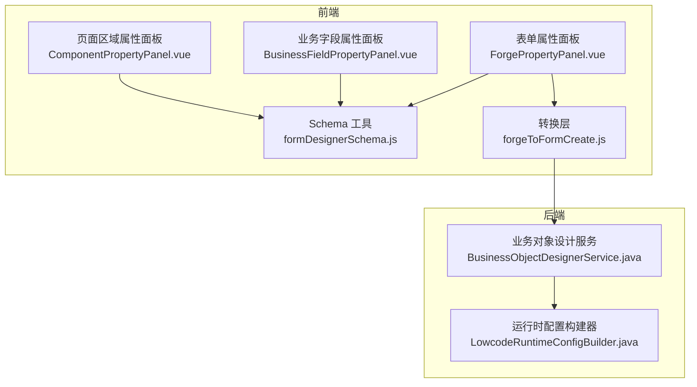
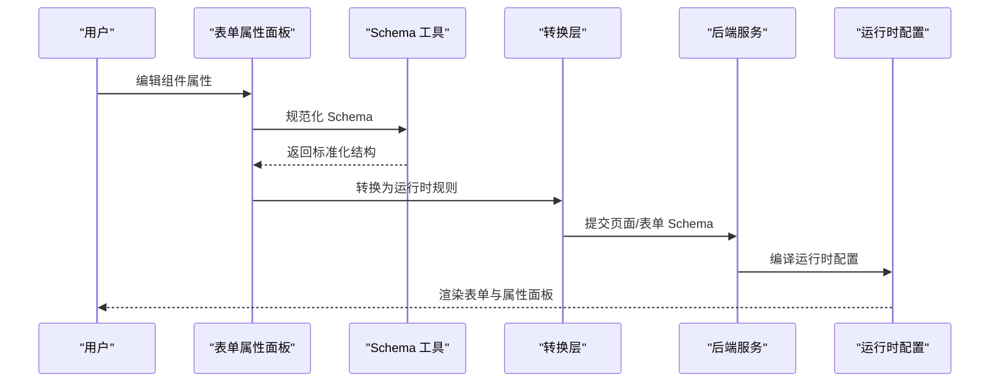
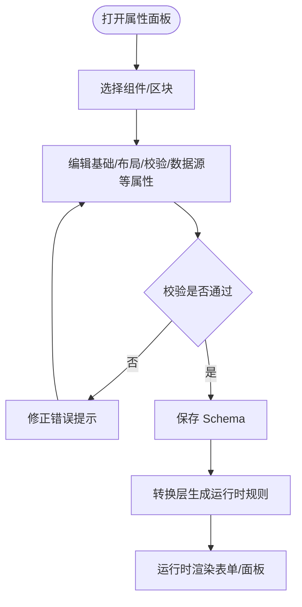
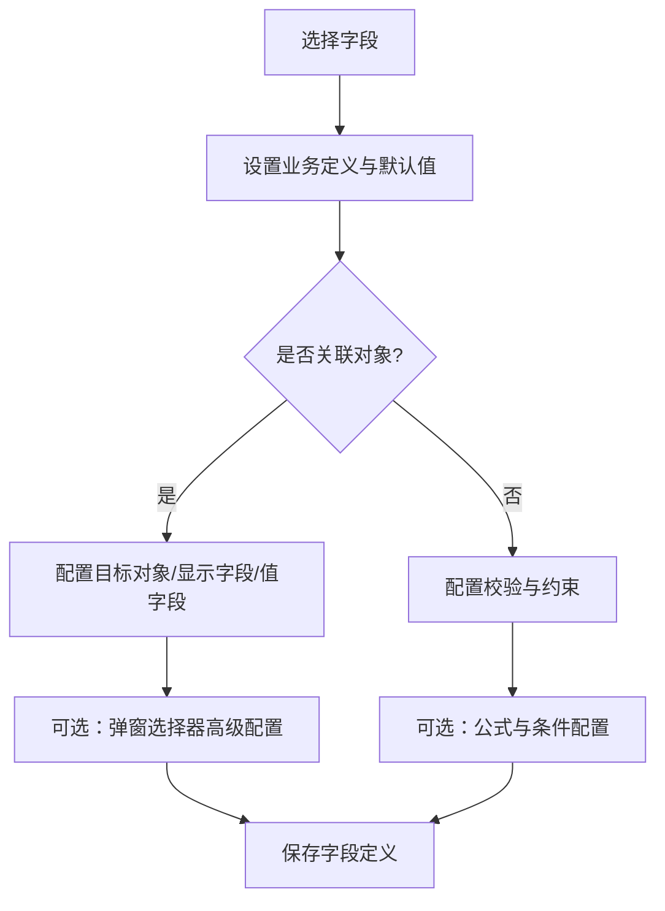
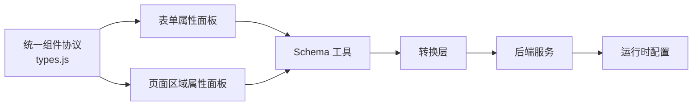

# 组件属性面板

<cite>
**本文引用的文件**
- [ForgePropertyPanel.vue](file://forge-admin-ui/src/views/app-center/components/designer/forge-form-designer/ForgePropertyPanel.vue)
- [BusinessFieldPropertyPanel.vue](file://forge-admin-ui/src/views/app-center/components/designer/BusinessFieldPropertyPanel.vue)
- [ComponentPropertyPanel.vue](file://forge-admin-ui/src/components/lowcode-builder/page/ComponentPropertyPanel.vue)
- [formDesignerSchema.js](file://forge-admin-ui/src/views/app-center/components/designer/form-first/formDesignerSchema.js)
- [forgeToFormCreate.js](file://forge-admin-ui/src/views/app-center/components/designer/form-first/forgeToFormCreate.js)
- [types.js](file://forge-admin-ui/src/components/lowcode-builder/designer-core/spec/types.js)
- [BusinessObjectDesignerService.java](file://forge-server/forge-framework/forge-plugin-parent/forge-plugin-generator/src/main/java/com/mdframe/forge/plugin/generator/service/businessapp/BusinessObjectDesignerService.java)
- [LowcodeRuntimeConfigBuilder.java](file://forge-server/forge-framework/forge-plugin-parent/forge-plugin-generator/src/main/java/com/mdframe/forge/plugin/generator/service/lowcode/LowcodeRuntimeConfigBuilder.java)
</cite>

## 目录
1. [简介](#简介)
2. [项目结构](#项目结构)
3. [核心组件](#核心组件)
4. [架构总览](#架构总览)
5. [详细组件分析](#详细组件分析)
6. [依赖关系分析](#依赖关系分析)
7. [性能考虑](#性能考虑)
8. [故障排查指南](#故障排查指南)
9. [结论](#结论)
10. [附录](#附录)

## 简介
本技术文档围绕低代码平台的“组件属性面板”展开，系统性说明其架构设计、表单生成器、验证规则与动态配置机制。重点覆盖：
- 属性类型系统与默认值处理
- 国际化支持与响应式更新
- 自定义属性编辑器开发
- 属性联动逻辑与批量编辑能力
- 属性面板 API、配置规范与扩展开发指南

该体系由前端属性面板（Vue 组件）与后端运行时配置构建器协同完成，形成从设计态到运行时的完整闭环。

## 项目结构
属性面板相关的前端实现主要位于 forge-admin-ui 的 designer 模块中，包含三类关键面板：
- 表单设计器属性面板：面向表单组件与页面控件的属性编辑
- 业务字段属性面板：面向业务模型字段的定义、约束与关联配置
- 页面区域属性面板：面向页面区块（如表格区、查询区等）的布局与能力开关

后端通过服务类将设计器 Schema 编译为运行时配置，确保表单渲染、校验、布局与交互在运行时一致生效。

图表来源
- [ForgePropertyPanel.vue:1-800](file://forge-admin-ui/src/views/app-center/components/designer/forge-form-designer/ForgePropertyPanel.vue#L1-L800)
- [BusinessFieldPropertyPanel.vue:1-800](file://forge-admin-ui/src/views/app-center/components/designer/BusinessFieldPropertyPanel.vue#L1-L800)
- [ComponentPropertyPanel.vue:1-563](file://forge-admin-ui/src/components/lowcode-builder/page/ComponentPropertyPanel.vue#L1-L563)
- [formDesignerSchema.js:1-200](file://forge-admin-ui/src/views/app-center/components/designer/form-first/formDesignerSchema.js#L1-L200)
- [forgeToFormCreate.js:43-69](file://forge-admin-ui/src/views/app-center/components/designer/form-first/forgeToFormCreate.js#L43-L69)
- [BusinessObjectDesignerService.java:2180-2246](file://forge-server/forge-framework/forge-plugin-parent/forge-plugin-generator/src/main/java/com/mdframe/forge/plugin/generator/service/businessapp/BusinessObjectDesignerService.java#L2180-L2246)
- [LowcodeRuntimeConfigBuilder.java:180-205](file://forge-server/forge-framework/forge-plugin-parent/forge-plugin-generator/src/main/java/com/mdframe/forge/plugin/generator/service/lowcode/LowcodeRuntimeConfigBuilder.java#L180-L205)

章节来源
- [ForgePropertyPanel.vue:1-800](file://forge-admin-ui/src/views/app-center/components/designer/forge-form-designer/ForgePropertyPanel.vue#L1-L800)
- [BusinessFieldPropertyPanel.vue:1-800](file://forge-admin-ui/src/views/app-center/components/designer/BusinessFieldPropertyPanel.vue#L1-L800)
- [ComponentPropertyPanel.vue:1-563](file://forge-admin-ui/src/components/lowcode-builder/page/ComponentPropertyPanel.vue#L1-L563)
- [formDesignerSchema.js:1-200](file://forge-admin-ui/src/views/app-center/components/designer/form-first/formDesignerSchema.js#L1-L200)
- [forgeToFormCreate.js:43-69](file://forge-admin-ui/src/views/app-center/components/designer/form-first/forgeToFormCreate.js#L43-L69)
- [BusinessObjectDesignerService.java:2180-2246](file://forge-server/forge-framework/forge-plugin-parent/forge-plugin-generator/src/main/java/com/mdframe/forge/plugin/generator/service/businessapp/BusinessObjectDesignerService.java#L2180-L2246)
- [LowcodeRuntimeConfigBuilder.java:180-205](file://forge-server/forge-framework/forge-plugin-parent/forge-plugin-generator/src/main/java/com/mdframe/forge/plugin/generator/service/lowcode/LowcodeRuntimeConfigBuilder.java#L180-L205)

## 核心组件
- 表单属性面板（ForgePropertyPanel.vue）
  - 提供组件标识、绑定字段、占位提示、默认值、最大长度、常用校验、自动编号、栅格快捷配置、数据源映射、富文本/二维码/水印等丰富属性的可视化编辑
  - 支持搜索定位属性项、折叠分组、Tab 切换、实时预览与联动控制
- 业务字段属性面板（BusinessFieldPropertyPanel.vue）
  - 维护字段业务定义、数据库映射、全局约束、字典与关联对象、唯一性、导入导出策略、脱敏与加密等
  - 内置公式配置、条件表达式、计算预览与调试工具
- 页面区域属性面板（ComponentPropertyPanel.vue）
  - 管理页面区块启用状态、组件名称与类型、字段绑定、布局坐标与尺寸、样式参数、列表能力与树形导航配置

章节来源
- [ForgePropertyPanel.vue:1-800](file://forge-admin-ui/src/views/app-center/components/designer/forge-form-designer/ForgePropertyPanel.vue#L1-L800)
- [BusinessFieldPropertyPanel.vue:1-800](file://forge-admin-ui/src/views/app-center/components/designer/BusinessFieldPropertyPanel.vue#L1-L800)
- [ComponentPropertyPanel.vue:1-563](file://forge-admin-ui/src/components/lowcode-builder/page/ComponentPropertyPanel.vue#L1-L563)

## 架构总览
属性面板采用“设计态 Schema + 运行时配置”的双层架构：
- 设计态：前端面板编辑组件与页面的属性，产出标准化 Schema（含组件类型、布局、校验、数据源、公式等）
- 转换层：将设计器 Schema 转换为运行时可用的表单规则与选项（如 form-create 规则）
- 后端：将页面与表单 Schema 编译为运行时配置，注入表单布局、标签宽度、行列间距、校验反馈等
- 运行态：基于统一组件协议（ComponentSpec/PropsSchema）渲染属性面板与表单控件

图表来源
- [ForgePropertyPanel.vue:1-800](file://forge-admin-ui/src/views/app-center/components/designer/forge-form-designer/ForgePropertyPanel.vue#L1-L800)
- [formDesignerSchema.js:667-690](file://forge-admin-ui/src/views/app-center/components/designer/form-first/formDesignerSchema.js#L667-L690)
- [forgeToFormCreate.js:43-69](file://forge-admin-ui/src/views/app-center/components/designer/form-first/forgeToFormCreate.js#L43-L69)
- [BusinessObjectDesignerService.java:2180-2246](file://forge-server/forge-framework/forge-plugin-parent/forge-plugin-generator/src/main/java/com/mdframe/forge/plugin/generator/service/businessapp/BusinessObjectDesignerService.java#L2180-L2246)
- [LowcodeRuntimeConfigBuilder.java:180-205](file://forge-server/forge-framework/forge-plugin-parent/forge-plugin-generator/src/main/java/com/mdframe/forge/plugin/generator/service/lowcode/LowcodeRuntimeConfigBuilder.java#L180-L205)

## 详细组件分析

### 表单属性面板（ForgePropertyPanel.vue）
- 功能要点
  - 基础属性：显示名称、组件类型切换、字段绑定、区块说明、页面组件标题
  - 数据源：静态/上下文/远程接口，支持请求方法、响应路径、字段映射
  - 校验与默认值：常用校验预设、正则、必填提示、默认值选择或输入
  - 栅格布局：行/列快速配置、span 调整、间距设置
  - 高级特性：自动编号、只读隐藏、公式配置、富文本/二维码/水印/菜单/分页等
- 响应式更新
  - 使用 v-model 双向绑定与事件回调实时更新 selectedComponent 及其 props/layout/validation
  - 搜索框可快速定位属性项并高亮反馈
- 国际化与默认值
  - 占位提示、校验消息、组件标题等文案可通过属性配置；默认值按字段类型智能推断

图表来源
- [ForgePropertyPanel.vue:1-800](file://forge-admin-ui/src/views/app-center/components/designer/forge-form-designer/ForgePropertyPanel.vue#L1-L800)
- [formDesignerSchema.js:667-690](file://forge-admin-ui/src/views/app-center/components/designer/form-first/formDesignerSchema.js#L667-L690)
- [forgeToFormCreate.js:43-69](file://forge-admin-ui/src/views/app-center/components/designer/form-first/forgeToFormCreate.js#L43-L69)

章节来源
- [ForgePropertyPanel.vue:1-800](file://forge-admin-ui/src/views/app-center/components/designer/forge-form-designer/ForgePropertyPanel.vue#L1-L800)
- [formDesignerSchema.js:667-690](file://forge-admin-ui/src/views/app-center/components/designer/form-first/formDesignerSchema.js#L667-L690)
- [forgeToFormCreate.js:43-69](file://forge-admin-ui/src/views/app-center/components/designer/form-first/forgeToFormCreate.js#L43-L69)

### 业务字段属性面板（BusinessFieldPropertyPanel.vue）
- 功能要点
  - 业务定义：字段名称、类型、默认值、输入提示、字典与关联对象
  - 数据约束：最大长度、常用校验、正则、校验提示、唯一性、导入导出策略
  - 安全与开发：脱敏类型、加密算法、数据库列名、数据类型、精度、查询方式
  - 公式与条件：表达式编辑、触发模式、条件规则编译与校验、计算预览与调试
- 联动逻辑
  - 选择常用校验后自动填充正则与提示
  - 关联对象选择后自动推断显示字段与值字段
  - 必填开关影响默认值策略与提示

图表来源
- [BusinessFieldPropertyPanel.vue:1-800](file://forge-admin-ui/src/views/app-center/components/designer/BusinessFieldPropertyPanel.vue#L1-L800)
- [BusinessFieldPropertyPanel.vue:2086-2100](file://forge-admin-ui/src/views/app-center/components/designer/BusinessFieldPropertyPanel.vue#L2086-L2100)

章节来源
- [BusinessFieldPropertyPanel.vue:1-800](file://forge-admin-ui/src/views/app-center/components/designer/BusinessFieldPropertyPanel.vue#L1-L800)
- [BusinessFieldPropertyPanel.vue:2086-2100](file://forge-admin-ui/src/views/app-center/components/designer/BusinessFieldPropertyPanel.vue#L2086-L2100)

### 页面区域属性面板（ComponentPropertyPanel.vue）
- 功能要点
  - 区域启用、组件名称与类型、字段绑定（单/多字段）、拖拽排序
  - 布局坐标与尺寸、样式参数（圆角、填充色、边框色、对齐）
  - 列表能力开关（批量导入/导出、隐藏批量删除、自定义查询）
  - 树形导航配置（标题、父级字段、显示字段、加载模式）
- 响应式更新
  - 通过 emit 向上层传递 zone/item 变更，保持画布与属性面板同步

章节来源
- [ComponentPropertyPanel.vue:1-563](file://forge-admin-ui/src/components/lowcode-builder/page/ComponentPropertyPanel.vue#L1-L563)

### Schema 与转换层
- formDesignerSchema.js
  - 定义表单设计器 Schema 版本、组件分类（布局/虚拟/全行等）、ID 唯一性与字段绑定校验
  - 提供网格列数归一化、校验规则归一化、可见性与对齐方式归一化等工具函数
- forgeToFormCreate.js
  - 将 Forge 组件 Schema 转换为 form-create 规则，包括默认值、校验、选项、子节点等
  - 提取字段引用集合，便于运行时校验与渲染

章节来源
- [formDesignerSchema.js:1-200](file://forge-admin-ui/src/views/app-center/components/designer/form-first/formDesignerSchema.js#L1-L200)
- [formDesignerSchema.js:667-690](file://forge-admin-ui/src/views/app-center/components/designer/form-first/formDesignerSchema.js#L667-L690)
- [formDesignerSchema.js:1245-1291](file://forge-admin-ui/src/views/app-center/components/designer/form-first/formDesignerSchema.js#L1245-L1291)
- [forgeToFormCreate.js:43-69](file://forge-admin-ui/src/views/app-center/components/designer/form-first/forgeToFormCreate.js#L43-L69)

### 后端运行时配置构建
- BusinessObjectDesignerService.java
  - 迁移旧版校验规则至新版结构，合并必填开关与规则数组，生成 requiredMessage
  - 将表单设计器 Schema 编译为运行时布局与选项，包括标签位置、宽度、尺寸、反馈显示等
  - 生成默认表单组件，绑定字段编码、来源与锁定状态
- LowcodeRuntimeConfigBuilder.java
  - 构建 CRUD 区块运行时配置，包括搜索与编辑网格列数、标签放置与对齐、尺寸、反馈、表单布局与 Schema 引用

章节来源
- [BusinessObjectDesignerService.java:2180-2246](file://forge-server/forge-framework/forge-plugin-parent/forge-plugin-generator/src/main/java/com/mdframe/forge/plugin/generator/service/businessapp/BusinessObjectDesignerService.java#L2180-L2246)
- [BusinessObjectDesignerService.java:2231-2246](file://forge-server/forge-framework/forge-plugin-parent/forge-plugin-generator/src/main/java/com/mdframe/forge/plugin/generator/service/businessapp/BusinessObjectDesignerService.java#L2231-L2246)
- [LowcodeRuntimeConfigBuilder.java:180-205](file://forge-server/forge-framework/forge-plugin-parent/forge-plugin-generator/src/main/java/com/mdframe/forge/plugin/generator/service/lowcode/LowcodeRuntimeConfigBuilder.java#L180-L205)

## 依赖关系分析
- 组件协议
  - 统一组件规格（ComponentSpec）与属性 Schema（PropsSchema）定义了组件类型、分组、容器能力、数据源类型、打印与字段默认值等元信息，确保属性面板与渲染器的一致性
- 前后端耦合点
  - 前端 Schema 必须满足 ID 唯一、组件类型存在、字段绑定有效等约束
  - 后端将设计器配置编译为运行时配置，保证布局、校验、数据源与交互一致
- 潜在循环依赖
  - 当前实现以单向流程为主：设计态 -> 转换层 -> 后端编译 -> 运行态，未见明显循环依赖

图表来源
- [types.js:1-119](file://forge-admin-ui/src/components/lowcode-builder/designer-core/spec/types.js#L1-L119)
- [formDesignerSchema.js:1-200](file://forge-admin-ui/src/views/app-center/components/designer/form-first/formDesignerSchema.js#L1-L200)
- [forgeToFormCreate.js:43-69](file://forge-admin-ui/src/views/app-center/components/designer/form-first/forgeToFormCreate.js#L43-L69)
- [BusinessObjectDesignerService.java:2180-2246](file://forge-server/forge-framework/forge-plugin-parent/forge-plugin-generator/src/main/java/com/mdframe/forge/plugin/generator/service/businessapp/BusinessObjectDesignerService.java#L2180-L2246)
- [LowcodeRuntimeConfigBuilder.java:180-205](file://forge-server/forge-framework/forge-plugin-parent/forge-plugin-generator/src/main/java/com/mdframe/forge/plugin/generator/service/lowcode/LowcodeRuntimeConfigBuilder.java#L180-L205)

章节来源
- [types.js:1-119](file://forge-admin-ui/src/components/lowcode-builder/designer-core/spec/types.js#L1-L119)
- [formDesignerSchema.js:1-200](file://forge-admin-ui/src/views/app-center/components/designer/form-first/formDesignerSchema.js#L1-L200)
- [forgeToFormCreate.js:43-69](file://forge-admin-ui/src/views/app-center/components/designer/form-first/forgeToFormCreate.js#L43-L69)
- [BusinessObjectDesignerService.java:2180-2246](file://forge-server/forge-framework/forge-plugin-parent/forge-plugin-generator/src/main/java/com/mdframe/forge/plugin/generator/service/businessapp/BusinessObjectDesignerService.java#L2180-L2246)
- [LowcodeRuntimeConfigBuilder.java:180-205](file://forge-server/forge-framework/forge-plugin-parent/forge-plugin-generator/src/main/java/com/mdframe/forge/plugin/generator/service/lowcode/LowcodeRuntimeConfigBuilder.java#L180-L205)

## 性能考虑
- 属性面板渲染
  - 使用折叠分组与 Tab 减少首屏渲染压力
  - 搜索定位避免全量遍历，提升查找效率
- 表单生成与校验
  - 转换层按需生成规则与选项，避免冗余数据
  - 后端编译时进行网格列数与标签宽度的归一化，减少运行时计算
- 大数据源
  - 远程数据源支持分页与字段映射，建议在后端增加缓存与限流
- 公式与条件
  - 公式预览与调试异步执行，避免阻塞主线程

[本节为通用指导，不直接分析具体文件]

## 故障排查指南
- 组件 ID 重复或未绑定字段
  - 检查 Schema 中组件 ID 的唯一性与字段绑定完整性
- 校验规则未生效
  - 确认常用校验预设是否正确填充正则与提示
  - 检查后端编译后的运行时配置是否包含 showFeedback 与 labelWidth 等关键项
- 默认值异常
  - 根据字段类型确认默认值策略与输入控件匹配
- 数据源无数据
  - 核对远程接口地址、请求方法与响应路径
  - 检查字段映射是否与实际数据结构一致

章节来源
- [formDesignerSchema.js:667-690](file://forge-admin-ui/src/views/app-center/components/designer/form-first/formDesignerSchema.js#L667-L690)
- [BusinessObjectDesignerService.java:2180-2246](file://forge-server/forge-framework/forge-plugin-parent/forge-plugin-generator/src/main/java/com/mdframe/forge/plugin/generator/service/businessapp/BusinessObjectDesignerService.java#L2180-L2246)
- [LowcodeRuntimeConfigBuilder.java:180-205](file://forge-server/forge-framework/forge-plugin-parent/forge-plugin-generator/src/main/java/com/mdframe/forge/plugin/generator/service/lowcode/LowcodeRuntimeConfigBuilder.java#L180-L205)

## 结论
属性面板以统一组件协议为基础，通过设计态 Schema 与后端运行时配置构建器形成稳定闭环。表单生成器负责将设计器配置转化为运行时规则，校验规则与默认值在前后端保持一致。通过搜索定位、折叠分组与响应式更新，提升了编辑体验与性能。扩展新组件或属性时，只需遵循协议与配置规范即可无缝接入。

[本节为总结性内容，不直接分析具体文件]

## 附录

### 属性类型系统
- 组件类型
  - 输入/选择/业务/布局/数据/操作/页面/媒体/导航/内容等分类
- 数据源类型
  - 静态、字典、托管、远程、上下文、关联、内置
- 属性 Schema
  - 定义每个组件的可配置属性、默认值、校验与展示方式

章节来源
- [types.js:1-119](file://forge-admin-ui/src/components/lowcode-builder/designer-core/spec/types.js#L1-L119)

### 默认值处理
- 字段类型驱动默认值
  - 文本、数字、金额、日期、开关、附件、图片、人员、部门、地区、引用对象等均有默认控件与默认值策略
- 页面覆盖
  - 页面设计器可覆盖字段默认值，但已有页面最终配置不被全局默认值覆盖

章节来源
- [BusinessFieldPropertyPanel.vue:2086-2100](file://forge-admin-ui/src/views/app-center/components/designer/BusinessFieldPropertyPanel.vue#L2086-L2100)

### 国际化支持
- 文案来源
  - 占位提示、校验消息、组件标题等通过属性配置
- 扩展建议
  - 新增属性时提供 i18n key，并在属性面板中读取本地化文案

[本节为通用指导，不直接分析具体文件]

### 响应式更新
- 双向绑定
  - 使用 v-model 与事件回调实时更新 selectedComponent 与 zone/item
- 搜索与定位
  - 搜索关键词触发属性项定位与高亮反馈

章节来源
- [ForgePropertyPanel.vue:1-800](file://forge-admin-ui/src/views/app-center/components/designer/forge-form-designer/ForgePropertyPanel.vue#L1-L800)
- [ComponentPropertyPanel.vue:1-563](file://forge-admin-ui/src/components/lowcode-builder/page/ComponentPropertyPanel.vue#L1-L563)

### 自定义属性编辑器开发
- 步骤
  - 在组件协议中声明 PropsSchema
  - 在属性面板中新增对应编辑控件
  - 实现属性变更事件，更新 selectedComponent.props
  - 在转换层与后端编译中确保新属性生效
- 注意事项
  - 保持属性命名与类型一致性
  - 提供默认值与校验规则
  - 考虑远程数据源与字段映射

章节来源
- [types.js:1-119](file://forge-admin-ui/src/components/lowcode-builder/designer-core/spec/types.js#L1-L119)
- [ForgePropertyPanel.vue:1-800](file://forge-admin-ui/src/views/app-center/components/designer/forge-form-designer/ForgePropertyPanel.vue#L1-L800)

### 属性联动逻辑
- 常用校验联动
  - 选择预设后自动填充正则与提示
- 关联对象联动
  - 选择目标对象后自动推断显示字段与值字段
- 栅格布局联动
  - 调整总列数与 span 时保持布局一致性

章节来源
- [BusinessFieldPropertyPanel.vue:1-800](file://forge-admin-ui/src/views/app-center/components/designer/BusinessFieldPropertyPanel.vue#L1-L800)
- [ForgePropertyPanel.vue:1-800](file://forge-admin-ui/src/views/app-center/components/designer/forge-form-designer/ForgePropertyPanel.vue#L1-L800)

### 批量编辑功能
- 页面区域批量能力
  - 批量导入/导出、隐藏批量删除、自定义查询开关
- 字段批量操作
  - 多字段选择与拖拽排序，统一更新 fieldRefs

章节来源
- [ComponentPropertyPanel.vue:1-563](file://forge-admin-ui/src/components/lowcode-builder/page/ComponentPropertyPanel.vue#L1-L563)

### 属性面板 API 与配置规范
- 设计器 Schema
  - 组件 ID 唯一、组件类型存在、字段绑定有效
  - 网格列数与标签宽度归一化
- 运行时配置
  - 标签位置与对齐、尺寸、反馈显示、表单布局与 Schema 引用
- 扩展规范
  - 遵循统一组件协议，新增属性需在前端、转换层与后端保持一致

章节来源
- [formDesignerSchema.js:667-690](file://forge-admin-ui/src/views/app-center/components/designer/form-first/formDesignerSchema.js#L667-L690)
- [formDesignerSchema.js:1245-1291](file://forge-admin-ui/src/views/app-center/components/designer/form-first/formDesignerSchema.js#L1245-L1291)
- [BusinessObjectDesignerService.java:2180-2246](file://forge-server/forge-framework/forge-plugin-parent/forge-plugin-generator/src/main/java/com/mdframe/forge/plugin/generator/service/businessapp/BusinessObjectDesignerService.java#L2180-L2246)
- [LowcodeRuntimeConfigBuilder.java:180-205](file://forge-server/forge-framework/forge-plugin-parent/forge-plugin-generator/src/main/java/com/mdframe/forge/plugin/generator/service/lowcode/LowcodeRuntimeConfigBuilder.java#L180-L205)