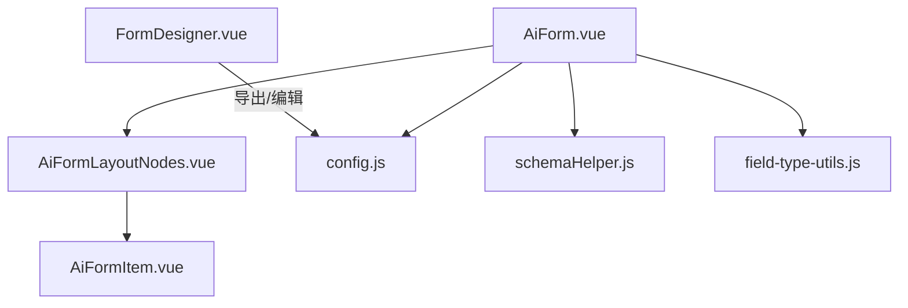
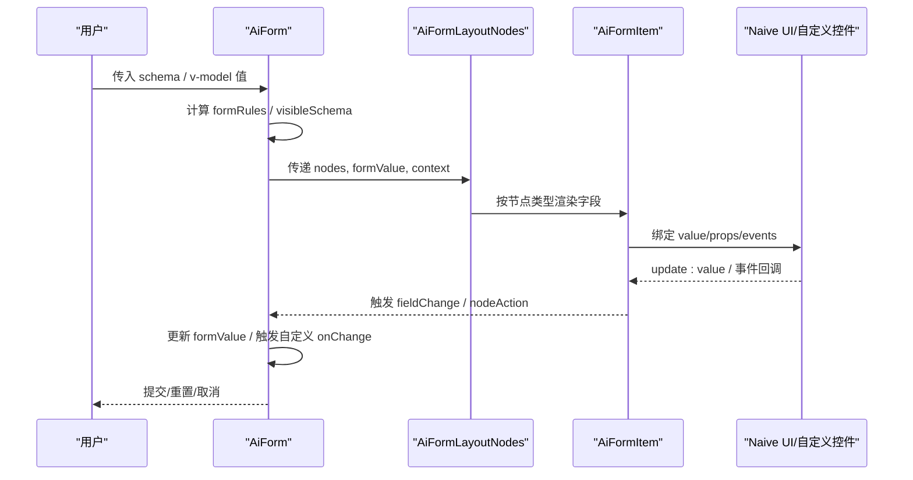
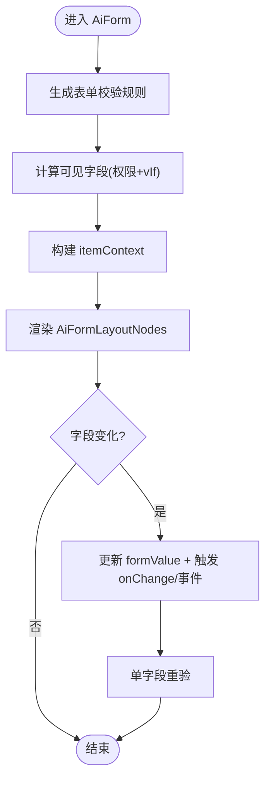
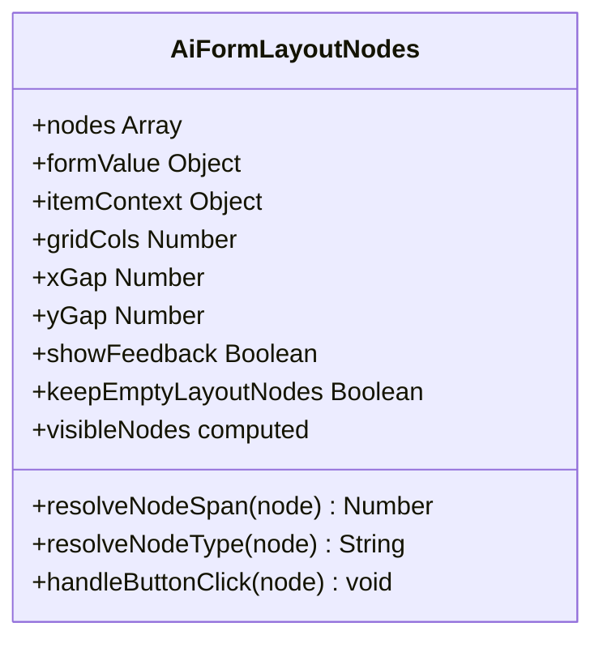
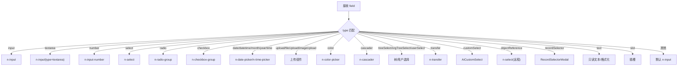
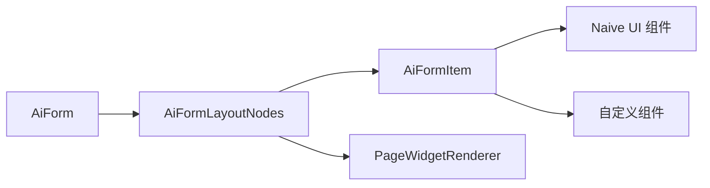

# 表单生成器

<cite>
**本文引用的文件**
- [AiForm.vue](file://forge-admin-ui/src/components/ai-form/AiForm.vue)
- [AiFormLayoutNodes.vue](file://forge-admin-ui/src/components/ai-form/AiFormLayoutNodes.vue)
- [AiFormItem.vue](file://forge-admin-ui/src/components/ai-form/AiFormItem.vue)
- [config.js](file://forge-admin-ui/src/components/ai-form/config.js)
- [schemaHelper.js](file://forge-admin-ui/src/components/ai-form/schemaHelper.js)
- [field-type-utils.js](file://forge-admin-ui/src/components/ai-form/field-type-utils.js)
- [FormDesigner.vue](file://forge-admin-ui/src/components/form-designer/FormDesigner.vue)
</cite>

## 目录
1. [简介](#简介)
2. [项目结构](#项目结构)
3. [核心组件](#核心组件)
4. [架构总览](#架构总览)
5. [详细组件分析](#详细组件分析)
6. [依赖关系分析](#依赖关系分析)
7. [性能考虑](#性能考虑)
8. [故障排查指南](#故障排查指南)
9. [结论](#结论)
10. [附录](#附录)

## 简介
本技术文档聚焦于低代码平台中的“属性面板表单生成器”，围绕基于 schema 驱动的表单自动生成机制展开，系统说明：
- 属性类型到 UI 控件的映射关系（number、select、color、boolean、textarea、json 等）
- 控件渲染逻辑与布局算法（栅格、卡片、标签页、折叠、表格等）
- 表单验证规则集成、默认值处理、占位符生成与响应式更新
- 自定义控件扩展方法、表单布局配置与性能优化策略

该生成器以 JSON Schema 为唯一数据源，通过统一的渲染管线将配置转换为可交互的表单界面，并支持运行时控制、事件联动与动态选项更新。

## 项目结构
本项目采用按功能域划分的组件组织方式，表单生成器位于 ai-form 目录下，核心由以下模块构成：
- AiForm：顶层容器，负责表单数据绑定、校验规则生成、字段可见性控制、事件总线与弹窗表单
- AiFormLayoutNodes：布局节点解析与递归渲染，支撑行/列/卡片/标签页/折叠/表格等复杂布局
- AiFormItem：具体字段渲染器，根据 type 选择对应 UI 控件，统一处理值更新、事件与展示
- config：字段类型常量与工厂函数，提供快速构建 schema 的能力
- schemaHelper：运行时动态更新字段选项与配置的辅助工具
- field-type-utils：字段类型判定工具（如数字类型、输入型类型）
- FormDesigner：可视化设计器，用于拖拽生成 schema 并导出 JSON

图表来源
- [AiForm.vue:148-280](file://forge-admin-ui/src/components/ai-form/AiForm.vue#L148-L280)
- [AiFormLayoutNodes.vue:283-341](file://forge-admin-ui/src/components/ai-form/AiFormLayoutNodes.vue#L283-L341)
- [AiFormItem.vue:78-733](file://forge-admin-ui/src/components/ai-form/AiFormItem.vue#L78-L733)
- [config.js:25-316](file://forge-admin-ui/src/components/ai-form/config.js#L25-L316)
- [schemaHelper.js:20-229](file://forge-admin-ui/src/components/ai-form/schemaHelper.js#L20-L229)
- [field-type-utils.js:1-33](file://forge-admin-ui/src/components/ai-form/field-type-utils.js#L1-L33)
- [FormDesigner.vue:313-574](file://forge-admin-ui/src/components/form-designer/FormDesigner.vue#L313-L574)

章节来源
- [AiForm.vue:148-280](file://forge-admin-ui/src/components/ai-form/AiForm.vue#L148-L280)
- [AiFormLayoutNodes.vue:283-341](file://forge-admin-ui/src/components/ai-form/AiFormLayoutNodes.vue#L283-L341)
- [AiFormItem.vue:78-733](file://forge-admin-ui/src/components/ai-form/AiFormItem.vue#L78-L733)
- [config.js:25-316](file://forge-admin-ui/src/components/ai-form/config.js#L25-L316)
- [schemaHelper.js:20-229](file://forge-admin-ui/src/components/ai-form/schemaHelper.js#L20-L229)
- [field-type-utils.js:1-33](file://forge-admin-ui/src/components/ai-form/field-type-utils.js#L1-L33)
- [FormDesigner.vue:313-574](file://forge-admin-ui/src/components/form-designer/FormDesigner.vue#L313-L574)

## 核心组件
- AiForm：表单容器，管理表单值、校验规则、字段可见性、折叠与导航、事件分发、弹窗表单与上下文注入
- AiFormLayoutNodes：布局引擎，递归解析 nodes，应用运行时控制，计算 span/gap，渲染布局容器与业务组件
- AiFormItem：字段渲染器，按 type 分派至 Naive UI 控件或自定义组件，统一处理值更新、事件、只读/禁用、占位符与格式化
- config：定义 FIELD_TYPES 与 FieldFactory，提供 createField 与各类型快捷构造
- schemaHelper：运行时更新 options、批量更新、级联更新、异步加载封装
- field-type-utils：isNumberFieldType、isInputLikeFieldType 等类型判断
- FormDesigner：可视化设计器，左侧组件库、中间画布、右侧属性面板，支持预览与导出 JSON

章节来源
- [AiForm.vue:148-280](file://forge-admin-ui/src/components/ai-form/AiForm.vue#L148-L280)
- [AiFormLayoutNodes.vue:283-341](file://forge-admin-ui/src/components/ai-form/AiFormLayoutNodes.vue#L283-L341)
- [AiFormItem.vue:78-733](file://forge-admin-ui/src/components/ai-form/AiFormItem.vue#L78-L733)
- [config.js:25-316](file://forge-admin-ui/src/components/ai-form/config.js#L25-L316)
- [schemaHelper.js:20-229](file://forge-admin-ui/src/components/ai-form/schemaHelper.js#L20-L229)
- [field-type-utils.js:1-33](file://forge-admin-ui/src/components/ai-form/field-type-utils.js#L1-L33)
- [FormDesigner.vue:313-574](file://forge-admin-ui/src/components/form-designer/FormDesigner.vue#L313-L574)

## 架构总览
表单生成器采用“Schema 驱动 + 渲染管线”的架构：
- Schema 层：JSON 描述字段、布局、校验、可见性与事件
- 渲染层：AiForm → AiFormLayoutNodes → AiFormItem，逐层解析与渲染
- 运行时：字段权限、vIf/vShow、事件总线、动态选项、弹窗表单
- 设计器：FormDesigner 产出/编辑 Schema，导出 JSON 供运行态使用

图表来源
- [AiForm.vue:348-494](file://forge-admin-ui/src/components/ai-form/AiForm.vue#L348-L494)
- [AiFormLayoutNodes.vue:339-341](file://forge-admin-ui/src/components/ai-form/AiFormLayoutNodes.vue#L339-L341)
- [AiFormItem.vue:78-733](file://forge-admin-ui/src/components/ai-form/AiFormItem.vue#L78-L733)

## 详细组件分析

### AiForm：表单容器与运行时中枢
- 职责
  - 管理表单值与校验规则，合并字段 rules 与 required
  - 计算可见字段（权限过滤 + vIf），支持折叠与分组导航
  - 注入上下文（record、route、formData、formAssets）
  - 处理字段变更、事件派发、弹窗表单打开与回填
- 关键点
  - 校验规则：collectRuntimeFieldRules + normalizeValidationRules，针对 number/date/selection 类型定制空值校验
  - 可见性：resolveRuntimeControl 与 vIf 函数/布尔值
  - 事件：createFieldEventRuntime 统一管理 FORM_LOAD、CHANGE 等事件
  - 弹窗：actionModalSchema/value/layout 支持嵌套表单

图表来源
- [AiForm.vue:348-494](file://forge-admin-ui/src/components/ai-form/AiForm.vue#L348-L494)
- [AiForm.vue:590-612](file://forge-admin-ui/src/components/ai-form/AiForm.vue#L590-L612)
- [AiForm.vue:672-682](file://forge-admin-ui/src/components/ai-form/AiForm.vue#L672-L682)

章节来源
- [AiForm.vue:148-280](file://forge-admin-ui/src/components/ai-form/AiForm.vue#L148-L280)
- [AiForm.vue:348-494](file://forge-admin-ui/src/components/ai-form/AiForm.vue#L348-L494)
- [AiForm.vue:590-612](file://forge-admin-ui/src/components/ai-form/AiForm.vue#L590-L612)
- [AiForm.vue:672-682](file://forge-admin-ui/src/components/ai-form/AiForm.vue#L672-L682)

### AiFormLayoutNodes：布局引擎与递归渲染
- 职责
  - 解析 nodes，应用运行时控制，计算 span/gap
  - 递归渲染行/列/卡片/标签页/折叠/表格/CRUD/小部件
  - 透传插槽与事件，保持父子通信一致
- 关键点
  - span 语义：相对父容器列数，避免历史补丁导致的设计/预览不一致
  - 布局样式：__designerStyle 合并 width/height/border 等
  - 表格单元格：无 children 时自动填充默认单元格
  - CRUD：从 schema/children 推导 columns/searchSchema

图表来源
- [AiFormLayoutNodes.vue:297-341](file://forge-admin-ui/src/components/ai-form/AiFormLayoutNodes.vue#L297-L341)
- [AiFormLayoutNodes.vue:365-379](file://forge-admin-ui/src/components/ai-form/AiFormLayoutNodes.vue#L365-L379)
- [AiFormLayoutNodes.vue:524-585](file://forge-admin-ui/src/components/ai-form/AiFormLayoutNodes.vue#L524-L585)

章节来源
- [AiFormLayoutNodes.vue:283-341](file://forge-admin-ui/src/components/ai-form/AiFormLayoutNodes.vue#L283-L341)
- [AiFormLayoutNodes.vue:365-379](file://forge-admin-ui/src/components/ai-form/AiFormLayoutNodes.vue#L365-L379)
- [AiFormLayoutNodes.vue:524-585](file://forge-admin-ui/src/components/ai-form/AiFormLayoutNodes.vue#L524-L585)

### AiFormItem：字段渲染器与控件映射
- 职责
  - 根据 field.type 选择对应 UI 控件（input/textarea/number/select/radio/checkbox/date/time/upload/color/cascader/treeSelect/transfer/customSelect/objectReference/recordSelector/text/slot 等）
  - 统一处理 disabled/readonly、placeholder、value 归一化、事件绑定
  - 支持只读文本展示、复制、扫码、字段事件反馈
- 关键点
  - 数字类型：isNumberFieldType 判定，n-input-number 渲染
  - 日期范围：daterange/datetimerange/timerange 特殊处理
  - 上传：n-upload、FileUpload、ImageUpload 三种上传能力
  - 远程搜索：customSelect 支持 api/method/transform
  - 对象引用：objectReference 支持远程搜索与回显
  - 记录选择器：recordSelector 弹出选择器并回填

图表来源
- [AiFormItem.vue:78-733](file://forge-admin-ui/src/components/ai-form/AiFormItem.vue#L78-L733)
- [field-type-utils.js:1-33](file://forge-admin-ui/src/components/ai-form/field-type-utils.js#L1-L33)

章节来源
- [AiFormItem.vue:78-733](file://forge-admin-ui/src/components/ai-form/AiFormItem.vue#L78-L733)
- [field-type-utils.js:1-33](file://forge-admin-ui/src/components/ai-form/field-type-utils.js#L1-L33)

### 属性类型映射与控件映射表
- number → n-input-number（支持 min/max/step/precision）
- select → n-select（支持 multiple/filterable/remote）
- color → n-color-picker（支持 modes/showAlpha）
- boolean → n-switch（checkedValue/uncheckedText）
- textarea → n-input(type=textarea)（rows/autosize）
- json → 可通过 text 配合 formatter 或 slot 自定义渲染
- date/datetime/month/year/time → n-date-picker/n-time-picker（format/valueFormat）
- cascader → n-cascader（cascade/showPath）
- treeSelect → n-tree-select（multiple/cascade）
- transfer → n-transfer（filterable）
- customSelect → AiCustomSelect（api/method/transform）
- objectReference → n-select（远程搜索）
- recordSelector → RecordSelectorModal（业务记录选择）
- upload/fileUpload/imageUpload → 多种上传组件

章节来源
- [AiFormItem.vue:78-733](file://forge-admin-ui/src/components/ai-form/AiFormItem.vue#L78-L733)
- [config.js:25-316](file://forge-admin-ui/src/components/ai-form/config.js#L25-L316)

### 表单验证规则集成
- 规则来源
  - field.rules（数组或单条）
  - field.validation（标准化为规则）
  - required 自动补充必填规则
- 特殊类型空值校验
  - number/date/selection 类型在 required 时注入自定义 validator，避免 0、空数组被误判为空
- 触发时机
  - 输入类：blur/change；数值/日期/选择类：change
- 单字段重验
  - 字段变更后调用 validate 仅对当前字段进行校验，不阻断后续填写

章节来源
- [AiForm.vue:348-494](file://forge-admin-ui/src/components/ai-form/AiForm.vue#L348-L494)
- [AiForm.vue:672-682](file://forge-admin-ui/src/components/ai-form/AiForm.vue#L672-L682)

### 默认值处理与占位符生成
- 默认值
  - 设计器创建项时设置 defaultValue，运行时由表单值初始化
- 占位符
  - getPlaceholder(field) 统一获取 placeholder，支持字段级覆盖
- 时间选择器默认值
  - resolvePickerDefaultValue 为日期/时间选择器提供默认值

章节来源
- [FormDesigner.vue:475-488](file://forge-admin-ui/src/components/form-designer/FormDesigner.vue#L475-L488)
- [AiFormItem.vue:78-733](file://forge-admin-ui/src/components/ai-form/AiFormItem.vue#L78-L733)

### 响应式更新机制
- 字段值变化
  - handleFieldChange 更新 formValue，触发 onChange 与 CHANGE 事件
- 选项动态更新
  - schemaHelper.updateFieldOptions/batchUpdateFieldOptions/createAsyncOptionsUpdater/createCascadeUpdater
- 运行时控制
  - resolveRuntimeControl 根据上下文动态控制显示/禁用/只读
- 事件总线
  - createFieldEventRuntime 管理 FORM_LOAD/CHANGE 等事件，支持状态与通知

章节来源
- [AiForm.vue:590-612](file://forge-admin-ui/src/components/ai-form/AiForm.vue#L590-L612)
- [schemaHelper.js:20-229](file://forge-admin-ui/src/components/ai-form/schemaHelper.js#L20-L229)
- [AiFormLayoutNodes.vue:339-341](file://forge-admin-ui/src/components/ai-form/AiFormLayoutNodes.vue#L339-L341)

### 自定义控件扩展方法
- 插槽扩展
  - AiFormItem 支持 slot 类型，通过 slotName 注入自定义控件
- 运行时页面小部件
  - PageWidgetRenderer 支持 widget 节点，通过 componentKey 注册与渲染
- 设计器扩展
  - 在 FormDesigner 中新增组件类型，导出标准 schema 供运行态识别

章节来源
- [AiFormItem.vue:713-721](file://forge-admin-ui/src/components/ai-form/AiFormItem.vue#L713-L721)
- [AiFormLayoutNodes.vue:242-249](file://forge-admin-ui/src/components/ai-form/AiFormLayoutNodes.vue#L242-L249)
- [FormDesigner.vue:332-361](file://forge-admin-ui/src/components/form-designer/FormDesigner.vue#L332-L361)

### 表单布局配置
- 栅格布局
  - gridCols/xGap/yGap 控制列数与间距
  - span 语义为相对父容器列数，确保设计/预览一致
- 容器布局
  - row/col/card/tabs/collapse/table 等容器节点支持嵌套与样式控制
- 按钮对齐
  - layout.align 支持 left/center/right

章节来源
- [AiFormLayoutNodes.vue:365-379](file://forge-admin-ui/src/components/ai-form/AiFormLayoutNodes.vue#L365-L379)
- [AiFormLayoutNodes.vue:587-624](file://forge-admin-ui/src/components/ai-form/AiFormLayoutNodes.vue#L587-L624)

## 依赖关系分析
- 组件耦合
  - AiForm 依赖 AiFormLayoutNodes 与 AiFormItem，形成清晰的渲染层级
  - AiFormLayoutNodes 依赖运行时控制与 PageWidgetRenderer，解耦业务组件
  - AiFormItem 依赖 field-type-utils 与各类 UI 组件，类型判断集中
- 外部依赖
  - Naive UI 组件（n-form、n-grid、n-card、n-tabs、n-collapse 等）
  - 自定义组件（DictSelect、UserSelectPicker、RegionTreeSelect、FileUpload、ImageUpload、AiCustomSelect）
- 潜在循环依赖
  - 通过 defineAsyncComponent 懒加载 AiCrudPage，避免启动时强依赖

图表来源
- [AiForm.vue:148-280](file://forge-admin-ui/src/components/ai-form/AiForm.vue#L148-L280)
- [AiFormLayoutNodes.vue:283-341](file://forge-admin-ui/src/components/ai-form/AiFormLayoutNodes.vue#L283-L341)
- [AiFormItem.vue:78-733](file://forge-admin-ui/src/components/ai-form/AiFormItem.vue#L78-L733)

章节来源
- [AiForm.vue:148-280](file://forge-admin-ui/src/components/ai-form/AiForm.vue#L148-L280)
- [AiFormLayoutNodes.vue:283-341](file://forge-admin-ui/src/components/ai-form/AiFormLayoutNodes.vue#L283-L341)
- [AiFormItem.vue:78-733](file://forge-admin-ui/src/components/ai-form/AiFormItem.vue#L78-L733)

## 性能考虑
- 懒加载
  - AiCrudPage 使用 defineAsyncComponent 按需加载，减少首屏体积
- 计算缓存
  - 大量使用 computed 缓存 visibleSchema、formRules、sectionNavItems 等，避免重复计算
- 最小化重渲染
  - 通过 key 唯一性策略（node.key > id > field）保证 diff 稳定，避免不必要的重建
- 事件节流
  - 字段事件通过 createFieldEventRuntime 统一管理，避免频繁触发
- 选项加载
  - 使用 createAsyncOptionsUpdater 与 createCascadeUpdater 封装异步加载与错误处理，提升用户体验

章节来源
- [AiFormLayoutNodes.vue:336-337](file://forge-admin-ui/src/components/ai-form/AiFormLayoutNodes.vue#L336-L337)
- [AiFormLayoutNodes.vue:381-389](file://forge-admin-ui/src/components/ai-form/AiFormLayoutNodes.vue#L381-L389)
- [schemaHelper.js:143-159](file://forge-admin-ui/src/components/ai-form/schemaHelper.js#L143-L159)

## 故障排查指南
- 字段未渲染
  - 检查 field.type 是否匹配已知类型；确认 vIf/visibility 控制未隐藏
- 校验不生效
  - 确认 field.rules 与 validation 已正确传入；number/date/selection 类型需自定义空值校验
- 选项未更新
  - 使用 schemaHelper.updateFieldOptions 或 createAsyncOptionsUpdater 更新；检查异步函数是否正确返回 options
- 布局错乱
  - 检查 span 是否为有效数字；确认父容器 gridCols 与子节点 span 关系合理
- 事件未触发
  - 检查 field.onChange 与 fieldEventRuntime 规则是否配置；确认事件名称与触发时机

章节来源
- [AiForm.vue:348-494](file://forge-admin-ui/src/components/ai-form/AiForm.vue#L348-L494)
- [schemaHelper.js:20-229](file://forge-admin-ui/src/components/ai-form/schemaHelper.js#L20-L229)
- [AiFormLayoutNodes.vue:365-379](file://forge-admin-ui/src/components/ai-form/AiFormLayoutNodes.vue#L365-L379)

## 结论
本表单生成器以 schema 为核心，实现了高度可配置、可扩展的低代码表单能力。通过统一的渲染管线、灵活的布局引擎与完善的运行时机制，能够快速构建复杂业务表单，并支持可视化设计与动态更新。建议在扩展新控件时遵循现有类型映射规范，利用 schemaHelper 与 field-event-runtime 增强交互体验，同时关注性能优化与错误处理，确保生产环境的稳定性。

## 附录
- 常用字段工厂
  - 使用 FieldFactory 快速创建 input、textarea、select、radio、checkbox、date、datetime、time、slider、rate、color、cascader、treeSelect、transfer、upload、slot、text、customSelect 等字段
- 设计器导出
  - 通过 FormDesigner 导出 JSON schema，供运行态 AiForm 直接使用

章节来源
- [config.js:67-316](file://forge-admin-ui/src/components/ai-form/config.js#L67-L316)
- [FormDesigner.vue:538-548](file://forge-admin-ui/src/components/form-designer/FormDesigner.vue#L538-L548)